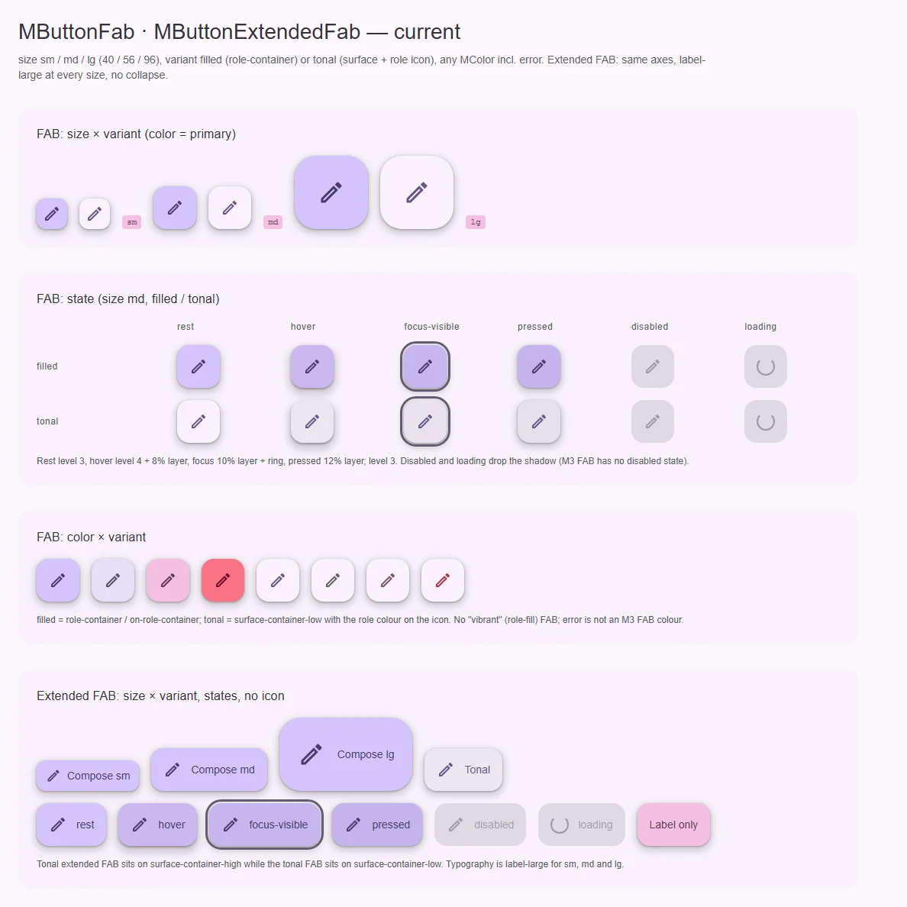
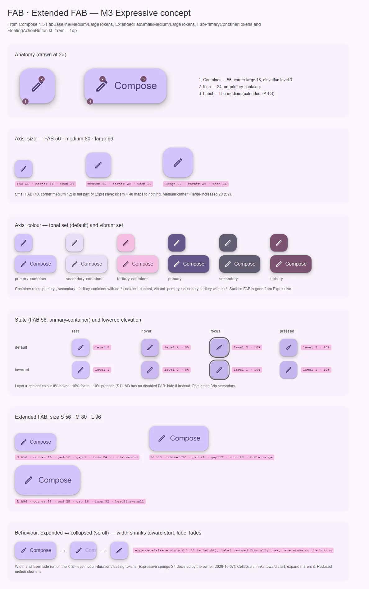

# MButtonExtendedFab — плавающая кнопка с подписью

<identity>M3: Extended FAB (Small, Medium, Large) · Токены Compose: `ExtendedFabSmallTokens`, `ExtendedFabMediumTokens`, `ExtendedFabLargeTokens`, `ExtendedFabPrimaryTokens` (baseline), `FabPrimaryContainerTokens`; поведение — `FloatingActionButton.kt` (`SmallExtendedFloatingActionButton` … `LargeExtendedFloatingActionButton`, параметр `expanded`) · Код: `src/runtime/components/ui/button/extended-fab/`, токены `assets/stylesheet/components/button/extended-fab/_index.scss` · Аудит: `data/button.json` (общий с семьёй) · Тип: public</identity>

<implementation-status state="done" updated="2026-10-07">Реализовано. Лестница `density` 40 / 56 / 96 как у FAB: 56 и 96 — значения M3 Expressive S и L (шрифт, иконка, отступы, радиус), 40 — значения кита. В-1: только проп `expanded`; свёрнутая кнопка — квадрат ступени, подпись остаётся доступным именем (`sr-only`), ширина анимируется через `interpolate-size`, где он есть.</implementation-status>

## Вердикт

**переработка.** Средняя ступень кита (56, радиус 16, отступ 16, зазор 12) — это baseline extended FAB
M3. В Expressive extended FAB вырос в три размера с растущей типографикой (title-medium → title-large
→ headline-small), а кит пишет label-large на всех ступенях и держит снятую ступень 40. Главное
отсутствующее поведение — сворачивание в обычный FAB при прокрутке (`expanded`).

## Рендеры

| Сейчас | Концепт M3 |
|---|---|
|  |  |

Доска общая с FAB. Кадры для этого плана: анатомия extended FAB (1 контейнер, 2 иконка, 3 подпись);
цветовые наборы; extended FAB S/M/L с выносками; поведение expanded → collapsing → collapsed.

## Анатомия

| № | Часть M3 | Элемент кита | Статус |
|---|---|---|---|
| 1 | Container | корень `.ui-extended-fab` | есть |
| 2 | Icon (необязательная) | слот `#prepend` → `.ui-extended-fab__icon` | есть |
| 3 | Label text | `.ui-extended-fab__label` | есть; label-large на всех ступенях |
| — | Индикатор загрузки | `.ui-extended-fab__spinner` | расширение кита |

## Оси дизайна

| Ось | M3 Expressive | Кит сейчас | Цель | Ломает API |
|---|---|---|---|---|
| Размер | S 56 · M 80 · L 96 | `sm \| md \| lg` = 40 / 56 / 96 (`_index.scss:43-45`) | лестница FAB (fab.md В-1) | да |
| Цветовой набор | как у FAB | `filled` = контейнер, `tonal` = surface-container-**high** (`_index.scss:11, 35`) | как у FAB (fab.md В-2) | да |
| Сворачивание | `expanded: Boolean` | нет | проп `expanded` (В-1) | нет |

### Лестница

| Ступень | Высота | Радиус | Отступ | Зазор | Иконка | Шрифт |
|---|---|---|---|---|---|---|
| S | 56 | large 16 | 16 / 16 | 8 | 24 | title-medium |
| M | 80 | large-increased 20 | 26 / 26 | 12 | 28 | title-large |
| L | 96 | extra-large 28 | 28 / 28 | 16 | 32 | headline-small |

Зазоры M и L — из кода `FloatingActionButton.kt` (`MediumExtendedFabIconPadding = 12`,
`LargeExtendedFabIconPadding = 16`): токены там помечены «incorrect» (16 и 20). Минимальная ширина =
высота ступени. Baseline extended FAB (`ExtendedFabPrimaryTokens`): 56, label-large, иконка 24, отступы
16 / 20, зазор 12 — сегодняшнее `md` кита почти он (у кита отступ 16 с обеих сторон).

## Оси состояний

| Ось | Нужно | Есть | Не хватает |
|---|---|---|---|
| Базовое | enabled (M3 disabled нет) | enabled, disabled | disabled — как у FAB (fab.md В-3) |
| Взаимодействие | rest 3, hover 4 + 8%, pressed 10% | есть, pressed 12% | S1 |
| Фокус | кольцо + 10% | есть (фаза C) | — |
| Раскрытие | expanded / collapsed | нет | В-1 |
| Данные | у M3 нет | loading | — |

## Токены: расхождения

| Часть | M3 | Кит (`extended-fab/_index.scss`) | Действие |
|---|---|---|---|
| Высоты | 56 / 80 / 96 | 40 / 56 / 96 (`:43-45`) | лестница |
| Радиусы | 16 / 20 / 28 | 12 / 16 / 28 (`:48-50`) | лестница, 20 ждёт S2 |
| Отступы | 16 / 26 / 28 | 12 / 16 / 24 (`:53-55`) | лестница |
| Зазоры | 8 / 12 / 16 | 8 / 12 / 16 (`:58-60`) | совпадают по номерам, но сдвинуты на ступень |
| Иконки | 24 / 28 / 32 | 20 / 24 / 36 (`:71-73`) | лестница |
| Шрифт | title-medium / title-large / headline-small | label-large на всех (`extended-fab/index.vue:60`) | по ступени |
| Surface-вариант | снят | surface-container-high, а у FAB — surface-container-low | уходит вместе с fab.md В-2; до того — хотя бы один тон на оба |
| Pressed | 10% | 12% | S1 |

## Поведение и доступность

- **Сворачивание.** `expanded=false`: ширина сжимается к началу до минимальной (= высоте), подпись
  гаснет; при раскрытии — обратный ход. Ширина и прозрачность — на токенах
  `--sys-motion-duration-*`/`easing-*`: пружины Expressive (S4) владелец отклонил 2026-10-07.
  Анимировать ширину можно через `interpolate-size: allow-keywords` / `calc-size()` там, где они есть,
  и мгновенно там, где нет (feature detection; без полифилов, как в overlay-top-layer.md).
- **Имя при сворачивании.** Подпись не удаляется из DOM, а становится визуально скрытой (`sr-only`):
  кнопка сохраняет доступное имя. Compose обнуляет семантику текста и ждёт `contentDescription` от
  потребителя — на вебе это сделало бы свёрнутую кнопку безымянной.
- **Без иконки.** Extended FAB без иконки свернуть нельзя (нечего показать) — dev-предупреждение на
  `expanded=false` без `#prepend`.
- Reduced motion: переход укорачивается (системные токены), не выключается.

## API

| Изменение | Тип | Ломает | Миграция |
|---|---|---|---|
| Размер | как FAB (fab.md В-1) | да | как FAB |
| `variant` | как FAB (fab.md В-2) | да | как FAB |
| `expanded` | `boolean`, дефолт `true` | нет | — |

## План работ

1. **S** — Лестница S/M/L и шрифты по ступени в `extended-fab/_index.scss` и `index.vue`. Зависит от
   fab.md В-1, S2.
2. **S** — Наборы цвета по fab.md В-2; до решения — выровнять surface-тон с FAB.
3. **M** — `expanded`: модификатор, анимация ширины, `sr-only`-подпись, dev-предупреждение без иконки.
   Зависит от В-1. Файлы: `extended-fab/props.ts`, `extended-fab/index.vue`.
4. **S** — Pressed 10% (СВ-1).

## Тесты

- `fixtures/button/family.vue`: три ступени × наборы; строка `expanded=false`.
- e2e: свёрнутая кнопка сохраняет имя (`getByRole('button', { name })`); ширина свёрнутой = высоте;
  axe; reduced motion не ломает переход.
- unit: `expanded=false` скрывает подпись визуально, но не удаляет; dev-предупреждение без иконки.

## Готово, когда

- [ ] S/M/L совпадают с таблицей лестницы, включая шрифты.
- [ ] `expanded=false` сворачивает до круга-квадрата ступени, имя сохраняется.
- [ ] Цветовые наборы общие с FAB.
- [ ] Линтеры, typecheck, vitest, e2e — зелёные.

## Предложения по UX

Расширения сверх паритета с M3. Это предложения владельцу, а не шаги плана: в работу попадают только
одобренные. Без анимаций Expressive и без новых зависимостей.

| Предложение | Что получает пользователь | Заказчик | Цена | Рекомендация |
|---|---|---|---|---|
| Тултип у свёрнутой кнопки | Когда подпись скрыта (`expanded=false`), видит её тултипом при наведении и фокусе | Списки с прокруткой, где FAB свёрнут | S: `MTooltip` с текстом подписи, только в свёрнутом состоянии; API — нет | Да |
| Сворачивание по ширине контейнера | На узком экране кнопка сама становится круглой, на широком — с подписью | Адаптивные страницы, боковые панели | S: CSS container query по `inline-size` (decisions.md разрешает только его); API — значение `expanded: 'auto'` | Обсудить: ширина — плохой прокси (decisions.md), но для сворачивания подписи она и есть причина |

## Открытые вопросы

**В-1. Кто управляет сворачиванием.**

1. Только проп `expanded`; потребитель сам решает, когда сворачивать (прокрутка, фокус, ширина
   экрана). Минимум логики в ките, но каждый продукт пишет одно и то же.
2. Проп `expanded` плюс композабл `useScrollCollapse(target)` рядом, который отдаёт `expanded` по
   направлению прокрутки. Переиспользуемо (app bar делает то же), но новый композабл.
3. Встроенный проп `collapseOnScroll`. Удобно, но компонент начинает слушать прокрутку чужого
   контейнера.

Рекомендация: 1 сейчас; 2 — вместе с app bar, когда появится второй заказчик того же поведения.
