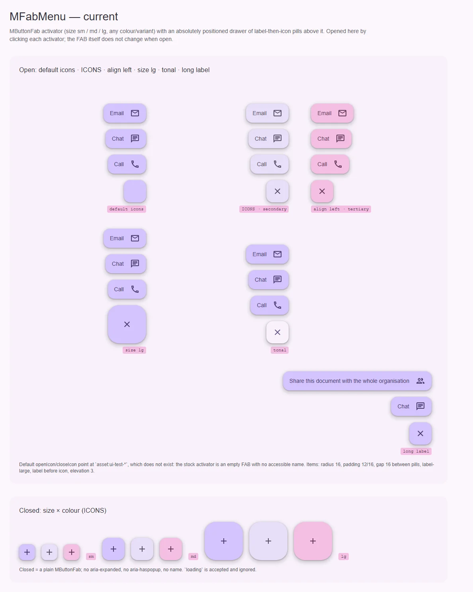
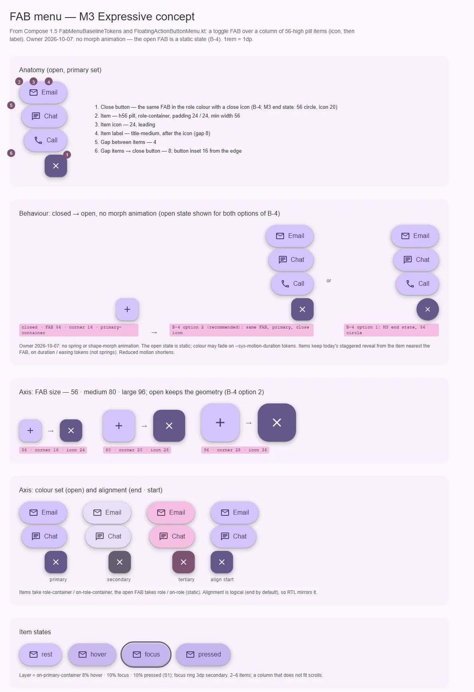

# MFabMenu — FAB, раскрывающийся в столбец родственных действий

<identity>M3: FAB menu (M3 Expressive) · Токены Compose: `FabMenuBaselineTokens` (+ `FabBaselineTokens`, `FabMediumTokens`, `FabLargeTokens`, `FabPrimaryContainerTokens` для кнопки); поведение — `FloatingActionButtonMenu.kt` (`FloatingActionButtonMenu`, `FloatingActionButtonMenuItem`, `ToggleFloatingActionButton`) · Код: `src/runtime/components/ui/fab-menu/`, композабл `src/runtime/composables/useFabMenu.ts`, токены `assets/stylesheet/components/fab-menu/_index.scss` · Аудит: `data/fab-menu.json` · Тип: public</identity>

<implementation-status state="planned" updated="2026-10-07">Исследование, рендеры и перепроверка аудита готовы. Код не менялся. Ждут решения В-1…В-4 и решений по FAB (button/fab.md В-1, В-2). Учтено решение владельца от 2026-10-07: пружин и анимированного морфа нет, открытое состояние FAB статично (В-4).</implementation-status>

## Вердикт

**переработка.** Состав частей верный: FAB, столбец действий над ним, выезд с задержкой от ближнего к
FAB пункта, закрытие по клику снаружи. Но всё остальное разошлось с M3. FAB при открытии не меняет
цвет (M3 вдобавок превращает его в круглую кнопку закрытия анимацией — кит морф не делает, см. В-4).
Пункты — это прямоугольники с радиусом 16, подписью label-large
впереди и иконкой сзади, а у M3 — пилюли высотой 56 с иконкой, затем title-medium. Иконки по умолчанию
указывают на несуществующую коллекцию, так что стоковый FAB пуст и безымянен. Нет `aria-expanded`,
Escape, управления фокусом, `v-model:open`; RTL сломан физическими сторонами.

## Рендеры

| Сейчас | Концепт M3 |
|---|---|
|  |  |

Сейчас (меню открыты кликом по FAB): иконки по умолчанию — пустой FAB; `ICONS` + secondary;
`align="left"` + tertiary; размер `lg`; `variant="tonal"`; длинная подпись, уходящая за край.
Ниже — закрытые FAB по размерам и ролям.

Концепт: анатомия открытого меню (шесть частей); поведение closed → open без анимации морфа, открытое
состояние в двух вариантах В-4 (рекомендованный — тот же FAB в цвете роли; M3 — круг 56); три размера
FAB, которые в открытом виде сохраняют геометрию (вариант 2 В-4); цветовые наборы primary / secondary /
tertiary и выравнивание по началу; состояния пункта.

## Анатомия

| № | Часть M3 | Элемент кита | Статус |
|---|---|---|---|
| 1 | Toggle FAB / close button: закрыт — FAB 56/80/96, открыт — круг 56, цвет роли, иконка 20 (у M3 — анимированный морф) | `<m-button-fab>` (`index.vue:21-46`), иконка меняется plus → close с поворотом 90° (`:158-169`) | иначе: цвет не меняется; форма — по В-4, без морфа |
| 2 | Menu item: пилюля h56, `<role>-container`, отступ 24 / 24, мин. ширина 56 | `.ui-fab-menu__item` (`:69-85`), радиус 16, отступ 12 / 16 (`_index.scss:49-51`) | иначе |
| 3 | Item icon 24, впереди | `m-icon` после подписи (`:80-84`) | иначе: порядок обратный |
| 4 | Item label, title-medium | `.ui-fab-menu__label`, label-large (`_index.scss:47`) | иначе |
| 5 | Зазор между пунктами 4 | `list.gap: 16rem` (`_index.scss:30`) | иначе |
| 6 | Зазор пункты → кнопка 8 | `drawer.margin.bottom: 16rem` (`_index.scss:25-27`) | иначе |

## Оси дизайна

| Ось | M3 | Кит сейчас | Цель | Ломает API |
|---|---|---|---|---|
| Цветовой набор | primary / secondary / tertiary: FAB и пункты — `<role>-container`, открытая кнопка — `<role>` | `color` (вкл. `error`) + `variant` FAB | `color` остаётся; `variant` уходит вместе с surface FAB (button/fab.md В-2) | да (`variant`) |
| Размер FAB | 56 / 80 / 96, открытая кнопка всегда 56 | `size: sm \| md \| lg` FAB | лестница FAB (button/fab.md В-1); размер открытой кнопки — В-4 | да |
| Выравнивание | `horizontalAlignment`, по умолчанию End, логическое | `align: 'left' \| 'right'`, физическое (`props.ts:19, 28`) | `'start' \| 'end'` | да |

## Оси состояний

| Ось | Нужно | Есть | Не хватает |
|---|---|---|---|
| Базовое | enabled, disabled FAB; disabled пункта | disabled FAB | disabled пункта; `loading` объявлен и ничего не делает (ST-01) |
| Взаимодействие | hover 8%, pressed 10% на пунктах, слой цветом контента | hover/pressed внутри `can-hover` (`:292`), но слой — on-surface (`_index.scss:16-17`) | слой on-`<role>`-container (TH-01) |
| Фокус | кольцо на пункте и кнопке | `@include focus-ring` (`:310-312`), у FAB — свой | — |
| Раскрытие | closed / open, программно и через v-model | внутренний `isOpen` (`useFabMenu.ts:46`), только визуально | `aria-expanded`, `aria-controls`, Escape, `v-model:open` |

## Токены: расхождения

| Часть | M3 (`FabMenuBaselineTokens`, `FloatingActionButtonMenu.kt`) | Кит (`fab-menu/_index.scss`) | Действие |
|---|---|---|---|
| Высота пункта | 56, мин. ширина 56 | авто: отступ 12 по высоте + label-large | 56 |
| Форма пункта | full | 16 (`:49`) | full |
| Отступы пункта | 24 / 24 | 12 / 16 (`:51`) | 24 / 24 |
| Иконка–подпись | 8, иконка впереди | 16 (`:46`), подпись впереди | 8, порядок M3 |
| Шрифт | title-medium | label-large (`:47`) | title-medium |
| Зазор пунктов | 4 | 16 (`:30`) | 4 |
| Пункты → кнопка | 8 | 16 (`:26`) | 8 |
| Тень пункта | level 3 (`ListItemContainerElevation`; реализация Compose её не рисует) | `elevation(3)` (`:52`) | В-3 |
| Открытая кнопка | 56, full, иконка 20, level 3, цвет роли (с морфом) | FAB не меняется | по В-4: ветка `open.*` (цвет роли, иконка закрытия), без анимации формы и размера |
| Слой состояния | контент пункта (on-`<role>`-container) | on-surface (`:16-17`) | TH-01 |
| Stagger | пружина slow effects по числу пунктов | `50ms` литерал (`:65`) | токен длительности `--sys-motion-duration-*` (пружины S4 отклонены владельцем) |
| Запас под тень | — | `clip-path: inset(-40rem …)` литералом в `.vue` (`index.vue:247, 274, 279`) | токен `item.clip-outset` (TK-07) |

## Поведение и доступность

Модель M3 (Compose): кнопка — переключатель; Tab или стрелка вниз с кнопки ведут фокус на **верхний**
пункт; столбец пунктов идёт в порядке чтения перед кнопкой; не помещающийся столбец прокручивается.

- **Паттерн ARIA** — В-1. В обоих вариантах: имя кнопки обязательно (проп `ariaLabel`, dev-предупреждение
  по образцу `useButtonNameWarning`, без дефолтной английской строки — craft.md §6), `aria-expanded`,
  `aria-controls` на `id` столбца (`useId()`), Escape закрывает и возвращает фокус на кнопку, после
  выбора пункта фокус тоже возвращается на кнопку.
- **Порядок фокуса (A11-09).** Кнопка в DOM стоит раньше столбца, поэтому Tab с неё уходит на верхний
  пункт — это ровно поведение Compose («focus order should go from the fab menu button to the first item
  at the top»). Пункт закрывается вместе с решением В-1, переделывать порядок DOM не нужно.
- **Слой поведения.** `useFabMenu` сегодня отдаёт только `isOpen`/`open`/`close`/`toggle`/`select`.
  Атрибуты (`activatorAttrs`, `listAttrs`, `getItemAttrs(i)`) и клавиатура переезжают в него по
  behavior.md (бэги без классов и `data-*`) и раздаются в слот `#activator` — сегодня кастомный
  активатор не может получить `aria-expanded` (A11-06).
- **Пустой список (DT-03).** Без пунктов и без слота кнопка не открывает пустой столбец.
- **Длинные подписи (CT-01…04).** `max-width` пункта от ширины вьюпорта, `min-width: 0` у подписи,
  перенос строки вместо `nowrap`; полный текст остаётся доступным именем пункта.
- **Высота (CT-08, CT-10, RS-10).** Столбец ограничен доступной высотой и прокручивается
  (`overscroll-behavior: contain`), как `verticalScroll` в Compose; dev-предупреждение при > 6 пунктах.
- **RTL (LY-10).** `inset-inline-end`, логическое выравнивание, сдвиг выезда с учётом направления.
- **Forced colors (TH-04).** Пункты теряют фон и тень — рамка `ButtonText`.
- **Reduced motion (A11-18).** Длительности medium-* уже сжимаются системно (`_animations.scss:44`);
  stagger-литерал 50ms и выезд по `clip-path` — нет. Перевод на системные токены длительности (не
  пружины: S4 отклонён) закрывает пункт.
- **Явные импорты.** Внутри кита `<m-button-fab>` и `<m-icon>` берутся автоимпортом
  (`index.vue:21, 34, 39, 80`) — правило кита требует явного импорта UI-компонентов.

## Перепроверка аудита (`data/fab-menu.json`)

В аудите 50 FAIL, из них 30 с приоритетом P1 по чеклисту. По текущему коду:

| Статус сейчас | P1 | Где закрывается |
|---|---|---|
| Исправлено после аудита | IN-01 (`can-hover`, `index.vue:292`), IN-04 (`focus-ring`, `:310`), TK-01 (тень через `elevation(3)`), LY-06 (литералы 1–2 внутри `isolation: isolate` — разрешённая форма по craft.md §12) | — |
| Принятое отклонение | RS-04, RS-05 (vw-масштаб) | — |
| Системное | TK-03 (трекинг в `typescale`) | вне компонента |
| Открыто | ST-01, DT-03, CT-01, CT-02, CT-03, CT-04, LY-05, TK-02, TK-04, TH-01, TH-04, A11-01, A11-02, A11-06, A11-08, A11-18 (частично), EN-01, EN-02, TS-01, TS-02, TS-03, TS-05 | шаги 1–8 |
| Совпадает с M3 после В-1 | A11-09 | шаг 2 |

P2, всё ещё открытые: ST-05 (литералы прозрачности ушли, источник слоя остался — вместе с TH-01),
CT-08, CT-09, CT-10, CT-13, LY-04, LY-10, RS-10, TK-06, TK-07, MO-05, EN-05, TS-07. TS-04 и DC-* —
принятое / репозиторий `docs`.

## API

| Изменение | Было | Станет | Ломает | Миграция |
|---|---|---|---|---|
| `v-model:open` | нет | `open: boolean` + `update:open` | нет | — |
| `ariaLabel` | нет (имя неоткуда взять) | `string`, dev-предупреждение без него | нет | — |
| `align` | `'left' \| 'right'` | `'start' \| 'end'`, дефолт `'end'` | да | `left` → `start`, `right` → `end`, dev-предупреждение на релиз |
| `openIcon` / `closeIcon` | `asset:ui-test-plus` / `asset:ui-test-close` (`props.ts:29-30`) | `ICONS.add` / `ICONS.close` | нет (исправление) | — |
| `loading` | объявлен, игнорируется | удалён | да (только тип) | убрать из вызова |
| `variant` | `MVariant` | удалён (зависит от button/fab.md В-2) | да | — |
| `size` | `sm \| md \| lg` | лестница FAB (button/fab.md В-1) | да | как у FAB |
| `MFabMenuItem` | `{ label?, icon?, value?, action? }` | `{ label: string, icon?, value?, action?, disabled? }` | да (тип: `label` обязателен) | у пунктов без подписи — добавить подпись |
| слот `#activator` | `{ isOpen, toggle, open, close, disabled }` | + `activatorAttrs` | нет | — |

## План работ

1. **S** — Гигиена: явные импорты; `type="button"` у пунктов (A11-01); дефолтные иконки из `ICONS`
   (EN-01, CT-09); слой на on-`<role>`-container (TH-01, ST-05); forced colors (TH-04); отступы через
   `spacing()` (LY-04); `item.clip-outset` и stagger в токены (TK-02, TK-04, TK-07, MO-05). Файлы:
   `fab-menu/index.vue`, `fab-menu/props.ts`, `fab-menu/_index.scss`.
2. **M** — Доступность и клавиатура по В-1: `ariaLabel`, `aria-expanded`/`aria-controls`, Escape,
   возврат фокуса, стрелка вниз с кнопки на верхний пункт, `activatorAttrs` в слот. Бэги — в
   `useFabMenu` (behavior.md), спека на анонимной разметке. Закрывает A11-02, A11-06, A11-08, A11-09,
   CT-13.
3. **S** — `v-model:open` (EN-02, EN-05); пустой список не открывается (DT-03); `disabled` пункта и
   удаление `loading` (ST-01).
4. **M** — Геометрия пунктов M3: h56, full, 24/24, иконка впереди, title-medium, зазоры 4 и 8.
   Зависит от В-3.
5. **S** — Открытое состояние кнопки по В-4: цвет `<role>-container` → `<role>` и иконка закрытия;
   форма и размер — без анимации (решение владельца, S3/S4 отклонены); переход цвета — на токенах
   длительности. Зависит от В-4, button/fab.md В-1, В-2.
6. **S** — Длинные подписи и высота: `max-width`, перенос, прокрутка, предупреждение > 6 (CT-01…04,
   CT-08, CT-10, RS-10). Позиционирование — по В-2.
7. **S** — RTL: логические стороны, `align: start | end` с предупреждением (LY-10).
8. **S** — Reduced motion: stagger и выезд на системных токенах длительности (A11-18).
9. **M** — Фикстуры `playground/fixtures/fab-menu/{matrix,stress}.vue` и `fab-menu.e2e.ts` (TS-01,
   TS-02, TS-03, TS-05, TS-07).

## Тесты

- `matrix.vue`: закрыто / открыто × primary / secondary / tertiary × start / end × три размера FAB;
  disabled FAB; пункт disabled.
- `stress.vue`: 8 пунктов, длинная подпись, длинное слово, пустой `items`, RTL, 320px.
- e2e: axe в открытом состоянии (свет/тьма × ltr/rtl); Tab и стрелка вниз с кнопки на верхний пункт;
  Escape закрывает и возвращает фокус; выбор пункта закрывает и возвращает фокус; `aria-expanded`
  следует состоянию; клик снаружи закрывает; столбец не выходит за вьюпорт и прокручивается; forced
  colors — у пунктов рамка; нет горизонтальной прокрутки страницы на 360/768/1366.
- unit: `useFabMenu` — бэги без `class`/`data-*`; `v-model:open`; пустой список; dev-предупреждения
  (`ariaLabel`, `align: left|right`).

## Готово, когда

- [ ] Открытая кнопка — по В-4, без анимации морфа; пункты — пилюли 56 с иконкой впереди.
- [ ] Стоковый FAB с иконкой и именем; `aria-expanded`, Escape и возврат фокуса работают.
- [ ] `v-model:open`, `align: start | end`, RTL.
- [ ] Длинные подписи и много пунктов не выходят за экран.
- [ ] Все P1 из таблицы перепроверки, кроме принятых и системных, — PASS; `_build.mjs --check fab-menu`
      без ошибок.
- [ ] Линтеры, typecheck, vitest, e2e — зелёные.

## Предложения по UX

Расширения сверх паритета с M3. Это предложения владельцу, а не шаги плана: в работу попадают только
одобренные. Без анимаций Expressive и без новых зависимостей.

| Предложение | Что получает пользователь | Заказчик | Цена | Рекомендация |
|---|---|---|---|---|
| Подложка (scrim) при открытом меню | Фон приглушается, внимание на действиях; нажатие по подложке закрывает меню — большая цель на телефоне | Мобильные экраны с плотным содержимым | S: полупрозрачный слой на `--md-sys-color-scrim`; API — проп; не мешает клику снаружи (он остаётся) | Обсудить: в M3 подложки нет |
| Закрытие при навигации | Меню не остаётся открытым после перехода на другую страницу | Любое SPA на Nuxt | S: наблюдение за маршрутом в `useFabMenu`; API — нет | Да |
| Цифры 1–6 вызывают пункт | Открыл меню — нажал цифру, без стрелок и Tab | Пользователи клавиатуры | S: обработчик в `useFabMenu`, номер виден в тултипе пункта; API — нет | Отложить: польза только на десктопе, где FAB редок |

## Открытые вопросы

**В-1. Паттерн ARIA для меню FAB.**

1. Disclosure: кнопка с `aria-expanded` + `aria-controls`, пункты — обычные кнопки в списке, Tab идёт
   по пунктам, Escape закрывает. Совпадает с поведением Compose (Tab с кнопки на верхний пункт), без
   новой клавиатуры.
2. Menu button (APG): `aria-haspopup="menu"`, `role="menu"` / `menuitem`, фокус переходит в меню при
   открытии, стрелки, Home/End. Переиспользует клавиатуру `MMenu`, но скринридер услышит «меню», а
   пункты станут недоступны по Tab.

Рекомендация: 1.

**В-2. Где живёт столбец пунктов.**

1. Остаётся в потоке рядом с FAB (`position: absolute` внутри кластера) плюс ограничение высоты и
   прокрутка, как в Compose. Просто, но столбец режется предком с `overflow: hidden` (LY-05) — в
   документации кластер ставится в фиксированный угол экрана.
2. Верхний слой (popover + якорное позиционирование, как в overlay-top-layer.md). Не режется предками,
   но FAB и столбец живут в разных слоях: смену вида кнопки и выезд пунктов надо синхронизировать.

Рекомендация: 1; LY-05 закрывается документацией, пока нет заказчика FAB menu внутри карточки.

**В-3. Тень пунктов.**

1. Level 3, как в токенах (`ListItemContainerElevation`) и как сейчас в ките.
2. Без тени, как рисует реализация Compose (`Surface` без `shadowElevation`).

Рекомендация: 1 — токены старше реализации (common.md §1), и кит уже так рисует.

**В-4. Как выглядит открытая кнопка без морфа.** Появился после решения владельца 2026-10-07 (S3/S4
отклонены): у M3 FAB анимированно превращается в круг 56 цвета роли; без анимации это скачок формы и
размера.

1. Статичный конечный вид M3: круг 56, `<role>`, иконка закрытия 20. Совпадает с M3, но у среднего (80)
   и большого (96) FAB размер прыгает до 56 без перехода.
2. Тот же FAB: размер и угол сохраняются, меняются только цвет (`<role>-container` → `<role>`, переход на
   токене длительности) и иконка (add → close). Ни формы, ни размера не скачет.
3. Как сейчас: меняется только иконка. Ноль работы, но открытое состояние не отличается цветом.

Рекомендация: 2 — цвет и глиф несут «открыто/закрыть» без геометрического скачка; концепт нарисован
по нему, вариант 1 показан рядом.
