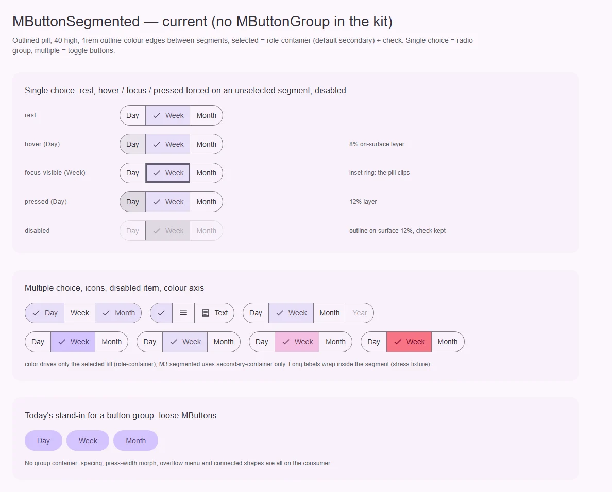
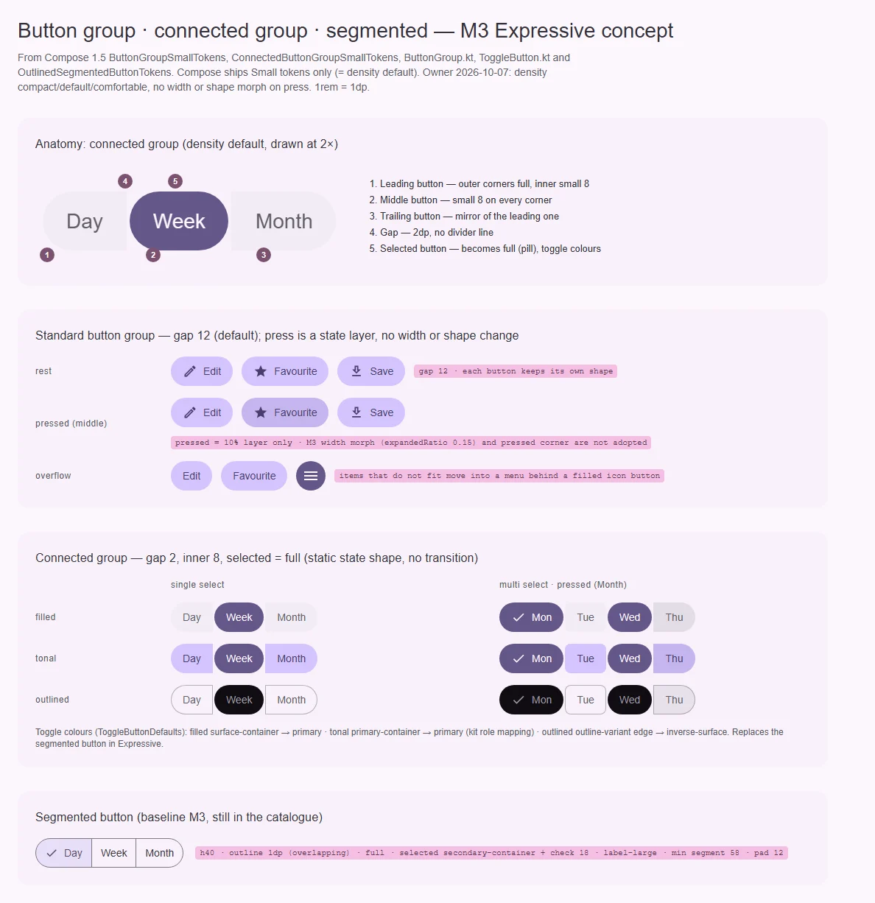

# MButtonGroup — ряд связанных кнопок (standard и connected)

<identity>M3: Button groups — standard и connected (M3 Expressive; connected заменяет segmented button) · Токены Compose: `ButtonGroupSmallTokens`, `ConnectedButtonGroupSmallTokens` (+ цвета toggle-кнопок из `FilledButtonTokens`, `TonalButtonTokens`, `ElevatedButtonTokens`, `OutlinedButtonTokens`); поведение — `ButtonGroup.kt` (`ButtonGroup`, `ButtonGroupDefaults`, `animateWidth`, overflow), `ToggleButton.kt` · Код: нет (предлагается `src/runtime/components/ui/button/group/`) · Аудит: нет (компонента нет) · Тип: public</identity>

<implementation-status state="done" updated="2026-10-07">Реализовано частично по решению владельца: только connected-группа как `MButtonGroup` (`items` + `v-model` / `multiple`, radiogroup / toggle-кнопки на движке segmented). Standard group отложена до заказчика (В-1 → один компонент; В-2 connected на `items`; В-4 переполнение отложено). Зазор 2 и внутренние углы 8 на всех ступенях (Compose и MDC задают только S; MDC применяет то же правило ко всем размерам). Выбранная кнопка становится пилюлей на пружине.</implementation-status>

## Вердикт

**нет в ките.** В M3 Expressive button group — самостоятельный компонент двух видов. Standard group
ставит кнопки с зазором 12 (S); в M3 она ещё и расширяет нажатую кнопку за счёт соседей — кит этот
анимационный морф не берёт (решение владельца). Connected group склеивает кнопки зазором 2, скругляет
внутренние углы до 8, а выбранную кнопку делает пилюлей; это и есть замена segmented button в
Expressive. Сегодня продукт кита либо ставит `MButton` в `flex` руками (без зазоров по спецификации и
переполнения), либо берёт `MButtonSegmented`.

## Рендеры

| Сейчас | Концепт M3 |
|---|---|
|  |  |

Сейчас: segmented button и «группа» из отдельных `MButton` — то, чем кит закрывает задачу сегодня.
Концепт: анатомия connected group (`density="default"`, 2×) с пятью частями; standard group в покое,
при нажатии средней кнопки (только слой) и с переполнением в меню; connected group — одиночный и
множественный выбор для filled / tonal / outlined, нажатая крайняя кнопка (только слой); baseline
segmented для сравнения.

## Анатомия

| № | Часть M3 | Элемент кита | Статус |
|---|---|---|---|
| 1 | Container (без фона, только раскладка) | — | нет |
| 2 | Кнопки: `MButton` / `MButtonIcon` | есть как самостоятельные компоненты | есть; нужны оси index.md |
| 3 | Leading / middle / trailing форма (connected) | — | нет |
| 4 | Зазор (12 standard, 2 connected) | — | нет |
| 5 | Selected-форма (full) и цвета toggle | — | нет (S9) |
| 6 | Overflow indicator + меню | `MButtonIcon` + `MMenu` есть | нет связки |

## Оси дизайна

| Ось | M3 | Цель |
|---|---|---|
| Вид | standard · connected | В-1 |
| Размер | наследуется кнопками (XS–XL, S5) | `density` группы (`compact \| default \| comfortable` = значения XS / S / M, решение владельца) раздаётся детям; значения ниже |
| Выбор | нет (действия) · single · multi | у connected — `v-model` + `multiple`, как у segmented |
| Ориентация | горизонтальная (вертикальная — только пример в Compose) | только горизонтальная; вертикаль — при заказчике |
| Вариант кнопок | любой у standard; toggle-варианты у connected | наследуется от кнопок |

### Значения (`default` = S — из токенов Compose)

| | Standard (`default`) | Connected (`default`) |
|---|---|---|
| Высота | 40 | 40 |
| Зазор | 12 (`ButtonGroupSmallTokens.BetweenSpace`) | 2 (`ConnectedButtonGroupSmallTokens.BetweenSpace`) |
| Внешние углы | у каждой кнопки свои | full у крайних |
| Внутренние углы | — | small 8; у выбранной — 50% (статичная форма состояния, без перехода). Pressed-угол 4 у M3 не берём |
| Средние кнопки | — | small 8 со всех сторон (`ButtonGroupDefaults.connectedMiddleButtonShapes`) |
| Нажатие | только слой состояния; морф ширины (`ExpandedRatio = 0.15`) и смена формы M3 не берутся | только слой |

Для `compact` (XS) и `comfortable` (M) у Compose токенов групп нет. Зазоры и внутренние углы этих
ступеней брать из каталога M3 (Button groups → Specs) — это нужно сверить оркестратору, план их не
выдумывает.

## Оси состояний

| Ось | Нужно | Есть | Не хватает |
|---|---|---|---|
| Базовое | enabled, disabled группы и кнопки | у кнопок | на уровне группы |
| Взаимодействие | pressed — слой состояния кнопки; ширина и форма не меняются (решение владельца) | у кнопок | — |
| Фокус | кольцо кнопки | у кнопок | — |
| Выбор | single / multi, selected + disabled | у segmented | на connected (общий движок) |

## Токены

Новая карта `assets/stylesheet/components/button/group/_index.scss`:
`standard.gap`, `connected.gap`, `connected.inner`, `connected.selected.shape`, по ступеням
`density`. Цвета и формы кнопок — из карты `MButton`, группа их
не дублирует.

## Поведение и доступность

- **Connected с выбором** — те же модели, что у segmented: одиночный выбор — `role="radiogroup"`,
  кнопки `role="radio"` + `aria-checked`, одна остановка Tab, стрелки/Home/End, RTL; множественный —
  `role="group"`, кнопки `aria-pressed`. Движок общий (segmented.md шаг 2). Порядок для клавиатуры — из
  данных, а не из реестра (decisions.md).
- **Standard без выбора** — `role="group"` с именем; кнопки — обычные остановки Tab. Toolbar-модель
  (одна остановка, стрелки) не входит: это `MToolbar`.
- **Без морфа.** Нажатие не меняет ширину кнопок и не двигает соседние цели; выбранная форма
  применяется без перехода.
- **Переполнение** — кнопка «ещё» (filled icon button, `ButtonGroupDefaults.OverflowIndicator`) с
  обязательным именем, меню — `MMenu`; скрытые кнопки не остаются в таб-порядке.
- Имя группы обязательно (`aria-label`/`aria-labelledby`), dev-предупреждение по образцу
  `useButtonNameWarning`.

## API (набросок, зависит от В-1 и В-2)

```vue
<!-- connected, выбор -->
<MButtonGroup layout="connected" v-model="period" :items="periods" aria-label="Period" />

<!-- standard, действия -->
<MButtonGroup aria-label="Document actions">
  <MButtonIcon aria-label="Favourite" v-model:selected="favourite"><MIcon :name="ICONS.star" /></MButtonIcon>
  <MButton variant="tonal">Share</MButton>
</MButtonGroup>
```

| Проп | Тип | Дефолт |
|---|---|---|
| вид (имя — В-1) | `'standard' \| 'connected'` | `'standard'` |
| `density` | `MButtonDensity` (= `MFieldDensity`) | `'default'` |
| `items` (connected) | `{ value, label?, icon?, ariaLabel?, disabled? }[]` | `[]` |
| `modelValue` / `multiple` | как у `MButtonSegmented` | — |
| `variant` (connected) | `Extract<MVariant, 'filled' \| 'tonal' \| 'elevated' \| 'outlined'>` | `'filled'` |
| `disabled` | `boolean` | `false` |

## План работ

1. **S** — Решить В-1, В-2, В-4.
2. **M** — Общий движок выбора (segmented.md шаг 2).
3. **M** — Standard: раскладка с зазором по ступени `density`. Файлы:
   `button/group/{index.vue,props.ts}`, `group/_index.scss`. Зависит от index.md шаги 2, 4.
4. **M** — Connected: формы leading/middle/trailing, selected → full без анимации перехода,
   toggle-цвета (S9). Зависит от index.md шаг 4.
5. **M** — Переполнение по В-4 (если «да»): измерение ширины (`ResizeObserver` через VueUse), меню.
6. **S** — Фикстуры `playground/fixtures/button-group/{matrix,stress}.vue` и e2e.

## Тесты

- e2e: axe (свет/тьма × ltr/rtl); клавиатура radiogroup (стрелки пропускают disabled, Home/End, RTL);
  multi — Space переключает `aria-pressed`; нажатие не меняет ширину и форму кнопок;
  переполнение — скрытые кнопки недоступны Tab и доступны в меню.
- unit: движок выбора на анонимной разметке без классов и `data-*` (behavior.md).

## Готово, когда

- [ ] Standard и connected рендерятся по таблице значений `default`; `compact` и `comfortable` — по
      сверенным числам.
- [ ] Connected выбирает так же, как segmented (те же e2e), selected — пилюля.
- [ ] Нажатие — только слой; переполнение — по В-4.
- [ ] Линтеры, typecheck, vitest, e2e — зелёные.

## Предложения по UX

Расширения сверх паритета с M3. Это предложения владельцу, а не шаги плана: в работу попадают только
одобренные. Без анимаций Expressive и без новых зависимостей.

| Предложение | Что получает пользователь | Заказчик | Цена | Рекомендация |
|---|---|---|---|---|
| Подписи прячутся при нехватке места | На узкой ширине кнопки standard group показывают только иконки, подписи уходят в тултипы — без меню переполнения | Тулбары редакторов, панели действий | S–M: CSS container query по `inline-size` + `MTooltip`; API — нет (поведение по умолчанию у кнопок с иконкой) | Да, дешевле переполнения в меню (В-4) |
| Сочетания клавиш у кнопок группы | Каждое действие группы вызывается с клавиатуры, сочетание видно в тултипе | Форматирование текста, медиаплеер | S: через `hotkey` у `MButton` (index.md); API — нет у группы | Да, если одобрят `hotkey` у кнопки |

## Открытые вопросы

**В-1. Один компонент с осью вида или два компонента.**

1. Один `MButtonGroup` с осью `layout: 'standard' | 'connected'`. Одна точка входа. Цена: новое слово
   `layout` в словаре осей; `variant` занят обработкой поверхности, `type` запрещён (ОВ-2).
2. Два компонента: `MButtonGroup` (standard, слот действий) и `MButtonGroupConnected` (выбор по
   `items`). Каждому своя модель содержимого (см. В-2), без новой оси. Цена: два имени.
3. Булев `connected`. Отвергается principles.md: флаг — свёрнутая ось.

Рекомендация: 2, если В-2 решится по-разному для двух видов; иначе 1.

**В-2. Модель содержимого.**

1. `items` для connected, слот для standard. Выбор идёт от данных (решение кита для дропдауна), а
   standard остаётся свободной раскладкой любых кнопок.
2. Слот с дочерними кнопками для обоих видов. Гибко, но выбор и порядок клавиатуры пойдут от реестра —
   ровно та схема, которую decisions.md отвергла для дропдауна.
3. `items` для обоих. Единообразно, но standard-группа не сможет держать произвольные кнопки
   (icon + split).

Рекомендация: 1.

Бывший **В-3 (морф ширины в standard group)** закрыт решением владельца от 2026-10-07: анимации
Expressive в вебе не делаются.

**В-4. Переполнение в меню.**

1. Делать сразу: измерять ширину, прятать не вмещающиеся кнопки в меню «ещё».
2. Отложить до заказчика; группа переносится на новую строку или скроллится по решению потребителя.

Рекомендация: 2 (principles.md, В4): в ките нет группы, которая бы не помещалась.
