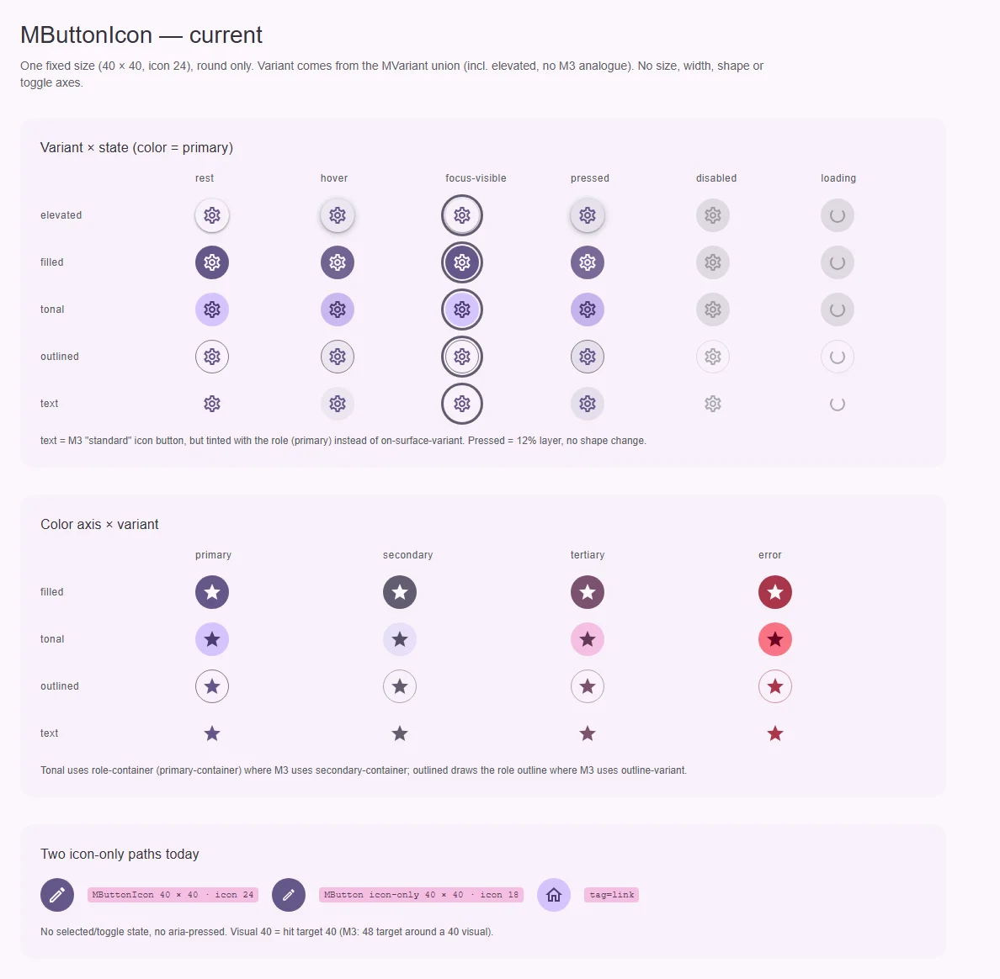
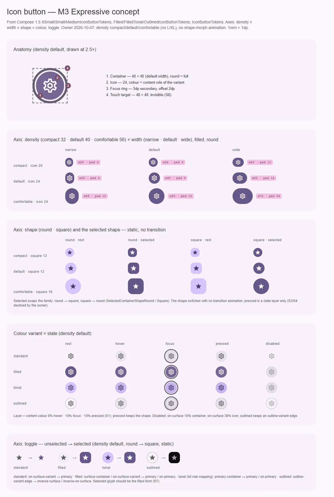

# MButtonIcon — кнопка-иконка: действие без подписи

<identity>M3: Icon buttons (standard, filled, tonal, outlined; toggle) · Токены Compose: `XSmallIconButtonTokens`, `SmallIconButtonTokens`, `MediumIconButtonTokens`, `IconButtonTokens` (`StandardIconButtonTokens`), `FilledIconButtonTokens`, `FilledTonalIconButtonTokens`, `OutlinedIconButtonTokens`; поведение — `IconButton.kt`, `IconButtonDefaults.kt` · Код: `src/runtime/components/ui/button/icon/` · Аудит: `data/button.json` (общий с семьёй) · Тип: public</identity>

<implementation-status state="done" updated="2026-10-07">Реализовано. В-1 ось `width`; В-2 `elevated` снят из типа (dev-предупреждение, рендер сохранён на релиз); В-3 без `color` — цвет контента контейнера (`ui-button--current`), явный `color` — роль; В-4 MButton без подписи = геометрия кнопки-иконки. `density` × `width`, `shape`, toggle (round → square, square → round на пружине), слот `{ selected }`, цель 48 у всех ступеней.</implementation-status>

## Вердикт

**переработка.** Сегодня это один квадрат 40 × 40 с иконкой 24, круглый, без выбора. У M3 Expressive
у icon button четыре оси — размер, ширина narrow/default/wide, форма round/square и toggle. Кит берёт
размер как `density` из трёх ступеней, а смену формы при нажатии не делает (решения владельца). Цвета
тоже разошлись: `text` красится ролью вместо on-surface-variant, а `elevated` допускается, хотя у M3
его нет. Tonal на `<role>-container` — решение кита, а не расхождение.

## Рендеры

| Сейчас | Концепт M3 |
|---|---|
|  |  |

Концепт: анатомия (`density="default"`, 2.5×) с целью 48; `density` (compact · default ·
comfortable) × ширина с выносками ширины и отступа; форма round/square и выбранная форма (статично,
без перехода); цветовой вариант × состояние (pressed — только слой); toggle unselected → selected для
четырёх вариантов. Семейная доска —
`../../renders/button/`.

## Анатомия

| № | Часть M3 | Элемент кита | Статус |
|---|---|---|---|
| 1 | Container | корень `.ui-button.ui-icon-button` (`icon/index.vue:36-43`) | есть, только 40 × 40 и full |
| 2 | Icon | `.ui-icon-button__content` + слот (`icon/index.vue:13-15`) | есть, 24 |
| 3 | Focus indicator | наследует `.ui-button:focus-visible` | есть |
| 4 | Touch target 48 | нет | нет (S8) |
| — | Selected icon (залитый глиф) | нет | S7, СВ-3 |

## Оси дизайна

| Ось | M3 | Кит сейчас | Цель | Ломает API |
|---|---|---|---|---|
| Размер | XS 32 · S 40 · M 56 · L 96 · XL 136 | 40 (`_index.scss:27`) | `density` семьи: `compact \| default \| comfortable` = значения XS / S / M (решение владельца), дефолт `default` | нет |
| Ширина | narrow · default · wide | только default | новая ось (В-1) | нет |
| Форма | round · square; selected меняет семейство формы; pressed сжимает радиус | full | `shape` семьи (index.md В-3); selected — статичная форма без перехода; pressed форму не меняет (решение владельца) | нет |
| Вариант | standard · filled · tonal · outlined | `MVariant` целиком (вкл. `elevated`), дефолт `text` | `Extract<MVariant, 'filled' \| 'tonal' \| 'outlined' \| 'text'>`, `text` = standard (В-2) | да, если `elevated` убрать |
| Цвет | у standard — on-surface-variant (или унаследованный цвет контента), у прочих привязан к варианту | `color: MColor` → роль | В-3 | вид |
| Toggle | unselected / selected | нет | `selected` семьи (index.md В-4) | нет |

### Ступени `density` (значения для ветки `icon-button.density.*`) — решение владельца 2026-10-07

| Ступень | Значения M3 | Высота | Иконка | Отступ narrow / default / wide | Ширина narrow / default / wide | Square | Selected (round → / square →), без перехода | Outline |
|---|---|---|---|---|---|---|---|---|
| `compact` | XS | 32 | 20 | 4 / 6 / 10 | 28 / 32 / 40 | medium 12 | medium 12 / full | 1 |
| `default` | S | 40 | 24 | 4 / 8 / 14 | 32 / 40 / 52 | medium 12 | medium 12 / full | 1 |
| `comfortable` | M | 56 | 24 | 12 / 16 / 24 | 48 / 56 / 72 | large 16 | large 16 / full | 1 |

`default` совпадает с сегодняшней кнопкой-иконкой (40 × 40, иконка 24) — вид по умолчанию не
меняется. Ступени L/XL M3 (96 / 136) кит не вводит. Pressed-радиусы M3 (small 8 / medium 12) не
переносятся: нажатие — только слой состояния.

## Оси состояний

| Ось | Нужно | Есть | Не хватает |
|---|---|---|---|
| Базовое | enabled, disabled, (фокусируемый disabled — `soft-disabled` в material-web) | enabled, disabled | фокусируемый disabled — index.md В-6 |
| Взаимодействие | rest, hover, pressed слоем (морф формы не делается — решение владельца) | rest, hover, pressed цветом | pressed 10% (S1) |
| Фокус | кольцо + слой 10% | кольцо | слой |
| Выбор | unselected / selected (ST-01 аудита) | нет | S9 — главный открытый FAIL аудита (ST-01) |
| Данные | у M3 нет | `loading` от `MButton` | — |

## Токены: расхождения

| Часть | M3 (Compose) | Кит сейчас | Действие |
|---|---|---|---|
| Размер контейнера | 32 / 40 / 56 | `icon-button.container.size: 40rem` (`_index.scss:27`) | ветка `icon-button.density.*` |
| Иконка | 20 / 24 / 24 | 24 (`_index.scss:28`) | по ступеням |
| Форма | round, square, selected | full (`_index.scss:27`) | `shape` + selected-форма, статично |
| standard (text) | on-surface-variant; selected primary; disabled on-surface 38% | роль (`_functions.scss:236-249`), у primary — primary | В-3 |
| filled | primary / on-primary; toggle: surface-container / on-surface-variant → primary / on-primary | primary / on-primary | toggle-ветка |
| tonal | secondary-container / on-secondary-container; selected secondary / on-secondary | role-container | **решено: остаётся** `<role>-container` (владелец, 2026-10-07); выбранный цвет — index.md В-7 |
| outlined | край outline-variant 1, иконка on-surface-variant; selected inverse-surface / inverse-on-surface без края | край outline (у primary) или роль 50%; иконка — роль | край — index.md В-2, иконка — В-3 |
| Disabled | контейнер on-surface 10%, иконка on-surface 38% | 12% / 38% | вместе с index.md |
| Иконка у `MButton` icon-only | — | `MButton` без подписи тоже даёт квадрат 40 (`index.vue:209-212`), но иконка 18 | В-4 |

## Поведение и доступность

- Имя обязательно: `ariaLabel` или `aria-labelledby`; dev-предупреждение уже есть
  (`useButtonNameWarning`, `icon/index.vue:26`). Дефолтной строки кит не поставляет (craft.md §6).
- Toggle — `aria-pressed` на нативной кнопке (index.md В-4). Если потребителю нужно другое имя в
  выбранном состоянии (material-web `aria-label-selected`), он меняет `ariaLabel` сам — кит не
  добавляет второй проп без заказчика.
- Выбранный глиф — залитая форма (S7). До решения СВ-3 потребитель передаёт пару иконок сам через
  слот, а компонент отдаёт `selected` в слот: `<slot :selected="selected" />`.
- Цель 48 (S8) особенно важна здесь: `compact` 32 и narrow `default` 32 — самые маленькие цели семьи.
- Внутри тулбаров (`toolbar/index.vue`) и пагинации (`pagination/index.vue:188`) кнопка-иконка
  переопределяется — при появлении `density` проверить их.

## API

| Изменение | Тип | Ломает |
|---|---|---|
| `density` | `MButtonDensity` (= `MFieldDensity`), дефолт `'default'` | нет |
| ширина (имя — В-1) | `'narrow' \| 'default' \| 'wide'`, дефолт `'default'` | нет |
| `shape` | как у `MButton` | нет |
| `selected` + `update:selected` | как у `MButton` | нет |
| `variant` | сузить до `Extract<MVariant, 'filled' \| 'tonal' \| 'outlined' \| 'text'>` | да, если В-2 = 1: `elevated` уходит. Миграция — `filled` или `tonal`; dev-предупреждение на один релиз |
| слот по умолчанию | получает `{ selected }` | нет |

## План работ

1. **S** — Ветки `icon-button.density.*` и `icon-button.width.*` в `button/_index.scss` из таблицы.
   Зависит от index.md шаг 1.
2. **M** — `density` и ширина в `icon/index.vue` (модификаторы через `useButton`). Зависит от В-1.
3. **S** — Форма `shape` (наследует index.md шаг 4), статично.
4. **M** — Toggle: `selected`, `aria-pressed`, цвета по таблице, выбранная форма (round → medium 12,
   square → full) **без анимации перехода**, `{ selected }` в слот. Закрывает ST-01 аудита. Зависит от
   index.md шаг 4, S9.
5. **S** — Цвета standard и outlined (tonal остаётся). Зависит от В-3 и index.md В-2.
6. **S** — Сужение `variant` (если В-2 = 1) с dev-предупреждением. Файлы: `button/props.ts`
   (`mIconButtonProps`).
7. **S** — Иконка `MButton` icon-only по В-4. Файлы: `button/index.vue`.

## Тесты

- `fixtures/button/family.vue`: строки `density` × ширина, round/square, toggle × вариант, selected +
  disabled.
- e2e: axe; `aria-pressed` переключается кликом и Space; pressed не меняет `border-radius`, у выбранной
  формы нет `transition` по радиусу; цель ≥ 48 у `compact` и narrow `default`; dev-предупреждение
  без имени (unit, т. к. `import.meta.dev` в e2e не проверяется).
- unit `icon/index.spec.ts`: модификаторы `density`/ширины/формы; слот получает `selected`.

## Готово, когда

- [ ] Три ступени `density` × три ширины рендерятся с размерами из таблицы.
- [ ] Toggle работает с `aria-pressed`, цвета и форма меняются по таблице, без анимации формы.
- [ ] standard по умолчанию — on-surface-variant (или по решению В-3).
- [ ] Цель нажатия ≥ 48 у всех ступеней.
- [ ] Линтеры, typecheck, vitest, e2e — зелёные.

## Предложения по UX

Расширения сверх паритета с M3. Это предложения владельцу, а не шаги плана: в работу попадают только
одобренные. Без анимаций Expressive и без новых зависимостей.

| Предложение | Что получает пользователь | Заказчик | Цена | Рекомендация |
|---|---|---|---|---|
| Тултип из имени: проп `tooltip` | Видит подпись иконки при наведении и фокусе — то же, что слышит скринридер; M3 рекомендует тултип у каждой кнопки-иконки | Тулбары, app bar, действия строк таблицы, пагинация | S–M: переиспользует `MTooltip`; бандл — тултип грузится только у кнопок с пропом; API — `tooltip?: true \| string` (`true` = текст `ariaLabel`) | Да, опционально: удобство без нового текста — имя уже обязательно |
| Бейдж на иконке: слот `#badge` | Видит счётчик или точку на иконке (уведомления, черновики) в позиции, которую задаёт анатомия M3 badge | App bar (уведомления), навигация, тулбары | S: переиспользует `MBadge`; API — один слот; позиция — токен карты icon button | Да |
| Пара глифов для toggle: `selectedIcon` | Выбранное состояние видно формой глифа (контур → заливка), а не только цветом; потребителю не нужно менять иконку руками | «Избранное», «Закладка», «Без звука» | S: проп-строка, кит выбирает глиф по `selected`; до СВ-3 — пары `ic:outline-*` / `ic:baseline-*` | Да, как сахар над слотом `{ selected }` |

## Открытые вопросы

**В-1. Имя оси ширины.**

1. `width: 'narrow' | 'default' | 'wide'` — как в M3. Цена: читается как CSS-ширина, может спутаться с
   атрибутом.
2. `widthOption` — как `IconButtonWidthOption` в Compose. Однозначно, но длинно и непривычно для Vue.
3. Свернуть в масштаб (`size: 's-narrow'`…). Отвергается: две независимые оси в одном значении.

Рекомендация: 1, с записью в axes.md как оси семьи кнопок.

**В-2. Вариант `elevated` у кнопки-иконки.**

1. Сузить `variant` до четырёх вариантов M3 (ломающее, dev-предупреждение на релиз). Совпадение с M3.
2. Оставить `elevated` как расширение кита. Без ломки, но вариант без заказчика и без спецификации.

Рекомендация: 1 — заказчика у elevated icon button внутри кита нет (principles.md, В4).

**В-3. Цвет standard (text) кнопки-иконки по умолчанию.**

1. on-surface-variant, как `iconButtonVibrantColors` / токены M3. Явный `color` — роль.
2. Наследовать цвет контента (`currentcolor`), как `iconButtonColors()` в Compose
   (`LocalContentColor`): кнопка в app bar берёт цвет бара. Цена: вне контейнера цвет зависит от
   родителя.
3. Оставить роль (primary). Сегодняшний вид, расхождение с M3.

Рекомендация: 2 — тулбары и бары кита уже задают цвет контента, а кнопка в них перестанет нуждаться в
переопределениях. Связано с index.md В-2 (политика цвета семьи).

**В-4. Иконка у `MButton` без подписи.**

1. `MButton` icon-only получает геометрию `MButtonIcon` (иконка 24 у S). Одна кнопка-иконка на вид.
2. Оставить 18: это «кнопка с иконкой без текста», а не icon button. Два вида рядом.

Рекомендация: 1 — у M3 нет «кнопки с текстом без текста».
