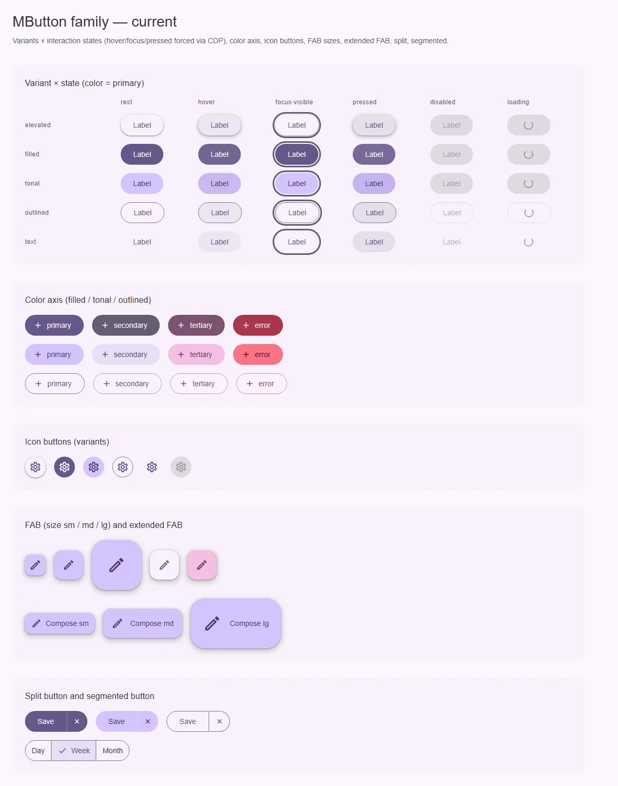
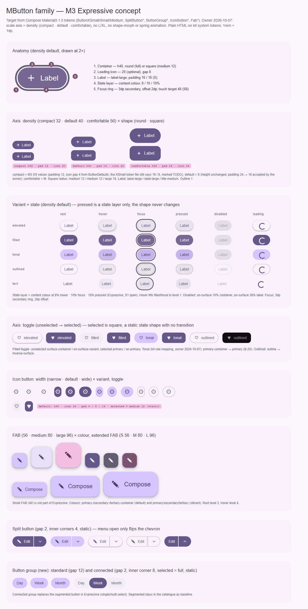

# MButton — семейство кнопок: действие одним нажатием

<identity>M3: Buttons (common buttons) и Toggle buttons; семья — Icon buttons, FABs, Extended FABs, Split buttons, Segmented buttons, Button groups · Токены Compose: `ButtonXSmallTokens`, `ButtonSmallTokens`, `ButtonMediumTokens`, `BaselineButtonTokens`, `FilledButtonTokens`, `TonalButtonTokens`, `ElevatedButtonTokens`, `OutlinedButtonTokens`, `TextButtonTokens`, `StateTokens`; поведение — `Button.kt`, `ToggleButton.kt` · Код: `src/runtime/components/ui/button/` + `src/runtime/composables/button/` · Аудит: `data/button.json` · Тип: public</identity>

<implementation-status state="done" updated="2026-10-07">Реализовано. Решения владельца: В-2 край outlined — outline-variant; В-3 `shape: 'round' | 'square'`; В-4 `selected` + `v-model:selected` у MButton/MButtonIcon; В-5 форма выбора сохраняется в disabled/loading; В-6 loading инертен, но держит фокус (`aria-disabled`, клик гасится в capture); В-7 выбранная tonal — инверсия контейнера; text-toggle = standard icon button; СВ-1 pressed остаётся 12%. Смена формы toggle идёт на пружинах M3 (`button/morph.ts`, `springToCss`) — исключение из S3/S4 по решению владельца. Loading — только `MLoading inline` (свой спиннер удалён). Слой состояния — `::before`, нажатие — только рипл. Цель 48 у compact. Disabled-контейнер оставлен 12% (вместе с СВ-1). Сводка — `.cursor/summary/button-family-m3_2026-10-07.md`.</implementation-status>

## Вердикт

**переработка.** Каждый член семьи узнаётся как M3, и фаза D закрыла почти все дефекты аудита. Но кит
остановился на baseline M3: у `MButton` нет масштаба (S5), формы round/square и toggle-состояния (S9).
Новые оси добавляются без ломки: `density` берёт три ступени кита, а M3-шкала XS–XL в ките не
вводится. Ломающие изменения — только у дочерних частей (FAB, split, icon button, FAB menu).

## Решения владельца (2026-10-07)

| Тема | Решение | Что это значит для плана |
|---|---|---|
| tonal | остаётся `<role>-container`, как сейчас | бывший В-2 в части tonal закрыт; осталась узкая развилка про outlined (В-2) и цвет выбранной tonal-кнопки (В-7) |
| Масштаб | ось `density`, ступени `compact \| default \| comfortable`, как `MFieldDensity`; L/XL не вводятся | — |
| Ступени `density` | compact = 32, default = 40, comfortable = 56; отступы, иконка и форма — из M3 XS / S / M | таблица ниже; бывший В-1 закрыт |
| Движение | пружины Expressive (S4) и анимированная смена формы (S3) в вебе не делаются: механизм грузит бандл | pressed — только слой состояния, форма не меняется. Выбранный toggle — статичная квадратная форма без анимации перехода. Существующий ripple не трогается |
| split | круглое «открытое» состояние убрано | у открытого меню шеврон только смотрит вверх ([split.md](split.md)) |

## Рендеры

| Сейчас | Концепт M3 |
|---|---|
|  |  |

Кадры концепта:
- анатомия `MButton` (`density="default"`, 2×);
- ось `density` (compact 32 · default 40 · comfortable 56) × форма round/square, с выносками высоты,
  отступа и иконки;
- матрица «вариант × состояние»: pressed — только слой, форма не меняется;
- ось toggle (unselected → selected, выбранная — квадратная, без перехода);
- icon button (ширина и toggle);
- FAB 56/80/96 и цвета, extended FAB S/M/L;
- split button (статичные внутренние углы, у открытого меню шеврон смотрит вверх);
- button group (standard и connected).

Детальные доски дочерних частей лежат рядом и подключены в их планах:
`../../renders/button-icon/`, `../../renders/button-fab/`, `../../renders/button-split/`,
`../../renders/button-group/` (в каждой `current.webp` и `concept.webp`).

## Карта семейства

| Компонент кита | M3 | План | Вердикт |
|---|---|---|---|
| `MButton` | Button + Toggle button | этот файл | переработка |
| `MButtonIcon` | Icon button | [icon.md](icon.md) | переработка |
| `MButtonFab` | FAB | [fab.md](fab.md) | переработка |
| `MButtonExtendedFab` | Extended FAB | [extended-fab.md](extended-fab.md) | переработка |
| `MButtonSplit` | Split button | [split.md](split.md) | переработка |
| `MButtonSegmented` | Segmented button | [segmented.md](segmented.md) | дрейф |
| — | Button group (standard, connected) | [group.md](group.md) | нет в ките |
| `MFabMenu` | FAB menu | [fab-menu.md](fab-menu.md) | переработка |

Общее ядро уже есть и остаётся единым: `useButton` (`composables/button/useButton.ts`) отдаёт корень
`button`/`NuxtLink`, `disabled || loading`, ARIA и BEM-классы всем членам семьи. Новые оси семьи
(`density`, `shape`, `selected`) проходят через него же, а не дублируются в каждом SFC.

## Анатомия (`MButton`)

| № | Часть M3 | Элемент кита | Статус |
|---|---|---|---|
| 1 | Container | корень `.ui-button` (`index.vue:2`) | есть; высота 40, форма только full |
| 2 | Label text | `.ui-button__label`, слот по умолчанию | есть; label-large без трекинга (TK-03) |
| 3 | Leading icon | слот `#prepend` → `.ui-button__icon--prepend` | есть; 18 вместо 20 |
| 4 | Trailing icon | слот `#append` | расширение кита: M3 описывает только ведущую иконку. Остаётся |
| 5 | State layer | нет отдельного слоя: hover/pressed подменяют `background-color` предсмешанным цветом (`_functions.scss:177-178`) | иначе — см. шаг 6 |
| 6 | Focus indicator | `@include focus-ring` (`index.vue:150`) | есть кольцо 3dp secondary со смещением 2dp; нет слоя 10% |
| 7 | Touch target 48 | нет: видимая высота = цель | нет (S8) |
| — | Индикатор загрузки | `.ui-button__spinner` | расширение кита: у M3 нет loading-кнопки. Остаётся |

## Оси дизайна

| Ось | M3 Expressive | Кит сейчас | Цель | Ломает API |
|---|---|---|---|---|
| Масштаб (S5) | `size` XS 32 · S 40 · M 56 · L 96 · XL 136 | нет у `MButton`/`MButtonIcon`/`MButtonSplit`; у FAB — `size: sm \| md \| lg` (лестница FAB — в [fab.md](fab.md)) | `density: MButtonDensity = MFieldDensity` (`compact \| default \| comfortable`), дефолт `default`; значения — таблица ниже (решение владельца) | нет |
| Форма | round (full) · square (medium 12 у compact/default, large 16 у comfortable) | только full (`_index.scss:11`) | `shape: 'round' \| 'square'`, дефолт `round` (В-3); значение статично | нет |
| Смена формы (S3) | pressed → меньший радиус, selected round ↔ square с анимацией | нет | **не делается** (решение владельца). Pressed — только слой. Выбранный toggle — статичная форма square без анимации перехода | — |
| Вариант | elevated · filled · tonal · outlined · text | те же 5 (`MVariant`) | без изменений | нет |
| Цвет | у M3 нет оси: роли привязаны к варианту | `color: MColor`, tonal = `<role>-container` | tonal — решено, остаётся; outlined — В-2 | нет |
| Toggle (S9) | `ToggleButton`: unselected/selected, цвет и форма | нет | `selected` + `v-model:selected` (В-4) | нет |
| Ширина | только у icon button: narrow · default · wide | нет | [icon.md](icon.md) | нет |
| `tag` | — | `button \| link` | без изменений | нет |

`MButtonDensity` одалживает тип `MFieldDensity` целиком (axes.md, «одолжить»), а не перепечатывает
его члены.

### Ступени `density` у `MButton` — решение владельца 2026-10-07

| Ступень | Значения M3 | Высота | Отступ start/end | Иконка | Зазор иконка–текст | Шрифт | Square | Outline |
|---|---|---|---|---|---|---|---|---|
| `compact` | XS | 32 | 12 / 12 | 20 | 4 | label-large | medium 12 | 1 |
| `default` | S | 40 | 16 / 16 | 20 | 8 | label-large | medium 12 | 1 |
| `comfortable` | M | 56 | 24 / 24 | 24 | 8 | title-medium | large 16 | 1 |

Источник: `ButtonXSmallTokens`, `ButtonSmallTokens`, `ButtonMediumTokens` (высота, иконка, outline,
формы) и `ButtonDefaults.textStyleFor` (шрифт). Для XS `ButtonDefaults.ExtraSmallContentPadding` берёт
12 и `ExtraSmallIconSpacing` 4 с пометкой «TODO: значение из ButtonXSmallTokens, когда его исправят»;
сам файл токенов пока говорит 16 и 8. План берёт значения кода (12 / 4).

Высота по умолчанию не меняется: `default` = 40, как сегодня. Меняются отступ (24 → 16) и иконка
(18 → 20) — принятое видимое изменение: `default` берёт значения S целиком. Сегодняшняя кнопка —
baseline M3 (`_index.scss:10-19`); Compose держит такой же отступ 24 у кнопки без размера
(`ButtonDefaults.ContentPadding`), а S Expressive — 16.

## Оси состояний

Из `axes` аудита, сверено с кодом после фазы D.

| Ось | Нужно (M3 + чеклист, с решениями владельца) | Есть | Не хватает |
|---|---|---|---|
| Базовое | enabled, disabled, фокусируемый disabled | enabled; disabled — нативный `disabled` у `button`, `aria-disabled` + `tabindex=-1` у `link` (`useButton.ts:63-79`) | фокусируемый disabled/loading (IN-08) — В-6 |
| Взаимодействие | rest, hover, pressed слоем; hover поднимает filled/tonal на level 1 | rest, hover (внутри `can-hover`, `index.vue:89`), pressed — цветом (`index.vue:99`) | тень level 1 на hover у filled/tonal; у elevated pressed остаётся level 2 вместо 1 |
| Фокус | focus-visible: кольцо + слой 10% | кольцо (`index.vue:149-151`) | слой 10% |
| Выбор | unselected / selected у toggle, selected — статичная square | нет | S9, В-4 |
| Раскрытие | только у split | — | [split.md](split.md) |
| Смысловое | у M3 нет | `color="error"` | расширение кита, остаётся |
| Данные | у M3 нет | `loading`: спиннер, `aria-busy`, ширина не прыгает | — |

## Токены: расхождения

| Часть | M3 (Compose) | Кит сейчас | Действие |
|---|---|---|---|
| Высота | 32 / 40 / 56 по ступеням | 40 (`_index.scss:10`) | ветка `density.*` в `$tokens` |
| Отступы | 12 / 16 / 24 по ступеням | 24, со стороны иконки 16 (`_index.scss:13-14`) | по ступеням (`default` — 16) |
| Отступ `text` | baseline 12 / 12 (12 / 16 с иконкой); у Expressive-размеров общий с остальными | токен `container.padding.text-inline: spacing(12)` объявлен (`_index.scss:16`), но нигде не читается: text-кнопка получает 24 | удалить: text получает отступы своей ступени, как все варианты Expressive-размеров (`ButtonDefaults.contentPaddingFor`) |
| Иконка | 20 / 20 / 24 | 18 (`_index.scss:19`) | по ступеням |
| Шрифт | label-large с трекингом 0.1; title-medium у `comfortable` | `typescale('label-large')` без `letter-spacing` (`_mixins.scss:111-116`) | трекинг — системный TK-03 |
| Форма | round + square | только full | `shape`, статично |
| Слои состояний | hover 8 · focus 10 · pressed 10 | hover 8 · focus — · pressed 12 (`_variables.scss:18-25`) | СВ-1 (S1); добавить focus-слой |
| Двойной pressed | один слой | фон `:active` 12% (`index.vue:99-101`) **плюс** рипл 12% (`_ripple.scss:39`) поверх | оставить один носитель нажатия, рипл не трогать (шаг 6) |
| Disabled-контейнер | on-surface 10% | 12% (`$theme-state-link.disabled-container`) | системно, вместе с СВ-1: правка одной карты |
| Disabled-текст | on-surface-variant 38% | on-surface 38% (`_functions.scss:184` и аналоги) | on-surface-variant |
| Тень filled/tonal | rest 0, hover 1 | нет | `elevation(1)` на hover |
| Тень elevated | rest 1, hover 2, pressed 1, focus 1 | rest 1, hover 2; при нажатии остаётся 2 (`index.vue:93-101`) | pressed → 1 |
| tonal | secondary-container / on-secondary-container | `<role>-container` (`_functions.scss:204-216`) | **решено: остаётся** (владелец, 2026-10-07) |
| outlined | край outline-variant, текст on-surface-variant | текст — роль; край — outline у primary, роль 50% у остальных (`_index.scss:46,52,58,64`) | В-2 |
| text | текст primary (`ButtonDefaults.defaultTextButtonColors`) | роль | совпадает у дефолта |
| Движение | цвет — effects-пружина, форма — spatial-пружина | `short-3` + `standard` (`_index.scss:21-22`) | остаётся: S4 отклонён, переходы цвета — на токенах `--sys-motion-*` |

Совпадает: filled (primary / on-primary), elevated (surface-container-low / primary, level 1),
полная форма по умолчанию, кольцо фокуса 3/2 secondary, `can-hover`, forced colors, ripple.

## Поведение и доступность

- **Корень.** Нативный `<button type="button">` или `NuxtLink` (`useButton.ts`). Остаётся.
- **Toggle.** На вебе это `aria-pressed` на нативной кнопке. Compose ставит `Role.Checkbox`,
  material-web — `aria-pressed`; кит идёт за ARIA APG («toggle button»). Имя кнопки при выборе не
  меняется: состояние несёт `aria-pressed`. Выбранная форма применяется без перехода: в `transition`
  кнопки нет `border-radius`.
- **Фокусируемый disabled и loading (IN-08).** Открыто с фазы D, В-6. Сегодня кнопка под фокусом,
  перешедшая в loading, теряет фокус: она становится `disabled`.
- **Цель нажатия (S8, RS-12).** Расширитель `::after` с отрицательным `inset` до 48 у `compact` (32) и у
  кнопок-иконок. Мешает `overflow: hidden` на корне (`index.vue:127`). Рипплу он не нужен: контейнер
  рипла режет себя сам (`_ripple.scss:10`, `border-radius: inherit`). Снятие `overflow` проверить на
  спиннере и переносе длинной подписи.
- **Движение.** Только переходы цвета и тени на токенах `--sys-motion-duration-*`/`easing-*`; reduced
  motion их сокращает. Пружин и морфа нет.
- **Forced colors.** Рамка `ButtonText` у всех вариантов уже есть (`index.vue:155`). Selected в
  forced colors — `Highlight`/`HighlightText`, как у сегментов.

Открытые пункты аудита: IN-08 → шаг 8 (В-6); LY-08 (масштаб) → шаг 2; RS-12 (цель) → шаг 5;
TK-03 (трекинг) → системно, вне семьи; EN-03 (`#loading`) → не входит: у M3 нет loading-кнопки,
заказчика нет (principles.md, В4). DC-* — документация в репозитории `docs`. RS-04/05/06 — принятое
отклонение (vw-масштаб).

## API

Добавить (без ломки):

| Проп | Тип | Дефолт | Зачем |
|---|---|---|---|
| `density` | `MButtonDensity` (= `MFieldDensity`: `'compact' \| 'default' \| 'comfortable'`) | `'default'` | S5 (решение владельца) |
| `shape` | `'round' \| 'square'` (В-3) | `'round'` | форма M3, статично |
| `selected` | `boolean \| undefined` + `update:selected` | `undefined` | toggle (В-4). `undefined` — обычная кнопка, `aria-pressed` не ставится |

Изменить (вид, не типы): отступ и иконка `default` (решение владельца), роли `outlined` (В-2), disabled-текст
on-surface-variant, тени hover/pressed. Каждое — видимое изменение, перечисляется в summary.

Убрать: мёртвый токен `container.padding.text-inline` (шаг 3).

Ломающих изменений у самого `MButton` нет. Ломающие изменения дочерних частей — в их планах: FAB
(`size`, `variant`), FAB menu (`align`, `loading`, `variant`), split (`variant` без `text`), icon button
(`variant` без `elevated` — icon.md В-2).

## План работ

1. **S** — Заготовить ветки `density`, `shape`, `selected` в `button/_index.scss` (значения из таблицы
   ступеней).
2. **M** — Ось `density` в `useButton` (сегодня модификатор строится из `props.size`, `useButton.ts:49`;
   добавить такой же для `density`) и в `MButton`: высота, отступы, иконка, зазор, шрифт по ступени.
   Файлы: `button/props.ts`, `button/index.vue`, `button/_index.scss`, `useButton.ts`.
3. **S** — Удалить мёртвый `text-inline`: text-кнопка берёт отступ своей ступени. Файлы:
   `button/_index.scss`, `button/index.vue`.
4. **M** — Форма и toggle: `shape` (статично); `selected` → `aria-pressed`; токенная ветка
   `selected`/`unselected` по вариантам (S9). Filled: surface-container / on-surface-variant → primary /
   on-primary. Tonal: `<role>-container` → выбранный цвет по В-7. Elevated: surface-container-low /
   primary → primary / on-primary. Outlined: край outline-variant → inverse-surface /
   inverse-on-surface. Text: у M3 нет toggle. Выбранная кнопка — square, **без анимации перехода**
   (`border-radius` не входит в `transition`). Зависит от В-3, В-4, В-7. Файлы: `useButton.ts`
   (атрибут), `button/props.ts`, `_functions.scss` (`m3-button-scheme`), `button/index.vue`.
5. **S** — Цель 48 (S8) через `::after` у `compact`; снять `overflow: hidden` с корня после проверки
   спиннера и переноса. Файлы: `button/index.vue`.
6. **M** — Слой состояния: один носитель нажатия вместо фона `:active` и рипла поверх (рипл остаётся
   как есть); focus-слой 10%; тени filled/tonal (hover 1) и elevated (pressed 1). По craft.md
   («Подмена фона») слой рисуется `::before` собственным цветом контента. **Риск:** шесть компонентов
   кита перекрывают фон `.ui-button` на hover/active (`alert/index.vue:198`, `banner/index.vue:262`,
   `dropdown/index.vue:327`, `autocomplete/index.vue:344`, `pagination/index.vue:188`,
   `breadcrumbs/item/index.vue:77`) — их правила переписать вместе. Зависит от СВ-1.
7. **S** — Роли `outlined` (В-2) и disabled-текст. Файлы: `_functions.scss` (`m3-button-scheme`),
   `button/_index.scss`.
8. **M** — Фокусируемый disabled/loading (IN-08). Зависит от В-6. Файлы: `useButton.ts`,
   `button.e2e.ts` (тест «skips disabled and loading» фиксирует сегодняшнее поведение).
9. Дочерние планы: [icon.md](icon.md), [fab.md](fab.md), [extended-fab.md](extended-fab.md),
   [split.md](split.md), [segmented.md](segmented.md), [group.md](group.md); FAB menu —
   [fab-menu.md](fab-menu.md). Порядок: шаги 1–4 до icon/split/group (они наследуют оси).

## Тесты

- Фикстуры `playground/fixtures/button/{matrix,family,stress}.vue`: матрица получает строки
  `density` × форма, toggle-строку (unselected/selected × вариант), selected + disabled.
- e2e `button.e2e.ts`: axe на новых строках (светлая/тёмная × ltr/rtl); `aria-pressed` переключается
  Space/Enter; цель ≥ 48×48 у `compact` (`elementFromPoint` у края); pressed не меняет computed
  `border-radius`; у выбранной кнопки square-радиус, а `transition-property` не содержит
  `border-radius`; forced colors для selected; ширина не меняется при loading на всех ступенях.
- unit (`index.spec.ts`, `useButton.spec.ts`): модификаторы `density` и формы, `aria-pressed` только
  при `selected !== undefined`, `update:selected`.

## Готово, когда

- [ ] `MButton` принимает три ступени `density`; значения совпадают с таблицей ступеней.
- [ ] `shape="square"` даёт радиусы 12 / 12 / 16; pressed форму не меняет.
- [ ] `selected` ставит `aria-pressed`, меняет цвет и делает кнопку square без анимации; без
      `selected` атрибута нет.
- [ ] Нажатие рисуется одним слоем, focus — кольцом и слоем 10%; ripple на месте.
- [ ] Цель нажатия `compact` ≥ 48.
- [ ] `npm run lint`, `lint:style`, `lint:scss`, `typecheck`, vitest, e2e — зелёные.
- [ ] Видимые изменения перечислены в summary (отступ и иконка `default`, outlined, disabled-текст).

## Закрытые вопросы

- **Масштаб (бывшие СВ-2 и шкала XS–XL).** Решено владельцем 2026-10-07: `density`,
  `compact | default | comfortable`, L/XL нет.
- **В-1. Значения ступеней `density`.** Решено владельцем 2026-10-07: compact = 32, default = 40,
  comfortable = 56; отступы, иконка и форма — из M3 XS / S / M. Отступ `default` 24 → 16 и иконка
  18 → 20 приняты как видимое изменение.
- **tonal (бывший В-2, часть про tonal).** Решено владельцем 2026-10-07: остаётся `<role>-container`.
- **Анимация формы и пружины (S3/S4).** Отклонены владельцем 2026-10-07.

## Предложения по UX

Расширения сверх паритета с M3. Это предложения владельцу, а не шаги плана: в работу попадают только
одобренные. Без анимаций Expressive и без новых зависимостей.

| Предложение | Что получает пользователь | Заказчик | Цена | Рекомендация |
|---|---|---|---|---|
| Причина недоступности: `disabledReason` | Наводит или фокусирует выключенную кнопку и видит, почему она выключена («Заполните обязательные поля»), — тултипом и через `aria-describedby` | Формы с кнопкой «Отправить», выключенной до валидности; мастера | M: зависит от В-6 (фокусируемый disabled), переиспользует `MTooltip`; API — один строковый проп, текст даёт потребитель | Да, сразу после В-6: без фокусируемого disabled причину не услышит скринридер |
| Горячая клавиша: проп `hotkey` | Действие доступно с клавиатуры (Ctrl+S, N); сочетание видно в тултипе и объявляется через `aria-keyshortcuts` | Тулбары редакторов, диалоги, таблицы | M: переиспользует `useHotkey` (`composables/hotkey/useHotkey.ts`) и форматирование `MHotkey`; бандл — только для кнопок с пропом (ленивый импорт); API — `hotkey?: string` | Да, вместе с планом hotkey: кит уже держит реестр сочетаний |
| Подтверждение на месте для разрушительных действий | Первое нажатие на `color="error"` меняет подпись на текст подтверждения, второе в течение N секунд выполняет действие; без модального диалога | Удаление строки таблицы, файла в file-upload, сброс формы | M: композабл `useConfirmAction` + слот `#confirm` для текста (кит не поставляет строку); состояние «ждёт подтверждения» выражается подписью и цветом контейнера, без анимации | Отложить до заказчика; сначала проверить, не закрывает ли задачу `confirm-edit` |

## Открытые вопросы

**В-2. Цвета `outlined`.** tonal решён; outlined — единственная оставшаяся развилка по цвету.

1. Край outline-variant для всех ролей (Expressive), текст — роль. Один токен края вместо четырёх и
   уход от роли с 50% прозрачности. Цена: край тише сегодняшнего outline, кнопку опознают по подписи.
2. Край outline для всех ролей (baseline M3), текст — роль. Тоже один токен, контраст края выше.
3. Оставить как есть: outline у primary, роль 50% у остальных (TH-03 аудита просит проверить у них
   контраст 3:1).

Рекомендация: 1.

**В-3. Как назвать ось round/square.**

1. `shape: 'round' | 'square'` — документированное исключение семьи, как филдовый `variant`
   (axes.md), с комментарием у объявления. Читается как в M3. Цена: в ките `shape` уже значит ступень
   шкалы `MShape`.
2. `shape: Extract<MShape, 'full' | 'medium' | 'large'>` — потребитель сам выбирает радиус. Один
   словарь, но разрешает бессмысленные пары (`compact` + large) и теряет смысл «квадратная форма
   этой ступени».
3. Булев `square`. Отвергается principles.md (флаг — свёрнутая ось).

Рекомендация: 1.

**В-4. Где живёт toggle.**

1. Проп `selected` (+ `v-model:selected`) у `MButton` и `MButtonIcon`; `undefined` = обычная кнопка.
   Одно ядро `useButton`, меньше компонентов. Цена: у кнопки появляется двойная природа.
2. Отдельные `MButtonToggle` / `MButtonIconToggle`, как в Compose. Чище типы, но четыре почти
   одинаковых SFC и вторая точка входа для групп.

Рекомендация: 1 — material-web и APG делают toggle атрибутом кнопки, а группы (group.md) будут
переиспользовать одну кнопку.

**В-5. Форма выбранной toggle-кнопки в disabled и loading.**

1. Disabled и loading сбрасывают форму в покой (round): выбранная кнопка теряет квадрат, выбор
   остаётся только в цвете и `aria-pressed`. Проще приоритет состояний (ST-02).
2. Форма выбора сохраняется и в disabled, и в loading. Выбор не мигает при загрузке и читается не
   одним цветом.

Рекомендация: 2. Это правило отображения, нужен ответ владельца.

**В-6. Фокусируемый disabled и loading (IN-08, перенесено из фазы D).**

1. `loading` всегда фокусируем: `aria-disabled="true"` вместо `disabled`, клик гасится в обработчике.
   Фокус не теряется при старте загрузки. Цена: меняется таб-порядок, тест e2e «skips disabled and
   loading» переписывается.
2. Проп `focusableWhenDisabled` (как `soft-disabled` в material-web) для обоих состояний. Гибко, но
   новый флаг.
3. Оставить как есть. Фокус теряется при loading.

Рекомендация: 1, плюс 2 позже, если появится заказчик (тулбары).

**В-7. Цвет выбранной tonal-кнопки при ролевой раскладке.** Появился после решения по tonal: у M3
выбранная tonal — secondary (отличается от выбранной filled — primary), а у кита tonal живёт на
`<role>-container`.

1. Выбранная tonal — `<role>` / `on-<role>`. Раскладка последовательна, но выбранные tonal и filled
   одной роли выглядят одинаково (отличаются только невыбранные: `<role>-container` против
   surface-container).
2. Выбранная tonal — `on-<role>-container` / `<role>-container` (инверсия контейнера). Отличается от
   filled, но это новый цвет без опоры в токенах M3.
3. Выбранная tonal — secondary / on-secondary при любой роли, как в M3. Совпадает с M3 у primary, но
   роль кнопки в выбранном состоянии теряется.

Рекомендация: 1 — в группе выбор и так несут форма (square/full) и `aria-pressed`; концепты нарисованы
по этому варианту.
