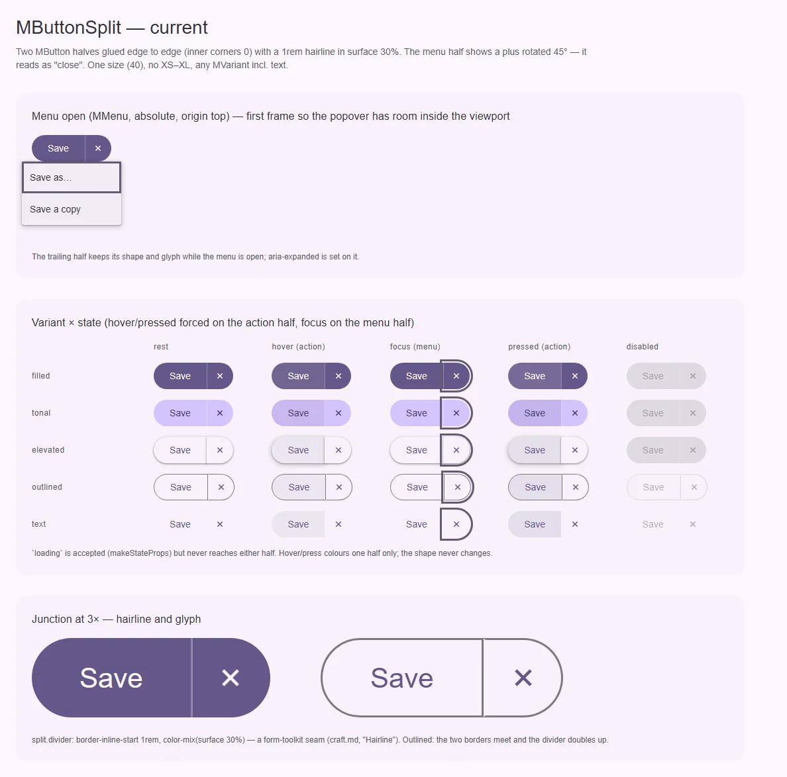
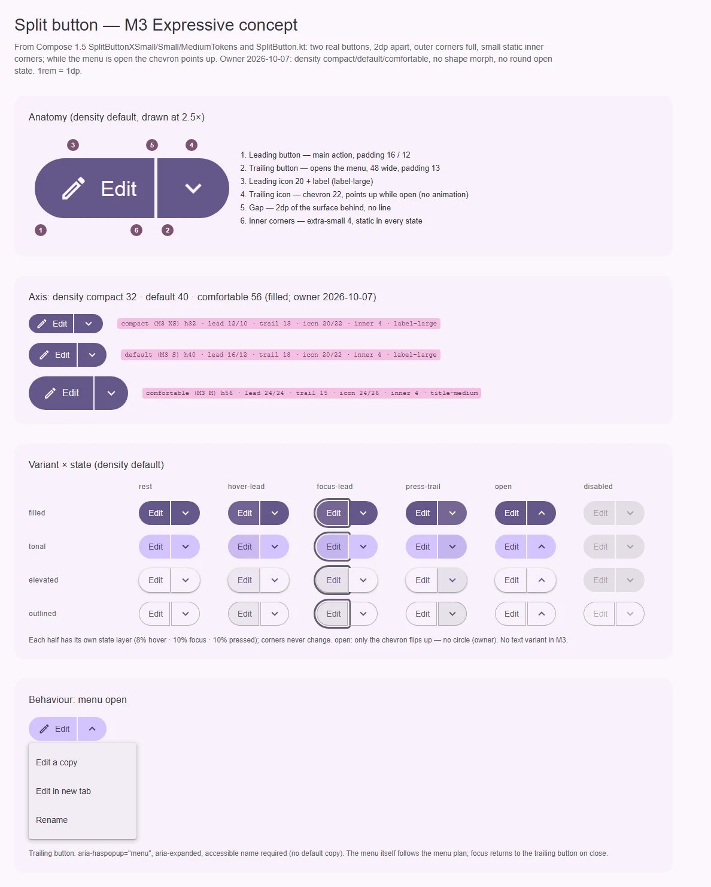

# MButtonSplit — главное действие плюс меню родственных действий

<identity>M3: Split button · Токены Compose: `SplitButtonXSmallTokens`, `SplitButtonSmallTokens`, `SplitButtonMediumTokens` + цвета вариантов кнопки (`FilledButtonTokens` и др.); поведение — `SplitButton.kt` (`SplitButtonLayout`, `SplitButtonDefaults.LeadingButton` / `TrailingButton`) · Код: `src/runtime/components/ui/button/split/`, токены — ветка `split` в `assets/stylesheet/components/button/_index.scss:32-39` · Аудит: `data/button.json` (общий с семьёй) · Тип: public</identity>

<implementation-status state="done" updated="2026-10-07">Реализовано с изменением API по решению владельца: `items` и событие `select` убраны (кнопка справа не обязана открывать меню). Меню — слот `#menu="{ close }"`, иконка — `#trailing` (шеврон по умолчанию, вверх при открытом меню), событие `trailing`, имя `trailingAriaLabel`; `dropdown`/`dropdownAriaLabel` работают релиз с предупреждением. Две кнопки с зазором 2 и статичными внутренними углами 4, `density`, `#prepend`, `variant` без `text`, `loading` работает (спиннер в главной, правая выключена). Находка про `MMenu` + `client-only` уже в плане меню.</implementation-status>

## Вердикт

**переработка.** По составу частей это M3 split button: главная кнопка, кнопка меню, меню. Но
нарисован он как `input-group` из форм-тулкита: две половины без зазора, внутренние углы 0, между ними
волосяная линия (craft.md, «Волосяная линия»), а на кнопке меню — плюс, повёрнутый на 45°, который
читается как «закрыть». M3 делает две самостоятельные кнопки с зазором 2dp, маленькими внутренними
углами и шевроном, который смотрит вверх, пока меню открыто. Морф углов при наведении и нажатии и
круглую кнопку при открытом меню из M3 Expressive кит не берёт (решение владельца). Нет ступеней
`density`, `loading` объявлен, но не доходит до кнопок.

## Рендеры

| Сейчас | Концепт M3 |
|---|---|
|  |  |

Сейчас: открытое меню (MMenu); вариант × состояние (hover/pressed на главной половине, фокус на
кнопке меню); стык в 3× — перегородка и глиф «×». Концепт: анатомия (`density="default"`, 2.5×) с
шестью частями; ступени `density` с выносками; вариант × состояние (hover главной, фокус, pressed
кнопки меню, открыто, disabled) — углы не меняются; поведение «меню открыто» (шеврон вверх).

### Что за «×» и линия на текущем рендере

- **«×»** — не баг иконки, а сознательная, но неверная замена: `name="ic:outline-plus"` с
  `style="transform: rotate(45deg)"` (`split/index.vue:27-28`). Плюс, повёрнутый на 45°, — это крестик.
  Литеральное имя иконки в шаблоне к тому же нарушает craft.md §3 (иконки — через `ICONS`). В M3 там
  `keyboard_arrow_down` (у кита есть `ICONS.keyboardArrowDown`), который смотрит вверх, пока меню
  открыто. В ките — смена глифа на `ICONS.keyboardArrowUp` без анимации поворота.
- **Линия** — токен: `split.divider` = `1rem` и `color-mix(surface 30%)`
  (`_index.scss:34-37`), отрисованный как `border-inline-start` кнопки меню (`split/index.vue:149`).
  У outlined-варианта он ложится рядом с рамками обеих половин и удваивает край. В M3 вместо линии —
  зазор 2dp фона.

## Анатомия

| № | Часть M3 | Элемент кита | Статус |
|---|---|---|---|
| 1 | Leading button | `.ui-split-button__action` (`MButton`) | есть; внутренние углы 0 вместо 4 |
| 2 | Trailing button | `.ui-split-button__dropdown` (`MButton`, icon-only) | есть; ширина 40 вместо 48, отступ 8 вместо 13 |
| 3 | Leading icon + label | слот по умолчанию | только текст; иконку через слот передать нельзя |
| 4 | Trailing icon | повёрнутый `ic:outline-plus` | неверный глиф, не меняет направление при открытии |
| 5 | Gap 2dp | нет — линия `split.divider` | иначе |
| 6 | Inner corners | 0 (`split/index.vue:141`) | нет; цель — статичные 4 |
| — | Menu | `MMenu` с `items` | есть |

## Оси дизайна

| Ось | M3 | Кит сейчас | Цель | Ломает API |
|---|---|---|---|---|
| Размер | XS 32 · S 40 · M 56 · L 96 · XL 136 | 40 | `density` семьи: `compact \| default \| comfortable` = значения XS / S / M (решение владельца) | нет |
| Вариант | filled · tonal · elevated · outlined (text нет) | `MVariant` целиком, вкл. `text` (`split/props.ts:17`) | `Extract<MVariant, 'filled' \| 'tonal' \| 'elevated' \| 'outlined'>` | да: `text` уходит |
| Цвет | роли варианта | `color: MColor` | как у `MButton` (index.md В-2) | нет |

### Ступени `density` (решение владельца 2026-10-07)

| Ступень | Значения M3 | Высота | Ведущая: отступ start / end | Ведущая иконка | Хвостовая: отступ / иконка / ширина | Внутренний угол | Шрифт |
|---|---|---|---|---|---|---|---|
| `compact` | XS | 32 | 12 / 10 | 20 | 13 / 22 / 48 | 4 | label-large |
| `default` | S | 40 | 16 / 12 | 20 | 13 / 22 / 48 | 4 | label-large |
| `comfortable` | M | 56 | 24 / 24 | 24 | 15 / 26 / 56 | 4 | title-medium |

Везде: зазор 2, внешние углы full, внутренние углы 4 во всех состояниях. Рост углов на hover/pressed
(до 8 / 12 у M3) и круг у открытой хвостовой кнопки не переносятся — решение владельца. Минимальная
ширина каждой половины — 48 (`SplitButtonDefaults.LeadingButtonMinWidth`). Ведущие иконки и шрифты —
как у кнопки той же ступени (index.md).

## Оси состояний

| Ось | Нужно | Есть | Не хватает |
|---|---|---|---|
| Базовое | enabled, disabled | enabled, disabled на обеих половинах | `loading` объявлен (`makeStateProps`), но не передаётся ни одной половине (`split/index.vue:4-25`) |
| Взаимодействие | у каждой половины свой hover/pressed слоем, форма неизменна | цвет одной половины, форма неизменна | pressed 10% (S1) |
| Фокус | кольцо на каждой половине | есть, кольцо не обрезается (фаза D) | — |
| Раскрытие | закрыто / открыто: шеврон вниз / вверх (без круга и без анимации — решение владельца) | `aria-expanded`, вид не меняется | смена шеврона |

## Токены: расхождения

| Часть | M3 | Кит сейчас | Действие |
|---|---|---|---|
| Разделение | зазор 2dp | `split.divider` 1rem surface 30% (`_index.scss:34-37`) | удалить токен, ввести `split.gap` |
| Внутренние углы | 4 (у M3 Expressive растут на hover/pressed — не берём) | 0 (`split/index.vue:140-146`) | токен `split.inner` = extra-small 4 |
| Хвостовая кнопка | отступ 13, иконка 22, ширина 48 (`default`) | icon-only `MButton`: отступ 4 (`split.dropdown.padding.inline`, `_index.scss:33`), ширина 40 | по ступеням |
| Глиф | `keyboard_arrow_down`, вверх при открытии | `ic:outline-plus` + 45° | `ICONS.keyboardArrowDown` / `ICONS.keyboardArrowUp` по `aria-expanded` |
| Открыто | у M3 Expressive хвостовая — круг со слоем 10% | без изменений | не берём (решение владельца): меняется только шеврон |
| Меню | ширина по содержимому | `split.menu.min-width: 150rem` (`_index.scss:38`) | оставить до плана меню |
| Движение | форма — `DefaultEffects` пружина | нет | не берём: S3/S4 отклонены владельцем |

## Поведение и доступность

- **Две кнопки — две цели Tab.** Главная — обычная кнопка (`click`). Хвостовая — кнопка меню:
  `aria-haspopup="menu"`, `aria-expanded` (`split/index.vue:21-22`), обязательное имя
  `dropdownAriaLabel` с dev-предупреждением. Всё это уже есть и остаётся.
- **Клавиатура меню** — у `MMenu` (кнопки внутри получают `role="menuitem"` и роуминг-табиндекс).
  Возврат фокуса на хвостовую кнопку после закрытия уже есть (`split/index.vue:104-110`).
- **Найдено при съёмке (вне этого плана):** `MMenu`, открытый до монтирования его
  `<client-only>`-телепорта, остаётся невидимым — `showInTopLayer` висит на `@enter` перехода без
  `appear`, а первый рендер внутри `client-only` его не вызывает. Меню, открытое по `v-model` сразу при
  загрузке, не покажется. Передать в план меню.
- **Loading.** Сегодня проп принимается и молча игнорируется. Решение — В-2.
- **Цель нажатия.** `compact` 32 — меньше 48; расширитель цели S8 на обеих половинах, внутрь зазора не
  заходить (цели соседей не должны перекрываться).
- **Forced colors.** Зазор в forced colors исчезает вместе с фоном; у каждой половины своя рамка
  `ButtonText` (от `MButton`), поэтому границы видны.

## API

| Изменение | Было | Станет | Ломает | Миграция |
|---|---|---|---|---|
| `density` | — | `MButtonDensity` (= `MFieldDensity`), дефолт `'default'` | нет | — |
| `variant` | `MVariant` | без `text` | да | `text` → `outlined`; dev-предупреждение на релиз |
| `loading` | объявлен, не работает | по В-2 | возможно | — |
| ведущая иконка | нет | слот `#prepend`, пробрасывается в главную кнопку | нет | — |
| меню | `items` | `items` + слот `#menu` (В-1) | нет | — |
| события | `click`, `dropdown`, `select` | без изменений | нет | — |

## План работ

1. **S** — Токены: убрать `split.divider` и `split.dropdown.padding`, добавить `split.gap`,
   `split.inner` (4) и ступени `density` (хвостовые отступы, иконки). Файлы: `button/_index.scss`.
2. **M** — Разметка: две `MButton` с зазором вместо пилюли с перегородкой; статичные внутренние углы 4;
   шеврон `ICONS.keyboardArrowDown` / `ICONS.keyboardArrowUp` по состоянию меню вместо литерала, без
   анимации поворота. Файлы: `split/index.vue`. Зависит от index.md шаг 2 (`density` у `MButton`).
3. **S** — `density` и `variant` без `text`. Файлы: `split/props.ts`.
4. **S** — `loading` по В-2; слот `#prepend` для ведущей иконки.
5. **S** — Слот `#menu` по В-1.
6. **S** — Передать находку про `MMenu` + `client-only` в план меню (не чинить здесь).

## Тесты

- Фикстура `fixtures/button/family.vue`: split × 4 варианта × 3 ступени `density`; открытое состояние.
- e2e: Tab проходит две остановки; Enter/Space на хвостовой открывает меню и ставит
  `aria-expanded="true"` и шеврон вверх; Escape закрывает и возвращает фокус; форма обеих половин не
  меняется ни на hover/pressed, ни при открытом меню (computed `border-radius`); зазор 2 между
  половинами (разница прямоугольников); axe; forced colors — обе половины с рамкой.
- unit `split/index.spec.ts`: нет литерального имени иконки (`ICONS`), `variant="text"` даёт
  dev-предупреждение, `loading` по В-2.

## Готово, когда

- [ ] Нет перегородки: половины разделены зазором 2, внутренние углы 4 и не меняются.
- [ ] Шеврон вместо крестика; при открытом меню он смотрит вверх, круга нет.
- [ ] Три ступени `density`; `text` снят с предупреждением.
- [ ] `loading` либо работает, либо удалён — по В-2.
- [ ] Линтеры, typecheck, vitest, e2e — зелёные.

## Предложения по UX

Расширения сверх паритета с M3. Это предложения владельцу, а не шаги плана: в работу попадают только
одобренные. Без анимаций Expressive и без новых зависимостей.

| Предложение | Что получает пользователь | Заказчик | Цена | Рекомендация |
|---|---|---|---|---|
| Запомнить последнее действие | Выбранный в меню вариант («Сохранить как PDF») становится главной кнопкой; повторять его — одно нажатие | Экспорт, «Слить» в ревью, отправка в разные каналы | M: `v-model:action` (ключ пункта, который стоит на главной кнопке); хранение между сессиями — у приложения | Отложить до заказчика |
| Alt+↓ открывает меню с главной кнопки | Клавиатура не требует лишнего Tab до кнопки меню (конвенция menu button) | Все пользователи клавиатуры | S: обработчик на главной кнопке; API — нет | Да |
| Описание и сочетание у пункта меню | Видит, что делает вариант и как вызвать его с клавиатуры | Сложные меню действий | S–M: поля `description` и `hotkey` в `UiSplitMenuItem`, анатомия — по плану меню | Да, вместе с планом меню |

## Открытые вопросы

**В-1. Как передаётся меню.**

1. Оставить `items` (как сейчас) и добавить слот `#menu` для произвольного содержимого (разделители,
   иконки, подписи). Обратная совместимость, гибкость.
2. Только слот `#menu`, `items` убрать. Один путь, но ломает потребителей.
3. Только `items`. Ничего не делать, но нет групп и разделителей.

Рекомендация: 1.

**В-2. `loading` у split button.**

1. `loading` показывает спиннер в главной кнопке и блокирует обе половины. Совпадает с тем, что
   обещает общий `makeStateProps`.
2. Убрать `loading` из пропов split (ломающее, но проп сегодня ничего не делает).

Рекомендация: 1 — проп уже в публичном типе, а действие split-кнопки (сохранить, отправить) — ровно
то, что грузится.
