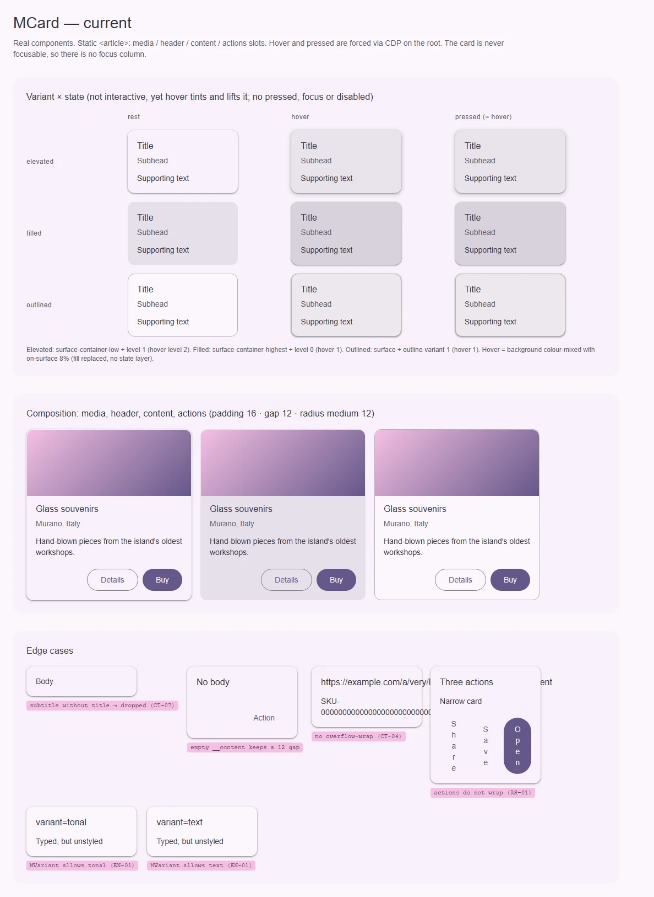
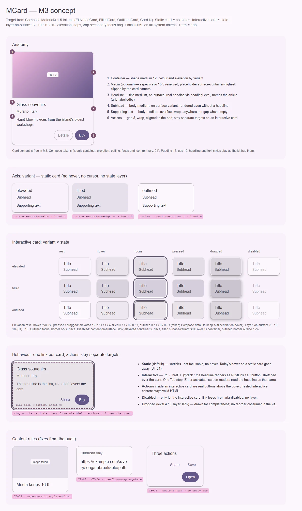

# MCard — поверхность-контейнер для одного объекта: медиа, заголовок, текст, действия

<identity>M3: Cards (elevated / filled / outlined; статичная и интерактивная карточка) · Токены Compose: `ElevatedCardTokens.kt`, `FilledCardTokens.kt`, `OutlinedCardTokens.kt`; поведение — `Card.kt` (`Card`, `ElevatedCard`, `OutlinedCard`, `CardDefaults`) · Код: `src/runtime/components/ui/card/`, токены `src/runtime/assets/stylesheet/components/card/_index.scss` · Аудит: `data/card.json` · Тип: public</identity>

<implementation-status state="planned" updated="2026-10-07">План новый. Цвета контейнеров, тени по уровням, форма 12 и обводка уже совпадают с M3; hover-тени через `elevation()` и `can-hover` починены фазой C. Шаги 1–2 чинят дефекты без смены API. Интерактивная карточка (шаг 3) ждёт вопросов 1–2.</implementation-status>

## Вердикт

`дрейф`. Три варианта M3 на месте и окрашены верно: `surface-container-low` + уровень 1,
`surface-container-highest` + 0, `surface` + `outline-variant` 1, угол `medium` 12. Разрыв — в
поведении: у M3 карточка бывает статичной (без состояний) или интерактивной (слой состояния,
шаги тени, кольцо фокуса, disabled, dragged). Кит рисует hover у статичного `<article>`, у которого
нет ни фокуса, ни pressed, ни роли, — ложная подсказка «нажми меня» (ST-01, A11-01). Hover при этом
подменяет фон, а не кладёт слой. Остальное — дефекты содержимого из аудита. Ломающее только сужение
типа `variant`.

## Рендеры

| Сейчас | Концепт M3 |
|---|---|
|  |  |

**Сейчас.**
1. Вариант × состояние. Hover принудительно выставлен на `<article>`: фон смешан с `on-surface` 8 %,
   тень поднимается на уровень. Pressed выглядит как hover. Фокуса нет — карточка не фокусируется.
2. Состав: media, header, content, actions у трёх вариантов (padding 16, gap 12).
3. Дефекты: subhead без headline не рисуется (CT-07), пустой `__content` оставляет зазор 12,
   длинное слово вылезает (CT-04), три действия в узкой карточке сжимаются в столбик (RS-01),
   `variant="tonal"` и `"text"` типизированы, но без стилей (EN-01).

**Концепт.**
1. Анатомия: шесть частей с выносками.
2. Ось `variant` для статичной карточки: без hover, без курсора, без слоя.
3. Интерактивная карточка: вариант × rest / hover / focus / pressed / dragged / disabled, тени и
   слой по токенам.
4. Поведение: одна ссылка на карточку (заголовок, растянутый `::after`), действия — отдельные цели
   поверх.
5. Правила содержимого: резерв 16:9 и заглушка медиа, перенос длинных слов, перенос действий.

## Анатомия

Нумерация — по кадру 1 концепта.

| # | Часть M3 | Элемент кита | Статус |
|---|---|---|---|
| 1 | Container (форма, цвет, тень, обводка) | `article.ui-card` + `--elevated / --filled / --outlined` | есть; корневые фон и тень дублируются литералами (`index.vue:70-72`) |
| 2 | Media | `.ui-card__media`, слот `#media` | есть; без резерва пропорций и заглушки (CT-09), `overflow: hidden` режет кольцо фокуса ссылки в медиа (IN-05) |
| 3 | Headline | `p.ui-card__title` (проп `title`) | иначе: не заголовок, `article` им не назван (A11-01) |
| 4 | Subhead | `p.ui-card__subtitle` (проп `subtitle`) | есть; без `title` не рисуется (CT-07) |
| 5 | Supporting text | `.ui-card__content`, слот по умолчанию | есть; рендерится пустым, нет переноса слов (CT-04, CT-07) |
| 6 | Actions | `footer.ui-card__actions`, слот `#actions` | есть; без `flex-wrap` (RS-01), отступы литералами (LY-04) |
| — | State layer (интерактивная карточка) | — | нет: hover подменяет фон |
| — | Focus indicator (`FocusIndicatorColor = secondary`) | — | нет: карточка не фокусируется |

Типографику и внутренние отступы M3 токенами не фиксирует (в `*CardTokens.kt` только контейнер, тень,
обводка, фокус и иконка `primary` 24), поэтому `title-medium` / `body-medium`, padding 16 и gap 12
кита остаются как есть.

## Оси дизайна

| Ось | M3 | Кит сейчас | Цель | Ломает API |
|---|---|---|---|---|
| `variant` | elevated · filled · outlined | тип `MVariant` (5 значений), стили для трёх | `Extract<MVariant, 'elevated' \| 'filled' \| 'outlined'>`, дефолт `elevated` | да, только тип (`tonal` / `text` стилей не имели) |
| Интерактивность | статичная · кликабельная (`onClick`) · selectable в гайдлайнах | только статичная, но с hover | статичная по умолчанию; интерактивная через `to` / `interactive` (вопросы 1, 2) | нет, добавление |
| Форма | `CornerMedium` у всех трёх | `var(--sys-shape-corner-medium)` | совпадает; брать из `$theme-shape-link` | нет |
| Плотность | нет | нет | нет (S5: у карточки нет оси масштаба) | — |

## Оси состояний

Из `axes` аудита, сверено с кодом.

| Ось | Нужно | Есть | Не хватает |
|---|---|---|---|
| Базовое | enabled; disabled у интерактивной | enabled | disabled интерактивной карточки |
| Взаимодействие | hover, pressed — только у интерактивной | hover у статичной (`index.vue:84-115`), в `can-hover` | убрать у статичной; слой hover / pressed у интерактивной |
| Фокус | `focus-visible`, кольцо `secondary` | нет | кольцо на карточке через `:has(:focus-visible)` |
| Перетаскивание | dragged (уровень 4 / 3, слой 16 %) | нет | вне объёма: нет заказчика (В4) |
| Навигация | ссылка-карточка | нет | `to` (вопрос 1) |
| Выбор, раскрытие, смысловое, валидация, данные | — | — | не применимо |

## Токены: расхождения

Карта — `assets/stylesheet/components/card/_index.scss`. В `index.vue` все пути легаси через дефис
(`'elevated-bg'`, `'border-width'`, `'state-layer-color'`), при правке — перевод на точку целиком.

| Часть | M3 (Compose) | Кит сейчас (`файл` / путь `g()`) | Действие |
|---|---|---|---|
| Hover | слой `on-surface` 8 % поверх контейнера (ripple цвета контента) | `color-mix` фона с `state.layer.color` 8 % (`index.vue:86, 99, 112`) — подмена фона | `::before` на интерактивной карточке, `state-opacity(hover)`; у статичной — убрать |
| Focus / pressed | слой 10 % (S1); тень: elevated 1, filled 0, outlined 0 | нет | `state-opacity(focus)`, `state-opacity(pressed)` (S1) |
| Тень hover | elevated `Level2`, filled `Level1`, outlined `Level1` по токену (`CardDefaults.outlinedCardElevation` оставляет 0) | `elevated.hover.shadow: elevation(2)`, filled и outlined — `elevation(1)` | совпадает с токеном; только на интерактивной |
| Dragged | elevated `Level4`, filled / outlined `Level3`, слой 16 % | нет | не делать (В4) |
| Фокус | `FocusIndicatorColor = secondary`; outlined: обводка → `on-surface` (`FocusOutlineColor`) | нет | `focus-ring` (3 `secondary`, отступ 2) + `outlined.focus.border.color` |
| Disabled | контент 38 %; elevated: контейнер `surface`, тень 1; filled: `surface-variant` 38 % поверх контейнера; outlined: обводка `outline` 12 % | нет | ветка `disabled` по вариантам |
| Корень | — | `background-color: surface`, `color: on-surface`, `box-shadow: elevation(1)` литералами (`index.vue:70-72`, TK-06) | удалить: вариант всегда задан |
| Отступы частей | не фиксированы | `header` gap 4, `actions` margin-top 8 и gap 8 литералами (`index.vue:142, 165, 168`, LY-04) | `header.gap`, `actions.gap`, `actions.margin` через `spacing()` |
| Форма | `CornerMedium` | `radius: var(--sys-shape-corner-medium)` (`_index.scss:7`) | `map.get($theme-shape-link, medium)`, как у остальных карт |
| Переходы | — | `transition` фона, обводки и тени на каждой карточке (TH-08) | только у интерактивной; длительности `--sys-motion-duration-short-3` (S4 отклонён — без пружин) |

Совпадает: цвета контейнеров трёх вариантов, `outline-variant` 1, тени покоя 1 / 0 / 0.

## Поведение и доступность

**Статичная карточка** (по умолчанию): `<article>`, не фокусируется, без hover и курсора. Обработчик
`@click` на ней — ошибка потребителя, а не режим (документация).

**Интерактивная карточка** (вопросы 1, 2). Образец «block link»: заголовок рендерится ссылкой
(`NuxtLink` при `to`) или кнопкой (при `interactive`), его `::after` растянут на всю карточку
(`inset: 0`). Отсюда:
- одна остановка Tab, Enter активирует, имя ссылки — текст заголовка;
- действия в `#actions` и интерактив в `#media` остаются отдельными кнопками поверх покрытия
  (`position: relative; z-index: 2` внутри `isolation: isolate`, `craft.md` §12), HTML валиден —
  нет кнопки внутри ссылки;
- кольцо фокуса рисуется на самой карточке: `.ui-card:has(.ui-card__link:focus-visible)`;
- disabled: у ссылки снимается `href` (`aria-disabled="true"`, `tabindex="-1"` не ставим — IN-08,
  карточка остаётся в обходе с объяснением), у кнопки — `aria-disabled`, клик гасится.

**Имя и структура (A11-01).** `article` получает `aria-labelledby` = id заголовка (`useId`), когда
заголовок есть. Уровень заголовка — вопрос 2.

**Прочее из аудита.**
- CT-04: `overflow-wrap: anywhere` и `min-width: 0` на корне.
- CT-07: header рендерится при `title || subtitle || $slots.header`; `__content` — только при
  `$slots.default`, чтобы не было пустого зазора.
- CT-09: проп `mediaAspectRatio` (строка, например `'16 / 9'`, по умолчанию нет — как сейчас),
  `img { height: 100%; object-fit: cover }`, фон медиа — `surface-container-highest` как заглушка.
- IN-05: `overflow: clip` с `overflow-clip-margin` на ширину кольца у `__media`; скругление
  медиа — от радиуса карточки.
- RS-01: `flex-wrap: wrap` у `__actions`.
- Forced colors: рамка `CanvasText` у elevated / filled уже есть (`index.vue:119-124`); кольцо
  фокуса — `Highlight`.

**Осознанные отклонения.** RS-04 / RS-05 (корневой размер в vw) не берём — решение владельца.

## API

| Действие | Что | Ломает | Миграция |
|---|---|---|---|
| Сузить | `variant: Extract<MVariant, 'elevated' \| 'filled' \| 'outlined'>` (EN-01) | да, тип | `tonal` и `text` никогда не имели стилей; заменить на `filled` / `outlined` |
| Добавить | `to` (NuxtLink), `interactive` (кнопка), событие `click` | нет | вопрос 1 |
| Добавить | `disabled` (имеет смысл только у интерактивной; у статичной — dev-предупреждение) | нет | — |
| Добавить | `headingLevel` | нет | вопрос 2 |
| Добавить | `mediaAspectRatio` | нет | без пропа поведение прежнее |
| Не трогать | `title`, `subtitle`, слоты `#media`, `#header`, `#actions`, по умолчанию | — | — |

## План работ

1. **S — содержимое и токены без смены API.** CT-04, CT-07, CT-09, IN-05, RS-01, LY-04, TK-06;
   удалить корневые литералы фона и тени; форма из `$theme-shape-link`; перевод `index.vue` на
   точечные пути. Файлы: `components/ui/card/index.vue`, `assets/stylesheet/components/card/_index.scss`,
   `card/props.ts` (`mediaAspectRatio`).
2. **S — статичная карточка без состояний.** Убрать hover и переходы у статичной (ST-01, TH-08);
   сузить `variant` (EN-01). Визуальное изменение: hover у всех карточек пропадает. В `docs/`
   карточку используют `app/components/mix/*`, `DocsPlaceholder.vue` и страницы компонентов;
   кликабельных (`@click`, `to`) среди них нет. Файлы: `card/index.vue`, `card/props.ts`.
3. **M — интерактивная карточка.** По вопросам 1–2: ссылка или кнопка в заголовке, растянутое
   покрытие, слой `::before` (8 / 10 / 10, S1), тени hover, кольцо через `:has()`, outlined-обводка
   `on-surface` в фокусе, disabled по вариантам, forced colors. Зависимости: S1, S9 не нужен.
   Файлы: `card/index.vue` (если SFC подходит к 400 строкам — вынести ветки состояний в
   `card/_states.scss`), `card/_index.scss` (ветки `state`, `focus`, `disabled`), `card/props.ts`.
4. **S — документация (DC-01…05).** Когда карточка, а когда `MSurface` / `MList`; одна ссылка на
   карточку; действия внутри; таблица токенов из `$tokens`.

## Тесты

- **Фикстуры** `playground/fixtures/card/`:
  - `matrix.vue`: вариант × {статичная, `to`, `interactive`} × {rest, disabled} × {медиа, без
    медиа} × {с действиями, без};
  - `stress.vue`: длинное слово в заголовке, битое изображение, пять действий в карточке 280,
    только subhead, пустое тело, RTL, сетка карточек `1fr`.
- **e2e** (`card.e2e.ts`, Playwright + axe): axe по матрице; Tab попадает на ссылку карточки, затем
  на каждое действие; Enter по карточке переходит; кольцо видно на карточке; клик по действию не
  переходит по ссылке; forced colors (кольцо `Highlight`).
- **Unit** (`card/index.spec.ts`): без `to` / `interactive` нет ни ссылки, ни `tabindex`;
  `aria-labelledby` указывает на заголовок; subhead без title рендерится; пустой слот — нет
  `__content`; `disabled` снимает `href`; уровень заголовка по `headingLevel`.

## Готово, когда

- Статичная карточка не реагирует на указатель; интерактивная — слой, тень, кольцо, disabled по
  токенам M3.
- Внутри интерактивной карточки действия — отдельные цели, HTML валиден, axe чистый.
- `variant` сужен; в `index.vue` нет литералов отступов, цветов и теней; пути `g()` точечные.
- Дефекты CT-04, CT-07, CT-09, IN-05, RS-01, LY-04, TK-06, TH-08 закрыты; линтеры и e2e зелёные.

## Предложения по UX

Сверх паритета с M3; в план работ — только после решения владельца.

1. **Горизонтальная карточка** (`orientation: 'vertical' | 'horizontal'`): медиа слева квадратом,
   текст и действия справа. Пользователь видит в два раза больше карточек на широком экране и не
   листает ради заголовков. Заказчик: каталоги и списки статей в `docs/` (`mix/*`). Цена: S, только
   CSS-ветка и проп; бандл ~0.5 KB CSS. Рекомендация: да — M3 показывает горизонтальную раскладку в
   гайдлайнах, а у кита она собирается только руками.
2. **Выбираемая карточка** (`selected` + галочка в углу, `aria-pressed` / `aria-checked`, ветка
   `selected` по S9): выбор тарифа, файлов, шаблона без отдельного чекбокса рядом. Заказчик: пока не
   назван. Цена: M, API `selected` + событие. Рекомендация: отложить до заказчика (В4), но
   зарезервировать ветку `selected` в карте при шаге 3.
3. **Скелет загрузки** (`loading`: серые плашки на месте медиа, заголовка и текста, без анимации
   переливания): сетка не прыгает, пока данные едут, высота карточки известна заранее. Заказчик:
   асинхронные сетки карточек в продуктах. Цена: S–M, проп и токены плашек (`surface-container-highest`).
   Рекомендация: да, после шага 1 — резерв пропорций медиа (CT-09) уже даёт половину.

## Открытые вопросы

**1. Как устроена интерактивная карточка.**
1. Растянутая ссылка: заголовок — `NuxtLink` / `<a>` / `<button>`, `::after` покрывает карточку,
   действия поверх. Цена: заголовок обязателен для интерактивной карточки (dev-предупреждение без
   него); сложнее CSS.
2. Корень карточки сам становится `<a>` / `<button>`. Цена: внутри нельзя класть действия и любой
   интерактив — слоты `#actions` пришлось бы запретить в этом режиме.
3. Не делать режим: документировать «оборачивай в `NuxtLink` сам». Цена: состояния и кольцо снова
   у потребителя, ST-01 закрывается только удалением hover.

Рекомендация: 1. Это единственный вариант, при котором действия внутри остаются валидными целями.

**2. Уровень заголовка карточки (A11-01).**
1. Проп `headingLevel?: 2 | 3 | 4 | 5 | 6` без дефолта: без него — `
`, как сейчас. Цена:
   потребитель должен помнить про проп; зато кит не угадывает структуру документа (прецедент
   `MListSubheader`, `components-should-update/containment/list-subheader.md`).
2. По умолчанию `<h3>`, проп меняет уровень. Цена: в странице с `h1 → h2` кит молча ломает
   иерархию там, где карточка лежит на уровне `h2`.
3. Только слот `#header`. Цена: ради заголовка теряется проп `title` и связь `aria-labelledby`.

Рекомендация: 1. Тот же ответ предлагается для `MExpansionPanel` ([expansion-panel.md](expansion-panel.md),
вопрос 1) — решать вместе.
