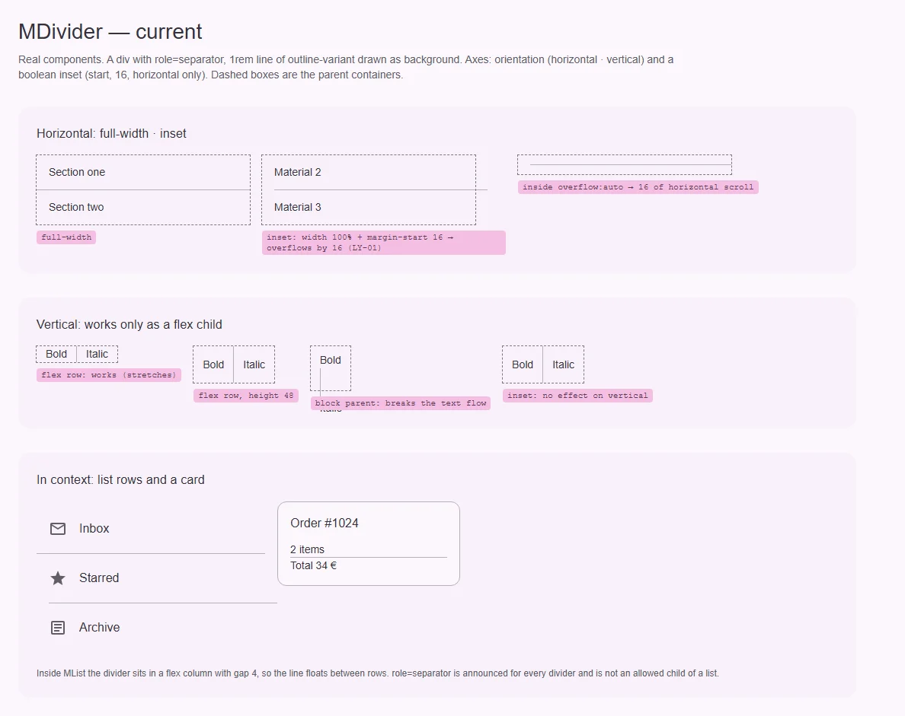
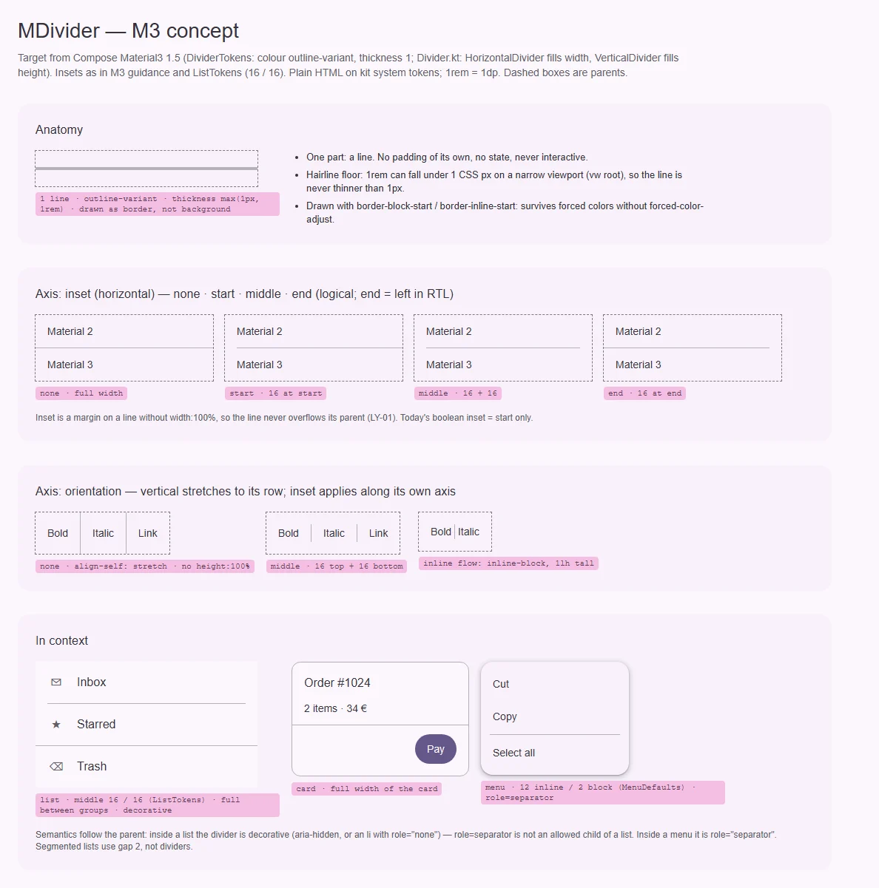

# MDivider — тонкая линия, разделяющая группы содержимого в списках и контейнерах

<identity>M3: Divider (full-width, inset, middle-inset; horizontal / vertical) · Токены Compose: `DividerTokens.kt`; поведение — `Divider.kt` (`HorizontalDivider`, `VerticalDivider`, `DividerDefaults`); отступы в контексте — `ListTokens.Divider*Space`, `MenuDefaults.HorizontalDividerPadding` · Код: `src/runtime/components/ui/divider/`, токены `src/runtime/assets/stylesheet/components/divider/_index.scss` · Аудит: `data/divider.json` · Тип: public (+ используется рецептом разделителя меню)</identity>

<implementation-status state="planned" updated="2026-10-07">План новый. Цвет, толщина и forced colors (фаза C) уже по M3. Шаг 1 чинит переполнение inset и вертикаль без смены API; шаги 2–3 ждут вопросов 1–2.</implementation-status>

## Вердикт

`дрейф`. Линия сама по себе — M3: `outline-variant`, 1dp, горизонтальная и вертикальная. Разошлись
отступы и семантика. `inset` — булев флаг на одно значение (только start, только горизонтальный),
и он ломает раскладку: `width: 100%` плюс `margin-inline-start` выталкивает линию за родителя на 16
(LY-01). Middle-inset из M3 нет. `role="separator"` стоит всегда, а внутри списка он недопустим и
лишне озвучивается. Толщина `1rem` при корне в vw может стать тоньше пикселя и пропасть (TK-02).

## Рендеры

| Сейчас | Концепт M3 |
|---|---|
|  |  |

**Сейчас.** Пунктир — родитель.
1. Горизонтальный: во всю ширину и `inset` — линия вылезает за родителя на 16, в контейнере с
   `overflow: auto` даёт горизонтальную прокрутку.
2. Вертикальный: работает только как flex-ребёнок; в блочном родителе ломает строку текста;
   `inset` на него не действует.
3. В контексте: внутри `MList` линия висит в зазоре `gap 4`, inset-линия тоже вылезает; в карточке —
   во всю ширину содержимого.

**Концепт.**
1. Анатомия: одна линия, нижняя граница толщины, рисуется рамкой.
2. Ось `inset`: none · start · middle · end (логические стороны).
3. Ось `orientation`: вертикаль растягивается по строке (`align-self: stretch`), middle-inset — по
   своей оси; inline-форма высотой в строку.
4. Контекст: список (middle 16 / 16 по `ListTokens`, во всю ширину между группами, декоративный),
   карточка, меню (12 / 2 по `MenuDefaults`, `role="separator"`).

## Анатомия

| # | Часть M3 | Элемент кита | Статус |
|---|---|---|---|
| 1 | Line (`DividerTokens.Color`, `Thickness`) | `div.ui-divider`, линия — `background-color` | иначе: фоном, а не рамкой; толщина без нижней границы 1px |
| — | Inset (отступ, а не часть) | `margin-inline-start` при `inset` | иначе: только start, ломает ширину |

## Оси дизайна

| Ось | M3 | Кит сейчас | Цель | Ломает API |
|---|---|---|---|---|
| `orientation` | horizontal · vertical | `'horizontal' \| 'vertical'` | без изменений; вертикаль — `align-self: stretch`, без `height: 100%` | нет |
| `inset` | full-width · inset (по тексту) · middle-inset (с двух сторон) | `inset: boolean` — start 16, только horizontal | `none \| start \| middle \| end`, по оси самой линии (вопрос 1) | да, тип; `true` → `'start'` алиасом |
| Семантика | Compose: нет; material-web: декоративный по умолчанию, `role="separator"` — по желанию | всегда `role="separator"` + `aria-orientation` | вопрос 2 | зависит от ответа |
| Плотность, цвет | нет | нет | нет | — |

## Оси состояний

У разделителя нет состояний: он неинтерактивен (аудит: все оси, кроме «Базовое», неприменимы).

## Токены: расхождения

Карта — `assets/stylesheet/components/divider/_index.scss`. В `index.vue` путь легаси
`'inset-margin'`, при правке — на точку.

| Часть | M3 (Compose) | Кит сейчас (`файл` / путь `g()`) | Действие |
|---|---|---|---|
| Толщина | `Thickness = 1.dp` (Compose умеет `Dp.Hairline` — ровно один физический пиксель) | `thickness: 1rem` (`_index.scss:6`) — при vw-корне на узком экране < 1px (TK-02) | `max(1px, 1rem)` |
| Способ рисования | линия на канвасе | `background-color` + `width / height` (`index.vue:29-39`) | `border-block-start` / `border-inline-start`; блок `forced-colors` с `forced-color-adjust: none` становится не нужен — рамка остаётся системным цветом сама |
| Inset | 16 (гайдлайн; в списке `ListTokens.DividerLeadingSpace = 16`, `DividerTrailingSpace = 16`) | `inset.margin: 16rem` только start (`_index.scss:7`) | `inset.size: spacing(16)`; start / middle / end через логические `margin-inline-*` (горизонталь) и `margin-block` (вертикаль) |
| Ширина | `fillMaxWidth` / `fillMaxHeight` | `width: 100%` / `height: 100%` (LY-01) | без явной ширины: блок растягивается сам; вертикаль — `align-self: stretch`, в строке текста — `inline-block` высотой `1lh` |
| Отступ в меню | `HorizontalDividerPadding` 12 по строке, 2 по блоку | — | не здесь: рецепт разделителя меню ([overlays/menu.md](../overlays/menu.md), таблица токенов) |

Совпадает: цвет `outline-variant`.

## Поведение и доступность

- **Семантика по контексту (вопрос 2).** `role="separator"` нужен там, где разделитель —
  структурная граница для скринридера (меню по APG, панель инструментов). Внутри `role="list"` он
  недопустим: прямые дети `ul` / `role="list"` — только элементы списка, `div role="separator"`
  нарушает правило axe `list` (проверить в e2e и `li role="separator"` — правило допускает не все
  роли у `li`). Там разделитель декоративный: `aria-hidden="true"` и элемент, который не ломает
  список.
- **Тег.** Внутри `ul` потребитель кладёт разделитель как `li`; для этого — `tag`
  (`'div' | 'li' | 'hr'`, вопрос 2, вариант 1). `hr` — нативный separator для статей.
- **Forced colors.** При рисовании рамкой линия сохраняется без особого блока; блок `forced-colors`
  (`index.vue:46-49`) удаляется вместе с фоном.
- **RTL.** Только логические свойства: `start` в RTL справа.

**Осознанные отклонения.** RS-04 / RS-05 (vw-корень) не берём. Нижняя граница `1px` у толщины не
спорит с этим решением: она защищает только волосяную линию от исчезновения.

## API

| Действие | Что | Ломает | Миграция |
|---|---|---|---|
| Расширить | `inset: boolean` → `inset?: 'start' \| 'middle' \| 'end'` (нет значения — во всю длину) | да, тип | `true` → `'start'`, `false` → нет: на один minor принимать булево с dev-предупреждением |
| Добавить | семантика — вопрос 2 | зависит | — |
| Не трогать | `orientation` | — | — |

## План работ

1. **S — геометрия без смены API.** Линия рамкой, `max(1px, 1rem)`, убрать `width / height: 100%`,
   вертикаль — `align-self: stretch` и inline-форма; текущий `inset` — через `margin-inline-start`
   без переполнения (LY-01, TK-02, DC-04). Точечные пути `g()`. Файлы: `components/ui/divider/index.vue`,
   `assets/stylesheet/components/divider/_index.scss`.
2. **S — ось inset.** По вопросу 1: `start | middle | end`, вертикальный inset по `margin-block`,
   алиас булева. Файлы: `divider/props.ts`, `divider/index.vue`, `divider/_index.scss`,
   `divider/index.spec.ts` (тест «new boolean API» переписать: он закрепляет флаг).
3. **S — семантика.** По вопросу 2. Перевести внутренних потребителей, если появятся: рецепт
   разделителя меню (`overlays/menu.md`, шаг 5), строки `MList`. Файлы: `divider/props.ts`,
   `divider/index.vue`.
4. **S — документация (DC-02, DC-04).** Когда full / start / middle; вертикаль во flex-строке; в
   списке декоративный, в меню — separator; Expressive-списки делят строки зазором 2, а не линией
   ([list.md](list.md)).

## Тесты

- **Фикстуры** `playground/fixtures/divider/`:
  - `matrix.vue`: orientation × inset (none / start / middle / end) в рамке-родителе;
  - `stress.vue`: родитель 120 px с `overflow: auto` (нет горизонтальной прокрутки), вертикаль в
    блочном и inline-контексте, RTL, `MList` с разделителями, меню.
- **e2e** (`divider.e2e.ts`, Playwright + axe): axe на списке с разделителями (нет
  `listitem` / `list`-нарушений); `scrollWidth === clientWidth` у узкого родителя; в forced colors
  линия видима; при ширине окна 360 толщина ≥ 1px.
- **Unit** (`divider/index.spec.ts`): классы по `inset`, алиас `true → start` с предупреждением,
  атрибуты семантики по вопросу 2.

## Готово, когда

- Ни один inset не выходит за родителя; вертикаль видна в flex-строке и в строке текста.
- Есть start / middle / end по логическим сторонам, булев `inset` живёт алиасом.
- Внутри списка axe чистый; в меню разделитель озвучивается как separator.
- Линия видна в forced colors и на узком экране; пути `g()` точечные; линтеры зелёные.

## Предложения по UX

Сверх паритета с M3; в план работ — только после решения владельца.

1. **Разделитель с подписью** (слот по умолчанию: «или», дата в ленте): текст по центру, линии по
   бокам. Пользователь сразу видит смысл границы — «Войти через… — или — e-mail». Заказчик: формы
   входа и регистрации, лента с датами (timeline). Цена: S, слот и `display: flex` с двумя
   псевдоэлементами-линиями; API — только слот. Рекомендация: да; семантика — `role="separator"` с
   `aria-label` из текста.
2. **Inset по колонке текста списка** (`inset="text"`): внутри `MList` линия начинается там, где
   текст строки (56 с иконкой, 72 с аватаром), а не на фиксированных 16. Пользователь видит, что
   разделитель отделяет записи, а не иконки. Заказчик: списки контактов и настроек с leading-медиа.
   Цена: S, значение выводится из токенов строки, как inset подзаголовка; зависит от флага
   присутствия списка в контексте. Рекомендация: после вопроса 3 плана списка.

## Открытые вопросы

**1. Значения оси `inset`.**
1. `inset?: 'start' | 'middle' | 'end'`, отсутствие — во всю длину; булево — алиас на minor.
   Цена: смена типа пропа.
2. `inset?: boolean | 'start' | 'middle'` навсегда (`true` = `start`). Цена: два способа сказать
   одно и то же (`craft.md` §2), `end` не помещается без третьего смысла `true`.
3. Флаги как в material-web (`inset`, `insetStart`, `insetEnd`). Цена: три булевых на одну ось —
   ровно то, что запрещает `principles.md` (В1).

Рекомендация: 1.

**2. Семантика разделителя.**
1. Проп `tag: 'div' | 'li' | 'hr'` и проп `decorative` (по умолчанию `false`, сохраняет сегодняшний
   `role="separator"`); в списке потребитель пишет `<MDivider tag="li" decorative />`. Цена: забытый
   `decorative` в списке оставит axe-ошибку.
2. Декоративный по умолчанию (как material-web), `role="separator"` — только явным атрибутом
   потребителя или от меню. Цена: меняет текущее поведение — все разделители вне меню перестанут
   озвучиваться.
3. По контексту: внутри `MList` (контекст списка) — `li` + `aria-hidden`, иначе — separator. Цена:
   контекст списка сегодня всегда отдаёт запасное значение и не отличает «есть список» от «нет»;
   нужен флаг присутствия.

Рекомендация: 1 сейчас — минимальный diff и прежнее поведение по умолчанию; 3 — когда `MList`
получит списочную семантику ([list.md](list.md), вопрос 3), тогда дефолт можно брать из контекста.
