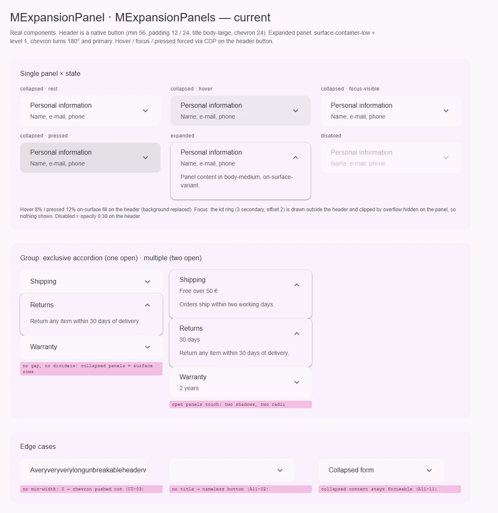
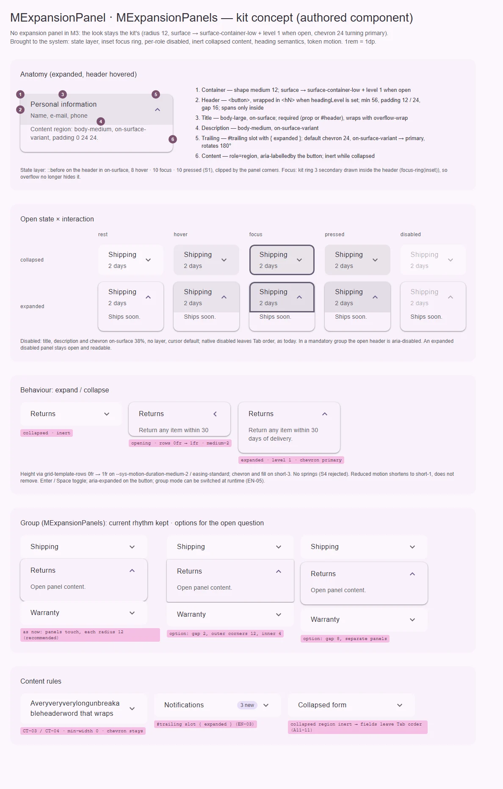

# MExpansionPanel · MExpansionPanels — раскрывающаяся панель и аккордеон из панелей

<identity>M3: нет в M3. Ближайшее — expandable-строка списка Expressive (`SegmentedListItem` с раскрытием: круг вокруг шеврона `surface` → `surface-container`, дочерние строки ниже), но это другой компонент · Токены Compose: `ExpandedListTokens.kt` (только для сравнения), системные — состояния, фокус, формы, тени · Код: `src/runtime/components/ui/expansion-panel/`, `src/runtime/components/ui/expansion-panels/`, `src/runtime/composables/expansion-panel/useExpansionPanelGroup.ts`, токены `src/runtime/assets/stylesheet/components/expansion-panel/_index.scss` · Аудит: `data/expansion-panel.json`, `data/expansion-panels.json` · Тип: public (панель) + public-контейнер (группа)</identity>

<implementation-status state="planned" updated="2026-10-07">План новый, покрывает обе папки. Hover в `can-hover`, непрозрачности через `state-opacity()`, тень через `elevation()`, рамка в forced colors уже сделаны (фазы A–C). Шаги 1–2 чинят доступность и систему без смены API; шаг 3 и вопросы 1–3 — смена API.</implementation-status>

## Вердикт

`авторский`. Панели в M3 нет, эталон — текущий вид: контейнер с углом 12, `surface` в покое и
`surface-container-low` с уровнем 1 в раскрытом виде, заголовок 56 с паддингом 12 / 24, шеврон 24,
который поворачивается и становится `primary`. Этот вид сохраняется. Довести до системы нужно
доступность и состояния: свёрнутое содержимое остаётся в обходе Tab (A11-11), кольцо фокуса
обрезается корнем, hover и pressed подменяют фон, disabled — одна непрозрачность, внутри `<button>`
лежат `div`, заголовка по APG нет, `loading` объявлен и не работает, `multiple` группы нереактивен.

## Рендеры

| Сейчас | Концепт |
|---|---|
|  |  |

**Сейчас.**
1. Одна панель × свёрнута (rest, hover, focus-visible, pressed), раскрыта, disabled. Hover, фокус и
   pressed принудительно выставлены на кнопке заголовка. Фокус не виден: кольцо кита рисуется
   снаружи и обрезано `overflow: hidden` панели.
2. Группа: эксклюзивный аккордеон (одна открыта) и `multiple` (две открыты). Панели стоят вплотную,
   у каждой угол 12.
3. Дефекты: длинное слово выталкивает шеврон (CT-03), панель без заголовка — кнопка без имени
   (A11-02), поле в свёрнутой панели остаётся в обходе (A11-11).

**Концепт** (тот же вид, доведённый по системе).
1. Анатомия, шесть выносок; слой состояния и кольцо внутри заголовка.
2. Свёрнута / раскрыта × rest, hover, focus, pressed, disabled.
3. Поведение: свёрнута (inert) → раскрывается (строки сетки 0fr → 1fr) → раскрыта.
4. Группа: текущий ритм (панели вплотную) и два варианта для вопроса 2.
5. Правила содержимого: перенос длинного заголовка, слот `#trailing`, inert-содержимое.

## Анатомия

Нумерация — по кадру 1 концепта.

| # | Часть | Элемент кита | Статус |
|---|---|---|---|
| 1 | Контейнер | `div.ui-expansion-panel`, `--expanded`, `--disabled` | есть; `overflow: hidden` режет кольцо (IN-05); мёртвый переход `margin` (`index.vue:112`) |
| 2 | Заголовок | `button.ui-expansion-panel__header` | иначе: без обёртки-заголовка (A11-01); внутри `div` вместо фразового содержимого |
| 3 | Название | `span.ui-expansion-panel__title`, проп `title` | есть; без `min-width: 0` и переноса (CT-03, CT-04); пустое — кнопка без имени (A11-02) |
| 4 | Описание | `span.ui-expansion-panel__description`, проп `description` | есть |
| 5 | Индикатор раскрытия | `div.ui-expansion-panel__trailing` с `m-icon` | иначе: не заменить (EN-03); `MIcon` из авто-импорта (EN-09) |
| 6 | Содержимое | `div.__content-wrapper` (`role="region"`, `aria-labelledby`, `aria-hidden`) → `__content-inner` → `__content` | иначе: свёрнутое лишь `aria-hidden` + `opacity: 0`, фокусируемо (A11-11) |
| — | Слой состояния | — | нет: hover / pressed подменяют фон заголовка |
| — | Группа | `div.ui-expansion-panels` без стилей | нет собственных токенов (вопрос 2) |

## Оси дизайна

| Ось | Аналог в M3 | Кит сейчас | Цель | Ломает API |
|---|---|---|---|---|
| Открытость | expandable-строка: свёрнута / раскрыта | `v-model` или группа | без изменений | нет |
| Режим группы | — | `multiple`, `mandatory`; `multiple` читается один раз (EN-05) | реактивный | нет |
| Уровень заголовка | — | нет | вопрос 1 | нет, добавление |
| Индикатор | шеврон в круге (`ExpandedListTokens.TrailingIconShape` full) | шеврон без круга, поворот, `primary` у раскрытой | шеврон кита сохраняется; слот `#trailing` с `{ expanded }` | нет |
| Ритм группы | segmented: зазор 2, внешние углы 16 | панели вплотную, угол 12 у каждой | вопрос 2 | нет, визуально |
| Плотность | — | нет | нет (S5: заголовок 56 фиксирован, ось нужна полям и спискам) | — |

## Оси состояний

Из `axes` обоих аудитов, сверено с кодом.

| Ось | Нужно | Есть | Не хватает |
|---|---|---|---|
| Базовое | enabled, disabled | нативный `disabled`, `opacity` на заголовок (`index.vue:132-135`) | disabled по ролям (ST-06); в `mandatory` открытая панель — `aria-disabled="true"` (APG Accordion) |
| Взаимодействие | hover, pressed — слой | подмена фона (`index.vue:137-145`), hover в `can-hover` | слой `::before` |
| Фокус | кольцо, видимое целиком | `focus-ring` снаружи (`index.vue:224-226`), обрезано | `focus-ring(inset)` |
| Раскрытие | collapsed / expanded, `aria-expanded`, скрытое содержимое вне обхода | `aria-expanded`, анимация `grid-template-rows` | `inert` у свёрнутого (A11-11); reduced motion (A11-18) |
| Данные | — | `loading` из `makeStateProps`, не реализован (EN-01) | вопрос 3 |
| Выбор, навигация, смысловое, валидация | — | — | не применимо |

## Токены: расхождения

Карта — `assets/stylesheet/components/expansion-panel/_index.scss`. В `index.vue` все пути легаси через
дефис и `material-map()` (`'base-bg-default'`, `'header-min-height'`, `index.vue:108-202`) — перевести на
точку целиком. Это авторский компонент: значения вида не меняются, меняется способ.

| Часть | Система кита / M3 | Кит сейчас (`файл` / путь `g()`) | Действие |
|---|---|---|---|
| Hover / pressed | слой цвета контента: `on-surface` 8 / 10 (S1) поверх фона | `header.hover.bg`, `header.active.bg` — `color-mix` в фон (`_index.scss:21-26`) | `::before` у заголовка, `state-opacity(hover / pressed)`; на раскрытой — тот же слой поверх `surface-container-low` |
| Focus | `focus-ring` 3 `secondary`; поверх слоя 10 % | кольцо снаружи, обрезано `overflow: hidden` | `focus-ring(inset)`, слой `state-opacity(focus)`; корень — `overflow: clip` |
| Disabled | контент `on-surface` 38 %, контейнер прежний | `disabled.opacity` на заголовок (`_index.scss:59`) | `disabled.title.color`, `disabled.icon.color` через `state-opacity(disabled-content)` |
| Форма | `medium` 12 | `base.border.radius: var(--sys-shape-corner-medium)` | `map.get($theme-shape-link, medium)` — значение то же |
| Отступы | `spacing()` | `header.padding: 12rem 24rem` строкой, `content.padding.*` | ключи `header.padding.block` / `.inline` через `spacing()` |
| Движение | S4 отклонён: токены длительности | высота `medium-2`, шеврон и фон `short-3` (`index.vue:110-114, 172, 180`); reduced motion нет | оставить; при `prefers-reduced-motion` — `short-1` (кит укорачивает, не выключает); `margin` из перехода удалить |
| Группа | segmented: зазор 2, углы 16 / 4 | нет карты | по вопросу 2 |

Совпадает и сохраняется: `surface` / `surface-container-low`, тень `elevation(1)` у раскрытой, заголовок
56, gap 16, `body-large` / `body-medium`, шеврон 24 `on-surface-variant` → `primary`.

## Поведение и доступность

**APG Accordion.**
- Кнопка заголовка внутри элемента-заголовка (вопрос 1); внутри кнопки — только `span`
  (`__header-content`, `__trailing` сейчас `div`). В документации: в `#header` нельзя класть
  интерактив.
- `aria-expanded` и `aria-controls` на кнопке, у содержимого `role="region"` + `aria-labelledby`
  (есть). APG советует не плодить регионы, когда одновременно открыто больше ~6 панелей, — в
  `multiple`-группе роль региона можно снимать; оставить как есть до заказчика.
- В эксклюзивной группе с `mandatory` открытая панель не закрывается — её кнопка получает
  `aria-disabled="true"` (APG), а не молча игнорирует нажатие.
- Enter / Space — нативная кнопка. Стрелки между заголовками — по APG необязательны; см. «Предложения
  по UX».

**Свёрнутое содержимое (A11-11).** `inert` на `__content-wrapper`, пока панель свёрнута, вместо
`aria-hidden`: поля и ссылки выпадают из обхода и из дерева доступности, axe `aria-hidden-focus`
закрыт. Анимация высоты через `grid-template-rows` остаётся. На время закрытия `inert` ставится сразу
(фокус внутри уходит на кнопку заголовка, если был там).

**Имя (A11-02).** Без `title` и без `#header` — dev-предупреждение; дефолтного текста кит не ставит
(`craft.md` §6).

**Поведение в композабл** (`behavior.md`). `useExpansionPanelControl` отдаёт `headingAttrs`,
`buttonAttrs`, `regionAttrs` и `toggle`, без классов и `data-*`; спека монтирует бэги на анонимную
разметку. Группа (`useExpansionPanelGroup`) остаётся контекстом; `multiple` и `value` реактивны
(EN-05): при смене `multiple` выбор пересоздаётся с переносом открытых значений, при смене `value`
тикет перерегистрируется.

**Атрибуты (EN-04).** `inheritAttrs: false`: `class` и `style` — на корень, остальное (`id`,
`aria-describedby`, `data-*`) — на кнопку.

**Прочее.** CT-03, CT-04: `min-width: 0` и `overflow-wrap: anywhere` у названия и содержимого.
LY-10: `text-align: start`. EN-09: явный импорт `MIcon`. Forced colors: рамка у раскрытой есть
(`index.vue:216-221`); кольцо — `Highlight`, disabled — `GrayText`.

**Не берём.** IN-08 (фокусируемый disabled) — нет заказчика; нативный `disabled` у кнопки, как у
`MListItem` ([list.md](list.md)). TH-08 (волна переходов при смене темы) — системная задача
переключателя темы, не панели. RS-04 / RS-05 / RS-12 — vw-корень, решение владельца.

## API

| Действие | Что | Ломает | Миграция |
|---|---|---|---|
| Добавить | `headingLevel` | нет | вопрос 1 |
| Добавить | слот `#trailing="{ expanded }"` (EN-03) | нет | по умолчанию — прежний шеврон |
| Изменить | `$attrs` кроме `class` / `style` уходят на кнопку (EN-04) | да, поведение | `id` и `aria-*`, повешенные на панель, оказываются на кнопке — так и задумывалось; проверить `docs/` |
| Изменить | `MExpansionPanels.multiple` реактивен (EN-05) | нет | — |
| Убрать | `loading` — вопрос 3 | да, тип | dev-предупреждение на minor |
| Добавить | `useExpansionPanelControl` (escape hatch) | нет | — |
| Не трогать | `v-model`, `value`, `title`, `description`, `disabled`, слоты `#header` и по умолчанию, `mandatory` | — | — |

## План работ

1. **S — доступность без смены API.** `inert` вместо `aria-hidden` (A11-11), `span` внутри кнопки
   (A11-01, часть), dev-предупреждение без имени (A11-02), `aria-disabled` у открытой панели в
   `mandatory`, явный `MIcon` (EN-09), CT-03, CT-04, LY-10, reduced motion (A11-18). Файлы:
   `components/ui/expansion-panel/index.vue`.
2. **S — система стилей.** Слой `::before`, `focus-ring(inset)`, `overflow: clip`, disabled по ролям,
   точечные пути и `spacing()`, форма из `$theme-shape-link`, удалить переход `margin`. Вид не
   меняется. Файлы: `expansion-panel/index.vue`, `assets/stylesheet/components/expansion-panel/_index.scss`.
3. **M — композабл и API.** `useExpansionPanelControl` (+ спека на анонимной разметке), EN-04,
   EN-05, `#trailing`, `headingLevel` (вопрос 1). Если SFC приближается к 400 строкам — стили
   состояний в `expansion-panel/_states.scss`. Файлы: `composables/expansion-panel/useExpansionPanelControl.ts`,
   `useExpansionPanelGroup.ts`, `expansion-panel/{index.vue,props.ts}`,
   `expansion-panels/{index.vue,props.ts}`.
4. **S — ритм группы.** По вопросу 2; при варианте 1 — только документировать. Файлы:
   `expansion-panels/index.vue` (блок стилей), `expansion-panel/_index.scss` (ветка `group`).
5. **S — `loading`.** По вопросу 3. Файлы: `expansion-panel/props.ts`.
6. **S — документация (DC-01…05).** Когда панель, а когда вкладки или отдельная страница; группа,
   `multiple`, `mandatory`, `v-model` (значение или массив), `value`; клавиатура; судьба фокуса в
   свёрнутом содержимом; токены из карты.

## Тесты

- **Фикстуры** `playground/fixtures/expansion-panel/`:
  - `matrix.vue`: одиночная панель × {свёрнута, раскрыта} × {rest, disabled} × {title, title +
    description, `#header`, `#trailing`}; группы exclusive / multiple / mandatory;
  - `stress.vue`: длинное слово в названии, форма из пяти полей в свёрнутой панели, 20 панелей,
    переключение `multiple` на лету, смена `value`, RTL, панель без названия.
- **e2e** (`expansion-panel.e2e.ts`, Playwright + axe): axe на свёрнутой панели с полями (нет
  `aria-hidden-focus`); Tab пропускает свёрнутое содержимое; Enter / Space раскрывают; эксклюзивная
  группа закрывает соседнюю; `mandatory` — `aria-disabled` у открытой; кольцо фокуса видно целиком;
  reduced motion; forced colors.
- **Unit**: `expansion-panel/index.spec.ts` — `inert` по состоянию, атрибуты на кнопке, уровень
  заголовка, предупреждение без имени; спека `useExpansionPanelControl` — бэги без `class` и
  `data-*`; `expansion-panels/index.spec.ts` — реактивный `multiple`, перерегистрация при смене
  `value`, начальное значение `v-model` (есть).

## Готово, когда

- Свёрнутое содержимое не достижимо ни Tab, ни скринридером; axe чистый.
- Кольцо фокуса видно целиком; hover и pressed — слой; disabled по ролям; внешний вид панели прежний.
- `multiple` и `value` реактивны, атрибуты потребителя на кнопке, есть `#trailing` и escape hatch.
- Пути `g()` точечные, литералов нет, переходы на токенах; линтеры, unit и e2e зелёные.

## Предложения по UX

Сверх текущего видения; в план работ — только после решения владельца.

1. **«Раскрыть всё / свернуть всё»** у `multiple`-группы: `expandAll()` / `collapseAll()` через
   `defineExpose` и `v-model`. Пользователь длинного FAQ или настроек открывает всё одним действием и
   ищет глазами. Заказчик: FAQ и страницы настроек в `docs/`. Цена: S, без новых пропов. Рекомендация:
   да.
2. **Поиск по странице внутри свёрнутых панелей**: `hidden="until-found"` вместо `inert` там, где
   браузер его поддерживает, и раскрытие панели по событию `beforematch`; плюс открытие по якорю
   `#value` в URL. Ctrl+F находит ответ в закрытой панели и открывает её. Заказчик: FAQ, документация.
   Цена: M — анимация высоты на `until-found` не работает, нужна ветка; в остальных браузерах —
   `inert`. Рекомендация: да, отдельной задачей после шага 1.
3. **Индикатор ошибок в заголовке**: свёрнутая панель с невалидными полями показывает иконку
   `error` и счётчик в trailing (через контекст валидации кита). Пользователь видит, где ошибка, не
   раскрывая все секции. Заказчик: длинные формы, `MFormRenderer`. Цена: M, нужен счётчик ошибок
   поддерева из адаптера валидации. Рекомендация: согласовать с
   [form/form-renderer.md](../form/form-renderer.md).
4. **Ленивое содержимое** (`lazy`): тело рендерится при первом раскрытии через существующий
   `MLazy` ([components-should-update/foundation/lazy.md](../foundation/lazy.md)). Тяжёлые панели (таблицы, графики) не
   замедляют первую отрисовку. Заказчик: страницы с десятками панелей. Цена: S, проп. Рекомендация:
   да, если в `docs/` появится такая страница.
5. **Стрелки между заголовками** (APG, необязательная часть): ↑ / ↓ / Home / End переводят фокус по
   заголовкам группы. Клавиатурный пользователь не проходит Tab через всё открытое содержимое.
   Заказчик: длинные аккордеоны. Цена: S, в `useExpansionPanelGroup`, roving не нужен — только
   перевод фокуса. Рекомендация: отложить до заказчика.

## Открытые вопросы

**1. Уровень заголовка панели (A11-01).**
1. Проп `headingLevel?: 2 | 3 | 4 | 5 | 6` без дефолта: без него — кнопка без обёртки, как сейчас.
   Цена: APG рекомендует заголовок у каждой панели, а без пропа его не будет; зато кит не угадывает
   структуру документа (прецедент `MListSubheader`).
2. По умолчанию `h3`, проп меняет уровень. Цена: на странице, где аккордеон стоит под `h1`, кит
   ломает иерархию заголовков.
3. `role="heading"` + `aria-level` (по умолчанию 3) на обёртке-`div`. Цена: та же проблема, что в 2,
   плюс ARIA вместо нативного элемента.

Рекомендация: 1, тем же решением, что у `MCard` ([card.md](card.md), вопрос 2); в документации —
«задай `headingLevel`».

**2. Ритм панелей в группе.**
1. Как сейчас: панели вплотную, у каждой угол 12, раскрытая приподнята тенью. Цена: на стыках
   свёрнутых панелей видны выемки скруглений; группа не имеет своей карты.
2. Ритм segmented-списка M3: зазор 2, внешние углы 12, внутренние 4. Цена: заметное изменение вида
   авторского компонента.
3. Зазор 8, каждая панель — отдельная поверхность. Цена: группа перестаёт читаться как одно целое.

Рекомендация: 1 — эталон авторского компонента — текущий вид; 2 — если владелец захочет приблизить
группу к спискам Expressive.

**3. Проп `loading` (EN-01).**
1. Удалить: пропы панели без `makeStateProps`, dev-предупреждение на minor. Цена: ломающее изменение
   типа; заказчика нет.
2. Реализовать: `aria-busy` на регионе и индикатор в trailing. Цена: поведение без заказчика (В4).

Рекомендация: 1, тем же решением, что у `MListItem` ([list.md](list.md), вопрос 5).
