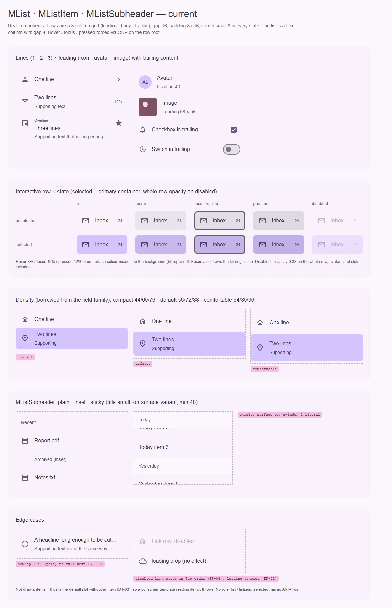
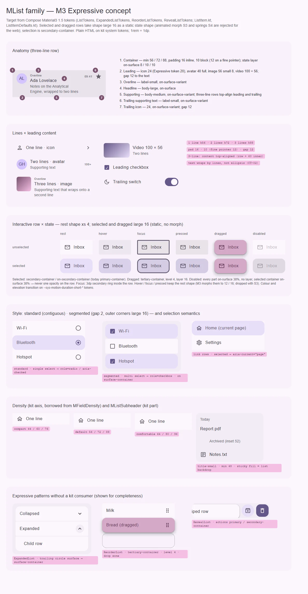

# MList · MListItem · MListSubheader — вертикальный список строк с текстом, медиа и действиями

<identity>M3: Lists (Expressive: standard и segmented списки; интерактивная строка — действие, одиночный и множественный выбор; reorder, swipe-reveal, expandable) · Токены Compose: `ListTokens.kt`, `ExpandedListTokens.kt`, `ReorderListTokens.kt`, `RevealListTokens.kt`; поведение — `ListItem.kt` (`ListItem`, `SegmentedListItem`, `InteractiveListItem`), `ListItemDefaults.kt` (`ContentPadding`, `shapes`, `segmentedShapes`, `colors`) · Код: `src/runtime/components/ui/list/` (`index.vue`, `context.ts`, `types.ts`, `item/`, `subheader/`), токены `src/runtime/assets/stylesheet/components/list/{_index,item/_index,subheader/_index}.scss` · Аудит: `data/list.json` · Тип: public-семейство (+ строки панели `MDropdown` / `MAutocomplete`, содержимое `MNavigationDrawer` и `MSheet` у потребителей)</identity>

<implementation-status state="planned" updated="2026-10-07">План новый, покрывает семейство целиком. Подзаголовок описан отдельно: [components-should-update/containment/list-subheader.md](list-subheader.md). Плотность (`MListItemDensity = MFieldDensity`), `can-hover`, forced colors у выбранной строки уже сделаны. Шаг 1 чинит дефекты без смены API; шаги 2–4 ждут вопросов 1–6.</implementation-status>

## Вердикт

`переработка`. Строка узнаётся как M3: высоты 56 / 72 / 88, типографика `body-large` /
`body-medium` / `label-small`, аватар 40, изображение 56, фокус `secondary`. Но список не говорит
скринридеру, что он список (A11-01), а выбранная строка — что она выбрана (A11-06): выбор передан
только тоном, и тон не тот — `primary-container` вместо `secondary-container`. Геометрия строки —
третья редакция, не совпадающая ни с baseline, ни с Expressive: угол 8 во всех состояниях, зазор
между строками 4, gap 16, иконки 24. Состояния подменяют фон вместо слоя, disabled — одна
непрозрачность на всё дерево, проп `loading` объявлен и не работает. Семантика списка и выбора
требует ломающих изменений разметки, поэтому `переработка`, а не `дрейф`.

## Рендеры

| Сейчас | Концепт M3 |
|---|---|
|  |  |

**Сейчас.**
1. Строки 1 / 2 / 3 × leading (иконка, `MAvatar`, изображение), trailing (иконка, текст, `MCheckbox`,
   `MSwitch`).
2. Интерактивная строка (`tag="button"`) × rest / hover / focus-visible / pressed / disabled,
   невыбранная и выбранная. Hover, фокус и pressed принудительно выставлены на корне строки: фон
   смешан с `on-surface`; выбор — `primary-container`; disabled — непрозрачность 0.38 на всю строку.
3. Плотность `compact` / `default` / `comfortable`.
4. `MListSubheader`: обычный, `inset`, `sticky` в прокрутке (заливка `surface` не совпадает с фоном
   панели).
5. Дефекты: обрезка `nowrap` + многоточие без доступа к тексту (CT-02), отключённая строка-ссылка,
   `loading` без эффекта (EN-01).

**Концепт.**
1. Анатомия трёхстрочной строки, семь выносок.
2. Строки × leading: иконка, аватар, изображение, видео; чекбокс в начале, переключатель в конце.
3. Интерактивная строка × rest / hover / focus / pressed / dragged / disabled, невыбранная и
   выбранная: форма покоя `extra-small` 4, выбранная и перетаскиваемая — `large` 16 статично (S3).
4. Стиль standard и segmented (зазор 2, внешние углы 16) и семантика выбора: radio, checkbox,
   `aria-current`.
5. Плотность кита и подзаголовок (inset 52 = 16 + 24 + 12, заливка sticky = фон списка).
6. Паттерны Expressive без заказчика в ките: expandable, reorder, swipe-reveal.

## Анатомия

Нумерация — по кадру 1 концепта.

| # | Часть M3 | Элемент кита | Статус |
|---|---|---|---|
| — | List container (`ListTokens.ContainerShape` large — для segmented) | `div.ui-list` (`list/index.vue`), flex-колонка, `gap 4` | иначе: нет роли списка; зазор 4 — ни standard (0), ни segmented (2) |
| 1 | Item container + state layer | `.ui-list-item` (`div` / `button` / `a` / `NuxtLink`) | иначе: слой подменяет фон; угол 8 во всех состояниях |
| 2 | Leading: icon / avatar / image / video | `.ui-list-item__leading`, проп `leadingIcon`, слот `#leading` | есть; размеры через вложенные селекторы `img`, `.ui-avatar`; `video` в токенах есть, в стилях нет |
| 3 | Overline | `.ui-list-item__overline` | есть; `margin-bottom: 4rem` литералом |
| 4 | Headline | `.ui-list-item__headline` | есть; всегда `nowrap` + многоточие (CT-02) |
| 5 | Supporting text | `.ui-list-item__supporting` | есть; то же |
| 6 | Trailing supporting text | `.ui-list-item__trailing-supporting` | есть |
| 7 | Trailing icon / control | `.ui-list-item__trailing`, проп `trailingIcon`, слот `#trailing` | есть; gap 8 литералом |
| — | Focus indicator | `focus-ring(inset)` (`item/index.vue:232`) | есть |
| — | Divider | `MDivider` у потребителя; токены `divider` в `list/_index.scss:20-27` | мёртвые токены; семантика — [divider.md](divider.md) |
| — | Subheader | `MListSubheader` | часть кита, в M3 Compose нет — [list-subheader.md](list-subheader.md) |
| — | Segmented gap, expandable trailing, drag handle, reveal actions | — | нет; вне объёма (В4) |

## Оси дизайна

| Ось | M3 | Кит сейчас | Цель | Ломает API |
|---|---|---|---|---|
| Строки (`lines`) | one · two · three, тип выводится из содержимого и многострочности supporting | `1 \| 2 \| 3 \| 'auto'` | без изменений; смысл явного числа — вопрос 6 | нет |
| Плотность (`density`) | нет (только уплотнение отступов 10 → 12 у точного указателя) | `MListItemDensity = MFieldDensity`: 44 / 56 / 64 для одной строки, +16 на строку | без изменений — ось кита (S5, `axes.md`: одолжена у полей ради дропдауна) | нет |
| Редакция строки | baseline (угол 0, gap 16, иконки 24) или Expressive (угол 4 → 16 у выбранной, gap 12, иконки 20) | своя: угол 8, gap 16, иконки 24, зазор между строками 4 | вопрос 2 | нет, визуально |
| Взаимодействие | нет · действие · одиночный выбор · множественный выбор | `interactive`, `tag`, `to`; `selected` только цветом | роли и состояние выбора — вопрос 4 | нет |
| Цвет выбора | `secondary-container` | `primary-container` | вопрос 1 | нет, визуально (задевает дропдаун) |
| Стиль списка | standard · segmented (зазор 2, внешние углы 16) | нет | вне объёма, нет заказчика (В4) | — |
| Reorder · swipe-reveal · expandable | есть в Expressive | нет | вне объёма (В4) | — |

## Оси состояний

Из `axes` аудита, сверено с текущим кодом.

| Ось | Нужно | Есть | Не хватает |
|---|---|---|---|
| Базовое | enabled, disabled по ролям | disabled — `opacity` строки (`item/index.vue:282-286`); у ссылки только `pointer-events: none` | disabled по частям (ST-06); отключённая ссылка остаётся в обходе и переходит по Enter (ST-04); `loading` объявлен и не реализован (ST-01) |
| Взаимодействие | hover, pressed — слой цвета контента | hover в `can-hover` (`:219`), pressed (`:225`), ripple — подменой фона | слой `::before` |
| Фокус | `focus-visible`, кольцо `secondary` | слой 10 % + `focus-ring(inset)` | — |
| Выбор | selected + программный двойник | `primary-container`, только цвет | ARIA (A11-06), роль цвета (вопрос 1) |
| Навигация | ссылка; активная — `aria-current` | `to` → `NuxtLink` | `aria-current` |
| Перетаскивание | dragged: `tertiary-container`, уровень 4, форма 16 | нет | вне объёма (В4) |
| Данные | пусто, загрузка | `items` через scoped-слот | пустой массив роняет шаблон потребителя (DT-03), нет `#empty` (EN-03) |
| Раскрытие, смысловое, валидация | — | — | не применимо |

## Токены: расхождения

Карты: `list/_index.scss` (список), `list/item/_index.scss` (строка). Пути `g()` в обоих SFC уже
точечные.

| Часть | M3 (Compose) | Кит сейчас (`файл` / путь `g()`) | Действие |
|---|---|---|---|
| Зазор между строками | standard 0; segmented `SegmentedGap` 2 | `container.gap: 4rem` (`list/_index.scss:10`) | по вопросу 2 |
| Отступы строки по блоку | Expressive `ItemTopSpace` / `ItemBottomSpace` 10, у точного указателя 12; baseline 8, у трёхстрочной 12 | `padding.top` / `padding.bottom` 8 | по вопросу 2; трёхстрочная — 12 вместо `margin-top: 4rem` у leading / trailing (`item/index.vue:204-214`) |
| Отступы по строке | `ItemLeadingSpace` / `ItemTrailingSpace` 16 | `padding.leading` / `padding.trailing` 16 — физическим shorthand (`:177`, LY-10) | значения совпадают; `padding-inline-start / -end`, `text-align: start` |
| Leading → текст, текст → trailing | Expressive `ItemBetweenSpace` 12; baseline 16 | `padding.between` 16 (grid gap); внутри trailing gap 8 литералом (`:347`) | по вопросу 2; trailing gap → токен `trailing.gap` |
| Форма строки | baseline: `ItemContainerShape` none, selected `large`; Expressive: `extra-small` 4, selected / dragged `large` 16 (hover `medium`, focus / pressed `large` — анимированный морф, отклонён S3) | `shape: small` во всех состояниях (`item/_index.scss:33`) | по вопросу 2; статичная форма у selected, без перехода радиуса |
| Цвет выбора | `ItemSelectedContainerColor` = `secondary-container`; текст, иконки, overline, supporting → `on-secondary-container` | `container.selected.color` = `primary-container`, контент `on-primary-container` (`:38-40`, `:52`) | вопрос 1 |
| Hover / focus / pressed | слой цвета контента 8 / 10 / 10 (S1) | `state.*` = `on-surface` 8 / 10 / 12, `color-mix` в фон (`:221-233`, `:268-278`) | `::before`, `state-opacity()`; у выбранной слой поверх контейнера — без второй тройки правил |
| Disabled | каждая часть `on-surface` 38 %; контейнер = контейнер строки | `container.disabled.opacity` 0.38 на корень (`:42`, `item/index.vue:284`) | `disabled.label.color`, `disabled.icon.color`… через `state-opacity(disabled-content)`; выбранная отключённая — контейнер `on-surface` 12 % (`disabled-container`; токен `ItemSelectedDisabledContainer*` = 38 % Compose 1.5 не применяет) |
| Иконки | baseline 24; Expressive `ItemLeadingIconExpressiveSize` / `Trailing…` 20 | 24; `min-width: 24rem` литералом (`:294`) | по вопросу 2; `min-width` из `leading.icon.size` |
| Изображение / видео | Expressive `ItemLeadingImageExpressiveShape` small; видео 100 × 56 small, large-видео 114 × 64 | image 56 small ✓; `leading.video` в стилях не используется | правило для `video` или удалить токен (TK-06); 114 × 64 — нет заказчика |
| Аватар | 40, full, `primary-container` / `on-primary-container`, `title-medium` | размер 40 ✓; `leading.avatar.color` / `.label` не используются — цвет даёт `MAvatar` | удалить неиспользуемые ключи (TK-06) |
| Overline → headline | без отступа | `margin-bottom: 4rem` литералом (`:319`), supporting `margin-top: 4rem` (`:338`) | токены `overline.gap`, `supporting.gap` через `spacing()` |
| Разделитель | `DividerLeadingSpace` / `TrailingSpace` 16 | `divider` в `list/_index.scss:20-27`, нигде не читается | удалить; отступы — у `MDivider` (`inset="middle"`) |
| Переходы | цвет — DefaultEffects, форма и тень — FastSpatial (пружины) | `background-color`, `color`, `outline` на `short-3` | пружины не вводим (S4); `outline` убрать из перехода — фокус не анимируется (`color-and-state.md`) |

Совпадает: высоты 56 / 72 / 88 при `density="default"`, типографика всех текстовых частей и их
цвета, аватар 40, изображение 56, кольцо фокуса `secondary`.

## Поведение и доступность

**Семантика списка (A11-01, вопрос 3).** Сейчас `div` без роли и строки без `listitem`. Цель:
статичный список — `ul` / `li` (или `role="list"` / `"listitem"`), интерактивная строка — кнопка или
ссылка **внутри** элемента списка. Когда `MList` получает роль от потребителя (`listbox` у дропдауна
через `control.listboxAttrs`), строки остаются `role="option"` без `li` — их атрибуты задаёт
`useDropdownControl.getOptionAttrs`, и это уже работает.

**Выбор (A11-06, TH-05, вопрос 4).** У выбранной строки должен быть программный двойник и
нецветовой признак. Двойник зависит от элемента: ссылка — `aria-current="page"`, кнопка —
`aria-pressed`, `option` — `aria-selected` (его ставит дропдаун). Нецветовой признак — галочка или
контрол выбора в слоте, как в дропдауне (`ICONS.check` в `#leading`); форма `large` 16 у выбранной
(вопрос 2) — второй признак.

**Клавиатура (A11-08).** Каждая интерактивная строка — своя остановка Tab, как у кнопок. Список
выбора со стрелками, Home / End и typeahead — это listbox, и он у кита уже есть в дропдауне. Режим
`selectable` у `MList` без заказчика не заводим (В4); когда появится, он строится на общем listbox
из [dropdown.md](../inputs/dropdown.md) (шаг 2), а не на третьем контроллере (`behavior.md`).

**Disabled.** Строка-ссылка при `disabled` рендерится без `href` (`span` или `a` без атрибута) с
`aria-disabled="true"` и выпадает из обхода — как нативная кнопка (ST-04). Эмулированная кнопка
сохраняет нынешнее `tabindex="-1"`. IN-08 (фокусируемый disabled) здесь не берём: у меню он взят,
потому что у пункта меню есть стрелочная навигация, у строки списка её нет.

**Данные (DT-03, EN-03).** `items` передан и пуст → слот `#empty`; слот по умолчанию без `item`
вызывается только когда `items` не передан. Виртуализация (CT-08) — в
[components-should-update/foundation/virtual-scroll.md](../foundation/virtual-scroll.md), не здесь.

**Содержимое.** CT-04: `overflow-wrap: anywhere` у тела строки. CT-02 — вопрос 6. CT-09:
изображению — фон-заглушка `surface-container-highest`; для лиц — `MAvatar` с запасным видом.

**Межкомпонентные связи.**
- `MDropdown` / `MAutocomplete` рисуют строки панели `MListItem` и читают его карту:
  `dropdown/_index.scss:16-18` берёт `state.focus.color`, `state.focus.opacity`,
  `container.selected.color`. Переименование ключей или смена цвета выбора (вопрос 1) делается в
  том же PR с дропдауном; e2e дропдауна и автокомплита — регрессия. Классы
  `ui-list-item--selected`, `--disabled`, `--density-*` читают их спеки — не переименовывать.
- `MMenuItem` вводится планом меню ([overlays/menu.md](../overlays/menu.md), вопрос 3): у пункта меню
  свои токены (44, gap 8, иконки 20, выбор `tertiary-container`). Строка списка не получает
  «обработку меню». Общим может стать только каркас строки (grid leading · body · trailing) —
  SCSS-миксин в `list/item/`, если при реализации меню окажется, что разметка совпадает.
- Пункт навигации drawer — отдельный вопрос его плана
  ([navigation/navigation-drawer.md](../navigation/navigation-drawer.md), вопрос 2). Строке списка
  достаётся только общее `aria-current` у ссылок.
- `MExpansionPanel` — авторский компонент, а не expandable-строка M3
  ([expansion-panel.md](expansion-panel.md)).

**Осознанные отклонения.** RS-04 / RS-05 / RS-06 — vw-корень, решение владельца. RS-12
(увеличение цели при `pointer: coarse`) не берём: плотность — выбор, а не производная от устройства
(`decisions.md`, «Архитектурные размены»).

## API

| Действие | Что | Ломает | Миграция |
|---|---|---|---|
| Добавить | `MList`: слот `#empty` | нет | — |
| Добавить | `MList`: семантика (`tag` или `role`) — вопрос 3 | да, разметка | Классы прежние; потребители с селекторами по `div` проверяются |
| Изменить | `MListItem`: ARIA выбранной строки — вопрос 4 | нет | — |
| Изменить | `MListItem`: `disabled` у ссылки снимает `href` | нет | — |
| Убрать | `MListItem.loading` — вопрос 5 | да, тип | dev-предупреждение на minor |
| Уточнить | `lines`: явное число ограничивает строки — вопрос 6 | нет, визуально | — |
| Не вводить | `segmented`, reorder, swipe, expandable | — | Записать в `decisions.md` с условием возврата: «появился экран настроек из сегментированных групп / сортируемый список / жест на строке» |
| Не трогать | `density` и контекст `m3:list`, `items` + scoped-слот, `headline`, `supportingText`, `overline`, `leadingIcon`, `trailingIcon`, `trailingSupportingText`, `tag`, `to`, `interactive`, `selected` | — | — |

## План работ

1. **M — дефекты без смены API.** Слой `::before` вместо подмены фона (`craft.md` §1), disabled по
   частям (ST-06), отключённая ссылка (ST-04), `#empty` (DT-03, EN-03), логические отступы и
   `text-align: start` (LY-10), `overflow-wrap` (CT-04), литералы в токены (LY-04, TK-02), удалить
   мёртвые токены `divider`, `leading.avatar.color` / `.label` (TK-06), правило или удаление
   `leading.video`, `outline` из перехода. Классы и ключи, которые читает дропдаун, не трогать.
   Файлы: `list/index.vue`, `list/item/index.vue`, `list/_index.scss`, `list/item/_index.scss`.
2. **M — редакция строки и цвет выбора.** По вопросам 1–2: зазор, отступы, gap, форма покоя и
   статичная форма выбранной, иконки, `secondary-container`. Зависимости: S1 (pressed), S9 (ветка
   `selected`), S3 / S4 отклонены — без анимации формы. В том же PR: `dropdown/_index.scss`,
   визуальная проверка `MDropdown`, `MAutocomplete`, страницы drawer в `docs/`.
3. **M — семантика и ARIA выбора.** По вопросам 3–4: роль или тег у `MList`, флаг присутствия в
   контексте `m3:list` (нужен и `MDivider`, [divider.md](divider.md), вопрос 2), `li`-обёртка у
   интерактивной строки, `aria-current` / `aria-pressed`. Дропдаун (роль `listbox`) не меняется.
   Файлы: `list/index.vue`, `list/context.ts`, `list/types.ts`, `list/item/index.vue`,
   `list/item/props.ts`.
4. **S — `loading` и обрезка текста.** По вопросам 5–6. Файлы: `list/item/props.ts`,
   `list/item/index.vue`, `list/item/_index.scss`.
5. **S — документация и решения (DC-01…05).** Когда список, а когда таблица, меню или
   `MDropdown`; анатомия и актуальные токены (`density.*.height.*`); клавиатура; подзаголовок.
   Записи в `decisions.md`: segmented, reorder, swipe-reveal, expandable — нет заказчика.

## Тесты

- **Фикстуры** `playground/fixtures/list/`:
  - `matrix.vue`: строки 1 / 2 / 3 × leading (icon, avatar, image, video) × trailing (icon, текст,
    checkbox, switch) × {static, button, link} × {rest, selected, disabled, selected + disabled} ×
    плотность;
  - `stress.vue`: `items = []`, 300 строк, длинное слово в headline и supporting, RTL, список в
    `MSheet` и в drawer, подзаголовки `sticky`.
- **e2e** (`list.e2e.ts`, Playwright + axe): axe на всей матрице (роли списка, `aria-current`,
  `aria-pressed`); Tab обходит интерактивные строки, отключённая ссылка пропускается и не
  переходит по Enter; forced colors — выбранная строка с рамкой `Highlight`; скриншоты строки в
  RTL. Регрессия: `dropdown.e2e.ts`, `autocomplete` — высота строки при каждой плотности и вид
  выбранной опции.
- **Unit**: `list/index.spec.ts` — `#empty` при пустом массиве, слот по умолчанию без `items`,
  роль / тег; `item/index.spec.ts` — ARIA выбранной строки по элементу, отключённая ссылка без
  `href`, отсутствие `loading` (или его поведение по вопросу 5), `lines` и обрезка;
  `dropdown/tests/variants.spec.ts` — классы строк прежние.

## Готово, когда

- Скринридер слышит «список, N элементов», выбранная строка сообщает своё состояние, axe чистый.
- Состояния строки — слой поверх контейнера; disabled по частям; цвет и форма выбора — по ответам
  на вопросы 1–2, одинаково в списке, дропдауне и автокомплите.
- Пустой `items` не роняет шаблон потребителя; отключённая ссылка недоступна.
- В SFC нет литералов отступов; мёртвых токенов нет; линтеры, unit и e2e (включая дропдаун) зелёные;
  SFC не длиннее 400 строк.

## Предложения по UX

Сверх паритета с M3; в план работ — только после решения владельца.

1. **Разделители одним пропом** (`MList dividers="middle"`): линия между строками рисуется списком
   (декоративно, `inset` 16 / 16 по `ListTokens`), а не `MDivider` вперемешку с `v-for`.
   Пользователь получает ровные разделители без «висящей» линии после последней строки; потребитель —
   одну строку вместо условной разметки. Заказчик: экраны настроек, drawer, `MSheet` со списком.
   Цена: S, CSS `:not(:last-child)` + проп; семантика списка не страдает. Рекомендация: да, вместе с
   шагом 3.
2. **Подсветка совпадений** (`highlight` у строки или `#headline` с готовым хелпером): найденная
   подстрока выделена в headline и supporting. Пользователь видит, почему строка попала в фильтр.
   Заказчик: `MAutocomplete` (фильтр по вводу), поиск по списку. Цена: S–M, чистая функция разбиения
   текста + `<mark>` с токеном цвета; без `v-html`. Рекомендация: да, согласовать с планом
   автокомплита.
3. **Действия строки по наведению** (`#actions`: иконки появляются при `:hover` / `:focus-within`, на
   тач-экране видны всегда): удаление, переименование без меню «⋮». Заказчик: списки файлов и
   загрузок (`file-upload`). Цена: S, CSS в `can-hover`; кнопки остаются в обходе Tab. Рекомендация:
   отложить до заказчика.
4. **Готовое пустое состояние** (`#empty` по умолчанию: иконка + строка из `MESSAGES` + слот
   действия): «Ничего не найдено» выглядит одинаково в списке, дропдауне и таблице. Заказчик:
   `MDropdown` уже держит своё (`MESSAGES.dropdownEmpty`), списки с поиском. Цена: S, общий фрагмент
   `components/fragments/empty-state/`. Рекомендация: да, вместе с шагом 1 (DT-03).

## Открытые вопросы

**1. Цвет выбранной строки.**
1. `secondary-container` / `on-secondary-container`, как в M3 (`ListTokens.ItemSelected*`). Цена:
   меняется вид выбранной опции в `MDropdown` и `MAutocomplete` (они читают карту строки).
2. Оставить `primary-container`. Цена: расхождение с M3; `primary` в ките означает активность
   (`color-and-state.md`), а выбор — не активность.
3. Свой цвет у каждого потребителя (список — secondary, дропдаун — primary). Цена: две роли для
   одного смысла «выбрано».

Рекомендация: 1. Совпадает с drawer (`secondary-container` у активного пункта) и не занимает
`primary`.

**2. Редакция геометрии строки** (после отказа от морфа S3).
1. Expressive: зазор между строками 0, угол покоя `extra-small` 4, выбранная и dragged — `large` 16
   статично, hover / focus / pressed формы не меняют; gap 12, отступы 10 (12 при `pointer: fine`),
   иконки 20. Цена: заметная смена вида всех списков, дропдауна и drawer; иконки 20 расходятся с
   подзаголовком (inset 52 вместо 56) и с аватаром 40 в одной колонке.
2. Baseline: угол 0, у выбранной `large` 16; gap 16, отступы 8 / 12 у трёхстрочной, иконки 24,
   зазор 0. Цена: кит остаётся на старой редакции.
3. Как сейчас: угол 8 во всех состояниях, зазор 4, gap 16, иконки 24. Цена: третья редакция,
   которой нет в M3; зазор 4 между строками без собственного фона выглядит как случайный.

Рекомендация: 1 без смены иконок (24 оставить: в токенах Compose размер иконки задаёт потребитель,
а колонка leading должна совпадать с аватаром и подзаголовком).

**3. Семантика списка (A11-01).**
1. `MList` по умолчанию `ul`, строка — `li`; интерактивная строка рендерит `li` и внутри
   кнопку / ссылку на всю площадь (классы состояния — на внутреннем элементе). Если потребитель
   передал `role` (дропдаун: `listbox`), `MList` — `div`, строки — как сейчас. Цена: разметка
   интерактивной строки меняется (один элемент → два), внешние селекторы по корню строки нужно
   проверить.
2. `role="list"` / `role="listitem"` на прежних `div`; интерактивная строка — `listitem` с кнопкой
   внутри через `role`. Цена: та же вложенность, плюс ARIA вместо нативных элементов.
3. Оставить потребителю (документация). Цена: A11-01 остаётся открытым у всех списков кита.

Рекомендация: 1.

**4. Как строка сообщает «выбрано» (A11-06).**
1. Автоматически по элементу: ссылка → `aria-current="page"`, кнопка и эмулированная кнопка →
   `aria-pressed`; если потребитель задал `role` (`option`, `menuitemradio`), строка ничего не
   добавляет — состояние ставит владелец роли. Цена: `aria-pressed` у одиночного выбора читается как
   переключатель, а не «один из».
2. Явный проп (`selectedAs: 'current' | 'pressed' | 'selected' | 'checked'`). Цена: новый проп,
   который потребитель должен подобрать к роли сам.
3. Ничего не ставить, документировать. Цена: TH-05 и A11-06 открыты.

Рекомендация: 1. Одиночный выбор со стрелками — это listbox дропдауна, а не список.

**5. Проп `loading` у строки (ST-01, EN-01).**
1. Удалить: собрать пропы строки без `makeStateProps` (только `disabled`), dev-предупреждение на
   minor. Цена: ломающее изменение типа; заказчика у загрузки строки в ките нет.
2. Реализовать: `aria-busy`, блокировка, индикатор в trailing. Цена: поведение без заказчика (В4).

Рекомендация: 1. Тот же вопрос — у `MExpansionPanel` ([expansion-panel.md](expansion-panel.md),
вопрос 3); решать вместе.

**6. Обрезка текста (CT-02).**
1. `lines="auto"` — текст переносится, строка растёт (как M3: длинный supporting делает строку
   трёхстрочной); явное `lines` — `line-clamp` (1: headline в одну строку; 2: supporting в одну;
   3: supporting в две), полный текст — в `title`. Цена: строки разной высоты в `auto`-списке.
2. Всегда переносить, без обрезки (как опции дропдауна: «выбор должен читаться»). Цена: `lines`
   теряет смысл ограничения.
3. Как сейчас — `nowrap` + многоточие, плюс `title`. Цена: многострочность есть только у
   `lines="3"`, и то без переноса.

Рекомендация: 1.
