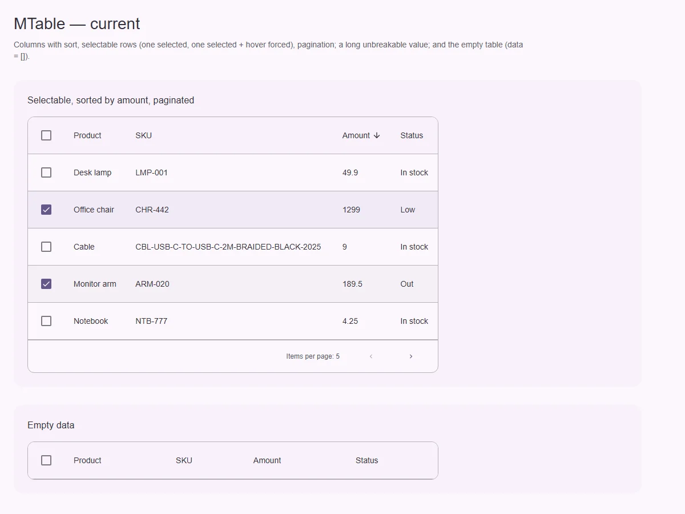
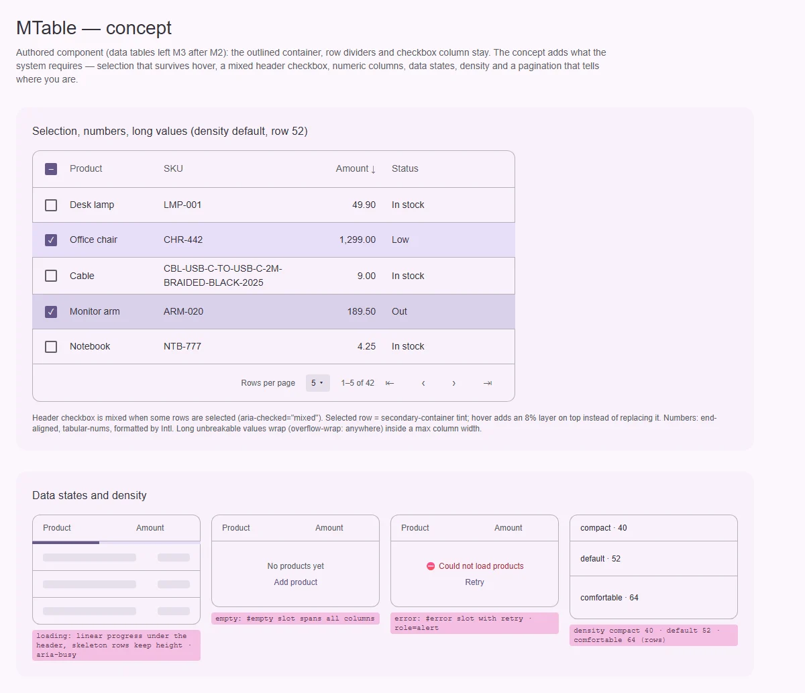

# MTable — таблица данных с сортировкой, выбором и страницами

<identity>M3: компонента нет (data tables были в Material 2); авторский компонент кита на системе M3 · Токены Compose: нет · Код: `src/runtime/components/ui/table/`, части `src/runtime/components/fragments/table/{header,pagination}/`, `src/runtime/composables/table/` · Аудит: `data/table.json` (42 FAIL) · Тип: public</identity>

<implementation-status state="planned" updated="2026-10-07">Есть колонки с сортировкой (`v-model:sort`), выбор строк через `MCheckbox`, простая пагинация «назад/вперёд». Нет состояний данных (загрузка, пусто, ошибка), смешанного выбора, плотности, числовых колонок, доступного имени и прокрутки с клавиатуры.</implementation-status>

## Вердикт

`авторский`. Вид остаётся:
- обведённый контейнер;
- разделители строк;
- колонка чекбоксов;
- сортировка в заголовке.

Проблемы — системные, и их много (42 FAIL), главные пять:
- **данных как оси нет**: пустая таблица показывает одну шапку, загрузку и ошибку показать нельзя;
- **выбор неразличим** под курсором: hover заменяет тон выбранной строки;
- частичный выбор не отмечен в шапке;
- **числа** прижаты влево и не табличные;
- длинное значение раздувает колонку;
- английские строки, нет имени у таблицы и чекбоксов.

## Рендеры

| Сейчас | Концепт |
|---|---|
|  |  |

Сейчас:
- выбраны 2 строки из 5, четвёртая ещё и под курсором — выглядит как обычный hover;
- шапка без частичного выбора;
- суммы слева, длинный SKU;
- «Items per page: 5» без переключателя;
- пустая таблица.

Концепт:
1. Выбор с наложением hover, смешанный чекбокс, числовая колонка, перенос длинного значения,
   пагинация «1–5 из 42» с выбором размера страницы.
2. Состояния загрузки, пусто и ошибки, три ступени плотности.

## Анатомия

| # | Часть | В ките | Статус |
|---|---|---|---|
| 1 | Контейнер с горизонтальной прокруткой | `.ui-table-container` (`overflow-x: auto`, инсеты скроллбара) | есть; не фокусируется (A11-07), нет намёка на продолжение вправо (CT-11) |
| 2 | Подпись таблицы | — | нет `caption` / имени (A11-02) |
| 3 | Шапка: чекбокс «выбрать все», заголовки с сортировкой | `UiTableHeader` | есть; нет mixed (A11-06), цель сортировки — только текст (RS-06) |
| 4 | Строка: чекбокс, ячейки | `tr` / `td`, слоты `cell-*` | есть |
| 5 | Состояния: загрузка, пусто, ошибка | — | нет (ST-01, DT-01…05) |
| 6 | Подвал: размер страницы, диапазон, навигация | `UiTablePagination`: «Items per page: N», `‹ ›` | беднее (DT-08) |

## Оси дизайна

| Ось | Значения | Цель | Ломает API |
|---|---|---|---|
| `density` | — | `compact` 40 · `default` 52 · `comfortable` 64 (высота строки), шапка +4 (LY-08) | нет |
| Выбор | `selectable` | `none \| single \| multiple` — вопрос 1 | возможно |
| Выравнивание колонки | — | `column.align: 'start' \| 'end' \| 'center'`, `column.numeric` → end + tabular | нет |
| Ширина колонки | `width` | + `minWidth`, `maxWidth` (перенос внутри) | нет |
| Липкая шапка | — | `stickyHeader` | нет |

## Оси состояний

| Ось | Нужно | Есть | Не хватает |
|---|---|---|---|
| Данные | загрузка · обновление · пусто · ошибка · частичная ошибка | только данные | `loading`, `error`, слоты `#loading`, `#empty`, `#error` (ST-01, DT-01…05, EN-03) |
| Выбор | выбран · частично (шапка) · выбран + hover | выбран (hover его заменяет) | слой hover поверх тона (ST-02, ST-03), mixed (A11-06) |
| Сортировка | rest · hover · pressed · focus | rest · hover | pressed (IN-07), focus-ring (IN-04), цель на весь `th` (RS-06) |
| Объявления | смена страницы, сортировки, пустой результат | — | `aria-busy`, постоянный `role="status"` (DT-09) |
| Forced colors | выбор видим | рамка `Highlight` у выбранной строки | — (частично закрыто) |

## Токены: расхождения

| Часть | Система | Кит сейчас (`table/_index.scss`) | Действие |
|---|---|---|---|
| Hover строки | `state-opacity(hover)` 8% слоем | 4% литералом, подмена фона (ST-05, TK-04) | слой `::before` |
| Выбранная строка | тон выбора как у списков — `secondary-container` (см. [list](../containment/list.md) Q1) | свой литерал | `secondary-container` |
| Отступы, толщины | `spacing()`, hairline | литералы (LY-04, TK-02) | `spacing()` |
| Плотность | три ступени | одна | ветка `density.*` |

## Поведение и доступность

- **Имя.** `caption` (видимый или скрытый) через проп `caption` или слот. `aria-label` с
  `MTable` уходит на `<table>`, а не на обёртку (EN-04).
- **Чекбоксы.** Шапка — «выбрать все» с `aria-checked="mixed"` при частичном выборе (зависит от
  indeterminate в [checkbox](../form/checkbox.md)). Строки — имя из первой ячейки (A11-04),
  `aria-selected` у строки.
- **Сортировка.** Кнопка на весь `th`, `aria-sort` у `th`. Иконка зарезервирована у всех
  sortable-колонок, чтобы ширина не прыгала (MO-04).
- **Прокрутка.** Контейнер — `tabindex="0"`, `role="region"` с именем, когда таблица шире
  контейнера (A11-07). Тень у края — CSS scroll-driven или маска без JS (CT-11).
- **Числа.** `Intl.NumberFormat` по колонке (`column.format`), `tabular-nums` (CT-07).
- **Большие данные.** `useVirtualScroll` уже есть в ките. Опция `virtual` для 1000+ строк
  (CT-08) — предложение по UX ниже.
- **Пагинация.** Решение при создании `MPagination`: приватный компактный подвал таблицы остаётся
  отдельным от публичной [нумерованной пагинации](../navigation/pagination.md). Подвал получает
  диапазон «1–5 из 42», выбор размера страницы, первую и последнюю страницу. Строки — без
  английских дефолтов (CT-13, Q13).

## API

| Что | Изменение | Ломает |
|---|---|---|
| `loading`, `error` | новые | нет |
| слоты `#loading`, `#empty`, `#error`, `#caption` | новые | нет |
| `density` | новый | нет |
| `column.align`, `numeric`, `format`, `minWidth`, `maxWidth` | новые | нет |
| `caption` | новый | нет |
| `stickyHeader` | новый | нет |
| `pageSizeOptions` | новый | нет |
| подвал | диапазон, `pageSizeOptions`, первая и последняя страница | вид подвала |
| `selectable` | по вопросу 1 | возможно |

## План работ

1. **S — слой hover поверх выбора, токены** (ST-02, ST-03, ST-05, TK-02, TK-04, LY-04).
2. **M — состояния данных и слоты** (ST-01, DT-01…05, DT-09, DT-11, EN-03).
3. **S — mixed в шапке, `aria-selected`, имена чекбоксов** (A11-02, A11-04, A11-06). Зависит
   от indeterminate в checkbox.
4. **S — числовые колонки и перенос** (CT-04, CT-07, LY-10).
5. **S — сортировка:** цель, pressed, focus, резерв иконки (RS-06, IN-04, IN-05, IN-07, MO-04).
6. **S — `density`** (LY-08).
7. **S — фокусируемая прокрутка, намёк на продолжение** (A11-07, CT-11).
8. **M — подвал:** диапазон, размер страницы, первая и последняя страница, `loading` блокирует навигацию (DT-08, IN-11, CT-13).
9. **S — `caption` и атрибуты на `<table>`** (EN-04).
10. **M — тесты** (TS-07) **и документация** (DC-01…05).

## Тесты

- Unit:
  - `toggleRow`/`toggleAll` и `update:selectedRows`;
  - mixed в шапке;
  - цикл сортировки asc → desc → null и `aria-sort`;
  - пустые данные → `#empty`;
  - `loading` → `aria-busy`;
  - `error` → слот;
  - атрибуты на `<table>`.
- e2e:
  - selected + hover различимы (скриншот не нужен: проверка вычисленного фона у строки);
  - широкая таблица прокручивается с клавиатуры;
  - axe;
  - RTL;
  - 360 без переполнения страницы.

## Готово, когда

- Таблица показывает все состояния данных.
- Выбор различим в любом состоянии и объявляется.
- Числа выровнены.
- Таблицу можно пройти с клавиатуры.

## Предложения по UX

Расширения сверх паритета. Это предложения владельцу, а не шаги плана. Без новых зависимостей.

| Предложение | Что получает пользователь | Заказчик | Цена | Рекомендация |
|---|---|---|---|---|
| Виртуализация строк (`virtual`) на `useVirtualScroll` | Таблица на тысячи строк не тормозит | админки, логи | M · composable уже есть | да, при первом заказчике |
| Выбор диапазона Shift+кликом (предложено в [checkbox](../form/checkbox.md)) | Быстрый массовый выбор | любые списки с массовыми действиями | M | да, вместе с контекстным режимом app bar |
| Настройка колонок: скрыть или показать, порядок через меню | Пользователь убирает лишнее | широкие таблицы | M · `MMenu` + чекбоксы | обсудить |
| Раскрываемая строка (`#expanded-row`) | Детали без перехода на другую страницу | заказы, логи | M | обсудить |
| Закреплённая первая колонка (`sticky` по колонке) | Имя строки видно при горизонтальной прокрутке | широкие таблицы | S · CSS `position: sticky` | да |

## Открытые вопросы

**1. Нужен ли одиночный выбор строк?**
1. Ось `selection: 'none' \| 'single' \| 'multiple'`; `selectable` — алиас `multiple`. Покрывает
   «выбрать запись для детального просмотра», но это новая ось.
2. Оставить только множественный выбор, а одиночный решать кликом по строке и событием
   `row-click`.

Рекомендация: 2, пока нет заказчика одиночного выбора (принцип В4). Событие `row-click` с
доступной альтернативой с клавиатуры — шаг 2.
