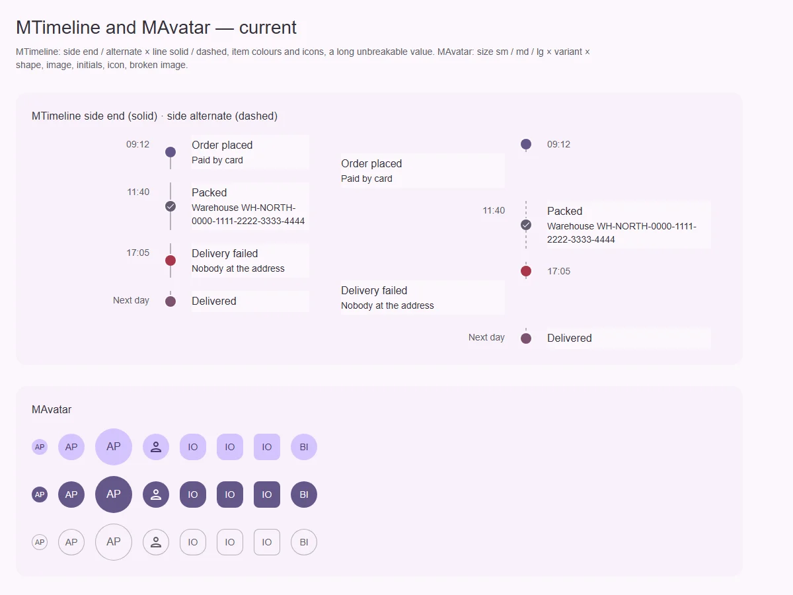
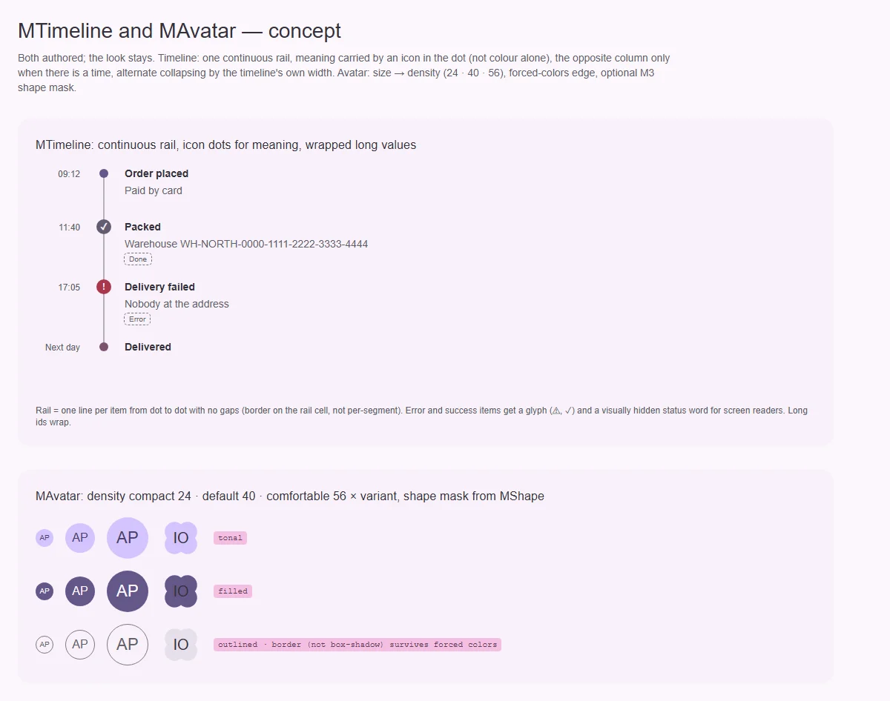

# MTimeline — вертикальная последовательность событий

<identity>M3: компонента нет; авторский компонент кита на системе M3 · Токены Compose: нет · Код: `src/runtime/components/ui/timeline/` (+ `item/` — [item.md](item.md)), приватный разделитель `src/runtime/components/fragments/timeline/divider/` ([divider.md](divider.md)), контекст `src/runtime/composables/timeline/context.ts` · Аудит: `data/timeline.json` · Тип: public</identity>

<implementation-status state="planned" updated="2026-10-07">Реализован 2026-07-18: вертикальный упорядоченный список, `side: start | end | alternate` с переопределением у элемента, `density` (compact / default / comfortable), `line: solid | dashed | none`, реестр порядка для first/last. На рендере линия прерывается между элементами; смысл цвета маркера не передаётся без цвета.</implementation-status>

## Вердикт

`авторский`. Решения прежнего плана остаются:
- вертикальная, сначала явная композиция;
- `MTimelineItem` публичный, разделитель приватный;
- DOM всегда хронологический;
- `alternate` без CSS `order`;
- горизонтальный режим и данные списком отложены.

Это единственный компонент кита, где `density` уже сделана тремя ступенями, как решил владелец.

Системные правки:
- **рейка рвётся** между элементами (видно на текущем рендере);
- смысл маркера (ошибка, успех) — только цвет, и от AT он скрыт (ST-01, TH-05);
- колонка opposite занимает половину ширины даже без времени (LY-07);
- `alternate` схлопывается по ширине окна, а не самой ленты (RS-03), и в схлопнутом виде
  уезжает (RS-01);
- точка и линия нарисованы фоном и пропадают в forced colors (TH-04);
- длинное значение вылезает (CT-04).

## Рендеры

| Сейчас | Концепт |
|---|---|
|  |  |

Рендеры общие с [MAvatar](../avatar.md).

Сейчас: `end` + solid и `alternate` + dashed. Видны разрывы рейки и красная точка без иного
признака.

Концепт:
- непрерывная рейка;
- значок в точке и скрытое слово статуса;
- перенос длинного id.

## Анатомия

| # | Часть | В ките | Статус |
|---|---|---|---|
| 1 | Список | `ol`, порядок из реестра | есть |
| 2 | Колонка opposite (время) | всегда занимает `1fr` | иначе (LY-07) |
| 3 | Рейка: линия и точка | приватный разделитель, сегменты по элементу | есть; разрывы, фон вместо обводки |
| 4 | Содержимое | `MSurface` с `variant` (дефолт plain) | есть |

## Оси дизайна

| Ось | Значения | Комментарий |
|---|---|---|
| `side` | `start \| end \| alternate` | решено |
| `density` | `compact \| default \| comfortable` | уже по решению владельца |
| `line` | `solid \| dashed \| none` | решено |
| `color` у элемента | `MColor` | роль, не оттенок |

## Оси состояний

| Ось | Нужно | Есть | Не хватает |
|---|---|---|---|
| Смысловое | не только цветом | цвет точки | значок в точке и скрытое слово статуса (`status` у элемента) — [item.md](item.md) |
| Раскладка | без пустой колонки | opposite всегда | колонка только при `time` или слоте (LY-07) |
| Адаптивность | схлопывание по своей ширине | по окну | `container-type: inline-size` на корне (RS-03, RS-01) |
| Forced colors | рейка и точка видны | пропадают (TH-04) | рамка вместо фона, `CanvasText` |

## Токены: расхождения

| Часть | Система | Кит сейчас (`timeline/_index.scss`) | Действие |
|---|---|---|---|
| Размеры рейки, точки, линии | токены + `spacing()` | литералы 40 / 16 / 14 / 2 (TK-02, LY-04) | карта и `spacing()` |
| Пунктир | токен | магические числа в `divider/index.vue:92` (TK-07) | `line.dash.*` |

## Поведение и доступность

- `ol` с элементами `li`. Порядок объявления — хронологический.
- Статус элемента объявляется текстом, а не цветом.
- **EN-10, CT-08.** Каждый элемент ищет себя в отсортированном массиве: O(n²) на изменение.
  Индекс считать один раз в контексте и раздавать по тикету.

## API

| Что | Изменение | Ломает |
|---|---|---|
| `status` у элемента | новый (`'success' \| 'error' \| …` + текст) — [item.md](item.md) | нет |
| `alternate` | схлопывается по ширине ленты | поведение |

## План работ

1. **S — непрерывная рейка** (разрыв на рендере): линия на ячейке рейки, а не отдельными
   сегментами.
2. **S — значок и статус** (ST-01, TH-05).
3. **S — колонка opposite по условию** (LY-07).
4. **S — контейнерное схлопывание alternate** (RS-01, RS-03).
5. **S — forced colors** (TH-04), **перенос** (CT-04).
6. **S — токены** (TK-02, TK-07, LY-04).
7. **S — индекс в контексте** (EN-10, CT-08).
8. **S — документация** (DC-01…05).

## Тесты

- Unit: порядок при вставке в середину; first/last; `status` даёт скрытый текст; без `time`
  колонки нет.
- e2e:
  - рейка без разрывов (высота линии = расстояние между точками);
  - alternate в колонке 360 схлопывается;
  - forced colors;
  - axe.

## Готово, когда

- Рейка непрерывна.
- Смысл маркера читается без цвета.
- Раскладка не тратит половину ширины.
- Работает в узкой колонке.

## Предложения по UX

Расширения сверх паритета. Это предложения владельцу, а не шаги плана. Без новых зависимостей.

| Предложение | Что получает пользователь | Заказчик | Цена | Рекомендация |
|---|---|---|---|---|
| Сворачивание длинной истории: «Показать ещё N» после первых K элементов | История заказа не растягивает страницу | заказы, аудит-лог | S · слот `#more` | да |
| Отметка «сейчас» на рейке (текущий шаг процесса) | Видно, на каком этапе процесс | доставка, онбординг | S · `current` у элемента + `aria-current="step"` | да |
| Относительное время («2 ч назад») через `Intl.RelativeTimeFormat` в рецепте | Привычнее читать недавние события | ленты активности | S · документация | да |

## Открытые вопросы

Нет: горизонтальный режим и список данных отложены прежним решением до заказчика.
