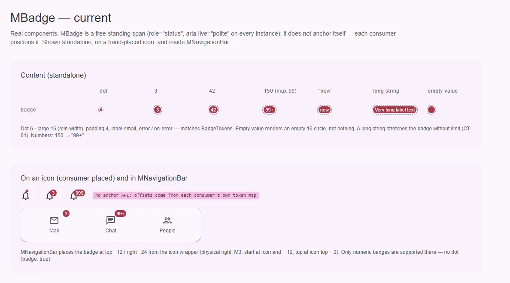
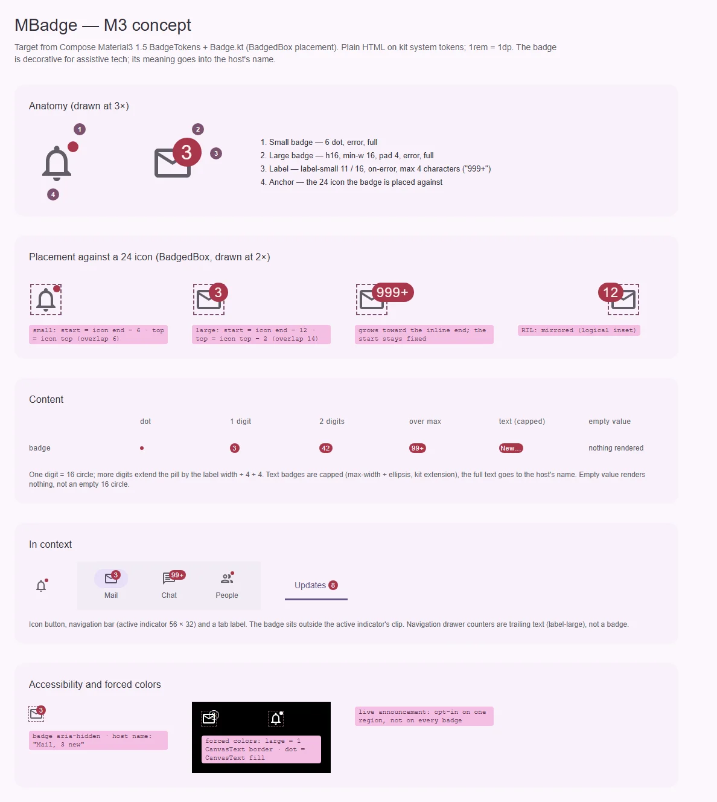

# MBadge — бейдж: счётчик или точка статуса на иконке

<identity>M3: Badges (small · large) · Токены Compose: `BadgeTokens`; поведение и раскладка — `Badge.kt` (`Badge`, `BadgedBox`, `BadgeWithContentHorizontalOffset` 12, `BadgeWithContentVerticalOffset` 14, `BadgeOffset` 6, `BadgeWithContentHorizontalPadding` 4) · Код: `src/runtime/components/ui/badge/`, карта `src/runtime/assets/stylesheet/components/badge/_index.scss` · Аудит: `data/badge.json` · Тип: public (неинтерактивный индикатор)</identity>

<implementation-status state="planned" updated="2026-10-07">Исследование и рендеры готовы, код не менялся. Размеры, роли и типографика совпадают с `BadgeTokens`; forced colors точки сделан фазой C. Не сделаны: размещение относительно якоря (каждый потребитель ставит бейдж своими числами), доступность (live-регион на каждом бейдже), пустое значение, ограничение текста. Ждут БВ-1…БВ-4.</implementation-status>

## Вердикт

**дрейф.** Сам бейдж совпадает с M3 до токена: точка 6, большой 16 с отступом 4, `label-small`,
`error` / `on-error`, `corner-full`. Расходится всё вокруг: в M3 бейдж ставит `BadgedBox` по формуле
от угла иконки, а в ките размещения нет — навигационный бар и рейл держат свои смещения
(`top −12`, физический `right −24`), и бейдж уезжает от угла. Каждый экземпляр — `role="status"` +
`aria-live`, поэтому навигация с тремя счётчиками объявляет голые числа. Пустое значение рисует
пустой красный круг 16. Публичных пропов ломать не нужно; меняется семантика по умолчанию (БВ-1).

## Рендеры

| Сейчас | Концепт M3 |
|---|---|
|  |  |

Кадры концепта:

1. Анатомия в 3×: малый бейдж, большой бейдж, подпись, якорь-иконка.
2. Размещение относительно иконки 24 (2×): малый, большой, рост «999+» к inline-end, RTL.
3. Содержимое: точка, одна цифра, две, «99+», текст с ограничением, пустое значение — ничего.
4. В контексте: icon button, navigation bar (индикатор 56 × 32), вкладка.
5. Доступность и forced colors: бейдж `aria-hidden`, смысл в имени хоста; рамка `CanvasText`.

## Анатомия

| № | Часть M3 | Элемент кита | Статус |
|---|---|---|---|
| 1 | Small badge 6 | `.ui-badge--small` (`dot`) | есть |
| 2 | Large badge h16, min-w 16, pad 4 | `.ui-badge--large` | есть; пустой рендерится кругом 16 |
| 3 | Label `label-small` | `.ui-badge__label` + слот по умолчанию | есть |
| 4 | Размещение (`BadgedBox`): small — start = конец якоря − 6, top = верх якоря; large — start = конец якоря − 12, top = верх − 2 | нет: каждый потребитель свои смещения (`navigation-bar/_index.scss:41-44`, `navigation-rail/item`) | нет — БВ-2 |

## Оси дизайна

| Ось | M3 | Кит сейчас | Цель | Ломает API |
|---|---|---|---|---|
| Вид | small (без текста) · large (с текстом) | `dot` + `value` | без изменений (`dot` честен: точка физически не несёт текста) | нет |
| Переполнение | «999+» (до 4 символов) | `max` (99) для чисел; строки без предела | строки ограничиваются — БВ-3 | нет |
| Цвет | только `error` (`BadgeDefaults.containerColor`) | нет | не вводится: заказчика нет (`principles.md`, В4), M3 его тоже не задаёт | нет |
| Размещение | `BadgedBox` | нет | по БВ-2 | нет |

## Оси состояний

Из `axes` аудита, сверено с кодом.

| Ось | Нужно | Есть | Не хватает |
|---|---|---|---|
| Базовое | показан / скрыт | показан; пустое значение — пустой круг 16 | БВ-4 |
| Данные | значение, переполнение | число, `max+`, строка | ограничение строки (CT-01, CT-04) |
| Смысловое | только error | error | не расширяется (см. «Цвет») |
| Взаимодействие, фокус, выбор | неприменимо | — | — |

## Токены: расхождения

| Часть | M3 (Compose) | Кит сейчас (`_index.scss` / `index.vue`) | Действие |
|---|---|---|---|
| Смещения | `BadgeOffset` 6, `BadgeWithContentHorizontalOffset` 12, `BadgeWithContentVerticalOffset` 14 | нет в карте бейджа; у навигации `badge.top −12`, `badge.right −24` | `anchor.small.{inline,block}`, `anchor.large.{inline,block}` в карте бейджа; потребители берут их, а не свои числа |
| Пути `g()` | точечные | дефисные (`'border-radius'`, `'large-padding-inline'`, `'dot-size'`) | перевести файл целиком на точку |
| Мёртвый токен | — | `large.text: 0` (`_index.scss:17`) | удалить (LY-04) |
| `z-index: 1` | — | на непозиционированном корне (`index.vue:71`) — не действует | удалить; слой задаёт позиционирующий потребитель (LY-06, TK-04) |
| Forced colors: large | контур виден | фона нет, форма теряется (TH-04) | `border: 1 solid CanvasText` у большого |
| Строка | M3: до 4 символов | без предела (CT-01) | `max-inline-size` + `text-overflow: ellipsis` по БВ-3 |

Совпадает: 6 / 16, отступ 4, `corner-full`, `error` / `on-error`, `label-small`, точка в forced colors
(`index.vue:88-93`).

## Поведение и доступность

- **Бейдж декоративен по умолчанию (БВ-1; DT-09, A11-02, A11-05, TH-05).** Убрать безусловные
  `role="status"` и `aria-live="polite"`: три счётчика в навигации — три live-региона без
  контекста, а точка — пустой регион. Смысл переезжает в имя хоста — так уже решили планы
  [navigation-bar.md](../navigation/navigation-bar.md),
  [navigation-rail.md](../navigation/navigation-rail.md) и [tabs.md](../navigation/tabs.md)
  (`aria-hidden` у бейджа + `badgeLabel` у пункта).
- **Объявление изменений** — работа приложения: один live-регион на экран, а не по региону на бейдж.
- **Размещение (БВ-2).** Логические свойства (`inset-inline-start`), бейдж растёт к inline-end, старт
  фиксирован; в RTL зеркалится. Хост клипует только свой индикатор, не бейдж.
- **Пустое значение (БВ-4).** Не рисует пустой круг.
- **Движение (MO-01).** M3 появление бейджа не описывает; по решению владельца Expressive-анимаций
  нет. Без перехода — пункт закрыт без работы.

Открытые пункты аудита → шаги: DT-09, A11-02, A11-05, TH-05 → шаг 2; LY-04, LY-06, TK-04 → шаг 1;
TH-04 → шаг 1; CT-01, CT-04 → шаг 3 (БВ-3); LY-07 → шаг 4. TK-02 (размеры «сырые») — это и есть
токены M3, закрывается переводом на точечные пути. MO-01 — закрыт отказом (см. выше). RS-04, RS-05
— принятое отклонение. DC-01…DC-05 — документация в `docs` (несуществующий `variant`, неверные
токены). TS-* → «Тесты».

## API

Добавить (без ломки):

| Что | Тип | Дефолт | Зачем |
|---|---|---|---|
| Sass-миксин размещения или компонент-обёртка | по БВ-2 | — | одна формула `BadgedBox` на всех потребителей |

Меняется поведение (не проп): корень бейджа теряет `role="status"` и `aria-live` (БВ-1). Миграция:
кто полагался на объявление, ставит один свой live-регион; в ките таких нет — навигация и вкладки
и так переходят на `aria-hidden` + `badgeLabel`.

Не вводится: `color` (В4), `live`-проп — по БВ-1.

## План работ

1. **S** — Карта: точечные пути, удалить `large.text` и `z-index`, токены `anchor.*`, рамка
   `CanvasText` у большого бейджа в forced colors. Карта бейджа названа эталоном в `CLAUDE.md`
   проекта, а сама держит легаси-дефисы — эталон должен показывать каноническую форму. Файлы:
   `assets/stylesheet/components/badge/_index.scss`, `badge/index.vue`.
2. **S** — Семантика по БВ-1: без `role` / `aria-live`; точка `aria-hidden`. Файлы: `badge/index.vue`,
   `badge/index.spec.ts` (тест «renders a status role…» переписывается — он закреплял дефект).
3. **S** — Ограничение строки по БВ-3 и пустое значение по БВ-4. Файлы: `badge/*`.
4. **M** — Размещение по БВ-2 и перевод потребителей: `navigation-bar`, `navigation-rail/item`,
   затем вкладки и drawer по их планам. Видимое изменение: бейдж встаёт к углу иконки. Зависит от
   [navigation-bar.md](../navigation/navigation-bar.md) (поле `badge: number | true`,
   `badgeLabel`). Файлы: `badge/*`, `abstracts/_mixins.scss` или новый компонент, карты навигации.
5. **S** — Тесты.

## Тесты

- Фикстура `playground/fixtures/badge/matrix.vue`: содержимое (точка, 1–4 символа, `max+`, строка,
  пусто) × хост (иконка 24, icon button, пункт навигации, вкладка) × ltr / rtl.
- e2e `badge.e2e.ts`: axe; геометрия — левый верхний угол большого бейджа = конец иконки − 12 /
  верх − 2, малого — конец − 6 / верх (в RTL зеркально); forced colors — контур большого и точка
  видны.
- unit (`index.spec.ts`): нет `role` и `aria-live`; пустое значение по БВ-4; ограничение строки;
  слот по умолчанию по-прежнему побеждает `value`.

## Готово, когда

- [ ] Бейдж стоит у угла иконки по формуле `BadgedBox` во всех хостах кита; в RTL зеркально.
- [ ] Ни один бейдж не является live-регионом; смысл читается из имени хоста.
- [ ] Пустое значение не рисует пустой круг; длинная строка не ломает хост.
- [ ] Большой бейдж и точка видны в forced colors.
- [ ] Карта на точечных путях, без мёртвых токенов и `z-index`.
- [ ] `npm run lint`, `lint:style`, `lint:scss`, `typecheck`, vitest, e2e — зелёные.

## Предложения по UX

1. **Сокращённые большие числа.** `format: 'compact'` или функция-форматтер: `1200` → «1,2 тыс.»
   через `Intl.NumberFormat(locale, { notation: 'compact' })` вместо «99+». Пользователь видит
   порядок, а не «больше 99». Заказчик: соцсети, уведомления. Цена: S, без зависимостей (Intl),
   локаль из i18n потребителя; не всегда влезает в 4 символа. Рекомендация: при первом заказчике.
2. **Бейдж «новое» без числа на пункте списка и меню.** Точка в конце строки `MListItem` / пункта
   меню (не только на иконке) — «появилось новое в разделе». Заказчик: настройки, меню профиля.
   Цена: S, слот или поле пункта у списка и меню; размещение — строкой, не по `BadgedBox`.
   Рекомендация: в планы списка и меню, когда появится заказчик.
3. **Подсказка с полным текстом.** Если строка обрезана по БВ-3, хост показывает полный текст в
   `MTooltip` по наведению и фокусу. Заказчик: вкладки с текстовыми бейджами. Цена: S, переиспользует
   `MTooltip`. Рекомендация: только вместе с вариантом 1 в БВ-3.

## Открытые вопросы

**БВ-1. Какая семантика у бейджа по умолчанию.**

1. Без роли и без live: бейдж — обычный текст в потоке (точка — `aria-hidden`). Хосты, которые
   переносят смысл в своё имя (навигация, вкладки), сами ставят бейджу `aria-hidden`. Объявления —
   один live-регион приложения. Цена: отдельно стоящий бейдж читается голым числом.
2. Всегда `aria-hidden`, смысл обязан нести хост. Чисто, но отдельно стоящий бейдж («Входящие 3»
   текстом рядом) молча пропадёт для скринридера.
3. Проп `live` (по умолчанию `false`) для редкого бейджа, который должен объявлять изменения. Гибко,
   но кит раздаёт инструмент, которым легко устроить шквал объявлений.

Рекомендация: 1.

**БВ-2. Кто ставит бейдж к углу иконки.**

1. Sass-миксин `badge-anchor(small | large)` + токены `anchor.*` в карте бейджа. Потребители кита
   (навигация, вкладки) остаются хозяевами своей разметки и просто подключают формулу. Цена: внешний
   потребитель пишет обёртку сам.
2. Компонент `MBadgedBox` со слотами «якорь» и «бейдж», как `BadgedBox` в Compose. Цена: новый
   публичный компонент и обёртка вокруг каждой иконки.
3. Проп у `MBadge` с якорем внутри слота по умолчанию. Ломает слот: сегодня он подменяет текст
   бейджа.

Рекомендация: 1 сейчас; 2 — когда появится внешний заказчик (В4).

**БВ-3. Как ограничивается текст.**

1. `max-inline-size` на 4 символа + многоточие; полный текст — в имени хоста. Цена: обрезанное
   слово на экране.
2. Строки длиннее 4 символов не поддерживаются: dev-предупреждение, показывается как есть. Цена:
   раскладка хоста может поехать.
3. Проп `maxLength` для строк по образцу `max` для чисел (`'new'` → `'ne…'`). Цена: ещё один проп.

Рекомендация: 1.

**БВ-4. Что рисует пустое значение.**

Сегодня `value` `undefined` / `''` без `dot` рисует пустой красный круг 16 (`index.vue:9`,
`:49-52`). `0` рисуется как «0».

1. Ничего (компонент не рендерит узел). `0` остаётся «0» — скрывать ли ноль, решает хост, как уже
   делает навигация (`item.badge > 0`).
2. Точку: пустое значение = «есть что-то новое». Цена: неявное правило.
3. Оставить круг 16. Цена: это не вид M3 и не несёт смысла.

Рекомендация: 1.
