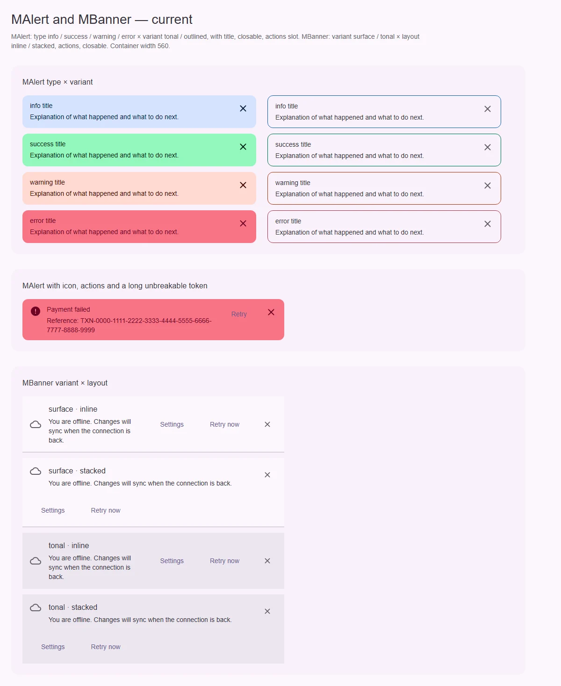
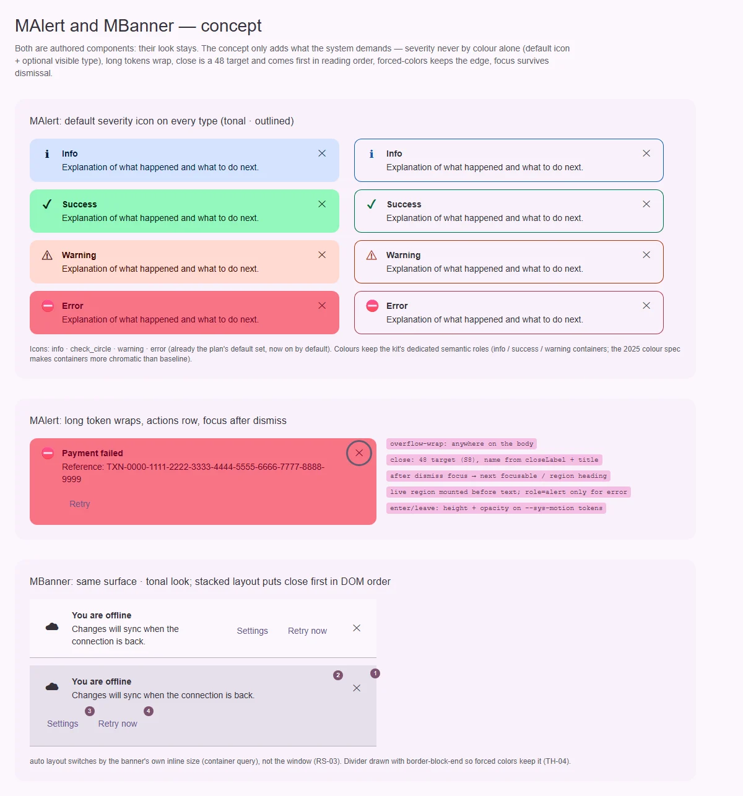

# MBanner — сообщение уровня страницы или секции с решением

<identity>M3: компонента нет (banner был в Material 2); авторский компонент кита на системе M3 · Токены Compose: нет · Код: `src/runtime/components/ui/banner/`, дочерняя часть `src/runtime/components/fragments/banner/actions/` ([actions.md](actions.md)) · Аудит: `data/banner.json` · Тип: public</identity>

<implementation-status state="planned" updated="2026-10-07">Реализован 2026-07-16: `variant` surface/tonal, `layout` auto/inline/stacked (auto по `@media` окна), действия, закрытие, `announce` polite/off. Открыты: порядок фокуса в stacked, `auto` от окна, живой регион, forced colors, переполнение, имя варианта `surface`.</implementation-status>

## Вердикт

`авторский`. Нейтральная широкая поверхность для ситуаций уровня страницы с решением
пользователя («Нет сети», «Обновились условия»). Отличается от alert (тяжесть) и snackbar
(временный). Вид, раскладки и отказы прежнего плана остаются:
- без тяжести и произвольных цветов;
- без таймера и очереди;
- без sticky;
- действия не сворачиваются в меню.

Системные правки:
- закрытие визуально вверху, а в Tab-порядке после действий (A11-09);
- `auto` переключается по ширине окна, а не баннера (RS-03);
- разделитель нарисован `box-shadow` и пропадает в forced colors;
- переполнение, живой регион;
- член `surface` в `MBannerVariant` — ошибка наименования, решённая в `decisions.md`.

## Рендеры

| Сейчас | Концепт |
|---|---|
|  |  |

Рендеры общие с [MAlert](../alert.md).

Сейчас: нижний кадр — surface/tonal × inline/stacked.

Концепт: нижний кадр — тот же вид, в stacked закрытие стоит первым в порядке чтения (номера
1–4), разделитель — `border-block-end`.

## Анатомия

| # | Часть | В ките | Статус |
|---|---|---|---|
| 1 | Контейнер (`MSurface`, разделитель снизу) | `section` на `MSurface`, разделитель `box-shadow` | есть; разделитель пропадает в forced colors (TH-04) |
| 2 | Иконка | `icon` / слот, декоративная | есть |
| 3 | Заголовок и текст | `aria-labelledby` / `aria-describedby` | есть; нет переноса (CT-04) |
| 4 | Действия | `BannerActions` ([actions.md](actions.md)) | есть |
| 5 | Закрытие | `MButtonIcon` 40 | есть; в DOM после действий (A11-09) |

## Оси дизайна

| Ось | Значения | Цель | Ломает API |
|---|---|---|---|
| `variant` | `surface \| tonal` | По `decisions.md`: `surface` переименовать в канонический член `MVariant` и сузить через `Extract<>` (вопрос 1) | да, с алиасом |
| `layout` | `auto \| inline \| stacked` | `auto` — по контейнерному запросу ширины самого баннера | поведение `auto` |
| `announce` | `polite \| off` | без изменений | — |
| `density` | — | не вводить | — |

## Оси состояний

| Ось | Нужно | Есть | Не хватает |
|---|---|---|---|
| Фокус | порядок Tab совпадает с визуальным | в stacked закрытие вверху, а в DOM в конце (A11-09) | закрытие первым в DOM, сетка раскладывает области |
| Фокус после закрытия | не на `body` | уходит на `body` | общий вопрос с [alert](../alert.md), вопрос 1 |
| Живой регион | регион до текста | `aria-live` на `section`, монтируется с текстом (DT-09) | общий механизм с alert, вопрос 2 |
| Появление и закрытие | без скачка | мгновенно (MO-01) | переход на токенах |
| Forced colors | граница видна | нет (TH-04) | `border-block-end` |

## Токены: расхождения

| Часть | Система | Кит сейчас (`banner/_index.scss`) | Действие |
|---|---|---|---|
| Прозрачности закрытия | `state-opacity()` | модульные Sass-переменные (ST-05, TK-04) | `state-opacity()` |
| Отступы, размеры | `spacing()` | литералы (LY-04, TK-02) | `spacing()` |
| Разделитель | hairline `outline-variant` | `box-shadow` 1rem | `border-block-end`, hairline по общему вопросу |
| Цель закрытия | 48 | 40 (RS-06 принято; RS-12) | расширитель до 48 |

## Поведение и доступность

- Корень — `section` с именем от заголовка, не `role="alert"`. Решение прежнего плана остаётся.
- **A11-02.** В пропсах слота `close` ключ `ariaLabel` превращается в `arialabel` в SSR →
  `'aria-label'` (как у alert).
- **A11-04.** Имя закрытия по шаблону с заголовком.
- **RS-03.** `container-type: inline-size` на корне. `auto` раскладывает по
  `@container (inline-size < 600rem)` — ширина баннера, а не окна. Это разрешено решением о
  container queries: по ширине можно.

## API

| Что | Изменение | Ломает |
|---|---|---|
| `variant: 'surface'` | → канонический член по вопросу 1, алиас на один minor | да |
| props слота `close` | `'aria-label'` | исправление |
| `closeLabel` | без английского дефолта, по Q13 | возможно |
| `layout: 'auto'` | по ширине баннера | поведение |

## План работ

1. **S — порядок закрытия в DOM и сетка областей** (A11-09).
2. **S — `auto` по контейнеру** (RS-03).
3. **S — разделитель, forced colors, перенос** (TH-04, CT-04).
4. **S — слот `close`, имя** (A11-02, A11-04).
5. **S — токены и цель 48** (ST-05, TK-02, TK-04, LY-04).
6. **S — переход** (MO-01).
7. **S — переименование варианта** (после вопроса 1).
8. **M — регион и фокус** — общие с alert, после их вопросов.
9. **M — документация** (DC-01…05).

## Тесты

- Unit: порядок в DOM — закрытие перед действиями; алиас варианта с предупреждением;
  `aria-label` в SSR.
- e2e:
  - баннер в узкой колонке на десктопе — stacked (контейнерный запрос);
  - Tab: закрытие → действия;
  - forced colors: разделитель виден;
  - axe.

## Готово, когда

- Порядок фокуса совпадает с визуальным.
- `auto` зависит от ширины баннера.
- Граница видна в forced colors.
- Вариант назван каноническим словом.

## Предложения по UX

Расширения сверх паритета с M3. Это предложения владельцу, а не шаги плана. Без Expressive-анимаций и без новых зависимостей.

| Предложение | Что получает пользователь | Заказчик | Цена | Рекомендация |
|---|---|---|---|---|
| Запоминание закрытия (`dismissKey` → cookie, SSR не рисует закрытый баннер) | Закрытое объявление не возвращается и не мигает при загрузке | новости продукта, cookie-уведомления | S · cookie уже читает тема | да |
| Встроенный вид «нет сети» через `useOnline` (рецепт, не проп) | Типовой сценарий собирается в три строки | любое приложение | S · только документация | да |

## Открытые вопросы

**1. Во что переименовать `variant: 'surface'`?** `decisions.md` решил переименовать член
`surface`, но не назвал целевое значение.
1. `plain`: поверхность страницы без акцента; совпадает с `MSurface plain`. Нужен `plain` в
   `MVariant` (миграция из того же `decisions.md`).
2. `filled`: залитый контейнер. Но у баннера `surface` — это фон страницы, а не залитый
   контейнер, смысл разойдётся.

Рекомендация: 1, одной задачей с добавлением `plain` в `MVariant`.
