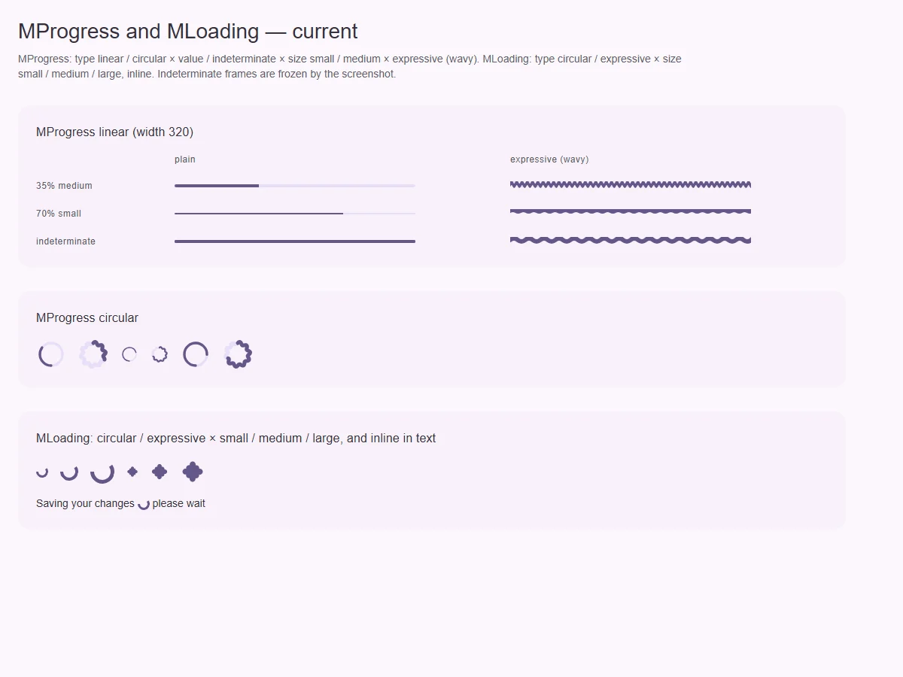
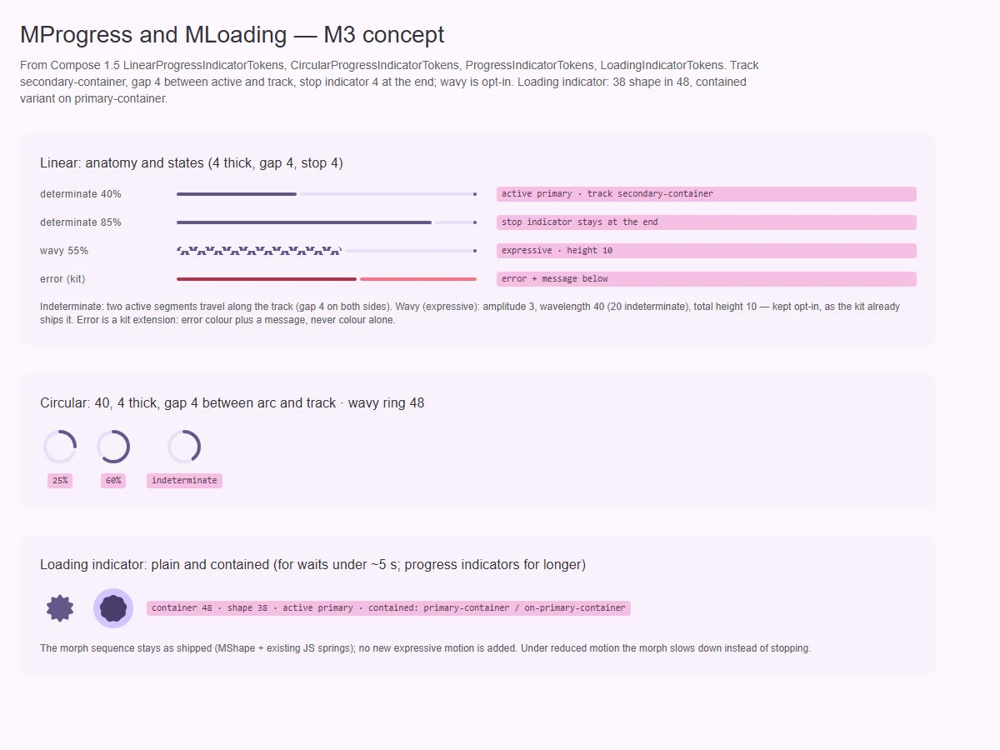

# MLoading — индикатор короткого ожидания

<identity>M3: Loading indicator (Expressive: морфинг фигур, plain и contained; для ожидания до ~5 с) · Токены Compose: `LoadingIndicatorTokens` + `LoadingIndicator.kt`, `MaterialShapes.kt` · Код: `src/runtime/components/ui/loading/`, морф — `components/ui/shape/` + `composables/useShapeMorph.ts` · Аудит: `data/loading.json` · Тип: public</identity>

<implementation-status state="planned" updated="2026-10-07">Есть `type: circular` (CSS-спиннер) и `expressive` (последовательность `MShape` с морфом на JS-пружинах), `size: small | medium | large`, `inline`. Нет contained-варианта, токенов 48/38, reduced motion у спиннера, доступного объявления. На рендере inline-вариант даёт hydration mismatch.</implementation-status>

## Вердикт

`дрейф`. Expressive-индикатор уже построен на морфе фигур M3, это близко к оригиналу. Морф
остаётся как есть: JS-пружины `MShape` уже в бандле, решение владельца их сохраняет и новых не
добавляет.

Расхождения:
- нет **contained**-варианта (`primary-container` под фигурой);
- размеры не по токенам 48 / 38;
- `circular` дублирует indeterminate-кольцо `MProgress`;
- объявление и reduced motion сломаны;
- `div` внутри `span` ломают SSR в строке текста.

## Рендеры

| Сейчас | Концепт M3 |
|---|---|
|  |  |

Рендеры общие с [MProgress](progress.md).

Сейчас: нижний кадр — circular и expressive × small/medium/large и inline в строке текста. Этот
кадр дал на странице предупреждение «Hydration completed but contains mismatches».

Концепт: нижний кадр — plain и contained 48 / 38.

## Анатомия

| # | Часть M3 | В ките | Статус |
|---|---|---|---|
| 1 | Контейнер 48 (у contained — `primary-container`, full) | корень `span.ui-loading` без контейнера | нет contained |
| 2 | Активная фигура 38 (`primary`; у contained — `on-primary-container`) | `MShape` в последовательности | есть, размер свой |
| 3 | Последовательность фигур с вращением | `sequence` у `MShape` | есть |
| 4 | CSS-спиннер | `type: circular`: `div` с двумя половинами | расширение кита, дублирует `MProgress` |

## Оси дизайна

| Ось | M3 | Кит сейчас | Цель | Ломает API |
|---|---|---|---|---|
| Вид | loading indicator (фигуры) | `type: 'circular' \| 'expressive'` | Вопрос 1 | возможно |
| Контейнер | plain · contained | — | `contained: boolean` | нет |
| Размер | 48 (фигура 38) | `size: small \| medium \| large` (16 / 24 / 48?) | Ось масштаба — только `density` из трёх ступеней. Предлагаю `compact` 24 · `default` 48 · `comfortable` 64, фигура = 38/48 от контейнера. Вопрос 2 | да (имя оси) |
| В строке текста | — | `inline` (размер в rem, не от шрифта) | Размер `1em` от шрифта окружения (LY-03) | нет |

## Оси состояний

| Ось | Нужно | Есть | Не хватает |
|---|---|---|---|
| Данные | ожидание · конец ожидания объявлены | `role="status"` + `aria-label`, текста нет (DT-09) | Постоянный регион с текстом; появление ожидания объявляется один раз |
| Задержка | не мигать на быстрых ответах | нет (DT-11) | `delay` и минимальное время показа, общий механизм с [progress](progress.md) |
| Движение | reduced motion замедляет | у морфа переход мгновенный (`useShapeMorph.ts:232`), спиннер не замедляется (A11-18) | Замедлять, а не останавливать: правило кита «сокращать, а не выключать» |
| Forced colors | фигура видна | спиннер на `border-color` (TH-04) | `forced-colors`: `CanvasText` |
| SSR | валидная строчная разметка | `div` внутри `span`; в `
` парсер рвёт абзац (EN-09) | Только строчные элементы (`span`) |

## Токены: расхождения

| Часть | M3 (Compose) | Кит сейчас | Действие |
|---|---|---|---|
| Контейнер | 48 × 48, full | нет | `container.size: 48rem` |
| Фигура | 38 | по `size` | `shape.size: 38rem` |
| Цвет | `primary`; contained: `on-primary-container` на `primary-container` | `primary` | ветка `contained` |
| Толщина спиннера | — | 3 / 4 / 5 в `.vue` через рантайм-переменную (TK-02) | Если `circular` остаётся — токены в карте |
| Движение | — | литералы Sass (TK-04, MO-05) | `--sys-motion-*` |

## Поведение и доступность

- **Объявление.** Внутри — постоянный визуально скрытый текст. Он задаётся пропом `label` без
  английского дефолта (CT-13, Q13), а для пустого значения в dev выводится предупреждение.
  Регион смонтирован всегда, меняется только содержимое — правило живых регионов кита.
- **Имя.** У нескольких индикаторов на странице разные `label` (A11-04).
- **inline.** Только `span`, размер `1em`, `vertical-align: -0.125em`.

## API

| Что | Изменение | Ломает |
|---|---|---|
| `contained` | новый | нет |
| `size` → `density` | по вопросу 2 | да, через алиас |
| `type: 'circular'` | по вопросу 1 | возможно |
| `ariaLabel` → `label` (видимый для AT текст) | без английского дефолта | видимо для AT |
| `delay`, `minDuration` | новые | нет |

## План работ

1. **S — SSR-разметка** (EN-09): только строчные элементы.
2. **S — объявление и имя** (DT-09, CT-13, A11-04).
3. **S — contained и токены 48/38** (TK-02, TK-06, LY-04).
4. **S — reduced motion и forced colors** (A11-18, TH-04).
5. **S — `delay` / `minDuration`** (DT-11), общий с progress.
6. **S — inline от шрифта** (LY-03).
7. **S — ось `density`** (после вопроса 2) **и судьба `circular`** (после вопроса 1).
8. **S — тесты** (TS-07) **и документация.** Документация: когда loading, а когда progress
   (короче или длиннее ~5 с).

## Тесты

- Unit:
  - `inline` внутри `
` — SSR без mismatch (рендер HTML-строки и проверка структуры);
  - регион есть до начала ожидания;
  - таймер цикла фигур останавливается при смене `type` и размонтировании;
  - `delay`.
- e2e: reduced motion — морф идёт медленнее, но идёт; forced colors; axe.

## Готово, когда

- В строке текста нет hydration mismatch.
- Есть contained-вариант.
- Ожидание объявляется один раз.
- Под reduced motion индикатор замедляется.

## Предложения по UX

Расширения сверх паритета с M3. Это предложения владельцу, а не шаги плана. Без Expressive-анимаций и без новых зависимостей.

| Предложение | Что получает пользователь | Заказчик | Цена | Рекомендация |
|---|---|---|---|---|
| Режим «наложение»: индикатор поверх области с полупрозрачной подложкой и `inert` области | Пользователь видит, какая часть экрана занята, и не кликает в неё | карточки, таблицы при перезагрузке | S · обёртка-слот | да |
| Индикатор в кнопке по рецепту `MButton loading` (уже есть) — документировать связку | Единый вид ожидания на действиях | формы | S · только документация | да |

## Открытые вопросы

**1. Оставлять ли `type: 'circular'` в `MLoading`?**
1. Убрать: кольцо ожидания — это `MProgress type="circular" indeterminate`, у `MLoading`
   остаётся только индикатор M3 (фигуры). Один смысл на компонент, но ломается для
   потребителей `circular`.
2. Оставить как облегчённый CSS-спиннер без JS-морфа (меньше работы на странице с множеством
   индикаторов). Два спиннера в ките, зато есть дешёвый вариант.

Рекомендация: 2 с переименованием значений в `shape | spinner` (без слова `expressive`) и
документацией выбора.

**2. Ступени `density` для индикатора.**
1. `compact` 24 · `default` 48 · `comfortable` 64. Дефолт совпадает с M3.
2. Оставить только 48 и токен для исключений.

Рекомендация: 1. Индикатор встречается и в строке списка (24), и на весь экран (64).
