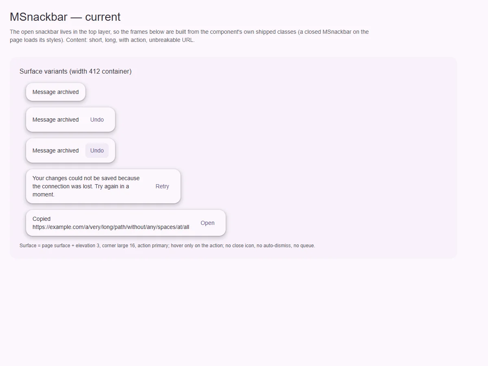
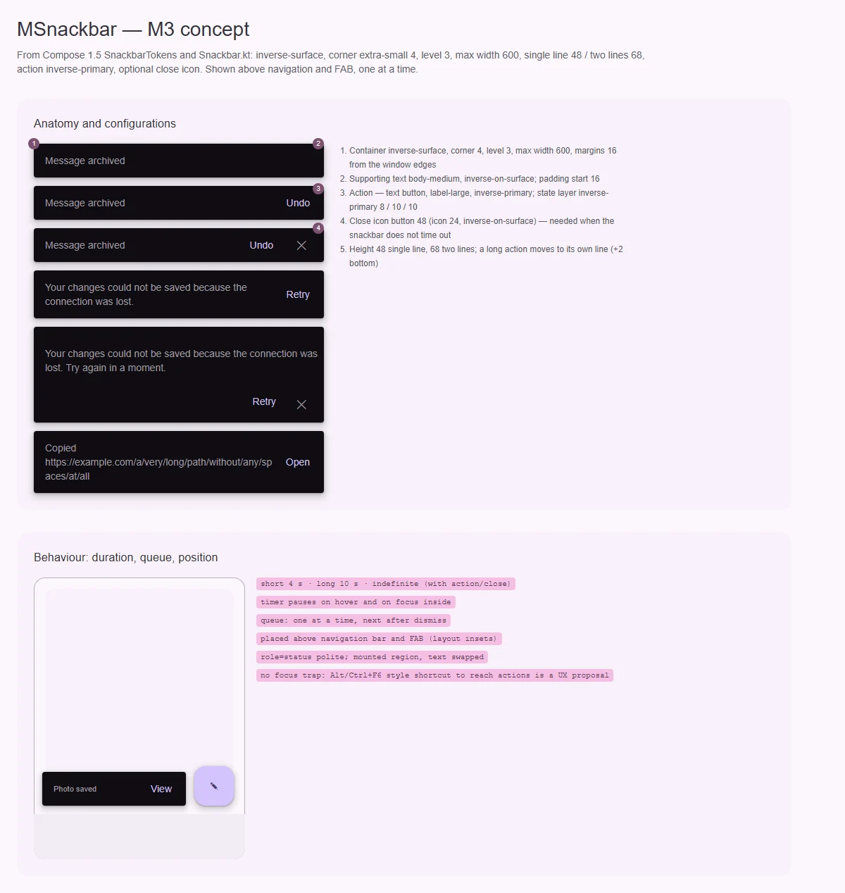

# MSnackbar — короткое сообщение о процессе

<identity>M3: Snackbar · Токены Compose: `SnackbarTokens` + `Snackbar.kt` (раскладка: max 600, отступы 16 / 8, отдельная строка для длинного действия), `SnackbarHost.kt` (длительности, очередь) · Код: `src/runtime/components/ui/snackbar/` · Аудит: `data/snackbar.json` · Тип: public</identity>

<implementation-status state="planned" updated="2026-10-07">Снекбар показывается в top layer через popover, стек и телепорт общие с оверлеями. Сообщение и одно действие есть. Вид не M3: светлая поверхность, угол 16, действие `primary`. Нет автозакрытия, очереди, кнопки закрытия, двухстрочной раскладки. Живой регион монтируется вместе с текстом.</implementation-status>

## Вердикт

`переработка`. По механике (top layer, стек, телепорт в оверлей) снекбар сделан хорошо, но по
виду и поведению это не снекбар M3:
- плашка на `surface` с тенью вместо инверсной `inverse-surface` — в тёмной теме почти не
  видна (TH-06);
- угол 16 вместо 4, действие `primary` вместо `inverse-primary`;
- нет автозакрытия по таймеру, очереди, кнопки закрытия, переноса действия на свою строку;
- `trapFocus` запирает Tab в немодальной плашке без выхода (A11-12).

## Рендеры

| Сейчас | Концепт M3 |
|---|---|
|  |  |

Сейчас: открытая плашка живёт в top layer, поэтому кадры собраны из собственных классов
компонента. Показаны:
- короткое и длинное сообщение;
- действие, в том числе с hover;
- неразрывный URL — он раздвигает плашку.

Концепт:
1. Анатомия и конфигурации: текст, действие, кнопка закрытия, две строки, действие на своей
   строке, перенос URL.
2. Поведение: место над навигацией и FAB, длительности, очередь.

## Анатомия

| # | Часть M3 | В ките | Статус |
|---|---|---|---|
| 1 | Контейнер: `inverse-surface`, угол 4, level 3, max 600 | `.ui-snackbar__surface`: `surface`, угол 16, level 3, max 560 | иначе |
| 2 | Текст: body-medium, `inverse-on-surface`, отступ 16 | `p.ui-snackbar__label`, body-medium, `on-surface` | иначе (роль); `p` ломается от блочного слота (EN-03) |
| 3 | Действие: текстовая кнопка label-large `inverse-primary` | `button.ui-snackbar__action` `primary`, только hover | иначе (роль, нет pressed и focus) |
| 4 | Кнопка закрытия 48, иконка 24 `inverse-on-surface` | — | нет |
| 5 | Раскладка: 48 в одну строку, 68 в две, длинное действие на своей строке | flex в одну строку | нет |

## Оси дизайна

| Ось | M3 | Кит сейчас | Цель | Ломает API |
|---|---|---|---|---|
| Действие | нет · одно | `actionLabel` | оставить; слот `#action` (EN-03) | нет |
| Закрытие | нет · иконка | — | `closable` + `closeLabel` без английского дефолта | нет |
| Действие на своей строке | авто или явно (`actionOnNewLine`) | — | `actionPlacement: 'inline' \| 'below'`, дефолт `inline` | нет |
| Длительность | short 4 с · long 10 с · indefinite | — (висит, пока не закроют) | `duration: 'short' \| 'long' \| 'indefinite' \| number` | видимо: появится автозакрытие (вопрос 1) |
| Смысловое состояние | — | — | Не вводить: ошибки — работа alert и banner | — |

## Оси состояний

| Ось | Нужно | Есть | Не хватает |
|---|---|---|---|
| Взаимодействие (действие, закрытие) | rest · hover · pressed · focus-visible | hover | pressed, focus-ring (ST-01, IN-07); `can-hover` и общий focus-ring уже глобальные (IN-01, IN-04 закрыты) |
| Таймер | пауза на hover и на фокусе внутри | — | вместе с `duration` |
| Очередь | одно сообщение за раз | несколько открытых рисуются друг на друге (CT-08) | композабл очереди |
| Живой регион | регион смонтирован заранее | `role="status"` создаётся вместе с текстом (DT-09) | постоянный регион в хосте оверлеев, меняется текст |
| Фокус | без трапа, есть способ дойти до действия | `trapFocus` запирает Tab без выхода (A11-12) | удалить `trapFocus`; доступ к действию — предложение по UX |

## Токены: расхождения

| Часть | M3 (Compose) | Кит сейчас (`snackbar/_index.scss`) | Действие |
|---|---|---|---|
| Контейнер | `inverse-surface` | `surface` (`:25`) | `inverse-surface` (TH-06) |
| Текст | `inverse-on-surface` | `on-surface` | `inverse-on-surface` |
| Угол | extra-small 4 | large 16 | extra-small |
| Ширина | max 600 | max 560 | 600 |
| Отступы | start 16, end 8 (16 без действия), между 4 | `padding 12rem 16rem`, `gap 16rem` (TK-02) | `spacing()` по Compose |
| Высота | 48 / 68 | по содержимому | `min-height` 48 / 68 |
| Действие | `inverse-primary`, слой `inverse-primary` 8/10/10 | `primary`, hover через литерал (ST-05) | роли и `state-opacity()` |
| Отступ снизу | над навигацией и FAB | `bottom: 16rem` от окна | `--m3-layout-inset-bottom` + 16 + safe-area (RS-09) |
| Движение | fade + небольшой подъём на токенах | длительности в `.vue:172` (TK-06) | `--sys-motion-*` |

## Поведение и доступность

- **Длительности (`SnackbarHost.kt`).** Короткая 4 с, длинная 10 с. Снекбар с действием по
  умолчанию живёт 10 с. `indefinite` требует кнопку закрытия или действие. Таймер встаёт на
  паузу при наведении и при фокусе внутри.
- **Очередь.** Композабл `useSnackbar()` с методом `show({ label, action, duration })` →
  `Promise<'action' | 'dismissed'>`. Показывает по одному. Декларативный `<MSnackbar v-model>`
  остаётся.
- **Живой регион.** Один постоянный `role="status"` в `#ui-overlay-host` (`MApp`). Снекбар
  меняет в нём текст, а не монтирует регион вместе с текстом (DT-09, правило кита).
- **Фокус.** M3 не переводит фокус в снекбар. `trapFocus` удалить с деприкацией.
- **Переполнение.** `flex: 1; min-width: 0; overflow-wrap: anywhere` у текста (CT-03, CT-04).
  Пустой `label` без слота — ничего не рисовать и предупредить в dev (CT-07).
- **Forced colors.** Рамка `CanvasText`, у действия — `ButtonText` (TH-04).

## API

| Что | Изменение | Ломает |
|---|---|---|
| `duration` | новый, дефолт по вопросу 1 | видимо |
| `closable`, `closeLabel` | новые | нет |
| `actionPlacement` | новый | нет |
| `#action`, `#default` вне `
` | слоты | нет |
| `trapFocus` | деприкация → удаление | да, через minor |
| `useSnackbar()` | новый композабл очереди | нет |
| события | `action`, `dismiss(reason: 'timeout' \| 'close' \| 'action')` | нет |

## План работ

1. **S — роли и форма:** `inverse-*`, угол 4, ширина 600, отступы по Compose
   (TH-06, TK-02, ST-05).
2. **S — состояния действия и кнопка закрытия** (ST-01, IN-07).
3. **M — раскладка:** две строки, действие на своей строке, переполнение
   (CT-03, CT-04, CT-07, EN-03).
4. **M — длительность и пауза.**
5. **M — очередь `useSnackbar()`** (CT-08) **и постоянный живой регион** (DT-09).
6. **S — положение над навигацией и FAB через инсеты раскладки, safe-area** (RS-09, LY-10).
7. **S — деприкация `trapFocus`** (A11-12).
8. **S — движение на токенах** (TK-06), **forced colors** (TH-04).
9. **M — тесты и документация** (DC-02…05).

## Тесты

- Unit:
  - очередь показывает по одному;
  - таймер с паузой (фейковые таймеры);
  - промис `show()` возвращает причину;
  - регион есть до первого сообщения, второй не создаётся;
  - пустой `label` предупреждает.
- e2e:
  - снекбар над navigation bar на 360;
  - длинный URL не раздвигает ширину;
  - axe;
  - forced colors;
  - Tab не запирается.

## Готово, когда

- Вид совпадает с M3.
- Снекбар закрывается сам, очередь не накладывает сообщения.
- Сообщение объявляется надёжно.
- Плашка не перекрывает навигацию.

## Предложения по UX

Расширения сверх паритета с M3. Это предложения владельцу, а не шаги плана. Без Expressive-анимаций и без новых зависимостей.

| Предложение | Что получает пользователь | Заказчик | Цена | Рекомендация |
|---|---|---|---|---|
| Горячая клавиша перехода к действию снекбара (через `useHotkey`, подсказка в тексте для AT) | Пользователь клавиатуры успевает нажать «Отменить», не теряя место | любые деструктивные действия с отменой | S | да |
| Свайп в сторону закрывает снекбар на тач-устройствах | Привычный жест, сообщение не мешает | мобильные экраны | S · `closeOnSwipe` из рантайма оверлеев | да |
| Схлопывание одинаковых сообщений в очереди («Сохранено ×3») | Очередь не растягивается на повторах | автосохранение | S | обсудить |

## Открытые вопросы

**1. Автозакрытие по умолчанию.**
1. Как в M3: 4 с без действия, 10 с с действием. Совпадает со спецификацией, но меняет поведение
   существующих потребителей, у которых плашка висела до закрытия.
2. `indefinite` по умолчанию, таймер включается явно. Ничего не меняется, но по умолчанию снекбар
   ведёт себя не как снекбар.

Рекомендация: 1, с пометкой в миграции.
