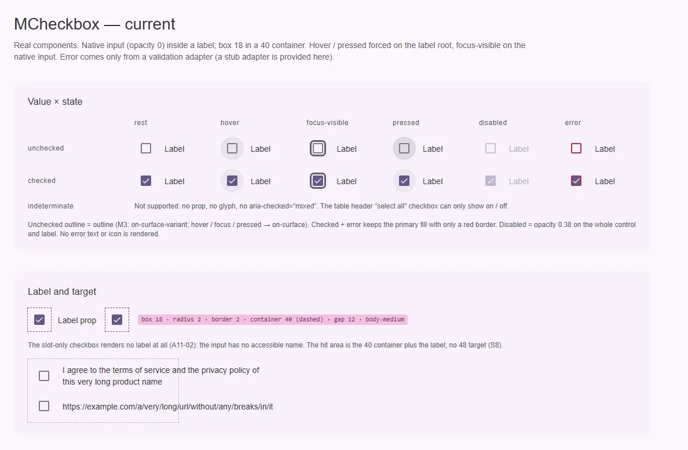
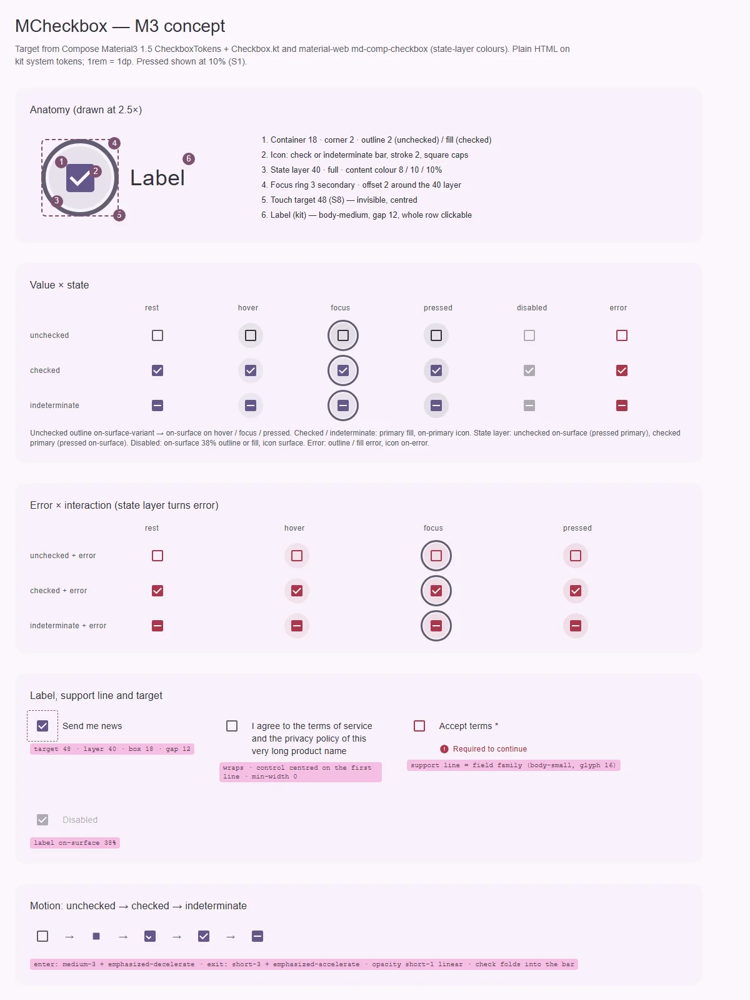

# MCheckbox — флажок: один выбор «да / нет / частично»

<identity>M3: Checkbox · Токены Compose: `CheckboxTokens`, `StateTokens`; поведение — `Checkbox.kt` (`Checkbox`, `TriStateCheckbox`); цвета слоя состояний — material-web `tokens/versions/v0_192/_md-comp-checkbox.scss`, геометрия фокуса и цели — `m3-reference/checkbox/internal/_checkbox.scss` · Код: `src/runtime/components/ui/checkbox/` · Аудит: `data/checkbox.json` · Тип: public</identity>

<implementation-status state="planned" updated="2026-10-07">Исследование и рендеры готовы, код не менялся. Фаза C уже дала кольцо фокуса, `can-hover`, forced colors и раздачу `$attrs` на нативный инпут. Не хватает состояния indeterminate, ролей цвета M3, ошибки с текстом и цели 48. Ждут ЧВ-1…ЧВ-5.</implementation-status>

## Вердикт

**дрейф.** Геометрия совпадает с M3: квадрат 18 с углом 2 и рамкой 2 внутри слоя 40. Но у кита
нет состояния indeterminate: его ждёт заголовок таблицы («выбрать все»), а документация его уже
обещает. Роли разошлись: рамка `outline` вместо `on-surface-variant`, рамка не темнеет на hover,
выбранный флажок с ошибкой остаётся `primary` с красной рамкой. Disabled гасит всё `opacity`.
Ошибка видна только цветом. Всё чинится без ломки API, кроме удаления неиспользуемого `loading`.

## Рендеры

| Сейчас | Концепт M3 |
|---|---|
|  |  |

Кадры концепта:

1. Анатомия в 2.5×: контейнер, глиф, слой 40, кольцо фокуса, цель 48, подпись.
2. Матрица «значение × состояние»: unchecked, checked, indeterminate × rest, hover, focus,
   pressed, disabled, error.
3. Ошибка × взаимодействие: слой состояний становится `error`.
4. Подпись, строка поддержки и цель: обычная строка, перенос длинной подписи, ошибка с текстом,
   disabled.
5. Движение: заливка растёт, галочка прорисовывается, галочка складывается в черту.

## Анатомия

| № | Часть M3 | Элемент кита | Статус |
|---|---|---|---|
| 1 | Container 18, угол 2, рамка 2 | `.ui-checkbox__control` (`index.vue:21`) | есть |
| 2 | Icon: галочка или черта indeterminate | `MIcon` `ICONS.check` 16 (`index.vue:22-25`, `_index.scss:23`) | галочка есть (глиф набора, 16); черты нет |
| 3 | State layer 40, круг | `.ui-checkbox__state-layer` (`index.vue:27`) | есть; в покое сжат до 0.6 и растёт на hover (`index.vue:137`, `:159`) — не M3 |
| 4 | Focus indicator вокруг слоя | `@include focus-ring` на квадрате 18 (`index.vue:99-101`) | иначе: кольцо на контейнере, а не вокруг слоя — ЧВ-5 |
| 5 | Touch target 48 | нативный инпут скрыт без размеров; цель = контейнер 40 + подпись | нет (S8) |
| 6 | Подпись | `.ui-checkbox__label` (`index.vue:30-37`) | расширение кита: M3 подпись не задаёт. Слот без пропа `label` не рендерится (A11-02) |
| 7 | Строка поддержки (ошибка) | нет | нет (FM-02, TH-05) — ЧВ-2 |

## Оси дизайна

| Ось | M3 | Кит сейчас | Цель | Ломает API |
|---|---|---|---|---|
| Значение | unchecked · checked · indeterminate (`ToggleableState`) | `boolean` | + indeterminate (ЧВ-1) | нет |
| Ошибка | `error` (рамка, заливка, слой) | из `useField` по `path` | + отображение текста (ЧВ-2) | нет |
| Подпись | нет | `label` + слот по умолчанию | слот без пропа; перенос строк | нет |
| Размер / цвет | нет | нет | без изменений | нет |

## Оси состояний

Из `axes` аудита, сверено с кодом после фаз A–D.

| Ось | Нужно (M3 + чеклист) | Есть | Не хватает |
|---|---|---|---|
| Базовое | enabled, disabled, read-only, soft-disabled | enabled, disabled (нативный) | read-only — ЧВ-4; soft-disabled — системный вопрос `button/index.md` В-6 |
| Взаимодействие | rest, hover, pressed; рамка unchecked темнеет до `on-surface` | rest, hover, pressed (слой) | смена рамки; цвет pressed-слоя инвертирован у M3 |
| Фокус | кольцо + слой 10 % | кольцо на квадрате 18 | слой 10 %; место кольца — ЧВ-5 |
| Выбор | unchecked, checked, indeterminate | unchecked, checked | indeterminate (ЧВ-1) |
| Смысловое | error: рамка, заливка, слой `error` + текст | рамка `error`; у checked заливка остаётся `primary` (`index.vue:199-206`) | заливка, слой, текст |
| Валидация | invalid, required | `aria-invalid` | `required` + маркер; текст ошибки |

## Токены: расхождения

| Часть | M3 (Compose / material-web) | Кит сейчас (`_index.scss` / `index.vue`) | Действие |
|---|---|---|---|
| Рамка unchecked | `on-surface-variant`; hover, focus, pressed — `on-surface` | `outline` (`_index.scss:18`), в состояниях не меняется | роли по состоянию |
| Глиф | рисованный путь в 18, штрих 2, квадратные концы; черта для indeterminate | `ICONS.check` 16 (`_index.scss:23`) | 18; черта — `ICONS.remove` или путь SVG (шаг 2) |
| Checked + error | контейнер `error`, глиф `on-error` | заливка `primary`, рамка `error` (`index.vue:199-206`) | ветка `error.checked` |
| Слой: цвет | unchecked: hover и focus `on-surface`, pressed `primary`; checked: hover и focus `primary`, pressed `on-surface`; error: `error` | `on-surface` / `primary` / `error`, pressed того же цвета, что hover (`index.vue:139`, `:148-154`) | инверсия на pressed |
| Слой: непрозрачность | hover 8, focus 10, pressed 10 (S1) | hover 8, pressed 12, focus нет (`_index.scss:34-35`) | focus 10; pressed по СВ-1 |
| Слой: покой | только непрозрачность | `scale(0.6)` → 1 на hover (`index.vue:137`, `:159`) | убрать масштаб (TK-07) — если это не осознанный выбор кита |
| Disabled unchecked | рамка `on-surface` 38 % | `opacity: 0.38` на всё (`_index.scss:43`, `index.vue:190-192`) | роли (ST-06) |
| Disabled checked | контейнер `on-surface` 38 %, глиф `surface` | то же `opacity` | роли |
| Подпись disabled | — (кит) | 38 % через общий `opacity` | `on-surface` 38 % отдельным токеном |
| Угол | `RoundedCornerShape(2.dp)` | `2rem` (`_index.scss:17`) | оставить именованным токеном. Совет аудита TK-02 (`corner-extra-small`) отклоняется: это 4, а не 2 |
| Цель | 48 (`minimumInteractiveComponentSize`, material-web `input` 48×48) | 40 | S8 |
| Кольцо фокуса | вокруг слоя: material-web — 44 × 44 круг, Compose — форма 25 % на зоне 40 | на квадрате 18 со смещением 2 | ЧВ-5 |
| Движение | заливка — эффекты; галочка — `DefaultSpatial`; снятие — snap с задержкой 100 мс; material-web: появление 350 мс emphasized-decelerate, исчезновение 150 мс emphasized-accelerate | `short-3` + `standard` (`index.vue:125-128`, `:178-180`) | Пружины отклонены владельцем 2026-10-07 (S4): токены `--sys-motion-*`, как у material-web — появление `medium-3` + `emphasized-decelerate`, исчезновение `short-3` + `emphasized-accelerate`, прозрачность `short-1` + `linear` |
| Подпись | — | body-medium (`_index.scss:46`), `padding-top: 1rem` (`index.vue:186`) | body-medium остаётся; сдвиг убрать (LY-03) |

Совпадает: квадрат 18, рамка 2, угол 2, слой 40, `primary` / `on-primary` у checked, рамка `error`
у unchecked.

## Поведение и доступность

- **Нативный инпут остаётся.** `<input type="checkbox">` под нарисованным контролом: Space,
  отправка формы, озвучка и `:indeterminate` — бесплатно. Инпут растягивается до 48 × 48 по центру
  контрола (как в material-web) и становится целью нажатия (S8); подпись остаётся кликабельной
  через `<label>`.
- **Indeterminate (ЧВ-1).** Выставляется свойством `input.indeterminate` (атрибута нет), поэтому —
  `watch` с `flush: 'post'` и в SSR только класс. Клик по indeterminate по правилам браузера даёт
  `checked = true` и снимает indeterminate. `aria-checked` убирается совсем (A11-06): нативный
  инпут объявляет `mixed` сам.
- **Подпись.** Рендерится при пропе **или** слоте (A11-02). Перенос по словам и `overflow-wrap:
  anywhere`, `min-width: 0` (CT-03, CT-04). Контрол стоит по центру первой строки, а не всей
  подписи.
- **Ошибка.** Не только цветом (`color-and-state.md`): текст и глиф в строке поддержки, связка
  `aria-describedby`, `aria-invalid` уже есть. Как резервируется высота — ЧВ-2.
- **Обязательность (FM-10).** `required` на инпуте и маркер `*` в подписи цветом `error` (как у
  поля, `text-field/_index.scss:68`).
- **Forced colors.** Уже есть (`index.vue:213-239`). Добавить черту indeterminate (`HighlightText`
  на `Highlight`) и пунктирную рамку ошибки — как у полей.
- **Reduced motion.** Закрыто системно: `short-3` — короткая обратная связь, глобальное правило
  `base/_animations.scss:44` её не трогает (A11-18).

Открытые пункты аудита → шаги: A11-02, A11-06 → шаг 1; EN-01 → шаг 1; ST-01 (indeterminate),
DC-03 → шаг 2; ST-06, TK-06 → шаг 3; FM-02, TH-05, EN-03 → шаг 5; FM-10 → шаг 5; CT-03, CT-04,
LY-03, TK-07 → шаг 4; RS-12 → шаг 4 (S8); FM-07 → ЧВ-3; IN-09 → ЧВ-4; IN-08 → `button/index.md`
В-6. Закрыто фазами A–D: ST-03, IN-01, IN-03, IN-04 (кольцо фокуса), TH-04 (forced colors), EN-04
(`useControlAttrs`). Закрыто правилом: LY-06, TK-04 — `z-index: 1` внутри `isolation: isolate`
разрешён (`craft.md`, раздел 12); A11-18 — системно. RS-04, RS-05 — принятое отклонение. DC-* —
документация в `docs`.

## API

Добавить (без ломки):

| Что | Тип | Дефолт | Зачем |
|---|---|---|---|
| `indeterminate` + `update:indeterminate` | `boolean` | `false` | третье состояние (ЧВ-1) |
| `required` | `boolean` | `false` | FM-10 |
| слот `#support` | — | — | своя строка поддержки или ошибка (ЧВ-2) |

Исправить: слот подписи без пропа; убрать `aria-checked`.

Ломающее: убрать `loading` (`props.ts:13` берёт `...makeStateProps()` целиком; проп нигде не
читается, EN-01). Миграция: удалить атрибут у вызова; в ките его не передаёт никто.

Не вводится: `value` и модель-массив (DC-03 обещает их в документации) — это группа флажков, ЧВ-3.

## План работ

1. **S** — Мелкие исправления без видимых изменений: условие слота подписи, убрать `aria-checked`,
   взять из `makeStateProps` только `disabled`. Файлы: `checkbox/index.vue`, `checkbox/props.ts`,
   `checkbox/index.spec.ts` (тест «reflects the checked model in class and aria-checked»
   переписывается).
2. **M** — Indeterminate: проп, синхронизация `input.indeterminate`, черта, класс-модификатор,
   forced colors. Зависит от ЧВ-1. Файлы: `checkbox/*`. Потребитель:
   `fragments/table/header/index.vue:8` (частичный выбор строк).
3. **M** — Карта токенов по таблице: роли рамки по состоянию, `error.checked`, инверсия слоя на
   pressed, focus-слой 10 %, disabled по ролям, глиф 18. Перевести файл на точечные пути `g()`.
   Зависит от СВ-1. Файлы: `assets/stylesheet/components/checkbox/_index.scss`,
   `checkbox/index.vue`.
4. **S** — Цель 48 (инпут 48 × 48 по центру), подпись: перенос, `min-width: 0`, центр контрола на
   первой строке, без `padding-top`; убрать масштаб слоя. Файлы: `checkbox/index.vue`.
5. **M** — Строка поддержки и `required` по ЧВ-2: глиф `ICONS.error`, `aria-describedby`, маркер.
   Значения строки — из полей кита (body-small, min-h 18, глиф 16 + 6). Файлы: `checkbox/*`.
6. **S** — Место кольца фокуса по ЧВ-5. Файлы: `checkbox/index.vue`.
7. **S** — Движение на токенах `--sys-motion-*` по таблице токенов: заливка и галочка (масштаб
   0.6 → 1 и прорисовка `stroke-dashoffset`), снятие — быстрое исчезновение. Файлы:
   `checkbox/index.vue`.
8. **M** — Тесты.

Переиспользование: те же слой 40, цель 48, кольцо и строка поддержки нужны `MRadio` (см.
[radio.md](radio.md)) и позже `MSwitch`. Шаги 3–6 оформляются общим Sass-миксином контрола выбора
в `abstracts`, а не копией в двух SFC.

## Тесты

- Фикстуры `playground/fixtures/checkbox/{matrix,stress}.vue`: значение × состояние × error;
  слот без пропа; длинная подпись и URL; RTL; таблица с частичным выбором.
- e2e `checkbox.e2e.ts`: axe на матрице (светлая и тёмная × ltr и rtl); Space переключает;
  клик по indeterminate даёт checked и эмитит `update:indeterminate(false)`; цель ≥ 48
  (`elementFromPoint` у края); ошибка связана `aria-describedby`; forced colors для checked,
  indeterminate и error.
- unit (`index.spec.ts`): подпись из слота (TS-07); `input.indeterminate` после монтирования;
  отсутствие `aria-checked`; ошибка из заглушки `ValidationAdapter` (TS-07).

## Готово, когда

- [ ] Три значения рисуются и объявляются (`mixed`) нативно.
- [ ] Цвета всех клеток матрицы совпадают с концептом; disabled — по ролям.
- [ ] Ошибка видна заливкой или рамкой, текстом и глифом; связана `aria-describedby`.
- [ ] Цель ≥ 48; подпись из слота и длинная подпись работают.
- [ ] Пропа `loading` нет.
- [ ] `npm run lint`, `lint:style`, `lint:scss`, `typecheck`, vitest, e2e — зелёные.
- [ ] Видимые изменения (рамка, disabled, checked + error) перечислены в summary.

## Предложения по UX

Расширения сверх паритета с M3. Это предложения владельцу, а не шаги плана.

| Предложение | Что получает пользователь | Заказчик | Цена | Рекомендация |
|---|---|---|---|---|
| П-1. Описание под подписью: слот `#description` (body-small `on-surface-variant`), связан `aria-describedby` | Пояснение к опции стоит рядом и озвучивается вместе с ней | Формы настроек и согласий | S · бандл: ~0 · API: один слот | Да |
| П-2. Хелпер «родитель — дети»: чистая функция или композабл (`checked`, `indeterminate`, `toggleAll` из списка детей) | «Выбрать все» в заголовке таблицы и в группах настроек без ручной арифметики | `MTable`: `fragments/table/header/index.vue:8` сейчас считает сам | S · бандл: несколько строк в `composables/` · API: новый композабл, без компонента | Да, вместе с шагом 2 (indeterminate) |
| П-3. Выбор диапазона Shift+кликом | Отметить 20 строк двумя кликами | `MTable` (выбираемые строки) | M · живёт в таблице или композабле выбора; флажку нужно только пробросить `shiftKey` с событием | Да, но в плане `MTable`; здесь — только проброс события |

## Открытые вопросы

**ЧВ-1. Как выражается indeterminate.**

1. Проп `indeterminate` + `update:indeterminate`, модель остаётся `boolean`. Как нативный инпут и
   material-web; `v-model:indeterminate` работает из коробки. Цена: два источника правды, которые
   потребитель держит согласованными.
2. Модель `boolean | null`, где `null` — частично (как `ToggleableState` в Compose). Одно значение,
   но `null` в форме обычно значит «не заполнено», и `useField` начнёт видеть его как пустое.

Рекомендация: 1.

**ЧВ-2. Резервировать ли высоту строки поддержки.**

1. Всегда, как у полей (`color-and-state.md`: раскладка не едет при ошибке). Цена: +22 под каждым
   флажком, в том числе в таблице и списках.
2. Только когда есть текст. Раскладка сдвигается при появлении ошибки.
3. Резервировать, только когда задан `path` (флажок — поле формы); без `path` (таблица, списки)
   строки нет совсем.

Рекомендация: 3.

**ЧВ-3. Группа флажков (FM-07, модель-массив из документации).**

1. Новый `MCheckboxGroup`: подпись, `v-model` массивом, `value` у флажков, строка поддержки — по
   образцу `MRadioGroup`. Цена: новый публичный компонент.
2. Не вводить, пока нет заказчика (`principles.md`, В4); убрать обещание из документации `docs`.
   Условие возврата — форма с множественным выбором из списка.

Рекомендация: 2.

**ЧВ-4. Read-only (IN-09).**

1. `readonly`: фокус и объявление сохраняются, клик и Space гасятся, вид — как enabled без
   слоя состояний. Цена: ещё одно состояние в матрице, а у нативного checkbox `readonly` не
   работает — блокировка руками.
2. Не вводить, пока нет заказчика. Условие возврата — экран просмотра анкеты.

Рекомендация: 2.

**ЧВ-5. Где рисовать кольцо фокуса.**

1. Вокруг слоя 40 кругом (кольцо кита 3 + смещение 2 даёт внутренний диаметр 44, как у
   material-web). Совпадение с M3 и одинаковый вид у флажка и радио. Видимое изменение.
2. На квадрате 18, как сейчас. Без изменений, но кольцо плотно прилегает к контролу и
   расходится с M3.

Рекомендация: 1.
