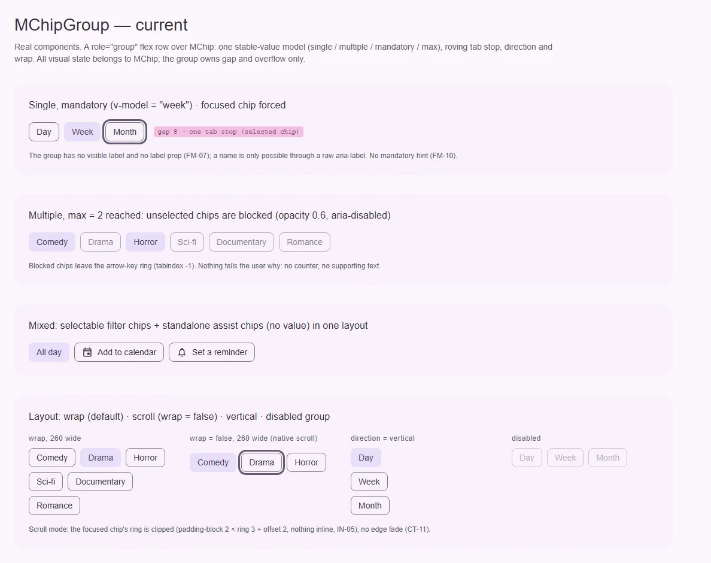
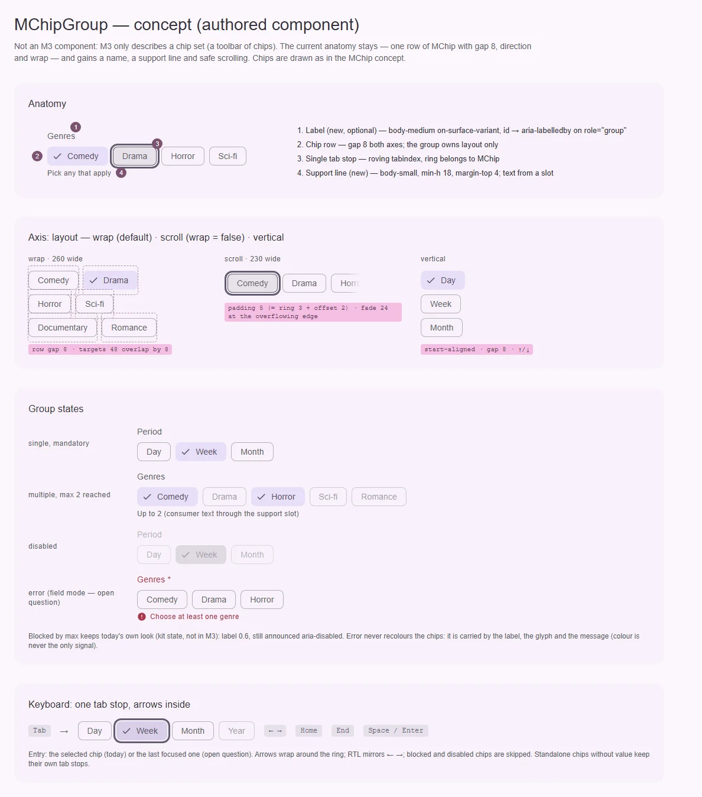

# MChipGroup — набор чипов с одним значением и одной остановкой Tab

<identity>M3: компонента нет; M3 описывает только «chip set» — раскладку чипов, которую material-web делает toolbar-ом (`m3-reference/docs/components/chip.md`, «Chip sets») · Токены Compose: нет; чипы — `*ChipTokens` через `MChip` · Код: `src/runtime/components/ui/chip-group/` + `src/runtime/composables/chip-group/context.ts` · Аудит: `data/chip-group.json` · Тип: public, родитель семейства</identity>

<implementation-status state="planned" updated="2026-10-07">Компонент работает с 2026-07-16: выделенный контекст, тикеты выбора поверх `useSelectionGroup`, roving tabindex, `direction`/`wrap`, режим данных. План 2026-10-07 доводит его по системе: имя группы, строка поддержки, безопасная прокрутка, порядок обхода из DOM, перенос фокуса при удалении. Код не менялся. Ждут ГВ-1…ГВ-5.</implementation-status>

## Вердикт

**авторский.** Отдельного «chip group» в M3 нет: есть набор чипов (gap 8, перенос строк), а
выбор описан у самих filter-чипов. Кит сделал из набора компонент с одним значением,
`mandatory`/`max` и одной остановкой Tab. Это видение сохраняется: анатомия (ряд `MChip` с
зазором 8), оси (`direction`, `wrap`) и вид не меняются. План чинит дефекты аудита и даёт группе то,
чего ей не хватает как элементу формы: имя, строку поддержки, безопасную прокрутку, устойчивый порядок
обхода. Вид чипов внутри определяет [план `MChip`](chip.md).

## Рендеры

| Сейчас | Концепт (развитие текущего вида) |
|---|---|
|  |  |

Кадры концепта:

1. Анатомия: подпись группы, ряд чипов, единственная остановка Tab, строка поддержки.
2. Ось раскладки: перенос (цели 48 соседних строк перекрываются на 8), прокрутка (запас под
   кольцо фокуса и затухание у края, где есть продолжение), вертикаль.
3. Состояния группы: single + mandatory, multiple с достигнутым `max` (заблокированные чипы
   сохраняют сегодняшний вид), disabled, ошибка в режиме поля (ГВ-2).
4. Клавиатура: Tab входит на один чип, стрелки, Home/End, пропуск заблокированных.

Чипы на концепте нарисованы по концепту `MChip` (рамка `outline-variant`, галочка у выбранного).

## Анатомия

| № | Часть | Элемент кита | Статус |
|---|---|---|---|
| 1 | Подпись группы | нет; имя только через сырой `aria-label` в `$attrs` | нет (FM-07, A11-02) — ГВ-3 |
| 2 | Ряд чипов, зазор 8 по обеим осям | корень `div.ui-chip-group[role=group]` (`index.vue:2-9`), `gap: g($t, 'gap')` | есть; зазор литералом (`_index.scss:10`) |
| 3 | Одна остановка Tab | `tabindex` из `activeView` (`index.vue:229-232`) | есть; вход на выбранный, а не на последний фокус — ГВ-1 |
| 4 | Строка поддержки / ошибки | нет | нет (FM-02, FM-10) — ГВ-2 |
| 5 | Затухание у края при прокрутке | нет | нет (CT-11) — ГВ-4 |
| — | Пустое состояние | слот `#empty` (`index.vue:30-34`) | есть, остаётся |

## Оси дизайна

| Ось | Кит сейчас | Цель | Ломает API |
|---|---|---|---|
| `direction` | `horizontal \| vertical` (`context.ts:37`), дефолт `horizontal` | без изменений | нет |
| `wrap` | `boolean`, дефолт `true`; `false` → нативная прокрутка без стрелок | без изменений; запас под кольцо и затухание — шаги 3 и ГВ-4 | нет |
| Режим выбора | `multiple`, `mandatory: boolean \| 'force'`, `max` | без изменений | нет |
| Подпись | нет | `label` + слот `#label` (ГВ-3) | нет |
| Режим поля | нет | `path`, строка поддержки, `required` (ГВ-2) | нет |

`wrap` — булев флаг при живой оси `direction`. По `principles.md` (В1) это кандидат на ось
(`overflow: 'wrap' | 'scroll'`), но второе значение уже выражено, и флаг подтверждён прежним
планом. План его не трогает; если вернуться к вопросу — вместе с `MSlideGroup`.

## Оси состояний

| Ось | Нужно | Есть | Не хватает |
|---|---|---|---|
| Базовое | enabled, disabled (группа и элемент), blocked по `max`, read-only | всё, кроме read-only | read-only — ГВ-5 |
| Взаимодействие | у чипов | у чипов | — |
| Фокус | roving tabindex, кольцо не обрезается | roving; по inline-краю кольцо первого и последнего чипа режется в режиме прокрутки | запас = кольцо + смещение (шаг 3) |
| Выбор | single, multiple, mandatory, max | всё | — |
| Валидация | ошибка и обязательность, когда группа — поле | нет | ГВ-2 |
| Данные | пусто, загрузка | `#empty` | загрузка — не берётся: заказчика нет (В4) |

## Токены: расхождения

| Часть | Опора | Кит сейчас | Действие |
|---|---|---|---|
| Зазор | chip set M3 (material-web `md-chip-set`): 8 | `8rem` литералом (`_index.scss:10`) | `spacing(8)` (LY-04) |
| Запас прокрутки | кольцо фокуса чипа: 3 + смещение 2 = 5 по обеим осям | `padding-block: 2rem` (`_index.scss:11`, `index.vue:272`), по inline — 0 | вывести из `$theme-focus-link` (`width + offset`); `padding-inline` + `scroll-padding-inline` (IN-05, TK-02) |
| Подпись | поле кита: подпись `on-surface-variant`, обязательность — `error` (`text-field/_index.scss:65-68`) | нет | ветка `label` (типографика — ГВ-3) |
| Строка поддержки | поле кита: body-small, min-h 18, отступ 4, глиф 16 + 6 (`text-field/_index.scss:84-91`) | нет | ветка `support` с теми же значениями |
| Затухание | — | нет | `mask-image` 24 у края с продолжением (ГВ-4) |

Измерение в рендере: в режиме прокрутки по вертикали кольцо не обрезалось — контейнер вырос на
высоту полосы прокрутки. Опираться на это нельзя: на платформах с наложенной полосой запас 2
меньше выноса кольца 5.

## Поведение и доступность

Подтверждено прежним планом и остаётся:

- **Контекст.** Выделенный `MChipGroupContext` (`context.ts`), а не обобщённый `MSelectionContext`:
  `MChip` внутри чужого `MSelectionGroup` никогда не регистрируется. Ключ контекста — внутренний,
  публичного `ChipGroupSymbol` нет.
- **Один источник выбора.** Тикеты делегируют `useSelectionGroup`; список элементов в группе —
  только состояние фокуса. Без индексной модели, без второго реестра и без Pinia.
- **Standalone-правило.** Потомок с `value` входит в выбор и в roving; без `value` — обычный
  standalone-чип со своим Tab, без регистрации и без предупреждения. Смешанные наборы законны.
- **Max.** Невыбранные чипы на лимите получают `aria-disabled` и **выпадают из обхода стрелками**;
  выбранные остаются доступны, чтобы освободить место. Это же правило записано в `decisions.md`
  для семейства дропдауна. Пункт аудита IN-08 (сделать их достижимыми) отклонён этим решением.
- **Disabled выбранного чипа** не меняет бизнес-модель молча.
- **Клавиатура.** `role="group"`, чипы — toggle-кнопки с `aria-pressed`, без ролей tablist и
  checkbox. Стрелки по логическому направлению, по кольцу; RTL зеркалит ←/→; Home/End — первый и
  последний доступный; Space/Enter — нативное нажатие кнопки.
- **SSR.** Начальная модель сверяется по мере регистрации; ни загрузки в `onMounted`, ни замеров DOM;
  ссылки на элементы — только для фокуса по действию пользователя; снятие в `onScopeDispose`.

Новое в этом плане:

- **Порядок обхода из DOM.** Сегодня `views.push(view)` (`index.vue:204`) ставит чип в конец
  обхода в момент монтирования: чип, вставленный в середину смонтированного ряда, стрелками
  достигается последним. В режиме данных порядок берётся из `entries`, в композиционном — из
  `compareDocumentPosition` в момент перехода, без наблюдателя. Тот же дефект и та же причина
  записаны в `decisions.md` для дропдауна.
- **Фокус после удаления.** Прежний план обещал: удалён чип в фокусе → следующий доступный, иначе
  предыдущий, иначе корень группы. В коде этого нет — фокус уходит на `body`.
- **Вход Tab** — ГВ-1.
- **Имя группы.** `label` → видимая подпись с `id` из `useId()` → `aria-labelledby` на корне. Без
  подписи и без `aria-label`/`aria-labelledby` — dev-предупреждение (как у `MOtpInput`). Текста по
  умолчанию нет: кит не поставляет непереводимых строк.
- **Режим поля (ГВ-2).** Строка поддержки связывается `aria-describedby` с корнем. `aria-required` у
  `role=group` не поддерживается, поэтому обязательность — маркер в подписи плюс текст в строке
  поддержки (FM-10). Ошибка не перекрашивает чипы: её несут подпись, глиф и сообщение.

Открытые пункты аудита → шаги: FM-07, A11-02 → шаг 4; IN-05, TK-02 → шаг 3; LY-04 → шаг 1; ST-01,
FM-02, FM-10 → шаг 5 (ГВ-2); CT-11 → ГВ-4; A11-08 (часть 1) → ГВ-1, (часть 2) отклонено решением
о `max`; IN-09 → ГВ-5. TH-07 (`color-scheme` для полосы прокрутки) — системно, вне плана. DC-* —
документация в `docs`. TS-* → раздел «Тесты». RS-04, RS-05 — принятое отклонение.

## API

Остаётся (подтверждено):

```ts
export type MChipGroupDirection = 'horizontal' | 'vertical'

export interface MChipGroupProps<TItem, TValue = TItem> {
  items?: readonly TItem[]
  itemValue?: keyof TItem | ((item: TItem, index: number) => TValue)
  itemDisabled?: keyof TItem | ((item: TItem, index: number) => boolean)
  itemKey?: keyof TItem | ((item: TItem, index: number) => PropertyKey)
  multiple?: boolean                 // false
  mandatory?: boolean | 'force'      // false
  disabled?: boolean                 // false
  max?: number                       // только в multiple
  direction?: MChipGroupDirection    // 'horizontal'
  wrap?: boolean                     // true
  valueComparator?: (left: TValue, right: TValue) => boolean
}
const model = defineModel<TValue | TValue[] | undefined>()
```

Слоты: `default` (`selected`, `multiple`, `disabled`, `selectionLimitReached`, `select`, `unselect`,
`toggle`) — основной API; `item` (`item`, `index`, `value`, `selected`, `disabled`, `blocked`,
`blockReason`, `props`) — удобство режима данных; `empty`. Кастомизация галочки — у `MChip`, не у
группы. Пропы — runtime-объект `mChipGroupProps` + типизированный интерфейс (как `MAutocomplete`),
потому что генератор API в docs читает только `defineProps(mXProps)`.

Не вводится (подтверждено): `filter` (семантику фильтра несёт `type` чипа), `column` (есть
`direction`), стрелки и перетаскивание прокрутки (до `MSlideGroup`), индексная модель, публичный
символ контекста.

Добавить (без ломки):

| Что | Тип | Дефолт | Зачем |
|---|---|---|---|
| `label` + слот `#label` | `string` | `undefined` | имя группы (ГВ-3) |
| слот `#support` | — | — | текст под группой, например «До 2» (ГВ-2) |
| `path`, `required` | `string`, `boolean` | `undefined`, `false` | режим поля (ГВ-2) |

Ломающих изменений нет.

## План работ

1. **S** — Токены: `gap` через `spacing(8)`; ветки `label`, `support` (значения — из полей кита);
   запас прокрутки выводится из `$theme-focus-link`. Файлы:
   `assets/stylesheet/components/chip-group/_index.scss`.
2. **S** — Порядок обхода из `entries` (данные) или из DOM (композиция). Файлы:
   `chip-group/index.vue`, `chip-group/index.spec.ts`.
3. **S** — Прокрутка: `padding-inline` и `padding-block` = ширина кольца + смещение,
   `scroll-padding-inline` тем же значением, `overscroll-behavior-inline: contain` (CT-11, часть без
   визуальных изменений). Файлы: `chip-group/index.vue`.
4. **S** — Имя группы: `label`, `#label`, `aria-labelledby`, dev-предупреждение. Зависит от ГВ-3.
   Файлы: `chip-group/props.ts`, `chip-group/index.vue`.
5. **M** — Режим поля по ГВ-2: `#support`, `path` через `useField` (модель — массив или значение,
   как `v-model`), `aria-describedby`, маркер обязательности. Файлы: `chip-group/*`,
   `composables/useField.ts` (без изменений, только потребление).
6. **S** — Фокус после удаления зарегистрированного чипа: следующий → предыдущий → корень
   (`tabindex="-1"` на корне только на это время). Файлы: `chip-group/index.vue`,
   `composables/chip-group/context.ts`.
7. **S** — Вход Tab по ГВ-1. Файлы: `chip-group/index.vue`; тест «gives the group exactly one tab
   stop and moves it to the selection» переписывается, если ГВ-1 = 1.
8. **S** — Затухание у края по ГВ-4. Файлы: `chip-group/index.vue`.
9. **M** — Тесты.

Зависимости: вид чипов — [план `MChip`](chip.md) (шаги 1–6 там не
блокируют этот план). Удаление input-чипов в группе (шаг 6) имеет смысл после В-4 в плане `MChip`;
до него шаг покрывает условный рендеринг и данные.

## Тесты

- Фикстуры `playground/fixtures/chip-group/{matrix,stress}.vue`: single, multiple, max, disabled,
  смешанный набор, вертикаль, прокрутка, режим поля с ошибкой; стресс — 100+ чипов и длинные
  подписи.
- e2e `chip-group.e2e.ts`: axe (поймал бы безымянную группу, TS-05); одна остановка Tab; стрелки
  по кольцу и в RTL; заблокированные по `max` пропускаются; чип, вставленный в середину, достигается
  стрелкой в порядке DOM; удаление чипа в фокусе переносит фокус; кольцо фокуса крайнего чипа не
  обрезано в режиме прокрутки (скриншот).
- unit (`index.spec.ts`): существующие 18 случаев + порядок обхода, `aria-labelledby`,
  `aria-describedby`, фокус после удаления (TS-07).

## Готово, когда

- [ ] Группа с `label` получает имя; без имени — dev-предупреждение.
- [ ] Стрелки обходят чипы в порядке DOM, в том числе после вставки в середину.
- [ ] Удаление чипа в фокусе не роняет фокус на `body`.
- [ ] В режиме прокрутки кольцо фокуса крайних чипов не обрезается.
- [ ] Режим поля (если ГВ-2 = 1): ошибка видна подписью, глифом и текстом, связана
      `aria-describedby`.
- [ ] Существующие тесты группы и чипа проходят; `lint`, `lint:style`, `lint:scss`, `typecheck`,
      e2e — зелёные.

## Предложения по UX

Расширения сверх нынешнего видения. Это предложения владельцу, а не шаги плана.

| Предложение | Что получает пользователь | Заказчик | Цена | Рекомендация |
|---|---|---|---|---|
| П-1. `clear()` в слот-пропсах по умолчанию + слот `#append` для чипа «Сбросить» в конце ряда | Сброс всех фильтров одним действием, рядом с самими фильтрами | Панели фильтров (multiple) | S · бандл: ~0 · API: функция в слоте, один слот | Да |
| П-2. Свёртка длинного набора: первые N чипов, дальше чип «+K» раскрывает остальные; считается по количеству, без замеров | 30 жанров не занимают пол-экрана; «+K» — обычный чип в обходе стрелками | Наборы тегов и категорий | M · бандл: небольшой, без наблюдателей · API: проп числа видимых (имя на решение владельца), текст «+K» — слот с фолбэком в `MESSAGES` | Да, только счётный вариант |
| П-3. Переход по первой букве (type-ahead, APG): буква переводит фокус на следующий чип с такой подписью | Быстрый переход в длинном наборе с клавиатуры | Те же длинные наборы | S · бандл: один обработчик `keydown` · API: нет | Да |
| П-4. Объявление о лимите: при упоре в `max` — вежливое `aria-live` с текстом потребителя («Можно выбрать не больше двух») | Пользователь скринридера узнаёт, почему чипы стали недоступны | multiple + `max` | S · бандл: ~0 · API: проп текста без дефолта (кит не поставляет непереводимых строк); без текста ничего не объявляется | Да |

## Открытые вопросы

**ГВ-1. Куда входит Tab.**

1. На последний чип, где был фокус; при первом входе — на выбранный, иначе на первый. Так ведёт себя
   toolbar по APG, а набор чипов M3 в material-web — toolbar (A11-08).
2. Всегда на выбранный, иначе на первый (сегодня). Как у radio group; предсказуемо в single-режиме,
   но после обхода стрелками и выхода Shift+Tab возвращает не туда, где был пользователь.

Рекомендация: 1. В single-режиме разница почти не видна: стрелки не выбирают, а фокус обычно стоит
на выбранном.

**ГВ-2. Становится ли группа полем формы.**

1. Да: `path` через `useField`, `required`, строка поддержки с ошибкой, `aria-describedby`. Паритет с
   `MRadioGroup` (у которого `path` уже есть). Цена: группа получает вторую роль, строка поддержки
   резервирует высоту только при `path`.
2. Только слот `#support` без валидации: текст и ошибку пишет потребитель. Минимум кода, но
   связывание `aria-describedby` и маркер обязательности каждый раз делаются руками.
3. Ничего: группа — только раскладка выбора.

Рекомендация: 1. Аудит видит группу как поле выбора (фильтры, теги), а у кита уже есть
адаптер валидации.

**ГВ-3. Какой видимой подписью называть группу.**

1. Проп `label` + слот `#label`: строка над рядом, body-medium `on-surface-variant` (как подпись
   поля в позиции `top`), обязательность — красный маркер. Без `label` вид не меняется.
2. Без видимой подписи: только документировать `aria-label` / `aria-labelledby` в `$attrs` и
   предупреждать в деве. Вид прежний, но каждый потребитель рисует заголовок сам и сам связывает
   `id`.

Рекомендация: 1.

**ГВ-4. Затухание у края в режиме прокрутки.**

1. `mask-image` 24 у края, за которым есть продолжение; переключается scroll-driven-анимацией
   (`animation-timeline: scroll(inline)`) без JS. В браузерах без поддержки затухания нет.
2. Затухание у обоих краёв всегда, пока включён режим прокрутки. Проще, но гасит первый чип, даже
   когда прокрутки нет.
3. Без затухания: продолжение показывает только полоса прокрутки.

Рекомендация: 1. Это видимая правка авторского компонента, нужно согласие владельца.

**ГВ-5. Read-only (IN-09).**

1. `readonly`: чипы фокусируются и объявляют состояние, переключение заблокировано. Цена: новое
   состояние у `MChip` (как его нарисовать — ещё один вопрос), а `aria-readonly` у `role=group`
   недопустим.
2. Не вводить, пока нет заказчика (`principles.md`, В4). Условие возврата — экран просмотра
   фильтров без права их менять.

Рекомендация: 2.
