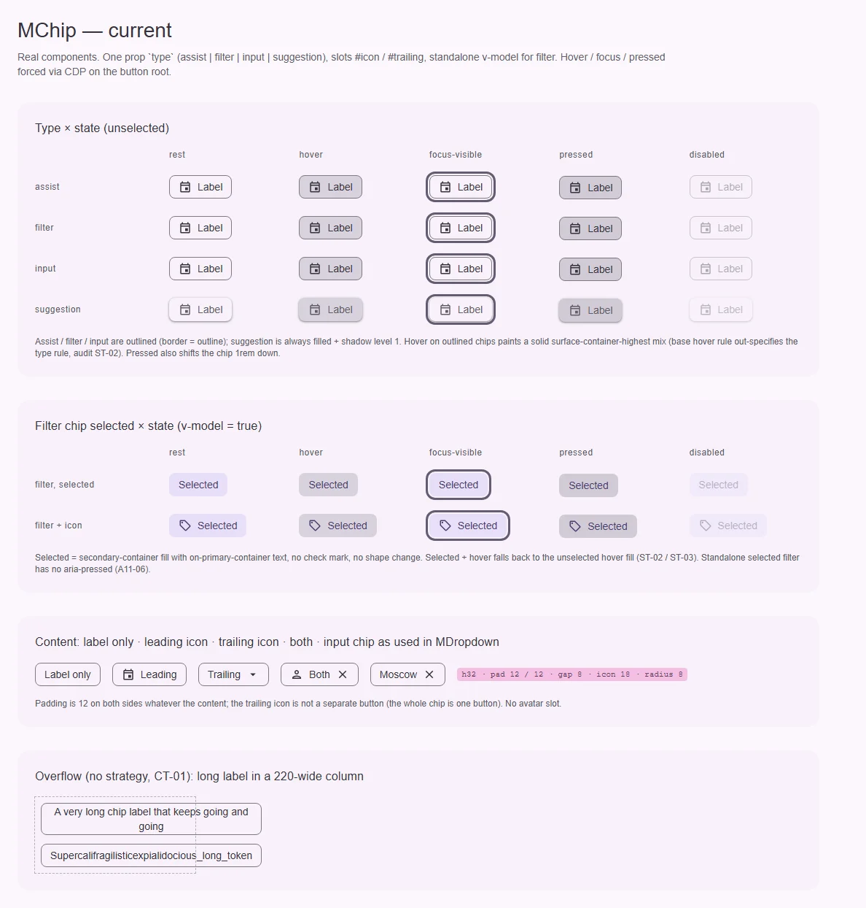
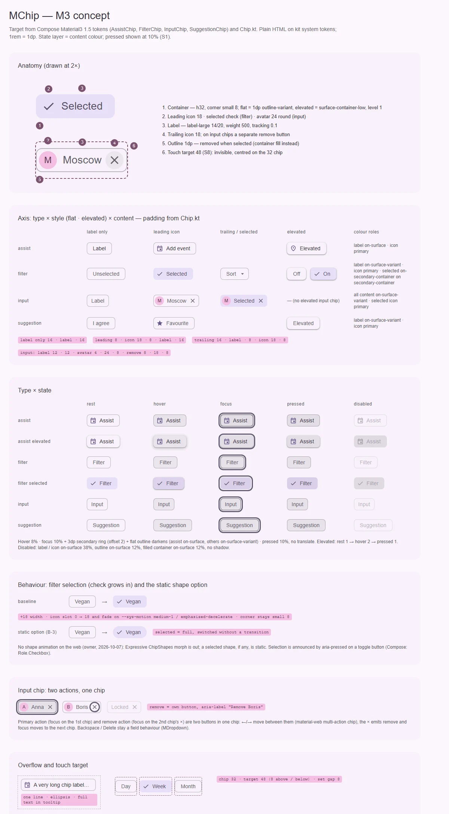

# MChip — компактный элемент действия, фильтра или введённого значения

<identity>M3: Chips (assist, filter, input, suggestion) · Токены Compose: `AssistChipTokens`, `FilterChipTokens`, `InputChipTokens`, `SuggestionChipTokens`, `StateTokens`; поведение и раскладка — `Chip.kt`; цвета слоя состояний — material-web `tokens/versions/v0_192/_md-comp-*-chip.scss` · Код: `src/runtime/components/ui/chip/` + `src/runtime/composables/chip-group/context.ts` · Аудит: `data/chip.json` · Тип: public</identity>

<implementation-status state="planned" updated="2026-10-07">Исследование и рендеры готовы, код не менялся. Интеграция с `MChipGroup` (опциональный `value`, тикет, roving) сделана раньше и сохраняется; не сделаны галочка выбора, вариант elevated, аватар, отдельное действие удаления и слой состояний. Ждут В-1…В-6.</implementation-status>

## Вердикт

**переработка.** Размер, форма, шрифт, иконка 18 и четыре типа совпадают с M3, поэтому чип узнаётся.
Но у кита нет оси flat/elevated, галочки выбранного filter-чипа, аватара и второго действия
input-чипа: сегодня «крестик» — декоративная иконка внутри одной `<button>`. Поверх этого
разъехались роли цвета (рамка `outline`, текст выбранного `on-primary-container`), а hover и pressed
рисуются подменой фона: из-за этого hover у выбранного чипа выглядит как hover у невыбранного.
Новые оси добавляются без ломки. Ломает разметку только двухкнопочный input-чип (В-4).

## Рендеры

| Сейчас | Концепт M3 |
|---|---|
|  |  |

Кадры концепта:

1. Анатомия в 2× (filter selected и input с аватаром и удалением) с номерами частей и целью 48.
2. Тип × стиль × содержимое (только подпись, ведущая иконка, хвостовая иконка, выбран, elevated)
   с выносками отступов из `Chip.kt`.
3. Матрица «тип × состояние»: rest, hover, focus, pressed, disabled.
4. Выбор filter-чипа: базовый вариант (галочка вырастает, угол small 8) и статичный вариант
   формы по В-3 (выбранный — full, без перехода). Морфа Expressive нет: отклонён владельцем.
5. Input-чип с двумя действиями: фокус на основном действии, фокус на «удалить», disabled.
6. Переполнение (одна строка, многоточие) и цель нажатия 48 в наборе чипов.

## Анатомия

| № | Часть M3 | Элемент кита | Статус |
|---|---|---|---|
| 1 | Container: h32, corner small, рамка 1 у flat | корень `<button class="ui-chip">` (`index.vue:2`) | есть; рамка `outline` вместо `outline-variant` |
| 2 | Leading icon 18 / галочка выбора / аватар 24 | слот `#icon` → `.ui-chip__icon` (`index.vue:14`) | иконка есть; галочки нет (TH-05); аватара нет |
| 3 | Label (label-large) | `.ui-chip__label`, слот по умолчанию | есть; нет стратегии переполнения (CT-01…04) |
| 4 | Trailing icon 18; у input — отдельная кнопка «удалить» | слот `#trailing` внутри той же `<button>` (`index.vue:25`) | иначе: вложенного действия нет (A11-01) |
| 5 | State layer — цвет контента 8 / 10 / 10 % | нет слоя: фон подменяется смесью (`index.vue:166-217`) | иначе, с багом специфичности (ST-02, ST-03) |
| 6 | Focus indicator — кольцо `secondary` + слой 10 % + темнее рамка | `@include focus-ring` (`index.vue:219`) | кольцо есть; слоя и смены рамки нет |
| 7 | Touch target 48 | нет | нет (S8) |
| — | Состояние «заблокирован лимитом группы» | `.ui-chip--blocked`, `aria-disabled` (`index.vue:63`, `:231`) | расширение кита (`MChipGroup` `max`), остаётся |

## Оси дизайна

| Ось | M3 | Кит сейчас | Цель | Ломает API |
|---|---|---|---|---|
| Тип | assist · filter · input · suggestion | `type: MChipType` (`props.ts:15`) | без изменений. Слово `type` остаётся до ОВ-2 (`axes.md`), новых `type` не заводим | нет |
| Стиль | flat (рамка) · elevated (surface-container-low, level 1) у assist, filter, suggestion; у input elevated нет | нет. Suggestion всегда залит и с тенью (`index.vue:195-205`), остальные всегда с рамкой | `variant: Extract<MVariant, 'outlined' \| 'elevated'>`, дефолт `outlined` (В-1, В-2) | нет (новая ось); suggestion меняет вид по умолчанию — В-2 |
| Выбор | filter и input: unselected / selected; filter показывает галочку | класс `--selected`, только цвет | галочка (`showSelectedIcon`, слот `#selected-icon`) — решение из прежнего плана | нет |
| Содержимое | подпись · ведущая иконка · аватар (input) · хвостовая иконка · удаление (input) | `#icon`, `#trailing` | + слот `#avatar`, + действие удаления (В-4) | В-4 |
| Форма | small 8 у всех; Expressive opt-in: морф medium 12 → pressed small 8 → selected full | `radius: 8rem` литералом (`_index.scss:7`) | small 8 через `$theme-shape-link`. Морф отклонён владельцем 2026-10-07 (S3); статичная форма выбранного — В-3 | нет |
| Масштаб | одна высота 32 | 32 | без изменений: ось `density` (S5, `compact \| default \| comfortable`) чипу не нужна — у M3 одна высота | нет |
| Цвет | у M3 нет | нет | без изменений | нет |

### Отступы по содержимому (`Chip.kt`)

| Содержимое | Начало | Между | Конец |
|---|---|---|---|
| Только подпись (assist, filter, suggestion) | 16 | — | 16 |
| Ведущая иконка / галочка | 8 · иконка 18 · 8 | — | 16 |
| Хвостовая иконка | 16 | 8 · иконка 18 | 8 |
| Input: только подпись | 12 | — | 12 |
| Input: аватар 24 | 4 · аватар · 8 | — | 12 или 8 + удаление 18 + 8 |
| Input: ведущая иконка | 8 · иконка · 8 | — | как выше |

Источник: `ContentPadding = 8` плюс `HorizontalElementsPadding = 8` у assist, filter, suggestion
(`Chip.kt:1959`, `:2265`, `:4299`); `InputChipDefaults.contentPadding` (`Chip.kt:2675`). Кит сейчас
даёт 12 / 12 при любом содержимом (`_index.scss:6`). Expressive добавляет «компактный» зазор 4 у
input-чипа (`CompactHorizontalSpacing`) — это отдельная перегрузка, план берёт базовые 8.

## Оси состояний

Из `axes` аудита, сверено с кодом после фаз A–D.

| Ось | Нужно (M3 + чеклист) | Есть | Не хватает |
|---|---|---|---|
| Базовое | enabled, disabled, soft-disabled (фокусируемый) | enabled; disabled — нативный; blocked по `max` — `aria-disabled` | disabled по ролям вместо `opacity` (ST-06); soft-disabled — системный вопрос, см. `button/index.md` В-6 |
| Взаимодействие | rest, hover, pressed слоем; elevated: hover → level 2, pressed → 1; flat selected hover → level 1 | hover и pressed подменой фона; pressed сдвигает чип на 1rem (`index.vue:174`) | слой `::before`; тени; убрать `translateY` |
| Фокус | кольцо + слой 10 % + рамка flat темнеет | кольцо | слой, рамка |
| Выбор | selected у filter и input; галочка у filter; `aria-pressed` | класс; `aria-pressed` только в группе (`index.vue:8`) | `aria-pressed` у standalone filter (A11-06); галочка (TH-05) |
| Удаление | у input — отдельное действие | нет | В-4 |
| Перетаскивание | dragged: level 4, слой 16 % | нет | не берётся: в ките нет сортировки чипов, заказчика нет (`principles.md`, В4) |

## Токены: расхождения

| Часть | M3 (Compose) | Кит сейчас (`_index.scss` / `index.vue`) | Действие |
|---|---|---|---|
| Рамка flat | 1 `outline-variant` (`*ChipTokens.FlatOutlineColor`) | 1 `outline` (`_index.scss:27`) | `outline-variant` |
| Подпись | assist `on-surface`; filter, input, suggestion `on-surface-variant` | assist, filter, input `on-surface` (`index.vue:182`); suggestion `on-surface-variant` | роль по типу |
| Ведущая иконка | `primary` у assist, filter (unselected), suggestion; `on-surface-variant` у input | наследует цвет подписи | ветка `icon.color` по типу |
| Выбранный контейнер | `secondary-container` | `secondary-container` (`_index.scss:22`) | совпадает |
| Выбранный контент | `on-secondary-container`; у input ведущая иконка `primary` | `on-primary-container` (`_index.scss:15`) | `on-secondary-container` (TH-01) |
| Elevated | `surface-container-low`, level 1; hover 2; pressed 1; disabled `on-surface` 12 %, level 0 | только у suggestion и всегда (`_index.scss:21`, `:44`) | ветка `elevated` по В-1 |
| Фон по умолчанию | — | `surface-container-highest` (`_index.scss:20`): виден только в базовом hover | удалить вместе со слоем |
| Слой состояний | цвет контента; hover 8, focus 10, pressed 10 (S1) | смесь `on-surface` с фоном, своя на каждый вариант (`index.vue:168`, `:173`, `:186`, `:191`, `:202`, `:214`) | один `::before` (craft.md, «Подмена фона»); цвет — `state.layer.color` |
| Фокус flat | рамка `on-surface` (assist) / `on-surface-variant` (остальные) | рамка не меняется | ветка `focus.outline.color` |
| Disabled | подпись и иконки `on-surface` 38 %; рамка `on-surface` 12 %; залитый контейнер `on-surface` 12 % | `opacity: 0.38` на весь чип (`_index.scss:40`, `index.vue:225`) | роли (ST-06) |
| Нажатие | слой 10 % | слой 12 % + `translateY(1rem)` (`index.vue:172-175`) | убрать сдвиг; процент — СВ-1 |
| Тень flat selected hover | level 1 (`FlatSelectedHoverContainerElevation`) | нет | `elevation(1)` |
| Отступы | см. таблицу выше | 12 / 12 (`_index.scss:6`) | ветка `padding` по содержимому |
| Форма | `CornerSmall` | `8rem` литералом (`_index.scss:7`) | `map.get($theme-shape-link, 'small')` (TK-02) |
| Аватар | 24, full, disabled 38 % | нет | ветка `avatar` |
| Движение | галочка: появление `SlowEffects`, исчезновение `FastEffects`, ширина `FastSpatial` (пружины Compose) | `short-3` + `standard` на всех свойствах (`index.vue:143-148`) | Пружины отклонены владельцем 2026-10-07 (S4): только `--sys-motion-*`. Цвет и тень — `short-3` + `standard` (как сейчас); галочка появляется за `medium-1` + `emphasized-decelerate`, исчезает за `short-3` + `emphasized-accelerate`; ширина — переход `inline-size` слота иконки 0 → 18 и отступа 16 → 8 на тех же токенах, без JS |

Совпадает: высота 32, зазор 8, иконка 18, label-large, отсутствие рамки у выбранного, кольцо фокуса
`secondary`, forced colors (`Highlight` у выбранного, `GrayText` у disabled — `index.vue:238-257`).

## Поведение и доступность

- **Корень.** Нативная `<button type="button">`. Компонент остаётся одним SFC для всех четырёх типов.
- **Выбор.** Filter-чип — toggle-кнопка: `aria-pressed` ставится всегда, когда чип выбираемый: `type="filter"`
  вне группы или чип с `value` в группе (A11-06). Compose ставит `Role.Checkbox`, material-web —
  `aria-pressed`; кит следует APG и прежнему плану. Галочка декоративна (`aria-hidden`): состояние уже
  объявлено.
- **Режим группы** — из прежнего плана, без изменений: чип входит в выбор `MChipGroup`, только если есть
  выделенный контекст **и** задан `value`. Без `value` чип в группе остаётся обычным standalone-чипом
  со своим Tab и без регистрации. Обобщённый `MSelectionGroup` групповой режим не включает никогда.
  Регистрация — один раз, реактивными геттерами, снятие в `onScopeDispose`; standalone-чип тикета не
  создаёт.
- **Input-чип (В-4).** Удаление — отдельная `<button aria-label="Удалить {label}">` рядом с основной, а
  не внутри неё (A11-01). ←/→ ходят между основным действием и удалением внутри чипа, на краях
  передают ход набору (material-web `chips/internal/multi-action-chip.ts`). «Удалить» эмитит
  `remove`; после удаления фокус уходит на следующий чип, иначе на предыдущий — это работа
  `MChipGroup`. Backspace и Delete — поведение поля, а не чипа: оно уже описано в `dropdown.md`
  («Backspace при пустом search фокусирует последний removable chip»), у material-web в самом чипе
  его нет. Текст «Удалить» — проп с фолбэком в `shared/constants/messages.ts`.
- **Переполнение.** Одна строка, `min-width: 0`, многоточие, `max-inline-size: 100%` (CT-01, CT-03,
  CT-04). Имя кнопки и так содержит полный текст; видимая подсказка — В-6.
- **Цель нажатия (S8).** `::after` с `inset-block: -8rem` даёт 48 по вертикали. В наборе с
  `gap: 8` цели соседних строк перекрываются на 8: в зоне перекрытия побеждает чип, стоящий позже
  в DOM. Межстрочный зазор не меняется — это раскладка `MChipGroup`, а не чипа.
- **Forced colors.** Уже есть. Добавить: галочка видна (`MIcon` с `forced-color-adjust:
  preserve-parent-color` уже работает), рамка elevated-чипа — `ButtonText`.
- **Движение.** Только токены `--sys-motion-*` (S4 отклонён владельцем 2026-10-07), значения — в
  таблице токенов. Reduced motion сокращает глобальным правилом `base/_animations.scss:44`.

Открытые пункты аудита → шаги: ST-01, A11-06, TS-07 → шаг 5; ST-02, ST-03, TK-06 → шаг 2; ST-06 →
шаг 3; TH-01 → шаг 1; TH-05 → шаг 5; A11-01 → шаг 7; CT-01…04 → шаг 6; CT-02 → В-6; LY-04, TK-02 →
шаг 1; RS-12 → шаг 6 (S8). Закрыто фазами A–D: IN-01 (`can-hover`, `index.vue:166`), TK-01
(`elevation(1)`), TH-04 (forced colors). RS-04, RS-05 — принятое отклонение (vw-масштаб).
DC-02…05 — документация в репозитории `docs`, вне этого плана. TK-09 — системный линтер.

## API

Добавить (без ломки):

| Что | Тип | Дефолт | Зачем |
|---|---|---|---|
| `variant` | `Extract<MVariant, 'outlined' \| 'elevated'>` | `'outlined'` | ось flat/elevated (В-1). У `type="input"` значение `elevated` игнорируется с dev-предупреждением |
| `value` | generic `TValue` (сейчас `unknown`) | `undefined` | решение прежнего плана: типизированный `value` в группе |
| `showSelectedIcon` | `boolean` | `true` | решение прежнего плана: галочка у выбранного filter-чипа |
| слот `#selected-icon` | `{ selected, disabled, blocked }` | галочка `ICONS.check` | решение прежнего плана |
| слот `#avatar` | — | — | аватар input-чипа (24, круг) |
| удаление | по В-4 | — | A11-01 |
| `removeLabel` | `string` | `MESSAGES.chipRemove` | имя кнопки удаления (только при В-4 = 1 или 2) |

Изменить (вид, не типы): роли цвета по таблице токенов, `on-secondary-container` у выбранного, слой
состояний, отступы по содержимому, disabled по ролям, отказ от `translateY`. Suggestion по
умолчанию — по В-2.

Ломающее: при В-4 = 1 или 2 корень input-чипа с удалением перестаёт быть одной `<button>`:
`.ui-chip` становится обёрткой с двумя кнопками, `$attrs` уходят на основную кнопку
(`useControlAttrs`). Миграция: `MDropdown` и `MAutocomplete` (`dropdown/index.vue:54-78`,
`autocomplete/index.vue:51-75`) переходят с `#trailing` + `@click` на новый режим удаления;
`&__chip--active.ui-chip` в `dropdown/_panel.scss:15` переносится на кнопку удаления. Внешних
потребителей `#trailing` как кнопки нет: слот остаётся для декоративной иконки (стрелка у
filter-чипа).

## План работ

1. **S** — Карта токенов по таблице: роли (`outline-variant`, подписи и иконки по типу,
   `on-secondary-container`), форма через `$theme-shape-link`, отступы через `spacing()`, ветки
   `elevated`, `avatar`, `disabled`, `focus.outline`, `state.layer`. Перевести файл целиком на
   точечные пути `g()`. Файлы: `assets/stylesheet/components/chip/_index.scss`, `chip/index.vue`.
2. **M** — Слой состояний `::before` цветом контента (8 / 10 / pressed по СВ-1) вместо шести смесей
   фона; убрать базовое правило `:hover:not(--disabled)`, которое перебивает варианты (ST-02, ST-03);
   убрать `translateY`. Зависит от S1. Файлы: `chip/index.vue`.
3. **S** — Disabled по ролям и тени elevated (rest 1, hover 2, pressed 1, disabled 0; flat selected
   hover 1). Файлы: `chip/index.vue`.
4. **S** — Ось `variant` (В-1, В-2). Файлы: `chip/props.ts`, `chip/index.vue`.
5. **M** — Выбор: `aria-pressed` у standalone filter; `showSelectedIcon` + слот `#selected-icon`;
   галочка заменяет ведущую иконку (В-5); рост ширины переходом на токенах `--sys-motion-*`. Типизированный `value`. Файлы:
   `chip/props.ts`, `chip/index.vue`, `chip/index.spec.ts`.
6. **S** — Переполнение (одна строка, многоточие, `min-width: 0`) и цель 48 через `::after` (S8).
   Файлы: `chip/index.vue`.
7. **L** — Input-чип: слот `#avatar`, отступы input, действие удаления по В-4, стрелки между
   действиями, событие `remove`. Миграция `MDropdown` и
   `MAutocomplete` в том же шаге. Зависит от В-4, `dropdown.md`. Файлы: `chip/*`,
   `dropdown/index.vue`, `autocomplete/index.vue`, `dropdown/_panel.scss`,
   `shared/constants/messages.ts`.
8. **S** — Статичная форма выбранного (`full`), только если В-3 = 2: без перехода
   `border-radius`. Файлы: `chip/_index.scss`, `chip/index.vue`.
9. **M** — Тесты (раздел ниже).

## Тесты

- Фикстуры `playground/fixtures/chip/{matrix,stress}.vue`: тип × variant × состояние × selected;
  input с аватаром и удалением; длинные подписи и слово без пробелов; RTL.
- e2e `chip.e2e.ts`: axe на матрице (светлая и тёмная × ltr и rtl); hover на выбранном не меняет
  тон контейнера на невыбранный (регрессия ST-02); цель ≥ 48 по вертикали; ←/→ переводят фокус
  между основным действием и удалением, «удалить» эмитит `remove`; forced colors у выбранного и
  disabled.
- unit (`index.spec.ts`): `aria-pressed` у standalone filter (TS-07) и отсутствие у assist;
  `showSelectedIcon` и слот; `variant` → модификатор; удаление эмитит событие и не переключает выбор.
- Регрессия группы: `chip-group/index.spec.ts` проходит без правок.

## Готово, когда

- [ ] Цвета, отступы и форма совпадают с таблицами; `g()` только точечными путями.
- [ ] Hover, focus и pressed рисуются одним слоем поверх фона варианта у всех четырёх типов, выбранного
      и elevated.
- [ ] Выбранный filter-чип показывает галочку и объявляет `aria-pressed` и в группе, и вне её.
- [ ] `variant="elevated"` работает у assist, filter, suggestion.
- [ ] Input-чип удаляется отдельным действием с клавиатуры и мышью; `MDropdown` и `MAutocomplete`
      переведены.
- [ ] Цель ≥ 48; длинная подпись не ломает строку.
- [ ] `npm run lint`, `lint:style`, `lint:scss`, `typecheck`, vitest, e2e — зелёные.
- [ ] Видимые изменения перечислены в summary: роли, отступы, suggestion, отказ от сдвига.

## Предложения по UX

Расширения сверх паритета с M3. Это предложения владельцу, а не шаги плана.

| Предложение | Что получает пользователь | Заказчик | Цена | Рекомендация |
|---|---|---|---|---|
| П-1. Filter-чип как триггер меню: «Сортировка ▾» открывает `MMenu`, подпись показывает выбор («Сначала новые») или число выбранных («Бренд · 3»); `aria-haspopup="menu"` + `aria-expanded`, стрелка ▾ ↔ ▴ | Фильтр с несколькими значениями занимает один чип на панели, без отдельного дропдауна | Панели фильтров каталога и таблиц (`MTable`); паттерн есть в гайдлайнах chips M3 | M · бандл: только разметка и класс, `MMenu` уже в ките · API: проп `expanded` + слот-якорь, без нового компонента | Да, после шага 5 — как композиция с `MMenu` |
| П-2. Отменяемое `remove`: событие с `preventDefault()`, как `remove` у material-web | Подтверждение удаления или «Отменить» в снекбаре без обходных путей | `MDropdown` (не удалять disabled-значение, `dropdown.md`), поля получателей | S · бандл: ~0 · API: объект события вместо голого `emit` | Да, вместе с В-4 |
| П-3. Чип-ссылка: `tag: 'button' \| 'link'` у assist и suggestion, семантическая форма `tag`, как у `MButton` (`axes.md`) | Подсказка «Открыть в картах» работает как ссылка: средний клик, новая вкладка, «копировать адрес» | Suggestion- и assist-чипы с переходом по маршруту | S–M · бандл: ветка `NuxtLink` из `useButton` · API: `tag`, `to` / `href` | Да для assist и suggestion; у filter и input — нет (у ссылки нет `aria-pressed`) |

## Открытые вопросы

**В-1. Как назвать ось flat/elevated.**

1. `variant: Extract<MVariant, 'outlined' | 'elevated'>`. Сужение канонической оси по `axes.md`.
   Цена: M3 называет вариант «flat», кит — `outlined`.
2. Булев `elevated`, как в material-web. Привычно по M3, но `principles.md` (В1) отвергает флаг,
   называющий стиль.
3. Без оси: elevated остаётся только у suggestion. Ноль работы, но assist и filter поверх картинок
   (сценарий M3 для elevated) недоступны.

Рекомендация: 1.

**В-2. Вид suggestion-чипа по умолчанию.**

1. `outlined`, как у M3. Совпадение с M3 и с остальными типами. Цена: все suggestion-чипы
   продуктов теряют заливку и тень.
2. Дефолт `variant` зависит от типа: у suggestion — `elevated`. Ничего не сдвигается, но дефолт
   оси перестаёт быть одним значением.

Рекомендация: 1. Прежний вид остаётся одной строкой `variant="elevated"`.

**В-3. Статичная форма выбранного чипа.** Морф отклонён владельцем 2026-10-07 (S3); вопрос только
о форме без анимации.

1. small 8 во всех состояниях, как `ContainerShape` в токенах M3. Ничего не меняется.
2. Выбранный filter- и input-чип — full, переключение без перехода. Выбор читается ещё и формой.
   Цена: видимое изменение, которого нет в токенах M3 (формы Expressive в Compose помечены TODO).

Рекомендация: 1. Выбор уже несут цвет, галочка и `aria-pressed`.

**В-4. Как удаляется input-чип.**

1. `removable` + событие `remove`: основная кнопка и кнопка удаления. `MDropdown` получает
   основное действие «ничего» и удаление крестиком: клик по телу чипа больше не удаляет.
2. Ось удаления с тремя значениями (имя на решение владельца): нет · отдельная кнопка · «только
   удаление» (весь чип — кнопка удаления с `aria-label`, как в `MDropdown` сегодня и как
   `remove-only` в material-web). Покрывает обоих заказчиков.
3. Оставить как есть: крестик декоративный, удаляет клик по всему чипу. A11-01 остаётся открытым.

Рекомендация: 2. Сохраняет UX дропдауна и даёт M3-вариант с двумя действиями.

**В-5. Галочка и ведущая иконка у filter-чипа.**

1. Галочка заменяет ведущую иконку на время выбора, как в material-web. Ширина меняется только
   у чипа без иконки.
2. Галочка добавляется перед иконкой. Обе видны, но выбранный чип шире на 26.

Рекомендация: 1.

**В-6. Полный текст обрезанной подписи.**

1. `MTooltip`, только когда подпись действительно обрезана (замер ширины). Как в аудите (CT-02).
   Цена: замер и слушатель изменения размера на каждом чипе.
2. Нативный `title` всегда. Дёшево, но вид браузерный и дублирует имя для скринридера.
3. Ничего: имя кнопки уже полное, зрячий пользователь мыши видит многоточие.

Рекомендация: 1. Замер ленивый, на `pointerenter` и `focus`, без постоянного наблюдателя.
