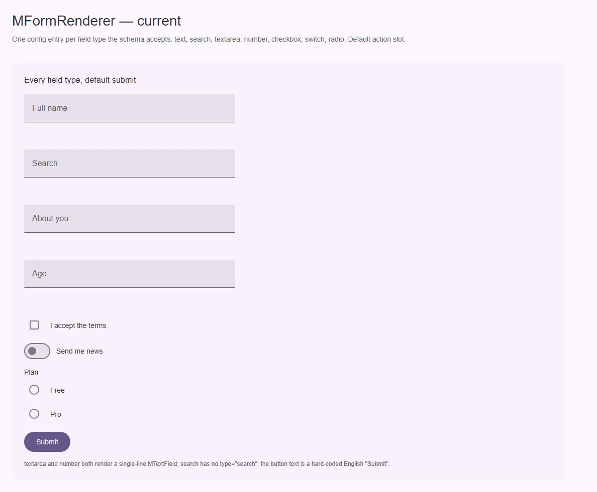
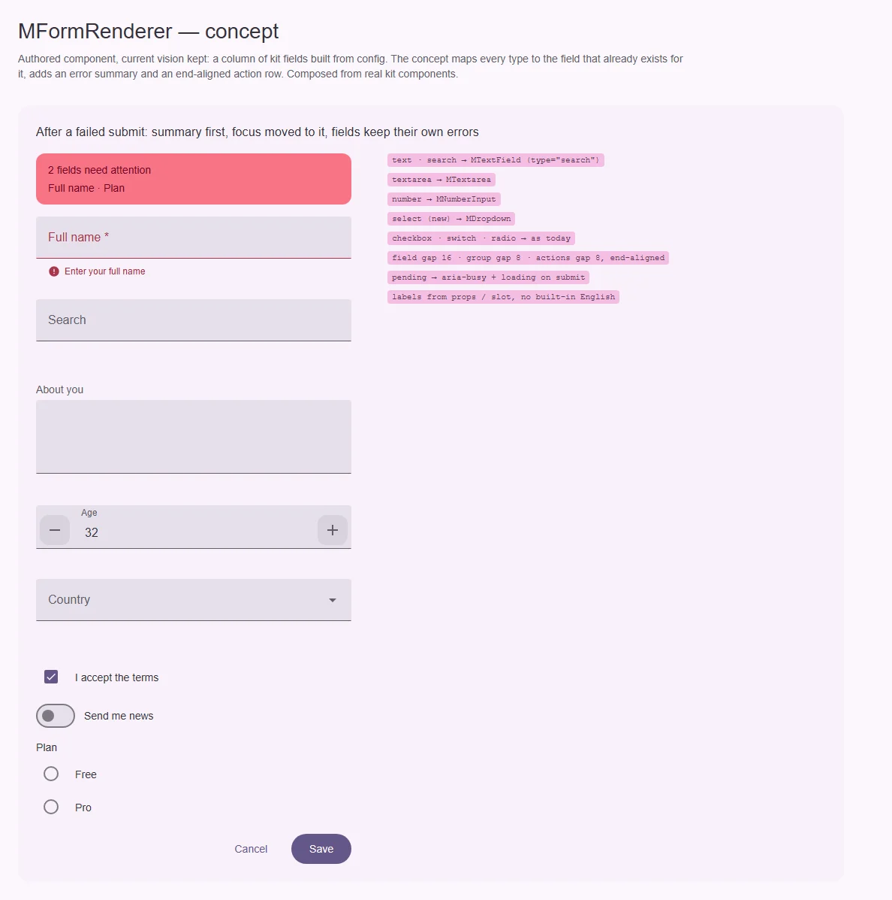

# MFormRenderer — форма из конфигурации

<identity>M3: компонента нет; поля и кнопки — M3 Text fields, Checkbox, Switch, Radio, Buttons · Токены Compose: только через составные компоненты · Код: `src/runtime/components/ui/form-renderer/`, `src/runtime/components/fragments/form-renderer/field/`, `src/runtime/composables/useFormSchema.ts` · Аудит: `data/form-renderer.json` · Тип: public, составной примитив</identity>

<implementation-status state="planned" updated="2026-10-07">Рендерит колонку полей из `FormFieldConfig[]` поверх адаптера валидации. Типы `textarea` и `number` рисуются однострочным `MTextField`. Нет `v-model`, событий, `aria-busy`, сводки ошибок. Подпись кнопки зашита по-английски.</implementation-status>

## Вердикт

`авторский`. Видение остаётся: колонка полей кита из конфигурации, один слот действий,
валидация через подключаемый адаптер (vee-validate-адаптер остаётся по решению владельца).

Компонент не обещает того, что объявляет:
- конфиг знает `textarea`, `number` и `search`, а рендер выдаёт для них одно и то же
  однострочное поле;
- форма молчит о состоянии отправки и об ошибках.

## Рендеры

| Сейчас | Концепт |
|---|---|
|  |  |

Текущий рендер — каждый тип из схемы через настоящий `MFormRenderer`. Концепт собран из
настоящих компонентов кита. На нём:
- каждый тип стоит на своём поле;
- над формой — сводка ошибок после неудачной отправки;
- кнопки выровнены по концу: текстовая «отмена» и залитая «сохранить».

## Анатомия

| # | Часть | В ките | Статус |
|---|---|---|---|
| 1 | Форма | `<form>` + `submit.prevent` | есть |
| 2 | Сводка ошибок | — | нет (FM-11) |
| 3 | Поле по типу | `FormRendererField`: `text`/`search`/`textarea`/`number` → `MTextField`; `checkbox` → `MCheckbox`; `switch` → `MSwitch`; `radio` → `fieldset` + `MRadio` | неверно для `textarea`, `number`, `search` (FM-08) |
| 4 | Ряд действий | `.ui-form-renderer__actions`, слот с `pending`, `isError` | есть; по умолчанию кнопка «Submit» |

## Оси дизайна

| Ось | Значения | Цель | Ломает API |
|---|---|---|---|
| `type` поля | `text \| textarea \| number \| checkbox \| switch \| radio \| search` | Каждый на своём компоненте. Добавить `select` → `MDropdown` (вопрос 2) | нет |
| Ширина колонки | — | Задаёт потребитель | — |
| Выравнивание действий | начало | Конец строки — как у действий диалогов M3 (вопрос 1) | видимое изменение |

Сам компонент осей вида не вводит: вид, плотность и вариант полей передаются через
`field.props`.

## Оси состояний

| Ось | Нужно | Есть | Не хватает |
|---|---|---|---|
| Данные | idle → pending → success / error | `form.pending`, `form.isError` в слот | `aria-busy` на форме, live-регион результата (DT-09) |
| Валидация | Ошибки у полей и сводка после отправки | Ошибки у полей (адаптер) | Сводка со ссылками и перевод фокуса на неё (FM-11) |
| Модель | Значения видны снаружи | Только внутри `useFormSchema` | `v-model`, события `submit`/`invalid` (EN-02) |
| Реактивность конфига | Динамические поля | `config` читается один раз в setup (EN-05) | Пересборка схемы при смене `config` |

## Токены: расхождения

| Часть | Система | Кит сейчас | Действие |
|---|---|---|---|
| Промежуток между полями | 16 | `gap: 16rem` литералом (`index.vue:47`, TK-02) | `spacing(16)` через карту токенов компонента |
| Промежуток в группе радио | 8 | `8rem` (`field/index.vue:82`) | `spacing(8)` |
| Отступ легенды | 4 | `margin-bottom: 4rem` — физическое свойство (LY-10) | `margin-block-end: spacing(4)` |

Своей карты токенов у компонента нет. Нужна `components/form-renderer/_index.scss` с `gap`,
`group.gap`, `legend.gap`, `actions.gap`.

## Поведение и доступность

- **DT-09, P1.** На время отправки `aria-busy="true"` на `<form>`, кнопка отправки в `loading`.
  Результат объявляется постоянным `role="status"`; текст даёт потребитель или слот.
- **FM-11.** После неудачной отправки — сводка над формой (`role="alert"`, `tabindex="-1"`,
  фокус на неё). В ней ссылки на поля: клик ставит фокус в поле. Компонент сводки —
  `MAlert`, его вид определяет план [alert](../feedback/alert.md).
- **FM-08.** Каждый тип — на своём компоненте:
  - `textarea` → `MTextarea`;
  - `number` → `MNumberInput`;
  - `search` → `MTextField type="search"`.
- **CT-13.** Подпись кнопки по умолчанию не зашивается. Как поставлять английские строки по
  умолчанию — общий вопрос Q13. До ответа — проп `submitLabel`, а при его отсутствии в dev
  выводится предупреждение.

## API

| Что | Изменение | Ломает |
|---|---|---|
| `v-model` | `Record<string, unknown>` значений формы | нет |
| emits | `submit(values)`, `invalid(errors)` | нет |
| `submitLabel?: string` | Подпись кнопки по умолчанию | видимое: без пропа надписи «Submit» нет |
| `FormFieldType` | + `select` (с `items`) | нет |
| `config` | Реактивный: смена пересобирает схему | нет |

## План работ

1. **S — поля по типам** (FM-08). Спека: каждый тип даёт свой компонент и нужный нативный `type`.
2. **M — модель и события** (EN-02, EN-05). `useFormSchema` принимает геттер конфигурации.
3. **S — `aria-busy`, `loading`, `role="status"`** (DT-09).
4. **M — сводка ошибок** (FM-11). Использует `MAlert` и общий реестр полей адаптера, нового
   реестра не заводит.
5. **S — карта токенов и логические свойства** (TK-02, LY-04, LY-10).
6. **S — `submitLabel`** (CT-13), после ответа на Q13.
7. **M — документация и тесты** (DC-01, DC-04, TS-07).

## Тесты

- Unit:
  - соответствие «тип → компонент»;
  - `v-model` в обе стороны;
  - `submit` и `invalid`;
  - `aria-busy` во время отправки;
  - сводка получает фокус и ведёт к полю;
  - смена `config` добавляет поле.
- e2e: отправка пустой формы → фокус на сводке → Tab по ссылкам → Enter ставит фокус в поле;
  axe в состояниях покоя, ошибки и отправки.

## Готово, когда

- Тип в конфигурации равен компоненту на экране.
- Отправка и её результат объявляются скринридеру.
- Значения формы доступны через `v-model`.
- Литералов в стилях нет.

## Предложения по UX

Расширения сверх паритета с M3. Это предложения владельцу, а не шаги плана: в «План работ» попадают только после решения. Без Expressive-анимаций и без новых зависимостей.

| Предложение | Что получает пользователь | Заказчик | Цена | Рекомендация |
|---|---|---|---|---|
| Предупреждение об уходе со страницы с несохранёнными изменениями (`dirty` + `beforeunload` и навигация Nuxt) | Пользователь не теряет заполненную форму случайным переходом | длинные формы настроек | S · опция `confirmLeave` | да |
| Условные поля: `visibleWhen(values)` в конфигурации | Форма показывает только относящиеся к ответу поля | анкеты, онбординг | M · реактивный конфиг (шаг 2) уже нужен | обсудить |
| Секции и шаги: группировка полей в `fieldset` с заголовком и пошаговый режим | Длинная форма воспринимается кусками | онбординг | M · пересекается с отложенным stepper (`pendind-components/stepper`) | отложить до stepper |
| Черновик формы в `sessionStorage` | Перезагрузка вкладки не стирает ввод | длинные формы | S · опция `draftKey` | обсудить: чувствительные данные нельзя хранить по умолчанию |

## Открытые вопросы

**1. Куда выравнивать ряд действий по умолчанию?**
1. По концу строки, как действия диалогов и карточек M3. Привычнее для M3, но меняет вид у
   текущих потребителей.
2. По началу, как сейчас. Ничего не меняется, но действия формы стоят не так, как в остальном
   ките.

Рекомендация: 1.

**2. Добавлять ли тип `select` (→ `MDropdown`)?**
1. Да: выбор из списка встречается в формах чаще, чем радио, и компонент уже есть.
2. Нет: сложные поля собираются руками через слот.

Рекомендация: 1.
