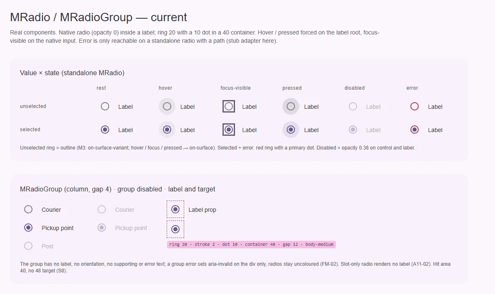
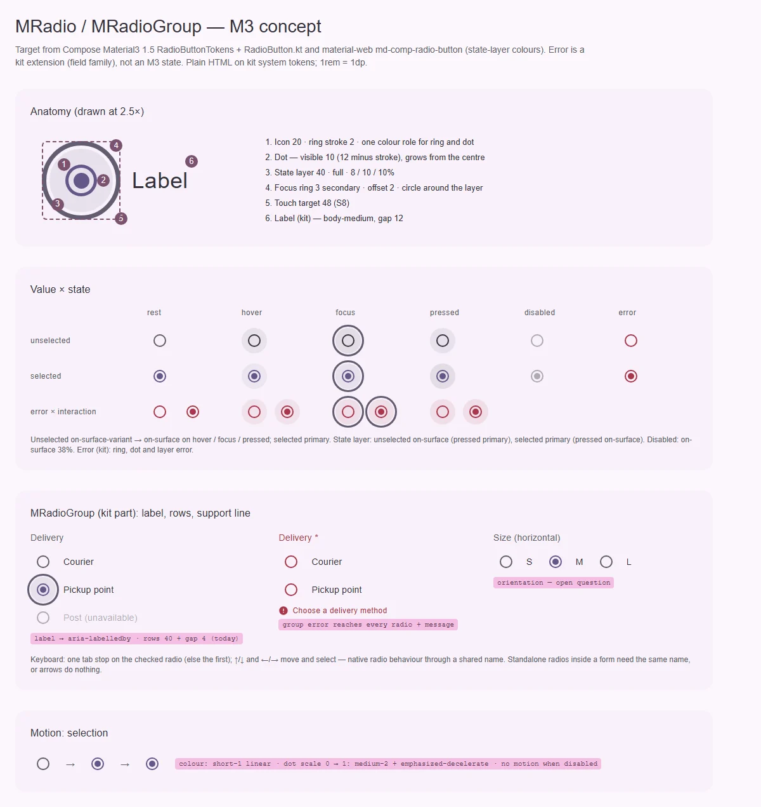

# MRadio / MRadioGroup — один выбор из нескольких вариантов

<identity>M3: Radio button · Токены Compose: `RadioButtonTokens`, `StateTokens`; поведение — `RadioButton.kt`; цвета слоя состояний — material-web `tokens/versions/v0_192/_md-comp-radio-button.scss`, геометрия фокуса — `m3-reference/radio/internal/_radio.scss` · Код: `src/runtime/components/ui/radio/` (+ `group/`), `src/runtime/composables/radio/useRadioGroup.ts` · Аудит: `data/radio.json` · Тип: public (`MRadio`) + public родитель (`MRadioGroup`)</identity>

<implementation-status state="planned" updated="2026-10-07">Исследование и рендеры готовы, код не менялся. Фаза C дала кольцо фокуса, `can-hover`, forced colors и раздачу `$attrs` на инпут. Кольцо при этом получилось квадратным. У группы нет подписи и видимой ошибки, у одиночных радио в форме нет общего `name`. Ждут РВ-1…РВ-4.</implementation-status>

## Вердикт

**дрейф.** Сама кнопка совпадает с M3 по геометрии: кольцо 20, штрих 2, точка 10, слой 40. Но
роли разошлись: кольцо невыбранной `outline` вместо `on-surface-variant` и не темнеет на hover.
Disabled гасит всё `opacity`, а кольцо фокуса квадратное вокруг круглого контрола. Группа — часть
кита, в M3 отдельного компонента нет; это обёртка `role="radiogroup"`. У неё нет имени, ошибка
группы не доходит до радио, а текст ошибки не выводится нигде. Всё чинится без ломки API.

## Рендеры

| Сейчас | Концепт M3 |
|---|---|
|  |  |

Кадры концепта:

1. Анатомия в 2.5×: кольцо, точка, слой 40, круглое кольцо фокуса, цель 48, подпись.
2. Матрица «значение × состояние» (unselected, selected × rest, hover, focus, pressed, disabled,
   error) и строка «ошибка × взаимодействие».
3. Группа (часть кита): подпись, строки, disabled-вариант; ошибка группы на всех радио с
   текстом; горизонтальная раскладка как открытый вопрос.
4. Движение: точка вырастает из центра.

## Анатомия

| № | Часть M3 | Элемент кита | Статус |
|---|---|---|---|
| 1 | Icon 20: кольцо, штрих 2 | `.ui-radio__outer` (`index.vue:23`, `:211-220`) | есть |
| 2 | Точка: видимая 10 (12 минус штрих) | `.ui-radio__inner` 10 (`index.vue:24`, `_index.scss:23`) | есть; у ошибки остаётся `primary` (ST-03) |
| 3 | State layer 40, круг | `.ui-radio__state-layer` (`index.vue:26`) | есть; в покое сжат до 0.6 (`index.vue:181`) — не M3 |
| 4 | Focus indicator — круг вокруг слоя | `@include focus-ring` на `.ui-radio__control` 20 без скругления (`index.vue:151-153`) | иначе: кольцо **квадратное** (видно на рендере) |
| 5 | Touch target 48 | нет; цель = контейнер 40 + подпись | нет (S8) |
| 6 | Подпись | `.ui-radio__label` (`index.vue:29-36`) | расширение кита. Слот без пропа `label` не рендерится (A11-02) |
| G1 | Подпись группы | нет | нет (FM-07) — РВ-1 |
| G2 | Строки | `div.ui-radio-group` column, `gap: 4rem` литералом (`group/index.vue:77`) | есть; ритм — РВ-4 |
| G3 | Строка поддержки / ошибки | нет; ошибка — только `aria-invalid` на `div` (`group/index.vue:5`) | нет (FM-02) — РВ-2 |

## Оси дизайна

| Ось | M3 | Кит сейчас | Цель | Ломает API |
|---|---|---|---|---|
| Значение | unselected · selected | `value` + модель (`string \| number`) | без изменений | нет |
| Ошибка | нет в M3 | у standalone с `path` — рамка `error` | расширение кита остаётся: кольцо, точка и слой `error`; у группы — на всех радио (РВ-2) | нет |
| Раскладка группы | нет в M3 | только колонка | РВ-3 | нет |
| Подпись группы | нет в M3 | нет | РВ-1 | нет |

## Оси состояний

| Ось | Нужно (M3 + чеклист) | Есть | Не хватает |
|---|---|---|---|
| Базовое | enabled, disabled (свой и групповой), read-only, soft-disabled | enabled, disabled | read-only — см. `checkbox.md` ЧВ-4 (то же решение); soft-disabled — `button/index.md` В-6 |
| Взаимодействие | rest, hover, pressed; кольцо невыбранной темнеет до `on-surface` | слой | смена цвета кольца; инверсия цвета pressed-слоя |
| Фокус | круглое кольцо + слой 10 % | квадратное кольцо | форма кольца, слой |
| Выбор | unselected, selected | есть | — |
| Смысловое | (кит) ошибка | у standalone — только кольцо | точка и слой; группа → все радио |
| Валидация | invalid, required | `aria-invalid` на инпуте или группе | `required`, текст ошибки, `aria-describedby` |

## Токены: расхождения

| Часть | M3 (Compose / material-web) | Кит сейчас (`_index.scss` / `index.vue`) | Действие |
|---|---|---|---|
| Кольцо unselected | `on-surface-variant`; hover, focus, pressed — `on-surface` | `outline` (`_index.scss:19`), в состояниях не меняется | роли по состоянию |
| Selected | `primary` у кольца и точки | `primary` (`_index.scss:24`, `:27`) | совпадает |
| Слой: цвет | unselected: hover и focus `on-surface`, pressed `primary`; selected: hover и focus `primary`, pressed `on-surface` | `on-surface` / `primary` / `error`, pressed того же цвета, что hover (`index.vue:183`, `:192-198`) | инверсия на pressed |
| Слой: непрозрачность | 8 / 10 / 10 (S1) | 8 / — / 12 (`_index.scss:32-33`) | focus 10; pressed по СВ-1 |
| Слой: покой | только непрозрачность | `scale(0.6)` → 1 на hover (`index.vue:181`, `:203`) | убрать масштаб (TK-07) |
| Disabled | кольцо и точка `on-surface` 38 % | `opacity: 0.38` на всё (`_index.scss:41`, `index.vue:247-254`) | роли (ST-06); подпись `on-surface` 38 % |
| Ошибка (кит) | — | кольцо `error`, точка `primary` (`index.vue:256-258`, `_index.scss:24`) | точка и слой `error` |
| Кольцо фокуса | круг вокруг слоя (material-web 44 × 44, Compose `CircleShape` на 40) | квадрат на контроле 20 | на контейнере 40 со скруглением `full` |
| Цель | 48 | 40 | S8 |
| Зазор группы | — | `4rem` литералом в SFC (`group/index.vue:77`) | токен группы (LY-04); значение — РВ-4 |
| Движение | точка — `FastSpatial`; цвет — `DefaultEffects`; disabled без анимации | `short-3` + `standard` (`index.vue:217-230`) | Пружины отклонены владельцем 2026-10-07 (S4): точка — `medium-2` + `emphasized-decelerate` (material-web, 300 мс), цвет — `short-1` + `linear`, у disabled без анимации |
| Подпись | — | body-medium (`_index.scss:44`), `padding-top: 1rem` (`index.vue:234`) | body-medium остаётся; сдвиг убрать (LY-03) |

Совпадает: кольцо 20, штрих 2, точка 10, слой 40, `primary` у выбранной, forced colors.

## Поведение и доступность

- **Нативный радио остаётся.** Стрелки, одна остановка Tab на выбранном и выбор стрелкой даёт
  браузер — через общий `name`. Инпут растягивается до 48 × 48 по центру контрола (S8).
- **`name` у одиночных радио (A11-08).** Вне группы `name` берётся только из пропа
  (`index.vue:87-91`); `form-renderer` передаёт `path`, но не `name`, поэтому каждая радиокнопка —
  отдельная остановка Tab, и стрелки не работают. Исправление: `name ?? path`, как у флажка
  (`:name="path"`). Глубже: `form-renderer` привязывает N полей `useField` к одному `path` — это
  задача [form-renderer.md](form-renderer.md) (перейти на `MRadioGroup` с `path`), не этого плана.
- **Регистрация в группе.** Тикет получает `value: props.value` один раз (`index.vue:68`): смена
  `value` у смонтированной радио не доходит до группы. Передавать геттер.
- **Ошибка группы (FM-02).** Контекст `RadioGroupContext` отдаёт `invalid`: все радио рисуются как
  ошибочные. Текст и глиф — в строке поддержки группы, связанной `aria-describedby` с
  `role=radiogroup`. Ошибка не только цветом.
- **Имя группы (FM-07).** Подпись группы → `aria-labelledby` (РВ-1). Без имени — dev-предупреждение.
- **Обязательность (FM-10).** `aria-required` на `role=radiogroup` (для этой роли атрибут
  допустим) и маркер `*` в подписи.
- **`aria-checked`** на нативном радио убирается (A11-06).
- **Подпись** рендерится при пропе или слоте (A11-02); перенос, `min-width: 0` (CT-03, CT-04).
- **Reduced motion** — закрыто системно (A11-18).

Открытые пункты аудита → шаги: A11-02, A11-06, A11-08 → шаг 1; ST-03 (точка), ST-06, TK-06 → шаг 2;
ST-03 (форма кольца) → шаг 3; CT-03, CT-04, LY-03, TK-07, RS-12 → шаг 3; FM-02, FM-07, FM-10, EN-03,
TH-05 → шаги 4–5; LY-04 → шаг 4; IN-09 → `checkbox.md` ЧВ-4; IN-08 → `button/index.md` В-6.
Закрыто фазами A–D: IN-01, IN-03, IN-04 (кольцо есть, форма — шаг 3), TH-04, EN-04. Закрыто
правилом: LY-06, TK-04 (`z-index` внутри `isolation: isolate`), A11-18. RS-04, RS-05 — принятое
отклонение. DC-* — документация в `docs`.

## API

Добавить (без ломки):

| Компонент | Что | Тип | Дефолт | Зачем |
|---|---|---|---|---|
| `MRadioGroup` | `label` + слот `#label` | `string` | `undefined` | имя группы (РВ-1) |
| `MRadioGroup` | `required` | `boolean` | `false` | FM-10 |
| `MRadioGroup` | слот `#support` | — | — | своя строка поддержки (РВ-2) |
| `RadioGroupContext` | `invalid` | `ComputedRef<boolean>` | — | ошибка группы на всех радио (внутренний контракт) |

Исправить: `name ?? path` у одиночной радио; убрать `aria-checked`; слот подписи без пропа;
реактивный `value` в тикете.

Ломающих изменений нет.

## План работ

1. **S** — Исправления без видимых изменений: `name ?? path`, слот подписи, убрать `aria-checked`,
   геттер `value` в регистрации. Файлы: `radio/index.vue`, `radio/index.spec.ts`.
2. **M** — Карта токенов: роли кольца по состоянию, инверсия слоя на pressed, focus-слой 10 %,
   disabled по ролям, точка и слой `error`. Точечные пути `g()`. Зависит от СВ-1. Файлы:
   `assets/stylesheet/components/radio/_index.scss`, `radio/index.vue`.
3. **S** — Круглое кольцо фокуса на контейнере 40, цель 48, подпись (перенос, без `padding-top`),
   слой без масштаба. Общий Sass-миксин контрола выбора с флажком ([checkbox.md](checkbox.md),
   шаги 3–6). Файлы: `radio/index.vue`, `abstracts/_mixins.scss` (новый миксин).
4. **M** — Группа: токены (`assets/stylesheet/components/radio/_index.scss`, ветка `group`), подпись
   по РВ-1, ритм строк по РВ-4, `aria-labelledby`, `required` + `aria-required`. Файлы:
   `radio/group/*`, `composables/radio/useRadioGroup.ts`.
5. **M** — Ошибка группы: `invalid` в контексте, строка поддержки по РВ-2 (значения — из полей
   кита: body-small, min-h 18, глиф 16 + 6), `aria-describedby`. Файлы: `radio/group/*`,
   `radio/index.vue`, `composables/radio/useRadioGroup.ts`.
6. **S** — Движение на токенах `--sys-motion-*` по таблице токенов. Файлы: `radio/index.vue`.
7. **M** — Тесты.

## Тесты

- Фикстуры `playground/fixtures/radio/{matrix,stress}.vue`: значение × состояние × error; группа
  с подписью, disabled-вариантом, ошибкой; длинные подписи; RTL.
- e2e `radio.e2e.ts`: axe (светлая и тёмная × ltr и rtl); стрелки выбирают внутри группы и
  у одиночных радио с одним `path`; одна остановка Tab; цель ≥ 48; кольцо фокуса круглое (computed
  `border-radius` носителя `outline`); ошибка группы окрашивает все радио и связана
  `aria-describedby`; forced colors.
- unit (`index.spec.ts`, `group/index.spec.ts`): `name` из `path` (TS-07); подпись из слота;
  отсутствие `aria-checked`; смена `value` доходит до группы; `invalid` из контекста; `mandatory`
  (TS-07).

## Готово, когда

- [ ] Цвета всех клеток матрицы совпадают с концептом; disabled — по ролям; точка ошибки `error`.
- [ ] Кольцо фокуса круглое и окружает слой.
- [ ] Цель ≥ 48.
- [ ] Группа с подписью получает имя; ошибка группы видна на радио и текстом.
- [ ] Одиночные радио с одним `path` образуют нативную группу.
- [ ] `npm run lint`, `lint:style`, `lint:scss`, `typecheck`, vitest, e2e — зелёные.
- [ ] Видимые изменения перечислены в summary.

## Предложения по UX

Расширения сверх паритета с M3. Это предложения владельцу, а не шаги плана.

| Предложение | Что получает пользователь | Заказчик | Цена | Рекомендация |
|---|---|---|---|---|
| П-1. Описание под подписью варианта: слот `#description`, как у флажка (`checkbox.md`, П-1) | «Курьер — завтра, 300 ₽» читается и озвучивается как часть варианта | Формы доставки и тарифов | S · бандл: ~0 · API: один слот | Да |
| П-2. Режим данных у `MRadioGroup`: `items`, `itemValue`, `itemDisabled`, слот `#item` — как у `MChipGroup` | Варианты из конфигурации без `v-for` у вызова; одна форма API у групп выбора | `form-renderer` (`field.options`), формы из схемы | M · бандл: резолверы выносятся из `chip-group/index.vue` в общий util и переиспользуются · API: три пропа и слот | Да |
| П-3. Снятие выбора у необязательной группы: действие «Очистить» в строке поддержки | Случайно отмеченный необязательный ответ можно отменить — нативная радио этого не умеет | Анкеты с необязательными вопросами | S · бандл: ~0 · API: opt-in проп + текст с фолбэком в `MESSAGES` | Да, только opt-in и только без `required` |

## Открытые вопросы

**РВ-1. Как называть группу.**

1. Проп `label` + слот `#label`: видимая подпись (body-medium `on-surface-variant`, как у
   `MChipGroup`, ГВ-3) → `aria-labelledby` на `role=radiogroup`. Без `label` вид не меняется.
2. `<fieldset>` + `<legend>` вместо `div role=radiogroup`. Нативная группировка, как уже делает
   `form-renderer`. Цена: у `fieldset` свои отступы и рамка по умолчанию, а роль `radiogroup`
   теряется (скринридеры объявят «группа»).

Рекомендация: 1. Один способ давать имя группе у всех семейств выбора.

**РВ-2. Где и как показывается ошибка.**

1. Строка поддержки у группы; резервирует высоту, когда у группы задан `path`, как у флажка
   (`checkbox.md` ЧВ-2, вариант 3). Одиночная радио с `path` показывает только цвет, текст — у
   того, кто их группирует.
2. Строка поддержки появляется только с текстом; раскладка сдвигается.

Рекомендация: 1.

**РВ-3. Горизонтальная группа.**

1. Ось раскладки с именем `direction` (`'vertical' | 'horizontal'`, слово уже есть у
   `MChipGroup`); стрелки работают нативно в обе стороны. Цена: новая ось без названного
   заказчика.
2. Не вводить, пока нет заказчика (`principles.md`, В4). Условие возврата — короткие варианты
   «Да / Нет» в строке формы.

Рекомендация: 2.

**РВ-4. Ритм строк группы при цели 48.**

1. Оставить 40 + зазор 4. Цели 48 соседних строк перекрываются на 4; в зоне перекрытия
   побеждает нижняя радио.
2. Строки по 48 без зазора: цели стыкуются, перекрытия нет. Группа вырастает на 4 на каждую
   строку.

Рекомендация: 2. Это видимая правка части кита, нужно согласие владельца.
