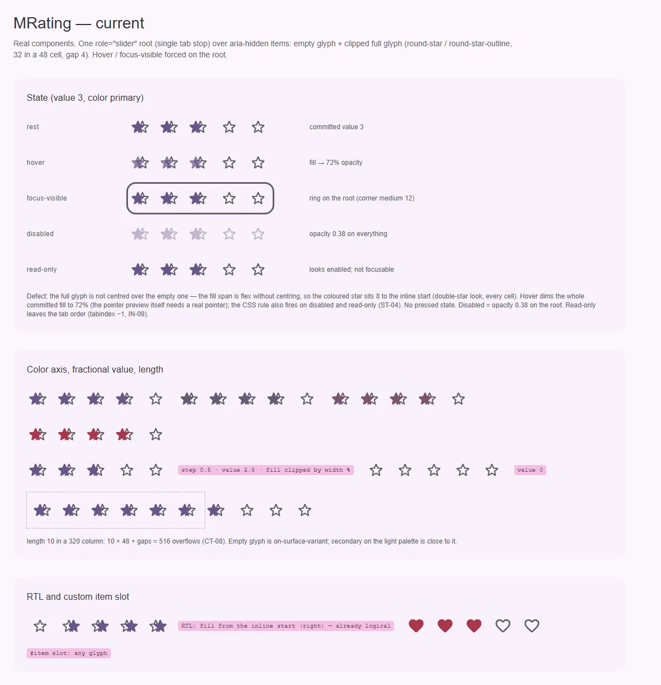
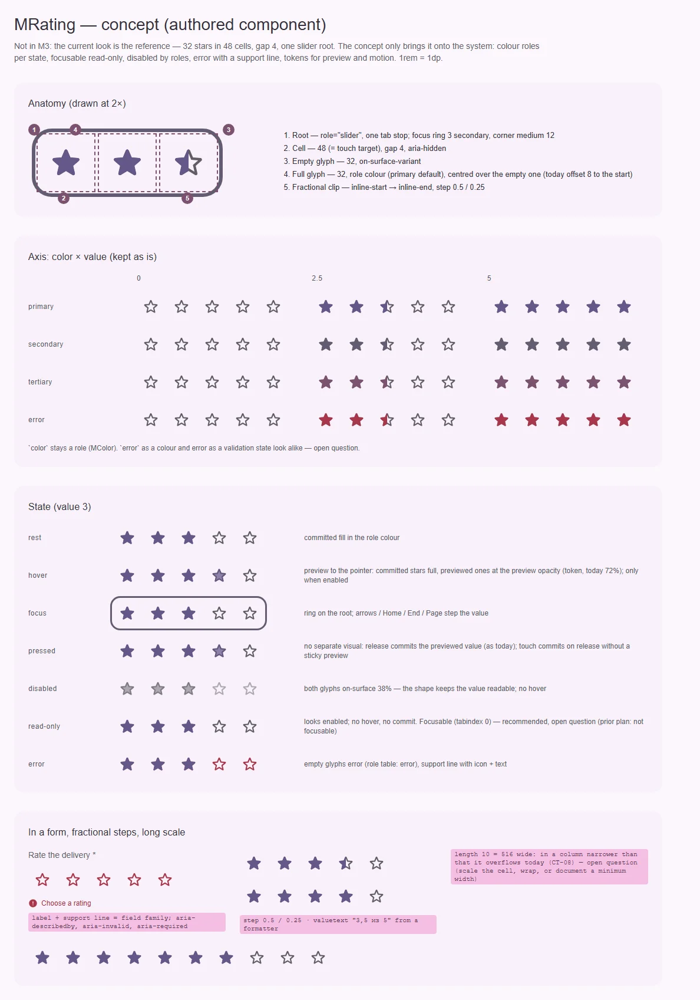

# MRating — оценка: число от 0 до N, нарисованное значками

<identity>M3: нет в M3 (авторский компонент кита; поведение выводится из паттерна slider — APG, `role="slider"`) · Токены Compose: нет; системные — `StateTokens` (непрозрачности), роли цвета, `corner-medium` · Код: `src/runtime/components/ui/rating/`, карта `src/runtime/assets/stylesheet/components/rating/_index.scss`, клавиатура `src/runtime/composables/slider/createRangeKeyboardController.ts` · Аудит: `data/rating.json` · Тип: public (числовой контрол)</identity>

<implementation-status state="planned" updated="2026-10-07">Компонент работает с 2026-07-14: один `role="slider"` с одной Tab-остановкой, общий клавиатурный контроллер с RTL, дробная заливка, превью указателем, `clearable`, слот `#item`, forced colors и reduced motion. План 2026-10-07 доводит его по системе: найден видимый дефект (заливка смещена с контура), disabled по ролям, hover только у живого контрола, без непереводимых строк, тач без блокировки прокрутки. Код не менялся. Ждут РТ-1…РТ-3.</implementation-status>

## Вердикт

**авторский.** В M3 оценки нет; эталон — текущее видение кита, и оно цельное: одна Tab-остановка
вместо N кнопок, дробные шаги через обрезку одного значка, превью при наведении, общий с прочими
range-контролами клавиатурный контроллер. До системы не хватает мелочей и одного дефекта: залитый
значок стоит на 8 левее контура (каждая ячейка выглядит «двойной звездой»). Disabled гасит всё
`opacity`, hover-приглушение срабатывает и на disabled / read-only, по умолчанию звучат английские
«Rating» и «of», а `touch-action: none` блокирует прокрутку. Ломающих изменений API почти нет.

## Рендеры

| Сейчас | Концепт |
|---|---|
|  |  |

Кадры концепта (тот же вид, доведённый по системе):

1. Анатомия в 2×: корень с кольцом фокуса, ячейка 48, пустой значок, залитый значок (по центру
   поверх пустого), дробная обрезка.
2. Ось цвета × значение (0, 2.5, 5) — как есть.
3. Матрица состояний: rest, hover (превью), focus, pressed, disabled (роли), read-only, error.
4. В форме: подпись и строка поддержки (по РТ-2), шаги 0.5 / 0.25, длинная шкала (РТ-3).

## Анатомия

| № | Часть | Элемент кита | Статус |
|---|---|---|---|
| 1 | Корень: `role="slider"`, одна Tab-остановка, кольцо фокуса | `.ui-rating` (`index.vue:2-24`) | есть |
| 2 | Ячейка 48 (= цель нажатия), `aria-hidden` | `.ui-rating__item` (`index.vue:25-30`) | есть |
| 3 | Пустой значок 32, `on-surface-variant` | `MIcon .ui-rating__icon--empty` (`index.vue:40-43`) | есть |
| 4 | Залитый значок 32, роль цвета | `.ui-rating__fill > MIcon` (`index.vue:44-52`) | **дефект**: `fill` — flex без центровки (`index.vue:182-191`), значок стоит у inline-start ячейки, на 8 левее пустого |
| 5 | Дробная обрезка `0…1` | ширина `fill` в % (`index.vue:46`) | есть, логическая (`inset-inline-start`) |
| 6 | Скрытый инпут формы | `input[type=hidden]` по `name` (`index.vue:55-60`) | есть |
| 7 | Подпись и строка поддержки | нет | РТ-2 |

## Оси дизайна

| Ось | Кит сейчас | Цель | Ломает API |
|---|---|---|---|
| `color` | `MColor` (`primary` по умолчанию) | без изменений; пересечение `error` с состоянием ошибки — РТ-2 | нет |
| `length` | 5 | без изменений; длинная шкала — РТ-3 | нет |
| `step` | 1 (0.5, 0.25 — дробная заливка) | без изменений | нет |
| `clearable` | повторный клик по текущему значению → 0 | без изменений | нет |
| Значки | `icon` / `emptyIcon` строками `'round-star'`, `'round-star-outline'` (`props.ts:11-12`); слот `#item` | дефолты — из `ICONS` (`craft.md`: имена иконок в константах) | нет |
| Плотность | ячейка 48, значок 32 | не вводится без заказчика; см. РТ-3 | нет |

## Оси состояний

Из `axes` аудита, сверено с кодом после фаз A–D.

| Ось | Нужно | Есть | Не хватает |
|---|---|---|---|
| Базовое | enabled, disabled, read-only | все три | read-only выпадает из Tab-порядка — РТ-1; disabled через `opacity` (ST-06) |
| Взаимодействие | rest, hover (превью), pressed | rest, hover | hover-приглушение и на disabled / read-only (ST-04); pressed — отдельного вида нет (IN-07, см. «Поведение») |
| Фокус | кольцо | кольцо на корне (`index.vue:160-162`) | — |
| Смысловое | error | `color="error"` как роль | состояние ошибки — РТ-2 |
| Валидация | invalid, required | `name` → скрытый инпут | `path` / `required` — РТ-2 |

## Токены: расхождения с системой

| Часть | Система кита | Сейчас (`_index.scss` / `index.vue`) | Действие |
|---|---|---|---|
| Залитый значок | по центру ячейки, поверх пустого | у inline-start (`index.vue:182-191`) | центровать: значок внутри `fill` получает тот же отступ, что у пустого (`(item.size − item.icon-size) / 2`), обрезка не меняется. Видимое изменение |
| Disabled | роль на пониженной непрозрачности: оба значка `on-surface` 38 % (`color-and-state.md`) | `opacity` 0.38 на корень (`index.vue:164-166`, `_index.scss:8`) | `item.disabled.{empty,full}` |
| Hover-превью | только у живого контрола; `:hover` внутри `can-hover` | `can-hover` есть, но без `:not(--disabled, --readonly)` (`index.vue:197-201`) | ограничить |
| Непрозрачность превью | токен | `preview-opacity: 72%` (`_index.scss:18`) — не из шкалы `$theme-state-link` | оставить токеном компонента: это авторское значение, не слой состояния |
| Ошибка | `error` по таблице ролей | нет | `item.error.empty` по РТ-2 |
| Значки по умолчанию | `ICONS.*` | литералы в `props.ts:11-12` | константы `ICONS.starRound` / `starRoundOutline` (имена — при реализации) |
| Размеры | токены | 48 / 32 / gap 4 в карте | уже токены; LY-04 / TK-02 («сырые числа») закрываются как есть |

## Поведение и доступность

Подтверждено прежним планом и остаётся:

- **Один фокусируемый контрол.** Корень — `role="slider"`, значки `aria-hidden`; без кнопки на каждый
  значок и без N Tab-остановок. Модель — конечное число, нормализуется к `step` и зажимается в
  `0…length`; обновляется только через `defineModel`. Второй `v-model:focused` сохраняется.
- **Клавиатура — локальная.** Только `@keydown` на корне; глобальный `useHotkey` не используется (он
  для оконных сочетаний и не должен перехватывать стрелки). Математика — общий
  `createRangeKeyboardController`: → / ↑ — плюс шаг, ← / ↓ — минус шаг, RTL меняет только
  горизонтальные; Home → 0, End → `length`; PageUp / PageDown — шаг × 10 с зажимом; обработанные
  клавиши `preventDefault`. Enter и Space не нужны. Read-only и disabled значение не меняют. Этот
  контроллер — второй клавиатурный контроллер кита рядом с `useSliderControl`; дублирование
  сознательное (`decisions.md`), третий не заводим.
- **Указатель.** Hover считает превью по X, шагу и RTL без записи в модель; уход указателя
  возвращает зафиксированное значение; `pointerup` фиксирует превью; тач фиксирует сразу, без
  «залипшего» превью. Disabled и read-only не показывают превью и не фиксируют.
- **Сброс.** Ноль — законное значение. `clearable: false` по умолчанию; с `clearable` повторная
  фиксация ровно текущего значения указателем даёт 0. Клавиатура (← и Home) работает как обычный
  range.
- **События.** `change` — на зафиксированное изменение (указатель, клавиатура), не на hover;
  `preview` — значение превью или `null`.
- **Дробная заливка.** Пустой слой и залитый слой с обрезкой `0…1`, поэтому шаги 1, 0.5, 0.25 без
  отдельного «половинного» значка. Слот `#item` получает `{ index, value, fill, active, preview,
  disabled }` и может нарисовать `MIcon`, `MShape` или SVG; взаимодействие остаётся у корня.

Меняется по аудиту:

- **Pressed (IN-07).** Отдельного вида нет и не вводится: нажатие фиксирует превью, обратная связь —
  сама заливка. Пункт закрыт решением, а не работой.
- **Read-only в Tab-порядке (IN-09)** — РТ-1.
- **Имя и значение (CT-13, FM-01).** Дефолт `ariaLabel: 'Rating'` (`props.ts:15`) и
  `aria-valuetext` «N of M» (`index.vue:14`) — английские строки, которые кит не может перевести
  (`craft.md` §6). Дефолт убрать, без имени — dev-предупреждение; `aria-valuetext` — только из
  форматтера `valueText`, без него атрибута нет (скринридер читает `aria-valuenow`).
- **Тач (RS-07).** `touch-action: none` (`index.vue:158`) блокирует прокрутку, хотя перетаскивания
  на таче нет: `manipulation`.
- **Forced colors** — сделано фазой C (`index.vue:209-216`).
- **Reduced motion** — уже есть (`index.vue:203-205`).

Открытые пункты аудита → шаги: ST-04, ST-06 → шаг 2; CT-13, FM-01 (имя) → шаг 1; RS-07, EN-01 →
шаг 1; IN-09, ST-01 (read-only) → РТ-1; FM-02, FM-10, ST-01 (error) → РТ-2; CT-08 → РТ-3; IN-07 —
закрыт решением. Закрыто фазами A–D: IN-01, TH-04. RS-04, RS-05 — принятое отклонение. DC-01…DC-05
— документации нет совсем (`docs`), её создание — отдельная задача. TS-* → «Тесты».

## API

| Что | Было | Станет | Ломает |
|---|---|---|---|
| `loading` | из `makeStateProps`, не работает (EN-01) | убрать | да: удалить атрибут у вызова; в ките не передаёт никто |
| `ariaLabel` | `'Rating'` | без дефолта, dev-предупреждение | поведение: без имени больше нет английского «Rating» |
| `valueText` | — | `(value: number, length: number) => string` | нет |
| `icon` / `emptyIcon` | литералы | дефолты из `ICONS` (тот же глиф) | нет |
| `path`, `required`, подпись | — | по РТ-2 | нет |

Остаётся: `length`, `step`, `clearable`, `readonly`, `disabled`, `color`, `name`, `v-model`,
`v-model:focused`, события `change` / `preview`, слот `#item` с прежним scope. Отдельного `max` нет:
`length` — и число значков, и максимум.

## План работ

1. **S** — Без видимых изменений: убрать `loading`, дефолт `ariaLabel` и английский
   `aria-valuetext` (+ `valueText`, dev-предупреждение), `touch-action: manipulation`, значки из
   `ICONS`. Файлы: `rating/index.vue`, `rating/props.ts`, `shared/constants/icons.ts`.
2. **S** — Система вида: центровка залитого значка (видимое исправление дефекта), disabled ролями,
   hover-превью только у живого контрола. Файлы: `rating/index.vue`,
   `assets/stylesheet/components/rating/_index.scss`.
3. **S** — Read-only по РТ-1. Файлы: `rating/index.vue`, `rating/index.spec.ts` (тест «renders
   fractional clipping and readonly aggregate semantics» закрепляет `tabindex -1`).
4. **M** — Поле формы по РТ-2. Файлы: `rating/*`.
5. **S** — Длинная шкала по РТ-3.
6. **M** — Тесты.

## Тесты

- Фикстуры `playground/fixtures/rating/{matrix,stress}.vue`: цвет × значение; состояние; шаги 1 /
  0.5 / 0.25; RTL; слот `#item`; стресс — `length` 10 и 20 в колонке 320.
- e2e `rating.e2e.ts`: axe; залитый значок концентричен пустому (`getBoundingClientRect` центров);
  клавиатура в RTL; тач-фиксация без превью и прокрутка страницы свайпом; hover на disabled /
  read-only не меняет вид; forced colors.
- unit (`index.spec.ts`, TS-07): фиксация указателем и `clearable`; disabled не фиксирует; RTL;
  Home / End / Page; `valueText` → `aria-valuetext`, без него атрибута нет; read-only по РТ-1.

## Готово, когда

- [ ] Залитый значок стоит точно поверх пустого во всех ячейках и при дробных значениях.
- [ ] Disabled нарисован ролями; hover не трогает disabled и read-only.
- [ ] Нет английских строк по умолчанию; без имени — dev-предупреждение.
- [ ] Свайп по оценке прокручивает страницу на таче.
- [ ] Read-only и форма — по решениям РТ-1, РТ-2.
- [ ] `npm run lint`, `lint:style`, `lint:scss`, `typecheck`, vitest, e2e — зелёные.
- [ ] Видимые изменения (центровка, disabled) перечислены в summary.

## Предложения по UX

1. **Подписи уровней.** `labels: string[]` длины `length` («Плохо» … «Отлично»): подпись текущего
   или превью-значения рядом со шкалой и в `aria-valuetext`. Пользователь понимает, что значит «3»,
   до клика. Заказчик: формы отзывов. Цена: S, один проп, строка рядом; тексты даёт потребитель.
   Рекомендация: брать — закрывает и озвучку значения без отдельного форматтера.
2. **Агрегат только для чтения со счётчиком.** Пресет read-only: «4,6 ★ (1 284)» — среднее и число
   оценок рядом с компактной шкалой. Заказчик: карточки товаров. Цена: S как документированная
   композиция (`MRating readonly :step="0.1"` + текст), без нового API. Рекомендация: пример в доках.
3. **Сброс с клавиатуры.** Delete / Backspace → 0 при `clearable` (сегодня сбросить можно только
   повторным кликом). Заказчик: формы с необязательной оценкой. Цена: S, одна клавиша в обработчике
   компонента (не в общем контроллере). Рекомендация: брать вместе с шагом 1.

## Открытые вопросы

**РТ-1. Попадает ли read-only в Tab-порядок.**

Прежний план решил «read-only не фокусируется, получает агрегированное описание», тест это
закрепляет. Аудит (IN-09) и `useSliderControl` (read-only фокусируется, `aria-readonly`) — против.

1. `tabindex="0"` при read-only, `-1` только при disabled. Пользователь клавиатуры и скринридера
   может «прочитать» значение фокусом; совпадает с ползунком кита. Цена: лишняя Tab-остановка в
   списке карточек с рейтингами.
2. Оставить `-1` (прежнее решение). Значение доступно в потоке чтения через описание, Tab-порядок
   короче. Цена: расходится с ползунком и с `aria-readonly`, который подразумевает фокус.
3. Для агрегата использовать не `role="slider"`, а `role="img"` с `aria-label` «4,5 из 5»
   (read-only = картинка, а не контрол). Цена: две семантики у одного компонента.

Рекомендация: 1. Витрина с агрегатом — отдельная композиция (предложение 2 в «Предложениях по UX»).

**РТ-2. Становится ли оценка полем формы.**

1. `path` + `useField` + подпись и строка поддержки как у полей; ошибка — пустые значки `error`
   (таблица ролей) плюс текст и глиф; `required` — `aria-required` и маркер. `color="error"` как
   роль остаётся, но в доках помечается «не путать с ошибкой».
2. Только строка поддержки и `aria-invalid`, значки цвета не меняют.
3. Не делать: оценка — значение, валидацию держит форма вокруг; `name` достаточно.

Рекомендация: 1 — вместе с решением о строке поддержки у флажка (ЧВ-2,
[checkbox.md](checkbox.md)).

**РТ-3. Что делать с длинной шкалой (CT-08).**

`length` 10 занимает 516 и не помещается в колонку 320.

1. Документировать минимальную ширину и оставить как есть. Цена: переполнение в узких колонках.
2. Ячейка сжимается до `min(48, 100% / length)`, значок — пропорционально. Цена: цель нажатия
   падает ниже 48 (S8), а ниже 24 — нарушение WCAG 2.5.8.
3. `density` (`compact` — ячейка 40, значок 24) как явный выбор потребителя. Цена: новая ось у
   компонента без заказчика.

Рекомендация: 1; 3 — при первом заказчике.
