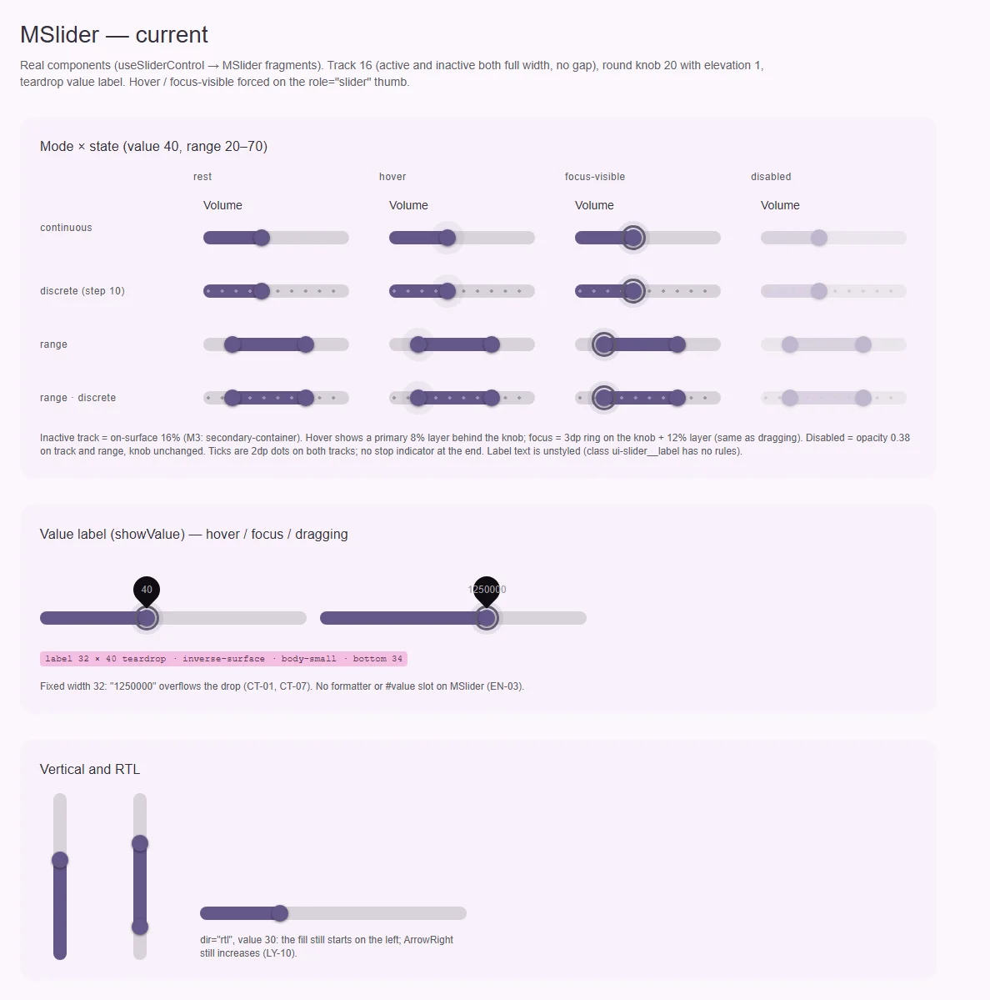
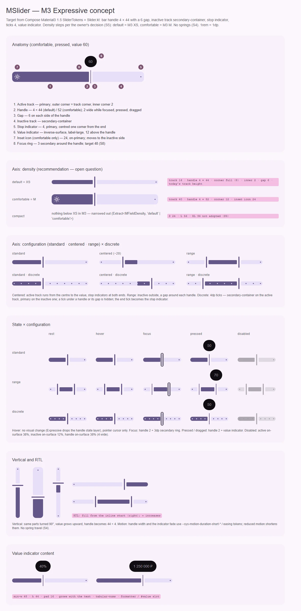

# MSlider — ползунок: выбор значения или диапазона на шкале

<identity>M3: Sliders (Expressive: ручка-полоска, зазор, stop indicator, centered, inset icon, размеры) · Токены Compose: `SliderTokens`, `StateTokens`; поведение и раскладка — `Slider.kt` (`Slider`, `RangeSlider`, `VerticalSlider`, `SliderDefaults.{Track, CenteredTrack, Thumb, drawStopIndicator}`, `drawTrack`); baseline-цвета для сравнения — material-web `tokens/versions/v0_192/_md-comp-slider.scss`, `m3-reference/docs/components/slider.md` · Код: `src/runtime/components/ui/slider/`, фрагменты `src/runtime/components/fragments/slider/{root,track,range,thumb,hidden-input}/`, поведение `src/runtime/composables/slider/{createSlider,useSliderControl}.ts`, карты `src/runtime/assets/stylesheet/components/slider/{root,track,range,thumb}/_index.scss` · Аудит: `data/slider.json` · Тип: public (+ публичный control-композабл)</identity>

<implementation-status state="planned" updated="2026-10-07">Исследование и рендеры готовы, код не менялся. Поведенческий слой (`createSlider` → `useSliderControl` → `MSlider`) — эталон кита и сохраняется; двойной emit, `can-hover`, кольцо фокуса, forced colors и тень через `elevation()` закрыты фазами A–D. Презентация — гибрид baseline-2022 (круглая ручка 20 с тенью, капля значения) и Expressive (трек 16). Ждут СЛ-1…СЛ-4.</implementation-status>

## Вердикт

**переработка.** Поведение — сильная сторона: бэги атрибутов, клавиатура, drag с кэшем геометрии,
SSR. Но анатомия M3 Expressive отсутствует: вместо ручки-полоски 4 × 44 с зазором 6 — круглая ручка
20 с тенью, активный и неактивный трек лежат друг на друге без зазора, неактивный трек
`on-surface` 16 % вместо `secondary-container`, нет stop indicator, centered-режима, inset-иконки и
ступеней размера; значение показывается каплей baseline-образца. RTL не поддержан (физический
`left`, `ArrowRight` всегда «больше»). Ломающих изменений публичных пропов почти нет — ломается вид
и мелкие обещания бэгов (см. API).

## Рендеры

| Сейчас | Концепт M3 |
|---|---|
|  |  |

Кадры концепта:

1. Анатомия (comfortable, pressed, значение 60): активный трек, ручка, зазор, неактивный трек, stop
   indicator, value indicator, inset-иконка, кольцо фокуса.
2. Ось плотности по рекомендации СЛ-1: `default` = M3 XS, `comfortable` = M3 M, `compact` сужен.
3. Ось конфигурации: standard · centered · range × непрерывный / дискретный.
4. Матрица «состояние × конфигурация»: rest, hover, focus, pressed, disabled.
5. Вертикальный и RTL.
6. Содержимое value indicator: «40%», «1 250 000 ₽» — капсула растёт с текстом.

## Анатомия

| № | Часть M3 | Элемент кита | Статус |
|---|---|---|---|
| 1 | Active track, внешний угол = угол трека, внутренний 2 | `.ui-slider-range` (`fragments/slider/range/index.vue`) | иначе: лежит поверх неактивного, внутреннего угла и зазора нет |
| 2 | Handle 4 × 44, `corner-full`; 2 при фокусе, нажатии, перетаскивании | `.ui-slider-thumb__knob` 20 × 20 + `elevation(1)` (`thumb/_index.scss:5-9`) | иначе |
| 3 | Gap 6 с обеих сторон ручки (`ActiveHandleLeadingSpace` / `TrailingSpace`) | — | нет |
| 4 | Inactive track, `secondary-container` | `.ui-slider-track::before` во всю ширину, `on-surface` 16 % (`track/_index.scss:10`) | иначе |
| 5 | Stop indicator 4 на конце неактивного трека (центр — один угол трека от края) | — | нет |
| 6 | Tick marks 4: `secondary-container` на активном, `primary` на неактивном | точки 2 через `radial-gradient` (`track/index.vue:131`, `range/index.vue:120`) | иначе: размер и роли |
| 7 | Value indicator: `inverse-surface`, `label-large`, 12 над ручкой | `.ui-slider-thumb__value-label` — капля 32 × 40, `body-small` (`thumb/index.vue:146-180`) | иначе |
| 8 | Inset icon (M и крупнее) | — | нет |
| 9 | Focus ring вокруг ручки | `@include focus-ring` на ручке (`thumb/index.vue:136-138`) | есть |
| 10 | Цель 48 | ручка-хитбокс 48 × 48 (`thumb/index.vue:70-71`), контейнер 48 (`slider/index.vue:123`) | есть, литералами |
| 11 | Подпись (кит) | `<label class="ui-slider__label">` (`slider/index.vue:10-15`) | не связана с ручкой (FM-01), без стиля: токены висят на несуществующем `.ui-slider-root__label` (TK-03) |
| 12 | Скрытый инпут формы | `SliderHiddenInput` по `name` | есть (расширение кита) |

## Оси дизайна

| Ось | M3 | Кит сейчас | Цель | Ломает API |
|---|---|---|---|---|
| Конфигурация | standard · centered (`CenteredTrack`) · range (`RangeSlider`) | `range: boolean` | `range` остаётся (меняет форму модели), центр — СЛ-2 | нет |
| Дискретность | `steps > 0` → тики и привязка | `step` (привязка) + `discrete` (тики) | без изменений; тики по ролям M3 | нет |
| Ориентация | horizontal · vertical (`VerticalSlider`, `reverseDirection`) | `orientation` | без изменений; `reverseDirection` не вводится (нет заказчика) | нет |
| Плотность | размеры XS 16 · S 24 · M 40 · L 56 · XL 96 | нет (трек 16 = XS) | `density` по СЛ-1 (S5: только `compact \| default \| comfortable`) | нет |
| Inset-иконка | M и крупнее | нет | слот `#icon`, только при `comfortable` | нет |
| Value indicator | при нажатии и перетаскивании | `showValue` (hover, focus, drag) | `showValue` остаётся; правила показа — раздел «Поведение» | нет |
| Подпись | нет | `label` (не связана) | связать | нет |

Размеры M3 Expressive, на которые опирается СЛ-1: XS — трек 16, ручка 44, угол full (8); S — 24, 44,
8; M — 40, 52, 12, иконка 24; L — 56, 68, 16; XL — 96, 108, 28. В `SliderTokens` (Compose
1.5.0-alpha22) есть только XS (`InactiveTrackHeight 16`, `HandleHeight 44`); остальные ступени —
из спецификации M3 и перед реализацией сверяются.

## Оси состояний

Из `axes` аудита, сверено с кодом после фаз A–D.

| Ось | Нужно (M3 + чеклист) | Есть | Не хватает |
|---|---|---|---|
| Базовое | enabled, disabled, read-only | все три (read-only фокусируется, `aria-readonly`) | disabled по ролям, а не `opacity` (ST-06) |
| Взаимодействие | rest, hover, pressed, dragged | rest, hover (слой 8 %), dragged (`--dragging`) | pressed = ручка 2 и value indicator; hover — СЛ-3 |
| Фокус | кольцо + ручка 2 | кольцо 3 `secondary` на ручке, слой 12 % | ручка 2 вместо слоя |
| Смысловое | error | нет | СЛ-4 |
| Валидация | invalid, required | `name` → скрытый инпут | `path` / `useField`, `aria-invalid` — СЛ-4 |
| Направление | RTL зеркалит трек, указатель и ←/→ | нет | шаг 2 (LY-10) |

## Токены: расхождения

| Часть | M3 (Compose) | Кит сейчас (`файл` / путь `g()`) | Действие |
|---|---|---|---|
| Неактивный трек | `InactiveTrackColor` secondary-container | `on-surface` 16 % (`track/_index.scss:10`) | роль M3 |
| Активный трек: углы | внешний = угол трека, к ручке `TrackInsideCornerSize` 2 | 8 со всех сторон (`range/_index.scss:7`) | `track.corner.{outer,inner}` |
| Зазор | `ActiveHandleLeadingSpace` / `TrailingSpace` 6 | нет | `handle.gap` 6; сегменты трека считаются от `--m-slider-range-*` |
| Ручка | `HandleWidth` 4 × `HandleHeight` 44, `primary`, без тени | 20 × 20, `primary`, `elevation(1)` (`thumb/_index.scss:5-9`) | полоска; тень убрать |
| Ручка: focus / pressed | `FocusHandleWidth` 2, `PressedHandleWidth` 2 | слой 12 % (`thumb/index.vue:140-143`) | ширина 2 |
| Ручка: hover | `HoverHandleWidth` 4, `HoverHandleColor` primary — без видимой смены | слой `primary` 8 % (`thumb/index.vue:129-133`) | СЛ-3 |
| Тики | 4 (`StopIndicatorSize`); на активном `secondary-container`, на неактивном `primary` | 2; `on-primary` 38 % и `on-surface` 38 % (`range/_index.scss:13`, `track/_index.scss:13`) | размер и роли |
| Stop indicator | 4, цвет активного трека, центр на `край − угол трека`; у range и centered — на обоих концах | нет | добавить |
| Value indicator | контейнер `inverse-surface`, текст `inverse-on-surface` `label-large`, 12 над ручкой (`ValueIndicatorActiveBottomSpace`) | капля 32 × 40, `body-small`, `bottom: 34rem`, `top: -4rem` (`thumb/_index.scss:21-27`, `thumb/index.vue:148`, `:176`) | капсула `corner-full`, `min-inline-size` 48, высота 44, `padding-inline` 16 (по спеке, сверить), `tabular-nums` (CT-01, CT-05, CT-07, TK-07) |
| Disabled | активный `on-surface` 38 %, неактивный `on-surface` 12 %, ручка `on-surface` 38 % (`DisabledHandleWidth` 4), тики — перевёрнутые 12 / 38 % | `opacity` 0.38 на трек и активную часть (`track/index.vue:79`, `range/index.vue:96`), ручка не меняется | роли (ST-06, TK-06) |
| Движение | Compose анимирует ширину ручки и сдвиги пружинами | литералы `0.2s cubic-bezier(0.2, 0, 0, 1)`, `0.2s ease` (`thumb/index.vue:102`, `:124`, `:159`) | токены `--sys-motion-duration-short-*` / `easing-*`; пружин нет (S4 отклонён); известный долг из `qa-fix-global-styles` (MO-05, TK-04) |
| Размеры в `.vue` | — | `48rem` (`slider/index.vue:123`, `thumb/index.vue:70-71`), `200rem` (`slider/index.vue:134`) | из `root` / `thumb` токенов (LY-04, TK-02) |
| Подпись | — (кит) | `root.label.typography` на `.ui-slider-root__label`, которого нет в DOM (`root/index.vue:58-62`) | стиль на настоящую подпись (TK-03) |
| `z-index` 1–3 | — | `thumb/index.vue:77`, `:103`, `:126`, `:157` | оставить: корень `isolation: isolate` (`root/index.vue:45`), литерал 1–3 разрешён (`craft.md`, раздел 12) — закрывает LY-06 |
| Пути `g()` | точечные | `root`, `range`, `track`, `thumb` уже на точке | без изменений |

Совпадает: высота трека 16, `primary` у активного трека и ручки, цель 48, кольцо фокуса.

## Поведение и доступность

Контракт поведения сохраняется целиком (`docs/system/ru-RU/behavior.md`): три слоя, имена бэгов
`rootAttrs` / `trackAttrs` / `rangeAttrs` / `getThumbAttrs(index)`, кастомные свойства
`--m-slider-percent` / `--m-slider-progress` / `--m-slider-value` / `--m-slider-range-*`, тип
`UseSliderControlReturn`, SSR-разметка, кэш геометрии и снятие слушателей. Устаревшие `data-*` в
бэгах не трогаем: `behavior.md` описывает их как известное наследие, удаление — отдельное ломающее
решение. Второй клавиатурный контроллер (`createRangeKeyboardController`) остаётся вторым по
`decisions.md`; RTL добавляется в собственную карту `useSliderControl` по тому же правилу.

- **Один кодовый путь.** Сегодня `MSlider` сам пересчитывает активный участок из `activeRange` и
  отдаёт его фрагменту пропами (`slider/index.vue:27-35`), а `rangeAttrs` композабла никто не
  потребляет. Презентация переходит на `rangeAttrs`: трек делится на сегменты по
  `--m-slider-range-start` / `--m-slider-range-span` (`calc(start − половина ручки − зазор)`),
  тики выравниваются тем же приёмом, что уже есть у `range` (`range/index.vue:108-127`). Демо больше
  не может «соврать» мимо бэгов.
- **Centered (СЛ-2).** Чистая математика в `createSlider`: при центре `activeRange` = от
  `fromValue(центр)` до значения; бэги и CSS не меняются.
- **RTL (LY-10).** Композабл читает `direction` трека при `pointerdown` (вместе с кэшем
  прямоугольника) и на `keydown`; проценты по X инвертируются, ←/→ меняются местами, ↑/↓ — нет.
  В бэгах `left` → `insetInlineStart` (в LTR поведение то же).
- **Тач (RS-07).** `touch-action: pan-y` у горизонтального и `pan-x` у вертикального, а не `none`:
  вертикальная прокрутка страницы через ползунок перестаёт блокироваться.
- **Клавиатура.** Без изменений: стрелки, Shift × 10, Page, Home, End; disabled — `tabindex -1`,
  read-only фокусируется и молчит.
- **Имя (FM-01, A11-02, CT-13, EN-06).** Подпись получает `id` (`useId()`), ручки —
  `aria-labelledby` через уже существующую опцию `ariaLabelledby`. Английские хвосты « start» /
  « end» (`slider/index.vue:87-88`) удаляются: у range имена ручек приходят только из
  `ariaLabelStart` / `ariaLabelEnd`, без них — dev-предупреждение (кит не поставляет
  непереводимого текста, `craft.md` §6). Пустая строка не превращается в `aria-label=""`.
- **Группа (FM-07).** У range корень — `role="group"` с `aria-labelledby` на подпись.
- **Атрибуты (EN-04).** `inheritAttrs: false`; `aria-describedby` и прочие `aria-*` уходят на ручки,
  `class` / `style` — на корень (как `useControlAttrs` у полей).
- **Value indicator (A11-14, EN-03).** Показывается при нажатии и перетаскивании и при клавиатурном
  шаге, пока ручка в фокусе; скрывается по `blur` и Esc (WCAG 1.4.13); на hover — нет. Текст и
  `aria-valuetext` — из одного форматтера (`format`), слот `#value` для своей разметки.
- **Forced colors.** Уже есть (`track/index.vue:83`, `range/index.vue:99`, `thumb/index.vue:106`).
  Добавить stop indicator и тики (`CanvasText` / `Highlight`).

Открытые пункты аудита → шаги: FM-01, A11-02, CT-13, EN-04, EN-06, FM-07 → шаг 1; LY-10, RS-07 →
шаг 2; ST-06, TK-06, TK-02, LY-04, TK-03 → шаг 3; CT-01, CT-05, CT-07, TK-07, EN-03, A11-14 → шаг 4;
MO-05, TK-04 (длительности) → шаг 3; ST-01, FM-02 → СЛ-4. Закрыто фазами A–D: EN-02 (двойной emit),
IN-01, IN-04 (кольцо), TK-01 (тень через `elevation()`), TH-04. Закрыто правилом: LY-06 (`z-index`
внутри `isolation`). RS-04, RS-05 — принятое отклонение. DC-* — документация в `docs`
(DC-03: дефолт `showValue` в доках неверен). TS-* → «Тесты».

## API

Добавить (без ломки):

| Что | Тип | Дефолт | Зачем |
|---|---|---|---|
| `density` | `Extract<MFieldDensity, 'default' \| 'comfortable'>` (по СЛ-1) | `'default'` | ступени M3 XS / M |
| центр шкалы | по СЛ-2 | — | centered-режим |
| `format` | `(value: number, index: number) => string` | — | текст value indicator и `aria-valuetext` |
| слот `#value` | scope `{ value, index, text }` | — | своя разметка значения |
| слот `#icon` | — | — | inset-иконка (только `comfortable`) |
| `path`, `required` | по СЛ-4 | — | поле формы |

Ломающее:

- **Имена ручек range.** Без `ariaLabelStart` / `ariaLabelEnd` ручки больше не получают
  «<label> start / end». Миграция: передать оба пропа. В ките `MSlider` использует только
  `docs` (`MixInputs.vue`, `MixInputPerversions.vue`).
- **Бэги композабла.** В `style` вместо `left` приходит `insetInlineStart`, `touchAction` —
  `pan-y` / `pan-x`. Своей разметке, которая опиралась на `left`, ничего делать не надо в LTR; в RTL
  она начинает зеркалиться. Описать в CHANGELOG.
- **Вид.** Ручка-полоска, зазор, роли трека, капсула значения — визуальное изменение без смены API.

Не вводится: `reverseDirection` вертикального (нет заказчика), размеры S / L / XL (S5), удаление
`data-*` из бэгов (отдельное решение).

## План работ

1. **S** — Имя и атрибуты без видимых изменений: `id` подписи + `ariaLabelledby`, удаление
   английских хвостов + dev-предупреждение, `role="group"` у range, `inheritAttrs: false` с раздачей
   `aria-*` на ручки. Файлы: `slider/index.vue`, `slider/props.ts`, `slider/index.spec.ts`.
2. **M** — Композабл: RTL (направление, проценты, ←/→), `insetInlineStart`, `touch-action`
   по оси, центр шкалы в `createSlider.activeRange` (по СЛ-2). Контракт бэгов и имён прежний.
   Файлы: `composables/slider/{createSlider,useSliderControl}.ts` + спеки (спека «без `class` и
   `data-` в выхлопе» для новых ключей).
3. **L** — Презентация Expressive: трек из сегментов по `rangeAttrs` с зазором 6 и внутренними
   углами 2, ручка 4 × 44 (2 на фокусе и нажатии), stop indicator, тики 4 по ролям, без тени и без
   слоя, disabled по ролям, длительности на токенах, размеры из карт. Карты четырёх фрагментов
   переписываются под новую анатомию. Видимое изменение. Файлы: `components/fragments/slider/*`,
   `assets/stylesheet/components/slider/*`, `slider/index.vue`.
4. **M** — Value indicator: капсула, правила показа и скрытия (Esc, blur), `format`, `#value`,
   `aria-valuetext` из форматтера. Файлы: `fragments/slider/thumb/*`, `slider/*`.
5. **M** — `density` и inset-иконка (СЛ-1). Перенос иконки на неактивную сторону, когда активный
   участок короче иконки + 16, требует ширины трека: `useResizeObserver` (VueUse уже в
   зависимостях) в компоненте, без чтения геометрии на каждое движение. Файлы: `slider/*`,
   `fragments/slider/*`, карты.
6. **M** — Поле формы по СЛ-4. Файлы: `slider/*`.
7. **M** — Тесты.

Зависимости: S1 не нужен (слоя нет); S8 уже закрыт хитбоксом 48; S4 и S3 отклонены — переходов
ширины ручки на пружинах нет.

## Тесты

- Фикстуры `playground/fixtures/slider/{matrix,stress}.vue`: конфигурация × дискретность ×
  состояние × плотность; вертикальный; RTL; стресс — 0…1 000 000 с шагом 1000, шаг 0.01, длинная
  подпись, value indicator «1 250 000 ₽».
- e2e `slider.e2e.ts`: axe (светлая и тёмная × ltr и rtl); клавиатура в RTL (← увеличивает);
  клик по треку в RTL; вертикальная прокрутка страницы свайпом через горизонтальный ползунок
  (тач-эмуляция); value indicator появляется на нажатии и шаге и скрывается по Esc; forced colors.
- unit: `useSliderControl.spec.ts` — RTL, `insetInlineStart`, `touch-action`, центр шкалы, бэги без
  `class` и новых `data-*`; `slider/index.spec.ts` — `aria-labelledby`, `role="group"`, нет
  `aria-label=""`, `aria-*` из `$attrs` на ручках, `format` → `aria-valuetext`, PageUp / PageDown
  (TS-07), ровно один emit на шаг (уже есть).

## Готово, когда

- [ ] Трек, ручка, зазор, тики и stop indicator совпадают с концептом во всех конфигурациях.
- [ ] Disabled нарисован ролями, тени нет, длительности на токенах.
- [ ] RTL зеркалит трек, указатель и ←/→; страница прокручивается через ползунок на таче.
- [ ] Подпись связана с ручками; у range есть группа; английских хвостов нет.
- [ ] Value indicator — капсула с форматтером; скрывается по Esc и blur.
- [ ] `MSlider` потребляет `rangeAttrs`; контракт бэгов и спека escape hatch зелёные.
- [ ] `npm run lint`, `lint:style`, `lint:scss`, `typecheck`, vitest, e2e — зелёные.
- [ ] Видимые изменения перечислены в summary и CHANGELOG.

## Предложения по UX

1. **Событие коммита.** `commit` (аналог `onValueChangeFinished` в Compose) — один раз на отпускание
   указателя и на клавиатурный шаг. Фильтр каталога или запрос к серверу перестаёт срабатывать на
   каждый кадр перетаскивания. Заказчик: фильтры с серверной выборкой. Цена: S, одно событие в
   композабле (`onCommit`) и проброс в компонент. Рекомендация: брать в шаг 2.
2. **Подписанные отметки шкалы.** `marks: { value: number, label: string }[]` — подписи под
   выбранными значениями («0», «50 %», «Макс.»), клик по подписи ставит значение. Пользователь видит
   масштаб без value indicator. Заказчик: настройки качества, ценовые фильтры. Цена: M, новый проп и
   строка подписей под треком, `aria-valuetext` берёт подпись ближайшей отметки. Рекомендация: при
   первом заказчике.
3. **Точный ввод рядом.** Документированная композиция «ползунок + `MNumberInput` compact» на одной
   модели (без нового пропа): грубая настройка тянется, точная — вводится. Заказчик: формы с
   ценами и процентами. Цена: S (пример в доках и фикстура). Рекомендация: брать — это только пример.
4. **Минимальный интервал диапазона.** `minRange` в `createSlider`: ручки range не сходятся ближе
   заданного шага («от 1000 до 1000 ₽» становится невозможным). Заказчик: ценовые фильтры. Цена: S,
   одна проверка в `updateValue` и спека. Рекомендация: при первом заказчике.

## Открытые вопросы

**СЛ-1. Какие ступени M3 отвечают трём ступеням `density`.**

Ось — только `density` с `compact | default | comfortable` (S5). У M3 ниже XS ничего нет.

1. `default` = XS (трек 16, ручка 44 — дефолт M3 и сегодняшняя высота трека), `comfortable` = M
   (40, 52, угол 12, inset-иконка), `compact` сужен: `Extract<MFieldDensity, 'default' |
   'comfortable'>`. Введение оси ничего не меняет визуально (как у полей, `decisions.md`). Цена:
   ось без одной ступени.
2. `compact` = XS, `default` = S (24, 44), `comfortable` = M. Все три ступени, но дефолт толще
   дефолта M3 и сегодняшнего вида — видимое изменение у всех потребителей.
3. `default` = XS, `comfortable` = S, `compact` сужен; inset-иконки нет вообще (M3 даёт её только
   с M). Цена: ступени различаются всего на 8, иконка теряется.

Рекомендация: 1.

**СЛ-2. Как включается centered-режим.**

1. Ось `origin: 'start' | 'center'` — откуда растёт активный трек. Одно слово на смысл, место для
   будущего `end`. Цена: при `range` ось бессмысленна — dev-предупреждение.
2. Флаг `centered: boolean`. Как в именах M3 (`CenteredTrack`), но это флаг рядом с другим флагом
   `range`, оба про форму трека (`craft.md`: «флаг — ось с одним значением»).
3. Свести `range` и центр в одну ось `track: 'start' | 'center' | 'range'`. Честнее по форме трека,
   но `range` меняет тип модели, а это уже не вид — и ломает текущий проп `range`.

Рекомендация: 1.

**СЛ-3. Что показывает hover.**

Правило кита — пять состояний, hover — слой 8 %. M3 Expressive у ползунка hover не рисует:
`HoverHandleWidth` 4 и `HoverHandleColor` primary совпадают с покоем.

1. Как M3: на hover меняется только курсор. Ручка-полоска сама служит подсказкой. Цена:
   осознанное отклонение от правила пяти состояний — записать в `decisions.md`.
2. Слой 8 % вокруг ручки капсулой 4 + 2 × 6 по ширине и высоте ручки. Правило кита соблюдено, но
   это изобретение поверх M3, которого нет ни у Compose, ни в спеке.
3. Оставить круглый слой 40 baseline. Не сочетается с полоской.

Рекомендация: 1.

**СЛ-4. Становится ли ползунок полем формы.**

Сегодня есть только `name` → скрытый инпут; аудит просит `path`, ошибку и `required` (ST-01, FM-02).

1. `path` + `useField` + строка поддержки (как у флажка, ЧВ-2 в [checkbox.md](checkbox.md)): `aria-invalid` и
   `aria-describedby` на ручках, трек цвета не меняет. Ошибка — текстом и глифом.
2. То же, плюс активный трек и ручка в `error`. Видно сразу, но красный ползунок спорит с
   `primary` как ролью активности.
3. Не делать: ползунок — контрол значения, валидацию держит форма вокруг. Условие возврата —
   форма, где у ползунка есть недопустимое значение.

Рекомендация: 1.
