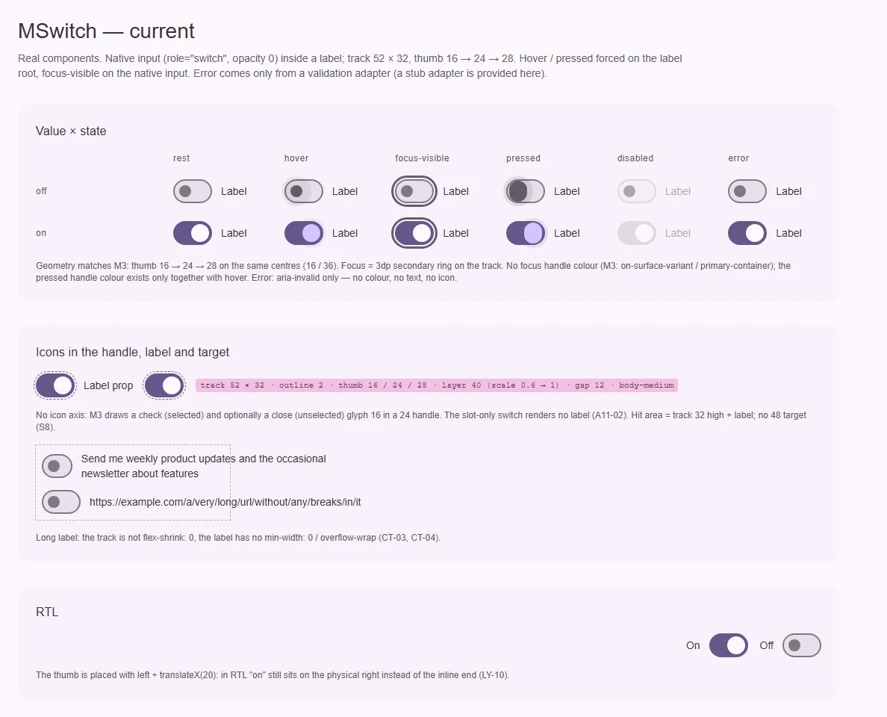
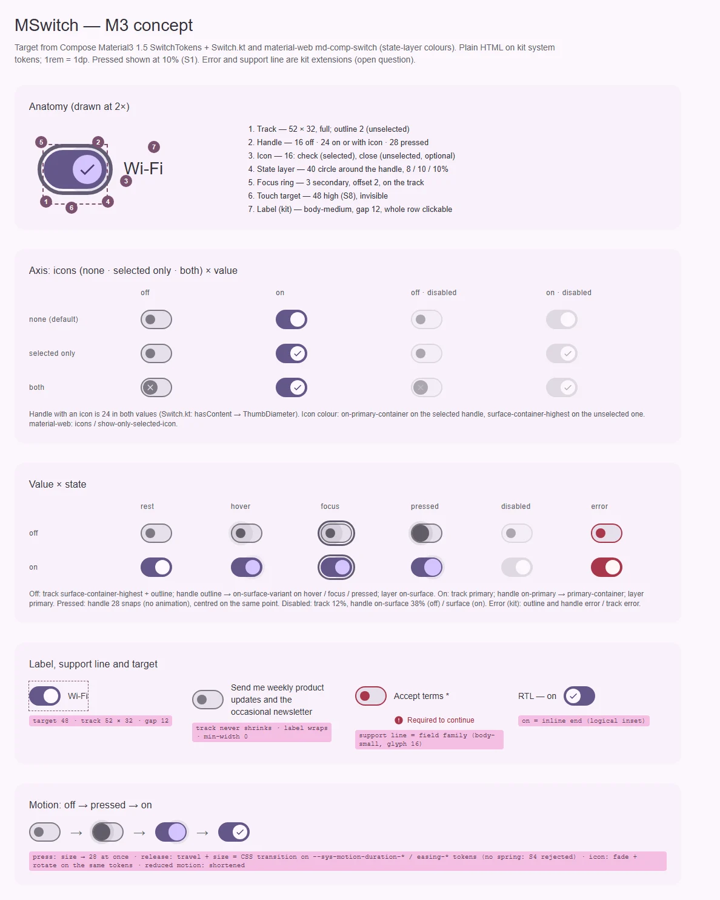

# MSwitch — переключатель: мгновенное «вкл / выкл» одного параметра

<identity>M3: Switch · Токены Compose: `SwitchTokens`, `StateTokens`; поведение — `Switch.kt` (`Switch`, `ThumbNode`, `SwitchDefaults.IconSize`); цвета слоя состояний — material-web `tokens/versions/v0_192/_md-comp-switch.scss`, иконки и цель — `m3-reference/switch/internal/{_switch,_icon,_handle}.scss` · Код: `src/runtime/components/ui/switch/` · Аудит: `data/switch.json` · Тип: public</identity>

<implementation-status state="planned" updated="2026-10-07">Исследование и рендеры готовы, код не менялся. Фаза C уже дала кольцо фокуса на треке, `can-hover`, forced colors и раздачу `$attrs` на нативный инпут (`useControlAttrs`). Геометрия и цвета покоя совпадают с M3. Не хватает иконок в ручке, цветов ручки на фокусе, видимой ошибки, цели 48, RTL и подписи из слота. Ждут ПВ-1…ПВ-4.</implementation-status>

## Вердикт

**дрейф.** Трек 52 × 32 с рамкой 2, ручка 16 → 24 → 28 и центры ручки (16 и 36 от края) совпадают с
`SwitchTokens` и `ThumbNode`; цвета покоя, hover и disabled тоже. Расходятся мелочи и дыры: нет оси
иконок в ручке (M3: галочка и крестик 16 в ручке 24), нет цвета ручки на фокусе, pressed-цвет ручки
живёт только вместе с hover, слой состояний в покое сжат до 0.6 (не M3). Ошибка видна только
`aria-invalid`. В RTL «вкл» остаётся справа (физический `left` + `translateX`). Всё чинится без ломки
API, кроме удаления неиспользуемого `loading`.

## Рендеры

| Сейчас | Концепт M3 |
|---|---|
|  |  |

Кадры концепта:

1. Анатомия в 2×: трек, ручка, иконка, слой 40, кольцо фокуса на треке, цель 48, подпись.
2. Ось иконок: нет · только у выбранного · обе — × off / on × enabled / disabled.
3. Матрица «значение × состояние»: rest, hover, focus, pressed, disabled, error (расширение кита).
4. Подпись, строка поддержки и цель: цель 48, перенос длинной подписи без сжатия трека, ошибка с
   текстом и глифом, RTL.
5. Движение: off → pressed (28) → on; переход на токенах длительности, без пружин (S4 отклонён).

## Анатомия

| № | Часть M3 | Элемент кита | Статус |
|---|---|---|---|
| 1 | Track 52 × 32, `corner-full`, рамка 2 (unselected) | `.ui-switch__track` (`index.vue:20`) | есть |
| 2 | Handle 16 / 24 / 28 | `.ui-switch__thumb` в `.ui-switch__thumb-container` (`index.vue:21-22`) | есть |
| 3 | Icon 16 в ручке (check / close) | — | нет (ось иконок, ПВ-1) |
| 4 | State layer 40, круг вокруг ручки | `.ui-switch__state-layer` (`index.vue:23`) | есть; в покое `scale(0.6)` (`index.vue:141`) — не M3 |
| 5 | Focus indicator по форме трека | `@include focus-ring` на треке (`index.vue:93-95`) | есть (как у material-web `md-focus-ring` с формой трека) |
| 6 | Touch target 48 | цель = корень `label`, высота 32 | нет (S8) |
| 7 | Подпись | `.ui-switch__label` (`index.vue:27-34`) | расширение кита; слот без пропа `label` не рендерится (A11-02) |
| 8 | Строка поддержки (ошибка) | нет | нет — ПВ-2 |

## Оси дизайна

| Ось | M3 | Кит сейчас | Цель | Ломает API |
|---|---|---|---|---|
| Значение | selected · unselected | `boolean` (`v-model`) | без изменений | нет |
| Иконки | `thumbContent` (Compose); `icons` + `show-only-selected-icon` (material-web) | нет | `icons: 'none' \| 'selected' \| 'both'` (ПВ-1) | нет |
| Ошибка | нет (M3 не задаёт) | `aria-invalid` из `useField` | видимая ошибка по ПВ-2 | нет |
| Подпись | нет | `label` + слот по умолчанию | слот без пропа; перенос | нет |
| Цвет / плотность | нет | нет | не вводятся (`principles.md`, В4) | нет |

## Оси состояний

Из `axes` аудита, сверено с кодом после фаз A–D.

| Ось | Нужно (M3 + чеклист) | Есть | Не хватает |
|---|---|---|---|
| Базовое | enabled, disabled, read-only | enabled, disabled (роли, `index.vue:206-236`) | read-only — ПВ-3; soft-disabled — системный вопрос `button/index.md` В-6 |
| Взаимодействие | rest, hover, pressed; ручка `on-surface-variant` / `primary-container` на hover, focus, pressed | rest, hover (слой + цвет ручки), pressed (рост 28) | pressed-цвет ручки без hover (тач); dragged (свайп ручки) — M3 Compose его тоже не делает (`TODO b/223797571`), не вводим |
| Фокус | кольцо + слой 10 % + цвет ручки | кольцо на треке (фаза C) | слой 10 %, цвет ручки |
| Выбор | off, on | off, on (`role="switch"` + нативный `checked`) | лишний `aria-checked` (A11-06 у флажка; нативный инпут объявляет сам) |
| Смысловое | error с текстом | нет визуала | ПВ-2 |
| Валидация | invalid, required | `aria-invalid` | `required` + маркер, текст ошибки |
| Данные | — | проп `loading` объявлен, не работает (EN-01, DT-01) | убрать (шаг 1) |

## Токены: расхождения

| Часть | M3 (Compose / material-web) | Кит сейчас (`_index.scss` / `index.vue`) | Действие |
|---|---|---|---|
| Ручка: focus | `UnselectedFocusHandleColor` on-surface-variant, `SelectedFocusHandleColor` primary-container | нет | `thumb.color.focus.{off,on}` |
| Ручка: pressed | `UnselectedPressedHandleColor` on-surface-variant, `SelectedPressedHandleColor` primary-container | только через `:hover` (`index.vue:178-197`) — на таче pressed без цвета | `thumb.color.pressed.{off,on}` на `:active` |
| Слой: цвет | unselected on-surface, selected primary (material-web `*-state-layer-color`) | off — литерал `map.get($theme-color-link, 'on-surface')` в `.vue` (`index.vue:143`), on — токен трека | `state.layer.color.{off,on}` в карте (TK-06) |
| Слой: непрозрачность | hover 8, focus 10, pressed 10 (S1) | hover 8, pressed 12, focus нет (`_index.scss:44-48`) | focus 10; pressed по СВ-1 |
| Слой: покой | только непрозрачность | `scale(0.6)` → 1 на hover (`index.vue:141`, `:174`) | убрать масштаб (как у флажка, TK-07 флажка) |
| Иконка | 16; selected `on-primary-container`, unselected `surface-container-highest`; disabled 38 % (`on-surface` / `surface-container-highest`) | нет | ветка `icon.*`; ручка с иконкой = 24 в обоих значениях (`ThumbNode`: `hasContent → ThumbDiameter`) |
| Disabled off: трек | `surface-container-highest` 12 % | `surface-variant` 12 % (`_index.scss:70`) | роль `surface-container-highest` |
| Disabled: подпись | — (кит) | `opacity` 0.38 (`index.vue:223-225`) | `on-surface` 38 % цветом, без `opacity` |
| Сдвиг ручки | выводится: `(52 − 24) − (32 − 24) / 2` | литерал `translate: 20rem` (`_index.scss:62`), физический `left` + `translateX` (`index.vue:113`, `:157`) | `inset-inline-start` от центров 16 / 36, число выводится из соседних токенов (TK-02, TK-07, LY-10) |
| Цель | 48 (`minimumInteractiveComponentSize`; material-web — инпут 48 по центру трека) | 32 | S8 |
| `z-index: 1` | — | ручка (`index.vue:132`) | оставить: литерал 1–3 внутри `isolation: isolate` разрешён (`craft.md`, раздел 12); закрывает LY-06 |
| Движение | Compose: размер и сдвиг — `FastSpatial`, нажатие — snap; material-web: сдвиг 300 мс, размер 250 мс, иконка 67 / 167 мс | `short-3` + `standard` на всё (`index.vue:105-148`) | S4 отклонён владельцем: остаются CSS-переходы на `--sys-motion-duration-*` / `easing-*`; рост до 28 на нажатии — без перехода |
| Пути `g()` | точечные | дефисные (`'track-width'`, `'checked-thumb-container-translate'`) | перевести файл целиком на точку (`color-and-state.md`) |

Совпадает: трек 52 × 32, рамка 2 `outline`, ручка 16 / 24 / 28 и её центры, `primary` / `on-primary`
у включённого, hover-цвета ручки, disabled-роли ручки и включённого трека, кольцо фокуса на треке.

## Поведение и доступность

- **Нативный инпут остаётся.** `<input type="checkbox" role="switch">`: Space, отправка формы и
  озвучка «переключатель, вкл» — бесплатно. `aria-checked` убирается: нативный `checked` объявляется
  сам, второй источник может разойтись. Enter M3 не требует, не добавляем.
- **Цель 48 (S8).** Как у material-web: инпут растягивается до `max(100%, 48)` по центру трека и
  становится целью; подпись остаётся кликабельной через `<label>`.
- **Подпись (A11-02, CT-03, CT-04).** Рендерится при пропе **или** слоте; `min-width: 0`,
  `overflow-wrap: anywhere`; трек `flex-shrink: 0`. Трек стоит по центру первой строки.
- **RTL (LY-10).** Ручка ставится `inset-inline-start` от центра 16 или 36; `translateX` убирается.
  «Вкл» оказывается в конце строки в обоих направлениях.
- **Иконки (ПВ-1).** Глифы — `ICONS.check` и `ICONS.close` (S7: пары `outline` из текущего набора),
  `aria-hidden`; смысл несёт `checked`, а не глиф.
- **Ошибка (ПВ-2).** Не только цветом (`color-and-state.md`): текст и глиф в строке поддержки,
  `aria-describedby`, `aria-invalid` уже есть. `required` → нативный атрибут + маркер `*` цветом `error`.
- **Forced colors.** Уже есть (`index.vue:240-276`). Добавить иконку (`forced-color-adjust:
  preserve-parent-color` уже даёт `MIcon`) и пунктирную рамку ошибки — как у полей.
- **Reduced motion.** Закрыто системно, как у флажка: `short-*` — короткая обратная связь, её
  глобальное правило `base/_animations.scss:44` не трогает, а всё от `medium-1` сжимает до `short-2`
  (A11-18). Переход ручки остаётся в `short-*`.

Открытые пункты аудита → шаги: A11-02, EN-01, DT-01 → шаг 1; TK-06, TK-04, TK-02, TK-07 → шаг 2;
LY-10, CT-03, CT-04, RS-12 → шаг 3; EN-03 (иконка ручки) → шаг 4; FM-02, TH-05, FM-10, ST-01, ST-03 →
шаг 5; IN-09 → ПВ-3; IN-08 → `button/index.md` В-6. Закрыто фазами A–D: IN-01, IN-03, IN-04 (кольцо),
TH-04 (forced colors), EN-04 (`useControlAttrs`). Закрыто правилом: LY-06 (`z-index` внутри
`isolation`), A11-18 (системно), LY-04 (gap 12 — токен карты, шкала отступов по ходу работы). RS-04,
RS-05 — принятое отклонение (vw-корень). DC-* — документация в `docs` (EN-11: `icon` и `color` в
`docs/server/data/en/switch.json` никогда не существовали в коде; `icon` получит смысл по ПВ-1,
`color` — нет). TS-* → раздел «Тесты».

## API

Добавить (без ломки):

| Что | Тип | Дефолт | Зачем |
|---|---|---|---|
| `icons` | `'none' \| 'selected' \| 'both'` | `'none'` | ось иконок в ручке (ПВ-1) |
| `required` | `boolean` | `false` | FM-10 |
| слот `#support` | — | — | своя строка поддержки или ошибка (ПВ-2) |

Исправить: слот подписи без пропа; убрать `aria-checked`.

Ломающее: убрать `loading` (`props.ts` берёт `...makeStateProps()` целиком; проп нигде не читается,
EN-01). Миграция: удалить атрибут у вызова; в ките `MSwitch` не использует никто.

Не вводится: `color` (обещан документацией, заказчика нет), `readonly` — по ПВ-3.

## План работ

1. **S** — Мелкие исправления без видимых изменений: условие слота подписи, убрать `aria-checked`,
   взять из `makeStateProps` только `disabled`. Файлы: `switch/index.vue`, `switch/props.ts`,
   `switch/index.spec.ts` (тест «reflects the checked model in class and aria-checked» переписывается).
2. **M** — Карта токенов: ветки `thumb.color.{focus,pressed}`, `state.layer.color`, focus-слой 10 %,
   disabled-трек `surface-container-highest`, подпись disabled цветом; убрать масштаб слоя и литерал
   `on-surface` из `.vue`; перевести файл на точечные пути. Зависит от СВ-1. Файлы:
   `assets/stylesheet/components/switch/_index.scss`, `switch/index.vue`.
3. **S** — Геометрия: ручка через `inset-inline-start` от центров 16 / 36 (числа выводятся из
   трека, ручки и рамки), трек `flex-shrink: 0`, подпись с переносом, цель 48 (инпут по центру трека).
   Видимое изменение: RTL. Файлы: `switch/index.vue`, `_index.scss`.
4. **M** — Ось иконок по ПВ-1: `MIcon` 16 в ручке, ручка 24 при иконке, цвета и disabled-прозрачности
   иконки, forced colors. Файлы: `switch/*`, `_index.scss`.
5. **M** — Ошибка и `required` по ПВ-2: строка поддержки из общего с флажком решения (ЧВ-2 в
   [checkbox.md](checkbox.md)), `aria-describedby`, маркер. Файлы: `switch/*`.
6. **S** — Движение: размер и сдвиг ручки на `--sys-motion-duration-*` / `easing-*`, рост до 28 на
   нажатии без перехода (как snap в `ThumbNode`), появление иконки — fade + поворот на тех же токенах.
   Без пружин (S4 отклонён).
7. **M** — Тесты.

Переиспользование: слой 40, цель 48, кольцо и строка поддержки — общий Sass-миксин контрола выбора,
который заводят [checkbox.md](checkbox.md) (шаги 3–6) и [radio.md](radio.md). Переключатель
подключается к нему же, а не копирует правила.

## Тесты

- Фикстуры `playground/fixtures/switch/{matrix,stress}.vue`: значение × состояние × иконки × error;
  слот без пропа; длинная подпись и URL; RTL.
- e2e `switch.e2e.ts`: axe на матрице (светлая и тёмная × ltr и rtl); Space переключает; цель ≥ 48
  (`elementFromPoint` у края цели); в RTL ручка «вкл» у inline-end; ошибка связана
  `aria-describedby`; forced colors для on, off, disabled, error.
- unit (`index.spec.ts`): подпись из слота (TS-07); нет `aria-checked`; иконки по `icons`; ошибка из
  заглушки `ValidationAdapter` (TS-07); `required` на инпуте.

## Готово, когда

- [ ] Цвета ручки и слоя во всех клетках матрицы совпадают с концептом (включая focus и pressed без hover).
- [ ] Иконки рисуются по `icons`, ручка с иконкой 24 в обоих значениях.
- [ ] В RTL «вкл» у inline-end; длинная подпись не сжимает трек; цель ≥ 48.
- [ ] Ошибка видна цветом, текстом и глифом и связана `aria-describedby` (по ПВ-2).
- [ ] Пропа `loading` и атрибута `aria-checked` нет.
- [ ] `npm run lint`, `lint:style`, `lint:scss`, `typecheck`, vitest, e2e — зелёные.
- [ ] Видимые изменения (RTL, слой без масштаба, disabled-трек, подпись disabled) перечислены в summary.

## Предложения по UX

1. **Вторая строка подписи (описание).** Строка настроек «Wi-Fi / Подключено к Home» — основной
   сценарий переключателя: подпись body-large, описание body-medium `on-surface-variant` под ней,
   переключатель по центру блока. Пользователь видит последствие настройки, не открывая справку.
   Заказчик: экраны настроек продуктов. Цена: S, слот `#description` + `aria-describedby` на инпут,
   бандл — несколько правил. Рекомендация: брать вместе с ПВ-4 (строка настроек — один заказчик).
2. **Подтверждение асинхронного сохранения.** Переключатель с немедленным сохранением сейчас
   врёт, пока сервер не ответил. `beforeChange: (next) => Promise<boolean>`: ручка встаёт в новое
   положение, на время ожидания контрол `aria-busy` и не принимает ввод, при `false` или ошибке
   откатывается, а строка поддержки говорит почему. Это честная замена удаляемому `loading`
   (DT-01). Заказчик: настройки с сохранением на лету. Цена: M, новый проп и состояние в матрице,
   бандл — без зависимостей. Рекомендация: отложить до заказчика; удалить `loading` сейчас всё равно
   (он ничего не делает).
3. **Свайп ручки на таче.** Перетаскивание ручки пальцем с доводкой к ближайшему краю. Ближе к
   нативным переключателям iOS и Android. Заказчик не назван; M3 Compose этого тоже не делает
   (`TODO b/223797571` в `Switch.kt`). Цена: M, `useDrag`, конфликт с прокруткой страницы. Рекомендация:
   не делать.

## Открытые вопросы

**ПВ-1. Как называть ось иконок.**

1. `icons: 'none' | 'selected' | 'both'`. Одна ось на три взаимоисключающих состояния
   (`principles.md`, В1; `craft.md`, «флаг — ось с одним значением»). Цена: имя ещё не встречается в
   ките.
2. Два флага, как в material-web: `icons` + `showOnlySelectedIcon`. Знакомо по material-web, но это
   ровно тот случай «две булевы на одну ось», который кит запрещает.
3. Слот `#icon` со scope `{ checked }` без пропа. Гибко, но кит не поставляет глифы по умолчанию,
   и каждый потребитель повторит одну и ту же разметку.

Рекомендация: 1 (и слот `#icon` поверх него — для своих глифов).

**ПВ-2. Как переключатель показывает ошибку.**

M3 ошибку переключателя не рисует. Кит берёт `path` и получает ошибку из `useField`.

1. Как у флажка (ЧВ-2): рамка и ручка `error` у выключенного, трек `error` у включённого, плюс строка
   поддержки с текстом и глифом; высота строки резервируется только при `path`. Единый вид контролов
   выбора. Цена: включённый переключатель красного цвета читается как «опасная настройка».
2. Только строка поддержки, контрол не меняет цвета. Ближе к M3, но ошибка у самого контрола видна
   только рядом стоящим текстом.
3. Не показывать ошибку вовсе и убрать `path` (переключатель — мгновенное действие, а не поле
   формы). Цена: ломающее изменение, форма с «согласен с условиями» потеряет валидацию.

Рекомендация: 1 — вместе с решением ЧВ-2 у флажка.

**ПВ-3. Read-only (IN-09).**

1. `readonly`: фокус и объявление сохраняются, клик и Space гасятся, вид — как enabled без слоя.
   Цена: у нативного checkbox `readonly` не работает — блокировка руками.
2. Не вводить, пока нет заказчика (`principles.md`, В4). Условие возврата — экран просмотра настроек.

Рекомендация: 2, как ЧВ-4 у флажка.

**ПВ-4. Где стоит переключатель относительно подписи.**

M3 в списках ставит переключатель в конце строки (trailing), кит — в начале, как флажок.

1. Оставить в начале. Без изменений, единообразно с флажком и радио.
2. Ось `controlPlacement: 'start' | 'end'` (по образцу `<x>Placement`). Нужна строкам настроек, где
   подпись слева, а переключатель справа. Цена: новая ось, которую потом захотят флажок и радио.
3. Только `end` по умолчанию, как в M3-списках. Ломает текущий вид.

Рекомендация: 1; вернуться к 2, когда появится строка настроек (`MListItem` с переключателем) как
заказчик.
