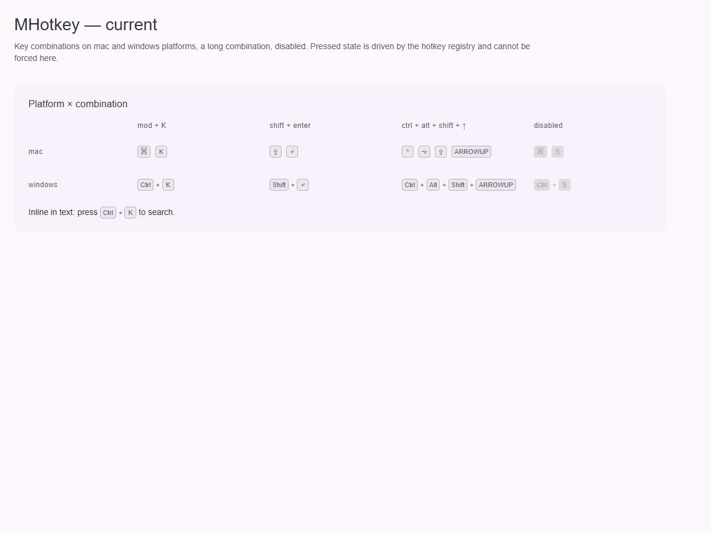
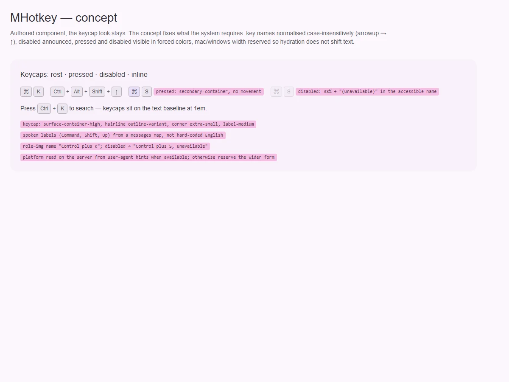

# MHotkey — показ сочетания клавиш

<identity>M3: компонента нет; авторский компонент кита (клавиши в духе подписи сочетаний в меню M3) · Токены Compose: нет · Код: `src/runtime/components/ui/hotkey/`, форматирование `src/runtime/composables/hotkey/format.ts` · Аудит: `data/hotkey.json` · Тип: public</identity>

<implementation-status state="planned" updated="2026-10-07">Реализован в фазе 1: `kbd` на клавишу, разделители, `role="img"` с озвучиваемым именем, платформа `auto | mac | windows`, состояние нажатия из реестра `useHotkey`, слоты `#key` и `#separator`. Открыты: `arrowup` отрисован как «ARROWUP» (рендер), disabled не объявляется, английские озвучиваемые имена клавиш, сдвиг вёрстки после гидрации на mac, литералы.</implementation-status>

## Вердикт

`авторский`. Вид клавиш остаётся. Решения прежнего плана остаются:
- визуальная часть отделена от реестра ([hotkey.md](use-hotkey.md));
- `mod` зависит от платформы;
- одно имя сочетания для AT, отдельные `kbd` скрыты.

Дефекты:
- **имя клавиши не нормализуется без учёта регистра**: `arrowup` рисуется как «ARROWUP»
  вместо «↑» (рендер);
- disabled только визуальный — для AT неактивное сочетание звучит так же (ST-01, A11-06);
- озвучиваемые имена (Command, Control, Shift, Up) зашиты по-английски в `format.ts:121–146`
  (CT-13);
- на mac после гидрации «Ctrl + K» превращается в «⌘K» другой ширины — сосед сдвигается (MO-04);
- проп `platform` читается один раз (EN-05);
- pressed и disabled пропадают в forced colors (TH-04);
- нажатие сдвигает клавишу `translateY` — движение позиции вопреки правилам движения кита (TK-02).

## Рендеры

| Сейчас | Концепт |
|---|---|
|  |  |

Сейчас: mac и windows × четыре сочетания (в длинном — «ARROWUP»), disabled, в строке текста.

Концепт:
- клавиши на `surface-container-high` с hairline;
- нажатие — тон без движения;
- disabled объявляется;
- правила озвучки и платформы.

## Анатомия

| # | Часть | В ките | Статус |
|---|---|---|---|
| 1 | Корень `role="img"` + имя | есть | disabled в имени не отражён |
| 2 | Клавиша `kbd` | есть | неизвестные имена — в верхнем регистре |
| 3 | Разделитель | «+» на Windows, без него на mac | есть |

## Оси дизайна

| Ось | Значения | Комментарий |
|---|---|---|
| `platform` | `auto \| mac \| windows` | реактивно (EN-05) |
| `density` | — | Не вводить: размер от шрифта окружения (1em) |

## Оси состояний

| Ось | Нужно | Есть | Не хватает |
|---|---|---|---|
| Активность | активно · неактивно, объявляется | только вид | «…, недоступно» в имени (A11-06) |
| Нажатие | тон | тон + `translateY` | без движения |
| Forced colors | все состояния видимы | нет | рамка `ButtonText`, pressed — `Highlight` |

## Токены: расхождения

| Часть | Система | Кит сейчас | Действие |
|---|---|---|---|
| Прозрачности disabled | `state-opacity(disabled-content)` | литералы в `.vue:152` (ST-05, TK-04) | токен |
| Граница | hairline | `1rem` (TK-02) | общий вопрос hairline |
| Отступы | `spacing()` | литералы (LY-04) | `spacing()` |
| Шрифт | label-medium с трекингом | typescale без `letter-spacing` (TK-03, системно) | системный миксин |

## Поведение и доступность

- Нормализация имён клавиш без учёта регистра и с алиасами (`arrowup`, `ArrowUp`, `up` → `↑`) —
  в `format.ts`, общая с реестром.
- Озвучиваемые имена — из карты сообщений, которую можно перевести (CT-13, Q13).
- **Платформа.** На сервере берётся из клиентских подсказок (`Sec-CH-UA-Platform`) или UA, если
  доступны. Иначе резервируется более широкая форма, чтобы после гидрации вёрстка не прыгала
  (MO-04).

## API

Без изменений, кроме реактивного `platform`.

## План работ

1. **S — нормализация имён клавиш** (рендер).
2. **S — disabled в имени** (ST-01, A11-06).
3. **S — карта озвучиваемых имён** (CT-13).
4. **S — платформа на сервере и реактивный проп** (MO-04, EN-05).
5. **S — нажатие без движения, forced colors, токены** (TH-04, TK-02, TK-04, TK-06, ST-05, LY-04).
6. **S — документация** (DC-*).

## Тесты

- Unit:
  - `arrowup` / `ArrowUp` / `up` → «↑»;
  - имя с «недоступно» при disabled;
  - смена `platform` перерисовывает;
  - SSR с подсказкой платформы рисует mac-форму.
- e2e: forced colors.

## Готово, когда

- Любое написание клавиши рисуется символом.
- Неактивное сочетание объявляется.
- Вёрстка не прыгает после гидрации.

## Предложения по UX

Расширения сверх паритета. Это предложения владельцу, а не шаги плана. Без новых зависимостей.

| Предложение | Что получает пользователь | Заказчик | Цена | Рекомендация |
|---|---|---|---|---|
| Панель «Сочетания клавиш» по `?` из реестра `useHotkey` (рецепт на `MDialog` + `MHotkey`) | Все сочетания приложения в одном месте | docs-сайт, редакторы | S · реестр уже знает все сочетания | да |
| Подпись сочетания в пунктах меню и тултипах из одного источника (`hotkey` у `MMenuItem`, `MButtonIcon`) | Подсказки не расходятся с реальными клавишами | меню, тулбары | S · предложено в планах [menu](../overlays/menu.md) и [button](../button/index.md) | да |

## Открытые вопросы

Нет.
