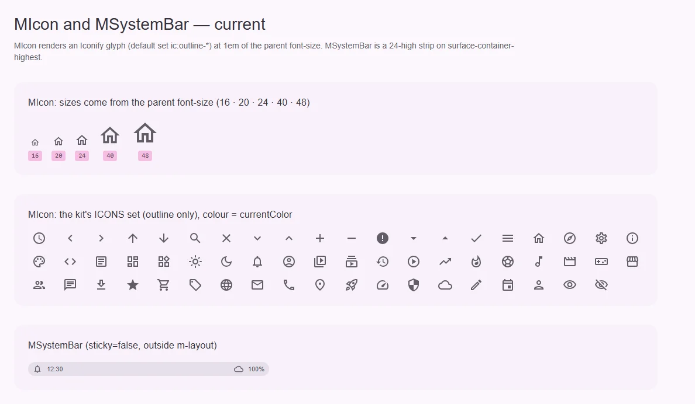
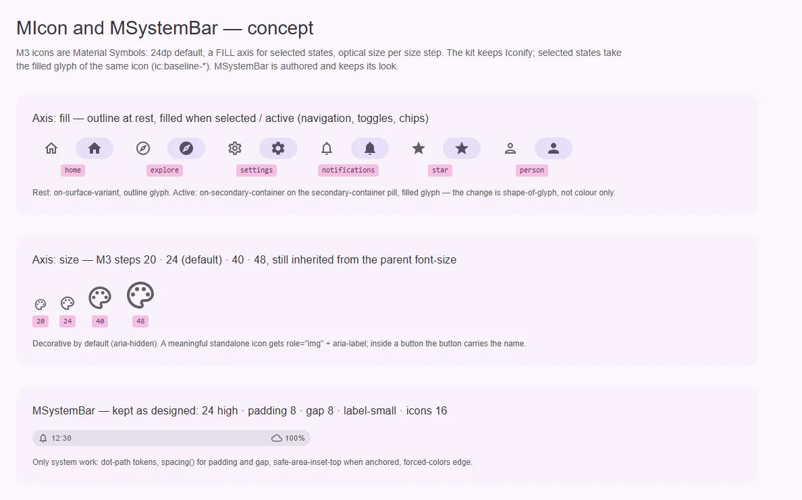

# MIcon — глиф из набора иконок

<identity>M3: Styles → Icons (Material Symbols: размер 24 по умолчанию, оси FILL / weight / grade / optical size) · Токены Compose: нет отдельного файла; размеры иконок задаются в токенах каждого компонента (`IconSize`) · Код: `src/runtime/components/ui/icon/`, `src/runtime/shared/constants/icons.ts` · Аудит: `data/icon.json` · Тип: public, примитив</identity>

<implementation-status state="planned" updated="2026-10-07">Рендерит Iconify-глиф через `@nuxt/icon`. Набор кита — `ic:outline-*` (Material Icons, без оси FILL). Иконка всегда декоративна. Под неизвестное имя место не резервируется.</implementation-status>

## Вердикт

`дрейф`. M3 строит иконки на Material Symbols. Выбранное состояние (активный пункт
навигации, включённый toggle, выбранный чип) там отличается **заливкой глифа**, а не только
цветом. В ките один начертательный вариант (outline), и компоненты различают выбор только
цветом и контейнером. Размер по M3 — 24, кит наследует его от `font-size` родителя: это
совместимо, менять не нужно. Остальное — дефекты из аудита: нет резерва места, нет
значимого режима.

## Рендеры

| Сейчас | Концепт |
|---|---|
|  |  |

Кадры концепта:
1. Ось заливки: outline в покое, filled в выбранном состоянии на «таблетке»
   `secondary-container`, как у навигации M3.
2. Шаги размера 20 · 24 · 40 · 48.
3. Нижний кадр — [MSystemBar](system-bar.md), рендеры у них общие.

## Анатомия

| # | Часть | В ките | Статус |
|---|---|---|---|
| 1 | Обёртка | `span.ui-icon` (`inline-flex`, `line-height: 0`) | есть; без резерва размера |
| 2 | Глиф | `<Icon :name>` из `@nuxt/icon`, `aria-hidden="true"` | есть |
| 3 | Цвет | `currentColor` | есть |
| 4 | Forced colors | `forced-color-adjust: preserve-parent-color` для CSS-иконок | есть |

## Оси дизайна

| Ось | M3 | Кит сейчас | Цель | Ломает API |
|---|---|---|---|---|
| Заливка (FILL) | 0 / 1, выбранные состояния — 1 | только outline | Проп `filled` или пара имён (вопрос 1, зависит от СВ-3) | нет |
| Размер | 20 · 24 · 40 · 48 (optical size) | от `font-size` родителя | Оставить наследование; размеры — в токенах компонентов-владельцев | — |
| Вес / grade | 100–700 / −25…200 | нет | Не делать без перехода на Symbols (СВ-3) | — |
| Смысл | Декоративная или с именем | всегда `aria-hidden` | Проп `label` | нет |

## Оси состояний

| Ось | Нужно | Есть | Не хватает |
|---|---|---|---|
| Данные | Загружено / ошибка / неизвестное имя | — | Резерв `1em × 1em` всегда; предупреждение в dev при пустом или неизвестном имени (ST-01, DT-02, CT-07, CT-09) |
| Выбор | Заливка глифа у выбранного | — | Ось заливки (вопрос 1) |
| Доступность | Значимая иконка с именем | — | `label` → `role="img"` + `aria-label` (A11-05) |

## Токены: расхождения

| Часть | M3 | Кит | Действие |
|---|---|---|---|
| Цвет | `currentColor` от компонента | `fill: currentcolor` | совпадает |
| Размер по умолчанию | 24 | наследуется (`1em`) | совпадает при `font-size: 24rem` у владельца; токены владельцев сверяются в их планах |

## Поведение и доступность

- **Резерв места.** Обёртка всегда `width: 1em; height: 1em`: соседний текст не прыгает,
  пока глиф грузится, и не схлопывается при ошибке.
- **Значимая иконка.** `label` → `role="img"`, `aria-label`, без `aria-hidden`. Без `label` —
  декоративная, как сейчас.
- **Неизвестное имя** в dev: `console.warn` с именем и подсказкой про `ICONS`.
- EN-09 закрыт: глобального `:deep()` в стилях больше нет (`index.vue:33–57`).

## API

| Что | Изменение | Ломает |
|---|---|---|
| `label?: string` | Новый | нет |
| `filled?: boolean` | Новый, по вопросу 1 (вариант 1) | нет |

## План работ

1. **S — резерв места и предупреждение** (ST-01, DT-02, CT-07, CT-09).
2. **S — `label`** (A11-05).
3. **M — ось заливки** (после вопроса 1 и СВ-3).
   - `filled` переводит `ic:outline-x` → `ic:baseline-x`.
   - Компоненты с выбором (navigation bar/rail/drawer, chip filter, segmented, toggle-кнопки)
     ставят `filled` на выбранном.
4. **S — документация** (DC-03, DC-04).
   - `name` обязателен.
   - Размер берётся от `font-size` родителя.
   - Наборы и константа `ICONS`.
   - Когда иконка значимая.

## Тесты

- Unit:
  - пустое имя предупреждает;
  - `label` даёт `role="img"` и `aria-label`, без `aria-hidden`;
  - `filled` подменяет префикс набора.
- e2e: CLS = 0 на строке «иконка + текст» при медленной загрузке набора (мок сети).

## Готово, когда

- Иконка всегда занимает свой квадрат.
- Значимую иконку можно назвать.
- Выбранные состояния навигации рисуют залитый глиф.

## Предложения по UX

Расширения сверх паритета с M3. Это предложения владельцу, а не шаги плана: в «План работ» попадают только после решения. Без Expressive-анимаций и без новых зависимостей.

| Предложение | Что получает пользователь | Заказчик | Цена | Рекомендация |
|---|---|---|---|---|
| Типизированное имя: `name` принимает объединение ключей `ICONS` и строку с префиксом набора | Опечатка в имени ловится в редакторе, а не пустым квадратом в рантайме | разработчики | S · только типы | да |
| Встраивать используемые иконки в серверный HTML (SVG в SSR), а не догружать на клиенте | Иконки видны с первого кадра, без мигания и сдвига | все страницы | S–M · настройка `@nuxt/icon` (server bundle / clientBundle), без новой зависимости | проверить текущую конфигурацию, затем да |

## Открытые вопросы

**1. Как выражать заливку?**
1. Проп `filled`: компонент сам переводит `outline-x` → `baseline-x` в наборе `ic`. Одно имя
   на иконку, но работает только для наборов, где есть пара.
2. Два имени в константах (`ICONS.home` и `ICONS.homeFilled`), выбор делает владелец. Явно,
   но список констант удваивается.

Рекомендация: 1. Если по СВ-3 будет выбран переход на Material Symbols, `filled` станет
значением оси FILL без смены API.
