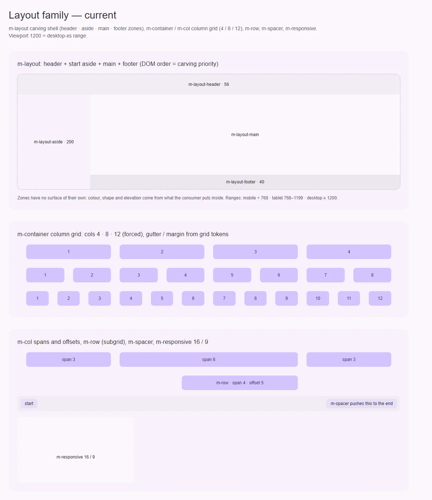
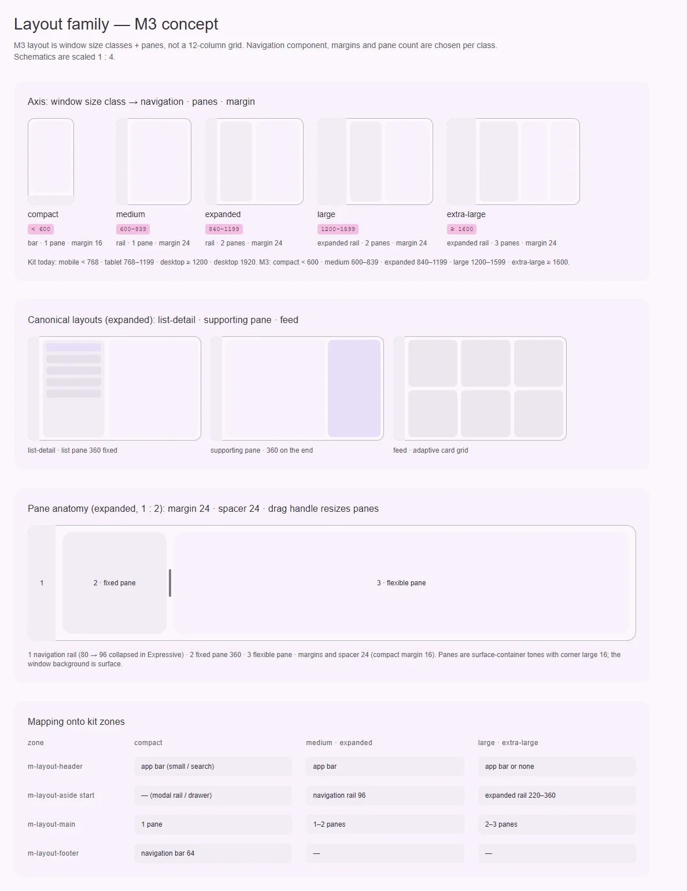

# Семейство layout — каркас приложения и сетка контента

<identity>M3: Foundations → Layout (window size classes, panes, canonical layouts); отдельного компонента в каталоге нет · Токены Compose: нет (раскладка задаётся `WindowSizeClass` и адаптивными скаффолдами вне `material3`) · Код: `src/runtime/components/ui/{layout,main,container,row,col,spacer,responsive}/`, `src/runtime/composables/layout/` · Аудит: `data/{layout,main,container,row,col,spacer,responsive}.json` · Тип: primitive</identity>

<implementation-status state="planned" updated="2026-10-07">Шаги 1–6 сделаны: сетка на `spacing()` и токен `pane.fixed.width`, safe-area у прибитых зон (`carve.ts`, генерация CSS вынесена в `layout/css.ts`) и у `m-container`, `scrollbar-gutter` у main в full-height, `m-responsive` на `overflow: clip`, деприкация `<m-main>`, таблица классов окон и рецепт навигации в `docs/layout.md`; панели, алиасы классов окна и опция `container` перенесены.</implementation-status>

## Вердикт

`дрейф`. Механика кита сильная: SSR-сетка без измерений, зоны с липкими краями и логическими
свойствами, `scroll-padding` от прибитых зон. Разрыв в модели. M3 описывает раскладку через
**классы окон** и **панели** (одна, две, три; list-detail, supporting pane, feed). Кит описывает её
через **диапазоны устройств** (`mobile/tablet/desktop` на 768/1200) и **колонки** 4/8/12. Колонки
— наследие Material 2. В M3 они остались только как сетка внутри контента.

## Рендеры

| Сейчас | Концепт M3 |
|---|---|
|  |  |

Кадры концепта:
1. Ось «класс окна»: для compact/medium/expanded/large/extra-large показаны навигация, число
   панелей и поля.
2. Три канонические раскладки в классе expanded.
3. Анатомия панелей: поле 24, промежуток 24, ручка перетаскивания между панелями.
4. Таблица соответствия: какой компонент M3 стоит в какой зоне кита при каждом классе окна.

## Анатомия

| # | Часть M3 | В ките | Статус |
|---|---|---|---|
| 1 | Окно (window) и его класс | `m-layout`, диапазоны `mobile/tablet/desktop` из `materialKit.breakpoints` | иначе: другие границы и другие названия |
| 2 | Область навигации (bar / rail / expanded rail / drawer) | `m-layout-aside` (start) или `m-layout-footer`; бар и рейл регистрируются сами | есть, но выбор навигации по классу окна делает потребитель |
| 3 | Область app bar | `m-layout-header` | есть |
| 4 | Тело и панели (pane 1…3) | `m-layout-main` — одна область, панелей нет | нет |
| 5 | Промежуток между панелями (spacer 24) и ручка изменения размера | — | нет |
| 6 | Поля окна (16 compact / 24 остальные) | `m-container`: `margin` 16/24 | есть (`grid/_index.scss:31`) |
| 7 | Сетка внутри контента | `m-container` 4/8/12, `m-row` (subgrid), `m-col` | есть, это сверх M3 |

## Оси дизайна

| Ось | M3 | Кит сейчас | Цель | Ломает API |
|---|---|---|---|---|
| Класс окна | compact `<600`, medium `600–839`, expanded `840–1199`, large `1200–1599`, extra-large `≥1600` | `mobile-xs 0`, `mobile 767`, `tablet-xs 768`, `tablet 1199`, `desktop-xs 1200`, `desktop 1920` | Открытый вопрос 1 | да, если менять дефолты |
| Число панелей | 1 / 2 / 3 по классу окна | Одна область `main` | Опциональные панели внутри `m-layout-main` (вопрос 2) | нет, только добавление |
| Каноническая раскладка | list-detail, supporting pane, feed | — | Пресеты панелей (вопрос 2) | нет |
| Колонки сетки | Нет в текущем M3 (были в M2) | 4/8/12 по ширине **окна** | Колонки по ширине **контейнера** (вопрос 3) | поведение да |
| Поля и промежутки | margin 16/24, spacer 24 | gutter и margin 16/24 литералами | Через `spacing(16)`/`spacing(24)` | нет |
| `fullHeight` | — | `m-layout full-height` | Оставить | — |

## Оси состояний

| Ось | Нужно | Есть | Не хватает |
|---|---|---|---|
| Базовое состояние | — | — | Примитив без интерактивности |
| Раскрытие | Ширина зоны меняется при раскрытии рейла | `transition: grid-template-*` на токене `medium-2`, под reduced motion сокращается | — |
| Прокрутка | Липкие края не перекрывают фокус | `scroll-padding-top` от последней прибитой зоны (`carve.ts`) | `scrollbar-gutter: stable` у `m-layout-main` в `full-height` (CT-11) |
| Вырезы экрана | Поля учитывают safe-area | — | `env(safe-area-inset-*)` для прибитых зон и полей (RS-09) |

## Токены: расхождения

| Часть | M3 | Кит сейчас | Действие |
|---|---|---|---|
| Поле окна | 16 compact / 24 medium+ | `grid/_index.scss:31` `margin: (mobile-xs: 16rem, tablet-xs: 24rem)` — граница 768, а не 600 | Перевести на `spacing()`. Граница зависит от вопроса 1 |
| Промежуток колонок / панелей | spacer 24 | `gutter` 16/24 литералами | `spacing()` |
| Ширина фиксированной панели | 360 (list-detail, supporting) | — | Новый токен `pane.fixed.width: 360rem` |
| `max-width` контейнера | Нет в M3 (ширину ограничивают панели) | 1200rem / 1600rem литералами (TK-02) | Оставить как ось кита, вынести в токены |
| Длительность перестройки сетки | Spring spatial default (S4) | `medium-2` + `standard` | Перейти на S4 после появления токенов |

## Поведение и доступность

- **Классы окон.** M3 советует вести навигацию по классу: compact → navigation bar 64 снизу,
  medium/expanded → navigation rail 96, large+ → expanded rail 220–360 (или drawer). Сейчас
  `m-layout` по умолчанию прячет боковые зоны на mobile и `end` на tablet. Соответствие не задано.
  Нужен рецепт в документации, а компонент — после ответа на вопрос 4.
- **Панели.** В list-detail при переходе в compact детали открываются поверх списка, и «назад»
  возвращает к списку. Фокус при этом переходит на заголовок деталей и возвращается на
  выбранную строку. Это поведенческая часть, её нужно описать в композабле, если панели появятся.
- **Ручка изменения размера** (Expressive): `role="separator"`, `aria-orientation="vertical"`,
  `aria-valuenow`, стрелки и Home/End с клавиатуры. Повторное использование:
  `createRangeKeyboardController`, третий контроллер не заводим.
- **Открытые пункты аудита:**
  - `layout` RS-09 (safe-area) и CT-11 (`scrollbar-gutter` у main) — шаги 2 и 3;
  - `container` LY-04 и TK-02 (литералы) — шаг 1; RS-09 — шаг 2; RS-03 — вопрос 3;
  - `col` RS-03 — вопрос 3;
  - `responsive` IN-05 (кольцо фокуса обрезается `overflow: hidden`) — шаг 4; DC-04 — шаг 6;
  - `main` EN-11 (деприкация только комментарием) — шаг 5.
- **Уже закрыто:**
  - `layout` A11-13: `scroll-padding-top` строит `carve.ts`, есть спека `carve.spec.ts:325`;
  - `layout` A11-18: переход на токене длительности сокращается под reduced motion;
  - `app` LY-06: `z(overlay-host)`.

## API

| Что | Изменение | Ломает |
|---|---|---|
| `<m-main>` (`main/index.vue`) | Деприкация с предупреждением в dev, затем удаление. Замена — `<m-layout-main>` | да, через один minor |
| `<m-layout-pane>` (новое, вопрос 2) | Дочерний элемент `m-layout-main`: `role="region"`, `width: 'fixed' \| 'flex'`, `minWidth`. Пресет на родителе: `<m-layout-main panes="list-detail \| supporting \| feed">` | нет |
| `m-container` | Опционально `container` (вопрос 3): колонки считаются от своей ширины через `@container` | нет при опции, да при смене дефолта |
| `materialKit.breakpoints` | Дефолты (вопрос 1) | да для потребителей без своих брейкпоинтов |
| `m-responsive` | Без изменений API. Внутренний отступ под кольцо фокуса | нет |

## План работ

1. **S — токены сетки на шкалу отступов.** `grid/_index.scss`: `gutter`/`margin` через
   `spacing(16)`/`spacing(24)`, `max-width` и новая `pane.fixed.width` — ключами карты.
   Зависимости нет.
2. **S — safe-area.**
   - прибитые зоны (`carve.ts`, генерация CSS): `padding-inline` и `padding-block` с
     `env(safe-area-inset-*)` на соответствующем краю;
   - `m-container`: `margin-inline: max(margin, env(safe-area-inset-left/right))`;
   - `viewport-fit=cover` — решение приложения, пункт документации.

   Сделано не через `padding`: сгенерированный `padding-block-start` с ID-специфичностью
   затирал собственный `padding` зоны (`m-app-bar` держит 8rem). Вырез стал прозрачной рамкой
   на внешней стороне зоны плюс `min-block-size: size + inset`; трек строки, смещения
   следующих зон, `--m3-layout-inset-*` и `scroll-padding` учитывают вырез. Верхний вырез
   берёт первая прибитая верхняя зона без размерных верхних зон до неё, нижний — первая
   прибитая нижняя; боковые — верхние и нижние зоны во всю ширину. **Перенесено**: боковые
   зоны (рейл у края в landscape), полосы, касающиеся одного бока, зоны в потоке по блочной
   оси — трек колонки и смещения зависят от направления письма.
3. **S — `scrollbar-gutter: stable` у `m-layout-main`** в режиме `full-height`.
4. **S — `m-responsive`.**
   - вариант A: оставить `overflow: hidden` и обрезать содержимое скруглением через `clip-path`;
   - вариант B: дать детям `focus-ring(inset)`.

   Рекомендуется A: тогда `outline` у детей не обрезается. Нужна проверка в браузере.

   Сделано третьим способом: `overflow: clip` + `overflow-clip-margin` на ширину и отступ
   кольца фокуса, `min-block-size: 0` держит пропорцию (не-скролл-контейнер иначе растёт по
   содержимому). `clip-path` не взят: обрезанное им содержимое всё равно растягивает
   прокручиваемую область страницы.
5. **S — деприкация `<m-main>`.** Предупреждение в dev, `@deprecated` в JSDoc. Удаление — в
   следующем major.
6. **M — документация раскладки по классам окон.** Таблица «класс окна → навигация → зоны» в
   `docs/layout.md`, рецепт адаптивной навигации на `useBreakpoint().is`. Исправить в DC-04 у
   `responsive` описание: контент не позиционируется абсолютно.
7. **L — панели** (после вопроса 2):
   - `m-layout-pane` и пресеты;
   - композабл `useListDetail` (выбор, «назад» в compact, возврат фокуса);
   - ручка изменения размера на `createRangeKeyboardController`.

   **Перенесено**: отдельная задача после шагов 1–6 — новое публичное API, размер L.
8. **S — алиасы классов окна M3** (вопрос 1, вариант 2). `is.compact/medium/expanded/large/
   extraLarge` поверх ключей кита без смены границ и без `root-scale()`. **Перенесено**:
   правка в `utils/viewport/createBreakpoints.ts` (или `bands.ts`), `shared/types/props`
   (`BreakpointFlags`) и `useBreakpoint.ts` — вне файлов семейства.
9. **S — переход сетки на spring** (после S4). **Не делается**: пружины Expressive в вебе
   отклонены владельцем (S4).
10. **M — опция `container` у `m-container`** (вопрос 3, вариант 1): колонки от ширины самого
    контейнера через `@container (inline-size)`, дефолт оконный. **Перенесено**: не входит в
    шаги 1–6. Элемент не может запросить собственную ширину, поэтому нужна внутренняя обёртка
    сетки, контекст для `m-col` (его брейкпоинтные классы сейчас на `@media`) и второй набор
    классов спанов под `@container`.

## Тесты

- **Unit:**
  - `carve.spec.ts`: safe-area в сгенерированном CSS;
  - `scroll-padding` по-прежнему считается от последней прибитой зоны;
  - пресеты панелей дают ожидаемые `grid-template-*`.
- **e2e:**
  - фикстура `layout/matrix.vue`: каркас с header/rail/main/footer на ширинах 360/768/1366;
  - нет горизонтального переполнения;
  - Tab назад к элементу под прибитым header — элемент виден;
  - ручка панели: стрелки меняют ширину, `aria-valuenow` следует.
- **axe** на каркасе: ровно один `main`, у панелей есть имя региона.

## Готово, когда

- Литералов в `grid/_index.scss` нет, `lint:scss` проходит.
- В landscape с вырезом (эмуляция в Playwright) контент и прибитые зоны не уходят под вырез.
- `<m-main>` предупреждает в dev.
- В документации есть таблица соответствия классов окон M3 и зон кита.
- Если панели приняты: list-detail работает на compact и expanded, клавиатура и фокус по
  описанию выше.

## Предложения по UX

Расширения сверх паритета с M3. Это предложения владельцу, а не шаги плана: в «План работ» попадают только после решения. Без Expressive-анимаций и без новых зависимостей.

| Предложение | Что получает пользователь | Заказчик | Цена | Рекомендация |
|---|---|---|---|---|
| Запоминать состояние раскрытия рейла и ширину панели list-detail в cookie (как тема) | После перезагрузки каркас открывается в том же виде, без прыжка на первом кадре: SSR сразу рисует нужную ширину | docs (рейл и aside), любой продукт с панелями | S · без бандла (cookie уже читает тема) · новый проп `persist` | да, вместе с шагом 7 |
| Зона `m-layout-item kind="bottom"` для FAB и snackbar с учётом прибитых краёв | FAB и snackbar не перекрывают navigation bar и футер на compact, сами поднимаются над ними | button/fab.md, snackbar | S · использует уже существующие `--m3-layout-inset-*` | да |
| Подсветка «окна» при отладке: `?layout-debug` рисует зоны и их размеры | Разработчик видит, какая зона откуда взялась, без DevTools | разработчики кита и продуктов | S · только dev, вырезается из сборки | обсудить |

## Открытые вопросы

**1. Брейкпоинты по умолчанию.**
1. Перейти на классы окон M3 (600/840/1200/1600) и переименовать ключи в
   `compact/medium/expanded/large/extra-large`. Полное совпадение с M3, но ломается каждый
   потребитель, который полагается на `tablet-xs`, а масштаб корня переедет на новые границы.
2. Оставить ключи кита и добавить алиасы классов M3 поверх (`is.medium` и т. п.) без смены
   границ. Не ломает ничего, но кит говорит «medium» про 768–1199, а M3 — про 600–839.
3. Сменить только значения по умолчанию, ключи оставить. Половинчато: имена врут.

Рекомендация: 2 сейчас, 1 в следующем major вместе с документацией.

Решение владельца 2026-10-07: вариант 2, границы не меняются, `root-scale()` не трогается.
Соответствие классов M3 и диапазонов кита — в `docs/layout.md` §5; алиасы — шаг 8.

**2. Вводить ли слой панелей (`m-layout-pane`, канонические раскладки)?**
1. Да, как опциональный слой внутри `m-layout-main`: list-detail и supporting pane закрывают
   большинство экранов M3. Цена — новый публичный API и композабл с логикой «назад».
2. Нет, только рецепты в документации на `m-container`/`m-col`. Дёшево, но кит перестаёт
   совпадать с основной моделью раскладки M3.

Рекомендация: 1. Начать с list-detail: у него есть реальный заказчик — список и детали в docs.

Решение владельца 2026-10-07: не в этой волне, отдельная задача после шагов 1–6 (шаг 7).

**3. От чего считаются колонки `m-container`: окно или сам контейнер?**
1. Опция `container` с `@container (inline-size)`, дефолт остаётся оконным. Безопасно, а
   контейнер внутри drawer или карточки начинает вести себя правильно.
2. Сменить дефолт на контейнерный. Правильнее для панелей, но меняет вид у существующих
   потребителей.

Рекомендация: 1. Запрет из `decisions.md` касается запросов **по высоте**, по ширине он
разрешён.

Решение владельца 2026-10-07: вариант 1, только `inline-size`. Реализация — шаг 10.

**4. Нужен ли компонент адаптивной навигации, который сам выбирает bar, rail или expanded rail
по классу окна (аналог `NavigationSuiteScaffold`)?**
1. Да: `<m-navigation-suite :items>`, один источник пунктов. Меньше кода у потребителя, но
   компонент дублирует API трёх навигаций.
2. Нет, только рецепт. Гибко, но каждый продукт собирает одно и то же сам.

Рекомендация: 2 сейчас. Вернуться, когда появятся два продукта с одинаковым рецептом.

Решение владельца 2026-10-07: вариант 2. Рецепт на `useBreakpoint().is` — `docs/layout.md` §5.
