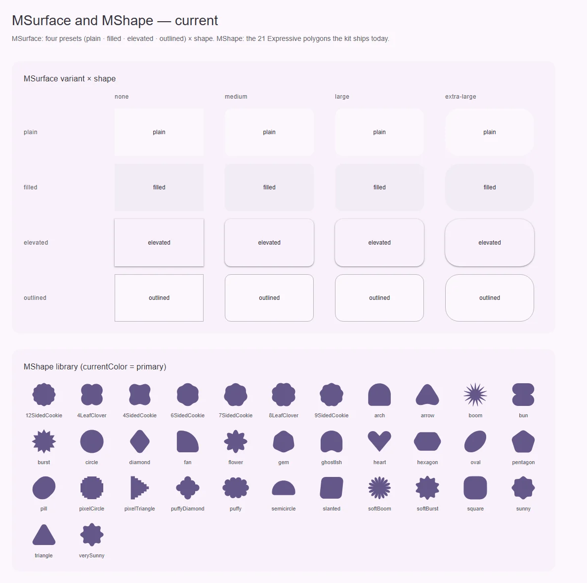
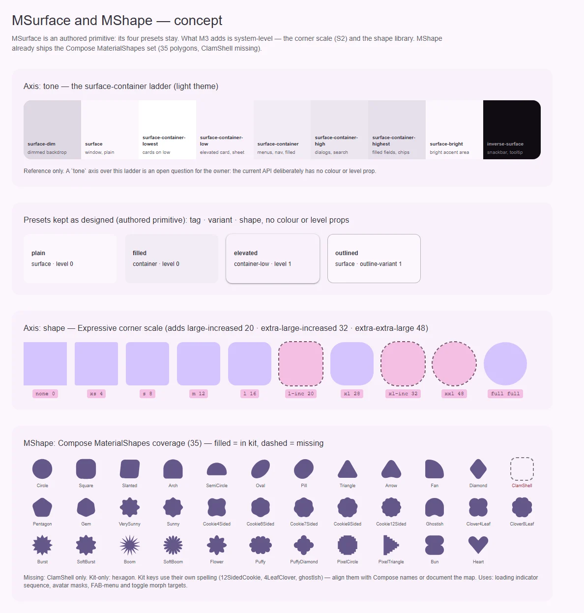

# MShape — фигуры Expressive и морфинг между ними

<identity>M3: Styles → Shape → Shape library (M3 Expressive, 35 фигур) · Исходник: Compose `MaterialShapes.kt`, пружины `ExpressiveMotionTokens` · Код: `src/runtime/components/ui/shape/index.vue`, `src/runtime/assets/icon/shapes.ts`, `src/runtime/composables/useShapeMorph.ts`, `src/runtime/utils/motion/` · Аудит: `data/shape.json` · Тип: public, декоративный примитив</identity>

<implementation-status state="planned" updated="2026-10-07">Библиотека фигур, морф и пружины M3 работают (их потребитель — loading indicator). Не хватает ClamShell, имена расходятся с Compose, нет доступной семантики и общего кэша интерполяторов.</implementation-status>

## Вердикт

`совпадает`. В ките есть почти вся библиотека фигур Expressive: 34 из 35, нет только
ClamShell, плюс собственный `hexagon`. Есть морф между фигурами на пружинах M3. Разрыв
небольшой:
- ключи фигур названы иначе, чем в Compose (`12SidedCookie` вместо `Cookie12Sided`, `ghostIsh`
  вместо `Ghostish`);
- у SVG нет `aria-hidden`;
- каждый экземпляр заново строит интерполяторы.

## Рендеры

| Сейчас | Концепт |
|---|---|
|  |  |

Рендеры общие с [MSurface](surface.md). На текущем — все фигуры кита. На
концепте — покрытие библиотеки Compose: залитые фигуры есть в ките, пунктир — нет. Нет
только ClamShell.

## Анатомия

| # | Часть | В ките | Статус |
|---|---|---|---|
| 1 | Фигура (RoundedPolygon в Compose) | `<svg viewBox="0 0 380 380"><path :d fill="currentColor">` | есть |
| 2 | Цвет | `currentColor` от родителя | есть |
| 3 | Морф между фигурами | `useShapeMorph` (интерполяция путей, вращение) | есть |
| 4 | Последовательность (loading indicator) | проп `sequence`, кэш пар для цикла | есть, кэш локален экземпляру |

## Оси дизайна

| Ось | M3 | Кит сейчас | Цель | Ломает API |
|---|---|---|---|---|
| `name` | 35 фигур `MaterialShapes` | 35 ключей в `M3_SHAPES`, ClamShell нет, `hexagon` сверх | Добавить `clamShell`. Алиасы имён Compose (вопрос 1) | нет |
| `transition` | Пружины expressive / standard × fast / default / slow | `MorphTransitionInput`, дефолт `'expressive'`; пружины в `utils/motion` (`M3_SPRING`) | совпадает | — |
| `duration` | Выводится из пружины | Опциональный override | совпадает | — |
| Смысл (декор или изображение) | — | Всегда безымянная графика | Проп `label` (вопрос 2) | нет |

## Оси состояний

| Ось | Нужно | Есть | Не хватает |
|---|---|---|---|
| Движение | Морф на пружине; reduced motion сокращает | Пружины в JS | Проверить, что морф уважает `prefers-reduced-motion`: укорачивается, а не исчезает |
| Доступность | Декоративная фигура скрыта от AT | — | `aria-hidden="true"` и `focusable="false"` по умолчанию (A11-05) |

## Токены: расхождения

| Часть | M3 | Кит сейчас | Действие |
|---|---|---|---|
| Пружина expressive default spatial | damping 0.8, stiffness 380 | `M3_SPRING` в `utils/motion` | совпадает (сверено спекой `utils/motion/index.spec.ts`) |
| Пружина standard | damping 0.9, stiffness 700 / 1400 / 300 | `M3_SPRING` | сверить три пары со `StandardMotionTokens` при шаге 4 |
| CSS-токены пружин | — | нет | Появятся по S4. `MShape` их не потребляет (морф в JS), но значения должны совпасть |

## Поведение и доступность

- По умолчанию фигура декоративная: `aria-hidden="true"`, `focusable="false"`.
- Если фигура несёт смысл (статус, аватар-заглушка), нужен `role="img"` и `aria-label`.
- Аудит:
  - A11-05 — шаг 2;
  - EN-10 (кэш на экземпляр: N индикаторов на странице строят одни и те же пары N раз) — шаг 3;
  - DC-01…05 (документации нет) — шаг 5.

## API

| Что | Изменение | Ломает |
|---|---|---|
| `name` | Добавить `clamShell`. Принимать и имена в стиле Compose (`cookie12Sided`) как алиасы, если выбран вариант 1 вопроса 1 | нет |
| `label?: string` | Новый: при наличии — `role="img"` + `aria-label`, без него — `aria-hidden` | нет |

## План работ

1. **S — ClamShell.** Добавить путь в `assets/icon/shapes.ts`, сгенерировав его из
   `MaterialShapes.kt` тем же способом, что и остальные.
2. **S — доступность.** `aria-hidden`/`focusable` по умолчанию и проп `label`. Спека на оба
   режима.
3. **M — общий кэш интерполяторов.** Ключ — пара канонических фигур. Модульный `Map`
   переживает экземпляры, а на SSR не создаётся (морф только на клиенте).
4. **S — сверка пружин.** Таблица в спеке `utils/motion` против `ExpressiveMotionTokens` и
   `StandardMotionTokens`.
5. **S — документация.** Список фигур с превью, `currentColor`, морф, `sequence`, reduced
   motion, когда фигура декоративная.

## Тесты

- Unit:
  - каждое имя из `M3_SHAPES` даёт непустой `d`;
  - `label` переключает `role="img"` и `aria-hidden`;
  - кэш: второй экземпляр с тем же `sequence` не строит пары заново (шпион на построителе).
- e2e: на фикстуре loading indicator под `prefers-reduced-motion: reduce` морф всё равно идёт,
  но быстрее.

## Готово, когда

- 35 фигур Compose доступны.
- Декоративная фигура не попадает в дерево доступности, значимая — объявляется по имени.
- На странице с десятью индикаторами интерполяторы строятся один раз.

## Предложения по UX

Расширения сверх паритета с M3. Это предложения владельцу, а не шаги плана: в «План работ» попадают только после решения. Без Expressive-анимаций и без новых зависимостей.

| Предложение | Что получает пользователь | Заказчик | Цена | Рекомендация |
|---|---|---|---|---|
| Фигура как маска изображения (`MShape` → `clip-path` для аватара и обложки) | Аватары и превью в фигурах Expressive (cookie, clover) без своих SVG у продукта | avatar, карточки с медиа | S · статичная маска, без морфа | да, после плана avatar |
| Статичный выбор фигуры по состоянию (например, у выбранного элемента другая фигура) без анимации | Выбор читается формой, не только цветом | chip filter, toggle-кнопки | S · CSS-класс, без JS | обсудить: пересекается с S3 «статичная форма допустима» |

## Открытые вопросы

**1. Имена фигур.**
1. Оставить ключи кита и добавить алиасы в стиле Compose. Ничего не ломается, но у каждой
   фигуры два имени.
2. Переименовать ключи в стиль Compose (`cookie12Sided`, `clover4Leaf`) с деприкацией старых.
   Один словарь с M3, но это ломающее изменение для потребителей `MShape` и loading.
3. Оставить как есть, сопоставление описать в документации.

Рекомендация: 3. Имена — внутренняя деталь, а M3 публикует фигуры картинками, а не ключами.

**2. Нужен ли `label` (значимая фигура)?**
1. Да: аватар-заглушка или статус-фигура без имени — это дефект доступности.
2. Нет: фигура всегда декор, смысл передаёт обёртка.

Рекомендация: 1, это дёшево и закрывает A11-05 полностью.
