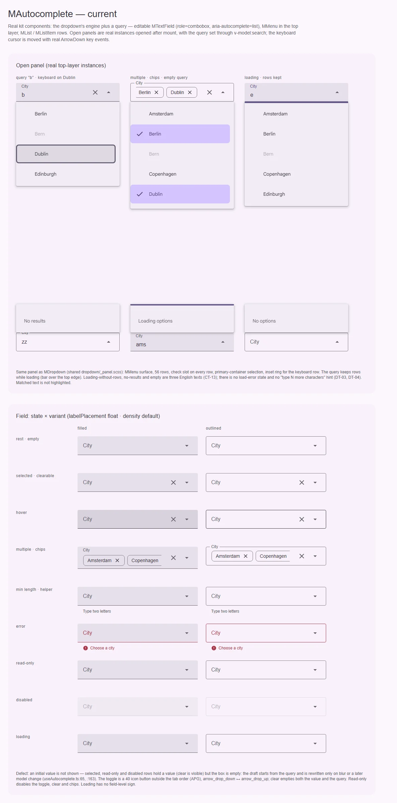
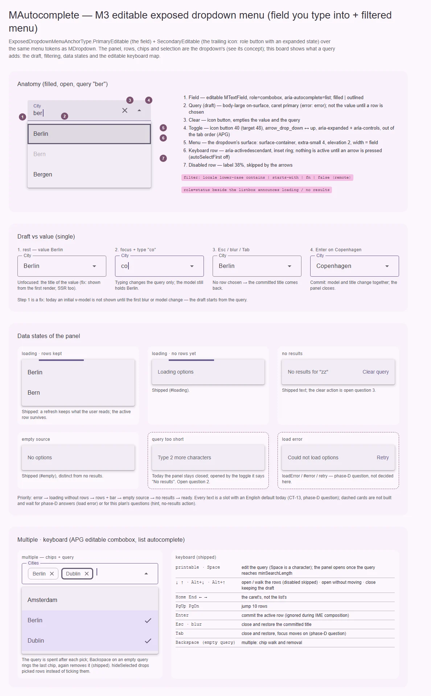

# MAutocomplete — поле выбора с поиском: M3 editable exposed dropdown menu

<identity>M3: Menus → exposed dropdown menu, редактируемый якорь (`ExposedDropdownMenuAnchorType.PrimaryEditable` — поле, `SecondaryEditable` — trailing-иконка с ролью кнопки и состоянием раскрытия) · Токены Compose: `FilledAutocompleteTokens.kt`, `OutlinedAutocompleteTokens.kt`, `MenuTokens.kt`, `ListTokens.kt`; поведение — `ExposedDropdownMenu.kt` · Код: `src/runtime/components/ui/autocomplete/` (`index.vue`, `props.ts`), `src/runtime/composables/autocomplete/useAutocomplete.ts` поверх `composables/dropdown/useDropdownControl.ts`, токены `src/runtime/assets/stylesheet/components/autocomplete/_index.scss` (= токены дропдауна + `toggle`) и общий `dropdown/_panel.scss` · Аудит: `data/autocomplete.json` · Тип: public; член семейства выбора — [MDropdown](dropdown.md) плюс запрос</identity>

<implementation-status state="planned" updated="2026-10-07">Компонент — витрина фазы D (строки не исчезают при загрузке, панель не открывается до `minSearchLength`, постоянный live-регион, Home / End отданы каретке, toggle вне таб-порядка с `aria-expanded` / `aria-controls`, IME). Найден дефект: начальное значение не показывается в поле (шаг 1). Панель, строки, чипы и долги меню — общие с дропдауном и идут его шагами; свои шаги — черновик, подсказка «мало символов», сброс в «нет результатов», открытие по фокусу.</implementation-status>

## Вердикт

**Дрейф.** Это editable exposed dropdown M3: в поле печатают запрос, список фильтруется, выбранное
значение и черновик — разные вещи (Escape и blur возвращают выбранный заголовок), trailing-кнопка
раскрывает меню и не стоит в таб-порядке. Расхождения с M3 — те же, что у панели дропдауна (роль
выбора, отступ 56 против 16, hover 10 %, disabled прозрачностью, роль `menu` вокруг listbox).
Собственное: начальное значение не рисуется до первого blur или смены модели, toggle не краснеет в
ошибке, а у данных нет подсказки «введите ещё N символов» и действия сброса в «нет результатов».

## Рендеры

| Сейчас | Концепт M3 |
|---|---|
|  |  |

**Сейчас** — настоящие компоненты, открытые панели — настоящие экземпляры в top layer с запросом
через `v-model:search`, курсор клавиатуры — настоящие `keydown ArrowDown`.
1. Открытая панель: запрос «b» (курсор на Dublin, Bern отключён и пропущен), множественный выбор с
   чипами и пустым запросом, загрузка со строками; перевёрнутые вверх: «No results», загрузка без
   строк «Loading options», пустой источник «No options».
2. Поле: состояние × вариант. **Дефект:** в строках «выбрано», read-only и disabled модель держит
   значение (крестик очистки виден), а поле пустое.

**Концепт:**
1. Анатомия открытого filled-поля с запросом «ber» — 7 частей.
2. Черновик и значение: покой (значение видно с первого рендера — починка), ввод «co», Esc / blur /
   Tab возвращают Berlin, Enter фиксирует Copenhagen.
3. Состояния данных панели и их приоритет; пунктиром — не построенные: «мало символов» (вопрос 2) и
   ошибка загрузки (вопрос фазы D); «Clear query» в «нет результатов» — вопрос 3.
4. Множественный выбор (чипы + запрос) и клавиатура editable combobox.

## Анатомия

Нумерация — по кадру 1 концепта. Панель и строки — [анатомия дропдауна](dropdown.md#анатомия).

| # | Часть M3 | Элемент кита | Статус |
|---|---|---|---|
| 1 | Text field (`PrimaryEditable`) | `MTextField.ui-autocomplete__field`, `inputAttrs` с `role="combobox"`, `aria-autocomplete="list"` (`index.vue:10-33`) | есть |
| 2 | Ввод (черновик) | `control.draft` → `model-value` поля | есть; начальное значение не рисуется (шаг 1) |
| 3 | — | `MButtonIcon.ui-autocomplete__clear` (`:82-92`) — очищает значение и запрос | есть; дополнение кита |
| 4 | Trailing icon (`SecondaryEditable`: role button + expanded) | `MButtonIcon.ui-autocomplete__toggle`, `tabindex="-1"`, `aria-expanded`, `aria-controls` (`:96-108`) | есть; роль `error` — нет |
| 5 | Menu | `MMenu.ui-autocomplete__menu` + `dropdown/_panel.scss` | как у дропдауна |
| 6 | Фокус пункта | `--keyboard` → `focus-ring(inset)` | есть; до первой стрелки активной строки нет (`autoSelectFirst: false`) |
| 7 | Disabled пункт | `MListItem` disabled | как у дропдауна (ST-06) |
| — | Состояния данных | слоты `#loading`, `#empty`, `#no-results` (`:189-219`) | есть; нет `#error`, `#hint` |
| — | Live-регион | `span.ui-autocomplete__status` `role="status"` | есть |

## Оси дизайна

Все оси поля и выбора — из `mDropdownProps` ([дропдаун](dropdown.md#оси-дизайна)). Свои:

| Ось | M3 | Кит сейчас | Цель | Ломает API |
|---|---|---|---|---|
| Фильтр | не задан (приложение) | `filter: fn \| false`, `filterMode: 'contains' \| 'starts-with'`, регистр — `toLocaleLowerCase` | без изменений; диакритика — «Предложения по UX», п. 2 | нет |
| Порог запроса | — | `minSearchLength` (0) | подсказка — вопрос 2 | нет |
| Открытие | клик / ввод открывают, фокус IME не отбирается | `openOnFocus: true` (открывает и по Tab) | вопрос 4 | дефолт — да |
| Выбранные строки | — | `hideSelected` | без изменений | нет |
| Первая строка активна | — | `autoSelectFirst: false` | без изменений | нет |
| Автозаполнение браузера | — | `autocomplete: 'off'` | без изменений (`:autofill` — у `MTextField`, FM-09) | нет |

## Оси состояний

Из `axes` аудита, сверено с кодом.

| Ось | Нужно | Есть | Не хватает |
|---|---|---|---|
| Базовое | enabled, disabled, read-only | read-only: инпут `readonly`, toggle / clear / чипы disabled | `aria-disabled` (IN-08) — вопрос фазы D |
| Взаимодействие | hover строк и кнопок | слои строк, цвет clear / toggle | hover строки 8 % (шаг дропдауна 1) |
| Фокус | инпут, курсор, чип | цвет поля; кольцо строки и чипа | — |
| Выбор | single, multiple, hideSelected, max | есть | роль выбора — как у дропдауна |
| Раскрытие | open / closed на инпуте и toggle | `aria-expanded` на обоих | — |
| Смысловое | error | от `MTextField` | toggle `error` (шаг 2) |
| Валидация | invalid, required, touched, validating | `useField` по **выбору**, не по тексту (`index.vue:282`) | `aria-busy` по `pending` (FM-06, шаг 2) |
| Данные | loading, refreshing, empty, no results, short query, error | строки держатся при загрузке, полоса, `#loading` / `#empty` / `#no-results`, live-регион | «мало символов» (DT-03, вопрос 2), сброс в no-results (вопрос 3), ошибка + retry и задержка индикатора (вопросы фазы D) |

## Токены: расхождения

Карта `autocomplete/_index.scss` = карта дропдауна + `toggle` (копия `clear`). Все расхождения
панели, строк и стрелки — в [таблице дропдауна](dropdown.md#токены-расхождения).
Свои:

| Часть | M3 (Compose) | Кит сейчас | Действие |
|---|---|---|---|
| Toggle в ошибке | `TextFieldErrorTrailingIconColor` = `error`, hover — `on-error-container` | `toggle.color` `on-surface-variant` всегда (`autocomplete/_index.scss:13`, `index.vue:343-357`) | `toggle.error.color`, `toggle.error.hover.color` |
| Toggle в фокусе поля | `TextFieldFocusTrailingIconColor` = `on-surface-variant` | `on-surface-variant`; `on-surface` на hover / focus-visible кнопки | совпадает (смена на hover — слой кнопки) |
| Каретка | `TextFieldCaretColor` `primary`, в ошибке `error` | не задана | шаг 1 [text-field.md](text-field.md) — доходит автоматически |

## Поведение и доступность

Сделано: APG editable combobox с list autocomplete — печать меняет запрос, Space — символ, Home /
End и стрелки влево-вправо — каретка, ↑/↓ открывают и ходят (disabled пропускаются), Alt+↓ открывает
без движения, Alt+↑ закрывает с черновиком, PageUp / PageDown ±10, Enter фиксирует активную строку
(не во время IME), Esc и blur закрывают и возвращают выбранный заголовок, Backspace на пустом
запросе ведёт по чипам; панель не открывается и закрывается, пока запрос короче `minSearchLength`;
строки не исчезают на время загрузки, активная строка переживает её; toggle вне таб-порядка (APG);
фокус в инпут при открытии с кнопки; валидация связывает выбор.

Открыто:
- **Дефект: начальное значение не показывается.** `draft` стартует из `search`
  (`useAutocomplete.ts:65`), а `restore()` зовётся только на blur и на смену модели
  (`:151-165`, `watch` без `immediate`). Поле с `v-model="2"` пусто до первого взаимодействия, в
  SSR тоже. Ни одна спека этого не проверяет. → шаг 1. Не чинится молча: в плане, ждёт подтверждения.
- **DT-03** — подсказка «введите ещё N символов» (вопрос 2) и сброс запроса в «нет результатов»
  (вопрос 3). Сейчас при `minSearchLength` toggle открывает панель с «No results».
- **Открытие по фокусу:** при `minSearchLength: 0` (по умолчанию) панель открывается и тогда, когда
  в поле пришли Tab'ом, — проход по форме с клавиатуры раскрывает каждое поле (вопрос 4).
- **CT-12** — сравнение без `normalize('NFD')`: «Zurich» не находит «Zürich» («Предложения по UX»,
  п. 2).
- **Общее с дропдауном:** роль `menu` и прочие долги `MMenu`, A11-04 (имя чипа), CT-08 / DT-08,
  CT-11, CT-13, IN-08, Tab при открытом списке, ошибка загрузки, задержка индикатора — шагами и
  вопросами [дропдауна](dropdown.md) и фазы D.
- **FM-09** (`:autofill`) — у `MTextField`. **Ручные:** FM-04, CT-06, LY-03, LY-07, RS-01, RS-02,
  RS-06, RS-07, RS-11 (клавиатура не перекрывает панель: JS-путь считает layout viewport), TH-02,
  TH-03, TH-08, A11-13, EN-11, TS-06. **Принято:** RS-04, RS-05, TS-04, TK-09. **Вне репозитория:**
  DC-01…05.

## API

Сейчас: всё из `mDropdownProps` + `autocomplete`, `filter`, `filterMode`, `minSearchLength`,
`hideSelected`, `autoSelectFirst`, `openOnFocus`; модели `modelValue`, `search` (меняется на каждый
символ, debounce — у приложения), `open`; события `select`, `remove`, `clear`, `open`, `close`;
слоты `prepend`, `append`, `selection`, `chip`, `item`, `loading`, `empty`, `no-results({ query })`,
`default`; `expose` — `open`, `close` (= `closeAndRestore`), `clear` (= `clearQuery`).

Из прежнего плана остаётся в силе: транспорта, `fetch`, `debounce` и кэша выбранных записей у
компонента нет; удалённый поиск — `filter: false` + рецепт `refDebounced` / `useAsyncData`;
выбранное значение без совпавшего элемента рисуется запасной строкой (`decisions.md`, «выбор от
модели»); слот `#item` меняет содержимое, но не семантический корень `option`.

| Действие | Что | Ломает | Миграция |
|---|---|---|---|
| Изменить | `openOnFocus` — по вопросу 4 | да (дефолт) | при варианте 2 — `openOnFocus: 'pointer'` по умолчанию, `true` сохраняет старое |
| Добавить | слот `#hint({ query, missing })` | нет | вопрос 2 |
| Добавить | в слот `#no-results` — `clear` | нет | вопрос 3 |
| Добавить | `#error`, `retry` | нет | ответ фазы D (общий с дропдауном) |
| Унаследовать | `menuPlacement`, удаление чипа | да | шагами дропдауна |

## План работ

1. **S — начальное значение в поле** (дефект, после подтверждения владельцем). После создания
   `control` при пустом `search` и одиночном выборе записать `displayTitle` в черновик (одним
   вызовом `restore()` в setup — работает в SSR). Спека «смонтированное значение видно».
   Файлы: `composables/autocomplete/useAutocomplete.ts`, `autocomplete/tests/variants.spec.ts`.
2. **S — роли без смены API.** `toggle.error.*`; `aria-busy` по `pending` — тем же шагом, что
   дропдаун (шаг 1 там, общий `useDropdownControl.inputAttrs`). Файлы:
   `autocomplete/_index.scss`, `autocomplete/index.vue`.
3. **M — панель и строки** — шаги 2–3 дропдауна (общий `_panel.scss`, тот же PR).
4. **S — подсказка и сброс** (после вопросов 2–3): `#hint`, `clear` в `#no-results`, ветка
   `!queryReady` при явном открытии. Файлы: `autocomplete/index.vue`,
   `composables/dropdown/usePanelStatus.ts`.
5. **S — открытие по фокусу** (после вопроса 4): различать фокус указателем и клавиатурой
   (`:focus-visible` на инпуте в момент фокуса). Файлы: `useAutocomplete.ts`, `props.ts`.
6. **L — чипы** — шаг 4 дропдауна ([план чипа](../form/chip.md), В-4).
7. **M — данные по ответам фазы D** — шаг 5 дропдауна.
8. **M — тесты** (раздел ниже). Документация DC-01…05 — в репозитории `docs` (когда autocomplete,
   когда dropdown, рецепт удалённого поиска).

## Тесты

- **Фикстуры** `playground/fixtures/autocomplete/`: `matrix.vue` — строка «выбрано» должна
  показывать заголовок (регрессия шага 1), «ошибка + hover»; `stress.vue` — диакритика и CJK
  (CT-12), 1000 строк при пустом запросе.
- **e2e** (`autocomplete.e2e.ts`): начальное значение видно до взаимодействия; toggle в ошибке —
  `error`; при `minSearchLength` toggle показывает `#hint`, а не «No results» (после вопроса 2);
  Tab в поле не открывает панель (после вопроса 4); axe без исключений после шага 3 дропдауна.
  Существующие: клавиатура, IME, черновик и восстановление, переполнение, axe.
- **unit** (`variants.spec.ts`, `interaction.spec.ts`): заголовок при монтировании с `modelValue`
  (single) и пустой черновик (multiple); `clear` в слоте `#no-results`; `openOnFocus` по виду фокуса.

## Готово, когда

- [ ] Поле с начальным значением показывает его заголовок с первого рендера, включая SSR.
- [ ] Toggle и стрелка красятся по ролям ошибки и disabled.
- [ ] Короткий запрос даёт подсказку или не открывает панель, но не «No results».
- [ ] Всё из «Готово, когда» дропдауна для панели и чипов.
- [ ] `npm run lint`, `lint:style`, `lint:scss`, `typecheck`, vitest, e2e `autocomplete` — зелёные.

## Предложения по UX

1. **Подсветка совпадения.** В строке по умолчанию совпавшая часть заголовка выделяется весом
   (`<mark>` со стилем `font-weight: 500`, без фона), для `contains` и `starts-with`. Пользователь
   видит, почему строка попала в список. Заказчик — поиск города, пользователя, SKU. Цена: S,
   бандл — один хелпер разбиения строки, API не меняется (свой `#item` — без подсветки или через
   экспорт хелпера). Рекомендация: **взять**.
2. **Поиск без учёта диакритики.** Сравнение по `normalize('NFD')` без знаков ударения: «Zurich»
   находит «Zürich», «Sao» — «São» (CT-12). Заказчик — адреса, имена. Цена: S, без зависимостей;
   поведение меняется (результатов больше) — включить по умолчанию или флагом
   `filterIgnoreAccents`. Рекомендация: **взять, по умолчанию включено** — пропуск совпадения хуже
   лишней строки.
3. **Свободные значения (роль combobox / `VCombobox`).** Из прежнего плана дропдауна, теперь на
   редактируемом поле: `allowCustom` + `createValue(query) → TValue | Promise<TValue>`;
   синтетическая строка «Добавить “{query}”» участвует в навигации; точное совпадение важнее
   создания; `createOn: ['enter']` по умолчанию, blur — по желанию, разделители при вставке пачкой
   и не во время IME; дубликаты — по `valueComparator`; `items` не мутируется; во время Promise
   строка в состоянии создания, повтор заблокирован, ошибка сохраняет запрос. Заказчик — теги,
   e-mail-получатели. Цена: L, новый API и строки по умолчанию (CT-13). Рекомендация: **взять,
   когда появится заказчик**; до тех пор записать в `decisions.md`, что отдельного `MCombobox` не
   будет — роль ляжет сюда.
4. **Inline-дополнение (`aria-autocomplete="both"`).** Серый «хвост» лучшего совпадения в самом
   поле. Цена: M, конфликт с IME и с выделением. Рекомендация: **не брать** — список уже даёт то же
   без борьбы с кареткой.

## Открытые вопросы

Здесь не повторяются: вопросы фазы D (Q10–Q17 в итоге сессии,
[qa-fix-showcase-fields](../../../../summary/qa-fix-showcase-fields_2026-10-07_0100.md)) — ошибка
загрузки, Tab при открытом списке, английские строки, когда показывать ошибку, `aria-disabled`,
задержка индикатора; и вопросы [дропдауна](dropdown.md#открытые-вопросы)
1–3 (высота строки, место галочки, намёк на продолжение) — решаются для семейства сразу.

**1. Чинить ли начальное отображение значения как дефект.** Проверено по коду
(`useAutocomplete.ts:65`, `:163`), спек нет.
1. Да, шаг 1: заголовок выбранного значения в поле с первого рендера (single), пустой черновик
   (multiple). Цена: S; потребитель, который полагался на пустое поле, увидит значение.
2. Нет, оставить: значение показывает приложение через `v-model:search`. Цена: каждый потребитель
   дублирует заголовок, SSR рисует пустое поле.

Рекомендация: 1 — прежний план и концепт черновика («неактивное поле показывает заголовок выбранного»)
это и требуют.

**2. Что показать, пока запрос короче `minSearchLength` (DT-03).**
1. Слот `#hint({ query, missing })` и текст по умолчанию после ответа на CT-13; при явном открытии
   (toggle, ↓) панель показывает подсказку. Цена: новый слот, строка по умолчанию — позже.
2. Не открывать панель вовсе, toggle неактивен до порога. Цена: кнопка, которая ничего не делает,
   без объяснения.
3. При явном открытии показывать все строки, игнорируя порог. Цена: порог теряет смысл, если он
   стоял ради производительности.

Рекомендация: 1.

**3. Действие в «нет результатов».**
1. Слот `#no-results` получает `clear`; кнопку рисует приложение. Цена: без кнопки по умолчанию.
2. Кнопка «Очистить запрос» по умолчанию. Цена: новая строка (CT-13).
3. Ничего. Цена: пользователь стирает запрос руками.

Рекомендация: 1 сейчас, 2 после ответа на CT-13.

**4. Открывать ли панель по фокусу с клавиатуры.** `openOnFocus: true` раскрывает список и при
проходе формы Tab'ом.
1. Оставить `true`. Цена: каждый Tab через поле раскрывает панель и объявляет listbox.
2. По умолчанию открывать только по фокусу указателем (клик), с клавиатуры — по вводу и ↓ (как в
   примерах APG); `openOnFocus: true` возвращает прежнее. Цена: смена поведения по умолчанию.
3. `false` по умолчанию: открытие только вводом, ↓ и toggle. Цена: клик в пустое поле больше не
   показывает варианты.

Рекомендация: 2.
