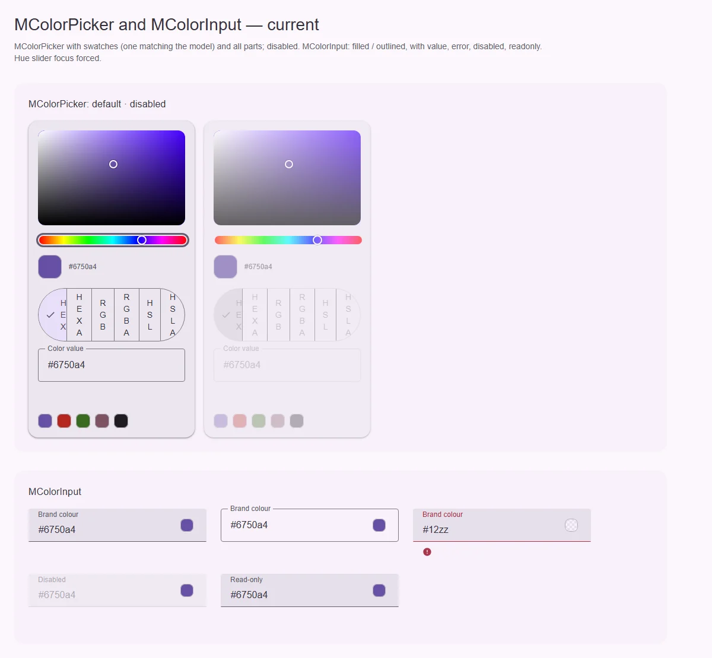
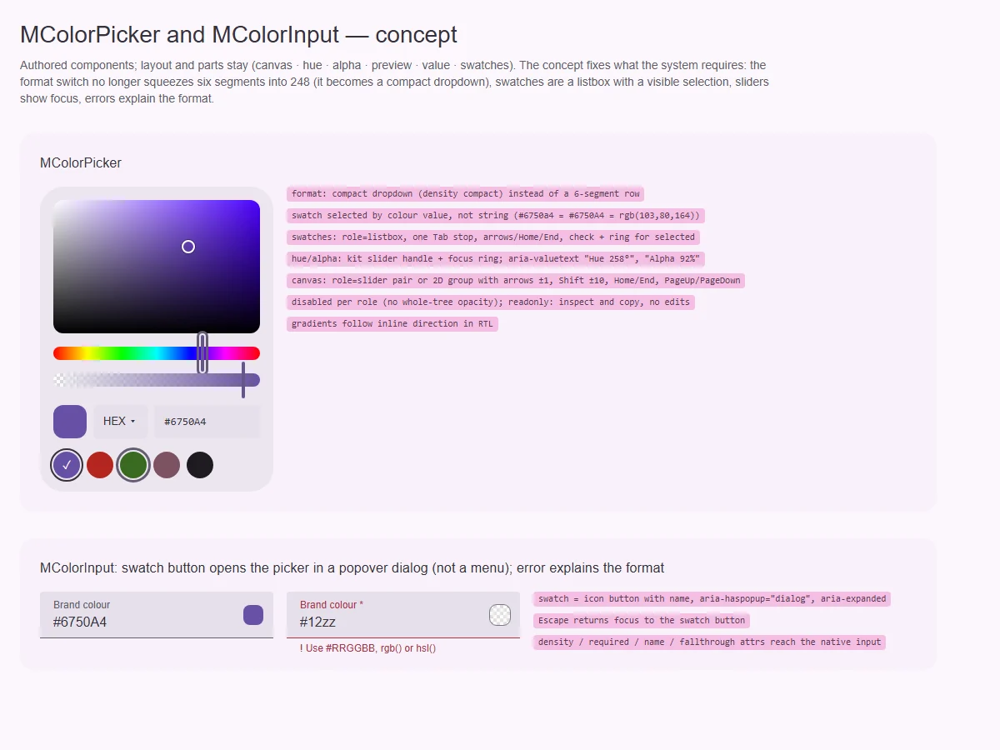

# MColorInput — поле цвета с выбором из пикера

<identity>M3: компонента нет; авторский компонент кита — поле M3 (`MTextField`) + кнопка-образец + всплывающий `MColorPicker` · Токены Compose: через `MTextField` · Код: `src/runtime/components/ui/color-input/` · Аудит: `data/color-input.json` · Тип: public</identity>

<implementation-status state="planned" updated="2026-10-07">Реализован и одобрен 2026-07-14: композиция `MTextField + MButtonIcon + MMenu + MColorPicker`, черновик и коммит (`commit: change | input`), `format` с `auto`, `clearable`, `picker`. Открыты: всплывающая панель — `role="menu"`, которое ломает клавиатуру пикера; фокус после Escape уходит на `span`; ошибка без текста; `required`, `name`, `density` и атрибуты не доходят до инпута.</implementation-status>

## Вердикт

`авторский`. Композиция и модель черновика остаются: решение одобрено, второго движка цвета нет.
Прежний план уже предусматривал переход с `MMenu` на будущий оверлей — он и нужен:
- панель внутри `MMenu` получает `role="menu"`, а пикер — не меню: меню гасит стрелки, Home и
  End у ползунков и полей (A11-06, A11-08);
- после Escape фокус уходит на обёртку-`span`, а не на кнопку (A11-12);
- объявленные `required` и `name` нигде не используются (EN-01, FM-10);
- `density` полей не пробрасывается (LY-08);
- атрибуты уходят на корень `MTextField`, а не на `input` (EN-04);
- ошибка без сообщения — только цвет (FM-02, TH-05).

## Рендеры

| Сейчас | Концепт |
|---|---|
|  |  |

Рендеры общие с [MColorPicker](color-picker/index.md), поле — нижний кадр.

Сейчас: filled, outlined, ошибка (только значок), disabled, read-only.

Концепт: кнопка-образец открывает пикер во всплывающем диалоге; ошибка с подсказкой формата;
`*` у обязательного.

## Анатомия

| # | Часть | В ките | Статус |
|---|---|---|---|
| 1 | Поле | `MTextField` | есть; атрибуты и `required` не доходят |
| 2 | Кнопка-образец | `MButtonIcon` внутри `span.ui-color-input__trigger-wrap` | есть; фокус возвращается на `span` |
| 3 | Всплывающий пикер | `MMenu` → `MColorPicker` | иначе: `role="menu"` |
| 4 | Строка поддержки | от `MTextField` | есть; текста ошибки по умолчанию нет |

## Оси дизайна

| Ось | Значения | Цель |
|---|---|---|
| `variant` | `filled \| outlined` | сузить через `Extract<MTextFieldVariant>` |
| `density` | от полей | пробросить `fieldDensityProp` (LY-08) |
| `format` | форматы + `auto` | решено |
| `commit` | `change \| input` | решено |

## Оси состояний

| Ось | Нужно | Есть | Не хватает |
|---|---|---|---|
| Раскрытие | `aria-haspopup="dialog"`, `aria-expanded`, `aria-controls` | роль меню | всплывающий диалог |
| Фокус | возврат на кнопку | на `span` | `anchor` — сама кнопка (зависит от правки MMenu про `anchor`) |
| Валидация | текст ошибки, `required` | только цвет | сообщение формата, `required` + `*` |

## Поведение и доступность

- **Всплывающая панель.** Внутренний popover-примитив из плана [menu](../overlays/menu.md)
  (вопрос 2) с `role="dialog"` и именем. Клавиатура пикера внутри работает без перехвата.
  Escape закрывает и возвращает фокус на кнопку-образец.
- **Имя кнопки.** Из пропа (`pickerLabel`), без английского дефолта (CT-13).
- **Атрибуты.** `inheritAttrs: false` и `useControlAttrs` — на инпут, как у остальных полей
  (решение Q9).
- **RTL.** Логическая сторона выравнивания панели (LY-10).

## API

| Что | Изменение | Ломает |
|---|---|---|
| `required`, `name` | начинают работать | исправление |
| `density` | новый (от полей) | нет |
| `pickerLabel` | новый, без дефолта | видимо для AT |
| `errorMessage` по умолчанию | при внутренней ошибке парсинга — шаблон из пропа `formatHint` | нет |
| атрибуты | на `input` | для `aria-*`, переданных с корня, — исправление |

## План работ

1. **M — всплывающий диалог вместо `MMenu`** (A11-06, A11-08, A11-12), после примитива из
   плана menu.
2. **S — `required`, `name`, `density`, атрибуты на инпут** (EN-01, FM-10, LY-08, EN-04).
3. **S — сообщение формата** (FM-02, FM-03, TH-05).
4. **S — имя кнопки, RTL** (CT-13, LY-10).
5. **S — forced colors у образца** (TH-04), **токены** (LY-04, TK-02).
6. **S — документация.**

## Тесты

- Unit:
  - стрелки внутри открытого пикера двигают hue;
  - Escape возвращает фокус на кнопку;
  - `required` → `aria-required` и `*`;
  - `name` у инпута;
  - сообщение при невалидном вводе.
- e2e: axe с открытым пикером; клавиатура пикера внутри поля.

## Готово, когда

- Пикер в поле работает с клавиатуры.
- Фокус возвращается на кнопку.
- Обязательность и ошибка объявляются текстом.

## Предложения по UX

Расширения сверх паритета. Это предложения владельцу, а не шаги плана. Без новых зависимостей.

| Предложение | Что получает пользователь | Заказчик | Цена | Рекомендация |
|---|---|---|---|---|
| Вставка цвета в любом формате с автонормализацией (`format="auto"` уже есть — сделать дефолтом для вставки) | Скопированный из дизайна `rgb(…)` принимается как есть | настройки темы | S | да |
| Кнопка копирования значения в read-only | Значение цвета уходит в буфер одним кликом | дизайн-системы, docs | S · общий с предложением `copyable` у text-field | обсудить |

## Открытые вопросы

Нет: переход на всплывающий диалог был предусмотрен прежним решением («future MOverlay»).
