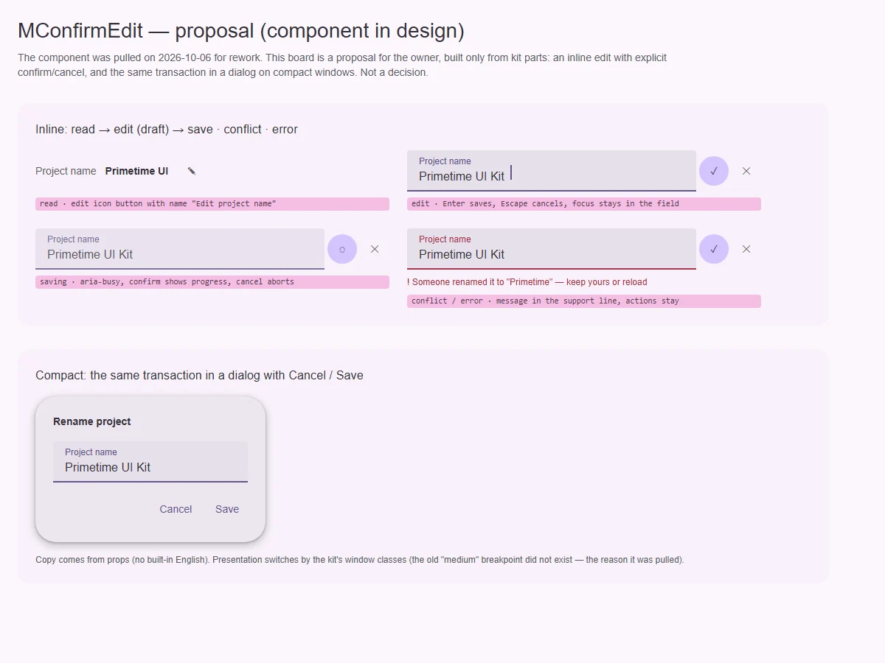

# MConfirmEdit — правка с явным подтверждением (в проработке)

<identity>M3: компонента нет; авторский компонент кита · Код: компонент снят 2026-10-06, в `src/runtime/components/ui/confirm-edit/` лежит только `README.md`; последняя реализация — `git show f5287e1 -- src/runtime/components/ui/confirm-edit src/runtime/composables/confirm-edit` · Аудит: `data/confirm-edit.json` (по снятой реализации) · Тип: public (снят)</identity>

<implementation-status state="pending" updated="2026-10-07">Компонент снят с публикации на переработку по решению владельца: `presentation: 'auto'` проверял несуществующий брейкпоинт `medium` и никогда не переключался в диалог, API слотов не был объявлен, тексты зашиты по-английски. План — предложение для обсуждения, а не утверждённая спецификация.</implementation-status>

## Вердикт

`авторский`, в проработке. Это предложение, вид и API решает владелец. Задача компонента:
правка значения как транзакция — черновик, подтверждение, отмена, сохранение с ожиданием,
конфликт и ошибка. Решение показывается в строке (inline) или в диалоге на узких окнах.

## Рендеры

| Сейчас | Концепт (предложение) |
|---|---|
| — (снят) |  |

Концепт:
1. В строке — чтение → правка → сохранение → конфликт/ошибка с иконками подтверждения и отмены.
2. На compact — та же транзакция в диалоге «Отмена / Сохранить».

## Анатомия предложения

| # | Часть | Из чего собирается |
|---|---|---|
| 1 | Чтение | значение + `MButtonIcon` «Изменить …» |
| 2 | Правка | поле семейства полей (`MTextField` / любое через слот `#editor`) |
| 3 | Подтверждение / отмена | `MButtonIcon` tonal ✓ и standard ✕; в диалоге — текстовые кнопки |
| 4 | Ожидание | `loading` у кнопки подтверждения, `aria-busy` у поля |
| 5 | Конфликт и ошибка | строка поддержки поля + действия «оставить моё / обновить» |
| 6 | Диалог (compact) | `MDialog` с теми же частями |

## Оси дизайна (предложение)

| Ось | Значения | Комментарий |
|---|---|---|
| `presentation` | `inline \| dialog \| auto` | `auto` — по классу окна из плана [layout](../foundation/layout.md) |
| `density` | от полей | компактная правка в таблице |

## Поведение и доступность (предложение)

- Enter сохраняет, Escape отменяет, фокус остаётся в поле до подтверждения.
- После сохранения фокус возвращается на кнопку «Изменить».
- Транзакция — композабл `useConfirmEditTransaction` (был в снятой реализации): черновик,
  `commit()` → `Promise`, отмена через `AbortSignal`, конфликт как отдельный исход.
- Все тексты — пропы или слоты, без английских дефолтов (Q13).

## План работ (после решения владельца)

1. **M** — Вернуть `useConfirmEditTransaction` с исходами `saved | cancelled | conflict | error`.
2. **M** — Компонент `inline` на частях кита, объявленные слоты (`#editor`, `#actions`,
   `#conflict`, `#error`).
3. **S** — `presentation: 'auto'` на реальных классах окна.
4. **S** — Тексты без дефолтов, документация, фикстуры и e2e.

## Тесты

Исходы транзакции, Enter/Escape, фокус после сохранения, `aria-busy`, конфликт, переключение
`auto` по ширине.

## Готово, когда

Транзакция правки работает в строке и в диалоге, все исходы объявляются, текстов по умолчанию нет.

## Предложения по UX

Расширения поверх предложения. Это предложения владельцу, а не шаги плана.

| Предложение | Что получает пользователь | Заказчик | Цена | Рекомендация |
|---|---|---|---|---|
| Редактируемая ячейка таблицы на `MConfirmEdit` | Правка без перехода на форму | [table](../data/table.md); это же условие возврата варианта `ghost` из `decisions.md` | M | обсудить вместе с table |
| Отмена после сохранения через снекбар «Отменить» | Ошибочную правку можно откатить | настройки | S · `useSnackbar` из плана snackbar | да |

## Открытые вопросы

**1. Нужен ли компонент, или достаточно композабла и рецепта?**
1. Компонент `MConfirmEdit` с режимами inline и dialog. Готовое решение, но ещё один крупный
   публичный API.
2. Только `useConfirmEditTransaction` и рецепт в документации на `MTextField` + `MButtonIcon` +
   `MDialog`. Меньше API, больше гибкости, но каждый продукт собирает разметку сам.

Рекомендация: 2 до появления двух заказчиков с одинаковой разметкой (принцип В4).
