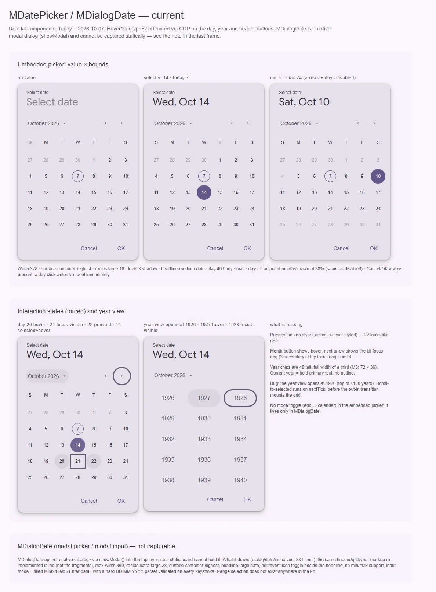
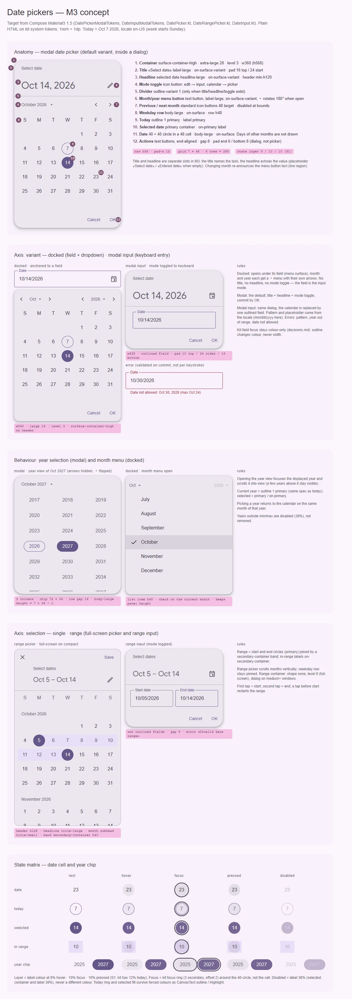

# MDatePicker / MDialogDate — выбор даты: встроенный пикер и модальный диалог (календарь или ввод)

<identity>M3: Date pickers — docked, modal, modal input; range (DateRangePicker) · Токены Compose: `DatePickerModalTokens.kt`, `DateInputModalTokens.kt`; поведение — `DatePicker.kt`, `DateRangePicker.kt`, `DateInput.kt`, `DateRangeInput.kt`, `DatePickerDialog.kt` · Код: `src/runtime/components/ui/date-picker/`, `src/runtime/components/ui/dialog/date/`, фрагменты `src/runtime/components/fragments/date-picker/{header-nav,day-grid,year-grid}/`, `src/runtime/composables/date/index.ts`, токены `src/runtime/assets/stylesheet/components/date-picker/` · Аудит: `data/date-picker.json`, `data/dialog.json` (части про date) · Тип: public (`MDatePicker`, `MDialogDate`), sub (фрагменты)</identity>

<implementation-status state="planned" updated="2026-10-07">Исследование и рендеры готовы, код не менялся. Шаги 1–3 не ломают API и могут идти сразу. Шаги 4–6 ждут ответов на вопросы 1–3 и 6. Range и docked закрыты вопросами 4–5.</implementation-status>

## Вердикт

`переработка`. Календарная сетка узнаётся как M3: круг 40, обводка «сегодня», primary у выбранного дня, сетка лет. Но почти все размеры и роли разошлись: поверхность `surface-container-highest` вместо `-high`, ширина 328 вместо 360, шрифт дня `body-small` вместо `body-large`. Дни соседних месяцев нарисованы. Анатомия M3 собрана наполовину. У встроенного пикера нет переключателя режима и разделителя, а Cancel/OK лежат в нём самом и ничего не подтверждают, потому что клик сразу пишет `v-model`. `MDialogDate` повторяет ту же разметку второй раз в 881 строке, без min/max. Docked- и range-вариантов в ките нет. Чтобы получить M3, придётся сломать API: убрать или переосмыслить футер встроенного пикера, переименовать `headline` и добавить `mode`.

## Рендеры

| Сейчас | Концепт M3 |
|---|---|
|  |  |

**Сейчас** (настоящие компоненты, сегодня = 2026-10-07):
1. Встроенный `MDatePicker`: три пикера — без значения, с выбранной датой и с границами min/max. У стрелок на границе нет вида disabled, дни до min и после max выглядят как дни соседних месяцев.
2. Состояния через CDP. Hover дня работает. Pressed не нарисован: день 22 выглядит как в покое. Кольцо фокуса на дне 21 вышло квадратом на всю ячейку. Год-вью открывается на 1926: это баг, см. шаг 1.
3. `MDialogDate` статично снять нельзя (`showModal()` в top layer), поэтому в кадре текстовое описание.

**Концепт:**
1. Анатомия модального пикера, 12 частей с выносками и токенами.
2. Ось варианта: docked (поле + выпадающий календарь с меню месяца и года) и modal input (outlined-поле), плюс ошибка ввода.
3. Поведение: год-вью (3 колонки, чип 72 × 36, текущий год обведён) и меню месяцев в docked.
4. Ось выбора: range-пикер на весь экран (полоса `secondary-container`) и range input из двух полей.
5. Матрица состояний для даты, «сегодня», выбранной даты, даты в диапазоне и чипа года.

## Анатомия

Нумерация — по кадру 1 концепта.

| # | Часть M3 | Элемент кита | Статус |
|---|---|---|---|
| 1 | Container | `.ui-date-picker` (встроенный), `.ui-date-dialog` (модальный) | иначе: `surface-container-highest`, 328 / max-width 360 литералом |
| 2 | Title «Select date» | `.ui-date-picker__headline-label`, проп `headline` | иначе: `label-medium`, имя пропа совпадает с другой частью M3 |
| 3 | Headline (выбранная дата) | `.ui-date-picker__headline-date` | иначе: `headline-medium`, `on-surface`, у плейсхолдера `opacity: 0.7` |
| 4 | Mode toggle (edit ↔ calendar) | только `.ui-date-dialog__mode-toggle` | нет во встроенном пикере |
| 5 | Divider под шапкой | — | нет |
| 6 | Кнопка меню месяц/год | `.ui-date-picker__view-toggle` | есть. Вместо поворота одной иконки две разные иконки |
| 7 | Предыдущий / следующий месяц | `.ui-date-picker__icon-button` | есть: 40, без вида disabled, свой `<button>` вместо `MButtonIcon` |
| 8 | Строка дней недели | `.ui-date-picker__weekday` | иначе: `body-small`, h40 |
| 9 | Сегодня | `.ui-date-picker__day--today` | иначе: внутренний круг 32 (`index.vue:303`) и `font-weight: bold` |
| 10 | Выбранная дата | `.ui-date-picker__day--selected` | есть. Hover — заранее смешанный цвет (`_docked.scss:72`) |
| 11 | Дата | `.ui-date-picker__day` + `__day-state` | иначе: `body-small`, кнопка шириной в колонку, дни соседних месяцев нарисованы на 38% |
| 12 | Actions (Cancel / OK) | `.ui-date-picker__footer` | иначе: в самом пикере, а не в диалоге; commit фиктивный (FM-12) |
| — | Чип года | `.ui-date-picker__year` | иначе: h48 на всю треть ширины, gap 8 |
| — | Текущий год | `.ui-date-picker__year--current` | иначе: жирный primary без обводки |
| — | Поле ввода (input mode) | `MTextField` в `dialog/date/index.vue:212` | иначе: filled, «Enter date», жёсткий DD.MM.YYYY |
| — | Полоса диапазона, начало и конец | — | нет |
| — | Docked: поле + выпадающий календарь, меню месяца и года | — | нет |

## Оси дизайна

| Ось | M3 | Кит сейчас | Цель | Ломает API |
|---|---|---|---|---|
| Подача | docked (под полем) · modal (диалог) · modal input | встроенный `MDatePicker` (похож на docked, но с шапкой modal) + `MDialogDate` (modal и input) | встроенный пикер с анатомией modal + `MDialogDate` поверх него; docked — вопрос 4 | да: шапка и футер встроенного пикера, вопрос 1 |
| Режим (display mode) | picker ↔ input, переключатель в шапке | только `MDialogDate.initialMode` | `mode: 'picker' \| 'input'` (`v-model:mode`) у обоих | нет, добавление |
| Выбор | single · range | single | single; range — вопрос 5 | да, если range |
| Вид навигации | calendar · year (+ меню месяцев в docked) | calendar · year | без изменений; сетка месяцев отложена: [date-picker-months.md](../../pendind-components/date-picker-months.md) | нет |
| Границы | `yearRange` + `SelectableDates` (предикат дня и года) | `minDate` / `maxDate`, читаются один раз (EN-05) | реактивные `minDate` / `maxDate`; предикат — только с заказчиком (В4) | нет |
| Локаль | `CalendarLocale`: первый день недели, скелеты форматов, цифры | глобальный dayjs, английские строки, неделя с воскресенья | проп `locale`, форматы через `Intl` — вопрос 6 | нет |
| Плотность | нет (цель 48 задаёт `LocalMinimumInteractiveComponentSize`) | нет | не вводить; цель 48 — S8 | нет |

## Оси состояний

Из `axes` аудита, сверено с кодом после фаз A–D.

| Ось | Нужно | Есть | Не хватает |
|---|---|---|---|
| Базовое состояние | enabled; disabled для дня, года, стрелки; disabled и readonly для всего пикера | disabled-день и стрелки через нативный `disabled` | вид disabled у стрелок; `disabled` / `readonly` пикера (docs уже передают `:disabled`, проп падает атрибутом на корень); `aria-disabled` у фокусируемых дней (IN-08) |
| Взаимодействие | hover и pressed слоем (S1) | hover дня (починен в фазе B), года, кнопки меню, стрелок | pressed нигде нет (IN-07). Hover выбранного дня — заранее смешанный цвет, а не слой |
| Фокус | кольцо `focus-ring` вокруг круга 40 | `focus-ring(inset)` на всей ячейке: квадрат (`index.vue:401`) | кольцо на круге со смещением 2 |
| Выбор | selected; in-range | selected (`aria-selected` на gridcell) | range — вопрос 5 |
| Раскрытие | год-вью с `aria-expanded` | переключение вида | `aria-expanded`, `aria-controls`; кнопка не должна размонтироваться (A11-09 в диалоге) |
| Навигация | today с `aria-current="date"` | только визуальная отметка | `aria-current` (A11-06) |
| Смысловое состояние | — | — | не применимо |
| Валидация | ошибки input mode: шаблон, год вне диапазона, дата недоступна | в диалоге: на каждый символ, тексты захардкожены (FM-03, FM-04) | проверка на blur и OK, шаблон и плейсхолдер из локали, min/max в сообщении |
| Данные | — | — | не применимо |

## Токены: расхождения

Пути кита даны по `_docked.scss` (встроенный) и `_modal-picker.scss` / `_modal-input.scss` (диалог). Все три карты дублируют друг друга почти целиком. `_index.scss` форвардит три модуля с одинаковым `$tokens` и упал бы при первом же `@use`. Все вызовы `g()` используют легаси-форму через дефис.

| Часть | M3 (Compose) | Кит сейчас | Действие |
|---|---|---|---|
| Контейнер, цвет | `ContainerColor = SurfaceContainerHigh` | `container.bg` = `surface-container-highest` (`_docked.scss:7`, `_modal-picker.scss:6`, `_modal-input.scss:6`) | → `surface-container-high` |
| Контейнер, ширина | 360 (modal), 328 (input) | 328 (`_docked.scss:6`); диалог — `max-width: 360rem` литералом (`dialog/date/index.vue:523`) | `container.width` 360, input 328 |
| Контейнер, форма и тень | dialog `extra-large` 28 · Level 3; docked — `large` 16 · Level 3 (спека docked, в Compose её нет) | `large` + `elevation(3)` (`_docked.scss:8-9`); диалог `extra-large` | по вопросу 3 для встроенного; диалог без изменений |
| Шапка | min-h 120; title pad 16 top / 24 start / 12 end; headline pad 24 start / 12 end / 12 bottom | `header.padding` 16 24 12 + литерал `margin-bottom: 20rem` (`index.vue:131`) | `header.min-height`, `title.padding`, `headline.padding` |
| Title | `HeaderSupportingTextFont = LabelLarge`, `OnSurfaceVariant` | `label-medium` (`_docked.scss:15`) | → `label-large` |
| Headline | `HeaderHeadlineFont = HeadlineLarge`, `HeaderHeadlineColor = OnSurfaceVariant` | `headline-medium`, `on-surface` (`_docked.scss:19-20`); в диалоге `headline-large`, `on-surface` | → `headline-large`, `on-surface-variant`; убрать `opacity: 0.7` плейсхолдера |
| Формат headline | скелет `yMMMd` («Oct 14, 2026»), из локали | `'ddd, MMM D'` (`composables/date/index.ts:51`) | формат из `locale` (шаг 4) |
| Divider | `DividerTokens.Color` (`outline-variant`) 1 | нет | `divider.color` |
| Строка навигации | h56, pad-x 12 (`MonthYearHeight`, `DatePickerHorizontalPadding`) | без высоты, `padding: 8rem 4rem` литералом (`index.vue:172`) | `nav.height`, `nav.padding` |
| Стрелки | icon button, цель 48, disabled 38% | 40 (`controls.icon.button.size`), вида disabled нет | `MButtonIcon` (variant `text`) вместо своего `<button>` |
| Дни недели | `WeekdaysLabelTextFont = BodyLarge`, `OnSurface`, строка min-h 48 | `body-small`, h40 (`_docked.scss:48-49`) | → `body-large`, 48 |
| Ячейка и день | `DateContainer` 40 × 40 `CornerFull` в ячейке 48; 6 строк × 48 = 288 | день 40; ширина ячейки = колонка; `row-gap: 4rem`; `min-height: 280rem` у контента | сетка 7 × 48, 6 строк (высота не прыгает 5↔6, MO-04) |
| Шрифт дня | `DateLabelTextFont = BodyLarge` | `body-small` (`_docked.scss:54`) | → `body-large` |
| Дни соседних месяцев | не рисуются (пустая ячейка) | рисуются на `opacity` 38% (`index.vue:285`), как disabled (ST-03) | вопрос 2 |
| Сегодня | обводка 1 `Primary`, текст `Primary`, круг 40 | `box-shadow` на внутреннем круге 32 + `bold` (`index.vue:298-307`) | обводка на круге 40, без `bold` (TK-03, TK-07) |
| Выбранный | `Primary` / `OnPrimary` | ✓; hover — `color-mix(on-primary 8%, primary)` (`_docked.scss:72`) | hover слоем `::before`, как у остальных (craft §1 «Подмена фона») |
| Disabled | контент 38%, у выбранного контейнер и контент 38% | `opacity` на всю кнопку (`_docked.scss:57`) (ST-06) | `color-mix` по ролям |
| Чип года | 72 × 36, `CornerFull`, `BodyLarge`, `OnSurfaceVariant`; 3 колонки, между строками 16; высота вида 7 × 48 − 1 | h48 на всю треть, gap 8, высота 280 | `year.width` 72, `year.height` 36, `year.row-gap` 16 |
| Текущий год | обводка 1 `Primary` + `Primary` (та же спека, что у «сегодня») | `primary` + `bold` (`index.vue:369-372`) | обводка |
| Range | полоса `SecondaryContainer` h40, текст `OnSecondaryContainer`; заголовок h128 `TitleLarge`; подзаголовок месяца `TitleSmall` `OnSurfaceVariant` | нет | ветка `range` в карте, если вопрос 5 = да |
| Input mode | outlined-поле; pad 24 / 10 top / 16 bottom; label «Date», плейсхолдер — шаблон локали | filled `MTextField` «Enter date», DD.MM.YYYY | `variant="outlined"`, шаблон из локали |
| Actions | в диалоге: pad end 6 / bottom 8, gap 8 | `footer.padding` 8 12 12 / 8 24 24 | ветка `actions` только у диалога |
| Состояния | 8 / 10 / 10 (Expressive) | hover 8 через `state-opacity(hover)`; pressed нет | S1 |
| Движение | год-вью: `expandVertically` + `fadeIn` (DefaultEffects) / `fadeOut` (FastEffects); месяцы листаются горизонтально | `opacity, transform 0.2s` литералами (`index.vue:385`) | токены `--sys-motion-duration-*` / `easing-*` через `$tokens.motion`; без пружин — S4 отклонён владельцем (TK-04, MO-05, A11-18) |
| Сырые значения | — | `999rem`, `50%`, `32rem`, `4rem` скроллбара, `z-index: 1` (TK-02, LY-04, LY-06) | всё в `$tokens`, формы из `$theme-shape-link` |

Совпадает: форма дня и чипа года `CornerFull`, обводка «сегодня» 1 `primary`, выбранный `primary` / `on-primary`, тень `elevation(3)`, forced colors (фаза C).

## Поведение и доступность

**Клавиатура сетки дней** (APG Date Picker Dialog; Compose `dayOnKeyEvent`):

| Клавиша | Действие | Сейчас |
|---|---|---|
| ← / → | ±1 день; на краю месяца — соседний месяц, фокус сохраняется | только внутри месяца (A11-08) |
| ↑ / ↓ | ±7 дней с переходом месяца | только внутри месяца |
| Home / End | начало и конец недели | есть |
| PageUp / PageDown | тот же день в соседнем месяце (с клампом 31 → 30) | нет |
| Shift + PageUp / PageDown | тот же день в соседнем году | нет |
| Enter / Space | выбрать | есть (нативная кнопка) |
| Tab | меню → назад → вперёд → сетка (одна точка табуляции) → actions | сетка теряет tab-stop, когда активной оказывается disabled-ячейка |

- **Сетка лет**: стрелки по 3 колонкам. При открытии фокус встаёт на отображаемый год, и он прокручен в видимую область. Выбор возвращает в календарь на тот же месяц выбранного года и ставит фокус на день. Сейчас год-вью открывается на 1926: `scrollIntoView` срабатывает на `nextTick` раньше, чем transition `out-in` смонтирует сетку (`composables/date/index.ts:124-131`). После выбора года фокус уходит на `body`.
- **ARIA**:
  - корень — `role="group"` с `aria-labelledby` на title (FM-07, EN-06);
  - сетка — `aria-labelledby` на подпись месяца (A11-02);
  - у дня `aria-label` — полная дата (+ «сегодня», «начало диапазона» по Compose `dayContentDescription`), `aria-current="date"`;
  - недоступный день — `aria-disabled="true"` и остаётся фокусируемым (IN-08);
  - кнопка меню — `aria-expanded` + `aria-controls`; подпись месяца — `aria-live="polite"` (A11-06);
  - переключатель режима — динамическое имя «Switch to text input mode» / «Switch to calendar input mode» (A11-04 в диалоге).
- **Диалог** (`MDialogDate`):
  - при открытии фокус встаёт на выбранный или сегодняшний день (A11-12; запоминание триггера — работа `MOverlay`);
  - Esc и скрим эмитят `cancel`, как кнопка Cancel (EN-02 диалога);
  - повторный клик во время leave-анимации ничего не делает (IN-11);
  - кнопка переключения вида одна и вне `v-if` (A11-09);
  - контент прокручивается при низкой высоте, в landscape OK/Cancel остаются достижимы (RS-10).
- **Ввод**: `inputmode="numeric"`, проверка на blur и OK, на `input` ошибка только снимается (FM-04, FM-08). Тексты ошибок из пропов (FM-03). Значение вне min/max — ошибка «Date not allowed».
- **Движение**: смена вида и месяца — на токенах `--sys-motion-*` (длительность и easing baseline). Пружин M3 Expressive в вебе нет (S4 отклонён владельцем). Reduced motion сокращает, а не выключает. Сейчас переход на литералах 0.2s и не подчиняется reduced motion (A11-18).
- **RTL**: шевроны зеркалятся, ← / → в сетке инвертируются, свойства логические (LY-10).
- **SSR**: «сегодня» и метки считаются в часовом поясе сервера (EN-08). Сервер рисует сетку без отметки «сегодня», клиент ставит её после монтирования. Роли и `aria-*` уже есть в серверном HTML.
- **Forced colors**: сделано в фазе C (выбранный — `Highlight`, сегодня — `outline: CanvasText`). Проверить на новой разметке.

## API

**`MDatePicker`**

| Изменение | Что | Ломает | Миграция |
|---|---|---|---|
| Добавить | `mode: 'picker' \| 'input'` (`v-model:mode`, по умолчанию `picker`), `modeToggle: boolean` (по умолчанию `true`; флаг честный: третьего значения нет) | нет | — |
| Добавить | `disabled`, `readonly` через `makeStateProps` | нет | — |
| Добавить | `locale` (по умолчанию `'en-US'`, как у `MNumberInput`), строки по образцу `MESSAGES` + проп на каждую: `prevMonthLabel`, `nextMonthLabel`, `switchToYearLabel`, `switchToDayLabel`, `switchToInputLabel`, `switchToCalendarLabel`, `placeholder`, `inputLabel`, `errorPattern`, `errorRange`, `errorNotAllowed` (CT-13) | нет | — |
| Добавить слоты | `#label`, `#headline`, `#day="{ day }"`, `#year="{ year }"`, `#actions` (EN-03) | нет | — |
| Переименовать | `headline` → `label`. В M3 `headline` — выбранная дата, а текст «Select date» — title. `label` уже несёт тот же смысл у `MTimePicker` | да | `headline` живёт один минорный релиз как алиас с dev-предупреждением |
| Изменить | футер Cancel/OK и события `cancel` / `confirm` — по вопросу 1 | да | по вопросу 1 |
| Изменить | `minDate` / `maxDate` читаются реактивно (`toValue` в `computed`) (EN-05) | нет | — |
| Убрать | дублирующий `update:modelValue` в `defineEmits`; события типизировать (EN-02) | нет | — |

**`MDialogDate`**: `headline` → `label` (тот же алиас). Добавить `minDate`, `maxDate`, `locale`, строки и `v-model:mode` при сохранении `initialMode` (алиас начального значения). `cancel` эмитится на Esc и скрим. Внутри — `MOverlay` + `MDatePicker` + actions, без своей копии сетки.

**Закрыто вопросами**: `MDateRangePicker` / `MDialogDateRange` (вопрос 5), docked `MDateField` (вопрос 4), сетка месяцев (`pendind-components/date-picker-months.md`: условие активации не изменилось, план не переписывается).

## План работ

1. **Баги и доступность без смены API** — S. Зависимости: нет. Файлы: `fragments/date-picker/*`, `composables/date/index.ts`, `ui/date-picker/index.vue`, `ui/dialog/date/index.vue`.
   - Прокрутка и фокус год-вью — после `@after-enter` перехода, а не на `nextTick`.
   - `aria-current`, `aria-expanded` + `aria-controls`, `aria-live`, `role="group"` + `aria-labelledby` через `useId` (A11-02, A11-06, FM-07, EN-06).
   - Вид disabled у стрелок.
   - Pressed-слой (IN-07).
   - Явный импорт `MIcon`, `MTextField`, `MButton` в `dialog/date` вместо авто-импорта (правило кита).
2. **Одна карта токенов с числами M3** — M. Зависимости: S1, вопросы 2 и 3 для двух строк таблицы. Файлы: `assets/stylesheet/components/date-picker/_index.scss` (одна карта с ветками `container`, `header`, `divider`, `nav`, `weekday`, `day`, `year`, `range`, `input`, `actions`, `motion`; `_docked`, `_modal-picker` и `_modal-input` удаляются), стили в `ui/date-picker/index.vue`.
   - Пути `g()` — точкой.
   - Слой состояния — на `::before`.
   - `min-height` вместо `height` (CT-05); логические свойства (LY-10).
   - Ширина `max-width: 100%` (RS-01).
   - Скроллбар лет — через общие `--ui-scrollbar-*`.
   - Закрывает ST-03, ST-05, ST-06, TK-02, TK-03, TK-04, TK-07, LY-04, LY-06, MO-05, A11-18.
3. **Поведенческий слой: один контроллер сетки** — M. Зависимости: нет. Файлы:
   - `composables/date/createCalendar.ts` — чистая математика: месяц, недели, первый день недели, клампы, проверка `isValid`, min > max с dev-warn (CT-07);
   - `composables/date/useDateGridControl.ts` — APG-сетка: `gridAttrs`, `getCellAttrs(cell)`, клавиатура из таблицы выше, `aria-disabled`, фокус через границу месяца;
   - `day-grid` и `year-grid` становятся потребителями.

   Три копии `moveGrid` (`day-grid`, `year-grid`, `dialog/date:358`) сходятся в одну. Композабл не отдаёт классов и `data-*` (behavior.md), это проверяет спека. Закрывает A11-08, IN-08, EN-05, EN-08.
4. **Локаль и строки** — M. Зависимости: вопрос 6. Файлы: `composables/date/*`, `shared/constants/messages.ts`, `props.ts`. Даты форматируются через `Intl.DateTimeFormat(locale)` по скелетам Compose (`yMMMM` для меню, `yMMMd` для headline, полный формат для `aria-label`). Первый день недели берётся из `Intl.Locale(...).weekInfo` с запасным воскресеньем. Шаблон input-поля строится из `formatToParts`. Убрать побочный `import 'dayjs/locale/ru'`. Закрывает CT-13 и CT-12 (длинные названия месяцев).
5. **Анатомия M3 во встроенном пикере** — M. Зависимости: шаги 2–3, вопросы 1 и 3. Файлы: `ui/date-picker/{index.vue,props.ts}`, `fragments/date-picker/header-nav`. Title, headline, переключатель режима и divider в шапке. `mode: 'input'` рисует outlined `MTextField` с шаблоном локали. `MButtonIcon` вместо своих стрелок. `#actions` — по вопросу 1. Ломающее: переименование `headline` → `label` (алиас) и футер.
6. **`MDialogDate` поверх `MDatePicker`** — L. Зависимости: шаг 5. Файлы: `ui/dialog/date/index.vue` (с 881 строки до ≤ 200: `MOverlay` + `MDatePicker` + actions + черновик значения).
   - Пропускает `minDate` / `maxDate`.
   - Esc и скрим эмитят `cancel`; повторный клик во время закрытия ничего не делает (IN-11).
   - Начальный фокус — на день.
   - Контент прокручивается в landscape (RS-10).
   - Ввод проверяется на blur и OK (FM-03, FM-04, FM-08).
7. **Range** — L, только если вопрос 5 = да. Зависимости: шаги 3–6. Новые `MDateRangePicker` / `MDialogDateRange`:
   - вертикальный список месяцев, закреплённая строка дней недели;
   - полоса `secondary-container`;
   - заголовок `title-large` «Start date – End date»;
   - range input — два поля с ошибкой «Invalid date range».
8. **Docked** — M, только если вопрос 4 = да. Зависимости: шаги 2–5. `MDateField`:
   - `MTextField` с иконкой календаря, панель — `MMenu`;
   - внутри `MDatePicker` в docked-раскладке: стрелки и меню у месяца и у года, без шапки;
   - меню месяцев — `MList` с галочкой.
9. **Документация** — S. Зависимости: шаги 5–6. Файлы: `../docs/server/data/en/date-picker.json`, `docs/app/pages/components/date-picker.vue`, Playground (`:disabled` начнёт работать после шага 1).
   - Убрать обещание range (DC-01), если вопрос 5 = нет.
   - Анатомия, варианты, таблица клавиш, семантика OK/Cancel, что кастомизируется (DC-02 … DC-05).
   - Страница `MDialogDate` (DC-03 диалога).

## Тесты

- **Фикстуры** `playground/fixtures/date-picker/`:
  - `matrix.vue`: оси подача × режим × значение (пусто / выбрано / сегодня = выбрано) × границы × disabled / readonly;
  - `stress.vue`: min > max, невалидная строка в `v-model`, локали `de-DE` / `ru-RU` / `ar-EG`, ширина 280 и 360, переход 5 ↔ 6 недель;
  - те же фикстуры для `MDialogDate` в открытом состоянии.
- **e2e** (`date-picker.e2e.ts`, Playwright + axe):
  - axe на calendar, year и input;
  - вся таблица клавиш, включая переход месяца стрелкой и PageUp/PageDown;
  - фокус после выбора года;
  - фокус при открытии диалога, Esc → `cancel`;
  - высота не прыгает при 5 ↔ 6 неделях;
  - forced colors (выбранный и сегодня видны);
  - reduced motion.
- **Unit**:
  - `createCalendar`: високосный год, переход DST, первый день недели по локали, клампы PageUp с 31-го;
  - `useDateGridControl`: бэги на анонимной разметке, без `class` и `data-*`;
  - `MDatePicker`: commit по вопросу 1, реактивные min/max, `aria-current`, `aria-disabled` фокусируем;
  - парсинг ввода по шаблону локали.

## Готово, когда

- [ ] Поверхность, ширина, типографика и размеры совпадают с таблицей токенов. Пути `g()` — через точку, сырых значений в `.vue` нет, `npm run lint:scss` чистый.
- [ ] Год-вью открывается на отображаемом году и ставит на него фокус. После выбора фокус возвращается на день.
- [ ] Клавиатура сетки проходит таблицу APG. Недоступные дни фокусируемы и не выбираются.
- [ ] `aria-current`, `aria-expanded`, `aria-live`, `role="group"` есть в серверном HTML. axe чист на всех видах.
- [ ] Hover, focus и pressed видны на дне, годе, меню и стрелках. Кольцо фокуса — вокруг круга.
- [ ] `MDialogDate` использует `MDatePicker`, укладывается в 400 строк и понимает min/max. Esc эмитит `cancel`.
- [ ] Строки и форматы приходят из `locale` и пропов. Английские дефолты лежат в `MESSAGES`.
- [ ] Ответы на вопросы 1–6 внесены. Отказы (docked, range — если «нет») записаны в `decisions.md` с условием возврата.

## Предложения по UX

Расширения сверх паритета с M3. Это не шаги плана: в «План работ» они попадают только после решения владельца. Ни одно не требует новой зависимости.

| Предложение | Что получает пользователь | Заказчик | Цена | Рекомендация |
|---|---|---|---|---|
| **Терпимый разбор ввода** в режиме input: любой разделитель (`.` `/` `-` пробел), год из 2 цифр, пропущенный год = текущий, разделители вставляются при наборе. Порядок частей — из `Intl.DateTimeFormat(locale).formatToParts` | Дату рождения или документа можно набрать как привык («14 10 26», «14.10»), без отказа «не тот формат» | Формы с известной датой: дата рождения, выдачи документа, договора | S · бандл ~1 KB · API нет, только поведение | Делать в шаге 6. Свободный текст («завтра», «next friday») не делать — это локализованный NLP |
| **Причина недоступности дня**: предикат `isDateDisabled(date) => boolean \| string`; строка показывается в одном общем `MTooltip` на hover/focus и уходит в `aria-description` дня | Человек видит, почему день серый («Выходной», «Нет мест»), вместо молчаливого отказа | Бронирование и запись: клиники, переговорки, доставка | M · бандл: переиспользует `MTooltip` · API: новый проп-предикат (покрывает `SelectableDates` из M3) | Делать, когда появится заказчик. Зависит от IN-08: недоступный день должен быть фокусируемым |
| **Отметки на датах** (точка под числом: события, дедлайны) через уже запланированный слот `#day="{ day }"` и рецепт в docs | Видно, где заняты дни, ещё до выбора | Планировщики и отчёты; отложенный [календарь](../../pendind-components/calendar/index.md) | S — слот уже в шаге 5 · API: только слот | Только слот и рецепт. Проп `markers` не вводить (В4) |
| **Быстрые пресеты** («Сегодня», «Завтра», «Через неделю»; для range — «7 дней», «Этот месяц») в слоте `#presets` над сеткой или рядом с ней (docked) | Частый выбор — одно нажатие, без навигации по сетке | Фильтры отчётов и аналитики (почти всегда range), напоминания | S как слот · M как проп `presets: { label, value }[]` | Слот вместе с range (вопрос 5). Для single пресеты нужны редко |
| **Возврат к сегодня**: когда отображается не текущий месяц, рядом со стрелками появляется кнопка «Сегодня» (текст из `MESSAGES`); в год-вью набор цифр года («2031») сразу переходит к году | После глубокой навигации не нужно листать обратно | Любая форма с дальними датами (договоры, планы) | S · API: строка-проп `todayLabel` | Делать в шаге 5. Дёшево; в M3 такой кнопки нет, но анатомию она не ломает |

## Открытые вопросы

**1. Что значит Cancel/OK во встроенном `MDatePicker`?** Сейчас клик пишет `v-model` сразу, а Cancel ничего не откатывает (FM-12).
1. Как в Compose: встроенный пикер без actions, клик сразу коммитит. Cancel/OK и черновик живут только в `MDialogDate`; свои кнопки можно положить в `#actions`. Цена: ломающее изменение — футер и события `cancel` / `confirm` уходят из `MDatePicker`.
2. Оставить actions во встроенном и сделать их настоящими: клик меняет черновик, OK пишет `v-model`, Cancel откатывает. Цена: встроенный пикер в форме требует лишнего клика, а `v-model` отстаёт от видимого выбора.
3. Проп-ось `commit: 'instant' | 'confirm'`. Цена: третье слово API ради двух стратегий, и обе нужно поддерживать.

Рекомендация: 1. Он совпадает с M3 (actions — часть диалога), а черновик в `MDialogDate` уже есть (FM-12 диалога — PASS).

**2. Дни соседних месяцев.**
1. Не рисовать — пустые ячейки, как в M3. Цена: визуальное изменение; кто-то мог полагаться на клик по 30-му числу прошлого месяца.
2. Рисовать `on-surface-variant` без приглушения и делать кликабельными (переход на месяц). Цена: отход от M3 и лишняя ветка поведения.

Рекомендация: 1.

**3. Поверхность встроенного `MDatePicker`.**
1. Как в Compose: только `surface-container-high` без формы и тени, форму и тень даёт хост (диалог, карточка). Цена: пикер прямо на странице выглядит безрамочным.
2. Плоская карточка: `surface-container-high`, `large` 16, без тени. Тень — признак плавающей поверхности, а встроенный пикер лежит в потоке страницы. Цена: вывод кита, а не цифра M3.
3. Оставить `large` 16 + Level 3, как сейчас. Цена: висящая тень посреди формы.

Рекомендация: 2. В диалоге форму и тень всё равно даёт `MDialogDate`.

**4. Нужен ли docked-вариант (поле + выпадающий календарь)?**
1. Добавить `MDateField`: `MTextField` + `MMenu` + docked-раскладка `MDatePicker`. Цена: новый публичный компонент, раскладка с двумя меню и выбор фокуса между полем и панелью.
2. Не добавлять: рецепт «поле → `MDialogDate`» уже используется в docs (пример `classic`). Записать в `decisions.md` с условием возврата — появится форма, где модальный диалог мешает (плотные фильтры, таблица). Цена: в каталоге M3 остаётся пробел.

Рекомендация: 2 сейчас (В4: заказчика нет).

**5. Выбор диапазона.** Сейчас его нет, но документация его обещает (DC-01).
1. Отдельные `MDateRangePicker` / `MDialogDateRange` с моделью `[start, end]`, как `DateRangePicker` в Compose. Цена: L, два новых компонента.
2. Ось `selection: 'single' | 'range'` на `MDatePicker` с моделью-объединением. Цена: тип `v-model` зависит от пропа, вывод типов ломается.
3. Не делать: убрать обещание из docs и записать отказ с условием возврата. Цена: пробел в каталоге.

Рекомендация: 3 сейчас, 1 — когда появится заказчик.

**6. Чем форматировать и локализовать даты?**
1. Форматы, названия и первый день недели — через `Intl`, арифметика остаётся на dayjs. Цена: `Intl.Locale.weekInfo` есть не во всех движках, нужен запасной вариант.
2. Целиком dayjs: локаль экземпляра `dayjs().locale(x)` и ленивые импорты локалей. Цена: каждая локаль — отдельный модуль в бандле приложения, а глобальное состояние dayjs течёт между запросами SSR.
3. Оставить глобальный dayjs и требовать от приложения выставить локаль. Цена: CT-13 остаётся, страница SSR зависит от процесса.

Рекомендация: 1. Без новых зависимостей; `MNumberInput` уже держит проп `locale`.
