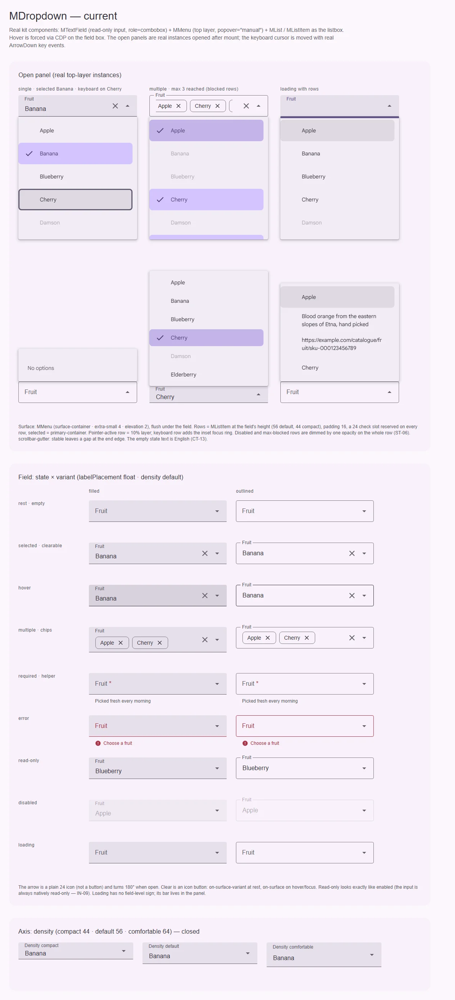
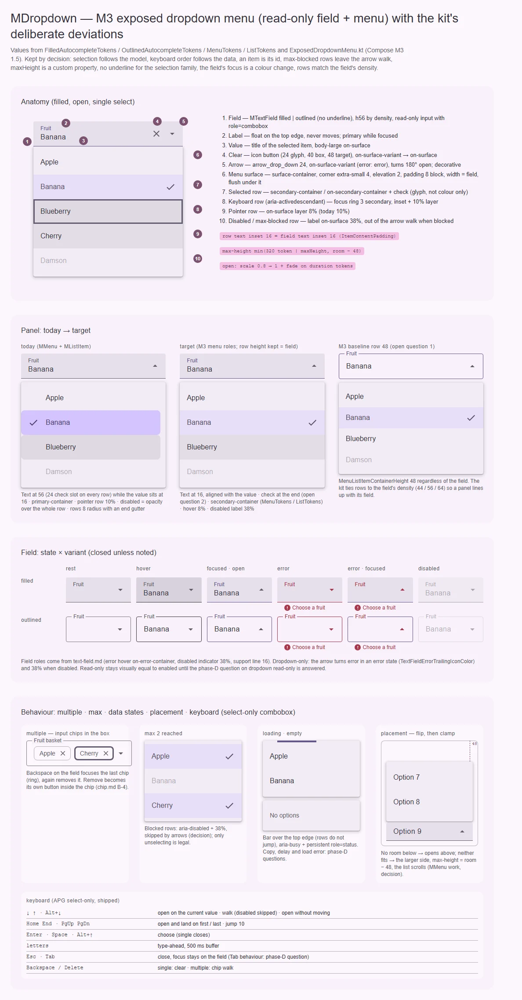

# MDropdown — поле выбора из списка: M3 exposed dropdown menu (read-only поле + меню)

<identity>M3: Menus → exposed dropdown menu (`ExposedDropdownMenuBox` + `ExposedDropdownMenu`, якорь `PrimaryNotEditable`) · Токены Compose: `FilledAutocompleteTokens.kt`, `OutlinedAutocompleteTokens.kt` (поле + `MenuContainer*`), `MenuTokens.kt` (выбранный пункт), `ListTokens.kt` (строка); поведение — `ExposedDropdownMenu.kt` (`ItemContentPadding` 16, `calculateMaxHeight`, `TrailingIcon`), `Menu.kt` (`MenuVerticalMargin` 48, `DropdownMenuVerticalPadding` 8, `MenuListItemContainerHeight` 48) · Код: `src/runtime/components/ui/dropdown/` (`index.vue`, `props.ts`, `context.ts`), движок `src/runtime/composables/dropdown/*` (`useDropdownControl`, `useDropdownSelection`, `useDropdownEntries`, `useDropdownKeyboard`, `useDropdownChips`, `useTypeahead`, `usePanelStatus`) + `composables/listbox/useListbox.ts`, токены `src/runtime/assets/stylesheet/components/dropdown/{_index,_panel}.scss` · Аудит: `data/dropdown.json` · Тип: public; родитель семейства выбора (`MAutocomplete` спредит `mDropdownProps` и рисует ту же панель)</identity>

<implementation-status state="planned" updated="2026-10-07">Компонент — витрина фазы D (клавиатура APG select-only, listbox владеет только опциями, постоянный `role=status`, кольцо клавиатурного курсора, `inheritAttrs: false`, общий `_panel.scss`). План доводит роли и геометрию панели до M3 и подключает межкомпонентные долги (`MMenu`, `MListItem`, input-чип). Шаги 1–2 без смены API; шаги 3–5 ждут решений в планах меню, списка и чипа; вопросы 1–3 — свои.</implementation-status>

## Вердикт

**Дрейф.** Компонент узнаётся как exposed dropdown menu M3: поле — `MTextField` filled / outlined,
стрелка `arrow_drop_down` поворачивается на 180°, панель шириной с поле, без зазора, на
`surface-container` с углом 4, тенью 2 и вертикальным отступом 8 — ровно
`FilledAutocompleteTokens.MenuContainer*`. Разошлись роли и геометрия строк: выбранная строка
`primary-container` вместо `secondary-container`, текст строки стоит на 56 (слот галочки на каждой
строке), а значение в поле — на 16 (M3 выравнивает их через `ItemContentPadding`), строка под
указателем 10 % вместо 8 %, отключённая гасится прозрачностью всей строки, стрелка не краснеет при
ошибке и не гаснет в disabled. Ломающие изменения приходят только от соседей: `menuPlacement` (план
меню) и удаление чипа (план чипа).

## Рендеры

| Сейчас | Концепт M3 |
|---|---|
|  |  |

**Сейчас** — настоящие компоненты. Открытые панели — настоящие экземпляры `MMenu` в top layer,
открытые после монтирования (сначала нижний ряд, потом верхний, затем прокрутка в начало, чтобы
меню посчитали место от верха страницы); клавиатурный курсор двигают настоящие `keydown ArrowDown`.
1. Открытая панель: одиночный выбор (Banana выбрана, курсор клавиатуры на Cherry — кольцо),
   множественный с `max: 3` (заблокированные строки притушены, третий чип обрезан рядом прокрутки),
   загрузка со строками (полоса по верхней кромке); второй ряд перевёрнут вверх (места снизу нет):
   пустой список «No options», плотность `compact`, длинные заголовки переносятся.
2. Поле: состояние × вариант — покой, выбрано + очистка, hover (CDP), чипы, обязательное + helper,
   ошибка, read-only (неотличим от enabled), disabled (стрелка не гаснет), loading (у поля знака нет).
3. Плотность 44 / 56 / 64.

**Концепт:**
1. Анатомия открытого filled-поля — 10 частей и выноски (выравнивание 16, кламп высоты, движение).
2. Панель сегодня → цель → M3 baseline 48: смещение текста, роль выбора, слой hover, disabled по
   частям; высота строки — вопрос 1, место галочки — вопрос 2.
3. Поле: состояние × вариант (покой, hover, фокус + открыто, ошибка, ошибка + фокус, disabled) —
   стрелка `error` и 38 %.
4. Поведение: чипы с отдельным удалением (план чипа, В-4), `max`, загрузка и пустой список,
   переворот и кламп, клавиатура.

## Анатомия

Нумерация — по кадру 1 концепта.

| # | Часть M3 | Элемент кита | Статус |
|---|---|---|---|
| 1 | Text field (anchor `PrimaryNotEditable`) | `MTextField.ui-dropdown__field`, `readonly`, `inputAttrs` с `role="combobox"` (`index.vue:15-37`) | есть; без `underline` (решение) |
| 2 | Label | лейбл `MTextField` | есть; движение лейбла — вопрос Q1 [text-field.md](text-field.md) |
| 3 | Значение | `displayTitle` (`useDropdownControl.ts:113`) | есть |
| 4 | — (у M3 одна trailing-иконка) | `MButtonIcon.ui-dropdown__clear` (`index.vue:85-95`) | есть; дополнение кита |
| 5 | Trailing icon | `MIcon.ui-dropdown__arrow`, `aria-hidden` (`:97-101`) | есть; роли error / disabled — нет |
| 6 | Menu container | `MMenu.ui-dropdown__menu` → `.ui-menu__surface` (`:105-113`) | есть; роль `menu` вокруг listbox — долг [меню](../overlays/menu.md) |
| 7 | Пункт (selected) | `MListItem.ui-dropdown__option`, `ui-list-item--selected` + `ICONS.check` в `#leading` (`:145-177`) | иначе: `primary-container`, слот галочки на каждой строке |
| 8 | Фокус пункта | `--active` + `--keyboard` → `focus-ring(inset)` (`_panel.scss:50-66`) | есть |
| 9 | Hover пункта | `--active` по `pointermove` | иначе: 10 % (`focus`) вместо 8 % |
| 10 | Disabled пункт | `ui-list-item--disabled` | иначе: `opacity` на всю строку (ST-06, план списка) |
| — | Строка поддержки | `MTextField` (всегда зарезервирована) | есть |
| — | Индикатор загрузки | `MProgressLinear.ui-dropdown__progress` над верхней кромкой (`:132-137`) | есть; дополнение кита |
| — | Пустое состояние | слот `#empty` → `.ui-dropdown__state` (`:180-189`) | есть |
| — | Live-регион | `span.ui-dropdown__status` `role="status"` (`:194-197`) | есть |
| — | Чипы (multiple) | `MChip type="input"` в `#leading-content` (`:45-80`) | есть; удаление — [план чипа](../form/chip.md) В-4 |

## Оси дизайна

| Ось | M3 | Кит сейчас | Цель | Ломает API |
|---|---|---|---|---|
| `variant` | filled · outlined | `Extract<MTextFieldVariant, 'filled' \| 'outlined'>` | без изменений (`underline` — никогда, `decisions.md`) | нет |
| `density` | одна высота 56, строка меню 48 | `compact 44 \| default 56 \| comfortable 64`, строки панели той же высоты | без изменений (S5); высота строки — вопрос 1 | нет |
| `labelPlacement`, `rounded` | — | из `mFieldProps` | по [text-field.md](text-field.md) (Q1, Q7) | по Q7 |
| Выбор | один (значение в поле) | `multiple`, `mandatory`, `max`, `clearable` | без изменений | нет |
| Размещение | ниже, переворот, высота = место − 48 | `menuPlacement: UiMenuOrigin` (`'top left'`…), токен 320 + `maxHeight` | `PopoverPlacement` с `start` / `end` (план меню); кламп — `MMenu` (решение) | да, через алиас |
| Ширина | `matchAnchorWidth` | `match-width` | без изменений | нет |

`searchable` / `allowCustom` прежнего плана сняты: редактируемое поле выбора — это `MAutocomplete`
(переработка 2026-09-06, `decisions.md` → «Закрыто»), а свободные значения — предложение в
[autocomplete.md](autocomplete.md#предложения-по-ux).

## Оси состояний

Из `axes` аудита, сверено с кодом после фазы D.

| Ось | Нужно | Есть | Не хватает |
|---|---|---|---|
| Базовое | enabled, disabled, read-only | disabled нативный; read-only блокирует открытие | read-only неотличим ни видом, ни программно (IN-09) — вопрос фазы D «readonly у dropdown»; `aria-disabled` (IN-08) — вопрос фазы D |
| Взаимодействие | hover, pressed строк и поля | слои `MListItem`, hover поля от `MTextField` | слой hover строки 8 % (шаг 1) |
| Фокус | поле, курсор клавиатуры, чип | поле — цвет; строка и чип — `focus-ring(inset)` | — |
| Выбор | selected, multiple, max | галочка + контейнер, `aria-selected`, `aria-multiselectable`, blocked выпадают из обхода (решение) | роль `secondary-container` (шаг 2, план списка) |
| Раскрытие | open / closed | `aria-expanded`, поворот стрелки | — |
| Смысловое | error | от `MTextField` | стрелка `error` (шаг 1) |
| Валидация | invalid, required, touched, validating | `useField` по выбору (`index.vue:238`) | `aria-busy` по `meta.pending` в `inputAttrs` (FM-06; после `722a88d` поле его принимает) — шаг 1 |
| Данные | loading, empty, error | полоса загрузки, `aria-busy` у listbox, постоянный `role=status`, `#empty` | ошибка загрузки + retry, задержка индикатора — вопросы фазы D; подгрузка порциями (DT-08), виртуализация (CT-08) — UX и [virtual-scroll.md](../foundation/virtual-scroll.md) |

## Токены: расхождения

Совпадает с M3: контейнер панели `surface-container`, угол `extra-small` 4, тень 2, вертикальный
отступ 8, ширина = поле, зазор 0; стрелка 24 `on-surface-variant` с поворотом 180°; кольцо фокуса
`secondary`; поле — по [text-field.md](text-field.md).

| Часть | M3 (Compose) | Кит сейчас (`файл` / путь `g()`) | Действие |
|---|---|---|---|
| Выбранная строка | `MenuTokens.ListItemSelectedContainerColor` = `secondary-container`, текст и иконки `on-secondary-container` (то же в `ListTokens.ItemSelected*`) | `MListItem` `container.selected.color` = `primary-container` (`list/item/_index.scss:37-40`), смесь в `option.active.selected-bg` (`dropdown/_index.scss:18, 38`) | по вопросу 1 [плана списка](../containment/list.md) (рек. — `secondary-container`) в том же PR; если список оставит `primary`, панель переопределяет у себя |
| Отступ текста строки | `ExposedDropdownMenuDefaults.ItemContentPadding` = 16 — текст строки под текстом поля | 16 + слот 24 + 16 = 56: `#leading` передан всегда, и `__leading` рендерится на каждой строке (`index.vue:156-162`, `list/item/index.vue:22`) | вопрос 2 |
| Высота строки | `MenuListItemContainerHeight` 48 | высота поля по плотности: 44 / 56 / 64 (`list/item/_index.scss:13-22`) | отклонение кита (переработка 2026-09-06) — вопрос 1 подтверждает и записывает |
| Hover строки | слой `on-surface` 8 % | строка под указателем = активная → `option.active.bg` на `focus` 10 % (`_index.scss:37`, `_panel.scss:50`) | указатель — `state-opacity(hover)`, клавиатура — `focus` + кольцо |
| Disabled строки | метка `on-surface` 38 % (`ListTokens.ItemDisabledLabelTextOpacity`) | `opacity: 0.38` на всю строку вместе со слотом `#item` (`list/item/index.vue:282-285`) | ST-06 — шаг плана списка; панель только проверяет |
| Стрелка в ошибке | `TextFieldErrorTrailingIconColor` = `error` | `arrow.color` = `on-surface-variant` всегда; цвет иконок `MTextField` до стрелки не доходит, у неё свой `color` (`index.vue:341-345`) | `arrow.error.color` = `error`; hover в ошибке — `on-error-container` (как у полей) |
| Стрелка в disabled | `TextFieldDisabledTrailingIconColor` `on-surface` 38 % | `on-surface-variant` (на доске видна полной) | `arrow.disabled.color` |
| Форма строки | baseline-меню: прямоугольник | `MListItem` `shape: small` 8 + `scrollbar-gutter: stable` оставляет зазор у правого края | по вопросу 2 [плана списка](../containment/list.md); гаттер — оставить (фаза D, CT-11) |
| Высота панели | `calculateMaxHeight`: большее из мест сверху / снизу − 48 | токен `panel.max-height` 320 (`_index.scss:27`) + `--m-dropdown-panel-max-height` | кламп по месту — [меню](../overlays/menu.md), долг 4 (решение); токен остаётся запасным |
| Движение панели | scale 0.8 → 1 + alpha (FastSpatial / FastEffects) | литералы `MMenu` (TK-04, MO-05, A11-18) | токены длительности и easing (S4 отклонён — без пружин), reduced motion — только fade; работа меню, шаг 1 |
| Пустое состояние | — | `state.padding` 24, `on-surface-variant`, `body-large` по наследованию | `state.type` = `body-medium` (как supporting text строки) — S |

## Поведение и доступность

Сделано (фаза D и переработка): `role="combobox"` на настоящем `<input>`, `aria-haspopup="listbox"`,
`aria-expanded`, `aria-controls`, `aria-activedescendant` (чип под курсором важнее строки);
listbox назван лейблом поля и владеет только опциями; прогресс и тексты — рядом; постоянный
`role=status` (`usePanelStatus`); клавиатура APG select-only (стрелки открывают на текущем значении,
Home / End, PageUp / PageDown ±10, Alt+↑/↓, type-ahead 500 мс, Enter / Space выбирают, Backspace /
Delete очищают одиночный, ходят по чипам множественного); строки, заблокированные `max`, выпадают
из обхода (решение); фокус в инпут при открытии (`index.vue:280-282`); `overscroll-behavior:
contain`, длинные заголовки переносятся; `inheritAttrs: false` + `useControlAttrs`.

Открыто и привязано к шагам:
- **Роль поверхности и прочие долги `MMenu`** (A11-01, EN-10, LY-05, LY-06, LY-10, RS-10, TK-04,
  MO-05, A11-18): решаются в [плане меню](../overlays/menu.md) (вопрос 2 — примитив всплывающей
  панели, шаги 1–4). Здесь — шаг 3: перевод дропдауна и обновление e2e, которое сегодня закрепляет
  одно нарушение axe.
- **FM-06** — `aria-busy` по `field.meta.pending` в `inputAttrs` (шаг 1); видимый признак
  validating — вопрос FM-06 у полей.
- **IN-09, IN-08, DT-04 / EN-03 / ST-01, DT-11, CT-13, Tab при открытом списке** — вопросы фазы D;
  план подключает ответы (шаг 5).
- **A11-04** — имя чипа, который удаляет: [план чипа](../form/chip.md) В-4 + CT-13 (шаг 4).
- **CT-11** — намёк «список продолжается»: вопрос 3. **CT-08, DT-08** — виртуализация и подгрузка:
  [virtual-scroll.md](../foundation/virtual-scroll.md) и «Предложения по UX».
- **ST-06, LY-10** (строка) — [план списка](../containment/list.md). **RS-12** — цели `MButtonIcon`
  и `MChip` (S8 в их планах).
- **Ручные:** FM-04, CT-06, CT-12, LY-03, LY-07, RS-01, RS-02, RS-06, RS-07, TH-02, TH-03, TH-08,
  A11-13, EN-11 (`menuOrigin` → `menuPlacement` без деприкации в 2026-09-06), TS-06. **Принято:**
  RS-04, RS-05, TS-04, TK-09. **Вне репозитория:** DC-02…05.

## API

Сейчас: `mFieldProps` + `fieldDensityProp` + `variant` (сужен); `items` (`TItem extends { id }`),
`itemTitle` (`'label'`), `itemValue` (весь элемент), `itemDisabled` (`'disabled'`),
`valueComparator` (по `id`); `multiple`, `mandatory`, `max`, `clearable`; `menuPlacement`,
`maxHeight`; модели `modelValue`, `open`; события `select`, `remove`, `clear`, `open`, `close`;
слоты `prepend`, `append`, `selection`, `chip`, `item`, `empty`, `default` (вся панель, escape
hatch с `listboxAttrs`, `getOptionAttrs`, `panelStyle`…); `expose` — `open`, `close`, `clear`;
контекст `provideDropdownContext`.

| Действие | Что | Ломает | Миграция |
|---|---|---|---|
| Изменить | `menuPlacement: UiMenuOrigin` → `PopoverPlacement` (логические `start` / `end`) | да | вместе с `origin` → `placement` в [плане меню](../overlays/menu.md): старые значения — алиас с dev-warn на один minor |
| Изменить | чипы: тело чипа больше не удаляет, удаление — отдельная кнопка с `aria-label` | да (поведение клика) | [план чипа](../form/chip.md) В-4; рекомендованный там вариант 2 сохраняет «весь чип — удаление» для дропдауна |
| Добавить | слоты `#loading`, `#error` (EN-03) и событие `retry` | нет | по ответу фазы D (ошибка загрузки) |
| Не трогать | модели, события, резолверы, `valueComparator`, `max`, `maxHeight` (кастом-свойство — решение), `#default`, контекст | — | — |

## План работ

1. **S — роли без смены API.** Hover строки по указателю — `state-opacity(hover)`, клавиатурная —
   `focus` + кольцо (`_panel.scss:50-66`, новый модификатор не нужен: `--keyboard` уже есть);
   `arrow.error.color`, `arrow.error.hover.color`, `arrow.disabled.color`; `state.type`;
   `'aria-busy'` по `field.meta.pending` в `control.inputAttrs` (FM-06). Тот же шаг — в
   `autocomplete` (общий `_panel.scss`, стрелка → `toggle`). Файлы: `dropdown/index.vue`,
   `dropdown/_index.scss`, `dropdown/_panel.scss`, `composables/dropdown/useDropdownControl.ts`.
2. **M — общий listbox и строки панели.** Место галочки и отступ текста по вопросу 2, высота строки
   по вопросу 1; роль выбора — в одном PR с вопросом 1 [плана списка](../containment/list.md).
   Listbox-движок уже выделен (`useListbox` + `useDropdownKeyboard` + `useDropdownControl`): будущий
   `selectable` у `MList` строится на нём, третий контроллер не заводится. Файлы: `dropdown/index.vue`,
   `autocomplete/index.vue`, `_panel.scss`, `dropdown/_index.scss`.
3. **M — поверхность панели.** После вопроса 2 [плана меню](../overlays/menu.md): перевести дропдаун
   и автокомплит на примитив всплывающей панели (или проп роли), токены панели — свои, по
   `FilledAutocompleteTokens.MenuContainer*` (baseline: `surface-container`, 4, тень 2), даже если
   `MMenu` перейдёт на группы Expressive. e2e: axe без исключений. Зависимости: шаги 1–4 меню.
4. **L — input-чип с отдельным удалением** ([план чипа](../form/chip.md), шаг 7, В-4): перевод
   `#leading-content`, перенос `&__chip--active` на кнопку удаления, имя «Удалить {title}» (CT-13).
5. **M — данные по ответам фазы D:** ошибка загрузки (`loadError` / `#error` / `retry`), задержка
   индикатора, `#loading`, readonly, Tab при открытом списке. Файлы: `dropdown/index.vue`,
   `usePanelStatus.ts`, `props.ts`.
6. **S — намёк на продолжение списка** (после вопроса 3).
7. **M — тесты** (раздел ниже). Документация DC-02…05 — в репозитории `docs`.

## Тесты

- **Фикстуры** `playground/fixtures/dropdown/`: `matrix.vue` — строка «ошибка + hover», колонка
  disabled с видимой стрелкой; `stress.vue` — уже есть 1000 строк и длинные заголовки, добавить
  панель у нижнего края окна.
- **e2e** (`dropdown.e2e.ts`): computed-цвет стрелки в error = `error`, в disabled — 38 %; фон строки
  под указателем = 8 %, под клавиатурой = 10 % + `outline`; левый край текста строки = левый край
  значения в поле (после вопроса 2); фон выбранной = `secondary-container` (после плана списка);
  `aria-busy` на инпуте при `pending`; после шага 3 — axe без единого нарушения. Существующие:
  клавиатура APG, axe light / dark × ltr / rtl, переполнение 360 / 768 / 1366, 1000 строк.
- **unit:** `useDropdownControl.spec.ts` — `aria-busy` в `inputAttrs`; `keyboard.spec.ts` не
  меняется; `variants.spec.ts` — модификаторы стрелки.

## Готово, когда

- [ ] Роли строки и стрелки совпадают с колонкой M3 таблицы токенов (кроме подтверждённых
      отклонений).
- [ ] Текст строк выровнен с текстом поля либо отклонение записано в `decisions.md` (вопрос 2).
- [ ] axe на открытой панели без исключений; панель клампится у края окна (работа меню).
- [ ] Чип удаляется отдельным действием с именем.
- [ ] `npm run lint`, `lint:style`, `lint:scss`, `typecheck`, vitest, e2e `dropdown` и
      `autocomplete` — зелёные.
- [ ] Рендер `current.webp` переснят, расхождения с `concept.webp` — только из открытых вопросов.

## Предложения по UX

1. **«+N» вместо прокрутки ряда чипов.** Когда чипы не помещаются в одну строку, последние
   сворачиваются в чип «+3» (полный список — в `aria-describedby` и по фокусу поля). Сейчас ряд
   прокручивается, и при открытии панели чипы уезжают к инпуту (видно на доске: третий чип
   обрезан). Заказчик — фильтры с множественным выбором в тулбарах. Цена: M, замер ширины через
   `ResizeObserver`, без нового API (или проп `maxChips`). Рекомендация: **взять**.
2. **Вторичный текст и иконка строки без слота.** Резолверы `itemSubtitle` и `itemIcon` рядом с
   `itemTitle`: строка «Москва · Россия» или с флагом — частый случай, сегодня только через `#item`.
   Заказчик — выбор адреса, страны, пользователя. Цена: S, два пропа-резолвера, `MListItem` уже умеет
   `supportingText` / `leadingIcon`. Рекомендация: **взять**.
3. **Группы опций.** Заголовок группы (`role="group"` + `aria-labelledby`) и разделитель: часовые
   пояса по регионам, валюты «частые / все». Заказчика в ките пока нет (переработка 2026-09-06:
   «группировка ждёт заказчика»). Цена: M, резолвер `itemGroup` и порядок обхода по группам.
   Рекомендация: **отложить до заказчика**, записать в `decisions.md`.
4. **«Выбрать все» / «Снять все» для `multiple`.** Служебная строка над списком. Цена: S, но новая
   строка по умолчанию (CT-13) и взаимодействие с `max`. Рекомендация: **после ответа на CT-13**.

## Открытые вопросы

Здесь не повторяются вопросы фазы D (Q10–Q17 в итоге сессии,
[qa-fix-showcase-fields](../../../../summary/qa-fix-showcase-fields_2026-10-07_0100.md)): readonly у
дропдауна, ошибка загрузки списка (`loadError` / `#error` / `retry`), Tab при открытом списке,
английские строки по умолчанию, когда показывать ошибку, `aria-disabled`, задержка индикатора.
Соседние: роль поверхности и группы Expressive — [меню](../overlays/menu.md), вопросы 2 и 5; цвет
выбора и геометрия строки — [список](../containment/list.md), вопросы 1 и 2; удаление чипа —
[чип](../form/chip.md), В-4.

**1. Высота строки панели.** M3 ставит пункт меню 48 при любом поле; кит делает строку равной полю
(44 / 56 / 64), чтобы панель «продолжала» поле (переработка 2026-09-06).
1. Оставить высоту поля и записать отклонение в `decisions.md`. Цена: панель на 8 выше на строку,
   чем у M3; в 320 помещается 5 строк вместо 6.
2. Как M3: 48 при `default`, 40 / 56 у `compact` / `comfortable`. Цена: строка перестаёт совпадать
   с полем, а `MListItem` получает ветку «в меню».

Рекомендация: 1 — это осознанная связка осей кита, а не дрейф; запись снимет вопрос навсегда.

**2. Где стоит галочка выбранной строки.** Сейчас слот 24 зарезервирован на каждой строке, и текст
строки стоит на 56, а значение в поле — на 16.
1. Галочка в конце строки (trailing), текст на 16 под значением поля, как `ItemContentPadding` M3.
   Цена: отличается от меню Expressive, где галочка заменяет ведущую иконку.
2. Галочка в начале только у выбранной строки (как в меню Expressive). Цена: текст выбранной строки
   сдвигается на 32 относительно соседних.
3. Как сейчас: слот у каждой строки. Цена: текст строк не совпадает с полем, пустой столбец 40 у
   списка без выбора.

Рекомендация: 1. Нецветовой признак выбора (решение a11y) сохраняется, выравнивание M3 тоже.

**3. Намёк, что список продолжается (CT-11).** `scrollbar-gutter: stable` уже есть, но на системах
с overlay-скроллбаром длинный список выглядит законченным.
1. Тени-градиенты сверху и снизу через `background-attachment: local` (без JS, токены цвета
   `surface-container`). Цена: новый визуальный элемент панели, M3 его не описывает.
2. Последняя видимая строка обрезается на половину высоты — `max-height` кратен строке + ½.
   Цена: токен высоты становится производным от плотности.
3. Ничего. Цена: CT-11 остаётся FAIL.

Рекомендация: 2 — без нового элемента, тот же приём используют системные списки.
