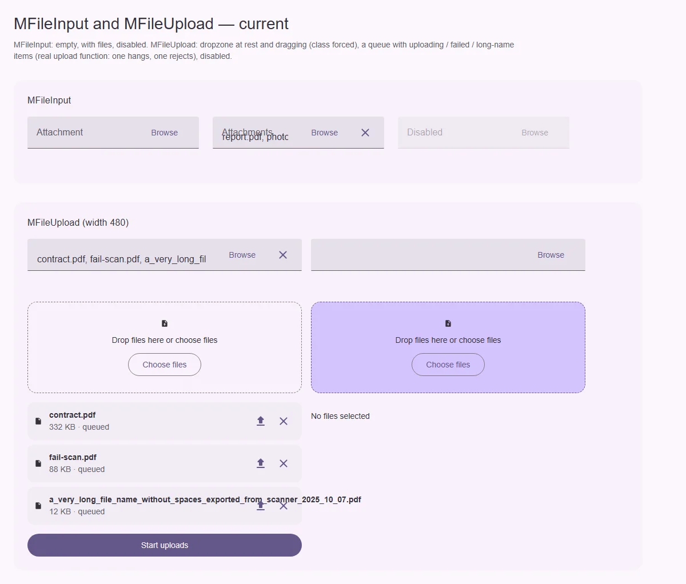
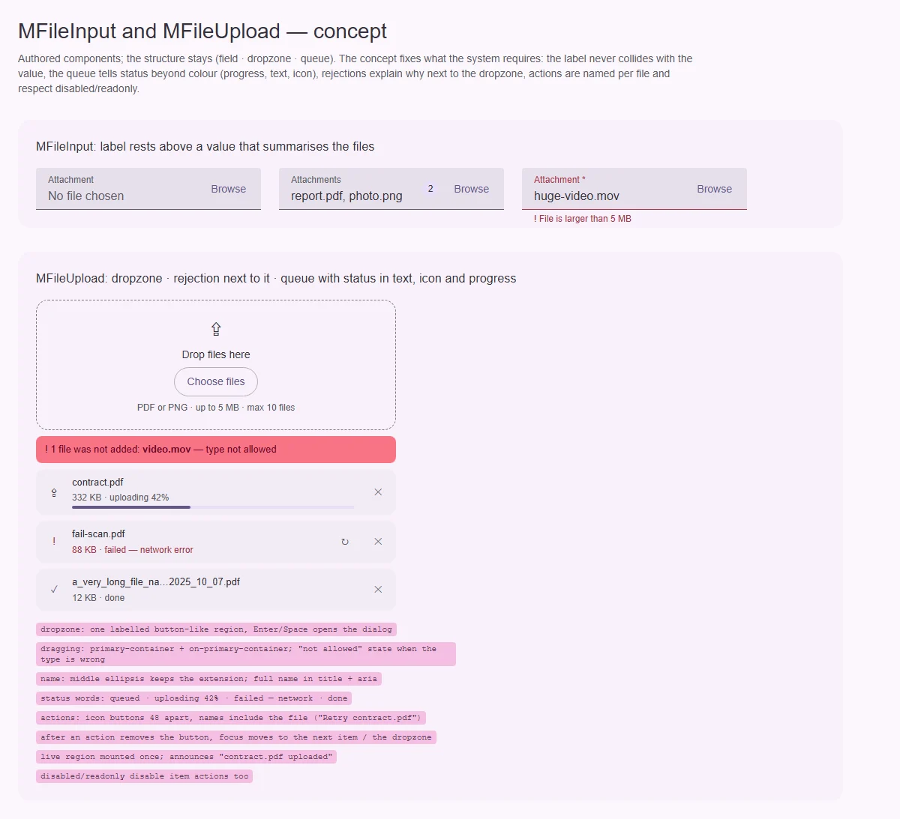

# MFileInput — поле выбора файлов

<identity>M3: компонента нет; авторский компонент кита — поле семейства полей (`mFieldProps`) с кнопкой «Обзор» · Токены Compose: через `MTextField` · Код: `src/runtime/components/ui/file-input/`, `src/runtime/composables/useFileSelection` · Аудит: `data/file-input.json` · Тип: public</identity>

<implementation-status state="planned" updated="2026-10-07">Реализован в фазе 2: один нативный `input type="file"` (визуально скрыт), видимое поле на `MTextField`, `accept`, `multiple`, `capture`, `maxFiles`, `maxSize`, `showSize`, `clearable`, слот `#selection`. Открыты: лейбл налезает на значение при выбранных файлах (рендер), отказ молча отбрасывает файл, унаследованные пропы не доходят до поля, английские строки.</implementation-status>

## Вердикт

`авторский`. Модель и архитектура прежнего плана остаются:
- один нативный picker;
- `File[]` как модель;
- общий `useFileSelection`;
- слот `#selection` для сводки.

Дефекты:
- **лейбл «Attachments» налезает на значение «report.pdf, photo…»** (рендер). При
  выбранных файлах поле не переходит в состояние «есть значение», и плавающий лейбл остаётся
  на месте значения;
- отклонённый файл (`maxSize`, `accept`) молча отбрасывается: нет `aria-invalid`, текста,
  иконки (ST-01, FM-02, FM-03, A11-06);
- `required`, `rounded`, `labelPlacement`, `path` и т. д. унаследованы из `mFieldProps`, но в
  `MTextField` не передаются (EN-01, FM-10);
- `density` не объявлена (LY-08);
- атрибуты уходят на обёртку (EN-04);
- «Browse», «Selected files: N», «Clear selected files» зашиты по-английски, а одинаковые
  «Browse» неразличимы (CT-13, A11-04).

## Рендеры

| Сейчас | Концепт |
|---|---|
|  |  |

Рендеры общие с [MFileUpload](file-upload/index.md), поле — верхний кадр.

Сейчас: пусто, с файлами (лейбл поверх значения), disabled.

Концепт: лейбл на кромке над значением, счётчик файлов, ошибка с причиной.

## Анатомия

| # | Часть | В ките | Статус |
|---|---|---|---|
| 1 | Нативный input | визуально скрыт, `aria-hidden` | есть; `required` стоит на нём, а не на видимом поле |
| 2 | Видимое поле | `MTextField` (readonly-значение) | есть; лейбл не уходит наверх |
| 3 | Кнопка «Обзор» | текстовая кнопка | есть; имя без контекста |
| 4 | Очистка | `MButtonIcon` | есть |
| 5 | Сводка | слот `#selection` или «имена через запятую» | есть |

## Оси дизайна

| Ось | Значения | Цель |
|---|---|---|
| поля (`mFieldProps`) | variant, labelPlacement, rounded, required, path… | действительно передаются в `MTextField` |
| `density` | от полей | `fieldDensityProp` (LY-08) |

## Оси состояний

| Ось | Нужно | Есть | Не хватает |
|---|---|---|---|
| Значение | пусто · есть файлы | модель есть, поле «пустое» | `MTextField` получает непустое значение-сводку → лейбл на кромке |
| Валидация | отказ с причиной, `required` | событие `reject` | `error` + текст причины + `aria-invalid`, `required` на видимом поле |
| Атрибуты | на нативном контроле | на обёртке | `inheritAttrs: false` + `useControlAttrs` (решение Q9) |

## Поведение и доступность

- Имя кнопки «Обзор» связано с лейблом поля через `aria-labelledby`, а подпись — проп `browseLabel`
  без английского дефолта.
- Причина отказа — текст в строке поддержки: «Файл больше 5 МБ», «Допустимы .pdf, .png» (тексты
  — шаблоны-пропы). Событие `reject` остаётся.

## API

| Что | Изменение | Ломает |
|---|---|---|
| унаследованные пропы | реально работают | исправление |
| `density` | новый | нет |
| `browseLabel`, `clearLabel`, `rejectMessages` | новые, без дефолтов | видимо |
| атрибуты | на `input` | исправление |

## План работ

1. **S — лейбл над значением при выбранных файлах** (рендер).
2. **S — проброс `mFieldProps`, `density`, атрибутов** (EN-01, FM-10, LY-08, EN-04).
3. **S — ошибка отказа с текстом** (ST-01, FM-02, FM-03, A11-06).
4. **S — имена и строки без английских дефолтов** (CT-13, A11-04).
5. **S — токены** (LY-04, TK-02), **документация** (DC-*).

## Тесты

- Unit:
  - модель с файлами → поле не пустое (лейбл в состоянии «есть значение»);
  - `required` → `aria-required` на видимом поле;
  - отказ по размеру → текст и `aria-invalid`.
- e2e: рендер с двумя файлами без наложения лейбла; axe.

## Готово, когда

- Лейбл не налезает на значение.
- Отказ объясняется.
- Пропы полей работают.

## Предложения по UX

Расширения сверх паритета. Это предложения владельцу, а не шаги плана. Без новых зависимостей.

| Предложение | Что получает пользователь | Заказчик | Цена | Рекомендация |
|---|---|---|---|---|
| Сводка чипами с удалением отдельного файла (рецепт слота `#selection` на `MChip input`) | Убрать один файл, не сбрасывая все | формы с вложениями | S · рецепт | да |
| Предпросмотр изображения в сводке (миниатюра через `URL.createObjectURL`, освобождение на размонтировании) | Видно, то ли фото выбрано | профиль, аватар | S | да |

## Открытые вопросы

Нет.
