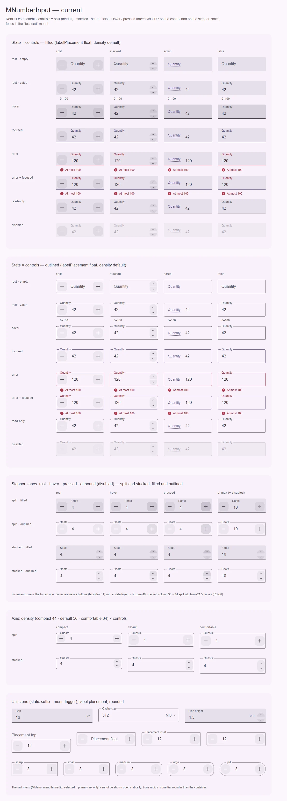
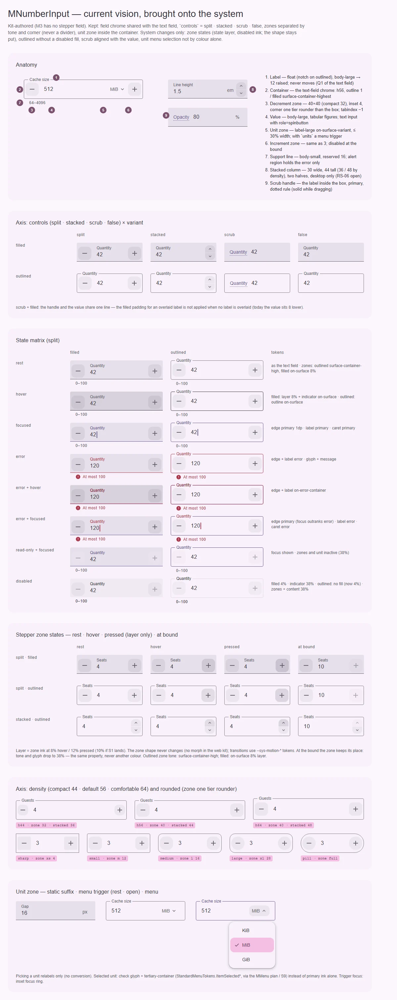

# MNumberInput — числовое поле со степперами, скрабом и единицей

<identity>M3: нет в M3 (авторский компонент кита; хром поля выводится из Text fields) · Токены Compose: `FilledTextFieldTokens.kt`, `OutlinedTextFieldTokens.kt` (контейнер, лейбл, роли состояний); системно — непрозрачности слоя состояний, `StandardMenuTokens.kt` (меню единиц) · Код: `src/runtime/components/ui/number-input/` (`index.vue`, `unit.vue`, `props.ts`) + `composables/number-input/{useNumberInputControl,useNumberValue,useNumberScrub}.ts`, `shared/utils/number`, токены `assets/stylesheet/components/number-input/_index.scss` · Аудит: `data/number-input.json` · Тип: public</identity>

<implementation-status state="planned" updated="2026-10-07">Компонент собран по спеке полей (2026-09-03) и прошёл QA фазы D. План доводит его по системе: роли состояний семейства, состояния зон, геометрия filled, доступность строки поддержки. Вид и оси сохраняются.</implementation-status>

## Вердикт

**Авторский.** В M3 нет числового поля со степперами; хром у кита общий с text-field
(контейнер, вырез, лейбл, строка поддержки), а зоны степперов, колонка stacked, скраб-лейбл и зона
единицы — свои решения, и они остаются. Разрывы — системные: filled-поле на 2rem выше text-field
той же плотности (58 вместо 56), скраб в filled стоит на 8 выше значения, у outlined в disabled
появляется заливка, зона на границе диапазона сохраняет полный тон, выбранная единица в меню
отмечена только цветом, строка поддержки целиком — live-регион вместе с helper, нет `aria-busy`.
Плюс общие с семейством: лейбл `float` анимируется, `inset` на outlined уходит в вырез, роли
ошибки при наведении, каретка, disabled-индикатор filled.

## Рендеры

| Сейчас | Концепт |
|---|---|
|  |  |

Кадры концепта (текущий вид, доведённый по системе):

1. **Анатомия** — split + единица (outlined), stacked + статичная единица (filled), scrub (filled);
   9 частей.
2. **Ось controls × variant** — split · stacked · scrub · false; скраб в filled на одной линии со
   значением.
3. **Матрица состояний** (split) filled × outlined с колонкой токенов.
4. **Состояния зоны** — rest · hover · pressed (только слой, форма постоянна — Q1) · на границе
   (тон и глиф 38%).
5. **Оси density и rounded** — зоны 32/40/40, колонка 36/44/48; зона на ступень круглее коробки.
6. **Зона единицы** — статичный суффикс, триггер меню в покое и открытым, меню с выбранной
   единицей: галочка + `tertiary-container`.

На текущей доске видно: filled-строки выше outlined на 2rem; «Quantity» скраба выше цифр;
нижняя половина stacked-колонки в filled почти касается индикатора; outlined disabled залит.

## Анатомия

| # | Часть | Кит | Статус |
|---|---|---|---|
| 1 | Label | `<label class="__label">`; при `scrub` — не рендерится, его роль берёт ручка (9) | есть |
| 2 | Container | `.ui-number-input__control`, outlined — `<fieldset class="__outline">` | есть |
| 3 | Decrement zone | `<button class="__stepper--decrement">` (слот `decrement`) | есть |
| 4 | Value | `<input class="__input" role="spinbutton">`, tabular-nums | есть; нет `caret-color` |
| 5 | Unit zone | `MNumberInputUnit` (`unit.vue`): статичный суффикс или триггер `MMenu` | есть; выбор в меню — только цвет |
| 6 | Increment zone | `<button class="__stepper--increment">` (слот `increment`) | есть |
| 7 | Support line | `
` + глиф ошибки | есть; helper внутри live-региона |
| 8 | Stacked column | `` с двумя зонами | есть; половины ≈21.5 — RS-06 |
| 9 | Scrub handle | `<label class="__scrub">` внутри коробки, точечная линия `primary` | есть; в filled не на линии значения |
| — | Adornments | слоты `prepend` / `append` → `__adornment` | есть |

## Оси дизайна

| Ось | Источник | Кит сейчас | Цель | Ломает API |
|---|---|---|---|---|
| `controls` | авторская | `'split' \| 'stacked' \| 'scrub' \| false`, дефолт `split` | без изменений; stacked на таче — RS-06/RS-12 фазы D | нет |
| `variant` | M3 text field | `filled \| outlined`; `underline` отвергнут | без изменений | нет |
| `labelPlacement` | M3 text field | `top \| float \| inset \| hidden`, дефолт `float` | движение — Q1 text-field; `inset` на outlined внутри коробки (шаг 4) | нет |
| `density` | кит (поля) | `compact 44 · default 56 · comfortable 64`; зоны 32 / 40 / 40; stacked 36 / 44 / 48 | filled — те же высоты, что у text-field (шаг 3) | нет |
| `rounded` | кит (поля) | коробка по шкале; зона на ступень круглее (`stepper.radius.*`) | имя оси — Q7 text-field | при переименовании |
| Единица | авторская | `v-model:unit` + `units`: без списка — суффикс, со списком — меню; только переименование, без пересчёта | выбор в меню — не только цвет (шаг 7) | нет |
| Формат | авторская | `locale` (`'en-US'`), `useGrouping`, `precision`, `step`, `min`/`max`, `clamp` | без изменений; дефолт `locale` — политика CT-13 / Q13 | нет |

## Оси состояний

| Ось | Нужно | Есть | Не хватает |
|---|---|---|---|
| Базовое | enabled, disabled, read-only | все три; read-only показывает фокус, зоны и триггер неактивны | `aria-disabled` (IN-08, открыт) |
| Взаимодействие | rest, hover, pressed, dragged | контейнер hover; зоны hover/pressed слоем + ripple; scrub `--scrubbing` | зона на границе — только глиф 38% (шаг 2); статичная форма нажатия — Q1 |
| Фокус | focused | цвет кромки и лейбла; триггер единицы — `focus-ring(inset)`; зоны вне Tab | `caret-color` |
| Выбор | выбранная единица | `aria-checked` + цвет `primary` | нецветовой признак (шаг 7) |
| Раскрытие | меню единиц | `aria-expanded`, поворот каретки | — |
| Смысловое | error | цвет + глиф + текст | error+hover |
| Валидация | invalid, required, validating, autofilled | `aria-invalid` по видимой ошибке, `*`, черновик ≠ значение, `:autofill` | `aria-busy` (есть у text-field и textarea, шаг 6); визуальное validating (FM-06) |

## Токены: расхождения

Совпадает с семейством: высоты плотностей у outlined, хром filled/outlined, ошибка `error`,
disabled-контент 38%, outline 12%, строка поддержки 16 (эталон для семейства), значение
body-large tabular, слой зон 8% / 12% (`layer.hover`, `layer.pressed`).

| Часть | Система / M3 | Кит сейчас (`файл` / путь `g()`) | Действие |
|---|---|---|---|
| Высота filled | 56 при default, как text-field | 58 (замер на доске; outlined — 56). Вероятная причина: значение 24 + 24 + 8 = 56 заполняет контент-бокс, а рамка 1rem сверху и снизу добавляется к нему | 56: рамка не добавляет высоты (LY-02) |
| Колонка stacked в filled | внутри коробки | смещение `density.*.stepper.offset` = 8 (`_index.scss:50`); при высоте 56 вылезет на 3 | смещение = `min(offset, (h − 2·border − stacked) / 2)` |
| Скраб в filled | одна линия со значением | значение с паддингом 24 / 8 под лейбл, которого нет (`index.vue:735-740` побеждает `:611-613`) | исключить `scrub` из ветки паддинга |
| `inset` на outlined | внутри коробки (`props.ts` text-field, textarea) | в вырезе (`index.vue:714-731`) | внутрь (шаг 4) |
| Контейнер outlined, disabled | нет | `disabled.surface` 4% (`index.vue:679-682`) | убрать (В2) |
| Индикатор filled, disabled | `on-surface` 38% | общий `disabled.border.color` 12% (`_index.scss:183`) | разделить: filled 38%, outlined 12% |
| Кромка и лейбл error + hover | `on-error-container` | `error` | добавить |
| Каретка | `primary` / `error` | не задана | добавить |
| Зона на границе / disabled | то же свойство на 38% | тон зоны полный, глиф 38% (`index.vue:546-549`) | тон зоны тоже 38% |
| Тон зоны filled | слой контента 8% | литерал `8%` (`stepper.filled.surface`, `_index.scss:119`) | `state-opacity(hover)`, как у футера textarea |
| Pressed зоны | 10% (Expressive) / 12% (кит) | 12% `state-opacity(pressed)` | ждёт СВ-1 (S1) |
| Выбранная единица | `ItemSelectedContainerColor` `tertiary-container` + галочка (StandardMenuTokens) | `unit.selected.color` `primary`, только цвет (`unit.vue`) | по плану MMenu / S9 |
| Цель зоны | 48 (S8) | 40 / compact 32; stacked ≈21.5 | вопрос RS-06 фазы D, не решается здесь |

## Поведение и доступность

Перенесено из прежнего плана и сверено с кодом:

- **Модели**: `modelValue: number | null` (никогда `NaN`), `focused`, `unit: string | null`.
  Черновик — приватная строка, не третья модель.
- **Черновик и коммит** (`useNumberValue`): законченный разбираемый черновик сразу пишет модель;
  незаконченный (`''`, `'-'`, `'12,'`) остаётся видимым, модель хранит последнее значение;
  blur/Enter — коммит: пусто → `null`, норма → округление по `precision` и `clamp`, иначе откат и
  `invalid(draft, reason)`, где `reason` — `'empty' | 'incomplete' | 'invalid' | 'out-of-range'`.
  **Никогда не зажимать на нажатие клавиши** — только на коммите и шаге.
- **Нативный ввод**: `type="text"` + `inputmode` (`numeric` / `decimal` по точности), а не
  `type="number"`: локальные разделители, промежуточные черновики, колесо не меняет значение.
  IME — разбор после `compositionend`. Отрицательные числа на iOS — FM-08, открыт в фазе D.
- **Кодек** (`createNumberCodec`): символы десятичного разделителя, группировки и минуса через
  `Intl.NumberFormat.formatToParts`; без фокуса — с группировкой, в фокусе — редактируемая форма.
  Локаль детерминирована для SSR: сейчас проп с дефолтом `'en-US'`; цепочка «проп → контекст
  локали кита → дефолт» из прежнего плана ждёт ответа CT-13 / Q13.
- **Шаг**: `step > 0`, точность из шага или `precision`, десятичная арифметика без дрейфа;
  первый шаг из `null` ставит `min ?? 0`; зона на границе выключена; Enter коммитит и не мешает
  отправке формы; Escape откатывает правку, а без правки уходит наверх (диалогу).
- **Клавиатура** (spinbutton APG): ↑/↓ ±step, PageUp/PageDown ±10 шагов, Home/End — к границам
  (только если граница задана, иначе — каретка), Enter, Escape. Зоны `tabindex="-1"`,
  `aria-controls` → поле, `aria-describedby` → лейбл, имя — `incrementLabel`/`decrementLabel`.
- **ARIA поля**: `role="spinbutton"`, `aria-valuemin/max/now/valuetext`, `aria-invalid` по видимой
  ошибке, `aria-required`. Без имени — dev-предупреждение (дефолтного лейбла нет).
- **Скраб** (`useNumberScrub`): жест абсолютный — `base + шаги × step`; 4px на шаг, порог 3px,
  Shift ×10, Alt ×0.1; `touch-action: none`; поле остаётся печатаемым и spinbutton'ом.
- **Единица**: меню `menuitemradio`, имя триггера = `unitLabel` + видимая единица; открывается с
  клавиатуры, возвращает фокус. Выбор только переименовывает.
- **Атрибуты**: `inheritAttrs: false` + `useControlAttrs` (Q9 фазы D).
- **Forced colors**: зоны с рамкой `ButtonText` / `Highlight` / `GrayText`, фокус `Highlight`,
  ошибка — пунктир `CanvasText`, выбранная единица `Highlight`.
- **Открытые пункты фазы D** (не решаются здесь): IN-08, FM-04, FM-06, FM-08, CT-02, CT-13,
  RS-06/RS-07/RS-12 (stacked на таче), TH-11.

## API

Сейчас: `mFieldProps` (с `variant: 'filled' | 'outlined'`) + `density` + `min`, `max`, `step: 1`,
`precision`, `locale: 'en-US'`, `useGrouping: true`, `controls: 'split'`, `clamp: true`, `units`,
`unitLabel`, `incrementLabel`, `decrementLabel`. Модели `modelValue`, `focused`, `unit`. Emits
`increment(value)`, `decrement(value)`, `invalid(draft, reason)`. Слоты `decrement`/`increment`
(`{ props, value, nextValue }`; `props` несёт `type`, `disabled`, `aria-*`, `tabindex`, `onClick`),
`scrub`, `prepend`, `append`, `unit`, `helper({ message })`, `error({ message })`. `expose` —
`{ element }`.

- **Ломка headless API (шаг 5):** `supportAttrs` теряет `role: 'alert'` и становится `{ id }`;
  добавляется `alertAttrs: { role: 'alert' }` — как в textarea после фазы D. Миграция: кто
  спредил `supportAttrs` на свою строку поддержки, оборачивает сообщение об ошибке в элемент с
  `alertAttrs`. Публичный API компонента не меняется.
- **Изменения против прежнего плана**: степперы — нативные кнопки-зоны, а не `MButtonIcon`
  (решение 2026-09-03: зона во всю высоту не спорит со значением о средней линии); слот-проп
  `step()` заменён на `onClick` внутри `props`; `controls` расширен значением `scrub`; добавлены
  единица и плотность.
- **Отложено**: валюта и проценты в форматировании (модель — всегда обычное число).

## План работ

1. **S — Роли состояний** (семейная правка вместе с шагом 1 text-field и textarea): индикатор
   filled в disabled 38% отдельным токеном; error+hover `on-error-container`; `caret-color`.
2. **S — Зоны и outlined по системе**: outlined disabled без заливки (В2, как textarea шаг 2);
   тон зоны на границе и в disabled — 38% от своего тона; `stepper.filled.surface` через
   `state-opacity(hover)`. Файлы: `index.vue`, `_index.scss`.
3. **M — Геометрия filled** (LY-02): высота 56 / 44 / 64 как у text-field; смещение колонки
   stacked с ограничением; скраб без паддинга под лейбл. Файлы: `index.vue:611-613`, `:735-746`,
   `_index.scss` (`density-step`).
4. **M — `inset` на outlined внутри коробки** (вместе с шагом 4 text-field).
5. **S — Строка поддержки как у семейства**: `role="alert"` только у элемента с ошибкой, helper
   вне региона; ломка headless-бэгов (см. API). Файлы: `useNumberInputControl.ts:95`, `:257`,
   `index.vue:140-169`.
6. **S — `aria-busy`** по `meta.pending` в `inputAttrs` (паритет с text-field и textarea; не
   визуальное состояние).
7. **S — Выбранная единица** — галочка + контейнер выбранного пункта (после плана MMenu / S9).
8. **M — Лейбл не движется** (после Q1 text-field): убрать переходы `transform` и `max-width`
   выреза (`index.vue:352-354`, `:494`).
9. **S — Статичная форма нажатия зоны** — только если в Q1 выбран вариант 2; без перехода
   (S3 и S4 отклонены владельцем 2026-10-07).
10. **S — Кегль лейбла `top`** (после Q3 text-field).

## Тесты

- **Фикстура `matrix`**: добавить text-field той же плотности рядом с filled number-input
  (LY-02); строку скраба в filled; stacked filled во всех плотностях; outlined disabled; меню
  единиц с выбранным пунктом.
- **e2e** (`number-input.e2e.ts`): высота `__control` filled = высоте text-field при каждой
  плотности; центр ручки скраба и центр значения совпадают ±1px; колонка stacked внутри
  `__control`; фон outlined disabled прозрачный; тон зоны на границе ≠ полному; helper не внутри
  `role="alert"`, ошибка — внутри (обновить «the support line is a live region before any error
  arrives»); `aria-busy` при pending; выбранная единица имеет нецветовой признак (после шага 7).
- **unit**: `useNumberInputControl.spec` — новые `supportAttrs`/`alertAttrs`, `aria-busy`; спека
  «без `class`/`data-*`» остаётся.

## Готово, когда

- [ ] Filled number-input и text-field одной плотности стоят в ряд без разницы по высоте.
- [ ] Скраб и значение на одной линии во всех формах; stacked не обрезается.
- [ ] Ни одно состояние outlined не заливает контейнер; зона на границе приглушена целиком.
- [ ] Ошибка объявляется, helper — нет; `aria-busy` следует проверке.
- [ ] `lint`, `lint:style`, `lint:scss`, `test`, e2e `number-input` зелёные; рендер переснят.

## Предложения по UX

Не шаги плана: расширения сверх паритета, каждое — после согласия владельца. Не повторяют
открытые вопросы фазы D (размер stacked на таче RS-06/RS-12, `inputmode` для отрицательных
FM-08, строки по умолчанию CT-13) и семейные Q4–Q6 text-field. Колесо мыши по-прежнему значение не
меняет — это решение, а не пробел.

| Предложение | Что получает пользователь | Заказчик | Цена | Рекомендация |
|---|---|---|---|---|
| **Автоповтор при удержании зоны** — после ~400 мс удержания шаг повторяется, со временем быстрее; отпускание, уход указателя или граница диапазона останавливают | 50 → 80 без тридцати кликов; на таче — без перехода к клавиатуре | Количества, температура, отступы — всё, где split по умолчанию | S; без нового API (поведение зоны), таймер и `pointercancel` снимаются в `onBeforeUnmount`; задержки — на токенах длительности | Да |
| **Подсказка диапазона** — проп `showRange`: при заданных `min`/`max` и пустом `helperText` строка поддержки показывает «0–100» в формате локали кодека | Границы видны до ошибки «At most 100», а не после неё; строка не требует перевода — только числа | Формы с ограничениями (места, проценты, лимиты) | S; один булев проп; форматирование уже есть в `createNumberCodec` | Да, opt-in |
| **Выражения в черновике** — `12*3`, `200/4`, `+10` вычисляются на коммите; свой парсер (четыре действия и скобки), без `eval`; ошибка — `invalid(draft, 'invalid')` | Посчитать на месте, не открывая калькулятор; привычно по Figma и редакторам | Инструменты с `controls="scrub"` — та же аудитория | M; ~1–2 KB в бандле, без зависимостей; парсер учитывает локальный разделитель | Только при названном заказчике (В4) |

## Открытые вопросы

Связанные вопросы фазы D не повторяются: размер stacked-степперов < 24px (RS-06/RS-07/RS-12),
`inputmode` для отрицательных на iOS (FM-08), английские строки и локаль по умолчанию (CT-13 /
Q13), `aria-disabled` (IN-08), момент показа ошибки (FM-04), общий миксин `:autofill`. Семейные —
в плане text-field: Q1 (лейбл не движется), Q3 (кегль `top`), Q7 (`rounded` → `shape`).

**Q1. Нужна ли зоне статичная форма нажатия?** Морф формы с анимацией (S3) и пружины (S4)
владелец отклонил 2026-10-07; допустима только статичная форма состояния без перехода.

1. Нет. Нажатие — слой 12% (10%, если примут СВ-1) и ripple, форма зоны постоянна. Цена:
   никакой; зоны вне Tab, поэтому даже при pressed = focus = 10% путать нечего.
2. На `:active` угол зоны на ступень квадратнее (medium 12 → small 8), без перехода. Цена: на
   коротком нажатии радиус «щёлкает» и читается как сбой отрисовки; единственный выигрыш —
   заметнее долгое нажатие (если примут автоповтор из «Предложений по UX»).

Рекомендация: 1.
