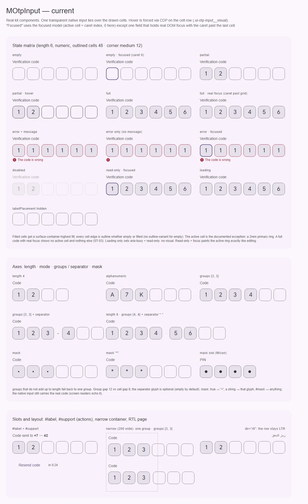
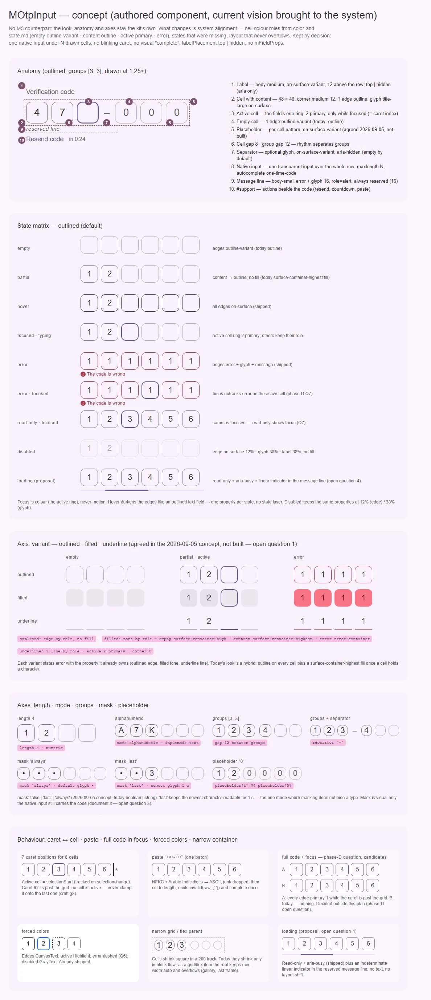

# MOtpInput — поле одноразового кода: один нативный инпут под N нарисованными ячейками

<identity>M3: нет в M3 — авторский компонент; системные правила берутся из семейства полей (`color-and-state.md`, таблица ролей «ячейки, чипы, шаги…») и из ролей `OutlinedTextFieldTokens` / `FilledTextFieldTokens` (кромка, disabled 12 / 38 %) · Токены Compose: прямых нет · Код: `src/runtime/components/ui/otp-input/` (`index.vue`, `props.ts`), `src/runtime/composables/otp-input/{useOtpValue,useOtpControl}.ts`, `src/runtime/shared/constants/otp.ts`, токены `src/runtime/assets/stylesheet/components/otp-input/_index.scss` · Аудит: `data/otp-input.json` · Тип: public. Дочерние части — [field.md](field.md) (ячейка), [group.md](group.md) (группа), [separator.md](separator.md) (разделитель): отдельными компонентами они больше не существуют</identity>

<implementation-status state="planned" updated="2026-10-07">Компонент прошёл QA фазы D (клик по ячейке, санитайз вставки до `maxlength`, постоянный `role="alert"`, слияние слушателей, `loading` → `aria-busy`). План выравнивает ячейки по таблице ролей системы, чинит раскладку в grid/flex-родителе и переносит из концепта 2026-09-05 то, что согласовано, но не построено (ось `variant`, `placeholder`, режимы `mask`). Шаги 1–2 без смены API; остальное ждёт вопросов 1–7.</implementation-status>

## Вердикт

**Авторский.** В M3 одноразового кода нет; эталон — нынешнее видение кита, и архитектура у него
верная: один `<input maxlength=N autocomplete="one-time-code">` поверх нарисованной сетки, каретка
по `selectionchange`, без мигающей каретки и без визуального `complete` (`decisions.md`). Разрыв —
системный, а не «до M3»: ячейки нарушают таблицу ролей (пустая и заполненная обе `outline`, а
заполненная ещё и заливается `surface-container-highest`), заполненный код в фокусе ничем не
отличается от покоя (вопрос фазы D), у `loading` нет вида, а в grid/flex-родителе ячейки не
сжимаются и вылезают за колонку. Ось `variant`, посимвольный `placeholder` и режимы `mask` из
концепта 2026-09-05 согласованы, но не построены.

## Рендеры

| Сейчас | Концепт (текущее видение, доведённое по системе) |
|---|---|
|  |  |

**Сейчас** (настоящие компоненты; hover — CDP на `.ui-otp-input__visual`; «focused» — модель
`focused`, активная ячейка = индекс каретки, у одной ячейки настоящий DOM-фокус):
1. Матрица состояний: пусто, пусто + фокус, частично, hover, полный, полный в настоящем фокусе
   (каретка за сеткой — ни одна ячейка не выделена, ST-03), ошибка с текстом и без, ошибка + фокус,
   disabled, read-only + фокус, loading (вида нет), `labelPlacement="hidden"`.
2. Оси: `length`, `mode`, `groups` с разделителем и без, `mask` (`true`, `'*'`, слот `#mask`).
3. Слоты и раскладка: `#label` + `#support`, узкий контейнер 200 (grid-родитель — ячейки **не**
   сжимаются и вылезают; в блочном потоке сжимались), `dir="rtl"` — ряд остаётся LTR.

**Концепт:**
1. Анатомия (outlined, группы [3, 3], ×1.25) — 10 частей.
2. Матрица состояний outlined с колонкой ролей: пусто `outline-variant`, есть символ `outline`,
   hover, активная ячейка, ошибка, ошибка + фокус, read-only + фокус, disabled, loading (вопрос 4).
3. Ось `variant`: outlined · filled · underline × пусто / частично + активная / ошибка (вопрос 1).
4. Оси `length`, `mode`, `groups`, `mask` (`'always'`, `'last'`), `placeholder`.
5. Поведение: 7 позиций каретки на 6 ячеек, вставка арабо-индийских цифр одним пакетом, кандидаты
   на фокус полного кода (вопрос фазы D), forced colors, узкий grid-родитель, loading.

## Анатомия

Нумерация — по кадру 1 концепта.

| # | Часть | Элемент кита | Статус |
|---|---|---|---|
| 1 | Лейбл | `<label class="ui-otp-input__label">` + слот `#label` (только содержимое, `id`/`for` у компонента) | есть; `top \| hidden` (решение) |
| 2 | Ячейка с символом | `span.ui-otp-input__field--filled` через `cellAttrs(i)`, слот `#field` → [field.md](field.md) | есть; иначе: роль кромки `outline` + заливка |
| 3 | Активная ячейка | `.ui-otp-input__field--active` | есть; кольцо 2 `primary` — единственное кольцо семейства полей |
| 4 | Пустая ячейка | `.ui-otp-input__field` | есть; иначе: кромка `outline` вместо `outline-variant` |
| 5 | Плейсхолдер ячейки | — | нет (концепт 2026-09-05) |
| 6 | Ритм: ячейки 8, группы 12 | `.ui-otp-input__group` → [group.md](group.md) | есть |
| 7 | Разделитель | `span.ui-otp-input__separator`, слот `#separator` → [separator.md](separator.md) | есть; пуст по умолчанию |
| 8 | Нативный инпут | `input.ui-otp-input__native`, `opacity: 0`, `inset: 0` | есть |
| 9 | Строка сообщения | `p.ui-otp-input__message` (`role="alert"`, всегда смонтирована) + глиф `ICONS.error` | есть; высота зарезервирована |
| 10 | Действия рядом | слот `#support` → `.ui-otp-input__support` | есть |

## Оси дизайна

| Ось | M3 | Кит сейчас | Цель | Ломает API |
|---|---|---|---|---|
| `length` | — | `number`, 6 | без изменений | нет |
| `mode` | — | `numeric \| alphanumeric` | без изменений | нет |
| `groups` / `separator` | — | `number[]`, `''`; сумма ≠ `length` → одна группа | без изменений: группы разделяет ритм 12 / 8, глиф по желанию | нет |
| `mask` | — | `boolean \| string` + слот `#mask` | `false \| 'last' \| 'always'` + слот (концепт 2026-09-05) — вопрос 2 | да |
| `placeholder` | — | нет | посимвольный шаблон: ячейка `i` показывает `placeholder[i] ?? placeholder[0]` (концепт 2026-09-05) | нет, добавление |
| `variant` | у полей filled · outlined | нет; вид — гибрид: кромка у всех + заливка у заполненных | `outlined \| filled \| underline` (концепт 2026-09-05) — вопрос 1 | нет, добавление; вид по умолчанию меняется |
| `labelPlacement` | — | `top \| hidden` | без изменений (решение, `craft.md` §2) | нет |
| `density` | S5: `compact \| default \| comfortable` | нет, ячейка 48 | вопрос 5 | нет |
| `required` | — | нет пропа; атрибут доходит через fallthrough | вопрос 6 | нет |

`mFieldProps` компонент сознательно не раздаёт (`craft.md` §2) — это не переоткрывается: оси
выше — собственные пропы OTP, сужения семейных юнионов там, где ось общая (`variant`).

## Оси состояний

Источник — `axes` аудита, сверено с кодом после фазы D.

| Ось | Нужно | Есть | Не хватает |
|---|---|---|---|
| Базовое | enabled, disabled, read-only | disabled по ролям (12 / 38 %); read-only нативно, фокус виден (Q7 фазы D) | режим `aria-disabled` — IN-08, вопрос фазы D |
| Взаимодействие | hover | кромки → `on-surface` в `can-hover` (`index.vue:282-286`) | — (pressed у поля нет) |
| Фокус | активная позиция, фокус всего поля | кольцо активной ячейки = индекс каретки, только при фокусе (`useOtpControl.ts:168`) | фокус полного кода: каретка за сеткой → ничего (ST-03, IN-03) — вопрос фазы D «фокус заполненного OTP»; модификатор `--focused` уже есть и не стилизован |
| Смысловое | error | роль `error` + глиф + текст, фокус старше ошибки | `complete` не нужен — решение (`decisions.md`); класс `--complete` мёртвый |
| Валидация | invalid, required, validating, touched | `aria-invalid` по видимой ошибке; `loading` → `aria-busy` + read-only | `required` (FM-10, вопрос 6); вид validating (FM-06, вопрос 4); `path` → `useField` (FM-04, вопрос 7) |
| Выбор, раскрытие, навигация, данные | — | — | неприменимо |

## Токены: расхождения

Эталон ролей — `color-and-state.md` (обязателен для ячеек); числа disabled — те же, что у
`OutlinedTextFieldTokens`. Совпадает: ячейка 48, форма `medium` 12, кромка 1, кольцо активной 2
`primary`, hover `on-surface`, ошибка `error`, disabled кромка 12 % и контент 38 %, лейбл
`body-medium` `on-surface-variant` (как вопрос Q3 text-field, рек. 1), глиф `title-large`, строка
сообщения `body-small` с высотой = line-height (16, как шаг 5 text-field), ритм 8 / 12, движение
`short-3` + `standard` на токенах (S4 отклонён — так и остаётся).

| Часть | Система / ориентир | Кит сейчас (`файл` / путь `g()`) | Действие |
|---|---|---|---|
| Кромка пустой ячейки | `outline-variant` («пусто») | `field.outline` = `outline` для всех (`_index.scss:22`) | `field.empty.outline` = `outline-variant` |
| Кромка ячейки с символом | `outline` («содержимое есть») | `field.outline` | `field.filled.outline` = `outline` |
| Заливка ячейки с символом | outlined — без заливки; заливка — свойство варианта `filled` | `field.filled.container` = `surface-container-highest` (`:25`, `index.vue:239-241`) | убрать у outlined, перенести в `filled.*` (вопрос 1) |
| Варианты | — | нет | `outlined` / `filled` (тон: пусто `surface-container-high`, есть `surface-container-highest`, ошибка `error-container`) / `underline` (линия 1, активная 2 `primary`, угол 0) — после вопроса 1 |
| Плейсхолдер | `on-surface-variant`, как плейсхолдер полей | нет | `field.placeholder.color` |
| Disabled-заливка | `DisabledContainerOpacity` 4 % | литерал `4%` (`:37`) | только у `filled`; ключ шкалы — вопрос фазы D «`disabled-fill`» |
| Фокус всего поля | — | нет | по ответу фазы D (модификатор `--focused`) |
| Иконка сообщения | 16 | `message.icon.size: 16rem` литерал (`:50`) | оставить (размер сетки иконок, не отступ) |
| Нативный инпут | ≥ 16 CSS px, иначе iOS масштабирует страницу на фокусе | `font-size` не задан → UA ~13 px (RS-11) | `font-size: medium` — ключевое слово = 16 px по умолчанию, без `px` в коде (проверить на устройстве) |

## Поведение и доступность

Сделано и не трогается: один инпут (`decisions.md`, `craft.md` §6), `autocomplete="one-time-code"`
из `OTP_AUTOCOMPLETE`, `inputmode` по `mode`, NFKC + арабо-индийские цифры (`decisions.md`),
вставка санитайзится до обрезки, IME — коммит на `compositionend`, каретка — `selectionchange`
только между focus и blur, 7 позиций каретки на 6 ячеек без клампа (`craft.md` §8), клик по ячейке
→ `focusAt(i)`, ячейки `aria-hidden`, `<label for>` + `aria-labelledby`, `aria-describedby` →
строка сообщения, постоянный `role="alert"`, `inheritAttrs: false` + `mergeProps` (Q9), dev-warn
без имени, `dir="rtl"` → ряд LTR, forced colors (ошибка пунктиром `CanvasText` — Q6, активная
`Highlight`, disabled `GrayText`), события `complete` (ровно на переходе), `invalid`, `clear`.

Открыто и привязано к шагам:
- **LY-07 — найдено на доске.** В блочном потоке ячейки сжимаются, а как grid- или flex-элемент
  корень держит `min-width: auto` (минимум по содержимому = вся строка), и `max-width: 100%`
  проигрывает: группы [3, 3] в колонке 329 занимают 352, в узкой колонке 200 — 332. → шаг 1.
- **Мёртвый модификатор `--complete`** (`index.vue:140`) приглашает стилизовать то, что
  отвергнуто решением. → шаг 1.
- **RS-11.** iOS увеличивает страницу на фокусе инпута с шрифтом < 16 px. → шаг 1, проверка руками.
- **ST-01 / ST-03 / IN-03** — фокус полного кода: вопрос фазы D, план только подключает ответ
  (шаг 6).
- **FM-06** — вид `loading` (вопрос 4), **FM-10** — `required` (вопрос 6), **FM-04 / EN-11** —
  `path` (вопрос 7), **A11-06** — маска и скринридер (вопрос 3), **LY-08** — плотность (вопрос 5),
  **IN-08** — `aria-disabled` (вопрос фазы D).
- **Ручные:** ST-07 / IN-04 (контраст и толщина кольца на vw-масштабе — 2rem может округлиться до
  1 px), CT-06, CT-12, LY-02, LY-03, TH-02, TH-03, A11-08 (перезапись символа в полном коде блокирует
  `maxlength` — UX-вопрос, см. «Предложения по UX», п. 1), TS-06.
- **Принято:** RS-04 / RS-05 / RS-06 (vw-масштаб — фича кита), TS-04, TK-09. **Вне репозитория:**
  DC-01…05 (документация в `docs`).

## API

Сейчас: пропы `length`, `mode`, `groups`, `separator`, `mask`, `autofocus`, `label`,
`labelPlacement`, `error`, `errorMessage`, `path`, `name`, `disabled`, `loading`, `readonly`;
модели `modelValue: string`, `focused`; события `complete`, `invalid`, `clear`; слоты `label`,
`group`, `field`, `mask`, `separator`, `support`. Композаблы `useOtpValue` / `useOtpControl` —
escape hatch без классов и `data-*`.

| Действие | Что | Ломает | Миграция |
|---|---|---|---|
| Добавить | `variant: MOtpInputVariant` = `MTextFieldVariant` (`outlined` по умолчанию) | нет (вид — да) | вопрос 1 |
| Добавить | `placeholder?: string` — посимвольный шаблон, только в ячейках (атрибут инпута не ставится) | нет | — |
| Изменить | `mask: boolean \| string` → `false \| 'last' \| 'always'` | да | вопрос 2: `true` → `'always'`, строка → слот `#mask`, на один minor с dev-warn |
| Добавить | `required` (+ `aria-required`, `*` в лейбле, как у textarea) | нет | вопрос 6 |
| Изменить | `path`: только `name` → `useField` либо удаление | да (поведение) | вопрос 7 |
| Добавить | `density` | нет | вопрос 5 |
| Убрать | класс `ui-otp-input--complete` | нет (класс не API, `data-*` нет) | — |
| Не трогать | модели, события, слоты, `labelPlacement`, `autocomplete` не наружу (`OTP_AUTOCOMPLETE`) | — | — |

## План работ

1. **S — раскладка и мусор.** `.ui-otp-input { min-width: 0 }` (LY-07); удалить
   `ui-otp-input--complete` (`index.vue:140`); `__native { font-size: medium }` (RS-11). Файлы:
   `components/ui/otp-input/index.vue`. Без зависимостей.
2. **S — роли ячеек.** `field.empty.outline` = `outline-variant`, `field.filled.outline` = `outline`;
   hover, ошибка, активная и disabled перекрывают их как сейчас. Видимое изменение: пустые ячейки
   светлее. Заливка заполненных — по вопросу 1 (вариант 3 оставляет её). Файлы: `_index.scss`,
   `index.vue`.
3. **M — ось `variant`** (после вопроса 1). Карта `outlined` / `filled` / `underline`, ошибка —
   свойством варианта (кромка / тон / линия), активная — кольцо 2 (у `underline` — линия 2).
   Модификатор `ui-otp-input--<variant>`. Файлы: `props.ts`, `_index.scss`, `index.vue`.
4. **S — `placeholder`.** Новое поле `OtpCell.hint` в `useOtpControl` (композабл остаётся без
   классов), цвет `field.placeholder.color`; в активной ячейке шаблон виден (рамки достаточно).
   Файлы: `useOtpControl.ts`, `props.ts`, `index.vue`, `_index.scss`.
5. **M — режимы `mask`** (после вопросов 2 и 3). `'last'` — последний введённый символ виден
   1 с (таймер через `useTimer`, снимается в `onScopeDispose`), `'always'` — сразу маска.
   Документация «маска не защищает от скринридера» по вопросу 3. Файлы: `useOtpControl.ts`,
   `shared/constants/otp.ts` (длительность — факт механизма, не дефолт), `props.ts`, `index.vue`.
6. **S — фокус полного кода.** Подключить ответ фазы D к модификатору `--focused`
   (зависимость: вопрос фазы D «фокус заполненного OTP»). Файлы: `index.vue`, `_index.scss`.
7. **S — вид `loading`** (после вопроса 4). Рекомендуемый вариант — `MProgressLinear` в строке
   сообщения. Файлы: `index.vue`, `_index.scss`.
8. **S — `required`** (после вопроса 6), **M — `path` → `useField`** (после вопроса 7, по образцу
   `useNumberInputControl`), **M — `density`** (если вопрос 5 = да).
9. **M — тесты** (раздел ниже).

## Тесты

- **Фикстуры:** `playground/fixtures/otp-input/matrix.vue` — добавить `variant` × {пусто, частично,
  ошибка, disabled}, `placeholder`, `mask: 'last'`; `stress.vue` — OTP с группами в grid-колонке
  200 и во flex-ряду, длина 8 с группами [4, 4].
- **e2e** (`otp-input.e2e.ts`): нет переполнения корня в grid- и flex-родителе (ширина ≤ колонки);
  computed `border-color` пустой ячейки = `outline-variant`, заполненной = `outline`; у outlined нет
  заливки; `placeholder` не попадает в значение и в `aria-*`; `mask: 'last'` — через 1 с символ
  скрыт (fake timers в unit, в e2e — ожидание); класса `--complete` нет. Существующие axe
  (light / dark × ltr / rtl), клавиатура, вставка, forced colors остаются.
- **unit:** `useOtpControl.spec.ts` — `hint` у ячеек; таймер `'last'` снимается при размонтировании;
  `variants.spec.ts` — модификаторы `variant`; миграция `mask: true`/строка с dev-warn.

## Готово, когда

- [ ] Пустые ячейки `outline-variant`, заполненные `outline`; заливка — только у `filled`.
- [ ] OTP с группами не вылезает из grid- и flex-колонки любой ширины.
- [ ] Класса `--complete` нет; решения `decisions.md` по OTP соблюдены.
- [ ] Согласованные в концепте `variant`, `placeholder`, `mask` построены или явно отложены
      записью в `decisions.md`.
- [ ] `npm run lint`, `lint:style`, `lint:scss`, `typecheck`, vitest, e2e `otp-input` — зелёные.
- [ ] Рендер `current.webp` переснят, расхождения с `concept.webp` — только из открытых вопросов.

## Предложения по UX

1. **Повторный ввод после ошибки одним движением.** Когда после `complete` пришла ошибка, фокус в
   поле выделяет весь код (`select()`), и первая же цифра начинает новый код — не нужно стирать шесть
   символов. Плюс `expose({ focus, select })` для приложения. Заказчик — любая форма 2FA / входа по
   SMS. Цена: S, бандл ~0, API — только `expose`. Рекомендация: **взять** (решает и A11-08 —
   «перезапись при полном коде блокирует `maxlength`»).
2. **WebOTP на Android Chrome.** Композабл `useWebOtp(model)` поверх
   `navigator.credentials.get({ otp: { transport: ['sms'] } })` с `AbortController`, только на
   клиенте: код из SMS формата `@домен #123456` подставляется без нажатий. Заказчик — вход по SMS.
   Цена: M, без зависимостей, новый композабл вне компонента (opt-in). Рекомендация: **взять
   отдельной задачей**; `autocomplete="one-time-code"` уже закрывает iOS.
3. **Рецепты для `#support`.** Обратный отсчёт «Отправить снова через 0:24» на существующем
   `useTimer` и кнопка «Вставить» через `navigator.clipboard.readText()` — в документации, не в
   компоненте (тексты — забота приложения, CT-13). Заказчик — те же формы. Цена: S, только docs.
   Рекомендация: **взять** вместе с DC-05.

## Открытые вопросы

Вопросы фазы D здесь не повторяются, план на них ссылается: фокус заполненного OTP, `aria-disabled`
(IN-08), когда впервые показывать ошибку (FM-04 у `useField`), английские строки по умолчанию
(CT-13), ключ `disabled-fill` (Q10–Q17 в итоге сессии фазы D,
[qa-fix-showcase-fields](../../../../../summary/qa-fix-showcase-fields_2026-10-07_0100.md)).

**1. Ось `variant` и вид по умолчанию.** Концепт 2026-09-05 согласовал `outlined | filled |
underline`, но код остался гибридом (кромка у всех + заливка у заполненных).
1. Построить ось, по умолчанию `outlined` без заливки. Цена: у всех OTP пропадает тональная
   заливка заполненных ячеек; её можно вернуть `variant="filled"`.
2. Построить ось, по умолчанию `filled`. Цена: дефолт уходит от рамок — заметнее, чем вариант 1.
3. Оси не строить (В4: заказчика второго вида нет), только роли кромок (шаг 2), заливку оставить.
   Цена: концепт остаётся недостроенным; гибрид противоречит «одно свойство на состояние».

Рекомендация: 1 — согласовано владельцем в концепте и совпадает с `color-and-state.md`.

**2. Форма пропа `mask`.**
1. `false | 'last' | 'always'`, глиф — только через `#mask`; `true` → `'always'`, строка → dev-warn
   на один minor. Цена: ломающее изменение для тех, кто передаёт строку.
2. `mask: false | 'last' | 'always'` + отдельный `maskCharacter: string`. Цена: два пропа на одну
   ось, `craft.md` §2 («флаг — ось с одним значением») против.
3. Оставить `boolean | string`, режим `'last'` не вводить. Цена: нет режима, где маска не мешает
   увидеть опечатку.

Рекомендация: 1.

**3. Маска и скринридер (A11-06).** Маска визуальна: инпут остаётся текстовым, скринридер и эхо
клавиатуры озвучивают код.
1. Задокументировать: маска — защита от взгляда через плечо, не от озвучки. Цена: ноль.
2. `-webkit-text-security: disc` на инпуте при маске. Цена: нестандартное свойство, на каретку и
   выделение не влияет, но часть скринридеров всё равно читает значение.
3. `type="password"` при маске. Цена: менеджеры паролей предлагают сохранить «пароль», риск для
   автоподстановки из SMS.

Рекомендация: 1.

**4. Вид `loading` (FM-06).** Сейчас только `aria-busy` + read-only.
1. Неопределённый `MProgressLinear` в зарезервированной строке сообщения. Цена: строка занята, пока
   идёт проверка (ошибки в этот момент нет по смыслу); текста нет — CT-13 не задет.
2. Ячейки на 38 % (как disabled). Цена: «проверяется» неотличимо от «выключено».
3. Ничего, индикатор — у кнопки отправки. Цена: при автоотправке по `complete` кнопки нет.

Рекомендация: 1.

**5. `density` у OTP (LY-08).** Ось кита — `compact | default | comfortable` (S5).
1. Не вводить, пока нет заказчика (В4); записать в `decisions.md` с условием возврата
   «OTP в плотной форме или в тулбаре». Цена: ячейка всегда 48.
2. Ввести: 40 / 48 / 56. Цена: три ветки токенов и сжатие всё равно нужно.

Рекомендация: 1.

**6. `required` (FM-10).**
1. Проп `required` → `required` + `aria-required` на инпуте и `*` (`aria-hidden`) в лейбле, как у
   textarea. Цена: новый проп.
2. Не вводить: OTP-поле обязательно по смыслу, атрибут и так доходит через fallthrough. Цена: нет
   звёздочки в форме, где остальные поля её показывают.

Рекомендация: 1.

**7. Что делает `path` (FM-04).** Сейчас — только запасное `name`, `useField` не вызывается.
1. Подключить `useField({ path, model })`: ошибки адаптера и touched, как у остальных полей.
   Цена: изменение поведения у тех, кто передавал `path` ради `name`.
2. Убрать `path` с dev-warn на один minor, имя — через `name`. Цена: OTP выпадает из форм на
   адаптере валидации.
3. Оставить как есть. Цена: проп с тем же именем ведёт себя иначе, чем у семейства.

Рекомендация: 1.
