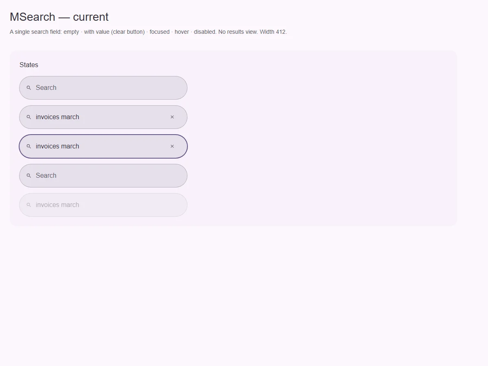
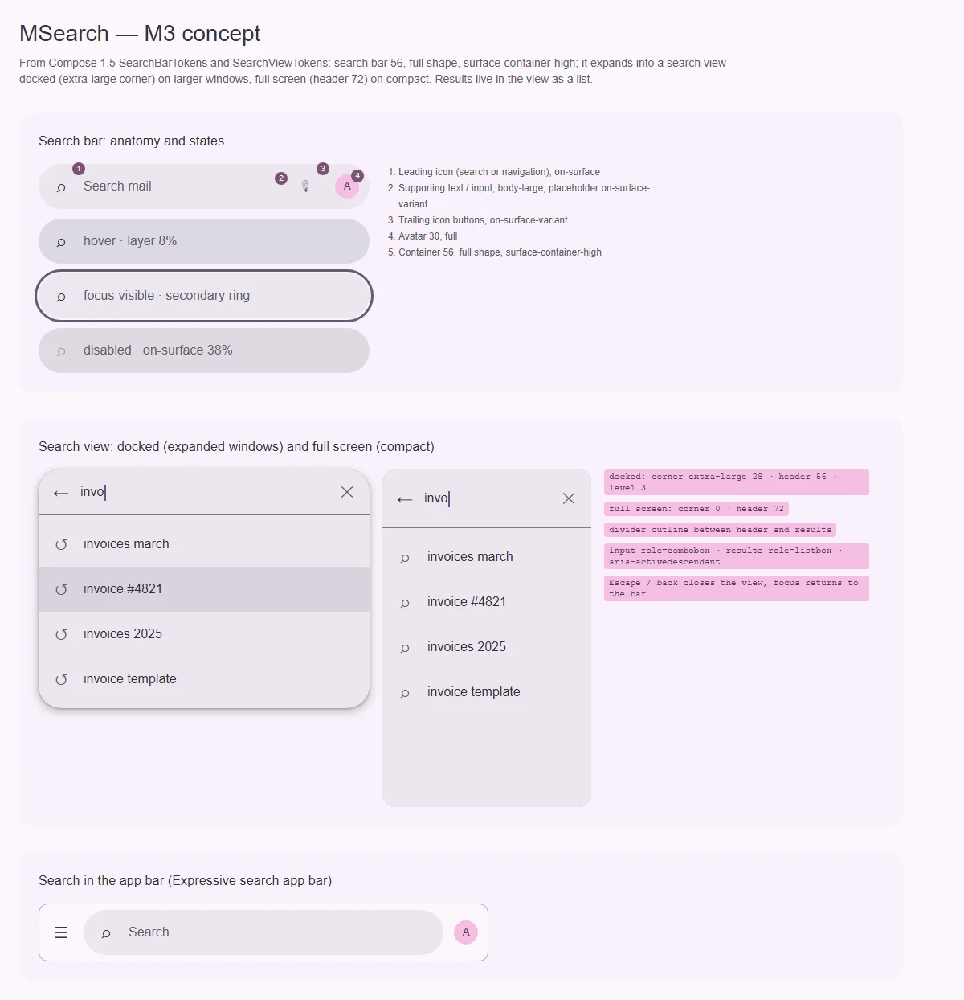

# MSearch — поисковая строка и вид результатов

<identity>M3: Search (search bar; search view — docked и full-screen; Expressive: search app bar) · Токены Compose: `SearchBarTokens`, `SearchViewTokens` + `SearchBar.kt` · Код: `src/runtime/components/ui/search/` · Аудит: `data/search.json` · Тип: public</identity>

<implementation-status state="planned" updated="2026-10-07">Есть только строка: поле `type="search"` полной формы с иконкой и кнопкой очистки, `inheritAttrs: false` + `useControlAttrs`. Нет вида результатов (search view), слотов для trailing-действий и аватара, слоя состояний. Английские строки по умолчанию.</implementation-status>

## Вердикт

`переработка`. Строка узнаваема (полная форма, 56), но в M3 поиск — это **пара**: строка
раскрывается в вид результатов. Docked-вид — на средних и больших окнах, полноэкранный — на
compact. У кита вида нет вообще, и каждый продукт собирает подсказки сам через `MMenu`.

Сама строка расходится:
- контейнер `surface-container-highest` + рамка вместо `surface-container-high` без рамки;
- нет слоя hover;
- иконки меньше 24 в цели 48;
- нет слотов для trailing-кнопок и аватара;
- «Search» и «Clear search» зашиты по-английски.

## Рендеры

| Сейчас | Концепт M3 |
|---|---|
|  |  |

Сейчас: пусто, со значением, в фокусе, hover (слоя нет), disabled.

Концепт:
1. Анатомия строки и состояния.
2. Search view docked и full-screen с результатами.
3. Поиск внутри app bar.

## Анатомия

| # | Часть M3 | В ките | Статус |
|---|---|---|---|
| 1 | Контейнер 56, full, `surface-container-high` | `.ui-search`, `surface-container-highest` + рамка `outline-variant` | иначе |
| 2 | Leading icon 24 в 48 (`on-surface`), может быть навигацией | слот `#leading`, иконка меньше | иначе (размер) |
| 3 | Ввод / подсказка, body-large | `input type="search"`, placeholder | есть; дефолт «Search» |
| 4 | Trailing-кнопки (`on-surface-variant`) | только «очистить» | нет слота действий |
| 5 | Аватар 30 | — | нет |
| 6 | Search view: заголовок 56 (docked) / 72 (full), разделитель `outline`, список результатов | — | нет |

## Оси дизайна

| Ось | M3 | Кит сейчас | Цель | Ломает API |
|---|---|---|---|---|
| Вид результатов | нет · docked · full-screen | нет | `view: 'none' \| 'docked' \| 'fullscreen' \| 'auto'` (auto: full на compact) | нет |
| Место | отдельно · в app bar | отдельно | рецепт со слотом app bar ([app-bar](../navigation/app-bar.md)) | нет |
| `density` | нет | нет | не вводить | — |

## Оси состояний

| Ось | Нужно | Есть | Не хватает |
|---|---|---|---|
| Взаимодействие | слой hover 8% на контейнере | нет | слой |
| Фокус | кольцо `secondary` (`FocusIndicatorColor`) | утолщённая рамка цвета `primary` | Решение кита: у полей фокус — смена цвета без кольца. Поиск — поле, вопрос 1 |
| Раскрытие | закрыта · открыта (view) | — | вместе с `view` |
| Данные | результаты · загрузка · пусто · ошибка | — | слоты вида |

## Токены: расхождения

| Часть | M3 (Compose) | Кит сейчас (`search/_index.scss`) | Действие |
|---|---|---|---|
| Контейнер | `surface-container-high` | `surface-container-highest` | `high` |
| Рамка | нет | `1rem outline-variant` | убрать |
| Иконки | 24, цель 48 | меньше | `icon.size: 24rem`, `icon.target: 48rem` |
| Отступы | 4 по краям вокруг кнопок 48 | `padding.inline: 16rem` | `spacing(4)` |
| Аватар | 30, full | — | токен |
| Вид docked | `surface-container-high`, corner extra-large, level 3, заголовок 56, разделитель `outline` | — | новая ветка `view.*` |
| Вид full | corner none, заголовок 72 | — | `view.full.*` |
| `max.width` | — | 720 | оставить как ось кита |

## Поведение и доступность

- **Search view.** Поле — `role="combobox"`, `aria-expanded`, `aria-controls` на список
  результатов `role="listbox"`, `aria-activedescendant`. Стрелки двигают выделение, Enter
  выбирает, Escape закрывает вид и оставляет фокус в строке.
- Переиспользовать клавиатуру и тип-ахед дропдауна (`useDropdownKeyboard`, `usePanelStatus`).
  Панель docked — внутренний popover из плана [menu](../overlays/menu.md). Полноэкранный вид —
  `MOverlay` (модальный). Новый контроллер не заводим.
- **Строки.**
  - `placeholder` — без английского дефолта.
  - Имя кнопки очистки — проп `clearLabel` без дефолта, в dev предупреждение.
  - Политика английских строк — общий вопрос Q13.

## API

| Что | Изменение | Ломает |
|---|---|---|
| `view` | новый | нет |
| слоты | `#trailing` (кнопки), `#avatar`, `#results` (список, `{ items, active }`), `#empty`, `#loading` | нет |
| `clearLabel` | новый, вместо зашитого «Clear search» | видимо для AT |
| `placeholder` | без дефолта «Search» | видимо |
| события | `submit(query)`, `select(item)`, `update:open` | нет |

## План работ

1. **S — строка по токенам:** контейнер, без рамки, иконки 24/48, отступы, слой hover.
2. **S — слоты `#trailing` и `#avatar`, `clearLabel`, без английских дефолтов.**
3. **L — search view:**
   - docked и full-screen;
   - `role="combobox"` + `listbox`;
   - клавиатура дропдауна;
   - слоты состояний данных.
4. **S — рецепт поиска в app bar** (документация, связка с `app-bar.md`).
5. **S — фокус** по вопросу 1.
6. **M — тесты и документация.**

## Тесты

- Unit:
  - строка: слоты, очистка, `submit` по Enter;
  - вид: `aria-expanded`, `aria-activedescendant` двигается стрелками, Escape закрывает и
    оставляет фокус.
- e2e:
  - `view="auto"`: на 360 полноэкранный вид, на 1366 docked;
  - axe в открытом виде;
  - результаты не выходят за окно.

## Готово, когда

- Строка совпадает с токенами M3.
- Есть вид результатов в двух формах с доступной клавиатурой.
- Нет зашитых английских строк.

## Предложения по UX

Расширения сверх паритета с M3. Это предложения владельцу, а не шаги плана. Без Expressive-анимаций и без новых зависимостей.

| Предложение | Что получает пользователь | Заказчик | Цена | Рекомендация |
|---|---|---|---|---|
| Недавние запросы (хранилище через проп-адаптер, по умолчанию `sessionStorage`) | Повторный поиск в одно касание | docs, любые списки | S | да |
| Горячая клавиша `/` или `mod+k` фокусирует строку (через `useHotkey`) | Быстрый поиск с клавиатуры | docs-сайт | S · реестр уже есть | да |
| Подсветка совпадения в результатах (`<mark>`) | Видно, почему результат подошёл | все | S · утилита разметки без `v-html` | да |
| Отложенный запрос (`debounce`) и отмена устаревших (`AbortSignal` в обработчике) | Список не мигает, сеть не перегружается | серверный поиск | S | да |

## Открытые вопросы

**1. Как поиск показывает фокус?**
1. Как поле кита: смена цвета рамки или контейнера без кольца (решение Q6–Q9 для семейства
   полей). Единообразно с полями, но в M3 у search bar кольцо `secondary`.
2. Как M3: общее кольцо фокуса `focus-ring`, как у кнопок и чипов. Совпадает с M3, но поиск
   выпадает из правила полей.

Рекомендация: 2. Строка поиска в M3 — отдельный контрол полной формы, а не поле формы с
лейблом. Правило полей касается коробки с лейблом и строкой поддержки, которых у поиска нет.
