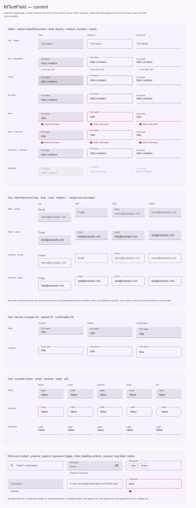
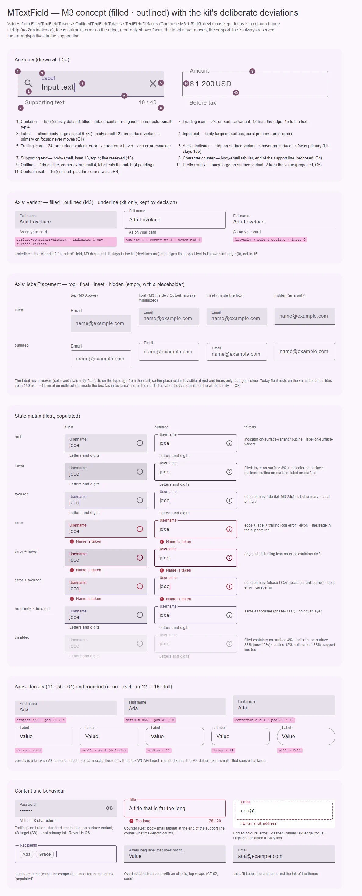

# MTextField — однострочное поле ввода: filled · outlined · underline

<identity>M3: Text fields (filled, outlined) · Токены Compose: `FilledTextFieldTokens.kt`, `OutlinedTextFieldTokens.kt`; поведение и раскладка — `TextField.kt`, `OutlinedTextField.kt`, `TextFieldDefaults.kt` (`TextFieldLabelPosition`), `internal/TextFieldImpl.kt`, `SecureTextField.kt` · Код: `src/runtime/components/ui/text-field/` (+ `composables/text-field/useTextField.ts`, токены `assets/stylesheet/components/text-field/_index.scss`) · Аудит: `data/text-field.json` · Тип: public; база композитов (`dropdown`, `autocomplete`, `file-input`, `color-input`, `fragments/color-picker/Edit.vue`, `fragments/form-renderer/field`)</identity>

<implementation-status state="planned" updated="2026-10-07">Компонент прошёл QA фазы D (фокус, ошибка, a11y, RTL, autofill, forced colors). План доводит токены до M3 и снимает расхождения внутри семейства полей. Ломающих шагов без решения владельца нет.</implementation-status>

## Вердикт

**Дрейф.** Компонент узнаётся как M3 filled/outlined text field: высота 56, контейнер
`surface-container-highest`, форма extra-small, индикатор 1dp, лейбл body-large → body-small,
supporting text body-small с отступом 16/4 — всё совпадает. Разошлись мелкие роли состояний
(disabled-индикатор 12% вместо 38%, ошибка при наведении, цвет каретки и плейсхолдера, цвет
trailing-иконки в ошибке) и две оси размещения лейбла: `float` сегодня анимируется, хотя
система это запрещает, а `inset` на `outlined` уходит в вырез рамки, хотя по документации стоит
внутри коробки. Из анатомии M3 нет счётчика символов и prefix/suffix — это решения владельца
(Q4, Q5), а не дрейф. Фокус цветом без утолщения, «фокус старше ошибки», глиф ошибки в строке
поддержки и `underline` — осознанные отклонения кита.

## Рендеры

| Сейчас | Концепт M3 |
|---|---|
|  |  |

Кадры концепта:

1. **Анатомия** (filled в фокусе и outlined с prefix/suffix, 1.5×) — 11 частей с размерами и ролями.
2. **Ось variant** — filled · outlined (M3) · underline (только кит; строка поддержки с отступом 0).
3. **Ось labelPlacement** — top · float · inset · hidden на пустом поле с плейсхолдером. Целевой
   вид по рекомендации Q1: `float` сразу на верхней кромке, плейсхолдер виден в покое; `inset` на
   outlined — внутри коробки; `top` — body-medium (Q3).
4. **Матрица состояний** filled × outlined: rest, hover, focused, error, error+hover, error+focused,
   read-only+focused, disabled, с колонкой токенов.
5. **Оси density и rounded** с выносками высот и радиусов.
6. **Контент и поведение** — trailing icon button (reveal, Q6), счётчик (Q4), forced colors,
   композит с чипами (`leading-content`), обрезка длинного лейбла, `:autofill`.

На текущей доске видно: фокус отличается от покоя только оттенком 1dp-кромки (отклонение, так и
задумано); строка поддержки у `underline` сдвинута на 16 относительно значения; `inset` на
outlined стоит в вырезе, как `float`; кнопка в `append` красится в primary.

## Анатомия

| # | Часть M3 | Кит | Статус |
|---|---|---|---|
| 1 | Container | `.ui-text-field__control` | есть; h56 при `density="default"` |
| 2 | Leading icon | слот `prepend` → `.ui-text-field__icon--prepend` | есть (слот, не проп); отступы 12 / 16 как в M3 |
| 3 | Label | `<label class="__label">` + скрытая `<legend class="__notch">` для выреза | есть; иначе: **не движется** (отклонение кита), сейчас движется — Q1 |
| 4 | Input text | `<input class="__input">` | есть; нет `caret-color` |
| 5 | Trailing icon | слот `append` → `.ui-text-field__icon--append` | есть; в ошибке не меняет цвет |
| 6 | Active indicator / Outline | filled: `border-bottom` у `__control`; outlined: `<fieldset class="__outline">` | есть; фокус 1dp вместо 2dp (отклонение) |
| 7 | Supporting text | `
`, внутри постоянный `` | есть; высота зарезервирована всегда (отклонение в сторону строгости) |
| 8 | Character counter | — | нет — Q4 |
| 9 | Prefix / suffix | — | нет — Q5 |
| 10 | Placeholder | нативный `placeholder` | есть; цвет не задан, берётся из UA |

Части, которых нет в M3: `*` обязательности (`__required`, `aria-hidden`), глиф ошибки в строке
поддержки (`__support-icon`), ряд `leading-content` для чипов композитов (`__field`, `__leading`).

## Оси дизайна

| Ось | M3 | Кит сейчас | Цель | Ломает API |
|---|---|---|---|---|
| `variant` | filled · outlined | `filled \| outlined \| underline` (`MTextFieldVariant`), дефолт filled | Без изменений. `underline` — «standard» из M2, в M3 его нет; остаётся по `decisions.md`, его строка поддержки выравнивается по его же краю (0) | нет |
| `labelPlacement` | `TextFieldLabelPosition`: `Above`, `Inside`/`Cutout` (раскрыт в покое), `isAlwaysMinimized` | `top \| float \| inset \| hidden`, дефолт `float`; `float` в покое лежит на строке значения и поднимается за 150 мс | `float` не движется (Q1); `inset` на outlined — внутри коробки (баг, шаг 4); типографика `top` — Q3 | нет (визуально — да) |
| `density` | одна высота 56 (`TextFieldDefaults.MinHeight`) | `compact 44 \| default 56 \| comfortable 64` (`fieldDensityProp`) | Без изменений: ось `density` из трёх ступеней — решение владельца 2026-10-07 (СВ-2), у полей она уже такая | нет |
| форма | `CornerExtraSmall` (outlined), `CornerExtraSmallTop` (filled) | проп `rounded`: `sharp 0 · small 4 · medium 12 · large 16 · pill full`; filled ограничивает `pill` до large | Значения совпадают с M3 по умолчанию. Имя `rounded` расходится с канонической осью `shape` — Q7 | да, если переименовать |
| `type` | любой нативный | `MTextFieldType`: `text \| number \| email \| password \| tel \| url \| search` | `number` при живом `<MNumberInput>` — Q2 | возможно |
| счётчик | `maxlength` → «N / max» в конце строки поддержки | нет (у textarea есть) | Q4 | нет |
| prefix / suffix | `prefix`/`suffix`, on-surface-variant, отступ 2 | нет (у number-input есть зона единицы) | Q5 | нет |
| скрытие ввода | `SecureTextField` (обфускация + переключатель) | `type="password"` + слот `append` | Q6 | нет |

## Оси состояний

Источник — `axes` аудита, сверено с кодом после фазы D.

| Ось | Нужно | Есть | Не хватает |
|---|---|---|---|
| Базовое | enabled, disabled, read-only | enabled; disabled (native); read-only (native, фокус виден — Q7 фазы D) | режим `aria-disabled` (IN-08, открыт в фазе D); визуальный признак read-only (ST-01, открыт) |
| Взаимодействие | rest, hover | rest, hover внутри `can-hover` | hover filled — заранее смешанный фон, а не слой (шаг 2); error+hover (шаг 1) |
| Фокус | focused | класс `--focused`, смена цвета кромки и лейбла | `caret-color` (шаг 1) |
| Смысловое | error | цвет + глиф + текст; error+focused по Q7 фазы D | trailing-иконка в ошибке (шаг 1) |
| Валидация | invalid, required, validating, autofilled | `aria-invalid` только при видимой ошибке (Q8), `*` + `aria-required`, `aria-busy` по `meta.pending`, `:autofill` | визуальное validating (FM-06), момент первого показа ошибки (FM-04) — оба открыты в фазе D |
| Выбор, раскрытие, навигация, данные | — | — | неприменимо (раскрытие у композитов поверх `inputAttrs`/`expose`) |

## Токены: расхождения

Совпадает: высота 56; filled `surface-container-highest`; формы extra-small / extra-small-top;
индикатор 1dp `on-surface-variant` → hover `on-surface`; outline 1dp `outline` → hover
`on-surface`; ошибка `error` для кромки, лейбла и текста; disabled-контент 38%, disabled-outline
12%, disabled-контейнер filled 4%; лейбл и значение body-large, поднятый лейбл ×0.75 = 12
(body-small); иконки 24 с отступами 12 / 16; supporting body-small, отступы 16 / 4.

| Часть | M3 (Compose) | Кит сейчас (`файл` / путь `g()`) | Действие |
|---|---|---|---|
| Индикатор / outline в фокусе | 2dp `primary` (`FocusActiveIndicatorHeight`, `FocusOutlineWidth`) | 1rem `primary` (`container.border.width`) | **Отклонение** — не трогать |
| Кромка error + focused | `error` | `primary` (`filled.error.focused.border.bottom.color`, `outlined.error.focused.border.color`) | **Отклонение** (Q7 фазы D) |
| Индикатор filled, disabled | `on-surface` 38% (`DisabledActiveIndicatorOpacity`) | 12% `state-opacity(disabled-container)` (`_index.scss:118`) | → `state-opacity(disabled-content)` |
| Кромка error + hover | `on-error-container` | `error`; токены `filled.error.hover.*`, `outlined.error.hover.*` объявлены (`_index.scss:132`, `:178`), но в `index.vue` не читаются — мёртвые | → `on-error-container`, подключить правилом |
| Лейбл error + hover | `on-error-container` | `error` | добавить `*.error.hover.label.color` |
| Trailing icon в error | `error`; при hover `on-error-container` | `on-surface-variant` (`icon.color`) | добавить `error.icon.color` для `__icon--append` |
| Лейбл outlined при hover | `on-surface` (`HoverLabelColor`) | `on-surface-variant` | добавить `outlined.hover.label.color` |
| Каретка | `primary`; в ошибке `error` (`CaretColor`, `ErrorFocusCaretColor`) | не задана (`currentColor` = `on-surface`); есть только в `:autofill` (`index.vue:363`) | `input.caret.color` + `error.caret.color` |
| Плейсхолдер | `on-surface-variant` (`InputPlaceholderColor`) | не задан — цвет UA (`index.vue:350`) | `input.placeholder.color`, как у textarea и number-input |
| Supporting в disabled | `on-surface` 38% | `on-surface-variant` (правила нет, `index.vue:462`) | добавить |
| Hover filled | слой `on-surface` 8% | заранее смешанный фон `filled.hover.bg` (`_index.scss:109`) | слой `::before` (craft §1), визуально то же |
| Строка поддержки | `MinSupportingTextLineHeight` 16 | `helper.min-height` 18rem (`_index.scss:88`); у number-input 16 | единая высота = line-height body-small (16) во всём семействе |
| Лейбл `top` | body-small, отступ 4 по горизонтали, 4 снизу (`AboveLabel*Padding`) | body-large (`typography.label`), отступ 0, зазор 4 | Q3 |
| Строка поддержки `underline` | — | отступ 16 при значении с 0 (`helper.padding.inline`) | 0 для `underline` |
| `outlined.bg`, `label.left` | — | не читаются | удалить при переводе файла |
| Литерал 4% (`filled.disabled.bg`) | `DisabledContainerOpacity` 0.04 | литерал, ключа в `$theme-state-link` нет | ждёт ответа фазы D (ST-05, «ключ `disabled-fill`») |

## Поведение и доступность

- **Нативный контрол.** `<input>` с `<label for>` через `useId`; `aria-describedby` → строка
  поддержки, когда в ней есть текст; `aria-invalid` только при видимой ошибке (Q8 фазы D);
  `aria-required`; `aria-busy` по `meta.pending`. Глиф ошибки и `*` — `aria-hidden`. Регион
  `role="alert"` смонтирован всегда, helper стоит вне его (DT-09: механика готова, проверка в
  NVDA/VoiceOver — ручная).
- **Атрибуты.** `inheritAttrs: false` + `useControlAttrs` (Q9 фазы D): `class`/`style` на корень,
  остальное — на `<input>` через `mergeProps`.
- **Клавиатура.** Нативная; кит ничего не перехватывает. Композиты подмешивают свои обработчики
  через `inputAttrs`.
- **Движение.** Цвета кромки, фона и лейбла меняются за `short-3` 150 мс `standard` — на токенах
  `--sys-motion-*`. Пружины Expressive (`FastEffects` у M3) в вебе не вводятся: S4 отклонён
  владельцем 2026-10-07. Лейбл не движется (Q1). Reduced motion сокращает, а не выключает.
- **Forced colors.** Фокус `Highlight`, ошибка — пунктирная кромка `CanvasText` (Q6 фазы D),
  disabled `GrayText`; фокус старше ошибки и здесь.
- **RTL, autofill.** Сделано в фазе D (`:dir(rtl)` для `transform-origin` и сдвига выреза,
  `background-clip: text` для `:autofill`). Общий миксин `:autofill` — открытый вопрос фазы D.
- **Открытые пункты аудита**, решаемые не этим планом: IN-08 (`aria-disabled`), FM-04 (момент
  показа ошибки, общий `useField`), FM-06 (визуальное validating), CT-02 (обрезанный длинный
  лейбл), CT-11 (намёк на прокрутку ряда чипов), TH-11 (`prefers-contrast: more`), FM-03 (сообщения
  адаптера). ST-07 и TH-03 (контраст 1dp-кромки в покое и в фокусе) остаются ручной
  проверкой: по решению фокус — только цвет, план его не утолщает.

## API

Сейчас: `mFieldProps` (`disabled`, `readonly`, `variant`, `rounded`, `labelPlacement`, `path`,
`name`, `label`, `placeholder`, `helperText`, `error`, `errorMessage`, `required`, `autofocus`,
`autocomplete`) + `density` + `type` + `inputAttrs` + `populated`; модели `modelValue: string`,
`focused`; слоты `prepend`, `append`, `leading-content`, `helper({ message })`,
`error({ message })`; `expose` — `{ control, input }` (`MFieldParts`).

- **Шаги 1–6 API не меняют.**
- **Добавления после ответов:** `counter` + `maxlength` (Q4), `prefix`/`suffix` (Q5), режим
  reveal (Q6).
- **Ломающие, только после ответа:** `type: 'number'` (Q2) — путь миграции: dev-warn на минор,
  потом удаление, замена — `<MNumberInput>`; `rounded` → `shape` (Q7) — путь миграции:
  `shape` принимает `Extract<MShape, 'none' | 'extra-small' | 'medium' | 'large' | 'full'>`,
  `rounded` остаётся алиасом с dev-warn на один минор и меняет всё семейство (`textarea`,
  `number-input`, `dropdown`, `autocomplete`, `file-input`).
- **Перенесено из прежнего плана.** `makeMTextFieldProps()` не нужен: роль фабрики играют
  `mFieldProps` + `fieldDensityProp`, и `dropdown`/`autocomplete` их уже спредят. `file-input` и
  `color-input` до сих пор перечисляют пропы руками и теряют `rounded`, `labelPlacement`,
  `density`, `required` — это шаги их собственных планов. Слот `#value` **отложен**: композитам
  хватило `leading-content` + `inputAttrs` + `populated` + `expose`. Вернуть, когда появится
  обёртка, которой нужно показать в коробке не-строковое значение.

## План работ

1. **S — Роли состояний по M3** (без зависимостей; семейная правка, тот же шаг в планах
   textarea и number-input, одним PR). Disabled-индикатор filled 38%; error+hover —
   `on-error-container` для кромки, лейбла и trailing-иконки (подключить мёртвые
   `*.error.hover.*`); trailing-иконка в ошибке — `error`; лейбл outlined при hover — `on-surface`;
   `caret-color` `primary` / `error`; цвет плейсхолдера `on-surface-variant`; supporting в
   disabled — 38%; удалить `outlined.bg`, `label.left`. Файлы: `_index.scss`, `index.vue`.
2. **S — Hover filled слоем.** `::before` на `__control` с `isolation: isolate`, непрозрачность
   `state-opacity(hover)`; убрать `filled.hover.bg`. Визуально то же; нужно для `:autofill` и
   будущего S1. Файлы: те же.
3. **S — `underline`: строка поддержки с отступом 0.** Токен `helper.padding.inline` по варианту.
4. **M — `inset` на outlined внутри коробки.** Регресс рефакторинга выреза (2026-09-30): сейчас
   ветка `&--label-inset` поднимает лейбл в вырез (`index.vue:629-647`), а `props.ts` и
   textarea ставят его внутрь. Асимметричный паддинг `__row` и подъём `raised-inside` для outlined
   + inset, вырез не открывается. Тот же шаг в number-input. Файлы: `index.vue`, `_index.scss`.
5. **S — Единая высота строки поддержки** = `var(--md-sys-typescale-body-small-line-height)` (16).
   Видимое изменение: −2rem под каждым text-field и textarea. Тот же шаг в textarea.
6. **M — Лейбл не движется** (после Q1). Убрать `transition: transform` у лейбла
   (`index.vue:292-294`) и `max-width` у выреза (`:450`); при варианте 1 — `float` всегда поднят,
   плейсхолдер виден в покое (`:664-671` упрощается). Тот же шаг в number-input. Обновить e2e
   «a numeric 0 raises the floating label».
7. **S — Типографика лейбла `top`** (после Q3), общая для трёх полей.
8. **M — Счётчик** (после Q4): переиспользовать логику `useTextareaControl` (UTF-16 как
   `maxlength`, live-регион только у лимита), вынести её в общий композабл, а не копировать.
9. **M — Prefix / suffix** (после Q5). **S — reveal** (после Q6).
10. **M — `useTextFieldControl`** (по §6 `common.md` и `behavior.md`): бэги `inputAttrs`,
    `labelAttrs`, `supportAttrs`, `alertAttrs`; `MTextField` становится потребителем, как
    textarea и number-input. Спека «без `class`/`data-*`». Можно отдельной задачей.
11. **L — `rounded` → `shape`** (после Q7), всё семейство, с алиасом и миграцией.
12. **S — `type: 'number'`** (после Q2).

## Тесты

- **Фикстура `matrix`**: добавить строки error+hover (CDP hover), `inset` × outlined, underline с
  helper; колонку с trailing-иконкой в ошибке.
- **e2e** (`text-field.e2e.ts`): каретка `primary`/`error` (computed `caret-color`); disabled
  supporting 38%; `underline` — левый край строки поддержки = левый край значения; `inset` на
  outlined не открывает вырез (`legend` шириной ~0); после шага 6 — у лейбла нет
  `transition-property: transform`, его позиция одинакова до и после фокуса; высота строки
  поддержки 16 во всех трёх полях. Существующие axe (light/dark × ltr/rtl), Tab, forced colors
  остаются.
- **unit** (`index.spec.ts`): классы состояний не меняются; при Q4/Q5 — пропы счётчика и аффиксов,
  `aria-describedby` включает id счётчика.

## Готово, когда

- [ ] В матрице filled/outlined/underline × 8 состояний роли совпадают с колонкой токенов концепта.
- [ ] Мёртвых путей в карте `text-field` нет, `npm run lint:scss` чист.
- [ ] `inset` на outlined стоит внутри коробки, `float` не анимирует позицию (после Q1).
- [ ] Высота строки поддержки одинакова у text-field, textarea и number-input.
- [ ] `npm run lint`, `lint:style`, `lint:scss`, `test`, e2e `text-field` зелёные.
- [ ] Рендер `current.webp` пересняли, расхождения с `concept.webp` — только из открытых вопросов.

## Предложения по UX

Не шаги плана: расширения сверх паритета с M3, каждое — после согласия владельца. Счётчик,
prefix/suffix и показ пароля здесь не повторяются — это Q4–Q6; момент показа ошибки,
validating и обрезанный лейбл — открытые вопросы фазы D (FM-04, FM-06, CT-02).

| Предложение | Что получает пользователь | Заказчик | Цена | Рекомендация |
|---|---|---|---|---|
| **Кнопка очистки** — проп `clearable`: стандартная icon-кнопка × в trailing-зоне, видна при непустом значении; очищает, возвращает фокус в поле, шлёт `clear` | Одно нажатие вместо выделения и Backspace — особенно на таче | Поиск и фильтры; у `<MDropdown>` такая кнопка уже есть (`MESSAGES.dropdownClear`) — поведение и строку переиспользовать | S; новый проп + событие; имя кнопки — строка по умолчанию (зависит от CT-13 / Q13); бандл ≈0 | Да, первой из списка |
| **Подсказки клавиатуры по `type`** — дефолты `inputmode`, `autocapitalize`, `spellcheck`, `enterkeyhint` (email/url/password: без автокапитализации и проверки орфографии; tel: телефонная клавиатура); всё перекрывается атрибутами | Правильная экранная клавиатура и никакой «Ivan@Mail.ru» с заглавной на мобильном | Любая форма с email/телефоном/URL | S; API не меняется (атрибуты потребителя через `useControlAttrs` старше дефолтов); бандл ≈0 | Да |
| **Модификаторы `v-model.trim` / `.lazy`** через `defineModel` (`modelModifiers`) | Пробел из буфера обмена не превращает корректный email в ошибку валидации; `.lazy` — запись по `change` для дорогих вычислений | Формы входа и регистрации, поля с вставкой из письма | S; API — стандартный синтаксис Vue, нового пропа нет | Да |
| **Копирование read-only значения** — проп `copyable` для `readonly`: trailing icon-кнопка «копировать», подтверждение — сменой глифа на ✓ и `aria-live` | ID, токены, ссылки копируются без ручного выделения | Страницы настроек (API-ключ, ID проекта) | S; новый проп + строки «Копировать / Скопировано» (CT-13); Clipboard API — без зависимостей | Только при названном заказчике (В4) |

## Открытые вопросы

Связанные вопросы фазы D здесь не повторяются: момент первого показа ошибки (FM-04), английские
строки по умолчанию (CT-13 / Q13), `aria-disabled` (IN-08), визуальное validating (FM-06), ключ
`disabled-fill` (ST-05), общий миксин `:autofill`, `letter-spacing` в `typescale`.

**Q1. Что значит «лейбл не движется» для `float`?** Сейчас `float` в покое лежит на строке
значения и поднимается за 150 мс, хотя `color-and-state.md` говорит «сидит на верхней кромке и
там остаётся».

1. `float` всегда на кромке (M3 `isAlwaysMinimized`): плейсхолдер виден в покое, фокус меняет
   только цвет. Совпадает с конституцией и с textarea. Цена: заметно меняется вид по умолчанию у
   всех однострочных полей; filled `float` и filled `inset` становятся одинаковыми (как в
   textarea — различие только на outlined).
2. Позиции как сейчас, но без перехода: лейбл «прыгает» на фокусе. Вид покоя не меняется. Цена:
   позиция всё равно меняется, автозаполнение по-прежнему может наложить значение на лейбл.
3. Оставить анимацию и переписать решение в `decisions.md`. Цена: кит снова двигает лейбл, и
   правило перестаёт быть правилом.

Рекомендация: 1.

**Q2. `type="number"` у `<MTextField>`.** Модель строковая, колесо и стрелки браузера меняют
значение, а для чисел есть `<MNumberInput>`.

1. Оставить как есть. Цена: ловушка в API.
2. Dev-warn с советом взять `<MNumberInput>`, удалить в следующем мажоре. Цена: ломающее
   изменение позже.
3. Удалить сейчас. Цена: ломает потребителей сразу.

Рекомендация: 2.

**Q3. Типографика лейбла `top` для семейства.** Сейчас text-field и number-input — body-large,
textarea — body-medium; в форме из двух полей лейблы разного кегля.

1. body-medium везде (как textarea по спеке полей). Цена: −2 кегля у text-field и number-input.
2. body-small, отступ 4 — как `Above` в M3. Цена: мелкий лейбл над крупным полем, расходится
   со спекой textarea.
3. body-large везде. Цена: textarea уходит от спеки.

Рекомендация: 1.

**Q4. Счётчик символов у `<MTextField>`.** В M3 он есть у любого текстового поля с `maxlength`,
у кита — только у textarea.

1. Добавить `counter: boolean | number` с той же семантикой, что у textarea, логику вынести в общий
   композабл. Цена: новый проп, ещё одна строка в строке поддержки.
2. Не добавлять, пока нет заказчика (В4). Цена: семейство несимметрично.

Рекомендация: 1, если есть хотя бы одна форма-потребитель; иначе 2 с записью в `decisions.md`.

**Q5. Prefix / suffix текстом.** M3: «$», «@gmail.com»; у number-input уже есть зона единицы.

1. Пропы `prefix`/`suffix` (строки), body-large `on-surface-variant`, отступ 2; видны, когда лейбл
   поднят. Цена: новый API, взаимодействие с `float` в покое (снимается вариантом 1 в Q1).
2. Слоты `#prefix`/`#suffix`. Цена: гибче, но произвольная разметка внутри строки значения.
3. Не добавлять (В4). Цена: потребители кладут текст в `prepend`/`append` с размерами иконки.

Рекомендация: 1 после Q1.

**Q6. Встроенный переключатель видимости пароля** (M3 `SecureTextField`).

1. Проп `reveal` при `type="password"`: стандартная icon-кнопка в trailing-зоне, `aria-pressed`,
   имя — проп со строкой из `MESSAGES` (зависит от CT-13). Цена: новая английская строка по
   умолчанию.
2. Оставить слот `append` и пример в документации. Цена: каждый потребитель повторяет кнопку
   (и, как на доске, красит её в primary).

Рекомендация: 2 до ответа на CT-13, затем 1.

**Q7. Имя оси формы: `rounded` или каноническая `shape`.** `axes.md` закрепляет за скруглением
слово `shape` (`MShape`); поля используют `rounded` со своими значениями (`small` = extra-small 4).

1. Перейти на `shape: Extract<MShape, 'none' | 'extra-small' | 'medium' | 'large' | 'full'>`, `rounded`
   — алиас с dev-warn на минор. Цена: ломающее изменение всего семейства полей.
2. Оставить `rounded` и записать исключение в `axes.md` рядом с исключением для `variant`.
   Цена: два слова для одной оси.

Рекомендация: 1, вместе с миграцией `size` → `density` из `decisions.md`, одним мажором.
