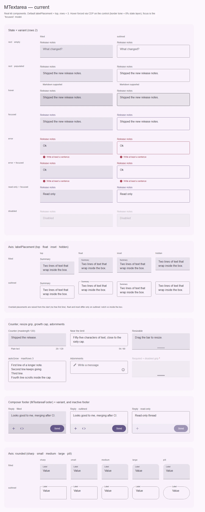
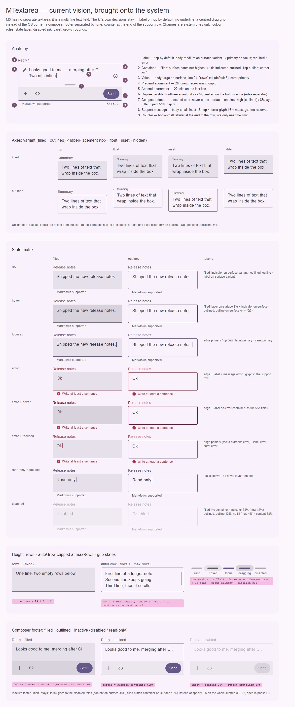

# MTextarea — многострочное поле: filled · outlined, рост по строкам, ручка, композер

<identity>M3: Text fields, многострочный режим (Compose `TextField` с `lineLimits = MultiLine`, material-web `type="textarea"`) · Токены Compose: `FilledTextFieldTokens.kt`, `OutlinedTextFieldTokens.kt` (те же, что у text-field) · Код: `src/runtime/components/ui/textarea/` (`index.vue`, `footer.vue` = `MTextareaFooter`, `props.ts`) + `composables/textarea/{useTextareaControl,useTextareaResize}.ts`, токены `assets/stylesheet/components/textarea/_index.scss` · Аудит: `data/textarea.json` · Тип: public (+ sub `MTextareaFooter`)</identity>

<implementation-status state="planned" updated="2026-10-07">Компонент собран по спеке полей (2026-09-03) и прошёл QA фазы D. План выравнивает роли состояний с text-field и M3 и чинит границы роста; авторские решения не трогает.</implementation-status>

## Вердикт

**Дрейф** — с авторскими расширениями поверх M3. Хром — это M3 text field: контейнер
`surface-container-highest` / outline 1dp, форма extra-small, значение body-large, счётчик в конце
строки поддержки (там же, где в M3). Свои решения кита, которые план сохраняет: лейбл сверху по
умолчанию, нет `underline`, ручка-полоса вместо системного уголка, футер-композер, отделённый тоном,
плотности нет — высоту задают `rows`. Расхождения: у outlined на hover появляется заливка (в M3,
text-field и number-input — только рамка), у outlined в disabled — заливка 4%, которой нет ни в
одном другом его состоянии, disabled-индикатор filled 12% вместо 38%, ошибка при наведении и
каретка не по M3. И один баг, найденный на рендере: при `autoGrow` поле на строку выше `rows` и
на строку выше `maxRows`.

Отдельный компонент, а не `type="textarea"` у text-field, — решение прежнего плана, оно в силе:
у многострочного ввода свои `rows`, перенос, рост, ограничение и внутренняя прокрутка, и они
перегрузили бы API однострочного поля.

## Рендеры

| Сейчас | Концепт |
|---|---|
|  |  |

Кадры концепта (текущий вид, доведённый по системе):

1. **Анатомия** — 9 частей: лейбл сверху, контейнер, значение, два украшения, ручка, футер,
   сообщение, счётчик.
2. **Оси variant × labelPlacement** — без изменений: overlaid-лейбл поднят сразу, `float` и `inset`
   различаются только на outlined.
3. **Матрица состояний** filled × outlined с колонкой токенов: outlined на hover меняет только
   рамку (Q2), error+hover — `on-error-container`, каретка `primary`/`error`, outlined disabled
   без заливки, filled-индикатор в disabled 38%.
4. **Высота** — `rows` фиксированно; `autoGrow` с потолком ровно `maxRows` строк и полосой
   прокрутки; состояния ручки (rest, hover, focus, dragging, disabled).
5. **Футер-композер** — filled (слой 8%), outlined (`surface-container-high`), неактивный — роли
   disabled вместо `opacity: 0.6` (вопрос ST-06 фазы D).

На текущей доске видно: заливка outlined на hover; при `rows=1, maxRows=3` видно четыре строки;
неактивный футер гаснет целиком, включая кнопку.

## Анатомия

| # | Часть | Кит | Статус |
|---|---|---|---|
| 1 | Label (M3: label) | `<label class="__label">`, по умолчанию над коробкой; `*` → `__required` | есть; типографика body-medium — семейный вопрос Q3 в плане text-field |
| 2 | Container (M3: container + indicator/outline) | `.ui-textarea__control`; outlined — `<fieldset class="__outline">` с вырезом | есть |
| 3 | Value (M3: input text) | `<textarea class="__input">` внутри `__body` | есть; нет `caret-color` |
| 4 | Prepend adornment (M3: leading icon) | слот `prepend` → `__adornment--prepend`, 20 | есть |
| 5 | Append adornment (M3: trailing icon) | слот `append` → `__adornment--append`, прижат к последней строке | есть |
| 6 | Grip (нет в M3) | `` при `resizable` | есть, авторская |
| 7 | Composer footer (нет в M3) | слот `footer` → `<MTextareaFooter>` (`start` / `end` / default) | есть, авторская |
| 8 | Supporting text | `
` + постоянный `` + глиф ошибки | есть |
| 9 | Character counter | `` в конце строки поддержки + скрытый `__counter-live` | есть; место — Q1 |

## Оси дизайна

| Ось | M3 | Кит сейчас | Цель | Ломает API |
|---|---|---|---|---|
| `variant` | filled · outlined | `filled \| outlined` (`MTextareaVariant`); `underline` отвергнут (`decisions.md`) | без изменений | нет |
| `labelPlacement` | `Inside` / `Cutout` / `Above` | `top \| float \| inset \| hidden`, дефолт `top`; overlaid поднят с начала | без изменений; кегль `top` — Q3 text-field | нет |
| Высота | `TextFieldLineLimits.MultiLine(minHeightInLines, maxHeightInLines)` | `rows` (3), `maxRows`, `autoGrow`, `resizable` (ручка) | починить границы роста (шаг 3) | нет |
| Форма | extra-small 4 | `rounded` как у text-field; `full` ограничен коробкой по умолчанию (48) | имя оси — Q7 text-field | при переименовании |
| Счётчик | конец строки supporting | `counter: boolean \| number` в конце строки поддержки | без изменений (Q1) | нет |
| Композер | — | `MTextareaFooter` в слоте `footer` | неактивный вид — по ответу ST-06 | нет |
| Плотность | — | нет: высоту задают `rows` (решение 2026-09-03) | без изменений | нет |

## Оси состояний

| Ось | Нужно | Есть | Не хватает |
|---|---|---|---|
| Базовое | enabled, disabled, read-only | все три; read-only показывает фокус (Q7 фазы D), футер `inert` | `aria-disabled` (IN-08, открыт); визуальный признак read-only (ST-01, открыт) |
| Взаимодействие | rest, hover; dragged у ручки | слой 8% на hover внутри `can-hover`; `--resizing` | outlined: слой лишний (Q2); error+hover |
| Фокус | focused; focus-visible у ручки | `--focused` — цвет кромки и лейбла; ручка — цвет полосы | `caret-color`; кольцо у ручки — открытый вопрос фазы D |
| Смысловое | error | цвет + глиф + текст | error+hover `on-error-container` |
| Валидация | invalid, required, validating, autofilled | `aria-invalid` по видимой ошибке, `*` + `aria-required`, `aria-busy`, `:autofill` | визуальное validating (FM-06), момент показа (FM-04) — открыты |
| Раскрытие, выбор, навигация, данные | — | — | неприменимо |

## Токены: расхождения

Совпадает с M3: контейнер filled, outline 1dp `outline`, hover-рамка `on-surface`, ошибка `error`,
disabled-контент 38%, disabled-outline 12%, filled disabled-контейнер 4%, значение body-large,
плейсхолдер `on-surface-variant`, строка поддержки body-small с отступами 16 / 4.

| Часть | M3 (Compose) | Кит сейчас (`файл` / путь `g()`) | Действие |
|---|---|---|---|
| Кромка в фокусе | 2dp `primary` | 1rem `focused.border.color` | **Отклонение** |
| Кромка error + focused | `error` | `primary` (правило фокуса после ошибки, `index.vue:597`, `:625`) | **Отклонение** (Q7 фазы D) |
| Индикатор filled, disabled | `on-surface` 38% | общий для двух форм `disabled.border.color` 12% (`_index.scss:132`) | разделить: `filled.disabled.border.color` 38%, outlined остаётся 12% |
| Контейнер outlined, disabled | нет | `disabled.surface` 4% (`index.vue:629-632`) | убрать: у outlined фона нет ни в одном другом состоянии (В2) |
| Hover outlined | только outline `on-surface` | outline + слой 8% (`index.vue:635-640`, «в каждой форме») | Q2 |
| Кромка и лейбл error + hover | `on-error-container` | `error` | добавить `error.hover.*` |
| Каретка | `primary` / `error` | не задана | `input.caret.color`, `error.caret.color` |
| Границы роста | ровно N строк | `growth.min-height` / `max-height` = `N × 1lh + 2 × padding.block` (`_index.scss:142-145`), а паддинг стоит на `__body`, не на `<textarea>`: замер `rows=1` → 48, `maxRows=3` → 96 | убрать слагаемое паддинга |
| Строка поддержки | 16 | `support.min-height` 18rem (`_index.scss:79`) | 16 — общая высота семейства |
| Футер неактивный | — | `opacity: 0.6` на всё дерево (`footer.vue:116-119`) | ждёт ответа ST-06 фазы D; концепт показывает роли disabled |
| Лейбл `top` | body-small (`Above`) | body-medium | Q3 text-field |
| Ручка | — | полоса 44×5 `outline-variant`, цель 72×24, hover `on-surface-variant` + полоса 8%, фокус `primary` | без изменений; контраст `outline-variant` < 3:1 — ручная проверка TH-03 |

## Поведение и доступность

Перенесено из прежнего плана и сверено с кодом:

- **Нативный `<textarea>`**: Enter, стрелки, выделение, буфер не перехватываются. `<label for>`,
  `aria-describedby` = строка поддержки + счётчик, `aria-invalid` только при видимой ошибке
  (Q8 фазы D), `aria-required`, `aria-busy` по `meta.pending`. Disabled и read-only — разные
  нативные состояния; при них футер `inert`.
- **Атрибуты**: `inheritAttrs: false` + `useControlAttrs` (Q9 фазы D).
- **Счётчик**: `counter: true` берёт лимит из `maxlength`; число — лимит только для показа;
  `true` без `maxlength` показывает длину; `maxlength` всегда нативный. Считает UTF-16, как
  `maxlength`; режим графем отложен до общего API ограничения ввода. Видимый счётчик не live;
  скрытый `counter-live` говорит только у лимита (остаток ≤ max(10, 10% лимита)).
- **Рост**: одна механика на браузер — `field-sizing: content`, где поддерживается, иначе
  `useTextareaResize.sync()` меряет `scrollHeight` один раз на изменение значения. Зеркальный
  элемент прежнего плана не понадобился. Не меньше `rows`, после `maxRows` — внутренняя прокрутка
  с `scrollbar-gutter: stable`. Высота, выставленная руками, старше `autoGrow` до Escape на ручке —
  заменяет правило прежнего плана «`resize` при `autoGrow` игнорируется с предупреждением».
- **Ручка** — паттерн window splitter: `role="separator"`, `tabindex`, `aria-orientation`,
  `aria-valuenow/min/max` в строках; ArrowUp/Down — строка, PageUp/Down — страница, Home/End —
  границы, Escape — сброс. Нативный `resize` не используется: он не проходит WCAG 2.1.1.
  Прежний проп `resize: 'vertical' | 'horizontal' | 'both'` заменён на `resizable` (только
  вертикаль).
- **Клик по паддингу** фокусирует поле (`focusFromBox`), клики по своим целям не перехватываются.
- **Движение**: цвета `short-3` `standard`, рост `short-2` `standard-decelerate`, во время
  перетаскивания без перехода — всё на токенах `--sys-motion-*`; пружины Expressive (S4) в вебе
  не вводятся (решение владельца 2026-10-07). Reduced motion сокращает.
- **Forced colors**: фокус `Highlight` (и в read-only), ошибка — пунктирная кромка `CanvasText`,
  ручка `CanvasText` / `Highlight` / `GrayText`.
- **Headless API** (изменён в фазе D): `inputAttrs`, `labelAttrs`, `supportAttrs`/`counterAttrs`
  (`{ id }`), `alertAttrs`, `counterLiveAttrs`, `counterAnnouncement`, `gripAttrs`; без `class` и
  `data-*`.
- **Открытые пункты аудита фазы D** (не решаются этим планом): ST-06 (неактивный футер), IN-04
  (кольцо фокуса у ручки), IN-08, FM-04, FM-06, CT-11 (намёк на продолжение при `maxRows`),
  A11-17 (однокликовая альтернатива перетаскиванию), RS-12 (цель ручки на `pointer: coarse`),
  EN-11 (период деприкации для удалённых `underline`/`code`), TH-11.

## API

Сейчас: `mFieldProps` (с `variant: 'filled' | 'outlined'` и `labelPlacement` по умолчанию `top`)
+ `rows: 3`, `maxRows`, `autoGrow`, `resizable`, `resizeLabel` (`MESSAGES.textareaResize`),
`maxlength`, `counter: boolean | number`, `spellcheck`, `wrap: 'soft' | 'hard' | 'off'`. Модели
`modelValue: string`, `focused`. Слоты `prepend`, `append`, `helper({ message })`,
`error({ message })`, `counter(counter)`, `footer`. `MTextareaFooter`: слоты `start`, `end`
(fallback — default).

- Шаги плана API не меняют.
- Возможная ломка — только семейная (Q7 text-field: `rounded` → `shape`).
- Отложено из прежнего плана: режим подсчёта графем; `resize` по горизонтали (заказчика нет).

## План работ

1. **S — Роли состояний** (семейная правка вместе с шагом 1 text-field и number-input):
   disabled-индикатор filled 38% отдельным токеном; error+hover `on-error-container` для кромки и
   лейбла; `caret-color` `primary` / `error`. Файлы: `_index.scss`, `index.vue`.
2. **S — Outlined disabled без заливки** (В2). Убрать `background-color` из ветки
   `&--outlined.--disabled`; тот же шаг в number-input. Файл: `index.vue:629-632`.
3. **S — Границы роста.** `growth.min-height: calc(var(--m-textarea-rows) * 1lh)`,
   `growth.max-height: calc(var(--m-textarea-max-rows) * 1lh)`; проверить, что JS-путь
   (`useTextareaResize`, `chrome` = паддинг самого `<textarea>` = 0) и CSS считают одинаково.
   Видимое изменение: поле с `autoGrow` становится на строку ниже. Файл: `_index.scss:142-145`.
4. **S — Высота строки поддержки 16** (семейная, вместе с шагом 5 text-field).
5. **S — Hover outlined без слоя** (после Q2).
6. **S — Неактивный футер ролями** (после ответа на ST-06): `inert` остаётся, контент 38%,
   контейнер кнопки 10%, без `opacity` на дереве.
7. **S — Кегль лейбла `top`** (после Q3 text-field).

## Тесты

- **Фикстура `matrix`**: строка `autoGrow` с `rows=1, maxRows=3` и длинным значением; outlined
  disabled; error+hover (CDP).
- **e2e** (`textarea.e2e.ts`): высота `<textarea>` при `autoGrow` = `rows × line-height`, потолок =
  `maxRows × line-height` (сейчас упадёт — фиксирует баг шага 3); фон outlined disabled
  прозрачный; после Q2 — у outlined на hover `::before` с нулевой непрозрачностью; каретка;
  высота строки поддержки 16. Существующие axe, Tab, ручка, live-регионы, forced colors остаются.
- **unit**: `useTextareaControl.spec` — без изменений API; спека «без `class`/`data-*`» остаётся.

## Готово, когда

- [ ] `autoGrow` даёт ровно `rows` строк в покое и ровно `maxRows` до прокрутки — в Chromium
  (`field-sizing`) и в пути без него.
- [ ] Outlined не имеет заливки ни в одном состоянии (кроме ответа Q2, если выбран вариант 2).
- [ ] Роли состояний совпадают с колонкой токенов концепта и с text-field.
- [ ] `lint`, `lint:style`, `lint:scss`, `test`, e2e `textarea` зелёные; рендер переснят.

## Предложения по UX

Не шаги плана: расширения сверх паритета с M3, каждое — после согласия владельца. Не повторяют
открытые вопросы фазы D (неактивный футер ST-06, намёк на прокрутку CT-11, однокликовая
альтернатива ручке A11-17, цель ручки на таче RS-12) и счётчик text-field (Q4 там).

| Предложение | Что получает пользователь | Заказчик | Цена | Рекомендация |
|---|---|---|---|---|
| **Отправка по Ctrl/⌘+Enter** — событие `submit` при модификатор+Enter, когда в поле есть `footer`; голый Enter по-прежнему переводит строку | Ответ отправляется с клавиатуры, рука не идёт к мыши; привычно по мессенджерам и трекерам | Композер (`MTextareaFooter` с кнопкой «Отправить») | S; одно событие, перехвата Enter без модификатора нет; подсказка о сочетании — дело потребителя (`#start` футера) | Да |
| **Состояние «сверх лимита» у счётчика** — при `counter: number` (лимит только для показа) и длине больше лимита счётчик берёт роль `error`, а в скрытый live-регион уходит «N / limit» | Мягкий лимит видно не только скринридеру: превышение заметно до отправки, а ввод не обрезается | Комментарии и описания с рекомендуемой длиной (лимит проверяет сервер или схема) | S; без нового API, только токен `counter.over.color` и ветка класса | Да |
| **Каретка в зоне видимости при росте** — при `autoGrow` после изменения высоты `scrollIntoView({ block: 'nearest' })` на строке каретки, только если каретка ушла за край вьюпорта | При наборе в растущем поле внизу экрана строка ввода не уезжает под край и под экранную клавиатуру | Мобильные композеры (ручная проверка RS-11 аудита) | S; без API; `requestAnimationFrame`, один вызов на изменение высоты | Да, вместе с шагом 3 |

## Открытые вопросы

Связанные вопросы фазы D не повторяются (ST-06, кольцо у ручки, A11-17, RS-12, CT-11, FM-04,
FM-06, IN-08, EN-11). Семейные вопросы живут в плане text-field (Q1 движение лейбла — у textarea
лейбл и так не двигается; Q3 кегль `top`; Q7 `rounded` → `shape`).

**Q1. Где стоит счётчик.** В коде и в M3 — в конце строки поддержки. В заметках к спеке полей
записано «счётчик в строке лейбла».

1. Оставить в строке поддержки. Работает при любом `labelPlacement`, совпадает с M3 и с
   будущим счётчиком text-field (Q4). Цена: расходится с записью о спеке.
2. В строке лейбла при `top`, в строке поддержки при остальных размещениях. Цена: два места
   для одной части, разные `aria-describedby`-порядки.

Рекомендация: 1, и записать в `decisions.md`, чтобы вопрос не всплывал снова.

**Q2. Hover у outlined.** Сейчас слой 8% ложится на обе формы, у text-field и number-input
outlined меняет только рамку, M3 — тоже.

1. Только рамка `on-surface`, слой — у filled. Совпадает с M3, семейством и В2. Цена: у outlined
   пропадает заливка на hover (меньше «отклика» на большой площади).
2. Оставить слой у обеих форм и добавить его outlined-форме text-field и number-input. Цена:
   расходится с M3, outlined получает фон, которого у него нет в покое.

Рекомендация: 1.
