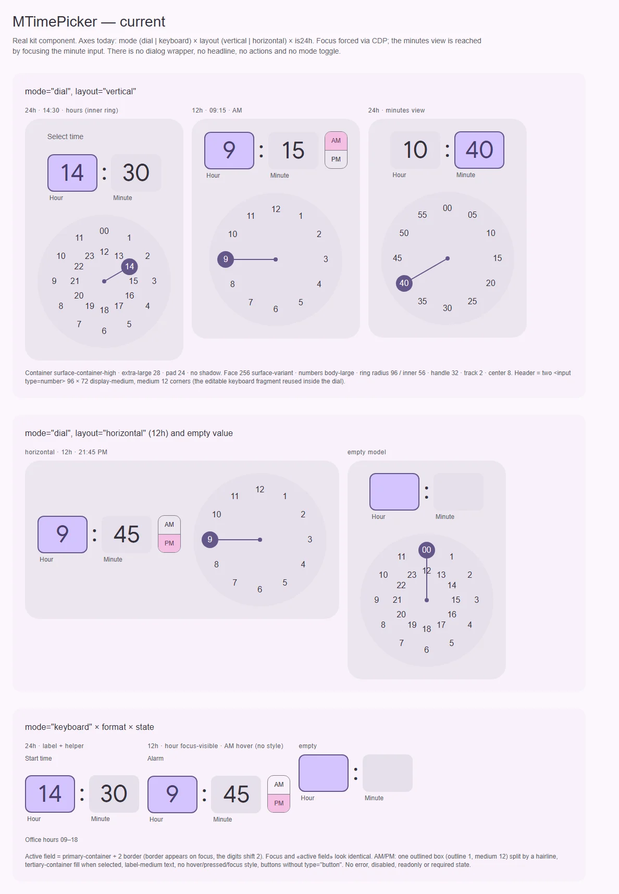
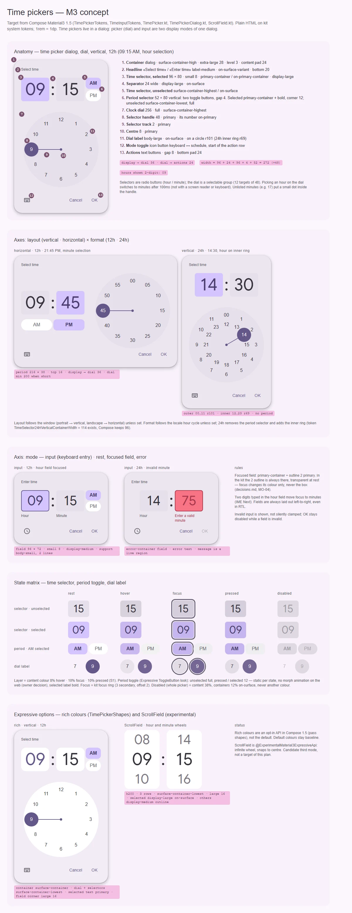

# MTimePicker — выбор времени: циферблат (dial) или ввод с клавиатуры

<identity>M3: Time pickers — dial (vertical / horizontal), input, 12h / 24h, AM/PM selector; Expressive: rich colours (`TimePickerShapes`), `ScrollField` (experimental) · Токены Compose: `TimePickerTokens.kt`, `TimeInputTokens.kt`; поведение — `TimePicker.kt`, `TimePickerDialog.kt`, `ScrollField.kt` · Код: `src/runtime/components/ui/time-picker/`, фрагменты `src/runtime/components/fragments/time-picker/{dial,keyboard}/`, `src/runtime/composables/time/useTimePicker.ts`, токены `src/runtime/assets/stylesheet/components/time-picker/{dial,keyboard}/_index.scss` · Аудит: `data/time-picker.json` · Тип: public (`MTimePicker`), sub (фрагменты `dial`, `keyboard`)</identity>

<implementation-status state="planned" updated="2026-10-07">Исследование и рендеры готовы, код не менялся. Шаги 1–2 не ломают API и могут идти сразу. Шаги 3–5 ждут ответов на вопросы 3–5, 8 и 9, шаг 6 — на вопросы 1–2.</implementation-status>

## Вердикт

`переработка`. Циферблат по анатомии M3 на месте: круг 256, стрелка 2, центр 8, два кольца в 24h. Шапка же собрана из другого. В режиме dial вместо селекторов-кнопок 96 × 80 стоят те же редактируемые `<input type=number>` 96 × 72, что и в режиме ввода. Фокус и «активное поле» нарисованы одинаково, рамкой, которая сдвигает цифры. AM/PM — outlined-бокс с волосяной линией и `tertiary-container`, хотя в Expressive это пара toggle-кнопок, у которых форма зависит от выбора (в ките — статично, без морфа). Ручка 32 вместо 48, кольца r96/56 вместо r101/69, циферблат `surface-variant`.

Диалога у компонента нет, а M3 показывает time picker только в нём: нет заголовка «Select time», переключателя режима и Cancel/OK. С клавиатуры циферблат недоступен вовсе. Нет ошибки, disabled, readonly и required. Флаг `is24h` — свёрнутая ось.

## Рендеры

| Сейчас | Концепт M3 |
|---|---|
|  |  |

**Сейчас** (настоящий `MTimePicker`):
1. `mode="dial"`, `layout="vertical"`: 24h 14:30 (внутреннее кольцо), 12h 09:15 и 24h на минутах. Видно, что час «9» не дополнен нулём, ручка 32 перекрывает соседние цифры, а поле часов «активно» с рамкой, хотя фокуса нет.
2. `layout="horizontal"` 12h и пустая модель. Пустое значение показывает выбранное «00» и активное поле часов.
3. `mode="keyboard"`: 24h с label и helper, 12h с принудительным focus-visible на часах (выглядит как «активное», без кольца) и hover на AM (стиля нет), пустое значение.

**Концепт:**
1. Анатомия диалога с циферблатом, 13 частей: селекторы 96 × 80, разделитель, Expressive-селектор периода, циферблат, ручка 48, трек, центр, переключатель режима, actions.
2. Оси раскладки и формата: horizontal 12h (период 216 × 38 под селекторами) и vertical 24h (внутреннее кольцо r69, без периода).
3. Ось режима (input): поля 96 × 72 с подписями Hour/Minute, фокус (`primary-container` + обводка 2), ошибка (`error-container`, OK заблокирован).
4. Матрица состояний для селектора, периода (форма по состоянию: full → 12, статично) и цифры циферблата.
5. Опции Expressive: rich-цвета (`TimePickerShapes`) и `ScrollField`, оба — кандидаты, не цель.

## Анатомия

Нумерация — по кадру 1 концепта.

| # | Часть M3 | Элемент кита | Статус |
|---|---|---|---|
| 1 | Контейнер диалога | `.ui-time-picker-dial` рисует свою карточку; в `keyboard` контейнера нет | иначе: диалога нет, карточка встроена (вопрос 1) |
| 2 | Headline «Select time» / «Enter time» | проп `label` → `.ui-time-picker-dial__label` (`label-large`) или `<label>` в `keyboard` | иначе: `label-large`, а не `label-medium`; в dial не связан с полями (FM-01) |
| 3 | Селектор времени, выбранный | `.ui-time-picker-keyboard__input--active` | иначе: `<input>` 96 × 72, рамка 2 вместо заливки, `display-medium` |
| 4 | Разделитель | `.ui-time-picker-keyboard__separator` | иначе: `display-medium`, сдвинут `padding-bottom: 24rem` |
| 5 | Селектор времени, невыбранный | `.ui-time-picker-keyboard__input` | иначе: `surface-variant`, `medium` 12 |
| 6 | Селектор периода (AM/PM) | `.ui-time-picker-keyboard__ampm` | иначе: один outlined-бокс с волосяной линией, `tertiary-container`, `label-medium`, без `type="button"` и `aria-checked` |
| 7 | Циферблат | `.ui-time-picker-dial__face` | есть: 256, но `surface-variant` |
| 8 | Ручка | `.ui-time-picker-dial__selector-knob` | иначе: 32 вместо 48 |
| 9 | Трек | `.ui-time-picker-dial__selector` | есть: 2 `primary` |
| 10 | Центр | `.ui-time-picker-dial__center-dot` | есть: 8 `primary` |
| 11 | Цифры циферблата | `.ui-time-picker-dial__number` | есть: `body-large`; радиусы 96 / 56 в JS |
| 12 | Переключатель режима (keyboard ↔ schedule) | — | нет: режим задаёт только проп `mode` |
| 13 | Actions (Cancel / OK) | — | нет |
| — | Подписи полей «Hour» / «Minute» (input) | `.ui-time-picker-keyboard__field-label` | есть, но `label-medium` и не связаны с полем |
| — | Helper / ошибка | `.ui-time-picker-keyboard__helper` | есть helper; ошибки нет, токены `error` объявлены, но не используются |

## Оси дизайна

| Ось | M3 | Кит сейчас | Цель | Ломает API |
|---|---|---|---|---|
| Режим (display mode) | `Picker` (dial) · `Input`, переключатель в диалоге | `mode: 'dial' \| 'keyboard'`, переключателя нет | значения — вопрос 9; переключатель — в `MDialogTime` (вопрос 2) | да, если переименование |
| Раскладка | `Vertical` · `Horizontal`, по умолчанию из размера окна | `layout: 'vertical' \| 'horizontal'`, по умолчанию `vertical`, horizontal переполняет узкий контейнер (RS-01) | вопрос 6 | нет |
| Формат часов | `is24hour`, по умолчанию из системы | `is24h: boolean = true` | ось, а не флаг — вопрос 3 | да |
| Подача | всегда в диалоге (`TimePickerDialog`) | встроенная карточка | встроенный + `MDialogTime` — вопросы 1–2 | нет |
| Цвета | baseline · rich (Expressive, по выбору) | baseline с устаревшими ролями | baseline M3; rich не вводить — вопрос 7 | нет |
| ScrollField | третий способ ввода (experimental) | нет | не вводить, вопрос 7 | нет |
| Плотность | нет (`ClockDialMinContainerSize` 200 при нехватке высоты) | нет | не вводить | нет |

## Оси состояний

Из `axes` аудита, сверено с кодом.

| Ось | Нужно | Есть | Не хватает |
|---|---|---|---|
| Базовое состояние | enabled, disabled, readonly | enabled | `disabled`, `readonly` (IN-09) |
| Взаимодействие | hover / pressed на селекторах, периоде, цифрах; dragged на циферблате | dragged (перетаскивание стрелки) | hover и pressed везде (ST-01, IN-07) |
| Фокус | кольцо на селекторах и периоде; у поля ввода обводка 2 меняет цвет | `:focus` = `--active` = рамка 2, которая появляется из ниоткуда (`keyboard/index.vue:167-172`) | отделить фокус от выбора (ST-02, ST-03, IN-03, IN-04, MO-04) |
| Выбор | выбранный селектор (`role="radio"`), выбранный период, выбранная цифра | `--active`, `ampm-btn--active` | `aria-checked` у периода (A11-06), radiogroup (FM-07) |
| Смысловое состояние | error у полей ввода | — | `error-container`, текст ошибки (FM-02) |
| Валидация | неверный ввод показывается, OK заблокирован | тихий кламп на blur (FM-03) | ошибка, `required` (FM-10), `aria-invalid` + `aria-describedby` |
| Раскрытие, навигация, данные | — | — | не применимо |

## Токены: расхождения

Пути кита даны по `time-picker/dial/_index.scss` (dial) и `time-picker/keyboard/_index.scss` (keyboard). `g()` везде использует легаси-форму через дефис.

| Часть | M3 (Compose) | Кит сейчас | Действие |
|---|---|---|---|
| Контейнер | диалог: `SurfaceContainerHigh`, `CornerExtraLarge`, Level 3; отступ контента 24 | `container.color` `surface-container-high`, `container.shape` `extra-large`, `padding` 24, без тени (dial `:6-9`) | цвет и форма совпадают; тень и наличие — вопрос 1 |
| Headline | `HeadlineFont = LabelMedium`, `OnSurfaceVariant`, отступ снизу 20 | `typescale('label-large')` мимо `$tokens` (`dial/index.vue:274`) | `headline.typography` → `label-medium` |
| Селектор времени (dial) | `TimeSelectorContainer` 96 × 80, `CornerSmall` 8, `DisplayLarge`; выбранный `PrimaryContainer` / `OnPrimaryContainer`, невыбранный `SurfaceContainerHighest` / `OnSurface` | `field` 96 × 72, `medium` 12, `display-medium`, невыбранный `surface-variant` (keyboard `:10-15`, `:30`) | новая ветка `selector`: 96 × 80, `small`, `display-large` |
| Селектор 24h vertical | `TimeSelector24HVerticalContainerWidth` 114 (в Compose не используется, остаётся 96) | 96 | 96, как в Compose |
| Разделитель | ширина 24, `DisplayLarge`, `OnSurface` | `display-medium`, `padding-bottom: 24rem` (`keyboard/index.vue:184`) | `separator.width` 24; выравнивание по высоте контейнера, без компенсаций (LY-03) |
| Поле ввода | `TimeField` 96 × 72, `CornerSmall` 8, `DisplayMedium`; фон `SurfaceContainerHighest`; в фокусе `PrimaryContainer` / `OnPrimaryContainer` + обводка 2 `Primary`; ошибка `ErrorContainer` + текст `Error` | 96 × 72 ✓, `medium` 12, `surface-variant`; рамка 2 появляется на фокусе (`keyboard/index.vue:171`) | `field.shape` → `small`; обводка 2 есть всегда и прозрачна в покое (MO-04); ветка `error` |
| Подпись поля | `TimeFieldSupportingTextFont = BodySmall`, `OnSurfaceVariant`, отступ сверху 7, 2 строки; при ошибке `Error` | `label-medium` (keyboard `:34`), `padding-left: 4rem` | `support.typography` → `body-small` |
| Период, общее | вертикальный 52 × 80 (input 52 × 72), горизонтальный 216 × 38; `TitleMedium` | `ampm` высотой поля, ширина по содержимому, `label-medium` | размеры из токенов, `title-medium` |
| Период, вид (Expressive) | две `ToggleButton` с зазором 4: невыбранная `SurfaceContainerLowest` / `OnSurfaceVariant`, форма full; выбранная `PrimaryContainer` / `OnPrimaryContainer`, жирная, форма 12; нажатие → 12 | outlined-бокс, обводка 1 `outline`, волосяная линия, `tertiary-container` / `on-tertiary-container` (keyboard `:40-50`) | вопрос 5; форма задаётся состоянием статично, без анимации перехода (S3 отклонён владельцем) |
| Циферблат | `ClockDialColor = SurfaceContainerHighest`, 256, `CornerFull` | `face.color` `surface-variant` (dial `:14`) | → `surface-container-highest` |
| Цифры | `BodyLarge`, `OnSurface`; выбранная `OnPrimary`; радиус 101 / 256, внутреннее кольцо 69 / 256 | ✓ типографика; радиусы `96rem` / `56rem` в JS (`dial/index.vue:97,101,107,113`), порог `0.72` (`:171`) | `dial.ring.outer` 101, `dial.ring.inner` 69; порог — середина колец (TK-07) |
| Ручка | `ClockDialSelectorHandleContainerSize = 48`, `Primary` | `selector.handle.size` 32 (dial `:23`) | → 48 |
| Трек, центр | 2 / 8 `Primary` | ✓ | — |
| Отступы | шапка → циферблат 36, циферблат → actions 24; период — 4 от селекторов (16 сверху в horizontal); horizontal: шапка → циферблат 36 | `container.gap` 24, `gap: 24rem`, `gap: 12rem` / `8rem` литералами (LY-04) | `spacing.display-dial` 36 и т. д. |
| Формат цифр | часы двумя цифрами («09») | `h.toString()` → «9» | `pad2` для отображения |
| Состояния | 8 / 10 / 10 (S1) | нет | S1 |
| Движение | стрелка — `DefaultSpatial` (пружина), цифры — crossfade `DefaultEffects` | стрелка на `short-4` + `standard`; цифры меняются мгновенно; у keyboard `transition: all 0.2s ease` (TK-04, MO-05) | поворот стрелки и смена цифр — на токенах `--sys-motion-*` (baseline easing); пружин нет — S4 отклонён владельцем |
| Сырые значения | — | `z-index` 1/2/3 (LY-06), `32rem` цифры, `50%`, `1rem` рамки (TK-02) | всё в `$tokens` |

## Поведение и доступность

- **Цикл выбора** (Compose `AnalogTimePickerState`):
  - выбор часа на циферблате через 100 мс переключает на минуты, но только для указателя: с клавиатурой и со скринридером автопереключения нет;
  - сейчас `activeField` переключается, а фокус остаётся в поле часов, и следующий ввод уходит в часы (A11-08);
  - минута, не кратная 5, рисует точку внутри ручки.
- **Указатель**:
  - Pointer Events с `setPointerCapture` вместо пары `mousedown` / `touchstart` + слушателей на `window` (`dial/index.vue:35-36`);
  - прямоугольник циферблата кэшируется и обновляется по scroll и resize, а не считается на каждое движение (behavior.md);
  - перетаскивание через 0° не крутит стрелку на 330° (MO-03).
- **Клавиатура**:
  - селекторы час/минута — `role="radio"` в `radiogroup`;
  - период — `radiogroup` со стрелками (APG radio);
  - циферблат — по вопросу 4;
  - в режиме ввода: две набранные цифры часов переводят фокус на минуты, Enter — OK.
- **ARIA**:
  - корень — `role="group"` с `aria-labelledby` на headline (FM-01, FM-07, EN-06);
  - у полей — `aria-label` из пропов, без перебивания group label;
  - ошибка — `aria-invalid` + `aria-describedby` на текст в live region;
  - декоративные числа циферблата не читаются (A11-05).
- **Раскладка**: поля и селекторы всегда идут слева направо, даже в RTL (Compose принудительно выставляет `LayoutDirection.Ltr`); остальное — логическими свойствами (LY-10).
- **Ввод**:
  - `type="text"` + `inputmode="numeric"` + `maxlength=2` вместо `type=number`: спиннеры, `e` и дробные значения не нужны;
  - неверное значение показывается ошибкой, а не клампится (FM-03);
  - в 12h часы в диапазоне 1–12, а не 0–12 (`useTimePicker.ts:41,80`, CT-07).
- **Пустая модель**: ничего не выбрано и ничего не «активно», пока пользователь не взаимодействовал. Сейчас рисуется «00» на циферблате и активное поле часов.
- **SSR**: роли и `aria-*` уже есть в серверном HTML, слушатели снимаются (`useGlobalListener` уже это делает).
- **Forced colors**: сделано в фазе C (ручка и центр — `Highlight`, выбранный период — `Highlight`). Проверить на новой разметке. Выбранный период отмечается жирным начертанием (TH-05).

## API

| Изменение | Что | Ломает | Миграция |
|---|---|---|---|
| Ось формата | `is24h: boolean` → по вопросу 3 | да | `:is24h="false"` → новое значение; алиас на один минорный релиз с dev-предупреждением |
| Значения режима | `'dial' \| 'keyboard'` → по вопросу 9 | да, если переименовать | старые значения как алиасы на один минорный релиз |
| Добавить | `disabled`, `readonly` (`makeStateProps`, `makeReadonlyProps`), `required`, `error`, `errorMessage` (IN-09, FM-02, FM-10) | нет | — |
| Добавить | `locale` и строки по образцу `MESSAGES` + проп на каждую: `hourLabel`, `minuteLabel`, `amLabel`, `pmLabel`, `periodLabel`, `hourError`, `minuteError` (CT-13); AM/PM по умолчанию — из `Intl.DateTimeFormat(locale, { hour: 'numeric', hour12: true }).formatToParts` | нет | — |
| Добавить слоты | `#label`, `#helper` (EN-03) | нет | — |
| Атрибуты | `inheritAttrs: false`: `name` и `aria-*` идут на поля, `layout` не протекает атрибутом на корень `keyboard` (EN-04) | нет | — |
| Новый компонент | `MDialogTime` — по вопросу 2 | нет | — |

Модель остаётся строкой `HH:mm` в 24-часовом формате независимо от формата отображения. Невалидная строка даёт пустое состояние и dev-предупреждение.

## План работ

1. **Баги и доступность без смены API** — S. Зависимости: нет. Файлы: `fragments/time-picker/{dial,keyboard}/index.vue`, `composables/time/useTimePicker.ts`.
   - `type="button"` и `radiogroup` / `aria-checked` у AM/PM (A11-01, A11-06, FM-07); числа циферблата скрыты от AT, пока нет клавиатурной модели (A11-05).
   - Перенос фокуса на минуты после выбора часа (A11-08).
   - Фокус отделён от выбора: обводка 2 есть всегда и прозрачна в покое (MO-04, ST-02, ST-03, IN-03, IN-04); `overflow: hidden` у бокса AM/PM не режет кольцо (IN-05).
   - Перепарсинг модели при смене формата и диапазон 1–12 в 12h (CT-07).
   - Пустая модель не рисует выбор.
   - Часы двумя цифрами.
   - `inheritAttrs: false` (EN-04).
2. **Одна карта токенов с числами M3** — M. Зависимости: S1. Файлы: `assets/stylesheet/components/time-picker/_index.scss` (одна карта с ветками `container`, `headline`, `selector`, `separator`, `period`, `dial`, `field`, `support`, `motion`; подпапки `dial/` и `keyboard/` уходят), стили фрагментов.
   - Пути `g()` — точкой.
   - Слой состояния — на `::before`; hover только в `can-hover`.
   - Выравнивание через grid со строкой подписей вместо компенсаций 24 / 22 (LY-03).
   - Радиусы колец — из токенов, в JS едут через кастом-свойство (живая геометрия).
   - Закрывает ST-01, IN-07, TK-02, TK-04, TK-06, TK-07, LY-04, LY-06, MO-05, CT-05.
3. **Шапка dial по M3** — M. Зависимости: шаг 2, вопросы 4, 5 и 8. Файлы: `fragments/time-picker/dial`, новый фрагмент `fragments/time-picker/selector`, `fragments/time-picker/period`.
   - В режиме dial — селекторы-кнопки 96 × 80 (`role="radio"`), а не поля (вопрос 8).
   - Период по вопросу 5. Повторное использование: при варианте 1 — механика toggle и ветка `selected` из плана кнопок (S9), а не своя. Форма по состоянию статична, без анимации.
   - Визуально ломающее изменение; API не меняется.
4. **Поведенческий слой** — M. Зависимости: шаги 1–3, вопрос 4. Файлы:
   - `composables/time/time.ts` — чистая математика: парсинг и формат `HH:mm`, конверсия формата часов, угол ↔ значение, кольцо по радиусу, валидация;
   - `composables/time/useTimePickerControl.ts` — бэги `rootAttrs`, `getSelectorAttrs`, `getPeriodAttrs`, `dialAttrs`, `getFieldAttrs`; Pointer Events; кэш прямоугольника;
   - фрагменты становятся потребителями.

   Если по вопросу 4 циферблат — слайдер, его клавиатура переиспользует `createRangeKeyboardController` с новой опцией `wrap` (59 → 0), а не третий контроллер (decisions.md). Закрывает A11-01, FM-03, CT-07, MO-03; спека проверяет отсутствие `class` и `data-*` в бэгах.
5. **Состояния формы и локаль** — S. Зависимости: шаг 4, вопрос 3. Файлы: `ui/time-picker/props.ts`, `shared/constants/messages.ts`.
   - `disabled`, `readonly`, `required`, `error`, `errorMessage`; `aria-invalid`, `aria-describedby`.
   - Строки и AM/PM — из `locale`.
   - Новая ось формата часов с алиасом `is24h`.
   - Закрывает IN-09, FM-01, FM-02, FM-10, CT-13, EN-06.
6. **`MDialogTime`** — M, только если вопрос 2 = да. Зависимости: шаги 3–5, вопрос 1. Файлы: `ui/dialog/time/index.vue` (по образцу `MDialogDate` после его переделки):
   - `MOverlay` + `MTimePicker` (`v-model:mode`);
   - headline «Select time» / «Enter time»;
   - переключатель режима в начале строки actions, Cancel / OK;
   - черновик значения; Esc → `cancel`.
7. **Адаптивность horizontal** — S. Зависимости: вопрос 6. Файлы: стили `dial`.
   - `container-type: inline-size` на корне; horizontal сам складывается в vertical, если ширины меньше 556 (RS-01, RS-03).
   - Циферблат уменьшается до 200, если не хватает высоты (как `ClockDialMinContainerSize`).
8. **Документация** — S. Зависимости: шаги 3–6. Файлы: `../docs/server/data/en/time-picker.json`, `docs/app/components/docs/component/time-picker/Playground.vue`: анатомия, оси, клавиатура, когда брать dial и когда input (DC-01 … DC-05).

## Тесты

- **Фикстуры** `playground/fixtures/time-picker/`:
  - `matrix.vue`: режим × раскладка × формат × значение (пусто / утро / вечер / полночь / полдень) × disabled / readonly / error;
  - `stress.vue`: ширина 280 / 360 / 600, невалидная модель, смена формата на лету, длинные подписи и локали (`ar-EG` — другие цифры, `ko-KR` — период перед часом).
- **e2e** (`time-picker.e2e.ts`, Playwright + axe):
  - axe на dial и input;
  - клавиатура селекторов, периода и циферблата;
  - автопереключение на минуты только для указателя;
  - фокус после выбора часа;
  - ошибка при «75» и заблокированный OK в `MDialogTime`;
  - forced colors;
  - перетаскивание через 0°;
  - в форме кнопки периода не отправляют `<form>`.
- **Unit**:
  - `time.ts`: 00:00, 12:00, 12 AM / 12 PM, конверсия форматов туда и обратно, угол ↔ значение на краях, выбор кольца по радиусу;
  - `useTimePickerControl`: бэги на анонимной разметке без `class` и `data-*`; SSR-разметка несёт роли.

## Готово, когда

- [ ] Размеры, роли и типографика совпадают с таблицей токенов. Пути `g()` — через точку, сырых значений и `z-index` вне шкалы нет, `npm run lint:scss` чистый.
- [ ] В режиме dial шапка — селекторы 96 × 80, ручка 48, кольца r101/69, циферблат `surface-container-highest`.
- [ ] Фокус и выбор различимы. Фокус поля меняет только цвет обводки, цифры не сдвигаются.
- [ ] Период — радиогруппа с `aria-checked`; выбор виден не только цветом. В `<form>` ничего не отправляется.
- [ ] Циферблат доступен с клавиатуры по ответу на вопрос 4; axe чист.
- [ ] Неверный ввод показывает ошибку, а не клампится; есть `disabled`, `readonly`, `required`.
- [ ] Строки и AM/PM — из `locale` и пропов.
- [ ] Horizontal не переполняет узкий контейнер.
- [ ] Ответы на вопросы 1–9 внесены, отказы записаны в `decisions.md`.

## Предложения по UX

Расширения сверх паритета с M3. Это не шаги плана: в «План работ» они попадают только после решения владельца. Ни одно не требует новой зависимости.

| Предложение | Что получает пользователь | Заказчик | Цена | Рекомендация |
|---|---|---|---|---|
| **Шаг минут** `minuteStep` (1 · 5 · 10 · 15 · 30): циферблат прилипает к шагу, клавиатура ходит по шагу, ввод вне шага — ошибка | Слоты записи выбираются без промахов «10:07» | Запись на приём, бронирование переговорок, расписания | S · бандл < 1 KB · API: один числовой проп | Делать вместе с шагом 4 — шаг живёт в той же математике угол ↔ значение |
| **Границы времени** `min` / `max` (и недоступные интервалы через предикат): недоступные цифры на циферблате приглушены на 38% и пропускаются клавиатурой, в режиме ввода — ошибка с диапазоном | Нельзя выбрать время вне рабочих часов, и сразу видно почему | То же, плюс доставка «с 9 до 21» | M · API: два пропа + предикат | Делать вместе с шагом минут, если появится заказчик |
| **Терпимый ввод и вставка**: «930», «9:30», «21.30», «9p» разбираются в режиме ввода; вставка «14:30» в поле часов раскладывается по двум полям | Время можно набрать или вставить одним движением | Любая форма с временем, особенно на десктопе | S · API нет | Делать в шаге 4. Вставку — обязательно: сейчас `type=number` превращает «14:30» в пустое значение |
| **Быстрые варианты** («Сейчас», «+15 мин», «09:00», «18:00») в слоте `#presets` над шапкой | Частое время — одно нажатие | Напоминания, будильники, постановка задач | S · API: только слот | Только слот и рецепт в docs, без пропа (В4) |

## Открытые вопросы

**1. Есть ли у `MTimePicker` своя поверхность?** В Compose `TimePicker` — только содержимое, поверхность даёт `TimePickerDialog`.
1. Как в Compose: без поверхности. Встроенное использование оборачивается в `MSurface` или карточку. Цена: визуально ломающее изменение для тех, кто ставит пикер прямо на страницу.
2. Оставить карточку (`surface-container-high`, `extra-large`, отступ 24) для встроенного использования; внутри `MDialogTime` она отключается через контекст хоста. Цена: два вида одного компонента, переключаемые неявно.

Рекомендация: 2 — не ломает текущих потребителей. Парный вопрос 3 в [date-picker.md](date-picker.md) решается в ту же сторону.

**2. Нужен ли `MDialogTime`?**
1. Да: тонкая оболочка по образцу `MDialogDate` (headline, переключатель режима, Cancel/OK, черновик). M3 показывает time picker только так. Цена: M, новый публичный компонент.
2. Нет: оставить встроенный пикер, диалог собирает потребитель из `MDialog`. Цена: каждая команда заново решает переключатель режима и черновик.

Рекомендация: 1, если найдётся заказчик (В4). Пока его нет — 2 с записью в `decisions.md`.

**3. Формат часов.**
1. Оставить `is24h: boolean = true`. Цена: флаг, а не ось (В1) — значение «как в локали» в него не помещается.
2. `hourCycle: 'auto' | 'h12' | 'h23'` (слова `Intl`), по умолчанию `auto` из `locale`. Цена: меняет дефолт — у `en-US` станет 12h.
3. `hourCycle` с тем же набором, но по умолчанию `h23`. Цена: «как в локали» включается явно.

Рекомендация: 3 — ось без смены вида по умолчанию.

**4. Клавиатура циферблата.**
1. Числа скрыты от AT; клавиатура работает через селекторы и режим ввода. Цена: без переключателя режима (его нет во встроенном пикере) циферблат с клавиатуры недостижим.
2. Циферблат — один `role="slider"`: стрелки ±1 час / ±1 минута с переходом через ноль, PageUp / PageDown ±5 минут, `aria-valuetext` «9 hours». Клавиатура — `createRangeKeyboardController` + опция `wrap`. Цена: правка общего контроллера.
3. 12 фокусируемых опций (`radiogroup`), как `ClockText` в Compose. Цена: 12 или 24 точки табуляции внутри группы и обход колец в 24h.

Рекомендация: 2.

**5. Вид селектора периода.**
1. Expressive-вид без анимации: две toggle-кнопки с зазором 4, `primary-container`, жирная подпись; невыбранная — full, выбранная и нажатая — 12, переход мгновенный (морф в вебе отклонён владельцем). Цена: форма прыгает без перехода — отход от Compose, где радиус анимируется.
2. Baseline: outlined-бокс с разделителем, `tertiary-container` (то, что есть, но с исправленными размерами). Цена: роль `tertiary-container` и волосяная линия (craft §1) — именно то, от чего Expressive ушёл.

Рекомендация: 1.

**6. Раскладка по умолчанию.**
1. Оставить явный `vertical | horizontal` (по умолчанию `vertical`); horizontal сам складывается в vertical, когда не хватает ширины. Цена: проп `horizontal` перестаёт гарантировать горизонтальную раскладку.
2. Добавить `auto` и сделать его дефолтом: по ширине контейнера, как Compose по окну. Цена: меняет вид по умолчанию в широких колонках.

Рекомендация: 1.

**7. Опции Expressive: rich-цвета и `ScrollField`.**
1. Не вводить сейчас. Rich в Compose включается только явной передачей `shapes`, `ScrollField` помечен experimental. Записать в `decisions.md` с условием возврата — стабилизация API в Material3.
2. Ввести rich как вариант цвета. Цена: новое значение оси без заказчика (В4).

Рекомендация: 1.

**8. Шапка в режиме dial: кнопки или поля?** Сейчас в dial стоят те же редактируемые поля, что и в режиме ввода.
1. Как в M3: селекторы-кнопки 96 × 80 (`role="radio"`) выбирают, что крутит циферблат, а печатать можно только в режиме ввода. Цена: во встроенном пикере пропадает набор цифр в dial, клавиатурный путь даёт циферблат (вопрос 4).
2. Оставить поля: набор и циферблат в одном виде. Цена: расходится с M3 по размеру (72 против 80), шрифту и роли; фокус и выбор приходится различать на одном элементе. Записать как осознанное отклонение.

Рекомендация: 1 вместе с вариантом 2 вопроса 4.

**9. Значения `mode`.** У `MDialogDate` уже `initialMode: 'picker' | 'input'`, а у `MTimePicker` — `'dial' | 'keyboard'` для того же понятия (Compose: `DisplayMode` / `TimePickerDisplayMode` = `Picker | Input`).
1. Свести к `'picker' | 'input'` в обоих компонентах; старые значения — алиасы на один минорный релиз. Цена: ломающее переименование.
2. Оставить как есть. Цена: два набора слов для одной оси в соседних компонентах (axes.md «одно слово — один смысл»).

Рекомендация: 1. Переключатель режима и диалоговая оболочка у двух пикеров станут общими.
