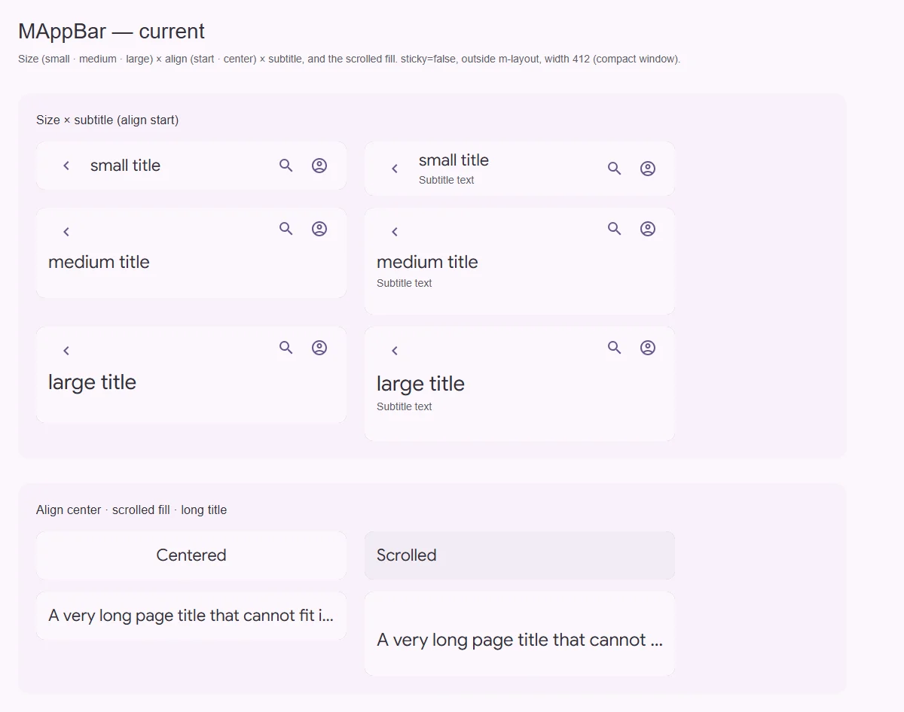
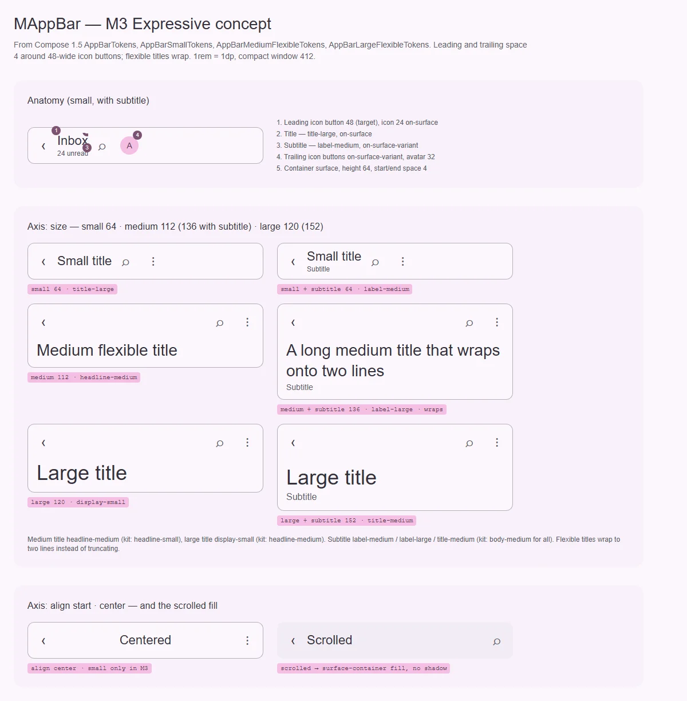

# MAppBar — верхняя панель приложения

<identity>M3: App bars (small, medium flexible, large flexible; search app bar — см. [search](../inputs/search.md)) · Токены Compose: `AppBarTokens`, `AppBarSmallTokens`, `AppBarMediumFlexibleTokens`, `AppBarLargeFlexibleTokens` · Код: `src/runtime/components/ui/app-bar/` (+ `nav/`, `title/`, `actions/`), `src/runtime/composables/app-bar/useAppBar.ts` · Аудит: `data/app-bar.json` · Тип: public</identity>

<implementation-status state="planned" updated="2026-10-07">Оси Expressive уже есть: `type` small/medium/large, `align` start/center, подзаголовок у всех размеров. Заливка при прокрутке есть, тени нет. Регистрация в `m-layout`. Расходятся типографика, отступы и перенос заголовка; нет сворачивания при прокрутке и ландмарка.</implementation-status>

## Вердикт

`дрейф`. Каркас уже Expressive:
- высоты 64 / 112 (136) / 120 (152) совпадают с Compose;
- выравнивание — отдельная ось;
- при прокрутке меняется тон заливки, а не появляется тень.

Расходятся:
- шрифты заголовка medium/large и подзаголовка;
- боковые отступы (16 + 8 против 4 вокруг кнопок 48);
- длинный заголовок обрезается в medium/large, а должен переноситься;
- medium/large не сворачиваются в small при прокрутке;
- шапка — безымянный `div` без ландмарка.

## Рендеры

| Сейчас | Концепт M3 |
|---|---|
|  |  |

Текущий рендер: размер × подзаголовок, центрирование, заливка при прокрутке, длинный заголовок в
small и medium. Обрезка многоточием есть в обоих.

Кадры концепта:
1. Анатомия small с подзаголовком.
2. Ось размера: высоты, шрифты, перенос flexible-заголовка.
3. Выравнивание и заливка при прокрутке.

## Анатомия

| # | Часть M3 | В ките | Статус |
|---|---|---|---|
| 1 | Контейнер (surface, угол 0) | `.ui-app-bar`, сетка `nav headline actions` | есть; ландмарка нет (A11-01) |
| 2 | Leading icon button (48, иконка 24 `on-surface`) | `MAppBarNav`, `min 48 × 48`, `margin 8` | есть; лишний `margin` |
| 3 | Заголовок | `MAppBarTitle` → `
` | есть; не заголовок документа |
| 4 | Подзаголовок | `MAppBarTitle subtitle` | есть; шрифт один на все размеры |
| 5 | Trailing icon buttons (`on-surface-variant`), аватар 32 | `MAppBarActions` (`gap 4`, `margin 8`) | есть; цвет trailing-иконок не отделён |
| 6 | Заливка при прокрутке | `--scrolled` → `surface-container` | есть |

## Оси дизайна

| Ось | M3 | Кит сейчас | Цель | Ломает API |
|---|---|---|---|---|
| Размер | small · medium flexible · large flexible | `type: 'small' \| 'medium' \| 'large' \| 'center-aligned'` (легаси-алиас) | Оставить значения. Слово `type` — ОВ-2, не трогать до его решения. `center-aligned` — деприкация с предупреждением | нет |
| Выравнивание | start · center (center только у small) | `align: 'start' \| 'center'` у всех размеров | В dev предупреждать о `center` у medium/large | нет |
| Подзаголовок | у всех размеров | есть | — | — |
| Поведение при прокрутке | pinned · enter-always · exit-until-collapsed (medium/large сворачиваются в small) | только заливка | Ось `scrollBehavior: 'pinned' \| 'collapse'` (вопрос 1) | нет |
| `density` | нет | нет | Не вводить: у app bar M3 нет плотности, размер — это раскладка | — |

## Оси состояний

| Ось | Нужно | Есть | Не хватает |
|---|---|---|---|
| Базовое | видимо / скрыто при прокрутке (hidden) | видимо | Скрытие — предложение по UX, не паритет |
| Прокрутка | rest / scrolled / collapsed | rest / scrolled | collapsed для medium/large (шаг 4) |
| Данные | Начальная прокрутка уже прокрученной страницы | `fallbackY = 0` до первого `scroll` вне `m-layout` | Читать `scrollY` при монтировании |
| Фокус | Не перекрывает фокус | `scroll-padding-top` от прибитых зон (`carve.ts`) | — (LY-09, A11-13 закрыты) |
| Forced colors | Граница видна | `@include forced-colors` в `index.vue:131` | — (TH-04 закрыт) |

## Токены: расхождения

| Часть | M3 (Compose) | Кит сейчас (`app-bar/_index.scss`) | Действие |
|---|---|---|---|
| Боковые отступы | `LeadingSpace`/`TrailingSpace` = 4 (кнопки 48 дают остальное) | `padding.inline: 16rem` + `nav.margin`/`actions.margin: 8rem` | `spacing(4)`, `margin` убрать |
| Заголовок medium | headline-medium | headline-small | headline-medium |
| Заголовок large | display-small | headline-medium | display-small |
| Подзаголовок | small label-medium · medium label-large · large title-medium | body-medium у всех | ветка `subtitle.typography.{small,medium,large}` |
| Trailing-иконки | `on-surface-variant` | наследуют `on-surface` | `actions.color` |
| Аватар в действиях | 32 | — | рецепт в документации |
| Высоты | 64 · 112/136 · 120/152 | те же | совпадает. Пометку `ASSUMPTION` в `_index.scss:31` снять |
| Заливка при прокрутке | `surface-container` | `surface-container`, без тени | совпадает. Compose ставит ещё level 2, кит сознательно без тени (craft: разделение тоном) |

## Поведение и доступность

- **A11-01.**
  - Корень — `<header>`: ландмарк banner у шапки страницы. Внутри `<section>` или диалога тег
    меняется пропом `tag`.
  - Заголовок — `<h1>` по умолчанию с пропом `headingLevel`. Решение должно совпадать с
    [card](../containment/card.md) Q2 и [expansion-panel](../containment/expansion-panel.md) Q1.
- **CT-02.**
  - medium/large переносят заголовок до 2 строк, затем многоточие.
  - В small обрезанный заголовок получает полный текст в `MTooltip` с ленивым замером, как
    предложено в [chip](../form/chip.md) В-6.
- **Сворачивание (M3 baseline).** При `scrollBehavior: 'collapse'` medium/large при прокрутке
  сжимаются до 64. Заголовок переезжает в строку навигации шрифтом title-large. Без пружин:
  переход на `--sys-motion-*` или scroll-driven CSS (вопрос 1). Под reduced motion переход
  сокращается.
- **RS-09.** `padding-top: env(safe-area-inset-top)` и боковые инсеты, когда бар прибит к
  верху окна.

## API

| Что | Изменение | Ломает |
|---|---|---|
| `tag` | `'header' \| 'div' \| 'section'`, дефолт `header` | видимо только для AT |
| `headingLevel` | `1–6`, дефолт по общему решению | нет |
| `scrollBehavior` | `'pinned' \| 'collapse'`, дефолт `pinned` | нет |
| `type: 'center-aligned'` | деприкация → `type="small" align="center"` | через minor |

## План работ

1. **S — токены.** Отступы 4, шрифты заголовка и подзаголовка по размерам, цвет trailing,
   `spacing()` вместо литералов (TK-02).
2. **S — ландмарк и заголовок** (A11-01).
3. **S — перенос flexible-заголовка и подсказка у small** (CT-02).
4. **M — сворачивание** medium/large (после вопроса 1).
5. **S — начальная прокрутка вне раскладки и safe-area** (RS-09).
6. **S — деприкация `center-aligned`, предупреждение о `center` у medium/large.**
7. **M — документация** (DC-01…05): размеры, выравнивание, прокрутка, связка с `m-layout` и
   с поиском.

## Тесты

- Unit:
  - `tag` и `headingLevel` в SSR-разметке;
  - `center-aligned` предупреждает;
  - collapse: класс при `windowY > порог`;
  - начальное значение при уже прокрученной странице.
- e2e:
  - фикстура `app-bar/matrix.vue` (размер × подзаголовок × align × scrolled);
  - axe: ровно один banner;
  - длинный заголовок в medium — 2 строки, без горизонтального переполнения на 360;
  - collapse при прокрутке `m-layout-main`.

## Готово, когда

- Шрифты и отступы совпадают с токенами Compose.
- У шапки есть ландмарк и заголовок.
- Длинный заголовок не теряется.
- medium/large сворачиваются по опции.

## Предложения по UX

Расширения сверх паритета с M3. Это предложения владельцу, а не шаги плана. Без Expressive-анимаций и без новых зависимостей.

| Предложение | Что получает пользователь | Заказчик | Цена | Рекомендация |
|---|---|---|---|---|
| Скрытие при прокрутке вниз и возврат при прокрутке вверх (`scrollBehavior: 'enter-always'`) | На телефоне контенту больше места, шапка возвращается одним движением | ленты, документация на compact | S · через уже существующий `windowY` зоны раскладки, переход на токенах | да, третьим значением оси |
| Режим контекстных действий: при выделении бар показывает «N выбрано» и действия над выделением | Массовые действия без отдельной панели | таблица, список с выбором | M · слот `#contextual` + проп `contextual: boolean` | обсудить с планом table |
| Прогресс загрузки страницы по нижней кромке бара (`MProgressLinear` 4dp) | Видно, что страница ещё грузится, без отдельного индикатора | любой продукт с медленными переходами | S · слот `#progress` с позицией по кромке | да |

## Открытые вопросы

**1. Механизм сворачивания medium/large.**
1. CSS scroll-driven animations (`animation-timeline: scroll()`): ноль JS, плавно. Нет в старом
   Safari: там бар просто остаётся развёрнутым.
2. Класс по порогу `windowY` (JS уже есть) и переход высоты на токенах. Работает везде, но это
   скачок, а не следование за пальцем.

Рекомендация: 2 сейчас, 1 позже как улучшение. Решение не вводить механизмы, которые растят
бандл, выполняется в обоих вариантах.
