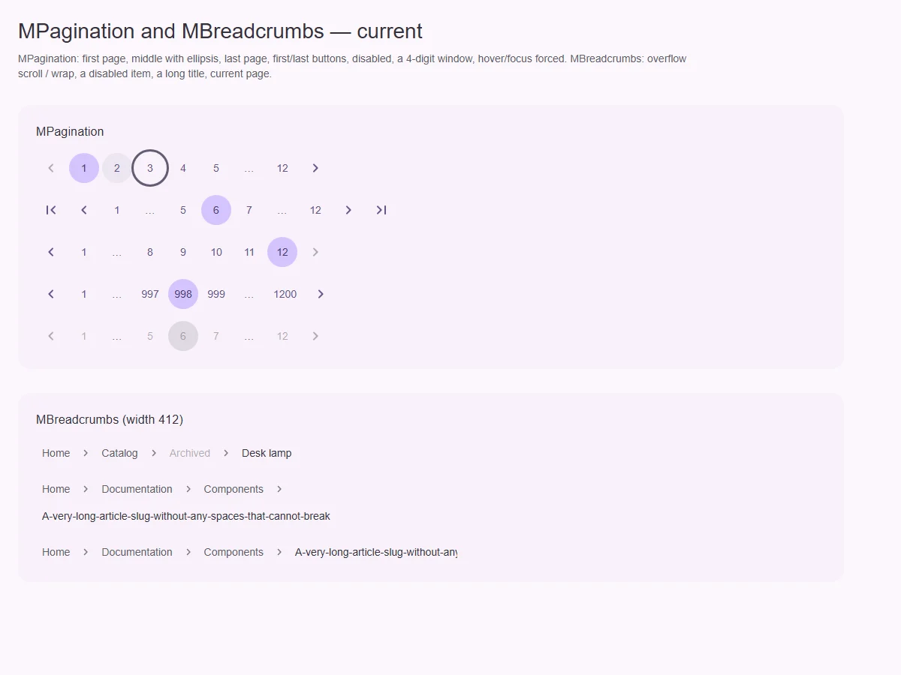
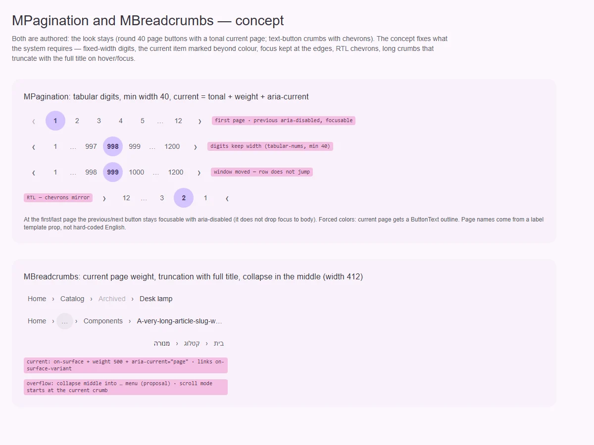

# MBreadcrumbs — путь к текущей странице

<identity>M3: компонента нет; авторский компонент кита на системе M3 (текстовые кнопки, иконки) · Токены Compose: нет · Код: `src/runtime/components/ui/breadcrumbs/`, части `src/runtime/components/fragments/breadcrumbs/{item,divider}/` ([item.md](item.md), [divider.md](divider.md)) · Аудит: `data/breadcrumbs.json` · Тип: public</identity>

<implementation-status state="planned" updated="2026-10-07">Реализован 2026-07-16: `nav > ol`, плоский список, `overflow: scroll | wrap` (по умолчанию scroll), текущая крошка с `aria-current="page"`, разделители скрыты от AT, без `useRoute`. Открыты: текущая отличается только оттенком, длинная крошка вылезает в wrap, кольцо фокуса обрезается в scroll, forced colors.</implementation-status>

## Вердикт

`авторский`. Решения прежнего плана остаются:
- `nav` с именем и упорядоченный список;
- ровно одна текущая крошка;
- разделители декоративны;
- состояние нормализуется из пропов синхронно, без замеров и без маршрутизатора;
- переполнение без потерь — прокрутка или перенос, интерактивное сворачивание отложено.

Системные правки:
- текущая страница отличается от ссылок только оттенком (TH-05);
- в forced colors ссылки, текущая и disabled совпадают (TH-04);
- кольцо фокуса обрезается контейнером прокрутки (IN-05);
- длинная крошка в режиме wrap вылезает за контейнер (CT-04);
- в режиме scroll нет намёка на продолжение и нет прокрутки к текущей (CT-11).

## Рендеры

| Сейчас | Концепт |
|---|---|
|  |  |

Рендеры общие с [MPagination](../pagination.md), крошки — нижний кадр.

Сейчас: обычный путь с disabled, длинная крошка в wrap и в scroll.

Концепт:
- вес у текущей;
- сворачивание середины в «…» — это предложение, а не шаг;
- обрезка длинной крошки — это вопрос 1, а не шаг;
- RTL.

## Анатомия

| # | Часть | В ките | Статус |
|---|---|---|---|
| 1 | `nav` + `ol` | корень, `aria-label` (дефолт «Breadcrumbs») | есть; английский дефолт |
| 2 | Крошка-ссылка / текущая / disabled | [item.md](item.md) | есть |
| 3 | Разделитель | [divider.md](divider.md) | есть |
| 4 | Контейнер прокрутки | `overflow-x: auto` в режиме scroll | есть; обрезает кольцо |

## Оси дизайна

| Ось | Значения | Комментарий |
|---|---|---|
| `overflow` | `scroll \| wrap` | Решено, по умолчанию `scroll` |
| `divider` | имя иконки или текст | — |
| `density` | — | Не вводить |

## Оси состояний

| Ось | Нужно | Есть | Не хватает |
|---|---|---|---|
| Навигация | current не только цветом | оттенок `on-surface` против `on-surface-variant` | вес 500 у текущей (TH-05) |
| Фокус | кольцо видно в режиме scroll | обрезается (IN-05) | `padding-block` у контейнера под кольцо или `focus-ring(inset)` |
| Forced colors | текущая и disabled различимы | нет (TH-04) | текущая — `font-weight` + подчёркивание ссылок под `forced-colors` |
| Переполнение | без потерь и с намёком | прокрутка или перенос | перенос длинной крошки, намёк у края, начальная прокрутка к текущей |

## Токены: расхождения

| Часть | Система | Кит сейчас | Действие |
|---|---|---|---|
| Отступы, высота | `spacing()` | литералы (TK-02) | `spacing()` |
| Цель | 48 (S8) | 32 (RS-06 принято; RS-12) | расширитель до 48 по вертикали |

## Поведение и доступность

- `aria-label` без английского дефолта (Q13).
- В режиме scroll при монтировании (на клиенте) контейнер прокручивается к текущей крошке. Это
  чтение геометрии на клиенте для поведения, а не для начальных данных. Тень у края — CSS-маска
  с scroll-driven animation там, где поддерживается.
- В режиме wrap длинная крошка переносится (`overflow-wrap: anywhere`). Решение «без потерь»
  сохраняется.

## API

Без изменений, кроме `ariaLabel` без дефолта.

## План работ

1. **S — вес текущей, forced colors** (TH-04, TH-05).
2. **S — кольцо в режиме scroll** (IN-05).
3. **S — перенос в wrap** (CT-04).
4. **S — прокрутка к текущей и намёк у края** (CT-11).
5. **S — токены и цель** (TK-02, RS-12).
6. **S — документация** (DC-01…05).

## Тесты

- Unit: ровно одна `aria-current`; разделители `aria-hidden`; SSR совпадает с гидрацией.
- e2e:
  - 360 + scroll: текущая видна при загрузке, кольцо фокуса не обрезано;
  - wrap: нет горизонтального переполнения;
  - forced colors;
  - axe.

## Готово, когда

- Текущая читается без цвета.
- Ни одна крошка не теряется и не вылезает.
- Кольцо фокуса видно целиком.

## Предложения по UX

Расширения сверх паритета. Это предложения владельцу, а не шаги плана. Без новых зависимостей.

| Предложение | Что получает пользователь | Заказчик | Цена | Рекомендация |
|---|---|---|---|---|
| Сворачивание середины в «…» с меню скрытых крошек (`overflow: 'collapse'`) | Путь помещается в одну строку на телефоне, ничего не теряется — скрытые крошки доступны в меню | docs-сайт, вложенные каталоги | M · `MMenu`, без замеров (по `maxVisible`) | да — это ранее отложенное «интерактивное сворачивание», теперь есть план меню |
| Микроразметка `BreadcrumbList` (JSON-LD) по опции | Путь в выдаче поисковиков | публичные сайты | S | обсудить |

## Открытые вопросы

**1. Обрезать ли длинную крошку многоточием с полным текстом в подсказке?** Прежнее решение —
переполнение без потерь.
1. Нет: только перенос (wrap) или прокрутка (scroll), как решено. Длинное название может занять
   две строки.
2. Да, только для текущей крошки: многоточие, полный текст в `MTooltip` и в `title` для AT —
   имя страницы и так в заголовке. Ряд аккуратнее, но текст на экране теряется.

Рекомендация: 1. Решение «без потерь» осознанное, а текущая страница и так названа заголовком.
