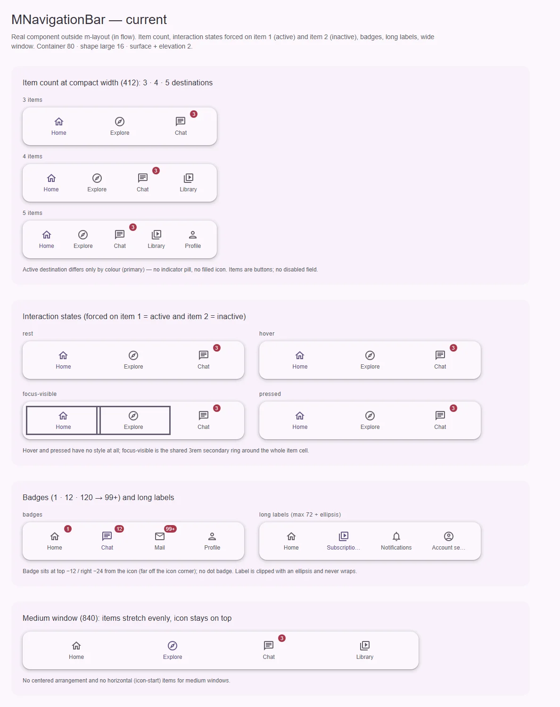
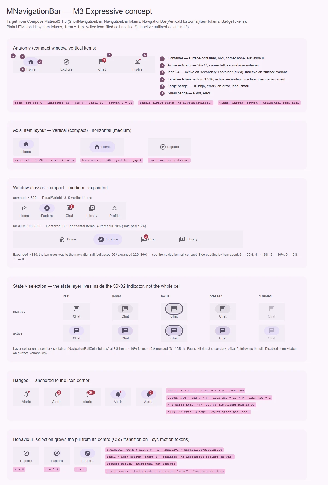

# MNavigationBar — нижняя панель переключения между 3–5 основными разделами приложения

<identity>M3: Navigation bar (Expressive: short navigation bar 64) · Токены Compose: `NavigationBarTokens`, `NavigationBarVerticalItemTokens`, `NavigationBarHorizontalItemTokens`, `BadgeTokens`; поведение — `ShortNavigationBar.kt`, `NavigationItem.kt`, baseline `NavigationBar.kt` · Код: `src/runtime/components/ui/navigation-bar/` · Аудит: `data/navigation-bar.json` · Тип: public</identity>

<implementation-status state="planned" updated="2026-10-07">План новый. Код не менялся: компонент собран до появления M3 Expressive и до фазы C (кольцо фокуса и forced colors уже добавлены, остальное нет).</implementation-status>

## Вердикт

`переработка`. Бар узнаётся как нижняя навигация, но у него нет главной части анатомии M3 —
индикатора-«таблетки» за иконкой: активный пункт отличается только оттенком (`primary` против
`on-surface-variant`), а это нарушает «состояние никогда не выражается одним цветом». Контейнер
нарисован по-своему (80, `surface`, тень уровня 2, угол 16 вместо 64, `surface-container`, без тени,
без скругления). Нет второй раскладки пункта (иконка слева) для средних окон, нет hover и pressed,
пункты — кнопки, а не ссылки. API почти весь растёт аддитивно; ломается поведение (roving tabindex,
см. вопрос 2) и дефолт `ariaLabel`.

## Рендеры

| Сейчас | Концепт M3 |
|---|---|
|  |  |

Кадры концепта:

1. **Анатомия** — бар 412 в компактном окне: контейнер, индикатор 56×32, иконка (залитая у
   активного, S7), подпись, большой и малый бейджи, нумерованные части и выноски высот.
2. **Ось раскладки пункта** — вертикальный пункт (компактное окно) и горизонтальный (среднее окно:
   индикатор h40 обнимает иконку и подпись).
3. **Классы окон** — compact: 5 пунктов, равные доли; medium: 4 горизонтальных пункта по центру,
   боковое поле 15%; expanded — передача роли рейлу.
4. **Матрица состояний** — неактивный и активный пункт × rest, hover, focus, pressed, disabled. Слой
   состояния живёт внутри формы индикатора, кольцо фокуса повторяет таблетку.
5. **Бейджи** — привязка к углу иконки по формулам Compose, лимит в 4 символа.
6. **Поведение** — рост индикатора из центра; переход на токенах `--sys-motion-*` (пружин Expressive в вебе нет, S4).

## Анатомия

| # | Часть M3 | Кит | Статус |
|---|---|---|---|
| 1 | Контейнер (surface-container, h64, без формы и тени, отступы под safe area) | `nav.ui-navigation-bar` | иначе: 80, `surface`, тень 2, угол 16, без safe area |
| 2 | Активный индикатор 56×32 (вертикальный) / h40 (горизонтальный), `secondary-container` | — | нет |
| 3 | Иконка 24 | `.ui-navigation-bar__icon` (`m-icon`) | есть; залитой версии у активного нет (S7) |
| 4 | Подпись `label-medium` | `.ui-navigation-bar__label` | есть; обрезается многоточием на 72 |
| 5 | Большой бейдж 16 | `m-badge` в `__icon-wrapper` | есть; стоит в стороне от угла иконки |
| 6 | Малый бейдж-точка 6 | — | нет (поле `badge` только числовое) |
| — | Слой состояния (в форме индикатора) | — | нет |

## Оси дизайна

| Ось | M3 | Кит сейчас | Цель | Ломает API |
|---|---|---|---|---|
| Раскладка пункта | `iconPosition: Top \| Start` (Top — compact, Start — medium) | только сверху | `iconPlacement: 'top' \| 'start'`, по умолчанию `top` (вопрос 3) | нет |
| Распределение пунктов | `EqualWeight` (compact) / `Centered` (medium, поле 20/15/10/5% для 3/4/5/6 пунктов) | `justify-content: space-around` + `flex: 1` | выводится из `iconPlacement`: `top` → равные доли, `start` → по центру с полем по формуле | нет |
| Высота | 64 (Expressive), 80 — baseline `NavigationBar` | 80 | 64, `min-height` вместо `height` | визуально |
| Вид контейнера | плоский, край в край | «остров»: угол 16 + тень | вопрос 1 | визуально |
| Подписи | показываются всегда (у short bar нет `alwaysShowLabel`) | всегда | без изменений | нет |
| Количество пунктов | 3–5 (compact), 3–6 (medium) | не ограничено | dev-предупреждение вне диапазона | нет |

## Оси состояний

| Ось | Нужно | Есть | Не хватает |
|---|---|---|---|
| Базовое | enabled, disabled | enabled | disabled-пункт (вопрос 4) |
| Взаимодействие | hover, pressed — слой в форме индикатора | — | оба (ST-01, ST-05, IN-07) |
| Фокус | кольцо по форме индикатора | общий `focus-ring` на всей ячейке пункта (`index.vue:254-256`) | перенести кольцо на индикатор |
| Выбор | индикатор + залитая иконка + цвет | только цвет `primary` (`index.vue:233-235`) | индикатор (ST-02, ST-03, TH-05), S7 |
| Навигация | ссылки, `aria-current="page"` | кнопки + `aria-current` (`index.vue:11-19`) | `to` у пункта (A11-01) |
| Раскрытие, смысловое, валидация, данные | — | — | не применимы |

## Токены: расхождения

Карта — `assets/stylesheet/components/navigation-bar/_index.scss`. Пути `g()` в `index.vue` пока
дефисные (`'container-padding-inline'`), файл переводится на точечные целиком (шаг 1).

| Часть | M3 (Compose) | Кит сейчас | Действие |
|---|---|---|---|
| Высота контейнера | `ContainerHeight` 64 (`TallContainerHeight` 80 — baseline) | `container.height` 80 (`:10`), `height: var(--ui-navigation-bar-height)` (`index.vue:184`) | 64; `min-height`, токен зоны лейаута остаётся (CT-05) |
| Цвет контейнера | `ContainerColor` = surface-container | `container.color` surface (`:16`) | surface-container (TH-06) |
| Тень | `NavigationBarDefaults.Elevation` = Level0 | `container.shadow` `elevation(2)` (`:17`) | вопрос 1 |
| Форма | `NavShape` = CornerNone | `container.shape` corner-large (`:15`) | вопрос 1 |
| Поля контейнера | нет; window insets снизу и по бокам | `padding.inline` 12, `padding.block` 8 (`:12-13`) | убрать; `padding-block-end: env(safe-area-inset-bottom)`, `padding-inline: env(safe-area-inset-left/right)` (RS-09) |
| Отступ пункта сверху/снизу | `ContainerBetweenSpace` 6 | `item.padding.block` 4 (`:25`) | 6 |
| Индикатор | 56×32, `CornerFull`, `secondary-container` | — | новая ветка `item.indicator.{width,height,shape,color}` (S9) |
| Индикатор горизонтального пункта | h40, поля 16/16, иконка → подпись 4 | — | `item.horizontal.indicator.*` |
| Индикатор → подпись | 4 | `item.gap` 4 (`:23`) | совпадает |
| Цвет иконки (активный) | `ItemActiveIconColor` = on-secondary-container | `item.active.color` primary (`:29`), общий для иконки и подписи | разделить: `item.active.icon.color` |
| Цвет подписи (активный) | `ItemActiveLabelTextColor` = secondary | primary | `item.active.label.color` = secondary |
| Цвет неактивного | on-surface-variant | `item.color` (`:27`) | совпадает |
| Слой состояния | в форме индикатора; цвет — on-secondary-container (как `NavigationRailColorTokens`), 8 / 10 / 10 (S1) | — | `item.state.color` + `state-opacity()` |
| Disabled | иконка и подпись on-surface-variant × 0.38 | — | `item.disabled.*` (вопрос 4) |
| Подпись | `label-medium`, переносится, бар растёт | `label-medium` ✓, `max-width` 72 + многоточие (`:35`, `index.vue:226-231`) | убрать 72; две строки максимум, `min-height` (CT-02, CT-05) |
| Большой бейдж | x = конец иконки − 12, y = верх иконки − 2 | `badge.top` −12, `badge.right` −24 (`:42-43`), физическое `right` | `inset-inline-start` по формуле (LY-10) |
| Малый бейдж | 6, x = конец иконки − 6, y = верх иконки | — | `badge: true` → `MBadge dot` |
| Движение | индикатор: ширина + альфа 0 → 1, spring spatial default (0.8 / 380); цвет — effects | переходов нет (MO-01) | `transition` ширины и прозрачности на `--sys-motion-duration-medium-2` + `--sys-motion-easing-emphasized-decelerate`, цвет — `short-4`. Пружины S4 отклонены владельцем 2026-10-07 |

Совпадает: размер иконки 24 (`:39`), типографика `label-medium` (`:31`), цвет неактивного.

## Поведение и доступность

- **Ссылки, а не кнопки** (A11-01). Пункт с `to` рендерится `NuxtLink` с `aria-current="page"`,
  без `to` — кнопкой (переключение внутри приложения). Тот же приём уже есть у `MTab`
  (`tabs/tab/index.vue:2-16`) и `MListItem` (`to`).
- **Клавиатура.** Сейчас roving tabindex со стрелками (`index.vue:120-168`) внутри landmark `nav`
  без составной роли: в Tab-порядке виден один пункт, о стрелках скринридер не сообщает (A11-08).
  Решение — вопрос 2. Код клавиатуры дословно повторён в `navigation-rail/index.vue:119-167`; что
  бы ни решили, он переезжает в один композабл (правило «один контроллер на паттерн»).
- **RTL** (LY-10): стрелки не зеркалятся, бейдж стоит физическим `right`.
- **Бейдж в имени пункта** (A11-04). `MBadge` несёт `role="status"` + `aria-live` внутри каждой
  кнопки, а число попадает в имя перед подписью («3 Profile»). Цель: бейдж в пункте `aria-hidden`,
  смысл приходит из поля `badgeLabel` (кит не поставляет непереводимого текста — `craft.md` §6) и
  читается после подписи через `aria-describedby`.
- **Имя landmark.** Дефолт `ariaLabel: 'Primary'` (`props.ts:16`) — английская строка, которую кит
  не может перевести. Сделать проп обязательным по смыслу: без значения — dev-предупреждение.
- **Forced colors** — сделано фазой C (`index.vue:243-251`). После появления индикатора: таблетка
  `Highlight`, иконка и подпись на ней `HighlightText`, как у рейла (`navigation-rail/item/index.vue:170-187`).
- **Лейаут.** `scroll-padding-bottom` под прибитым баром уже строит `carve.ts:300` (LY-09, A11-13
  закрыты). Safe area — шаг 4.
- **Движение.** Reduced motion сокращает, а не выключает: длительности берутся из токенов, которые
  глобально укорачиваются (`base/_animations.scss:44`).
- **Принятые отклонения:** RS-04/05 (корневой размер в vw) — осознанное решение кита, не трогаем.

**P1 аудита (19 FAIL), сверено с кодом:** открыты ST-01/02/03, TH-05 (шаг 2), CT-02, CT-05 (шаги 3–4),
TK-02 (шаг 1), A11-01, A11-08 (шаг 5), TS-02/03/05 (раздел «Тесты»). Закрыты фазами A–C: IN-04
(кольцо есть, форма — шаг 2), TK-01 (тень через `elevation()`), TH-04 (forced colors), A11-13
(`carve.ts:300`). RS-04/05 — принятое отклонение; TS-01 — Storybook отклонён, вместо него фикстуры
playground + e2e.

## API

| Что | Сейчас | Цель | Ломает |
|---|---|---|---|
| `MNavigationBarItem.to` | — | `NuxtLinkProps['to']`, пункт становится ссылкой | нет |
| `MNavigationBarItem.disabled` | — | `boolean` (вопрос 4) | нет |
| `MNavigationBarItem.badge` | `number` | `number \| true` (`true` — точка) | нет |
| `MNavigationBarItem.badgeLabel` | — | `string`, доступный смысл бейджа | нет |
| `iconPlacement` | — | `'top' \| 'start'`, дефолт `'top'` (вопрос 3) | нет |
| `ariaLabel` | дефолт `'Primary'` | без дефолта, dev-warn | да: потребители без `aria-label` получат предупреждение. Миграция — передать строку |
| Слот пункта | нет (EN-03) | вопрос 5 | нет |
| Иконка активного | одна `icon` | `activeIcon?: string` у пункта — пара `ic:outline-*` / `ic:baseline-*` (СВ-3, вариант 2: без новой зависимости) | нет |

Внутренние правки: `m-icon` / `m-badge` в шаблоне берутся автоимпортом — внутри библиотеки UI-компоненты
импортируются явно (правило `CLAUDE.md`).

## План работ

1. **Токены и точечные пути** (S). Перевести `index.vue` на `g($t, 'a.b')`, вынести числа в
   `spacing()`, разделить цвета иконки и подписи. Файлы: `navigation-bar/_index.scss`,
   `navigation-bar/index.vue`. Зависимости: нет.
2. **Индикатор и слой состояния** (M). Обёртка иконки становится индикатором 56×32 с `::before`
   слоем; hover внутри `can-hover`, pressed, focus-кольцо на индикаторе; forced colors для
   таблетки. Закрывает ST-01/02/03/05, IN-07, TH-05. Зависимости: S1, S9.
3. **Контейнер по M3** (S). 64, `surface-container`, `min-height`; форма и тень — по ответу на вопрос 1.
   Закрывает TH-06, CT-05.
4. **Safe area и подписи** (S). Insets, перенос подписи на 2 строки, бейдж по формуле и логическим
   свойствам. Закрывает RS-09, CT-02, LY-10 (бейдж).
5. **Ссылки и a11y пункта** (M). `to`, `badgeLabel`, `aria-hidden` у бейджа, `ariaLabel` без
   дефолта; клавиатура — по ответу на вопрос 2, общий композабл с рейлом
   (`composables/navigation/useNavigationControl.ts`, бэги атрибутов без классов — `behavior.md`).
   Закрывает A11-01, A11-04, A11-08, LY-10 (стрелки).
6. **Горизонтальный пункт** (M). `iconPlacement: 'start'`, распределение по формуле Compose
   (`calculateCenteredContentHorizontalPadding`). Зависимости: вопрос 3, layout вопрос 1 (границы
   классов окон).
7. **Движение** (S). Рост индикатора (ширина + прозрачность), смена цвета — CSS-переходы на токенах
   `--sys-motion-*`, без JS-пружин (S4 отклонён). Закрывает MO-01.
8. **Иконка активного** (S). `activeIcon` из пары `ic:outline-*` / `ic:baseline-*` того же набора — новых
   зависимостей нет. Зависимость: S7.
9. **Слот / общий пункт** (M). По ответу на вопрос 5; общий примитив пункта с рейлом
   (`components/fragments/navigation-item/`). Закрывает EN-03.
10. **Документация** (S). `docs/server/data/en/navigation-bar.json`: убрать несуществующий
    `labelVisibility`, описать `items`, клавиатуру, кастомизацию (DC-02…05).

## Тесты

- **Unit** (`navigation-bar/index.spec.ts`): `to` → `<a>` с `aria-current`; `disabled` не выбирается;
  `badge: true` рендерит точку; бейдж `aria-hidden`, `badgeLabel` в `aria-describedby`; клавиатура
  по ответу на вопрос 2 (TS-07); синхронизация `items` (удаление активного пункта).
- **Фикстуры** `playground/fixtures/navigation-bar/{matrix,stress}.vue`: матрица пункт × состояние ×
  выбор, обе раскладки; stress — 6–7 пунктов, длинные подписи, бейджи 0 / 1 / 999+, 320 и 840.
- **e2e** `navigation-bar.e2e.ts`: axe, Tab-порядок, forced colors (таблетка видна), RTL (бейдж и
  стрелки), safe area через эмуляцию viewport-fit.

## Готово, когда

- Активный пункт отличим без цвета: индикатор 56×32 (или h40) + залитая иконка.
- Контейнер 64, `surface-container`; форма и тень — по решению вопроса 1.
- Hover, pressed, focus рисуются слоем в форме индикатора; hover не прячет выбор.
- Пункт с `to` — ссылка с `aria-current="page"`; бейдж не попадает в имя пункта числом.
- `iconPlacement="start"` даёт центрированную раскладку с полем по формуле M3.
- `npm run lint`, `lint:style`, `lint:scss` — 0 ошибок; e2e и axe зелёные.

## Предложения по UX

Сверх паритета с M3. Это предложения, а не шаги плана: в «План работ» попадают после решения владельца.

| Предложение | Что получает пользователь | Заказчик | Цена | Рекомендация |
|---|---|---|---|---|
| Выбор следует за маршрутом: у пунктов с `to` активный определяется текущим маршрутом, `v-model` не обязателен (`match: 'exact' \| 'prefix'`, дефолт `prefix`) | Правильная подсветка после «назад», перезагрузки и перехода по глубокой ссылке; `/chat/42` подсвечивает «Chat» | Любой продукт с маршрутами; общий с рейлом и drawer | S · бандл ≈ 0 (`useRoute` уже в Nuxt) · API: проп `match` | Да, вместе с шагом 5 (ссылки) |
| Событие `reselect` при нажатии на уже активный пункт | Привычный жест мобильных приложений: второй тап — к началу ленты или к корню раздела. Что делать, решает приложение | Нет названного — гипотеза (`principles.md` В4) | S · бандл ≈ 0 · API: одно событие | Да: дёшево, ничего не навязывает |
| Пункт «Ещё» при переполнении: лишние пункты сверх 5 уходят в меню (`MMenu`) | Не сжатые до многоточия подписи, когда продукту нужно 6–7 разделов | Нет названного; M3 советует 3–5 разделов | M · переиспользует `MMenu` · API: `maxItems` | Нет сейчас — вернуться с заказчиком |
| Прятать бар при прокрутке вниз и возвращать при прокрутке вверх | Больше места под контент на телефоне | Нет названного | M · слушатель прокрутки на rAF, взаимодействие с зоной `carve.ts` (резерв строки, `scroll-padding`) · API: `scrollBehavior: 'fixed' \| 'hide'` | Отложить: риск для фокуса у низа страницы, зависит от лейаута |

## Открытые вопросы

**1. Вид контейнера: плоский по M3 или «остров».**
Сейчас бар и рейл скруглены (16) и приподняты (тень 2 / обводка), в M3 оба плоские, край в край, без
тени. План `feature/layout-zone-gaps.md` описывает потребителя, которому нужны «острова», — возможно,
скругление было сделано под него.
1. M3: угол 0, без тени, `surface-container`. «Остров» — работа лейаута (`layout-zone-gaps.md`):
   зона даёт поле, компонент красит себя сам. Цена: визуальное изменение у всех потребителей.
2. Оставить «остров» дефолтом и записать как осознанное отклонение в `decisions.md`. Цена: кит
   расходится с M3 в самом заметном месте экрана.
3. Ось вида контейнера (сузить `MVariant` до `'filled' \| 'elevated'`). Цена: новая ось ради
   гипотетического потребителя (`principles.md` В4).

Рекомендация: 1. Решение распространяется на рейл (его вопрос 1 ссылается сюда).

**2. Клавиатура: roving tabindex или обычный Tab-порядок.**
`a11y-spec.md:48-49` когда-то решил «roving по пунктам, как в tabs». Аудит (A11-08) указывает, что
roving уместен в `tablist`/`toolbar`/`menubar`, а не в landmark `nav` со ссылками.
1. Убрать roving: каждый пункт в Tab-порядке, стрелки не обрабатываются. Цена: 5 табуляций вместо
   одной; так ведёт себя любой сайт с навигацией.
2. Оставить roving как сейчас. Цена: нарушение APG, скринридер не знает о стрелках.
3. Все пункты в Tab-порядке и стрелки как ускоритель. Цена: две модели в одном виджете,
   неожиданная для пользователя скринридера.

Рекомендация: 1. Ответ действует и для рейла.

**3. Как выбирается раскладка пункта (сверху / слева).**
1. Проп `iconPlacement`, выбирает потребитель (например, по `useBreakpoint`). Цена: каждый
   продукт пишет одно и то же условие.
2. `iconPlacement: 'auto'` по умолчанию — компонент сам переключается на границе классов окон. Цена:
   границы кита (768) не совпадают с M3 (600), это вопрос 1 плана `layout.md`.
3. Оба: проп с значением `'auto'`, которое включается после решения по границам. Цена: третье
   значение ждёт чужого решения.

Рекомендация: 1 сейчас, `'auto'` — после вопроса 1 плана `layout.md`.

**4. Нужен ли `disabled` у пункта.**
M3 его поддерживает (`enabled` у `ShortNavigationBarItem`), но названного потребителя в ките нет.
1. Добавить. Цена: ещё одна ветка состояний и токенов.
2. Не добавлять, записать в `decisions.md` с условием возврата. Цена: расхождение с M3.

Рекомендация: 1 — состояние входит в обязательную пятёрку (`color-and-state.md`) и нужно рейлу.

**5. Как кастомизировать пункт.**
Контексты `provideNavigationBarContext` / `provideNavigationRailContext` уже заведены «под будущий
слотовый пункт», но потребителя у них нет. Демо доков (`docs/app/components/mix/MixNavigation.vue:11`)
пытается передать в `MTabs` несуществующий слот `#item` — спрос на кастомный пункт есть.
1. Компонент-пункт `MNavigationBarItem` (как `MTab`), регистрируется через готовый контекст; `items`
   остаётся коротким путём. Цена: второй публичный компонент, два пути заполнения.
2. Скоуп-слот `#item="{ item, active, attrs }"` на `items`. Цена: потребитель сам рисует индикатор и
   легко теряет a11y-проводку.
3. Общий внутренний примитив пункта для бара, рейла и drawer (`components/fragments/navigation-item/`)
   плюс вариант 1 поверх него. Цена: самая большая правка, зато одна реализация состояний на всё семейство.

Рекомендация: 3, публичный пункт — когда появится потребитель.
