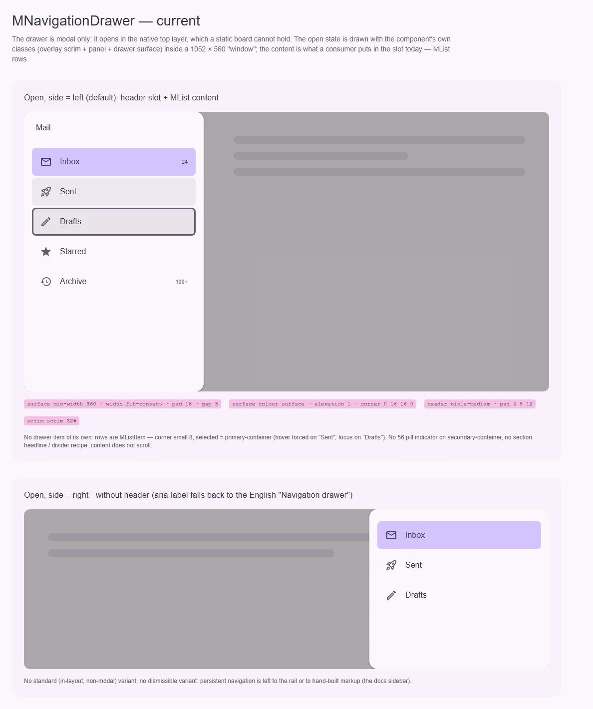
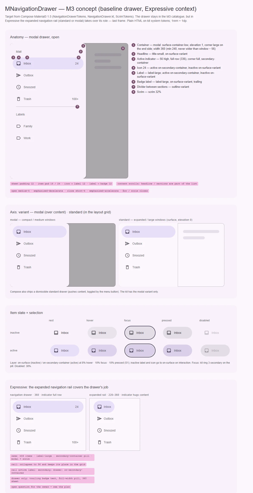

# MNavigationDrawer — модальная выдвижная панель навигации поверх контента

<identity>M3: Navigation drawer (baseline; в Expressive его роль забирает expanded navigation rail, но в каталоге M3 drawer остаётся) · Токены Compose: `NavigationDrawerTokens`, `ScrimTokens`; поведение — `NavigationDrawer.kt` (`ModalNavigationDrawer`, `DismissibleNavigationDrawer`, `PermanentNavigationDrawer`, `NavigationDrawerItem`) · Код: `src/runtime/components/ui/navigation-drawer/` · Аудит: `data/navigation-drawer.json` · Тип: public</identity>

<implementation-status state="planned" updated="2026-10-07">План новый. Drawer переехал на `MOverlay` (`overlay-top-layer-vfm-removal_2026-10-01_1200.md`): нативный `<dialog>`, inert, фокус-трап и возврат фокуса уже работают. Объём дальнейшей работы зависит от вопроса 1.</implementation-status>

## Вердикт

`переработка`. Как модальная оболочка drawer близок к M3: выезд со стороны, scrim 32%, тень 1,
скругление 16 на внешнем крае, фокус-трап и Esc. Но у него нет собственной анатомии M3 — пункта-
таблетки 56 на `secondary-container`, заголовков секций, разделителей: потребитель кладёт в слот
`MListItem`, а у того выбор — `primary-container` и угол 8. Нет стандартного (не модального)
варианта, содержимое не скроллится, стороны физические (`left`/`right` ломают RTL), поверхность
`surface` вместо `surface-container-low`. Главная развилка — роль drawer рядом с развёрнутым
рейлом Expressive (вопрос 1).

## Рендеры

| Сейчас | Концепт M3 |
|---|---|
|  |  |

Текущий вид собран из собственных классов компонента (`ui-overlay__scrim`, `ui-overlay__panel`,
`ui-navigation-drawer__surface`): открытый drawer живёт в нативном top layer, статичная доска его
удержать не может. Содержимое — `MList` / `MListItem`, как это делает потребитель сегодня (hover
и фокус принудительно выставлены на двух строках).

Кадры концепта:

1. **Анатомия** — модальный drawer 360 над контентом: контейнер, заголовок, индикатор, иконка,
   подпись, текст бейджа, разделитель секций, scrim; выноски отступов.
2. **Ось варианта** — modal (scrim, над контентом) и standard (в сетке лейаута, `surface`, без тени).
3. **Матрица состояний пункта** — неактивный / активный × rest, hover, focus, pressed, disabled.
4. **Expressive** — drawer 360 и развёрнутый рейл 240 с теми же пунктами: что совпадает и чем
   отличаются (индикатор на всю строку против «обнимающего», цвет активной подписи, сворачивание
   рейла до 96).

## Анатомия

| # | Часть M3 | Кит | Статус |
|---|---|---|---|
| 1 | Контейнер: modal `surface-container-low`, тень 1, `CornerLargeEnd`, ширина 360 (min 240), поля 12 | `.ui-navigation-drawer__surface` | иначе: `surface`, `min-width` 360 + `fit-content`, поля 16 |
| 2 | Заголовок секции: `title-small`, `on-surface-variant` | слот `#header` в `<header>` (`title-medium`, `on-surface`) | иначе: заголовок всего drawer, а не секции; одновременно имя диалога |
| 3 | Индикатор активного пункта: 56, на всю строку (336), `CornerFull`, `secondary-container` | — (в слоте `MListItem`: угол 8, `primary-container`) | нет |
| 4 | Иконка 24 | — | нет (в слоте) |
| 5 | Подпись `label-large` | — | нет (в слоте) |
| 6 | Текст бейджа справа, `label-large`, `on-surface-variant` | — | нет (в слоте — `trailing-supporting-text`) |
| 7 | Разделитель секций `outline-variant` | — | нет (рецепта нет) |
| 8 | Scrim `scrim` × 0.32 | `.ui-overlay__scrim` (`overlay/_index.scss`: 32%) | есть |

## Оси дизайна

| Ось | M3 | Кит сейчас | Цель | Ломает API |
|---|---|---|---|---|
| Вариант | modal · dismissible (standard, сдвигает контент) · permanent | только modal | вопрос 1 | нет |
| Сторона | start (по направлению письма); `end` в Compose через `LayoutDirection` | `side: 'left' \| 'right'` (`props.ts:8`, `:12`) | вопрос 3 | да |
| Ширина | 360, не меньше 240 | `min-width` 360 + `width: fit-content` (`index.vue:62-63`) | `inline-size` 360, `min` 240, не шире окна минус полоса scrim | нет |
| Пункт | `NavigationDrawerItem` | нет | вопрос 2 | нет |

## Оси состояний

| Ось | Нужно | Есть | Не хватает |
|---|---|---|---|
| Базовое | enabled | enabled | — |
| Взаимодействие (поверхность) | — | — | не применимо: поверхность не интерактивна, пункты в слоте |
| Взаимодействие (пункт) | hover, pressed, focus, disabled в форме таблетки | только у содержимого слота | по вопросу 2 |
| Фокус | трап, начальный фокус, возврат | есть (`MOverlay`) | — |
| Раскрытие | open / closed, `aria-expanded` у триггера | `v-model`, фазы `MOverlay` | слот `#activator` не проброшен (A11-06) |
| Выбор, навигация | `aria-current` у пункта | у содержимого слота | по вопросу 2 |
| Смысловое, валидация, данные | — | — | не применимы |

## Токены: расхождения

Карта — `assets/stylesheet/components/navigation-drawer/_index.scss`.

| Часть | M3 (Compose) | Кит сейчас | Действие |
|---|---|---|---|
| Цвет modal | `ModalContainerColor` = surface-container-low | `surface.color` surface (`:15`) | surface-container-low (TH-06) |
| Цвет standard | `StandardContainerColor` = surface, Level0 | — | ветка `standard.*`, если вариант появится (вопрос 1) |
| Тень modal | `ModalContainerElevation` = Level1 | `surface.shadow` `elevation(1)` (`:19`) | совпадает |
| Форма | `ContainerShape` = CornerLargeEnd (16 на внешнем крае) | `shape.left` / `shape.right` физическими углами (`:20-23`) | логические `border-start-end-radius` / `border-end-end-radius` (LY-10) |
| Ширина | `ContainerWidth` 360, `MinimumDrawerWidth` 240 | `min.width` 360 (`:12`) + `fit-content` | `width` 360, `min` 240, `max` — ширина окна минус полоса scrim |
| Поля листа | `ItemPadding` 12 по горизонтали | `surface.padding` 16 (`:14`) | 12 |
| Заголовок | `HeadlineFont` = title-small, `HeadlineColor` = on-surface-variant | `header.typography` title-medium, `on-surface` (`:26-27`) | заголовок секции по M3; заголовок drawer — см. «Поведение» |
| Пункт: высота / форма | 56 / `CornerFull` | — | ветка `item.*` (вопрос 2) |
| Пункт: поля | 16 в начале, 24 в конце; иконка → подпись 12; подпись → бейдж 12 | — | `item.*` |
| Пункт: цвета | активный: индикатор secondary-container, иконка и подпись on-secondary-container; неактивный on-surface-variant, при hover / focus / pressed — on-surface | — | `item.*` + слой `state-opacity()` (S1, S9) |
| Пункт: бейдж | `LargeBadgeLabelFont` label-large, `on-surface-variant` | — | `item.badge.*` |
| Движение | открытие — spring spatial default, закрытие — effects fast | `motion.enter` `medium-4` + `emphasized-decelerate`, `motion.exit` `short-4` + `emphasized-accelerate` (`:29-38`) | оставить: уже токены `--sys-motion-*`; пружины S4 отклонены владельцем 2026-10-07 |
| Reduced motion | сокращение (решение кита) | `transition-duration: 0s` (`index.vue:116-124`) | убрать локальное правило: длительности на токенах уже сокращаются глобально (`base/_animations.scss:44`) |

## Поведение и доступность

- **Прокрутка** (CT-08, CT-10, CT-11, RS-10). `__content` получает `flex: 1`, `min-height: 0`,
  `overflow-y: auto`, `overscroll-behavior: contain`; заголовок остаётся сверху. Скроллбар — по
  правилу `craft.md` §11: `--ui-scrollbar-inset-block` на радиусе поверхности.
- **Safe area** (RS-09): поля сверху, снизу и с внешней стороны через `env(safe-area-inset-*)`.
- **Имя диалога** (CT-13). Без слота `#header` drawer называет себя английским «Navigation drawer»
  (`index.vue:10`) — кит не поставляет непереводимого текста (`craft.md` §6). Проп `ariaLabel`
  без дефолта + dev-предупреждение, если нет ни заголовка, ни `ariaLabel`.
- **Заголовок.** Сейчас `#header` — и видимый заголовок, и имя диалога (`aria-labelledby`). В M3
  `headline` — заголовок секции внутри списка. Предложение: `#header` остаётся именем drawer (как
  у `MDialog`), а заголовки секций — часть содержимого (рецепт или подкомпонент — вопрос 2).
- **Триггер** (A11-06). Пробросить `#activator` из `MOverlay` с `aria-expanded`, `aria-haspopup` и
  `aria-controls` на id диалога.
- **События** (EN-02). Жизненный цикл `MOverlay` (`opened`, `closed`, …) объявить через
  `defineEmits<MOverlayEmits>()` — системно для dialog / sheet / drawer.
- **RTL** (LY-10). Сейчас позиционирование логическое (`margin-inline-end: auto`, `index.vue:58`),
  а выезд и углы — физические (`translateX(-100%)`, `shape.left`): в RTL левый drawer встаёт справа,
  но выезжает слева. Решение — вопрос 3.
- **Scrim и `prefers-contrast`** (TH-11) — вопрос оверлея, а не drawer; см. план overlay.
- Закрыто: TK-01 (тень через `elevation()`), TH-04 (forced colors — рамка `CanvasText`,
  `index.vue:71-73`), TH-07 (`color-scheme` задан темами, `themes/base/_light.scss:4`, `_dark.scss:4`).
- **P1 аудита (11 FAIL):** открыты TK-02 (шаг 1), A11-06, EN-02 (шаг 4), TS-02/03/05 («Тесты»);
  закрыты TK-01, TH-04; RS-04/05 — принятое отклонение (vw-масштаб); TS-01 — Storybook отклонён.

## API

| Что | Сейчас | Цель | Ломает |
|---|---|---|---|
| `side` | `'left' \| 'right'` | вопрос 3 (рекомендация: `'start' \| 'end'`, `left`/`right` — алиасы с dev-предупреждением на один минорный релиз) | да |
| `ariaLabel` | — (захардкожено) | проп без дефолта | нет |
| `#activator` | не проброшен | `#activator="{ open, close, toggle, isOpen, props }"` из `MOverlay` | нет |
| События | fallthrough | `defineEmits<MOverlayEmits>()` | нет |
| `containerClass` | есть | без изменений | нет |
| Вариант (`mode`) | — | только если вопрос 1 → вариант 3 | нет |
| Пункт | — | по вопросу 2 | нет |

## План работ

1. **Токены** (S). Цвет `surface-container-low`, поля 12, ширина 360 / 240 / предел окна, логические
   углы, точечные пути `g()`, `spacing()`. Закрывает TH-06, TK-02, часть LY-10.
2. **Прокрутка и safe area** (S). Закрывает CT-08/10/11, RS-09, RS-10.
3. **Сторона и выезд** (S). По вопросу 3: `start`/`end`, перевод `translateX` через направление
   письма. Закрывает LY-10.
4. **Доступность оболочки** (S). `ariaLabel`, `#activator` с `aria-controls`, `defineEmits`.
   Закрывает CT-13, A11-06, EN-02.
5. **Движение** (S). Убрать локальный `0s` под reduced motion; переходы остаются на токенах `--sys-motion-*`.
6. **Пункт drawer** (M). По вопросу 2: таблетка 56, индикатор `secondary-container`, ссылка с
   `aria-current`, текст бейджа; рецепт заголовка секции и разделителя.
7. **Вариант / роль** (M–L). По вопросу 1: либо ничего, либо `mode: 'modal' | 'standard'`, либо
   документированная миграция на модальный рейл.
8. **Документация** (S). `docs/server/data/en/navigation-drawer.json`: убрать несуществующие
   permanent / persistent и `open` / `variant`, описать `side`, модальные пропы, клавиатуру,
   «когда брать рейл» (DC-01…05).

## Тесты

- **Unit** (`navigation-drawer/index.spec.ts`): `ariaLabel` попадает на диалог; dev-warn без имени;
  `#activator` получает `aria-expanded` и `aria-controls`; события жизненного цикла объявлены;
  `side="end"` даёт модификатор и логические углы.
- **Фикстуры** `playground/fixtures/navigation-drawer/{matrix,stress}.vue`: start / end, с заголовком
  и без, пункты в состояниях; stress — 50 пунктов (прокрутка), 320 px, длинный заголовок.
- **e2e**: axe на открытом drawer, Tab-цикл внутри, Esc и клик по scrim закрывают, фокус
  возвращается на триггер, RTL (выезд с правильной стороны), forced colors, reduced motion
  (выезд укорочен, а не выключен).

## Готово, когда

- Длинное меню скроллится внутри drawer, заголовок остаётся сверху.
- В RTL drawer стороны `start` встаёт справа и выезжает справа, скругление — на внутреннем крае.
- Без `#header` и без `ariaLabel` в деве приходит предупреждение, английской строки в доступном
  имени нет.
- Триггер из `#activator` объявляет состояние раскрытия.
- Поверхность `surface-container-low`, ширина не больше 360 и не шире окна минус полоса scrim.
- Решения по вопросам 1–3 реализованы; линтеры и e2e зелёные.

## Предложения по UX

Сверх паритета с M3. Это предложения, а не шаги плана.

| Предложение | Что получает пользователь | Заказчик | Цена | Рекомендация |
|---|---|---|---|---|
| При открытии фокус и прокрутка встают на активный пункт, а не на первый фокусируемый элемент | Клавиатура и скринридер начинают с «где я сейчас»; в длинном меню текущий раздел виден сразу | Любой drawer с длинным списком | S · бандл ≈ 0 · API: нет (начальный фокус `MOverlay` получает цель) | Да, вместе с шагом 6 |
| Drawer закрывается после выбора пункта | Переход одним касанием | Любой модальный drawer | S · бандл ≈ 0 · API: поведение по умолчанию | Да |
| Закрытие свайпом к своему краю по умолчанию (`closeOnSwipe` = сторона drawer) | На телефоне drawer убирается тем же жестом, которым «выехал» | Мобильные продукты | S · механизм уже есть в `MOverlay` (`closeOnSwipe`, `swipeThreshold`) · API: только дефолт | Да. Открытие свайпом от края — нет: спорит с системным жестом «назад» в iOS и Android |
| Поле фильтра над длинным меню (рецепт: слот сверху + фильтр по подписи) | Быстрый поиск раздела в меню на 50+ пунктов | Сайт документации: список компонентов в `DocsSidebar.vue` | M · переиспользует `MTextField` / `MSearch` · API: нет, рецепт | Рецептом в доках |
| Сворачиваемые секции (группы пунктов) | Короткое меню при большом числе разделов | Нет названного; в M3 секции не сворачиваются | M · переиспользует `MExpansionPanel` | Нет сейчас |

## Открытые вопросы

**1. Роль drawer рядом с развёрнутым рейлом Expressive.**
В M3 Expressive постоянную навигацию на широких окнах ведёт развёрнутый рейл (220–360), а модальную
— модальный развёрнутый рейл с `hideOnCollapse`. При этом drawer остаётся в каталоге M3. В ките
постоянную панель уже собирают вручную (`docs/app/components/DocsSidebar.vue`: рейл + самодельная
панель ссылок), а `MNavigationDrawer` умеет только модальный режим.
1. Оставить drawer модальной оболочкой baseline M3 (починить дрейф, дать пункт по вопросу 2), а
   Expressive-сценарии — рейлу (`mode` в плане `navigation-rail.md`). Drawer нужен там, где рейлу
   нечего предложить: сторона `end`, длинные меню с секциями. Цена: две модальные навигации в ките,
   выбор между ними описывается в документации.
2. Объявить drawer устаревшим и вести всех на `MNavigationRail mode="dismissible"`. Цена: ломающее
   изменение для потребителей drawer; рейл придётся учить стороне `end` и секциям, которых в M3 у
   него нет.
3. Полный baseline M3: modal + standard (dismissible) + пункт + секции, рейл отдельно. Цена: самый
   большой объём и пересечение с развёрнутым рейлом почти один в один.
4. Drawer становится общей боковой модальной поверхностью без навигационной семантики (по сути side
   sheet), навигация — только рейл. Цена: смена смысла имени компонента; в каталоге M3 для этого есть
   отдельный компонент Side sheets.

Рекомендация: 1. Она не ломает API, а модальный рейл добавляется аддитивно.

**2. Чем рисовать пункт drawer.**
1. Новый подкомпонент `MNavigationDrawerItem` (таблетка 56, свои токены, `to` / `aria-current`).
   Цена: третья реализация пункта навигации рядом с баром и рейлом.
2. Обработка «навигация» у `MListItem` (форма full, цвета `secondary-container`). Цена: строка списка
   получает ось ради одного потребителя, а выбор в списке и в навигации окрашен разными ролями.
3. Общий примитив пункта навигации для бара, рейла и drawer (вопрос 5 плана `navigation-bar.md`):
   у drawer индикатор на всю строку, у рейла — по содержимому, разница только в токенах. Цена:
   зависит от того, примут ли примитив.

Рекомендация: 3, если по бару выбран общий примитив; иначе 1.

**3. Как называть стороны.**
1. `side: 'start' | 'end'`, `left` / `right` — устаревшие алиасы на один минорный релиз. Цена:
   ломающее переименование с периодом миграции.
2. Оставить `left` / `right`, но трактовать логически (`left` = начало строки). Цена: имя врёт в RTL.
3. Оставить физические стороны и только исправить выезд и углы под них. Цена: в RTL «левый» drawer
   окажется у конца строки — противоположно навигации приложения.

Рекомендация: 1.
