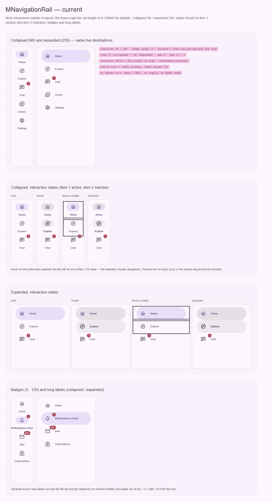
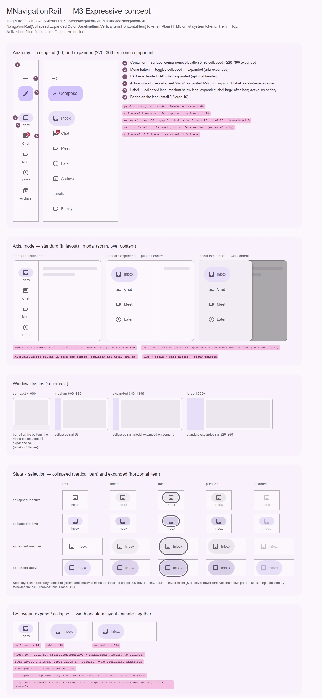

# MNavigationRail — боковая навигация для средних и широких окон: свёрнутая 96 и развёрнутая 220–360

<identity>M3: Navigation rail (Expressive: wide navigation rail — collapsed / expanded / modal expanded) · Токены Compose: `NavigationRailCollapsedTokens`, `NavigationRailExpandedTokens`, `NavigationRailColorTokens`, `NavigationRailBaselineItemTokens`, `NavigationRailVerticalItemTokens`, `NavigationRailHorizontalItemTokens`, `ScrimTokens`; поведение — `WideNavigationRail.kt`, `WideNavigationRailState.kt`, `NavigationItem.kt`, baseline `NavigationRail.kt` · Код: `src/runtime/components/ui/navigation-rail/` (+ `item/`) · Аудит: `data/navigation-rail.json` · Тип: public (+ sub `MNavigationRailItem`)</identity>

<implementation-status state="planned" updated="2026-10-07">План новый. Фаза C добавила кольцо фокуса, `can-hover` и forced colors; геометрия пункта, раскрытие и модальный режим не трогались.</implementation-status>

## Вердикт

`переработка`. Каркас совпадает с Expressive лучше, чем у бара: ширина 96, индикатор 56×32 на
`secondary-container`, режим `expanded`. Но пункт свёрстан абсолютными координатами (подписи
обрезаются, не переносятся и не ловят text spacing), при наведении на активный пункт таблетка
подменяется слоем 12% и выбор пропадает (ST-03), подпись `label-small` и жирная у активного вместо
`label-medium` / `label-large` и смены цвета. Нет шапки с кнопкой меню и FAB, нет управляемого
раскрытия (`expanded` — односторонний проп), нет модального развёрнутого режима, которым Expressive
заменяет модальный drawer. Развёрнутый индикатор растянут на всю ширину вместо «обнимающего»
иконку и подпись.

## Рендеры

| Сейчас | Концепт M3 |
|---|---|
|  |  |

Кадры концепта:

1. **Анатомия** — свёрнутый (96) и развёрнутый (280 из 220–360) рейл одного набора пунктов: шапка
   (меню, FAB → extended FAB), индикатор, иконка, подпись, бейдж, подпись секции; выноски отступов.
2. **Ось режима** — standard свёрнутый, standard развёрнутый (сдвигает контент), modal развёрнутый
   (над контентом, scrim, `surface-container`, тень 2, угол 16).
3. **Классы окон** (схема) — compact: бар + модальный рейл из меню; medium: свёрнутый; expanded:
   свёрнутый + модальный по запросу; large: развёрнутый standard.
4. **Матрица состояний** — свёрнутый и развёрнутый пункт × неактивный / активный × rest, hover,
   focus, pressed, disabled. Hover не снимает таблетку.
5. **Поведение** — раскрытие: ширина едет переходом на токенах `--sys-motion-*`, пункт переключает раскладку (иконка сверху → слева), подпись проявляется прозрачностью; пружин и анимации координат нет (S4 отклонён).

## Анатомия

| # | Часть M3 | Кит | Статус |
|---|---|---|---|
| 1 | Контейнер: `surface`, без формы и тени, ширина 96 / 220–360, поля сверху и снизу 44 | `nav.ui-navigation-rail` | иначе: угол 16 + кольцо `outline-variant` 40%, поля 12 / 8 |
| 2 | Шапка: кнопка меню (раскрытие) | — | нет (EN-03) |
| 3 | Шапка: FAB / extended FAB | — | нет |
| 4 | Индикатор: 56×32 (свёрнутый), h56 по содержимому (развёрнутый) | `.ui-navigation-rail-item__indicator` | есть; в развёрнутом — на всю ширину пункта |
| 5 | Иконка 24 | `__icon` | есть; залитой нет (S7) |
| 6 | Подпись: `label-medium` под иконкой / `label-large` после иконки | `__label`, `label-small` | иначе |
| 7 | Бейдж на иконке | `m-badge` в `__icon-wrapper` | есть; позиция мимо угла иконки, в развёрнутом налезает на подпись |
| — | Scrim модального режима | — | нет |
| — | Подпись секции (развёрнутый) | — | нет; нужна только с потребителем |

## Оси дизайна

| Ось | M3 | Кит сейчас | Цель | Ломает API |
|---|---|---|---|---|
| Раскрытие | `WideNavigationRailState` collapsed / expanded, анимируемое | проп `expanded` (`props.ts:16`), только сверху вниз | `v-model:expanded` | нет |
| Режим | `WideNavigationRail` / `ModalWideNavigationRail` / `hideOnCollapse` | только standard | `mode: 'standard' \| 'modal' \| 'dismissible'` (вопрос 2) | нет |
| Ширина развёрнутого | 220–360, по самому широкому пункту | фиксированные 256 (`_index.scss:10`) | вопрос 3 | нет |
| Раскладка пункта | Top (свёрнутый) ↔ Start (развёрнутый), анимируется | две абсолютные раскладки | поток (flex), та же ось `iconPlacement`, что у бара, выводится из `expanded` | нет |
| Шапка | `header` (меню, FAB, логотип), отступ до пунктов ≥ 40 | нет | слот `#header` (вопрос 1) | нет |
| Выравнивание пунктов | `Arrangement.Top` / `Center` / `Bottom` | сверху | не заводить без потребителя (`principles.md` В4) | — |
| Вид контейнера | плоский | «остров» | вопрос 1 плана `navigation-bar.md` | визуально |

## Оси состояний

| Ось | Нужно | Есть | Не хватает |
|---|---|---|---|
| Базовое | enabled, disabled | enabled | disabled-пункт (ST-01; вопрос 4 бара) |
| Взаимодействие | hover, pressed поверх выбора | hover (`item/index.vue:110-118`) | pressed (IN-07); hover на активном ломает выбор (`:130-138`, ST-02, ST-03) |
| Фокус | кольцо по форме индикатора | `focus-ring` на всём пункте (`item/index.vue:190-192`) | перенос на индикатор; у краёв рейла кольцо режет `overflow: hidden` (`index.vue:192`, IN-05) |
| Выбор | индикатор + залитая иконка + цвет | индикатор + `primary` + вес 700 (`:121-128`) | убрать вес (TK-03, MO-04), цвета по M3 (TH-01), S7 |
| Раскрытие | collapsed / expanded, `aria-expanded` у кнопки меню | проп без кнопки | кнопка / атрибуты (вопрос 1) |
| Навигация | ссылки + `aria-current` | кнопки + `aria-current` | `to` (A11-01) |
| Смысловое, валидация, данные | — | — | не применимы |

## Токены: расхождения

Карта — `assets/stylesheet/components/navigation-rail/_index.scss` (общая для рейла и пункта).

| Часть | M3 (Compose) | Кит сейчас | Действие |
|---|---|---|---|
| Ширина свёрнутого | `ContainerWidth` 96 | `$width` 96 (`:9`) | совпадает |
| Ширина развёрнутого | `ContainerWidthMinimum` 220 … `ContainerWidthMaximum` 360 | `$width-expanded` 256 (`:10`) | в диапазоне; вопрос 3 |
| Цвет контейнера | `ContainerColor` = surface; модальный `ModalContainerColor` = surface-container | `container.color` surface (`:20`) | + ветка `modal.color` |
| Форма | `ContainerShape` = CornerNone; модальный `ModalContainerShape` = CornerLarge | `container.shape` corner-large (`:19`) | none (вопрос 1 бара); `modal.shape` large |
| Тень / обводка | Level0; модальный Level2 | кольцо `outline-variant` 40% (`:21`) | убрать (вопрос 1 бара); `modal.shadow` `elevation(2)` |
| Поля контейнера | сверху и снизу 44 (`TopSpace`), по бокам 0 | `padding.block` 12, `padding.inline` 8 (`:16-17`) | 44 / 0; safe area (RS-09) |
| Шапка → пункты | ≥ 40 (`HeaderSpaceMinimum`) | — | `header.gap` |
| Промежуток пунктов | 4 свёрнутый (`ItemVerticalSpace`), 0 развёрнутый | `container.gap` 8 (`:22`) | 4 / 0 |
| Высота пункта | ≥ 64 свёрнутый (`ContainerHeight`), 56 развёрнутый (индикатор) | 72 / 56 (`item/index.vue:53`, `:143`) | `min-height` 64 / 56 в токенах (LY-04, TK-02) |
| Поле пункта по горизонтали | 20 (`WNRItemHorizontalPadding`) | индикатор по центру; в развёрнутом `left: 12` (`:147`) | 20 |
| Индикатор свёрнутый | 56×32, `CornerFull` | 56×32 литералами в `.vue` (`:68-69`) | в токены |
| Индикатор развёрнутый | h56, по содержимому, поля 16 / 16, иконка → подпись 8 | на всю ширину минус 24 (`:144-151`) | обнимает содержимое |
| Иконка → подпись (свёрнутый) | 4 (`IconLabelSpace`) | `top: 54` литералом (`:101`) | поток, `gap` 4 |
| Подпись | `label-medium` (свёрнутый), `label-large` (развёрнутый) | `item.typography` `label-small` (`:32`) | две ступени |
| Активная иконка | on-secondary-container (`ItemActiveIcon`) | `item.active.color` primary (`:30`) | разделить иконку и подпись (TH-01) |
| Активная подпись | secondary (`ItemActiveLabelText`) | primary + `font-weight: 700` (`item/index.vue:123`) | secondary, без смены веса |
| Слой состояния | on-secondary-container для активного и неактивного, внутри индикатора | hover: фон индикатора → on-surface 8%; активный hover → прозрачность 12% (`:36-41`) | отдельный слой `::before`; индикатор не трогается |
| Disabled | 38% от неактивных цветов | — | `item.disabled.*` |
| Бейдж | x = конец иконки − 12, y = верх − 2 | `badge.top` −12, `badge.right` −24 (`:53-54`) | как у бара, логические свойства |
| Scrim | scrim × 0.32 | — | переиспользовать `MOverlay` |
| Движение | ширина: spring spatial default (0.8 / 380), модальный — fast spatial (0.6 / 800); позиция иконки — spatial default | `transition: all` `medium-2` + `standard` (`item/index.vue:59`, `:73`, `:86`, `:107`; `index.vue:191`) | перечислить свойства (`width`, `opacity`, `background-color`) на токенах `--sys-motion-*`; пружины S4 отклонены владельцем 2026-10-07 (MO-02) |

Совпадает: ширина 96, размер иконки 24, цвет индикатора `secondary-container` (`:34`), цвет
неактивного `on-surface-variant` (`:28`).

## Поведение и доступность

- **Вёрстка пункта в потоке.** Абсолютные `top`/`left` (`item/index.vue:64-107`, `:142-165`) — корень
  CT-01/04/05/06, LY-03, TK-07, LY-10. Пункт становится flex-колонкой (свёрнутый) / flex-строкой
  (развёрнутый). Координаты не анимируются: едет только ширина рейла (`transition: width` на токене
  `--sys-motion-duration-medium-2`), подпись проявляется прозрачностью. Замеров и JS-анимаций нет.
- **Прокрутка.** Список не скроллится при нехватке высоты (CT-08, RS-10): `__list` получает
  `overflow-y: auto`, `overscroll-behavior: contain`; шапка остаётся сверху. Скруглённых углов у
  рейла по M3 нет, поэтому `--ui-scrollbar-inset-block` не нужен (вернётся, если вопрос 1 бара
  решат в пользу «острова»).
- **Раскрытие.** `v-model:expanded`; кнопка меню несёт `aria-expanded` и `aria-controls` (вопрос 1).
  Модальный режим: `MOverlay` (scrim, inert, фокус-трап, Esc, возврат фокуса), свёрнутый рейл
  остаётся в сетке, чтобы раскладка не прыгала (`WideNavigationRail.kt`, `ModalWideNavigationRail`).
  `dismissible` выезжает из-за края вместо раскрытия на месте.
- **Клавиатура** — по вопросу 2 плана `navigation-bar.md`; код (`index.vue:119-167`) сливается с
  баром в один композабл.
- **Бейдж и имя пункта** (A11-04) — как у бара: `aria-hidden` + `badgeLabel`.
- **Имя landmark** — `ariaLabel: 'Primary'` (`props.ts:17`), как у бара: без дефолта.
- **Лейаут.** Режим `--hosted` (`index.vue:217-223`) — потребитель `docs/app/components/DocsSidebar.vue`
  — сохраняется. Модальный развёрнутый рейл не вносит вклад в ширину зоны.
- **Forced colors** — есть (`item/index.vue:170-187`), переносится на новую разметку.
- **Принятые отклонения:** RS-04/05 (vw-масштаб корня).
- Пункты аудита, закрытые правилами кита: IN-01 (`can-hover` на `:110`, `:130`), LY-06 / TK-04
  (литералы z-index 0–1 внутри `isolation: isolate` разрешены `craft.md` §12), A11-18 (длительности
  на токенах, которые глобально сокращаются, `base/_animations.scss:44`), TH-04.

**P1 аудита (26 FAIL), сверено с кодом:** открыты ST-01/02/03, TH-01 (шаг 3), CT-01/02/04/05/06,
TK-03 (шаг 2), TK-02 (шаг 1), A11-01, A11-08 (шаг 9), MO-02 (шаг 8), TS-02/03/05 («Тесты»). Закрыты:
IN-01, IN-04 (кольцо есть, форма — шаг 3), LY-06, TK-04, TH-04, A11-18. RS-04/05 — принятое
отклонение, TS-01 — Storybook отклонён.

## API

| Что | Сейчас | Цель | Ломает |
|---|---|---|---|
| `expanded` | проп | `v-model:expanded` (`defineModel('expanded')`) | нет |
| `mode` | — | `'standard' \| 'modal' \| 'dismissible'`, дефолт `standard` (вопрос 2) | нет |
| `#header` | — | слот шапки (вопрос 1) | нет |
| `MNavigationRailItem` (поля пункта) | `id, icon, label, badge` | + `to`, `disabled`, `badge: number \| true`, `badgeLabel`, `activeIcon` — как у бара | нет |
| `ariaLabel` | дефолт `'Primary'` | без дефолта, dev-warn | да, миграция — передать строку |
| Компонент `m-navigation-rail-item` | публичный (`ui/navigation-rail/item`) | по вопросу 5 бара: уходит в общий примитив `components/fragments/navigation-item/` | да, но внешних потребителей нет (используется только `navigation-rail/index.vue:15`) |
| Слоты пункта | нет | по вопросу 5 бара | нет |

## План работ

1. **Токены и точечные пути** (S). Числа из `item/index.vue` — в карту (`item.height`, `indicator.*`,
   поля), `spacing()`, ветки `collapsed` / `expanded` / `modal`. Закрывает LY-04, TK-02, TK-06, TK-07.
2. **Пункт в потоке** (M). Flex-разметка, перенос подписи в свёрнутом (2 строки), многоточие в
   развёрнутом, `label-medium` / `label-large`, без смены веса. Закрывает CT-01…06, LY-03, LY-10,
   TK-03, MO-04. Зависимость: вопрос 5 бара (общий примитив или собственный пункт).
3. **Слой состояния и выбор** (S). `::before` в форме индикатора, pressed, кольцо на индикаторе,
   disabled, цвета M3. Закрывает ST-01/02/03, IN-07, TH-01. Зависимости: S1, S9.
4. **Контейнер** (S). Поля 44, промежутки 4 / 0, прокрутка списка, safe area; вид — по вопросу 1
   бара. Закрывает CT-08, RS-09, RS-10.
5. **Шапка и управляемое раскрытие** (M). `#header`, `v-model:expanded`, атрибуты кнопки меню.
   Зависимость: вопрос 1.
6. **Развёрнутая ширина** (S/M). По вопросу 3.
7. **Модальный режим** (L). `mode: 'modal' | 'dismissible'` на `MOverlay` (`pickModalLayerProps`), scrim,
   свёрнутый рейл-заглушка в сетке. Зависимости: вопрос 2, вопрос 1 плана `navigation-drawer.md`.
8. **Движение** (S). Явные `transition` на токенах `--sys-motion-*`: ширина рейла, прозрачность
   подписи, рост индикатора; без пружин и FLIP. Закрывает MO-02.
9. **Ссылки и a11y** (M). `to`, `badgeLabel`, клавиатура — общий композабл с баром. Закрывает
   A11-01, A11-04, A11-08.
10. **Документация** (S). `docs/server/data/en/navigation-rail.json`: убрать несуществующие `fabIcon`
    и слоты `top/bottom`, описать режимы, раскрытие, клавиатуру (DC-02…05).

## Тесты

- **Unit**: `v-model:expanded`; `mode="modal"` открывает слой и возвращает фокус; Esc сворачивает;
  `to` → ссылка; hover/disabled не меняют `aria-current`; клавиатура по вопросу 2 бара (TS-07).
- **Фикстуры** `playground/fixtures/navigation-rail/{matrix,stress}.vue`: свёрнутый / развёрнутый /
  модальный × состояния; stress — 12 пунктов в низком окне (прокрутка), длинные подписи, бейджи.
- **e2e**: axe в каждом режиме, фокус-трап и возврат фокуса в модальном, forced colors, RTL
  (развёрнутый пункт и бейдж зеркалятся), reduced motion (переход укорочен, а не выключен).

## Готово, когда

- Наведение на активный пункт добавляет слой, таблетка остаётся.
- Длинная подпись переносится (свёрнутый) или обрезается многоточием (развёрнутый) и не вылезает за рейл.
- Список скроллится, если пункты не помещаются по высоте.
- Раскрытие управляется через `v-model:expanded`, кнопка меню несёт `aria-expanded`.
- `mode="modal"` открывает развёрнутый рейл над контентом со scrim, свёрнутый остаётся на месте.
- В шаблоне пункта нет абсолютных координат и `transition: all`.
- Линтеры и e2e зелёные.

## Предложения по UX

Сверх паритета с M3. Это предложения, а не шаги плана.

| Предложение | Что получает пользователь | Заказчик | Цена | Рекомендация |
|---|---|---|---|---|
| Модальный рейл закрывается после выбора пункта (в `modal` / `dismissible`; Compose оставляет это приложению) | Переход в раздел одним касанием, без второго действия «закрыть» | Любой потребитель модального режима | S · бандл ≈ 0 · API: поведение по умолчанию, без флага | Да, вместе с шагом 7 |
| Тултип с полной подписью у пункта свёрнутого рейла, если подпись обрезана двумя строками | Видно полное имя раздела без раскрытия рейла | Продукты с длинными подписями (stress-фикстура) | S · переиспользует `MTooltip`, замер переполнения на resize · API: нет | Да, после шага 2 |
| Выбор следует за маршрутом (как у бара, общий композабл) | Правильная подсветка после «назад» и глубоких ссылок | `docs/app/components/DocsSidebar.vue` (разделы доков — маршруты) | S · бандл ≈ 0 · API: `match` | Да, общим шагом с баром |
| Горячая клавиша раскрытия (например, `Ctrl + B`) через существующий реестр горячих клавиш | Быстрое переключение ширины с клавиатуры на десктопе | Нет названного | S · переиспользует hotkey-реестр (`composables/hotkey/`) · API: нет, рецепт в доках | Рецептом в доках, не пропом |
| Раскрытие при наведении на свёрнутый рейл (peek) | Подписи видны без клика | Нет названного | M · таймеры задержки, модальный слой без scrim | Нет: случайные раскрытия, пункт исчезает из-под указателя, сложно с клавиатурой |

## Открытые вопросы

Решаются в плане `navigation-bar.md` и действуют здесь: вид контейнера (вопрос 1), клавиатура
(вопрос 2), `disabled` у пункта (вопрос 4), общий примитив пункта (вопрос 5).

**1. Кнопка меню: встроенная или в слоте.**
1. Рейл сам рисует кнопку меню, если привязан `v-model:expanded`. Цена: киту нужен текст имени кнопки
   («Развернуть навигацию») — он не поставляет непереводимых строк, значит, появляется обязательный
   проп `toggleLabel`.
2. Слот `#header="{ expanded, toggleAttrs }"`: потребитель кладёт `MButtonIcon` и `v-bind="toggleAttrs"`
   (`aria-expanded`, `aria-controls`, `onClick`). Цена: на одну строку больше у потребителя.
3. Оба: встроенная кнопка по флагу + слот. Цена: два пути, флаг вместо оси.

Рекомендация: 2 — тот же контракт бэгов атрибутов, что и в `behavior.md`, без текста в ките.

**2. Модальный режим рейла: делать ли его.**
Expressive заменяет модальный drawer модальным развёрнутым рейлом (`ModalWideNavigationRail`,
`hideOnCollapse`). Ответ связан с вопросом 1 плана `navigation-drawer.md`.
1. Делать `mode: 'standard' | 'modal' | 'dismissible'` сейчас. Цена: L-шаг, вторая модальная
   навигация рядом с drawer, пока тот не решён.
2. Не делать; модальная навигация остаётся за `MNavigationDrawer`. Цена: кит не следует Expressive
   в главном изменении навигации.
3. Только `modal` (раскрытие на месте), без `dismissible`. Цена: на компактных окнах (рейла нет)
   модальную навигацию по-прежнему даёт только drawer.

Рекомендация: 1, но после ответа по drawer.

**3. Ширина развёрнутого рейла.**
1. Фиксированный токен в диапазоне 220–360 (сейчас 256), длинные подписи — многоточие. Цена:
   не растёт под широкий пункт, зато zero-runtime и сетка лейаута знает ширину заранее.
2. По содержимому: `width: fit-content`, `min` 220, `max` 360, зона лейаута с `auto`-дорожкой.
   Цена: нужна поддержка `auto` в `carve.ts`, анимация ширины до `auto` не работает без замера.
3. Замер `ResizeObserver` → живая кастом-переменная (разрешённая «живая геометрия»). Цена: рантайм и
   первый кадр без замера при SSR.

Рекомендация: 1.
