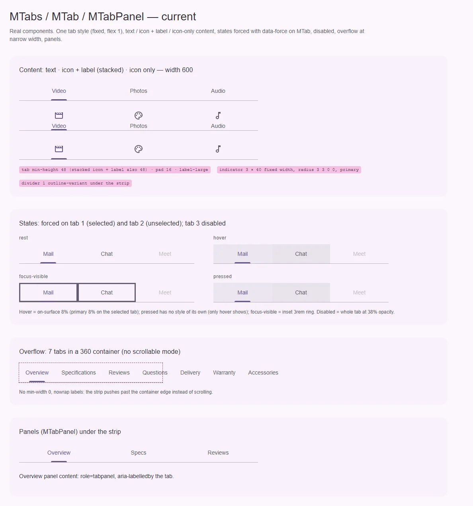
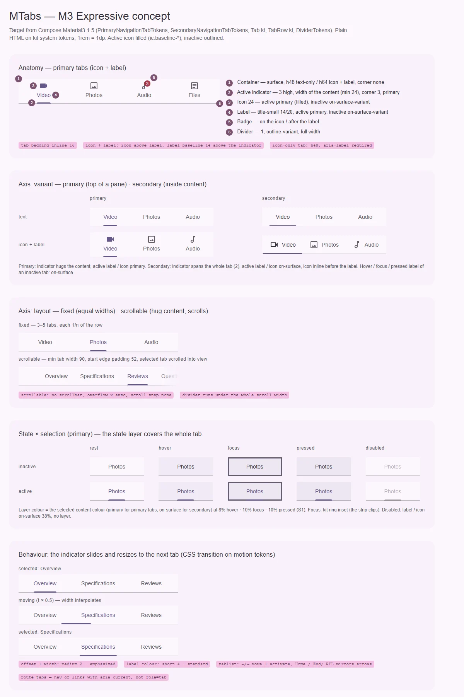

# MTabs / MTab / MTabPanel — переключение между панелями одного уровня внутри страницы

<identity>M3: Tabs (primary и secondary, fixed и scrollable) · Токены Compose: `PrimaryNavigationTabTokens`, `SecondaryNavigationTabTokens`, `DividerTokens`, `BadgeTokens`; поведение — `Tab.kt`, `TabRow.kt` · Код: `src/runtime/components/ui/tabs/` (+ `tab/`, `panel/`) · Аудит: `data/tabs.json` · Тип: public (+ sub `MTab`, `MTabPanel`)</identity>

<implementation-status state="planned" updated="2026-10-07">План новый. Фаза C закрыла невидимый фокус (кольцо `focus-ring(inset)`), голый `:hover` и forced colors; оси M3, переполнение и ARIA-хвосты не тронуты.</implementation-status>

## Вердикт

`дрейф`. Компонент узнаётся как primary tabs M3: полоса на `surface`, разделитель 1 `outline-variant`,
индикатор 3 `primary`, подпись 14/20. Расходятся размеры и поведение: индикатор фиксированной ширины
40 вместо ширины содержимого и «вырастает» из центра вместо того, чтобы ехать к следующей вкладке;
вкладка с иконкой и подписью высотой 48 вместо 64 — индикатор наезжает на подпись (видно на
рендере). Не хватает двух осей M3 — secondary-вкладок и scrollable-раскладки (добавляются аддитивно),
а без scrollable ряд выдавливает контейнер на узких экранах. ARIA почти целиком верна, хвосты —
безымянный `tablist`, панель default-слота без `id`, вкладки-маршруты с `role="tab"`.

## Рендеры

| Сейчас | Концепт M3 |
|---|---|
|  |  |

Кадры концепта:

1. **Анатомия** — primary-вкладки с иконкой и подписью (64): контейнер, индикатор по ширине
   содержимого, иконка (залитая у активной, S7), подпись `title-small`, бейдж, разделитель.
2. **Ось иерархии** — primary и secondary × только текст / иконка + подпись (secondary: иконка в
   строку, индикатор на всю вкладку 2, активная подпись `on-surface`).
3. **Ось раскладки** — fixed (равные доли) и scrollable (по содержимому, минимум 90, отступ 52 от
   начала, активная вкладка в зоне видимости).
4. **Матрица состояний** — неактивная / активная × rest, hover, focus, pressed, disabled. Слой —
   на всю вкладку, цветом активного содержимого.
5. **Поведение** — индикатор едет и меняет ширину к следующей вкладке (CSS-переход на токенах `--sys-motion-*`).

## Анатомия

| # | Часть M3 | Кит | Статус |
|---|---|---|---|
| 1 | Контейнер: `surface`, h48 (текст или иконка) / h64 (иконка + подпись), без формы | `.ui-tabs__list` + `.ui-tabs__tab` `min-height` 48 | иначе: 48 для всех |
| 2 | Индикатор: primary — 3, по ширине содержимого (≥ 24), угол 3; secondary — 2, на всю вкладку | `::after` 3×40, угол 3 3 0 0 (`tab/index.vue:133-151`) | иначе |
| 3 | Иконка 24 | `.ui-tabs__tab-icon` | есть; залитой у активной нет (S7) |
| 4 | Подпись `title-small` | `.ui-tabs__tab-label`, `label-large` | совпадает по метрикам 14/20/500, расходится по имени роли |
| 5 | Бейдж на иконке / после подписи | — | нет; демо доков просит его через несуществующий слот `#item` (`docs/app/components/mix/MixNavigation.vue:11`) |
| 6 | Разделитель 1, `outline-variant`, на всю ширину | `border-bottom` списка (`index.vue:139`) | есть |
| — | Панель `role="tabpanel"` | `MTabPanel`, default-слот | есть; у default-слота нет `id` |

## Оси дизайна

| Ось | M3 | Кит сейчас | Цель | Ломает API |
|---|---|---|---|---|
| Иерархия | primary (под app bar) / secondary (внутри контента) | только primary | вопрос 1 | нет |
| Раскладка | fixed (равные доли) / scrollable (по содержимому, прокрутка) | только fixed (`flex: 1`, `tab/index.vue:90`) | вопрос 2 | нет |
| Положение иконки | primary: сверху (по умолчанию) или в строку; secondary: в строку | только сверху | `iconPlacement: 'top' \| 'start'` — то же слово, что у навигационного бара | нет |
| Содержимое | текст · иконка · иконка + текст, бейдж | текст · иконка · иконка + текст | + бейдж | нет |

## Оси состояний

| Ось | Нужно | Есть | Не хватает |
|---|---|---|---|
| Базовое | enabled, disabled | enabled, disabled (`opacity` 38% на всю вкладку, `pointer-events: none`, `tab/index.vue:158-162`) | цвета по ролям вместо общей прозрачности (ST-06); `aria-disabled` у кнопок (IN-08) |
| Взаимодействие | hover, pressed | hover 8% внутри `can-hover` (`:127-131`) | pressed (ST-01, IN-07) |
| Фокус | видимое кольцо | `focus-ring(inset)` (`:103-105`) | — (IN-03, IN-04 закрыты) |
| Выбор | индикатор + цвет, `aria-selected` | есть | ширина и движение индикатора по M3 |
| Навигация | вкладки-маршруты — ссылки с `aria-current` | `NuxtLink` с `role="tab"` (`tab/index.vue:2-19`) | вопрос 3 (A11-01, FM-12) |
| Раскрытие, смысловое, валидация, данные | — | — | не применимы |

## Токены: расхождения

Карта — `assets/stylesheet/components/tabs/_index.scss`. Пути `g()` дефисные (`'tab-min-height'`,
`'state-layer-opacity-hover'`) — перевести файл на точечные целиком.

| Часть | M3 (Compose) | Кит сейчас | Действие |
|---|---|---|---|
| Высота (иконка + подпись) | `IconAndLabelTextContainerHeight` 64 (Compose layout — 72) | `tab.min.height` 48 (`:21-23`) для всех | ступень `stacked.height` 64; подпись на 14 над индикатором |
| Индикатор primary: ширина | по содержимому, минимум 24 (`TabRow.kt`, `PrimaryIndicator`) | `indicator.active.width` 40 (`:34-36`) | ширина содержимого — живая геометрия (кастом-переменная из замера) |
| Индикатор primary: форма | `RoundedCornerShape(3)` | литерал `3rem 3rem 0 0` (`tab/index.vue:141`) | токен `indicator.shape` (TK-02) |
| Индикатор secondary | на всю вкладку, 2 (в Compose `SecondaryIndicator` по умолчанию 3) | — | ветка `secondary.indicator.*` |
| Подпись | `title-small` | `typography.label` `label-large` (`:55-56`) | `title-small` (метрики те же, роль — M3) |
| Активный цвет primary | primary (подпись и иконка) | `active.color` primary (`:38-39`) | совпадает |
| Активный цвет secondary | on-surface | — | ветка `secondary.active.color` |
| Неактивный при hover / focus / pressed | on-surface | остаётся on-surface-variant | цвет содержимого по состоянию |
| Слой состояния | цвет активного содержимого (primary / on-surface), 8 / 10 / 10 | on-surface на неактивной, primary на активной (`:44-53`), только hover | один цвет слоя на иерархию; focus, pressed (S1) |
| Disabled | содержимое on-surface × 0.38 | `opacity` 38% на всё (`:41-42`) | цвета по ролям (ST-06) |
| Поле вкладки | 16 по горизонтали | `tab.padding.inline` 16 (`:18-20`) | совпадает |
| Иконка → подпись (в строку) | 8 (`TextDistanceFromLeadingIcon`) | `tab.gap` 4 (`:17`), только колонкой | 8 для `start` |
| Scrollable | минимум вкладки 90, отступ от начала 52 | — | ветка `scrollable.*` |
| Разделитель | `DividerTokens`: outline-variant, 1 | `list.border` 1 `outline-variant` (`:11-14`) | совпадает |
| Движение | индикатор: смещение + ширина, spring spatial default; цвет: effects default / fast | ширина 0 → 40 из центра, `short-3` + `standard` (`tab/index.vue:143`) | скользящий индикатор на уровне списка: `transition` `transform` / `width` на `medium-2` + `emphasized`; пружины S4 отклонены владельцем 2026-10-07 |

Совпадает: контейнер `surface`, высота 48 у текстовой вкладки, иконка 24, поле 16, разделитель.

## Поведение и доступность

- **Скользящий индикатор.** Сейчас у каждой вкладки свой `::after`. M3 рисует один индикатор на
  уровне ряда и анимирует его смещение и ширину. Геометрия выбранной вкладки — живая, поэтому едет
  кастом-переменными (`--m-tabs-indicator-x`, `--m-tabs-indicator-w`) из замера — единственное
  разрешённое применение рантайм-переменных (`craft.md` §10). Без JS (SSR, первый кадр) индикатор
  рисуется под выбранной вкладкой её собственным `::after`.
- **Переполнение** (CT-01, CT-03, CT-04, CT-08, RS-01, RS-03). Вкладка получает `min-width: 0`; режим
  scrollable — `overflow-x: auto`, `scrollbar-width: none` (разрешено для скрытия, `craft.md` §11),
  активная вкладка прокручивается в видимую зону. Решение о дефолте — вопрос 2.
- **Имя `tablist`** (A11-02, EN-04). `aria-label` / `aria-labelledby`, переданные на `MTabs`, сейчас
  уходят на корневой `div`: `inheritAttrs: false`, `aria-*` — на `tablist`, `class` / `style` — на корень.
  Вкладка без подписи и без `aria-label` — dev-предупреждение.
- **Панель default-слота** (A11-06): `id = panelId(selected)`, `aria-labelledby = tabId(selected)`,
  `tabindex="0"`, как у `MTabPanel` (`panel/index.vue:6-8`). Сейчас `aria-controls` вкладок ведёт в
  несуществующий `id`.
- **Клавиатура** (A11-08, LY-10). Стрелки с автоматической активацией, Home / End — есть
  (`index.vue:94-107`). Добавить зеркалирование в RTL и перевести фокус с `watch(focusedValue)`
  (`tab/index.vue:59-63`) на прямой фокус по реестру элементов: повторная цель сейчас не получает фокус.
- **Disabled** (IN-08): кнопки получают `aria-disabled` вместо нативного `disabled`, как ссылки
  (`tab/index.vue:17-18`); стрелки их уже пропускают (`index.vue:76`).
- **Вкладки-маршруты** — вопрос 3.
- **Бейдж** — как в навигации: `aria-hidden` у бейджа, смысл через `badgeLabel`.
- Закрыто фазами A–C: ST-03, IN-01, IN-03, IN-04, TH-04. RS-04/05/06 — принятое отклонение
  (vw-масштаб корня).
- **P1 аудита (23 FAIL):** открыты ST-01 (шаг 3), TK-02 (шаг 1), CT-01/03/04, RS-01 (шаг 5), FM-12,
  A11-01 (шаг 7), A11-02, A11-06, A11-08 (шаг 6), TS-02/03/05 («Тесты»); закрыты ST-03, IN-01, IN-03,
  IN-04, TH-04; RS-04/05/06 приняты; TS-01 — Storybook отклонён.

## API

| Что | Сейчас | Цель | Ломает |
|---|---|---|---|
| Иерархия | — | вопрос 1 (рекомендация: `hierarchy: 'primary' \| 'secondary'`, дефолт `primary`) | нет |
| Раскладка | — | вопрос 2 (рекомендация: `layout: 'fixed' \| 'scrollable'`, дефолт `fixed`) | нет |
| `iconPlacement` | — | `'top' \| 'start'`; дефолт `top` у primary, `start` у secondary | нет |
| `MTabItem.badge` / `MTab.badge` | — | `number \| true`, + `badgeLabel` | нет |
| `MTabItem.to` / `MTab.to` | ссылка с `role="tab"` | вопрос 3 | возможно |
| `aria-*` на `MTabs` | падают на корень | уходят на `tablist` | нет (исправление) |
| Слот содержимого вкладки | только у `MTab` (default-слот) | `#tab="{ item, selected }"` на пути `items` — то, что ожидает демо доков | нет |
| `activeIcon` | — | у пункта, до решения СВ-3 (S7) | нет |

## План работ

1. **Токены и точечные пути** (S). Литерал угла индикатора — в карту, `spacing()`, ветки
   `primary` / `secondary` / `scrollable` / `stacked`. Закрывает TK-02, TK-06.
2. **Высота и раскладка вкладки** (S). 64 для иконки с подписью, `iconPlacement`, `title-small`,
   `min-width: 0`. Чинит наезд индикатора на подпись.
3. **Состояния** (S). Pressed, focus-слой, цвета содержимого по состоянию, disabled по ролям,
   `aria-disabled`. Закрывает ST-01, ST-06, IN-07, IN-08. Зависимость: S1.
4. **Скользящий индикатор** (M). Один индикатор на ряд, геометрия из замера, SSR-фолбэк, переход на
   токенах `--sys-motion-duration-medium-2` + `--sys-motion-easing-emphasized`.
5. **Scrollable и переполнение** (M). По вопросу 2. Закрывает CT-01/03/04/08, RS-01, RS-03.
6. **ARIA и клавиатура** (S). Имя `tablist`, панель default-слота, RTL, фокус по реестру.
   Закрывает A11-02, A11-06, A11-08, EN-04, LY-10.
7. **Вкладки-маршруты** (M). По вопросу 3. Закрывает A11-01, FM-12.
8. **Secondary** (S). По вопросу 1.
9. **Бейдж и слот вкладки** (S). `badge`, `badgeLabel`, `#tab`; починить демо доков
   (`MixNavigation.vue:11` передаёт несуществующий `#item`).
10. **Документация** (S). `docs/server/data/en/tabs.json`: убрать несуществующий `variant`, описать
    `MTab` / `MTabPanel`, клавиатуру, переполнение, «когда брать навигацию, а не вкладки» (DC-01…05).

## Тесты

- **Unit** (`tabs/index.spec.ts` уже покрывает роли, roving, клик, `to`, disabled, ArrowRight):
  добавить `aria-label` на `tablist`, `id` панели default-слота, RTL-стрелки, Home / End, повторный
  фокус, `hierarchy="secondary"`, `layout="scrollable"` (активная вкладка видима), бейдж `aria-hidden`.
- **Фикстуры** `playground/fixtures/tabs/{matrix,stress}.vue`: иерархия × раскладка × содержимое ×
  состояние; stress — 12 вкладок, длинные подписи, 320 px, контейнер 280 в карточке.
- **e2e** `tabs.e2e.ts`: axe (битый `aria-controls` и безымянный `tablist` должны падать до
  починки), клавиатура, forced colors, RTL, reduced motion (индикатор едет укороченно).

## Готово, когда

- Индикатор primary равен ширине содержимого вкладки и едет к новой вкладке, а не вырастает из центра.
- Вкладка с иконкой и подписью — 64, индикатор не касается подписи.
- Ряд не выдавливает контейнер ни в одной раскладке; в scrollable активная вкладка видна.
- `tablist` имеет имя, `aria-controls` каждой вкладки ведёт в существующую панель.
- Решения по вопросам 1–3 реализованы; линтеры и e2e (с axe) зелёные.

## Предложения по UX

Сверх паритета с M3. Это предложения, а не шаги плана.

| Предложение | Что получает пользователь | Заказчик | Цена | Рекомендация |
|---|---|---|---|---|
| Панели сохраняют состояние при переключении: `displayDirective: 'if' \| 'show'` (то же имя, что у `mModalLayerProps`), панель монтируется при первом открытии | Введённые в форму данные и прокрутка не теряются при переходе на соседнюю вкладку. Сейчас `MTabPanel` пересоздаётся через `v-if` (`panel/index.vue:3`) | Формы во вкладках; страницы доков (overview / specs / api) | S · бандл ≈ 0 · API: проп у `MTabs` / `MTabPanel` | Да |
| Синхронизация выбранной вкладки с URL (`?tab=specs`) — рецепт поверх `v-model` и `useRoute` | Перезагрузка и ссылка открывают ту же вкладку, «назад» возвращает предыдущую | 15 мест `MTabs` в доках | S · бандл ≈ 0 · API: нет, рецепт; композабл — только если рецепт повторится | Рецептом в доках |
| Кнопки-шевроны по краям scrollable-ряда на устройствах с указателем (`@media (hover: hover)`) | Мышью без горизонтального колеса можно добраться до скрытых вкладок | Desktop-продукты с длинными рядами вкладок | S · переиспользует `MButtonIcon` · API: нет, часть `layout="scrollable"` | Да, вместе с шагом 5 |
| Ручная активация для тяжёлых панелей: стрелки двигают фокус, Enter / Space выбирает (`activation: 'auto' \| 'manual'`, APG) | Перебор вкладок с клавиатуры не запускает загрузку каждой панели | Нет названного | S · API: проп | Только с заказчиком; для вкладок-маршрутов — по вопросу 3 |
| Свайп по контенту для переключения вкладок на тач-экранах | Переключение одной рукой | Нет названного; M3 описывает свайп, но это работа пейджера, а не вкладок | M · переиспользует `useDrag` · API: проп или отдельный пейджер | Нет сейчас |

## Открытые вопросы

**1. Как назвать ось primary / secondary.**
Слово `variant` закреплено за обработкой поверхности (`axes.md`), `color` — за семантической ролью
(а здесь `primary` — не роль цвета), `type` запрещён для нового (ОВ-2).
1. `hierarchy: 'primary' | 'secondary'` — новое слово в словаре осей, запись в `axes.md`. Цена:
   словарь растёт на одно слово.
2. `variant: 'primary' | 'secondary'` с комментарием-исключением, как у филдового `variant`. Цена:
   второе исключение размывает правило «одно слово — один смысл».
3. Два компонента-обёртки (`MPrimaryTabs` / `MSecondaryTabs`), как у material-web. Цена: два
   публичных имени ради одной оси.

Рекомендация: 1.

**2. Раскладка и дефолт при переполнении.**
1. `layout: 'fixed' | 'scrollable'`, дефолт `fixed` (как сейчас); у `fixed` страховка — при нехватке
   места ряд всё равно прокручивается, а не выталкивает контейнер. Цена: потребитель сам переключает
   на `scrollable`, когда вкладок много.
2. Дефолт `scrollable`. Цена: меняется вид всех существующих вкладок (15 мест в доках).
3. `layout: 'auto'` — fixed, пока помещается, иначе scrollable (замер `ResizeObserver`). Цена:
   рантайм-замер и прыжок раскладки на первом кадре после SSR.

Рекомендация: 1.

**3. Вкладки с `to` (маршруты).**
Паттерн tabs переключает панели на месте; ссылка с `role="tab"` теряет семантику навигации, а
стрелки сейчас выбирают вкладку без перехода (FM-12). Потребителей `to` у вкладок в доках нет, есть
только тест `tabs/index.spec.ts:58`.
1. Если у вкладок есть `to`, `MTabs` рендерит `<nav>` со ссылками и `aria-current="page"`, выбор
   следует за маршрутом, `tablist` и панели не рендерятся. Цена: один компонент с двумя разметками.
2. Убрать `to` из вкладок; для навигации между страницами — навигационные компоненты. Цена:
   ломающее изменение, хотя потребителей не видно.
3. Оставить `tablist` + ссылки, но стрелки только двигают фокус (ручная активация), выбор — по
   маршруту. Цена: остаётся нарушение APG (ссылка в роли вкладки).

Рекомендация: 1.
