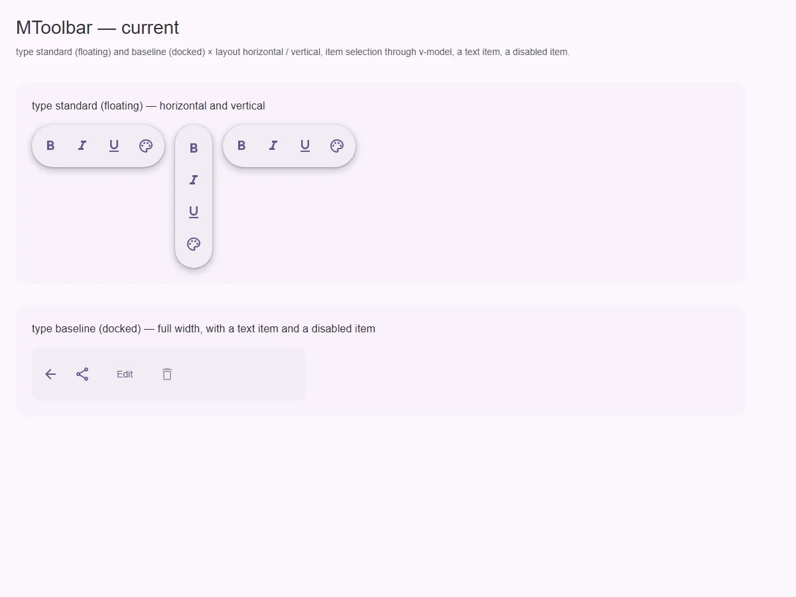
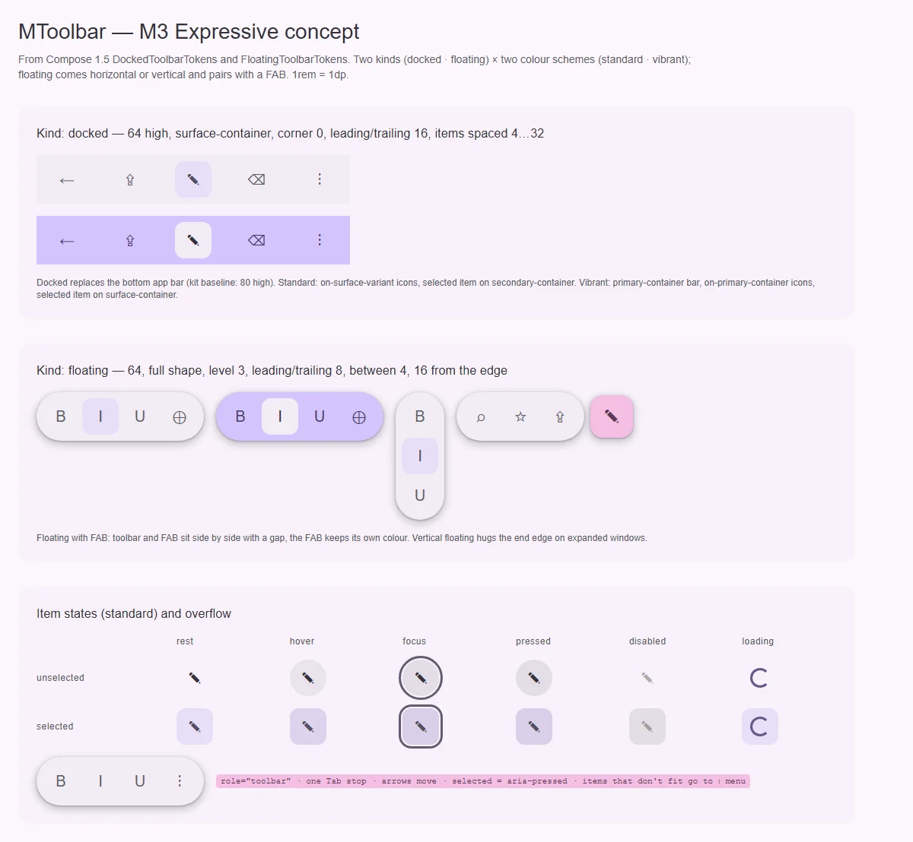

# MToolbar — панель действий (docked и floating)

<identity>M3: Toolbars (Expressive: docked toolbar — замена bottom app bar; floating toolbar — horizontal / vertical, standard / vibrant, в паре с FAB) · Токены Compose: `DockedToolbarTokens`, `FloatingToolbarTokens`, `BottomAppBarTokens` (baseline) + `FloatingToolbar.kt`, `AppBar.kt` · Код: `src/runtime/components/ui/toolbar/`, `src/runtime/composables/useToolbar.ts` · Аудит: `data/toolbar.json` · Тип: public</identity>

<implementation-status state="planned" updated="2026-10-07">Есть `type: standard` (floating: 64, full, level 3) и `baseline` (docked, но с высотой bottom app bar 80), `layout: horizontal | vertical`, выбор через `v-model` с `multiple`. Нет vibrant-схемы, пары с FAB, паттерна APG Toolbar, переполнения. На текущем рендере выбор не виден.</implementation-status>

## Вердикт

`переработка`.
- Floating-вариант по форме совпадает с M3: 64, полная форма, уровень 3.
- Docked остался bottom app bar: высота 80 вместо 64, отступы не по токенам.
- Нет vibrant-цвета (`primary-container`) и пары «floating toolbar + FAB».
- Как виджет панель не доступна: нет `role="toolbar"`, одного Tab-стопа и стрелок, выбор не
  объявляется (`aria-pressed`), у icon-only пунктов нет имени, переполнение не обрабатывается.
- Сломанные места: `transition: all` (сдвигает соседей), сравнение компонента со строкой
  `'MButton'`, которое не срабатывает (EN-01).

## Рендеры

| Сейчас | Концепт M3 |
|---|---|
|  |  |

Текущий рендер:
- floating горизонтальный и вертикальный, `multiple`;
- docked с текстовым и disabled-пунктом.

**Выбранный пункт (`v-model="italic"`, `['bold','underline']`) не подсвечен ни в одном из
вариантов** — это дефект, см. шаг 1.

Кадры концепта:
1. Docked standard и vibrant.
2. Floating standard, vibrant, vertical и в паре с FAB.
3. Матрица состояний пункта (unselected/selected × rest…loading).
4. Переполнение в меню «⋮».

## Анатомия

| # | Часть M3 | В ките | Статус |
|---|---|---|---|
| 1 | Контейнер docked (64, `surface-container`, угол 0, отступы 16, промежутки 4…32) | `--type-baseline`: 80, `padding 8`, `gap 8` | иначе |
| 2 | Контейнер floating (64, full, level 3, отступы 8, промежуток 4, 16 от края) | `--type-standard`: 64, full, level 3, `padding 8`, `gap 8` | промежуток 8 вместо 4 |
| 3 | Пункты: icon buttons 48 / кнопки | `MButtonIcon` / `MButton` через `defineAsyncComponent` | есть; `text` → `tonal` при выборе |
| 4 | Выбранный пункт (`secondary-container`; у vibrant — `surface-container`) | `variant: tonal` = `primary-container` | иначе (роль) и на рендере не виден |
| 5 | FAB рядом с floating | — | нет |
| 6 | Переполнение «⋮» → меню | — | нет (CT-01, CT-08, RS-01) |

## Оси дизайна

| Ось | M3 | Кит сейчас | Цель | Ломает API |
|---|---|---|---|---|
| Вид | docked · floating | `type: 'standard' \| 'baseline'` | Значения `floating \| docked`, старые как алиасы с предупреждением. Слово `type` — ОВ-2, не трогать | да, через алиасы |
| Цветовая схема | standard · vibrant | — | `variant: Extract<MVariant, 'filled' \| 'tonal'>`? — вопрос 1 | нет |
| Раскладка | horizontal · vertical (только floating) | `layout` у обоих | Предупреждать о `vertical` у docked | нет |
| FAB | у floating | — | Слот `#fab` | нет |
| `density` | нет | нет | Не вводить | — |

## Оси состояний

| Ось | Нужно | Есть | Не хватает |
|---|---|---|---|
| Выбор | `aria-pressed` у toggle-пунктов | класс через `variant` | ARIA (A11-06); видимость на рендере (шаг 1) |
| Фокус | Один Tab-стоп, стрелки по оси раскладки, Home/End | Каждая кнопка — отдельный Tab-стоп | APG Toolbar (A11-08) |
| Базовое | disabled с причиной | нативный `disabled` | `aria-disabled` + фокусируемость (IN-08, общий вопрос кнопок В-6) |
| Переполнение | Лишнее уходит в меню | нет | CT-01, CT-08, RS-01, RS-03 |
| Forced colors | Выбранный пункт отличим | граница контейнера есть | Выбранный пункт: `Highlight`-рамка (TH-04) |

## Токены: расхождения

| Часть | M3 (Compose) | Кит сейчас | Действие |
|---|---|---|---|
| Высота docked | 64 | 80 (`_index.scss` `baseline.container.height`), с FAB 72 (не применяется, TK-06) | 64. Ветку `with-fab` удалить |
| Отступы docked | leading/trailing 16, промежуток 4…32 (распределение) | `padding 8`, `gap 8` в `.vue` (LY-04) | Токены `docked.padding.inline: spacing(16)`, `justify-content: space-between` с `min-gap spacing(4)` |
| Floating промежуток | 4 | 8 | `spacing(4)` |
| Vibrant | контейнер `primary-container`, иконки `on-primary-container`, выбранный — `surface-container` / `on-surface` | — | ветка `vibrant` |
| Выбранный (standard) | `secondary-container` / `on-secondary-container` | `tonal` = `primary-container` | токен `item.selected.*`, не через вариант кнопки |
| `icon.color` | `on-surface-variant` / выбранный `on-secondary-container` | объявлены, не используются (TK-06) | применить |
| Переход | токены `--sys-motion-*` | `transition: all 0.2s ease` (MO-02, MO-05, TK-04) | Только `background-color`/`color` на токенах; размеры не анимировать |

## Поведение и доступность

- **APG Toolbar (A11-08):**
  - `role="toolbar"`, `aria-orientation` по `layout`, `aria-label` или `aria-labelledby`
    обязательны (dev-предупреждение);
  - roving tabindex, стрелки по оси, Home/End.

  Переиспользовать общий roving-контроллер. Его вынос — общий вопрос ВГ-3 из
  [selection-group](../form/selection-group.md), третий контроллер не заводим.
- **A11-06.** Toggle-пункты: `aria-pressed`. В режиме одиночного выбора — тоже
  `aria-pressed`: это панель действий, а не радиогруппа.
- **A11-02.** Icon-only пункт без `ariaLabel` даёт предупреждение в dev. Пункт с `icon` и
  `label` рисуется как кнопка с подписью, а не только с иконкой.
- **EN-01.** `MToolbarItem` получает строгий тип: `{ id, icon?, label?, ariaLabel?, disabled? }`
  плюс слот `#item` для нестандартного. Строковое сравнение `'MButton'` удалить.
- **Переполнение.** Пункты, не влезшие по ширине, уходят в `MMenu` за «⋮». Замер через
  `ResizeObserver` на клиенте; SSR рисует всё, кроме меню. Вопрос 2.
- **RS-09.** У docked — `padding-bottom: env(safe-area-inset-bottom)`.

## API

| Что | Изменение | Ломает |
|---|---|---|
| `type` | `'floating' \| 'docked'`; `standard` → `floating`, `baseline` → `docked` с предупреждением | через minor |
| цветовая схема | по вопросу 1 | нет |
| `#fab` | новый слот у floating | нет |
| `ariaLabel` | обязателен (dev-warn) | нет |
| `MToolbarItem` | строгий тип, `component` удаляется в пользу слота `#item` | да (тип) |
| `emit('select')` | остаётся для режима без модели | нет |

## План работ

1. **S — найти, почему выбор не виден.** Режим с моделью вычисляется один раз
   (`hasModel` в setup), `resolveSelected` и регистрация тикетов `items`. Добавить спеку,
   которая проверяет класс и `aria-pressed` у выбранного пункта.
2. **S — токены:**
   - docked 64 и отступы, floating промежуток 4;
   - цвет выбранного через `item.selected.*`;
   - `icon.color` применить;
   - убрать `transition: all` (TK-02, TK-04, TK-06, LY-04, MO-02, MO-05).
3. **M — APG Toolbar** (A11-08, A11-06, A11-02, FM-07).
4. **S — строгий `MToolbarItem` и слот `#item`** (EN-01).
5. **S — переименование значений `type` с алиасами.**
6. **S — vibrant** (после вопроса 1) **и слот `#fab`.**
7. **M — переполнение в меню** (после вопроса 2).
8. **S — safe-area у docked** (RS-09), forced colors для выбранного (TH-04).
9. **S — тесты** (TS-07) **и документация** (DC-02…05).

## Тесты

- Unit:
  - `v-model` single/multiple — класс и `aria-pressed`;
  - roving: стрелки, Home/End, один Tab-стоп;
  - алиасы `type`;
  - предупреждения (нет имени у панели и у icon-only пункта).
- e2e:
  - фикстура `toolbar/matrix.vue`;
  - axe;
  - 320px: лишние пункты в «⋮», нет горизонтального переполнения;
  - forced colors: выбранный пункт отличим.

## Готово, когда

- Docked совпадает с M3 по высоте и отступам.
- Выбор виден и объявляется.
- С клавиатуры панель работает по APG.
- Переполнение не ломает ширину.

## Предложения по UX

Расширения сверх паритета с M3. Это предложения владельцу, а не шаги плана. Без Expressive-анимаций и без новых зависимостей.

| Предложение | Что получает пользователь | Заказчик | Цена | Рекомендация |
|---|---|---|---|---|
| Горячие клавиши пунктов через `useHotkey` и `aria-keyshortcuts`, подсказка в тултипе | Частые действия редактора без мыши | редактор текста, таблица | S · реестр `useHotkey` уже есть | да, вместе с предложением `hotkey` у кнопки ([button](../button/index.md)) |
| Floating toolbar прячется при прокрутке вниз и возвращается при прокрутке вверх | Больше места для контента на телефоне | лента, документ | S · `windowY` зоны раскладки, переход на токенах | отложить до заказчика |
| Контекстный floating toolbar над выделением (для текста, ячеек) | Действия появляются там, где пользователь работает | редактор, таблица | M · позиционирование через внутренний popover из плана [menu](../overlays/menu.md) | обсудить |

## Открытые вопросы

**1. Как назвать ось цветовой схемы standard / vibrant?**
1. `variant: 'tonal' \| 'filled'` из канонического `MVariant`: standard — tonal (`surface-container`),
   vibrant — filled (`primary-container`). Один словарь кита, но «filled» здесь означает
   акцентный контейнер.
2. Новое слово `scheme: 'standard' \| 'vibrant'`, как в M3. Точно по смыслу, но это новая ось кита
   (`axes.md`).

Рекомендация: 2. `variant` у кита — обработка поверхности, а vibrant — смена роли цвета. То же
решение пригодится для vibrant-меню из [menu](../overlays/menu.md) (вопрос 4) — решать вместе.

**2. Как определять переполнение?**
1. `ResizeObserver` и замер ширины пунктов на клиенте. Точно, но первый кадр на SSR без меню.
2. Явный проп `maxVisible` от потребителя. Без замеров, но не адаптивно.

Рекомендация: 1 с `maxVisible` как запасным выходом.
