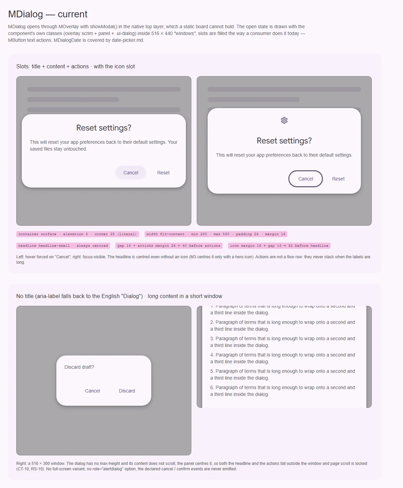
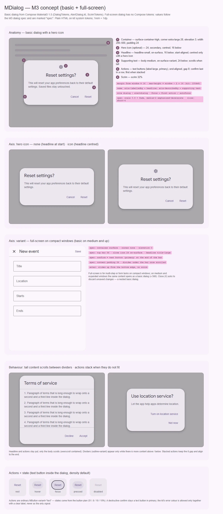

# MDialog — базовый модальный диалог (basic); full-screen — gap

<identity>M3: Dialogs — basic (с hero-иконкой или без) и full-screen · Токены Compose: `DialogTokens.kt`, `ScrimTokens.kt`; поведение — `AlertDialog.kt` (`AlertDialogDefaults`, `AlertDialogContent`, `AlertDialogFlowRow`). У full-screen dialog токенов в Compose 1.5 нет · Код: `src/runtime/components/ui/dialog/index.vue` (без `dialog/date/` — это [date-picker.md](../inputs/date-picker.md)), токены `src/runtime/assets/stylesheet/components/dialog/_index.scss`, слой — `components/ui/overlay/` · Аудит: `data/dialog.json` (части MDialog; пункты `dialog/date` разобраны в date-picker.md) · Тип: public</identity>

<implementation-status state="planned" updated="2026-10-07">План новый. MDialog — тонкая обёртка над `MOverlay` (нативный `<dialog>`, `showModal()`, inert, scroll lock), модальная механика работает. Шаги 1–6 не ломают API; full-screen и роль `alertdialog` ждут вопросов 1–2. Программный API `$modals` — отдельный план [modals.md](modals.md), инфраструктура слоя — [overlay.md](overlay.md).</implementation-status>

## Вердикт

`дрейф`. Анатомия базового диалога M3 на месте: hero-иконка, заголовок `headline-small`,
текст `body-medium`, действия справа, ширина 280–560, padding 24, тень 3, scrim 32 %. Разошлись
роль и ритм. Контейнер стоит на `surface`, а не на `surface-container-high`, поэтому в тёмной теме
сливается со страницей. Заголовок центрирован всегда, хотя M3 центрирует его только с иконкой.
Перед действиями 40 вместо 24, после иконки 32 вместо 16. Главный дефект поведенческий: нет
предельной высоты и прокрутки, длинный диалог обрезается вместе с кнопками. Full-screen варианта
и роли `alertdialog` нет. Объявленные `cancel` / `confirm` не эмитятся. Ломающих изменений план
не требует.

## Рендеры

| Сейчас | Концепт M3 |
|---|---|
|  |  |

**Сейчас.** Диалог открывается через `showModal()` в top layer, статично его не снять. Поэтому
открытое состояние собрано из классов самого компонента: `.ui-overlay__scrim`,
`.ui-overlay__panel` и `.ui-dialog`. Слоты заполнены так, как это делает потребитель:
`MButton variant="text"`. Стили грузит закрытый экземпляр `MDialog` на доске.
1. Слоты title + content + actions и тот же диалог с иконкой. Hover принудительно на «Cancel»
   слева, focus-visible — справа. Видно центрированный заголовок без иконки и большие паузы
   (40 перед действиями, 32 после иконки).
2. Без заголовка: `aria-label` падает на английское «Dialog». Длинный текст в окне 516 × 300:
   диалог центрирован панелью и не прокручивается, заголовок и кнопки за краем окна (CT-10, RS-10).

**Концепт.**
1. Анатомия базового диалога с hero-иконкой: 6 частей с выносками.
2. Ось hero-иконки: без иконки заголовок у начала строки, с иконкой — по центру.
3. Ось варианта: full-screen на компактном окне. Верхняя панель 56 с закрытием, заголовком
   `title-large` и подтверждением, контент с отступом 24.
4. Поведение: высокий текст прокручивается между разделителями, заголовок и действия на месте.
   Действия, которые не помещаются в ряд, встают стопкой, подтверждение сверху.
5. Состояния действия — обычная текстовая `MButton` внутри диалога.

## Анатомия

Нумерация — по кадру 1 концепта.

| # | Часть M3 | Элемент кита | Статус |
|---|---|---|---|
| 1 | Container | `.ui-dialog` (`index.vue:79`) | иначе: `surface` вместо `surface-container-high`, радиус литералом `28rem`, `overflow: hidden`, нет `max-height` |
| 2 | Hero icon | слот `#icon` → `.ui-dialog__icon` | есть: 24, `secondary`, по центру; отступ 32 вместо 16 (margin 16 + gap 16) |
| 3 | Headline | проп `title` → `h2.ui-dialog__headline` | иначе: центрирован всегда (`index.vue:119`), слота для разметки нет |
| 4 | Supporting text | слот по умолчанию → `.ui-dialog__content` | есть; не прокручивается, нет `overflow-wrap` (CT-04), не связан через `aria-describedby` |
| 5 | Actions | слот `#actions` → `.ui-dialog__actions` | иначе: справа с gap 8, но без переноса и стопки; перед ними 40 вместо 24 |
| 6 | Scrim | `.ui-overlay__scrim` (`MOverlay`) | есть, 32 % |
| — | Разделители при прокрутке | — | нет |
| — | Full-screen: верхняя панель (закрыть, заголовок, подтверждение) | — | нет (вопрос 1) |

## Оси дизайна

| Ось | M3 | Кит сейчас | Цель | Ломает API |
|---|---|---|---|---|
| Вариант подачи | basic · full-screen (на компактном окне) | только basic | basic + full-screen по вопросу 1 | нет, добавление |
| Hero-иконка | есть / нет; с иконкой заголовок по центру | слот `#icon`, заголовок всегда по центру | без изменений API, выравнивание по M3 | нет (визуально) |
| Роль | dialog · alertdialog (material-web `type="alert"`) | только dialog | вопрос 2 | нет |
| Наполнение | текст · список (radio/checkbox во всю ширину) · форма | свободный слот | без изменений; рецепт списка — в документации | нет |

Осей цвета и размера у диалога нет и не будет: ширину задаёт контент в пределах 280–560.

## Оси состояний

Из `axes` аудита (часть MDialog), сверено с кодом.

| Ось | Нужно | Есть | Не хватает |
|---|---|---|---|
| Базовое | open / hidden, persistent | `MOverlay` | — |
| Взаимодействие | у действий | через `MButton` | — (план кнопки) |
| Фокус | внутрь при открытии, возврат на активатор | трап `MOverlay` | начальный и возвратный фокус: A11-12 → [overlay.md](overlay.md), шаг 1 |
| Раскрытие | closed → open | `MOverlay` | — |
| Переполнение | тело прокручивается, заголовок и действия видны | нет | CT-10, RS-08, RS-10 |
| Выбор, навигация, смысловое, валидация, данные | — | — | не применимо (смысловых вариантов info/success у диалога нет) |

## Токены: расхождения

Карта — `assets/stylesheet/components/dialog/_index.scss`. Все пути `g()` в `index.vue` легаси через
дефис (`'bg-color'`, `'actions-margin-top'`, `'motion-scale-from'`), при правке файл переводится на
точку целиком.

| Часть | M3 (Compose) | Кит сейчас (`файл` / путь `g()`) | Действие |
|---|---|---|---|
| Цвет контейнера | `DialogTokens.ContainerColor` = `surface-container-high` | `bg.color` = `surface` (`_index.scss:19`) | → `surface-container-high` (TH-06). Визуальное изменение |
| Форма | `ContainerShape` = `CornerExtraLarge` | `border.radius: 28rem` литералом (`_index.scss:16`, TK-02) | → `var(--sys-shape-corner-extra-large)` |
| Отступ под иконкой | `IconPadding` bottom 16 | `icon.margin.bottom` 16 + `container.gap` 16 = 32 | Ритм отступами частей, без общего gap: 16 |
| Отступ под заголовком | `TitlePadding` bottom 16 | `container.gap` 16 | 16, совпадает |
| Отступ под текстом | `textPadding` bottom 24 | `container.gap` 16 + `actions.margin.top` 24 = 40 | 24 |
| Выравнивание заголовка | Start; CenterHorizontally только с иконкой | `text-align: center` всегда (`index.vue:119`) | start; `__icon + __headline` — center (правило уже есть, `index.vue:124`) |
| Ряд действий | `AlertDialogFlowRow`: gap 8 × 8; в ряду подтверждение последнее, в стопке первое | flex end, gap 8, без переноса | `flex-wrap: wrap-reverse` + `justify-content: flex-end`: в ряду порядок DOM (Cancel, OK), в стопке OK поднимается наверх без перестановки DOM |
| Высота | окно платформы; контент — `weight(1f, fill = false)` | не ограничена | `max-block-size: calc(100dvh - 2 × margin)`, прокрутка тела |
| Действия | `ActionLabelTextColor` = `primary`, `label-large` | `MButton variant="text"` в слоте | совпадает через кнопку |
| Движение | платформенное окно Compose; в ките scale + fade | `medium-2` + `emphasized-decelerate` / `short-4` + `emphasized-accelerate`, `scale.from: 0.8` | Оставить на `--sys-motion-*`: пружины в вебе не вводим (S4 отклонён владельцем 2026-10-07) |

Совпадает: ширина 280–560 (`DialogMinWidth` / `DialogMaxWidth`), padding 24, иконка 24 `secondary`,
заголовок `headline-small` `on-surface`, текст `body-medium` `on-surface-variant`, тень
`elevation(3)` (`ContainerElevation = Level3`), отступ от окна 16, scrim 32 %.

**Full-screen (по спецификации M3, токенов Compose нет; сверить со страницей specs при
реализации):** контейнер `surface`, форма none, тень 0; верхняя панель 56; закрытие — иконка 24
`on-surface`; заголовок `title-large` `on-surface`; подтверждение — текстовая кнопка `primary` в конце
панели; отступ контента 24; под панелью разделитель `outline-variant`, когда контент прокручен.
Вход — выезд снизу, без scrim.

## Поведение и доступность

- **Имя.** Сейчас без `title` диалог получает `aria-label="Dialog"` (`index.vue:9`, CT-13): это
  английская строка и бесполезное имя. По прецеденту `<MOtpInput>` (`craft.md` §6) имя по
  умолчанию не поставляется. Источники имени: `title`, слот `#title` или `aria-label` /
  `aria-labelledby` потребителя (`$attrs` уже доходят до `<dialog>` через `MOverlay`). Без них —
  предупреждение в dev.
- **Описание.** Для `alertdialog` (вопрос 2) тело связывается через `aria-describedby`. Для обычного
  диалога не связывается: форма в теле, зачитанная целиком, хуже тишины.
- **Фокус (A11-12).** Порядок «показать панель → `showModal()` → фокус на первый фокусируемый,
  иначе на заголовок с `tabindex="-1"`» живёт в overlay.md, шаг 1. `autofocus` у дочернего
  элемента должен выигрывать: это контракт `<dialog>` и material-web.
- **Прокрутка (CT-10, RS-08, RS-10).** Контейнер — flex-колонка с
  `max-block-size: calc(100dvh - 2 × margin)`. Иконка, заголовок и действия — `flex: none`. Тело
  получает `overflow-y: auto`, `overscroll-behavior: contain`, `min-block-size: 0`, а скроллбар —
  вставку по радиусу (`--ui-scrollbar-inset-block`). Разделители над и под телом показываются
  только при наличии прокрутки: CSS scroll-driven (`animation-timeline: scroll(self)`) как
  прогрессивное улучшение, без JS и без рантайм-переменных. Где не поддерживается — без
  разделителей.
- **Кольца фокуса.** `overflow: hidden` на `.ui-dialog` (`index.vue:95`) нужен только ради
  скругления и режет кольца элементов у края. Убрать: скругление держит `border-radius`, а
  прокручиваемое тело требует от строк во всю ширину кольцо внутри (`focus-ring(inset)`).
- **Длинные слова (CT-04).** `overflow-wrap: anywhere` на заголовке и теле.
- **Движение (A11-18).** Под reduced motion scale заменяется коротким fade, без нуля: правило кита
  «сокращает, а не выключает».
- **Forced colors (TH-04).** Рамка `CanvasText` уже есть (`index.vue:98`), фокус — у кнопок. Работы
  нет, только проверка в e2e.
- **Логические свойства (LY-10).** `margin-bottom` / `margin-top` → `margin-block-*`.
- **События (EN-02).** `cancel` / `confirm` объявлены (`index.vue:59`), но не эмитятся. Мост из
  [modals.md](modals.md): `cancel` при пользовательском закрытии (Esc, scrim), `confirm(payload)` —
  scoped-проп слота `#actions`. Причину закрытия сообщает `MOverlay` (overlay.md).
- **Деприкации (EN-11).** `clickToClose` / `escToClose` — алиасы в общем `mModalLayerProps`
  (overlay.md, шаг 4).
- **Full-screen.** Закрытие (X) — `MButtonIcon` с именем из `MESSAGES.dialogClose` и пропом. При
  несохранённых изменениях M3 спрашивает подтверждение вложенным базовым диалогом. Это решает
  потребитель через `beforeClose` (`MOverlayEmits`), правило кит не придумывает.

**Сошлись с соседними планами.**
- `MDialogDate` перестраивается поверх `MDatePicker` (date-picker.md, шаг 6). Контейнер модального
  пикера в M3 — те же роли, что у `DialogTokens` (`surface-container-high`, 28, Level 3). Ветку
  `container` можно взять из `dialog/_index.scss`, решение остаётся в date-picker.md.
- Full-screen по вопросу 1 — это подача range-пикера на компактном окне (date-picker.md, вопрос 5).
- Пресеты `confirm` / `alert` из modals.md строятся из `MDialog`: роль `alertdialog` (вопрос 2) и
  тело в `aria-describedby` им нужны первыми.

## API

| Действие | Что | Ломает | Миграция |
|---|---|---|---|
| Вынести | пропы в `dialog/props.ts` (`mDialogProps`, `MDialogProps`) по образцу `sheet/props.ts` | нет | — |
| Добавить | слот `#title` поверх пропа `title` | нет | — |
| Добавить | scoped-пропы `#actions`: `close()`, `confirm(payload)` | нет | — |
| Убрать | `aria-label="Dialog"` по умолчанию → dev-предупреждение | нет (только имя для скринридера) | Передать `title` или `aria-label` |
| Изменить | `cancel` / `confirm` начинают эмититься | нет | — |
| Добавить | роль `alertdialog` — по вопросу 2 | нет | — |
| Добавить | full-screen — по вопросу 1 | нет | — |

`title` не переименовывается в `headline`: имя уже в API, а `headline` у `MDatePicker` означает
другую часть (date-picker.md).

## План работ

1. **S — токены и ритм.** Точечные пути целиком. `surface-container-high`, радиус из шкалы.
   Отступы частей вместо общего gap (16 / 16 / 24). Заголовок у начала строки, по центру — только
   с иконкой. Ряд действий с `wrap-reverse`. `overflow-wrap`, логические свойства, убрать
   `overflow: hidden`. Визуальные изменения: тон, паузы, выравнивание. Файлы:
   `assets/stylesheet/components/dialog/_index.scss`, `components/ui/dialog/index.vue`. После
   правки — `npm run lint:scss`.
2. **M — высота и прокрутка.** `max-block-size`, прокручиваемое тело, разделители через
   scroll-driven CSS, вставка скроллбара. Закрывает CT-10, RS-08, RS-10. Файлы: те же.
3. **S — имя.** Убрать английский fallback, dev-предупреждение, слот `#title`, `props.ts`. Файлы:
   `dialog/index.vue`, `dialog/props.ts`.
4. **S — события.** Мост modals.md: `cancel` / `confirm`, scoped-пропы `#actions`. Зависимости:
   причина закрытия от `MOverlay` (overlay.md), [modals.md](modals.md).
5. **S — движение.** Reduced motion — короткий fade. Переходы остаются на `--sys-motion-*` (S4 отклонён). Файлы:
   `dialog/_index.scss`, `dialog/index.vue`.
6. **S — роль `alertdialog`.** По вопросу 2: роль на `<dialog>`, `aria-describedby` на тело.
7. **L — full-screen.** По вопросу 1: верхняя панель (закрыть, заголовок, подтверждение из
   `#actions`), токены `fullscreen.*`, переход «выезд снизу», переключение по брейкпойнтам кита
   (`$material-kit-breakpoints`, без JS). Переиспользование: `MButtonIcon`, `MButton`,
   `MDivider`, `MOverlay`. Файлы: `dialog/index.vue` (или подкомпонент `dialog/fullscreen/`, если
   SFC выходит за 400 строк), `dialog/_index.scss`, `shared/constants/messages.ts`.
8. **M — документация (DC-02…05).** Анатомия и токены из `_index.scss`, пропы `mModalLayerProps` +
   свои. Рецепты: подтверждение, список во всю ширину, форма. Фокус, Esc, прокрутка, что
   настраивается токенами. Старые `click:outside` / `dismiss` из документации убрать.

## Тесты

- **Фикстуры** `playground/fixtures/dialog/`:
  - `matrix.vue`: {с иконкой / без} × {title / `#title` / `aria-label`} × {1 / 2 / 3 действия} ×
    {persistent / нет} × full-screen;
  - `stress.vue`: текст выше окна, длинное слово, очень длинные подписи кнопок (стопка), RTL,
    окно 360 × 350.
- **e2e** (`dialog.e2e.ts`, Playwright + axe):
  - axe в открытом состоянии, включая `alertdialog`;
  - фокус на первом фокусируемом или на `autofocus`, возврат на активатор;
  - Esc и scrim закрывают и эмитят `cancel`, `persistent` — нет;
  - 360 × 350: тело прокручивается, оба действия видны;
  - стопка действий: подтверждение сверху, порядок Tab = порядок DOM;
  - forced colors; reduced motion.
- **Unit** (`dialog/index.spec.ts`): имя из `title` / `#title` / `aria-label`, dev-предупреждение
  без имени, `cancel` / `confirm`, роль по вопросу 2, выравнивание заголовка по наличию `#icon`.

## Готово, когда

- Контейнер на `surface-container-high`, паузы 16 / 16 / 24, заголовок по центру только с иконкой.
- Высокий контент прокручивается между заголовком и действиями на любом окне от 320 × 350.
- У открытого диалога всегда есть имя или dev-предупреждение; английского fallback нет.
- `cancel` / `confirm` эмитятся по мосту modals.md.
- Решения по вопросам 1–2 реализованы; линтеры и e2e зелёные.

## Предложения по UX

Расширения сверх паритета с M3. Это предложения владельцу, а не шаги плана: в «План работ» попадают
только после решения. Без новых зависимостей, переходы — на `--sys-motion-*`. Общие для всех слоёв
предложения уже записаны в [overlay.md](overlay.md) («Предложения по UX»: кнопка
«назад» браузера закрывает слой `closeOnBack`, `beforeClose`-защита от потери ввода, `inert` фона) и
здесь не повторяются.

| Предложение | Что получает пользователь | Заказчик | Цена | Рекомендация |
|---|---|---|---|---|
| Тело-форма с `method="dialog"`: Enter в поле отправляет форму, диалог закрывается с `confirm(FormData)`; кнопка с `value` задаёт результат, как `returnValue` у `<dialog>` | Enter подтверждает, как в нативном диалоге; не нужно вешать обработчики на каждую кнопку | form-renderer в диалоге, пресеты `confirm` / `alert` из [modals.md](modals.md) | S · слушатель `submit` на теле · API: поведение, без новых пропов | да |
| Безопасный начальный фокус у `alertdialog`: фокус встаёт на действие отмены, а не на первое (`initialFocus: 'first' \| 'cancel' \| 'confirm'`, по умолчанию `cancel` для `alertdialog`) | Случайный Enter сразу после открытия не удаляет данные | пресет `confirm` с `tone: 'error'` (modals.md) | S · зависит от вопроса 2 и от порядка фокуса в overlay.md, шаг 1 · API: проп | да |
| Асинхронное подтверждение в декларативном пути: `#actions="{ confirm, pending }"`, где `confirm` принимает Promise; пока он идёт, кнопка в loading, диалог не закрывается, ошибка оставляет его открытым | Нет двойной отправки, нет закрытия до сохранения; совпадает с поведением пресетов modals.md («m3-ux») | диалоги сохранения и удаления | S · состояние в компоненте, `MButton loading` уже есть · API: scoped-проп | да |

## Открытые вопросы

**1. Full-screen dialog: делать ли и как включать.**
1. Проп `fullscreen: 'never' | 'compact' | 'always'` (по умолчанию `'never'`): `compact` —
   full-screen только ниже брейкпойнта compact, как рекомендует M3. Цена: третья раскладка в том же
   SFC; ось названа по тому, что делает, и не занимает `variant` / `type`.
2. Отдельный `MDialogFullscreen`. Цена: второй компонент с почти тем же API и общим слоем.
3. Не делать, пока нет заказчика (В4), и записать в `decisions.md`. Цена: range-пикер и длинные
   формы на телефоне останутся в базовом диалоге.

Рекомендация: 1. Ближайший заказчик — range-пикер (date-picker.md, вопрос 5).

**2. Как объявить `alertdialog`.**
1. Проп `role: 'dialog' | 'alertdialog'` (по умолчанию `'dialog'`). При `alertdialog` тело уходит в
   `aria-describedby`. Цена: ещё один проп; зато компонент знает роль и связывает описание сам.
2. Только документация: потребитель передаёт `role="alertdialog"` через `$attrs`, это уже работает.
   Цена: описание никто не свяжет, а пресеты modals.md будут делать это вручную.
3. Булев `alert`. Цена: флаг вместо оси (`principles.md`, В1), и он не называет ARIA-роль, которую
   ставит.

Рекомендация: 1.
