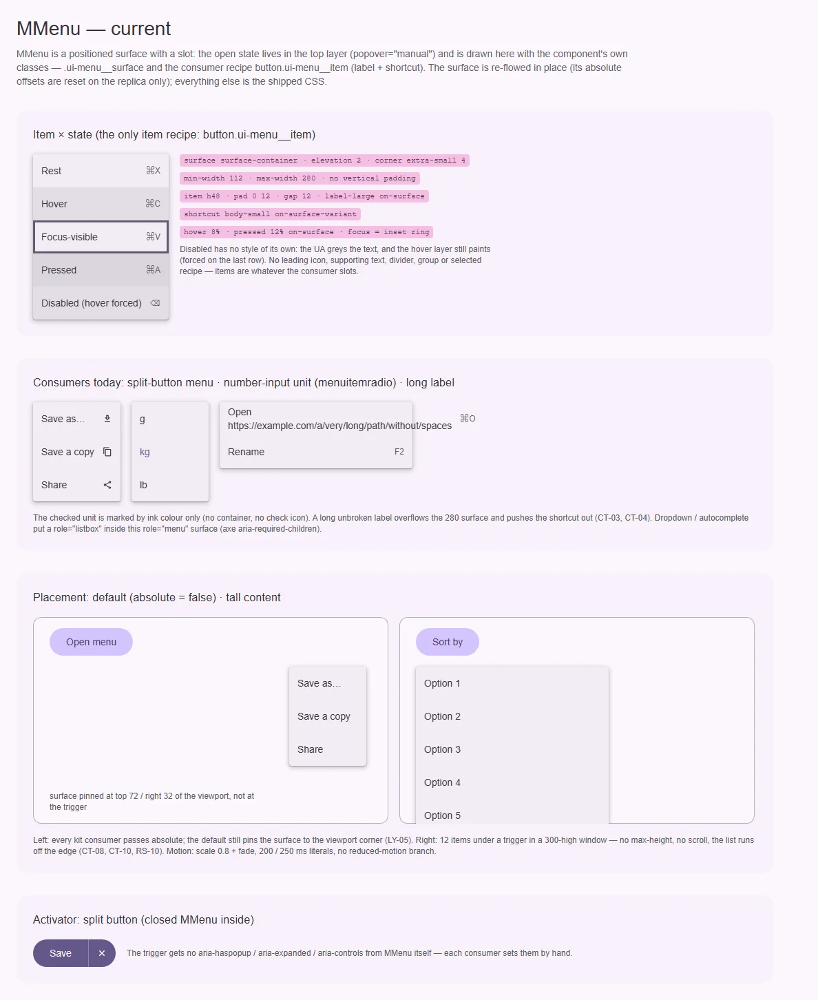
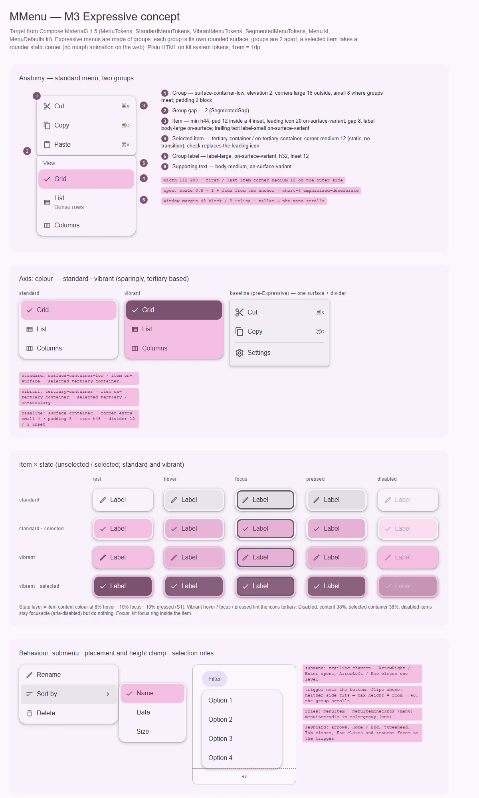

# MMenu — всплывающее меню действий у якоря (M3 Expressive: группы, выбор, vibrant)

<identity>M3: Menus (Expressive: standard / vibrant, группы с разделением, выбираемые пункты; baseline — одна поверхность с разделителями) · Токены Compose: `MenuTokens.kt`, `StandardMenuTokens.kt`, `VibrantMenuTokens.kt`, `SegmentedMenuTokens.kt`; поведение — `Menu.kt` (`DropdownMenu`, `DropdownMenuPopup`, `DropdownMenuGroup`, `DropdownMenuItem`), `MenuDefaults.kt` · Код: `src/runtime/components/ui/menu/`, `src/runtime/composables/menu/useMenu.ts`, `src/runtime/composables/popover/{usePopover,placement}.ts`, токены `src/runtime/assets/stylesheet/components/menu/_index.scss` · Аудит: `data/menu.json` · Тип: public (+ инфраструктура для dropdown, autocomplete, color-input, number-input unit, split button)</identity>

<implementation-status state="planned" updated="2026-10-07">План новый. Позиционирование (CSS anchor + `position-try-fallbacks`, JS flip/shift), top layer и scroll lock сделаны (`overlay-popover-collision_2026-10-01_0300.md`, `overlay-top-layer-vfm-removal_2026-10-01_1200.md`). Шаги 1–3 чинят дефекты и межкомпонентные долги без смены API. Анатомия Expressive (шаг 5) и ломающие изменения (шаги 4, 6) ждут вопросов 1–5.</implementation-status>

## Вердикт

`переработка`. Сегодня `MMenu` — позиционируемая поверхность со слотом, а не меню M3. Пункта у
него нет: есть CSS-рецепт `button.ui-menu__item` (подпись + шорткат), без иконок, supporting text,
групп, разделителей, выбора и disabled. Поверхность — baseline M3 (`surface-container`, угол 4,
тень 2), а Expressive строит меню из групп `surface-container-low` с углами 16/8, зазором 2 и
пунктами, которые при выборе меняют форму и заливаются `tertiary-container`. Режим по умолчанию
(`absolute = false`) прибивает поверхность к углу окна, а не к якорю. Три из пяти потребителей
(dropdown, autocomplete, color-input) вообще не меню, но получают `role="menu"`. Без ломки API не
обойтись: режим по умолчанию, роль поверхности, новый пункт.

## Рендеры

| Сейчас | Концепт M3 |
|---|---|
|  |  |

**Сейчас.** Открытое меню живёт в top layer (`popover="manual"`), поэтому нарисовано классами самого
компонента: `.ui-menu__surface` и потребительский рецепт `button.ui-menu__item`. Абсолютные смещения
сброшены только у реплики, остальное — поставляемый CSS.
1. Пункт × состояние: rest, hover, focus-visible (кольцо внутри), pressed, disabled с
   принудительным hover. У disabled своего вида нет, слой hover на нём рисуется.
2. Реальные потребители: меню split-кнопки (подпись + иконка в конце); единицы `number-input`
   (`menuitemradio`, выбор только цветом текста); длинная подпись без пробелов вылезает за 280 и
   выталкивает шорткат.
3. Позиция по умолчанию — поверхность в углу окна (`top 72 / right 32`), а не у кнопки. 12 пунктов
   под триггером в окне высотой 300 — без ограничения высоты и прокрутки.
4. Активатор: split-кнопка с закрытым `MMenu` внутри.

**Концепт.**
1. Анатомия Expressive standard: две группы, метка группы, выбранный пункт, supporting text,
   6 выносок.
2. Ось цвета: standard, vibrant и для сравнения baseline (одна поверхность + разделитель).
3. Пункт × состояние: standard, standard + selected, vibrant, vibrant + selected × rest / hover /
   focus / pressed / disabled.
4. Поведение: подменю (шеврон), кламп высоты у края окна (запас 48, прокрутка в группе), роли и
   клавиатура.

## Анатомия

Нумерация — по кадру 1 концепта.

| # | Часть M3 | Элемент кита | Статус |
|---|---|---|---|
| — | Popup (прозрачный контейнер групп, scale + fade от якоря) | `.ui-menu` (позиционирующая обёртка) + `.ui-menu__surface` | иначе: одна поверхность, не группы |
| 1 | Group | — | нет; вся поверхность — одна baseline-группа: `surface-container`, `extra-small` 4, без вертикальных отступов |
| 2 | Group gap | — | нет |
| 3 | Item (leading icon, label, trailing icon / text) | CSS `.ui-menu__item`, `__item-label`, `__item-shortcut` | иначе: только подпись и шорткат; иконки потребитель кладёт сам, без размеров; disabled не нарисован |
| 4 | Selected item (контейнер, форма, check) | — | нет; `number-input` красит текст выбранной единицы |
| 5 | Group label | — | нет |
| 6 | Supporting text | — | нет |
| — | Divider | — | нет рецепта |
| — | Submenu (cascading) | — | нет (вне объёма, см. ниже) |
| — | Якорь | скрытый `div.ui-menu-anchor` → `parentElement`, либо проп `anchor` | есть; возврат фокуса игнорирует `anchor` |

## Оси дизайна

| Ось | M3 | Кит сейчас | Цель | Ломает API |
|---|---|---|---|---|
| Структура | Expressive: группы (gap 2, углы 16/8) · baseline: одна поверхность + разделители | одна baseline-поверхность | группы Expressive (вопрос 5); одна группа = меню с углом 16 | да, визуально (угол, тон) |
| Цвет | standard (`surface-container-low`) · vibrant (`tertiary-container`) | один | обе, имя оси — вопрос 4 | нет, добавление |
| Выбор пункта | нет · checkbox (много) · radio (один), форма xs → medium 12 | нет | `selected` + роль пункта (S9) | нет, добавление |
| Состав пункта | leading icon / label / supporting text / trailing icon / trailing text | label + shortcut | полный (`MMenuItem`, вопрос 3) | нет, добавление |
| Привязка | всегда к якорю | `absolute: false` — угол окна; `true` — якорь | только якорь (вопрос 1) | да |
| Размещение | ниже / выше / start / end, логически | `origin: 'top left' \| … \| 'bottom'` → физические `placement` | `placement` с `start` / `end` (алиас `origin`) | да, с алиасом |
| Ширина | 112–280 или по якорю | `matchWidth` | без изменений | нет |

Плотности у меню M3 Expressive нет (Compose различает только precision pointer). Если она
понадобится, это ось кита `density` с тремя ступенями `compact | default | comfortable` (решение
владельца по S5, 2026-10-07), см. «Предложения по UX». В план работ `LY-08` не входит.

## Оси состояний

Из `axes` аудита, сверено с текущим кодом.

| Ось | Нужно | Есть | Не хватает |
|---|---|---|---|
| Базовое | enabled / disabled пункта | disabled исключён из стрелок | вид disabled; hover и pressed на disabled (ST-01, ST-02, ST-04, ST-06) |
| Взаимодействие | hover, pressed | hover в `can-hover`, pressed — `state-opacity()` (IN-01, ST-05 исправлены) | слой на `::before` цветом контента (сейчас фон подменяется) |
| Фокус | roving tabindex, кольцо | roving, `focus-ring(inset)` (`index.vue:372`) | `aria-disabled` пункты должны оставаться в обходе (IN-08) |
| Выбор | checkbox / radio, selected | нет (`number-input` ставит `aria-checked` сам) | `selected` по S9 |
| Раскрытие | open / closed, `aria-expanded` на триггере | open / closed | `aria-haspopup`, `aria-expanded`, `aria-controls` (A11-06) |
| Переполнение | меню выше места прокручивается | нет | LY-05, CT-08, CT-10, RS-10 |
| Навигация, смысловое, валидация, данные | — | — | не применимо |

## Токены: расхождения

Карта — `assets/stylesheet/components/menu/_index.scss`. В `index.vue` пути легаси через дефис
(`'surface-min-width'`, `'item-hover-bg'`), при правке — перевод на точку целиком.

| Часть | M3 (Compose) | Кит сейчас (`файл` / путь `g()`) | Действие |
|---|---|---|---|
| Цвет группы | `StandardMenuTokens.ContainerColor` = `surface-container-low`; vibrant — `tertiary-container`; baseline — `MenuTokens.ContainerColor` = `surface-container` | `surface.bg.color` = `surface-container` (`_index.scss:22`) | → `surface-container-low` (вопрос 5), vibrant (вопрос 4) |
| Форма | одна группа: `SegmentedMenuTokens.ContainerShape` = `large` 16; первая группа large / small, средняя `GroupShape` small 8, последняя small / large; baseline `extra-small` 4 | `surface.border.radius` = `extra-small` | По позиции через `:first-child` / `:last-child`, без JS |
| Зазор между группами | `SegmentedGap` = 2 | — | 2 |
| Вертикальный отступ | группа — 2 (`DropdownMenuGroupVerticalPadding`); baseline — 8 (`DropdownMenuVerticalPadding`) | 0 | 2 в группе |
| Высота пункта | `SegmentedMenuTokens.Item` = 44 (выбираемые); baseline 48 | `item.min.height: 48rem` | 44 |
| Отступы пункта | 12 по строке (`DropdownMenuItemHorizontalPadding`) внутри вставки 4 (`DropdownMenuSelectableItemPadding`); 12 по блоку | `item.padding: 0 12rem` | 12 + вставка 4 |
| Иконка → текст | 8 (`dropdownMenuIconTextPadding`) | `item.gap: 12rem` | 8 |
| Иконки | 20 (`ItemLeadingIconSize`, `ItemTrailingIconSize`), `on-surface-variant` | рецепта нет | 20 |
| Подпись | `ItemLabelTextFont` = `body-large`, `on-surface` (реализация Compose пока `labelLarge` с TODO «replace with token») | `item.text.type` = `label-large` | → `body-large` по токену |
| Supporting text | `body-medium`, `on-surface-variant` | — | добавить |
| Trailing text (шорткат) | `ItemTrailingSupportingTextFont` = `label-small`, `on-surface-variant` | `item.shortcut.type` = `body-small` | → `label-small` |
| Метка группы | `label-large`, min 32, отступ 12 / 4 (`MenuDefaults.Label`) | — | добавить |
| Разделитель | `HorizontalDividerPadding` 12 / 2, `outline-variant` | — | рецепт с `MDivider` |
| Форма пункта | `ItemShape` = `extra-small` 4; первый — medium сверху, последний — medium снизу; `ItemSelectedShape` = medium 12 | прямоугольник | по позиции; selected — статичная форма medium 12 без анимации перехода (морф S3 отклонён владельцем 2026-10-07) |
| Selected | standard: `tertiary-container` / `on-tertiary-container`; vibrant: `tertiary` / `on-tertiary`; check вместо ведущей иконки | — | ветка `selected` (S9) |
| Disabled | контент 0.38; selected-контейнер 0.38 | — | `item.disabled.*` (TK-06) |
| Hover / focus / pressed | слой цвета контента 8 / 10 / 10 (S1); у vibrant иконки → `tertiary` | `item.hover.bg` / `item.active.bg` = `on-surface` 8 / 12 % подменой фона | слой на `::before` |
| Фокус | `FocusIndicatorColor` = `secondary` | `focus-ring(inset)` | совпадает |
| Анимация | scale 0.8 → 1 (`ClosedScaleTarget`, FastSpatial) + alpha (FastEffects) | scale 0.8 + fade, `200ms` / `250ms` `cubic-bezier(0.2, 0, 0, 1)` литералами (`index.vue:354`, TK-04, MO-05) | `--sys-motion-duration-short-4` + `emphasized-decelerate` на вход, `short-3` + `emphasized-accelerate` на выход; пружин нет (S4 отклонён); reduced motion — только fade (A11-18) |
| Отступ от окна | `MenuVerticalMargin` 48, `MenuHorizontalMargin` 8 | `usePopover` margin 8 по обеим осям | 48 по блоку, 8 по строке |
| Позиция без якоря | — | `surface.top: 72rem`, `surface.right: 32rem` (`_index.scss:10-11`) | удалить (вопрос 1) |

Совпадает: ширина 112–280, тень `elevation(2)` (`MenuTokens.ContainerElevation = Level2`).

## Поведение и доступность

**Межкомпонентные долги** (`qa-fix-showcase-fields_2026-10-07_0100.md`, «Межкомпонентные долги»):

1. **`role="menu"` вокруг listbox.** `MMenu` всегда ставит `role="menu"` на поверхность
   (`index.vue:43`). Dropdown и autocomplete кладут внутрь `role="listbox"`, и axe падает на
   `aria-required-children` (A11-01). Color-input хуже: его кнопки палитры попадают под селектор
   `'[role="menuitem"], button'` (`index.vue:120`) и становятся `menuitem` с roving tabindex.
   Решение — вопрос 2.
2. **Слушатели document, пока меню закрыто (EN-10).** `useClickOutside($menu, …)`
   (`index.vue:242`) вешает `pointerdown` / `pointerup` при монтировании. Сто закрытых меню — двести
   обработчиков на каждый клик. Нужно `pause()` при закрытии и `resume()` в `watch(modelValue)`:
   `useClickOutside` уже это умеет.
3. **Возврат фокуса.** `getTriggerEl` берёт `anchorRef.parentElement` (`index.vue:140`) и
   игнорирует проп `anchor`. Но `anchor` — элемент позиционирования (у dropdown это коробка поля),
   и фокусировать его тоже нельзя. Правильно запоминать `document.activeElement` в момент открытия
   (как `useFocusTrap.rememberFocus`) и возвращать фокус туда, а запасной путь —
   `anchorEl` → `parentElement`.
4. **RTL, перемер и кламп высоты (LY-05, RS-10).** Решение в `decisions.md`: «Кламп панели по
   реально доступному месту — работа `<MMenu>`». План:
   - `placementToArea` (`placement.ts:80`) возвращает физические `span-right` / `span-left`. Нужны
     `span-inline-end` / `span-inline-start` и логические `start` / `end` в `PopoverPlacement`. В
     JS-пути направление берётся из `getComputedStyle(anchor).direction`;
   - нативный путь: `max-block-size: 100%` от области `position-area` вместе с
     `position-try-order: most-height`. Браузер сначала выбирает сторону с наибольшей высотой, потом
     ужимает, а не наоборот: именно это сломало первую попытку (сжатие вместо переворота);
   - JS-путь: если не помещается ни снизу, ни сверху, выбрать сторону с большим местом и отдать
     `max-block-size` = место − 48 живой геометрией (`--m-menu-max-block-size`, `craft.md` §10);
   - перемер: `ResizeObserver` на поверхности, пока меню открыто (контент меню меняется: фильтр
     autocomplete, асинхронные пункты);
   - прокручивается группа (`overflow-y: auto`, `overscroll-behavior: contain`), а не
     позиционирующая обёртка. Токен `max-block-size` остаётся запасным, как у dropdown
     (`--m-dropdown-panel-max-height`, `decisions.md`). Те же правки получает тултип через
     `usePopover`.
5. **`z-index: 999` в JS (LY-06).** `Z_INDEX = '999'` (`useMenu.ts:50`) и `DEFAULT_Z_INDEX`
   (`usePopover.ts:97`) — вне шкалы. В top layer z-index не нужен (`craft.md` §12), а без Popover API
   его уже перекрывает `ticket.zIndex` (`index.vue:30`). Литералы удалить; запасной путь — ключ
   шкалы `z()` (`overlay-host`). База `useStack` (2000) уходит туда же.
6. **Меню, открытое до монтирования телепорта, невидимо** (находка агента кнопок, 2026-10-07).
   `showInTopLayer` висит на `@enter` у `<transition>` без `appear` (`index.vue:18-20`). Если
   `v-model` уже `true` при монтировании `<client-only>`, `showPopover()` не вызывается, и
   `[popover]` остаётся `display: none`. Починка: `appear` у перехода (enter-хук сработает и на
   первом рендере) либо явный `showPopover()` после монтирования телепорта, когда open уже `true`.
   Нужна unit-спека «смонтирован открытым → `:popover-open`».

**Клавиатура и ARIA (APG Menu Button + Menu).**
- Триггер: `aria-haspopup="menu"`, `aria-expanded`, `aria-controls` = id поверхности (A11-06).
  Enter, Space и ArrowDown открывают и ставят фокус на первый пункт, ArrowUp — на последний. Сейчас
  триггер размечает каждый потребитель руками (split-кнопка, unit), а dropdown — своим
  `useDropdownControl`.
- Имя меню: `aria-labelledby` = id триггера (A11-02). `aria-*` и `id` потребителя уходят на элемент
  с ролью, а `class` и `style` — на обёртку (EN-04).
- Внутри: стрелки по кругу, Home / End, typeahead по первой букве — переиспользовать
  `composables/dropdown/useTypeahead.ts`, третий механизм не заводить. Esc закрывает и возвращает
  фокус. Tab закрывает без возврата: фокус идёт дальше по странице. Сейчас Tab заперт
  `useFocusTrap` (`index.vue:158`), и спека `traps Tab inside the open menu…`
  (`index.spec.ts:132`) закрепляет это поведение. По `craft.md` §9 это тест на баг, его
  переписывают.
- Пункты-ссылки `a[href]` входят в обход (A11-08). `aria-disabled` пункты остаются в обходе, но
  не активируются (IN-08, APG допускает). `[disabled]` выпадает.
- Выбор: `menuitemcheckbox` (не закрывает меню), `menuitemradio` внутри `role="group"` (закрывает).
  `aria-checked` ставит пункт, а не потребитель.
- По `behavior.md` поведение уходит в control-композабл `useMenuControl` (`triggerAttrs`,
  `menuAttrs`, `getItemAttrs`), без классов и `data-*`. Компонент — его потребитель. Сегодняшний
  `prepareMenuItems`, который сам раздаёт `role` и `tabIndex` найденным `button`, исчезает вместе с
  рецептом.

**Прочее из аудита.**
- CT-03, CT-04: `min-width: 0` и `overflow-wrap: anywhere` у подписи.
- LY-10: `text-align: left` (`index.vue:309`) → `start`; `right` у поверхности уходит вместе с
  режимом без якоря.
- RS-09: запас от края окна с `env(safe-area-inset-*)` в JS-клампе.
- Forced colors: рамка `CanvasText` у поверхности есть (`index.vue:289`). Selected и disabled
  пункты получают `Highlight` / `GrayText`.

**Вне объёма.** Подменю (cascading) — в концепте показано, но заказчика в ките нет (В4). Записать в
`decisions.md` с условием возврата: «появится меню действий с вложенной группой».
Морф формы группы при уходе указателя (`inactiveShape`) не делаем: анимации морфа в вебе отклонены владельцем (S3, 2026-10-07).

## API

| Действие | Что | Ломает | Миграция |
|---|---|---|---|
| Убрать | режим без якоря (`absolute: false`), токены `surface.top` / `surface.right` | да | Вопрос 1: `absolute` на один minor — no-op с dev-предупреждением, все внутренние потребители уже передают `absolute` |
| Переименовать | `origin` → `placement: PopoverPlacement` с логическими `start` / `end` | да | Алиас `origin` с dev-предупреждением на один minor |
| Добавить | слот `#activator="{ props, isOpen }"` с `triggerAttrs` (как у `MOverlay`) | нет | Старый путь «родитель — триггер» остаётся |
| Добавить | `MMenuItem`: `label` / слот, `supportingText`, `leadingIcon`, `trailingIcon`, `trailingText`, `selected`, `role: 'menuitem' \| 'menuitemcheckbox' \| 'menuitemradio'`, `disabled`, `to`; событие `select` | нет | Вопрос 3 |
| Добавить | `MMenuGroup`: `label` → `role="group"` + `aria-labelledby` | нет | Вопрос 5 |
| Добавить | ось цвета standard / vibrant | нет | Вопрос 4 |
| Изменить | роль поверхности — вопрос 2 | да для dropdown, autocomplete, color-input (внутренние) | Внутренние потребители переводятся в том же PR |
| Устареть | CSS-рецепт `button.ui-menu__item` | нет сразу | Работает один minor; split-кнопка и unit переходят на `MMenuItem` |
| Не трогать | `closeOnBackdrop`, `lockScroll`, `matchWidth`, `anchor`, `click-outside` | — | `closeOnBackdrop` оставлен как есть решением `overlay-top-layer.md` |

## План работ

1. **S — дефекты без смены API.** Долги 2, 3, 5, 6. Disabled пункта (вид, без hover и pressed,
   `cursor: default`). CT-03, CT-04, LY-10. Длительности на токенах и reduced motion. Файлы:
   `components/ui/menu/index.vue`, `assets/stylesheet/components/menu/_index.scss`,
   `composables/menu/useMenu.ts`, `composables/popover/usePopover.ts`, `composables/useStack.ts`.
2. **M — размещение и кламп.** Долг 4: логические `start` / `end`, RTL, `position-try-order`,
   JS-кламп с запасом 48 / 8 и safe area, `ResizeObserver`, прокрутка группы, `--ui-menu-origin`
   после переворота. Зависимости: `decisions.md` (кламп — работа MMenu); сверить с dropdown
   (`--m-dropdown-panel-max-height`). Задевает тултип. Файлы: `composables/popover/placement.ts`,
   `placement.spec.ts`, `usePopover.ts`, `menu/index.vue`.
3. **M — клавиатура и ARIA.** `useMenuControl` с бэгами, `#activator`, имя через триггер, typeahead
   (`useTypeahead`), Tab закрывает, `a[href]`, `aria-disabled` в обходе, разделение `$attrs`
   (EN-04). Переписать спеку про запертый Tab. Зависимости: шаг 1. Файлы:
   `composables/menu/useMenuControl.ts` (+ `.spec.ts` на анонимной разметке), `menu/index.vue`.
4. **M — роль поверхности.** Долг 1, по вопросу 2. Перевести dropdown, autocomplete и color-input,
   axe-тесты dropdown и autocomplete должны пройти без исключений. Зависимости: шаги 1–3. Файлы: по
   вопросу 2, `dropdown/index.vue`, `autocomplete/index.vue`, `color-input/index.vue`.
5. **L — анатомия Expressive.** `MMenuItem`, `MMenuGroup`, рецепт разделителя. Токены групп и
   пунктов, форма по позиции, статичная форма selected (S9; без морфа — S3 отклонён), disabled, vibrant (вопрос 4). Перевести
   split-кнопку и `number-input/unit.vue` (выбор единицы — `menuitemradio` с check). Зависимости:
   вопросы 3–5; S1, S9. Файлы: `components/ui/menu/{item,group}/`, `menu/_index.scss`,
   `button/split/index.vue`, `number-input/unit.vue`.
6. **S — режим без якоря и `placement`.** По вопросу 1: удалить ветку `!absolute` (`index.vue:33-38`,
   `useMenu.ts:78`), алиасы `absolute` и `origin`. Файлы: `menu/props.ts`, `menu/types.ts`,
   `menu/index.vue`, `useMenu.ts`.
7. **M — документация (DC-01…05).** Когда меню, а когда dropdown (меню — действия, выбор значения —
   `MDropdown` / `MAutocomplete`). Анатомия и токены, пропы, клавиатура, переворот и кламп, top
   layer внутри модалки.

## Тесты

- **Фикстуры** `playground/fixtures/menu/`:
  - `matrix.vue`: standard / vibrant × пункт {иконки, supporting, шорткат} × {rest, disabled,
    selected, selected + disabled} × группы {1, 2, 3} × роли (menuitem / checkbox / radio);
  - `stress.vue`: 40 пунктов, длинное слово, триггер в каждом углу окна, окно 360 × 350, RTL,
    меню внутри открытого `MDialog`, меню, смонтированное открытым (долг 6).
- **e2e** (`menu.e2e.ts`, Playwright + axe):
  - axe на открытом меню и на dropdown / autocomplete (без `aria-required-children`);
  - вся клавиатура APG, включая typeahead и Tab;
  - фокус возвращается на триггер, в том числе у dropdown с `anchor`;
  - у нижнего края меню переворачивается, при нехватке места прокручивается;
  - RTL: `start` открывается справа;
  - forced colors; reduced motion.
- **Unit**:
  - `useMenuControl`: бэги на анонимной разметке без `class` и `data-*`;
  - `placement.spec.ts`: логические стороны в RTL, кламп высоты;
  - `menu/index.spec.ts`: слушатели только у открытого меню, смонтированное открытым меню
    показано, z-index без литерала;
  - `MMenuItem`: роли и `aria-checked`, `select`, `aria-disabled` не активирует.

## Готово, когда

- Меню всегда стоит у якоря, переворачивается и ограничивает высоту по месту, в RTL зеркалится.
- axe чистый на меню, dropdown, autocomplete и color-input.
- Клавиатура по APG; фокус возвращается туда, откуда меню открыли.
- Пункт с иконками, supporting text, выбором и disabled нарисован токенами Expressive, standard и
  vibrant.
- Закрытое меню не держит слушателей document; литералов z-index нет.
- Линтеры и e2e зелёные; SFC не длиннее 400 строк.

## Предложения по UX

Расширения сверх паритета с M3. Это предложения владельцу, а не шаги плана: в «План работ» попадают
только после решения. Без новых зависимостей, переходы — на `--sys-motion-*`. Общие для всех слоёв
предложения уже записаны в [overlay.md](overlay.md) («Предложения по UX»: кнопка
«назад» браузера закрывает слой `closeOnBack`, `beforeClose`-защита от потери ввода, `inert` фона) и
здесь не повторяются.

| Предложение | Что получает пользователь | Заказчик | Цена | Рекомендация |
|---|---|---|---|---|
| `density: 'compact' \| 'default' \| 'comfortable'` у пунктов (ось кита, S5; высоты, например, 32 / 44 / 52 — подобрать по шкале полей) | Плотные десктопные интерфейсы получают меню в ритме своих полей и строк; на таче — крупнее | меню в тулбарах и таблицах, split-кнопка рядом с `compact`-полями | M · ветка токенов на три ступени · API: проп, наследуется от `MMenu` к пунктам через контекст | позже, с первым плотным заказчиком |
| Шорткат пункта из одного источника: `MMenuItem hotkey="mod+c"` рисует `⌘C` на macOS и `Ctrl+C` на остальных через `composables/hotkey/format.ts` (`buildDisplayKeys`, `buildAriaLabel`) | Подсказка всегда верна для платформы, скринридер читает её словами | редакторы, контекстные действия таблиц | S · переиспользование `hotkey`, без регистрации глобальных сочетаний · API: проп пункта | да, вместе с `MMenuItem` |
| Контекстное меню у точки: якорем служит точка указателя (виртуальный rect для `usePopover`), открытие по `contextmenu`, `Shift+F10` и клавише ContextMenu | Действия над строкой таблицы или файлом — там, где пользователь кликнул, и с клавиатуры тоже | `MTable` (действия строки), списки | M · виртуальный якорь в `usePopover`, клавиатура в `useMenuControl` · API: `anchor` принимает точку или проп `trigger` | да, когда у таблицы появятся действия строки |

## Открытые вопросы

**1. Режим без якоря (`absolute: false`).**
1. Удалить: меню всегда у якоря, `absolute` — no-op с dev-предупреждением на один minor. Цена:
   внешний потребитель, который полагался на угол окна, увидит меню у триггера. Внутри кита таких
   нет.
2. Оставить режим, но сменить дефолт на `absolute: true`. Цена: остаются мёртвые токены
   `top 72 / right 32` и вторая ветка разметки с собственным backdrop.
3. Оставить как есть. Цена: LY-05 остаётся, дефолт неверен.

Рекомендация: 1.

**2. Как развести меню и всплывающую панель (долг 1).**
1. Проп роли поверхности у `MMenu` (`'menu' | 'none'`): dropdown, autocomplete и color-input
   передают `none`, а внутренняя роль у них своя. Цена: минимальный diff, но «меню», которое не меню,
   остаётся в API.
2. Вынести позиционирование и top layer во внутренний примитив (`components/fragments/popover/`
   поверх `usePopover`), а `MMenu` оставить только меню (роль, пункты, клавиатура). Dropdown,
   autocomplete и color-input переходят на примитив. Цена: L-работа и новый внутренний компонент;
   зато одна ответственность на компонент и чистый axe.
3. Расширить эвристику `hostsForeignWidget` (`index.vue:113`), чтобы она снимала роль сама. Цена:
   поведение по содержимому слота, color-input её не пройдёт (его кнопки не listbox).

Рекомендация: 2. Не-меню уже три из пяти потребителей; вариант 1 подойдёт как промежуточный шаг,
если axe нужен раньше.

**3. Чем рисовать пункт.**
1. Новый `MMenuItem` со своими токенами и `MMenuGroup`. Цена: ещё одна реализация строки рядом с
   `MListItem`.
2. Обработка «меню» у `MListItem`. Цена: строка списка получает ветку ради одного потребителя, а
   выбор в списке (`primary-container`) и в меню (`tertiary-container`) окрашен разными ролями.
3. Оставить CSS-рецепт `.ui-menu__item` и описать его в документации. Цена: роли, `aria-checked` и
   disabled снова на совести потребителя.

Рекомендация: 1. Тот же размен выбран в navigation-drawer.md (вопрос 2).

**4. Как назвать ось standard / vibrant.**
1. `variant: Extract<MVariant, 'elevated' | 'tonal'>`: `elevated` = standard, `tonal` = vibrant
   (`tertiary-container`). Цена: у vibrant есть тень, а у `tonal`-кнопки нет, так что соответствие
   неточное.
2. `color: MColor` (по умолчанию нет): контейнер группы — `<color>-container`, выбор — `<color>`.
   M3 определяет только tertiary, остальные роли кит выведет сам. Цена: варианты без M3-эталона.
3. Новое слово (`tone: 'standard' | 'vibrant'`). Цена: противоречит правилу «одно слово — один
   смысл» (`axes.md`).

Рекомендация: 1. Оба слова уже в каноническом `MVariant`, и `elevated` — ровно
`surface-container-low` с тенью, как у standard-меню.

**5. Expressive-группы или baseline по умолчанию.**
1. Expressive: меню — это группы. Без `MMenuGroup` слот = одна группа с углом 16 на
   `surface-container-low`. Цена: видимое изменение всех меню кита (угол 4 → 16, тон).
2. Baseline по умолчанию, группы по желанию. Цена: две визуальные системы в одном компоненте.
3. Только baseline. Цена: кит отстаёт от M3 Expressive.

Рекомендация: 1. Кит наследует редакцию Expressive (`common.md`). Оговорка: сегодня dropdown и
autocomplete рисуют панель внутри `.ui-menu__surface` (фон, угол и тень — от меню, строки — от
`dropdown/_panel.scss`), поэтому смена задела бы и их. С вариантом 2 вопроса 2 у панели свой
примитив и свои токены, и она меняется отдельно, по [dropdown.md](../inputs/dropdown.md).
