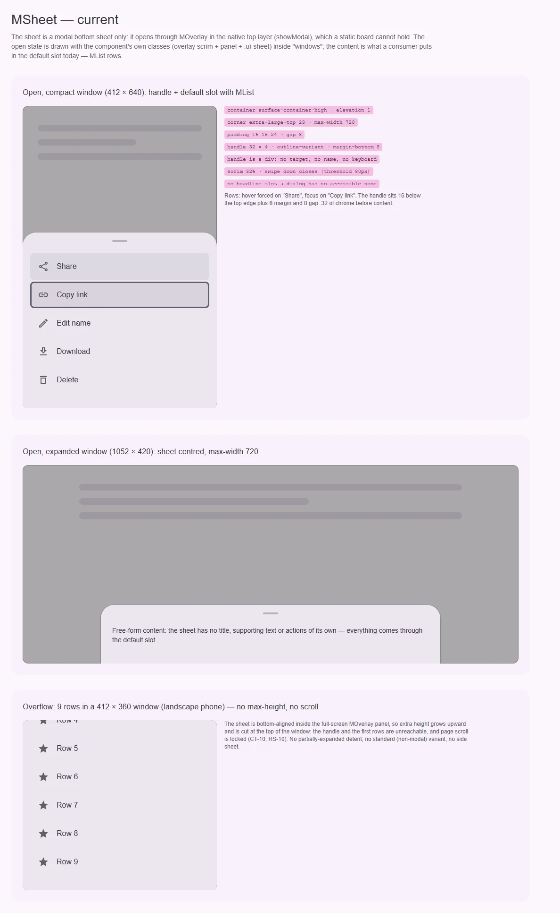
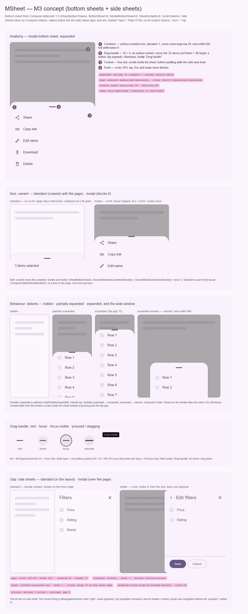

# MSheet — модальный нижний лист (bottom sheet); side sheet — gap

<identity>M3: Bottom sheets (standard · modal, drag handle) и Side sheets (standard · modal) · Токены Compose: `SheetBottomTokens.kt`, `ScrimTokens.kt`, `DragHandleTokens.kt` (только для сравнения, см. ниже); поведение — `BottomSheet.kt`, `ModalBottomSheet.kt`, `SheetDefaults.kt` (`BottomSheetDefaults`, `SheetValue`). У side sheets токенов в Compose 1.5 нет · Код: `src/runtime/components/ui/sheet/`, токены `src/runtime/assets/stylesheet/components/sheet/_index.scss`, слой — `components/ui/overlay/` · Аудит: `data/sheet.json` · Тип: public</identity>

<implementation-status state="planned" updated="2026-10-07">План новый. Лист стоит на `MOverlay` (нативный `<dialog>`, inert, scroll lock, свайп вниз), поэтому модальная механика уже есть. Шаги 1–5 не ломают API и могут идти сразу; side sheet и стандартный вариант ждут вопросов 1–2.</implementation-status>

## Вердикт

`дрейф` для нижнего листа и `нет в ките` для side sheet. Модальный нижний лист узнаётся как M3:
скругление 28 сверху, ручка 32 × 4, scrim 32 %, тень 1, свайп вниз закрывает. Разошлись роли и
размеры: контейнер `surface-container-high` вместо `-low`, ручка `outline-variant` вместо
`on-surface-variant`, ширина 720 вместо 640. Главные дефекты — поведенческие: у листа нет
предельной высоты и прокрутки, поэтому высокий контент уезжает за верх экрана; ручка — немой `div`
без цели, имени и клавиатуры; у диалога нет доступного имени. Стандартного (немодального) варианта,
промежуточной высоты (partially expanded) и боковых листов в ките нет.

## Рендеры

| Сейчас | Концепт M3 |
|---|---|
|  |  |

**Сейчас.** Лист открывается через `showModal()` в top layer, статично его не снять. Поэтому
открытое состояние собрано из классов самого компонента: `.ui-overlay__scrim`,
`.ui-overlay__panel` и `.ui-sheet`. Стили грузит закрытый экземпляр `MSheet` на той же доске.
1. Компактное окно 412 × 640, в слоте `MList`. Hover принудительно на «Share», focus-visible — на
   «Copy link». Выноски с текущими токенами. До контента 32 служебных пикселя: 16 отступа,
   4 ручки, 8 margin и 8 gap.
2. Широкое окно 1052 × 420: лист по центру, `max-width: 720`. Своих заголовка и действий у листа
   нет, всё приходит через слот.
3. Переполнение: девять строк в окне 412 × 360. Лист прижат к низу панели `MOverlay` и растёт
   вверх, ручка и первые строки уходят за край, прокрутки нет (CT-10, RS-10).

**Концепт.**
1. Анатомия модального нижнего листа в развёрнутом состоянии: 4 части с выносками.
2. Ось варианта: standard (без scrim, страница живая, сворачивается до peek 56) и modal.
3. Поведение: высоты hidden, partially expanded и expanded (зазор сверху 72) плюс широкое окно,
   где лист стоит по центру и не шире 640.
4. Ручка как кнопка: rest, hover, focus-visible, pressed/dragging и тултип «Drag handle».
5. Gap: side sheets — standard (в раскладке, разделитель на внутреннем крае) и modal (scrim,
   выезд с конца строки, кнопка «назад» по желанию, футер действий).

## Анатомия

Нумерация — по кадру 1 концепта.

| # | Часть M3 | Элемент кита | Статус |
|---|---|---|---|
| 1 | Container | `.ui-sheet` (`index.vue:50`) | иначе: `surface-container-high`, ширина 720, `overflow: hidden` режет кольца фокуса (IN-05) |
| 2 | Drag handle | `.ui-sheet__drag-handle` (`index.vue:75`) | иначе: `div` 32 × 4 `outline-variant`, не цель, без имени и клавиатуры; отступы 16 + 8 + 8 вместо зоны 48 |
| 3 | Content | `.ui-sheet__content` + слот по умолчанию | есть; не прокручивается, нет `safe-area` снизу (RS-09) |
| 4 | Scrim | `.ui-overlay__scrim` (`MOverlay`) | есть, 32 % |
| — | Заголовок / имя листа | — | нет: ни слота, ни `aria-labelledby` (A11-02) |
| — | Standard bottom sheet (в раскладке, peek 56) | — | нет |
| — | Partially expanded | — | нет |
| — | Side sheet (standard / modal): заголовок, «назад», закрыть, контент, футер действий | — | нет (см. раздел «Gap: side sheets») |

## Оси дизайна

| Ось | M3 | Кит сейчас | Цель | Ломает API |
|---|---|---|---|---|
| Край | bottom · side (end) | только bottom | bottom + side sheet, вопрос 1 | нет, добавление |
| Модальность | standard · modal | только modal (`mode="modal"` зашит, `index.vue:6`) | modal; standard — вопрос 2 | нет |
| Высоты (detents) | hidden · partially expanded · expanded (`SheetValue`), `skipPartiallyExpanded` | hidden · expanded | hidden · expanded; partially — вопрос 3 | нет |
| Ручка | опциональна (`dragHandle = null` убирает) | всегда | рисуется, когда жест возможен, вопрос 4 | нет |
| Ширина | `SheetMaxWidth = 640`, на всю ширину ниже | 720 | 640 | нет (визуально) |

Осей цвета и размера у листа нет и не будет: поверхность одна, масштаб задаёт контент.

## Оси состояний

Из `axes` аудита, сверено с кодом.

| Ось | Нужно | Есть | Не хватает |
|---|---|---|---|
| Базовое | open / hidden, persistent | open / hidden, `persistent` (`MOverlay`) | — |
| Взаимодействие | ручка: hover, pressed, dragged; лист: dragged | dragged у листа (`swipeStyle`) | вся ручка: она не интерактивна |
| Фокус | внутрь при открытии, возврат на активатор, кольцо на ручке | трап `MOverlay` | начальный и возвратный фокус (A11-12 → [overlay.md](overlay.md), шаг 1); кольцо ручки |
| Раскрытие | hidden ↔ (partially) expanded | open / closed | partially expanded — вопрос 3 |
| Переполнение | контент выше окна прокручивается внутри листа | нет | CT-10, RS-08, RS-10 |
| Выбор, навигация, смысловое, валидация, данные | — | — | не применимо |

## Токены: расхождения

Карта — `assets/stylesheet/components/sheet/_index.scss`. Все пути `g()` в `index.vue` легаси
через дефис (`'drag-handle-margin-bottom'`, `'motion-enter-duration'`): при правке файл переводится
на точку целиком.

| Часть | M3 (Compose) | Кит сейчас (`файл` / путь `g()`) | Действие |
|---|---|---|---|
| Цвет контейнера | `SheetBottomTokens.DockedContainerColor` = `surface-container-low` | `bg.color` = `surface-container-high` (`_index.scss:19`) | → `surface-container-low`. Визуальное изменение: лист станет светлее |
| Максимальная ширина | `BottomSheetDefaults.SheetMaxWidth` = 640 | `max.width: 720rem` (`_index.scss:10`) | → 640 |
| Цвет ручки | `DockedDragHandleColor` = `on-surface-variant` | `drag.handle.color` = `outline-variant` (`_index.scss:31`) | → `on-surface-variant` |
| Скругление ручки | `MaterialTheme.shapes.extraLarge` (на высоте 4 = полная пилюля) | `drag.handle.radius: 999rem` (TK-02) | → `var(--sys-shape-corner-full)` |
| Зона ручки | `DragHandleVerticalPadding` = 22 сверху и снизу → цель 48 | `container.padding` 16 сверху + `drag.handle.margin.bottom` 8 + `container.gap` 8 | Одна зона `handle.target: 48rem` (22 / 4 / 22), без margin и gap |
| Отступы контента | своих нет, контент задаёт их сам | `container.padding: 16 16 24`, `content.gap: 16` | Боковые 16 и нижние 24 оставить (решение кита, потребители на них рассчитаны), снизу добавить `env(safe-area-inset-bottom)` |
| Зазор сверху в развёрнутом виде | верхний inset окна (`modalWindowInsets`) | нет, высота не ограничена | Токен `top.gap: 72rem` (значение из аудита CT-10; на вебе нет status bar) и `max-block-size: calc(100dvh - top.gap)` |
| Индикатор фокуса | `FocusIndicatorColor` = `secondary` | — | Общий `@include focus-ring` на ручке |
| Пороги жеста | `PositionalThreshold` 56, `VelocityThreshold` 125 | `swipeThreshold: 80` (px, `overlay/props.ts`), скорости нет | 56 + учёт скорости в `useOverlaySwipe` (шаг 6) |
| Движение | показ — spatial-пружина, скрытие — effects (Expressive) | `medium-4` + `emphasized-decelerate` / `short-4` + `emphasized-accelerate` | Оставить на `--sys-motion-*`: пружины в вебе не вводим (S4 отклонён владельцем 2026-10-07) |

Совпадает: форма `extra-large-top` 28, тень `elevation(1)`
(`DockedModalContainerElevation = DockedStandardContainerElevation = Level1`), scrim 32 %
(`ScrimTokens`).

`DragHandleTokens` (4 × 48, pressed 12 × 52, цвет `outline`) — это вертикальная ручка
разделителя панелей (`VerticalDragHandle`, adaptive-раскладки), а не ручка листа. Для листа
источник — `SheetBottomTokens.DockedDragHandle*`. Из `DragHandleTokens` берётся только идея
состояний pressed/dragged (ручка темнеет до `on-surface`), см. кадр 4 концепта.

## Поведение и доступность

- **Ручка — кнопка.** В Compose ручка кликабельна: в развёрнутом листе тап закрывает, в
  partially expanded — разворачивает. У неё тултип «Drag handle» и семантические действия
  expand / collapse / dismiss. В ките: `<button type="button">` 48 × 48 со слоем состояния и
  кольцом фокуса. Enter и Space делают то же, что тап. Имя берётся из `MESSAGES.sheetDragHandle`
  с пропом `dragHandleLabel` по образцу `MESSAGES` (`shared/constants/messages.ts`). Тултип —
  существующий `MTooltip`.
- **Имя листа (A11-02).** `aria-label` и `aria-labelledby` уже проходят через `$attrs` до
  `<dialog>`: корень `MSheet` — это `MOverlay`, а он делает `v-bind="$attrs"` на корень. Нужны
  документация и предупреждение в dev, если имени нет. Английского имени по умолчанию не
  поставляем, прецедент — `<MOtpInput>` (`craft.md` §6).
- **Фокус (A11-12).** Начальный фокус и возврат на активатор чинятся в `MOverlay`,
  [overlay.md](overlay.md), шаг 1. Здесь только проверка в e2e.
- **Переполнение (CT-10, RS-08, RS-10).** Лист получает `max-block-size: calc(100dvh - top.gap)`.
  Ручка — `flex: none`. Прокручивается `__content`: `overflow-y: auto`,
  `overscroll-behavior: contain`, `min-block-size: 0`. Скроллбар со вставкой по радиусу
  (`--ui-scrollbar-inset-block`, `craft.md` §11). Прокрутка панели самого `MOverlay` из
  overlay.md, шаг 3, остаётся запасной сеткой.
- **Свайп и прокрутка.** Как только `__content` прокручивается, жест вниз внутри него должен сначала
  прокручивать контент и закрывать лист, только когда контент уже у начала. Это поведение M3
  (`ConsumeSwipeWithinBottomSheetBounds…` в `SheetDefaults.kt`). Сейчас `useOverlaySwipe` ловит жест
  на всей панели. Правило: старт свайпа на ручке — всегда закрытие; внутри контента — только при
  `scrollTop === 0`.
- **Кольца фокуса (IN-05).** `overflow: hidden` на `.ui-sheet` убрать: углы держит
  `border-radius`. Прокручиваемый `__content` по-прежнему режет внешние кольца строк во всю ширину,
  поэтому в документации требуется `focus-ring(inset)` у таких строк. `MListItem` уже рисует
  кольцо внутри.
- **Safe area (RS-09).** `padding-block-end: calc(24rem + env(safe-area-inset-bottom))`,
  `padding-inline` с `safe-area-inset-left/right`.
- **Движение (A11-18).** Сейчас под reduced motion лист всё равно едет на всю высоту. По правилу
  кита reduced motion сокращает, а не выключает: сдвиг заменяется на короткий fade, scrim как в
  `MOverlay`.
- **Forced colors (TH-04).** Рамка `CanvasText` у листа уже есть (`index.vue:64`). Ручка рисуется
  фоном и в forced colors пропадает: `background: CanvasText` + `forced-color-adjust: none`, а
  фокус ручки — `Highlight`.
- **Логические свойства (LY-10).** `margin-bottom` у ручки уходит вместе с margin, остальное — на
  `*-block-*` / `*-inline-*`.
- **События (EN-02).** `cancel` и `confirm` объявлены (`index.vue:31`), но не эмитятся. Решение —
  мост из [modals.md](modals.md) («component-contract»): `cancel` при пользовательском закрытии
  (Esc, scrim, свайп, ручка), `confirm(payload)` — из слота через scoped-проп `confirm`. Причину
  закрытия должен сообщать `MOverlay`; это зависимость от overlay.md и modals.md.
- **Деприкации (EN-11).** `clickToClose` / `escToClose` — алиасы в общем `mModalLayerProps`,
  overlay.md, шаг 4. Здесь отдельной работы нет.

## API

| Действие | Что | Ломает | Миграция |
|---|---|---|---|
| Добавить | `dragHandleLabel: string` (по умолчанию `MESSAGES.sheetDragHandle`) | нет | — |
| Добавить | scoped-пропы слота по умолчанию: `close()`, `confirm(payload)` (мост modals.md) | нет | — |
| Добавить | dev-предупреждение без `aria-label` / `aria-labelledby` | нет | — |
| Изменить | `cancel` / `confirm` начинают эмититься (сейчас мёртвые) | нет | — |
| Изменить | ручка рисуется по правилу вопроса 4 | нет (визуально) | — |
| Добавить | side sheet — по вопросу 1 | нет | — |
| Не трогать | `mSheetProps` = `mModalLayerProps` + `closeOnSwipe: 'down'` | — | — |

## План работ

1. **S — токены и дрейф.** Перевести `_index.scss` и `index.vue` на точечные пути целиком. Цвет
   контейнера, `max.width` 640, цвет и радиус ручки, логические свойства, forced colors ручки,
   убрать `overflow: hidden`. Визуальное изменение: тон листа и ручки. Зависимости: нет. Файлы:
   `assets/stylesheet/components/sheet/_index.scss`, `components/ui/sheet/index.vue`. После
   правки — `npm run lint:scss`.
2. **M — высота и прокрутка.** `top.gap`, `max-block-size` по `100dvh`, прокручиваемый
   `__content`, вставка скроллбара, safe area. Закрывает CT-10, RS-08, RS-09, RS-10. Зависимости:
   нет, overlay.md, шаг 3 — дополнительная страховка. Файлы: те же плюс
   `composables/overlay/useOverlaySwipe.ts` (свайп внутри прокрученного контента).
3. **M — ручка-кнопка.** Зона 48, `<button>` со слоем состояния (`state-opacity()`), кольцом,
   именем и тултипом (`MTooltip`). Тап и Enter закрывают лист. Если принят вариант 2 вопроса 3 —
   ещё и переключают высоту. Правило показа — по вопросу 4. Зависимости: вопрос 4; S1, S8. Файлы:
   `sheet/index.vue`, `sheet/props.ts`, `shared/constants/messages.ts`.
4. **S — имя и события.** Dev-предупреждение без имени, документация `aria-labelledby`. `cancel` и
   `confirm` по мосту modals.md. Зависимости: причина закрытия от `MOverlay` (overlay.md),
   [modals.md](modals.md). Файлы: `sheet/index.vue`, `overlay/index.vue`.
5. **S — движение.** Reduced motion: fade вместо сдвига. Переходы остаются на `--sys-motion-*` (S4 отклонён). Файлы:
   `sheet/_index.scss`, `sheet/index.vue`.
6. **S — жест по M3.** Порог 56 и учёт скорости (быстрый короткий взмах закрывает). Зависимости:
   общий для всех `closeOnSwipe` — согласовать с navigation-drawer.md. Файл:
   `composables/overlay/useOverlaySwipe.ts`.
7. **M — документация (DC-02…05).** Анатомия и токены из `_index.scss`, пропы из `mSheetProps`,
   поведение (свайп, ручка, Esc, фокус, прокрутка), что настраивается токенами.
8. **L — side sheet.** После ответа на вопрос 1, см. раздел ниже.
9. **M — стандартный вариант и partially expanded.** Только если вопросы 2 и 3 решены в пользу
   добавления.

## Тесты

- **Фикстуры** `playground/fixtures/sheet/`:
  - `matrix.vue`: открыт × {с именем / без} × {persistent / нет} × {`closeOnSwipe` down / none};
  - `stress.vue`: 40 строк, длинное слово, окно 412 × 360, RTL, пустой слот.
- **e2e** (`sheet.e2e.ts`, Playwright + axe):
  - axe в открытом состоянии;
  - фокус внутри после открытия и на активаторе после закрытия;
  - Esc и клик по scrim закрывают, `persistent` — нет;
  - ручка: Tab доходит, Enter закрывает, имя «Drag handle»;
  - 412 × 360: последнюю строку можно докрутить, ручка видна;
  - свайп вниз внутри прокрученного контента прокручивает, у начала — закрывает;
  - forced colors: рамка и ручка видны;
  - reduced motion: нет сдвига.
- **Unit** (`sheet/index.spec.ts`):
  - ручка — `button` с именем, клик закрывает;
  - `cancel` при Esc, scrim и свайпе, `confirm(payload)` из слота;
  - dev-предупреждение без имени;
  - свайп: порог и snap-back (`useOverlaySwipe.spec.ts`).

## Готово, когда

- Лист и ручка в ролях M3: `surface-container-low`, `on-surface-variant`, ширина ≤ 640.
- Контент выше окна прокручивается внутри листа, ручка всегда видна, низ не уходит под home-индикатор.
- Ручка — кнопка 48 × 48 с именем, кольцом и тултипом; Enter работает.
- У открытого листа есть имя или dev-предупреждение; axe чистый.
- `cancel` / `confirm` эмитятся по мосту modals.md.
- Линтеры (`lint`, `lint:style`, `lint:scss`) и e2e зелёные.

## Gap: side sheets

Отдельный компонент каталога M3, в ките его нет. Ближе всего `MNavigationDrawer side="right"`:
та же геометрия, но навигационная семантика и ни заголовка, ни футера действий (вопрос 1,
вариант 4 в [navigation-drawer.md](../navigation/navigation-drawer.md)). Токенов в Compose 1.5 нет, поэтому
значения ниже — по спецификации M3 (MDC-Android `SideSheet`). При реализации их надо сверить со
страницей specs; на доске они помечены «spec».

**Анатомия** (кадр 5 концепта):

| # | Часть | Standard | Modal |
|---|---|---|---|
| 1 | Container | `surface`, тень 0, у внутреннего края разделитель `outline-variant` 1 | `surface-container-low`, тень 1, скругление `large` 16 на внутренних углах |
| 2 | Headline | `title-large`, `on-surface-variant` | то же |
| 3 | Back icon button (опционально) | — | 24, `on-surface-variant`, перед заголовком |
| 4 | Close icon button | 24, `on-surface-variant` | то же |
| 5 | Content | свободный слот, прокручивается | то же |
| 6 | Actions (опционально) | разделитель + filled и outlined, gap 8, отступ 24 | то же |
| 7 | Scrim | — | 32 % |

Ширина по спецификации 256–400 (на доске 360), шапка 72, отступы 24.

**Поведение.**
- Modal — как `MSheet`: `MOverlay mode="modal"`, выезд с конца строки (в RTL — слева),
  `closeOnSwipe` в сторону края, Esc и scrim закрывают, фокус заперт.
- Standard — часть раскладки (`<aside>`, landmark `complementary`), сдвигает контент, фокус не
  запирает. Открывается и закрывается кнопкой, на ширине compact превращается в modal.
- Кнопка закрытия: `MButtonIcon` с именем из `MESSAGES.sheetClose` и пропом. Кнопка «назад» — по
  слоту, эмитит `back`.

**Переиспользование.** `MOverlay` и `mModalLayerProps`; переходы
`ui-navigation-drawer-slide-*`, которые стоит обобщить до `ui-sheet-slide-{start,end,bottom}`;
`MButtonIcon`, `MButton`, `MDivider`. Регион раскладки для standard — `MLayout`
([layout.md](../foundation/layout.md)).

**Работа** (после вопроса 1): компонент, токены `side.*` в `sheet/_index.scss`, фикстуры и e2e как у
нижнего листа, документация. Standard side sheet — только с ответом на вопрос 2.

## Предложения по UX

Расширения сверх паритета с M3. Это предложения владельцу, а не шаги плана: в «План работ» попадают
только после решения. Без новых зависимостей, переходы — на `--sys-motion-*`. Общие для всех слоёв
предложения уже записаны в [overlay.md](overlay.md) («Предложения по UX»: кнопка
«назад» браузера закрывает слой `closeOnBack`, `beforeClose`-защита от потери ввода, `inert` фона) и
здесь не повторяются.

| Предложение | Что получает пользователь | Заказчик | Цена | Рекомендация |
|---|---|---|---|---|
| Слот `#actions`, закреплённый внизу листа; при прокрутке над ним появляется разделитель | Главная кнопка («Применить», «Сохранить») видна всегда, даже в длинном листе фильтров или формы | form-renderer в листе, фильтры списка | S · слот + `position: sticky`, разделитель на scroll-driven CSS · API: новый слот | да |
| Слот `#headline`, закреплённый под ручкой; лист сам ставит `aria-labelledby` на него | Заголовок не уезжает при прокрутке; скринридер называет лист без лишних атрибутов у потребителя | любой лист со списком действий | S · слот + `useId` · API: новый слот | да, вместе с шагом 4 (имя) |
| Лист поднимается над виртуальной клавиатурой (`visualViewport`, высота клавиатуры — живая геометрия `--m-sheet-keyboard-inset`) | Поле в листе не прячется под клавиатурой на телефоне, кнопка отправки видна (RS-11) | формы в листе на compact | M · слушатель `visualViewport.resize` только пока лист открыт · API: нет | да, если в листах появятся формы |

## Открытые вопросы

**1. Где живёт side sheet.**
1. Новый публичный `MSideSheet` (`components/ui/sheet/side/`), общий слой и токены с `MSheet`.
   Цена: ещё один компонент, зато анатомии разные и API не смешивается (у нижнего листа ручка, у
   бокового — шапка и футер).
2. Ось `edge: 'bottom' | 'end'` у `MSheet`. Цена: половина пропов и слотов имеет смысл только
   при одном значении оси, это «семейное сходство в кредит» (`craft.md` §2).
3. Обобщить `MNavigationDrawer` до боковой поверхности (вариант 4 в navigation-drawer.md). Цена:
   имя компонента начинает врать, навигационная семантика смешивается с формой.

Рекомендация: 1.

**2. Нужен ли стандартный (немодальный) вариант.**
1. Не делать, пока нет заказчика (В4). Записать в `decisions.md` с условием возврата: «появится
   экран со списком и панелью фильтров, которые видны одновременно». Цена: ноль сейчас.
2. Немодальный лист поверх страницы через `MOverlay background="interactive"`. Цена: дёшево, но
   это не standard из M3 — тот стоит в раскладке и сдвигает контент.
3. Настоящий standard как регион `MLayout` (нижний и боковой). Цена: работа в раскладке и
   отдельные правила прокрутки и peek.

Рекомендация: 1.

**3. Промежуточная высота (partially expanded).**
1. Не делать: лист открывается сразу целиком (как `skipPartiallyExpanded = true`), тап по ручке
   закрывает. Цена: длинные списки сразу занимают экран.
2. `v-model:detent` со значениями `'partial' | 'expanded'` и токеном высоты partial (50 % окна).
   Цена: состояние, жест между двумя якорями, клавиатура для переключения.

Рекомендация: 1, пока нет заказчика. Ручка по шагу 3 проектируется так, чтобы вариант 2 добавлялся
без ломки API.

**4. Когда рисовать ручку.**
1. Всегда, как сейчас. Цена: у `persistent` листа или при `closeOnSwipe="none"` ручка обещает жест,
   которого нет.
2. Только когда жест возможен: `closeOnSwipe !== 'none'` и не `persistent`. Цена: внешний вид
   зависит от поведенческих пропов, это нужно описать в документации.
3. Отдельный проп. Цена: третье слово про одно и то же и флаг, который сразу приходится
   согласовывать с двумя другими.

Рекомендация: 2. В Compose ручки нет ровно тогда, когда жест не предлагается.
